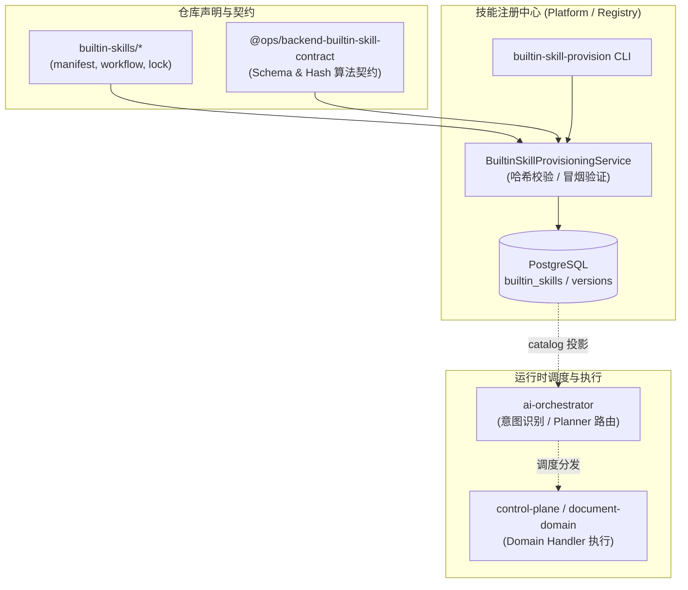

# 平台预置能力资产库 (Platform Builtin Skill Bundles)

本目录为 Ops Automation 平台的**开箱即用预置能力资产库 (Built-in Skill Bundles Source of Truth)**。

> [!NOTE]
> 本目录为**纯声明式资产包（Declarative Asset Repository）**，不包含构建代码或 npm 包定义（没有 `package.json`）。它与 `packages/backend-contracts/builtin-skill-contract`（契约定义层）协同工作，由 `skill-registry` 服务及 `platform` 命令行工具解析校验后，作为种子数据加载至数据库中供全系统调度运行。

---

## 一、核心定位与架构考量

### 1. 为什么位于仓库根目录？
- **跨微服务领域资产**：内置能力覆盖文档处理（PDF/Markdown）、邮件通信、全网搜索、工作区管理等多个业务域，属于平台级全局资产，不依附于某一个单一微服务。
- **与业务代码分离的只读声明源**：保持能力的声明式定义（元数据、Schema、意图关键词、编排定义）与微服务执行代码解耦，便于版本固化、安全审计和内容指纹签名。
- **部署与初始化第一级资源**：地位与根目录下的 `database/`（数据库治理中心）和 `docker/`（容器部署）一致，作为平台部署与初始化（Provisioning）时的基石资产。

### 2. 系统协同链路



---

## 二、目录结构一览

```text
builtin-skills/
├── schemas/                                       # 声明式 Schema 规范
│   └── builtin-workflow-skill.v1.schema.json      # Manifest JSON Schema 定义 (v1alpha1 / v1)
│
├── platform.document.markdown-artifact-writer/    # [文档域] Markdown 成果物生成与持久化
├── platform.document.pdf-content-extractor/       # [文档域] PDF 文本与元数据提取
├── platform.document.pdf-create/                  # [文档域] 根据 HTML/模板生成 PDF
├── platform.document.pdf-merge/                   # [文档域] 多 PDF 文件合并
├── platform.document.pdf-split/                   # [文档域] PDF 分页拆分
│
├── platform.email.messages/                       # [邮件域] 邮件检索与列表拉取
├── platform.email.send/                           # [邮件域] 邮件发送
├── platform.email.update/                         # [邮件域] 邮件状态更新与标记
│
├── platform.notification.internal-message/        # [通知域] 站内信/内部通知推送
│
├── platform.search.web/                           # [搜索域] 实时全网检索与新闻资讯
└── platform.workspace.explorer/                   # [工作区] 工作区节点与文件树探测
```

---

## 三、标准能力包规范 (Bundle Anatomy)

每个能力包文件夹命名严格遵循 `platform.<domain>.<action>` 规范，内部必须包含以下标准文件：

```text
platform.<domain>.<action>/
├── manifest.yaml           # 能力元数据、Schema 契约与意图关键词 (核心声明文件)
├── workflow.json           # 工作流定义或执行路由 (针对 workflow 类型能力)
├── bundle-lock.json        # 资产完整性锁文件 (包含整包 SHA-256 签名与文件指纹)
└── fixtures/
    └── smoke-input.json    # 冒烟验证标准入参 (用于发布与环境部署自检)
```

### 1. `manifest.yaml` (核心元数据)
遵循 `apiVersion: platform.ops/v1alpha1` 或 `v1`：
- **`metadata`**: 包含唯一标识 `key`、展示名称 `displayName`、所有者 `owner`、分类标签等。
- **`spec.definitionVersion`**: 语义化版本号（如 `1.0.3`）。
- **`spec.lifecycle`**: 生命周期状态（`experimental` | `stable` | `deprecated`）。
- **`spec.planner`**: AI Planner 编排配置，定义 `triggerKeywords`（意图触发词列表）、`matchSummary`、`runtimeType` 等。
- **`spec.contracts`**: 输入/输出 JSON Schema 强类型约束。
- **`spec.runtime`**: 运行时适配器路由（如 `builtin:workflow`）及绑定的 `handlerKey`。

### 2. `bundle-lock.json` (防篡改完整性锁)
发布时生成的密码学签名，防止资产包在构建、分发或运行时被非法篡改：
```json
{
  "capabilityKey": "platform.search.web",
  "definitionVersion": "1.0.3",
  "definitionDigest": "sha256:7a6ae646457c0653cfcdd8156587cfc69557d84c260cb631c3b3d8ce01c165f7",
  "fileHashes": {
    "manifest.yaml": "sha256:0c03ba8496b2e64b7b3d0bf3801f6dfaa8c4a7afc2505dffa7c37abfdb45a24e",
    "workflow.json": "sha256:e64122599db66239add4c4c4be9b3cda2348feb2e34a7606358920ae4024faab",
    "fixtures/smoke-input.json": "sha256:ca78d5a5495c10449810f70a115362837e363c329ee3b360354ec1ae8423929a"
  },
  "createdAt": "2026-09-02T00:00:00.000+08:00"
}
```
- **`definitionDigest` 计算规则**：
  将 `manifest.yaml` 内容、`workflow.json`（若有）以及 `fixtures/` 下按字典序排序的所有文件内容连续追加至 SHA-256 哈希器中计算得出。

---

## 四、生命周期与 CLI 管理工具

平台通过 `apps/backend/platform/src/commands/` 提供了内置能力的完整运维工具链：

### 1. 预置导入能力包到数据库 (Provision)
将指定能力包验证哈希、执行冒烟测试并入库注册：
```bash
# 从仓库根目录执行
pnpm --filter @ops/platform exec ts-node src/commands/builtin-skill-provision.command.ts builtin-skills/platform.search.web full
```

### 2. 导出数据库中的能力为包 (Export)
将数据库中已激活的能力版本逆向导出为标准 Bundle：
```bash
pnpm --filter @ops/platform exec ts-node src/commands/builtin-skill-export.command.ts platform.search.web ./exported-skills/platform.search.web
```

### 3. 激活与版本回滚 (Activate & Rollback)
```bash
# 激活指定版本
pnpm --filter @ops/platform exec ts-node src/commands/builtin-skill-activate.command.ts platform.search.web 1.0.3

# 回滚到上一稳定版本
pnpm --filter @ops/platform exec ts-node src/commands/builtin-skill-rollback.command.ts platform.search.web
```

### 4. 自动化锁与完整性校验测试
```bash
# 校验搜索能力 Bundle 指纹与意图关键词
pnpm --filter @ops/platform test test/web-search-builtin-skill-bundle.test.ts

# 校验 PDF 能力 Bundle 集群
pnpm --filter @ops/platform test test/pdf-builtin-skill-bundles.test.ts

# 校验邮件能力 Bundle 集群
pnpm --filter @ops/platform test test/email-builtin-skill-bundle.test.ts
```

---

## 五、新增内置能力的标准开发流程

若需要为平台新增一项内置能力（例如 `platform.data.sql-runner`）：

1. **创建能力包目录**：
   在 `builtin-skills/` 下新建 `platform.data.sql-runner`。
2. **编写 `manifest.yaml`**：
   按照 `schemas/builtin-workflow-skill.v1.schema.json` 规范定义元数据、Schema 与意图触发词。
3. **实现运行时 Handler**：
   在 `control-plane` 或对应的能力域服务（如 `apps/backend/capabilities/...`）中实现 `BuiltinSkillHandler` 接口，并注册对应的 `handlerKey`。
4. **准备冒烟测试用例**：
   创建 `fixtures/smoke-input.json` 提供一组极简的合法测试参数。
5. **计算并生成 `bundle-lock.json`**：
   计算各文件 SHA-256 指纹及整包 `definitionDigest`，写入 `bundle-lock.json`。
6. **编写单元测试**：
   在 `apps/backend/platform/test/` 下添加针对该 bundle 的测试，确保 CI/CD 自动拦截文件篡改与配置漂移。
7. **执行 Provision**：
   在发布脚本或本地环境运行 `builtin-skill-provision.command.ts` 导入数据库生效。
