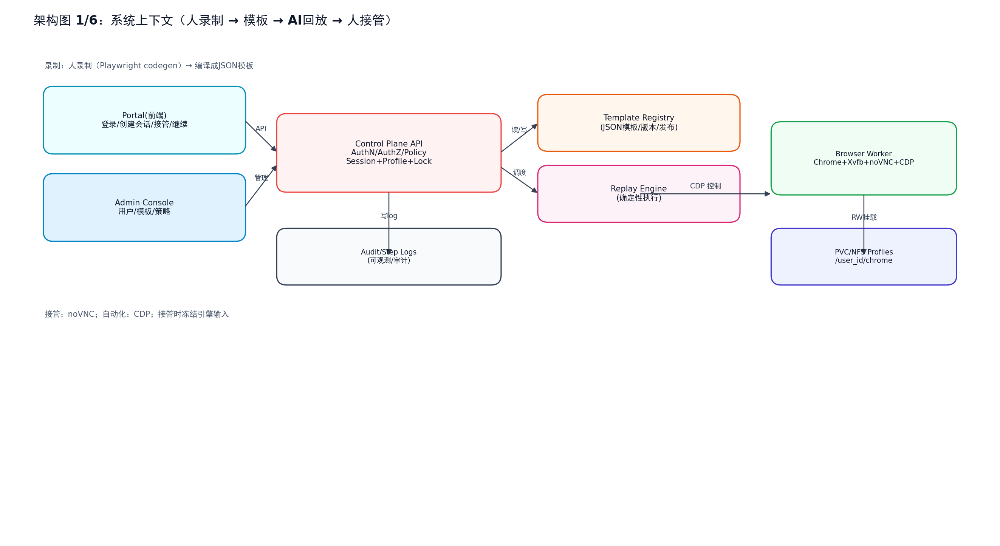
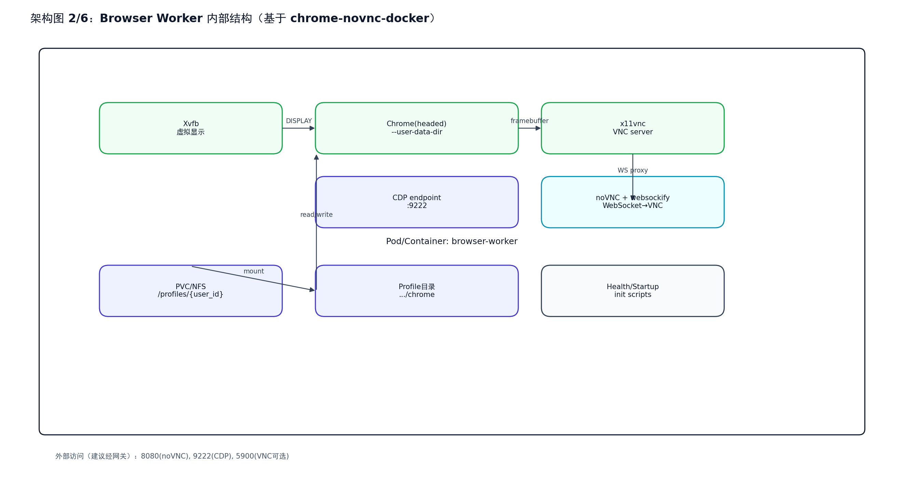
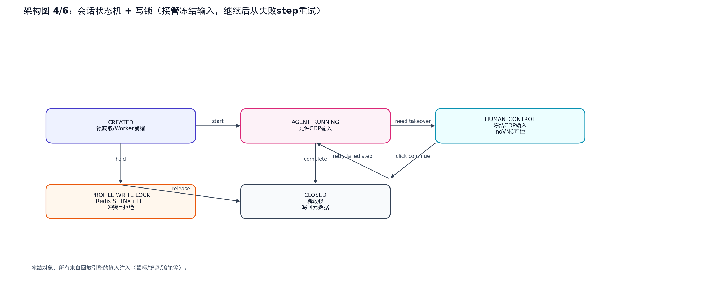
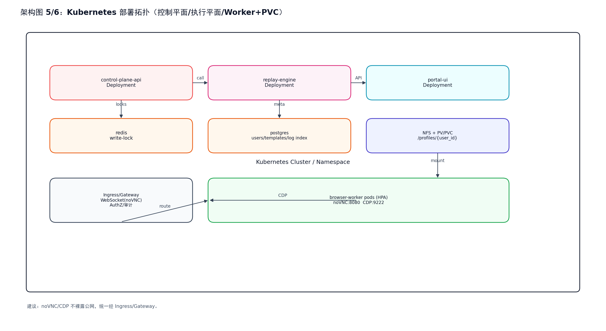
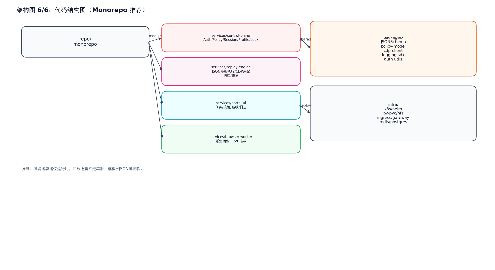

# 浏览器工作负载自动化平台（Browser Control Plane）
**Master 文档 v1.0（需求定义 + 架构图 + 项目结构 & 技术栈）**  
日期：2026-03-31  

> 本文合并：
> - 《需求定义/要件定义 v1.0》
> - 《项目文件夹结构 & 推荐技术栈 v1.0》
> - 6 张架构图（png）

---

## 目录
- [A. 架构图总览](#a-架构图总览)
- [B. 需求定义（SRS）](#b-需求定义srs)
- [C. 项目文件夹结构 & 推荐技术栈](#c-项目文件夹结构--推荐技术栈)
- [D. 附录：文件清单](#d-附录文件清单)

---

## A. 架构图总览
> 说明：下列图片与本 MD 文件放在同一目录（下载后保持同目录即可正常显示）。

### 架构图 1：系统上下文（人录制 → 模板 → AI回放 → 人接管）


### 架构图 2：Browser Worker 内部结构（基于 chrome-novnc-docker）


### 架构图 3：端到端数据流/时序（录制→发布→回放→接管→继续→关闭写回）


### 架构图 4：会话状态机 + 写锁（接管冻结输入，继续后从失败 step 重试）


### 架构图 5：Kubernetes 部署拓扑（控制平面/执行平面/Worker+PVC）


### 架构图 6：代码结构图（Monorepo 推荐）


---

## B. 需求定义（SRS）

**需求定义 / 要件定义 v1.0**  
日期：2026-03-31  

> 本文为“人录制为主 + AI 编排回放 + 人工接管”的企业内浏览器自动化系统之完整需求定义（SRS/PRD+高层设计），用于立项评审与详细设计输入。

---

## 1. 背景与目标

### 1.1 背景
- 复杂业务流程（如企业系统、门户、审批流）自动化常因 UI 变化、验证码/风控、人机协同等问题导致传统脚本维护成本高。
- 需要一套 **“先由人录制正确流程 → 固化为稳定模板 → 运行期由 AI 做参数/异常编排 → 引擎确定性回放 → 必要时人接管”** 的平台，兼顾稳定性、可控性与企业治理。

### 1.2 总体目标（In-scope）
- **录制以“人录制”为主**：针对复杂业务流程录制并固化为可版本化模板。citeturn18search135turn18search140
- **回放由 AI 编排**：AI 负责参数识别、模板选择、参数嵌入、异常分流；浏览器动作由确定性引擎执行。
- **人工接管**：遇到验证码/MFA/异常分支时，允许员工通过 noVNC 实时接管同一会话，并在“点击继续”后由引擎从失败 step 重试。
- **企业级权限/治理**：初期账号密码，自建用户库；区分员工与回放引擎（Agent/Service identity）；管理员配置权限与 policy。
- **Profile 持久化**：每员工独立浏览器 profile，PVC/NFS 挂载；默认写回但 **仅在 session close 时确认写回**；并发写锁冲突 **直接拒绝**。
- **部署**：Kubernetes（K8s）。

### 1.3 非目标（Out-of-scope，当前阶段不做）
- SSO/OIDC 与 LDAP/AD：规划为后续对接（本期仅自建用户库）。
- 强证据链（全程录像/trace 强制）：本期以 step-level log 为主；可选后续引入 Playwright trace viewer。citeturn5search21turn5search22
- 默认网络/下载/剪贴板为允许（本期提供策略开关与治理框架），白名单/更强 DLP 为后续迭代。

---

## 2. 术语与定义

- **Template（模板）**：JSON 格式、接近 Playwright 操作语义的步骤集合（step），包含定位器、动作、参数占位符、断言、重试、失败策略。
- **Recorder（录制器）**：以 Playwright codegen / VSCode test generator 为基础的人类录制能力，可生成脚本骨架并优先使用 role/text/test-id 等定位器。citeturn18search135turn18search140
- **Replay Engine（回放引擎）**：确定性执行模板步骤，通过 CDP 驱动浏览器；支持 step 级重试、断言、异常分流。
- **AI Orchestrator（AI 编排器）**：回放期负责参数识别/模板选择/异常决策，不直接做自由式 DOM 操作。
- **Browser Worker**：运行时会话节点（基于 `johnymoo/chrome-novnc-docker` 派生），提供 noVNC 供接管与 CDP 供自动化。citeturn9search103
- **Profile**：员工浏览器数据目录（Chrome user-data-dir），持久化到 PVC/NFS。
- **Write Lock（写锁）**：同一用户 profile 同一时间仅允许一个 RW 会话，冲突直接拒绝。
- **Takeover（接管）**：进入 HUMAN_CONTROL 状态；冻结回放引擎输入，允许 noVNC 输入，直到“点击继续”。冻结对象包括 CDP Input 注入事件能力。citeturn5search41turn5search46

---

## 3. 用户角色（Actors）与权限边界

### 3.1 角色
1. **Employee（员工）**：登录 Portal、创建任务会话、查看日志、接管/继续。
2. **Admin（管理员）**：用户/角色/权限管理；模板治理；策略管理。
3. **Replay Engine Identity（回放引擎身份 / Agent）**：以服务身份执行模板；响应冻结/恢复。
4. **Recorder（录制人员）**：产出模板草稿，经审核发布后供员工使用。

### 3.2 权限边界原则
- 浏览器容器（Worker）**不承载授权决策**；所有权限在控制平面裁决。
- 接管时 **冻结引擎输入**，避免“人/引擎同时注入输入”导致不可预测行为。citeturn5search41turn5search46

---

## 4. 核心需求（Functional Requirements）

### FR-1 认证与授权（初期账号密码）
- 自建用户库（username + password_hash）。
- 区分员工账号与回放引擎账号（Agent）。
- 管理员可配置角色/权限/策略。

### FR-2 模板录制（人录制为主）
- 使用 Playwright codegen / test generator 录制业务流程并生成脚本骨架，优先使用 role/text/test-id 等定位器。citeturn18search135turn18search140

### FR-3 模板编译与格式（JSON / Playwright-like IR）
- 模板格式：JSON。
- 语义定位为主：role/label/text（CSS/XPath 兜底）。
- 每个 step 需：step_id、action、locator、wait、post assertions、retry、on_fail。

### FR-4 模板治理（录制人与执行人不同）
- 状态机：DRAFT → REVIEW → PUBLISHED → DEPRECATED/REVOKED。
- 只有 PUBLISHED 可用于生产回放。

### FR-5 会话创建与写锁（Profile RW，冲突拒绝）
- 一任务一会话。
- 创建会话：AuthZ → 获取 Redis 写锁 → 分配 Worker → 挂载 PVC/NFS profile → 返回 noVNC/CDP 端点。
- 锁冲突：直接拒绝。

### FR-6 回放执行（确定性引擎）
- Replay Engine 解析 JSON 模板并通过 CDP 控制 Worker。
- 每 step 输出 step-level log。

### FR-7 人工接管与继续（冻结输入）
- 进入 HUMAN_CONTROL：冻结引擎输入（CDP Input），允许 noVNC 输入。citeturn5search41turn5search46
- 点击继续：解除冻结，从失败 step 重试。

### FR-8 Profile 写回策略
- 默认写回；仅在 session close 时确认写回与更新元数据。

### FR-9 网络/下载/上传/剪贴板策略
- 默认允许外网、允许下载/上传/剪贴板；后续可配置白名单/更细策略。

### FR-10 审计与日志
- 必须提供 step-level log；员工可看自己的，管理员可全局查询与导出。

---

## 5. 非功能需求（NFR）
- 稳定性：语义定位优先，减少脆弱选择器。citeturn18search135turn18search140
- 安全：授权/锁在控制面；接管冻结输入。citeturn5search41turn5search46
- 可扩展：K8s 部署，Worker 横向扩展。
- 可运维：健康检查、资源限制、TTL、告警与审计。

---

## 6. 系统架构定义（High-level Architecture）

### 6.1 分层
- Control Plane：Auth/RBAC/Policy、Profile Registry、Redis Lock、Session Broker、Audit。
- Execution Plane：AI Orchestrator、Replay Engine（CDP）。
- Runtime Plane：Browser Worker + PVC/NFS Profile Store。

### 6.2 Worker 端口与通道
- noVNC(8080)、VNC(5900可选)、CDP(9222) 与仓库说明一致。citeturn9search103

---

## 7. 数据模型与日志规范（摘要）
- Template：template_id、version、status、params_schema、steps[]。
- Session：session_id、user_id、state、worker_ref、endpoints。
- StepLog：session_id、step_id、action、locator_summary、duration、result、error_class、retry_count、takeover_triggered。

---

## 8. 里程碑
- MVP：账号密码+RBAC；JSON模板；Replay Engine+CDP；noVNC接管+冻结/继续；Redis写锁；PVC/NFS profile；step logs。
- v1：LDAP/AD；白名单；下载/剪贴板限制；trace/截图证据链；模板回归 CI。

---

## C. 项目文件夹结构 & 推荐技术栈

## 项目文件夹结构 & 推荐技术栈（v1.0）

> 本文定义该项目的 **代码组织结构（Monorepo）** 以及 **推荐技术栈**，与《需求定义 v1.0》与架构图保持一致，可直接作为仓库初始化蓝本。

---

## 一、Monorepo 项目文件夹结构

```text
browser-control-plane/
├─ README.md
├─ LICENSE
├─ docs/
│  ├─ requirements/
│  │  └─ Browser-Control-Plane_Requirements_v1.0.md
│  ├─ architecture/
│  │  ├─ diagrams/                 # 系统/数据流/状态机/K8s 架构图
│  │  ├─ permission-matrix.md      # Role × Permission × State
│  │  ├─ state-machine.md
│  │  └─ threat-model.md
│  ├─ runbooks/
│  │  ├─ operations.md
│  │  ├─ incident-response.md
│  │  └─ troubleshooting.md
│  └─ api/
│     └─ openapi.yaml              # Control Plane + Replay Engine API
│
├─ services/
│  ├─ control-plane/               # 控制平面（权限/会话/Profile/锁）
│  │  ├─ src/
│  │  │  ├─ auth/                  # 账号密码（bcrypt），后续可接 LDAP/AD
│  │  │  ├─ rbac/                  # 角色与权限模型
│  │  │  ├─ policy/                # 网络/下载/剪贴板等策略
│  │  │  ├─ sessions/              # create/takeover/resume/close
│  │  │  ├─ profiles/              # Profile 元数据（PVC 路径）
│  │  │  ├─ locks/                 # Redis 写锁（SETNX + TTL）
│  │  │  ├─ templates/             # 模板元数据与发布状态机
│  │  │  ├─ audit/                 # Step-level logs
│  │  │  └─ admin/                 # 管理接口
│  │  ├─ migrations/
│  │  └─ Dockerfile
│  │
│  ├─ replay-engine/               # 确定性回放引擎
│  │  ├─ src/
│  │  │  ├─ dsl/                   # JSON 模板解析与校验
│  │  │  ├─ runner/                # step 执行（retry/assert）
│  │  │  ├─ cdp/                   # Playwright over CDP
│  │  │  ├─ freeze/                # 接管时冻结输入
│  │  │  ├─ ai-orchestrator/       # 参数识别/异常决策
│  │  │  └─ logging/
│  │  └─ Dockerfile
│  │
│  ├─ template-compiler/           # 录制产物 → JSON 模板
│  │  ├─ src/
│  │  │  ├─ ingest/                # Playwright codegen 输入
│  │  │  ├─ normalize/             # 参数化/locator 归一
│  │  │  ├─ assertions/            # 断言规则
│  │  │  └─ export/
│  │  └─ cli/
│  │
│  ├─ portal-ui/                   # 前端 Portal
│  │  ├─ src/
│  │  │  ├─ auth/
│  │  │  ├─ sessions/
│  │  │  ├─ takeover/
│  │  │  ├─ admin/
│  │  │  └─ components/
│  │  └─ Dockerfile
│  │
│  └─ browser-worker/              # 浏览器运行时（noVNC + CDP）
│     ├─ base/                     # 基于 chrome-novnc-docker
│     ├─ overlay/
│     │  ├─ entrypoint.sh
│     │  └─ supervisord.conf
│     └─ Dockerfile
│
├─ packages/
│  ├─ template-schema/             # JSONSchema（模板/Step/Log）
│  ├─ policy-model/                # RBAC/Policy 共享模型
│  ├─ sdk/                         # 外部调用 SDK
│  └─ common/
│
├─ infra/
│  ├─ helm/
│  ├─ k8s/
│  │  ├─ ingress/
│  │  ├─ pv-pvc/
│  │  ├─ networkpolicy/
│  │  └─ hpa/
│  └─ compose/
│
├─ tests/
│  ├─ integration/
│  │  ├─ session-lock/
│  │  ├─ takeover-resume/
│  │  └─ template-replay/
│  └─ regression/
│
└─ tools/
   └─ scripts/
```

---

## 二、推荐技术栈

### 1. 前端（Portal / Admin）
- **React + TypeScript + Vite**
- UI：Ant Design 或 MUI
- 状态管理：TanStack Query
- 实时：SSE（展示 step logs）
- noVNC：新窗口/新 Tab 打开

### 2. 控制平面（Control Plane）
- **Node.js + NestJS**（推荐） / Go / Java Spring Boot
- 数据库：PostgreSQL
- 缓存与锁：Redis（SETNX + TTL）
- 认证：账号密码（bcrypt），后续可接 LDAP/AD

### 3. 回放引擎（Replay Engine）
- **Node.js + playwright-core**（通过 CDP）
- JSON 模板驱动，确定性执行
- 接管时冻结 CDP 输入（鼠标/键盘）

### 4. 模板编译器（Template Compiler）
- Node.js 或 Python
- 输入：Playwright codegen 脚本
- 输出：JSON 模板 + JSONSchema 校验

### 5. 浏览器运行时（Browser Worker）
- 基于 **chrome-novnc-docker** 思路：
  - Xvfb + headed Chrome
  - noVNC（8080）
  - CDP（9222）
- Profile 挂载路径：`/profiles/{user_id}/chrome`

### 6. 基础设施（K8s）
- Kubernetes
- Ingress：nginx / traefik（支持 WebSocket）
- PV/PVC：NFS（Profile 持久化）
- HPA：browser-worker 按需扩缩容

---

## 三、演进路线

- ✅ MVP：账号密码 + JSON 模板 + CDP 回放 + noVNC 接管 + Redis 写锁
- ⏭ v1：LDAP/AD、网络白名单、下载/剪贴板策略
- ⏭ v2：Trace/录像证据链、模板 CI 回归、DLP 集成

---

> 该结构可直接用于仓库初始化，并与需求定义、架构图一一对应。

---

## D. 附录：文件清单
- 需求定义：`Browser-Control-Plane_Requirements_v1.0.md`
- 项目结构与技术栈：`Browser-Control-Plane_Folder-Structure_and_Tech-Stack_v1.0.md`
- 架构图：`diagram_1_system_context.png`（架构图 1：系统上下文（人录制 → 模板 → AI回放 → 人接管））
- 架构图：`diagram_2_worker_internals.png`（架构图 2：Browser Worker 内部结构（基于 chrome-novnc-docker））
- 架构图：`diagram_3_sequence_dataflow.png`（架构图 3：端到端数据流/时序（录制→发布→回放→接管→继续→关闭写回））
- 架构图：`diagram_4_state_machine.png`（架构图 4：会话状态机 + 写锁（接管冻结输入，继续后从失败 step 重试））
- 架构图：`diagram_5_k8s_topology.png`（架构图 5：Kubernetes 部署拓扑（控制平面/执行平面/Worker+PVC））
- 架构图：`diagram_6_code_structure.png`（架构图 6：代码结构图（Monorepo 推荐））
