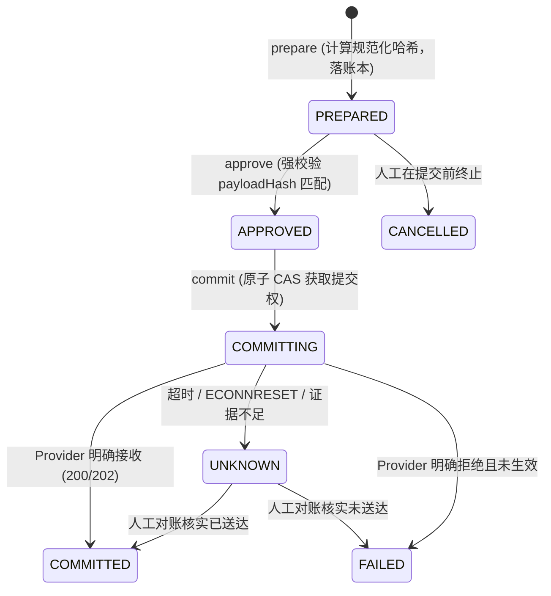

# ADR-001: 外发副作用效果账本与两阶段执行协议 (Outbound Effect Ledger & Two-Phase Protocol)

- **状态**: Accepted / Approved
- **日期**: 2026-09-23
- **决策者**: 核心架构团队 (Platform & Control Plane Architecture Group)
- **关联需求**: [`docs/architecture-hardening-and-governance-guide.md`](../architecture-hardening-and-governance-guide.md) §4, §5

---

## 1. 背景与问题描述 (Context)

在企业自动化场景中，包含大量具有外部副作用的不可逆操作（如发送邮件、调用银行网关、外发 Webhook、拨打电话）。当前系统存在以下隐患：
1. **At-Least-Once 重复风险**：底层调度与 Outbox 仅保证“至少一次”，Worker 在网络写出成功、但状态落库前崩溃时，租约过期后事件会重投，导致重复副作用；
2. **超时等同失败误判**：网络超时（`ETIMEDOUT`）、连接重置（`ECONNRESET`）或服务商已接收但本地未收到 Ack 时，系统盲目归为通用 `FAILED`，诱导自动重试或人工无防备重跑；
3. **缺乏不可变审计绑定**：审批通过的内容与最终外发的内容可能发生漂移。

---

## 2. 决策内容 (Decision)

### 2.1 属主与物理存储
- **属主**: `control-plane`
- **物理表**: `outbound_effect_ledgers` (PostgreSQL，由 Control Plane 拥有并维护)
- **唯一约束**: `UNIQUE (tenant_id, capability_key, idempotency_key)`
- **防篡改约束**: 同一幂等键禁止被不同 `payloadHash` 覆盖；一旦尝试用新负载覆盖已有的准备记录，立刻抛出 `IDEMPOTENCY_PAYLOAD_CONFLICT` 致命异常并告警。

### 2.2 核心最小字段
- `id`: UUID (主键)
- `tenantId`: String (租户隔离)
- `capabilityKey`: String (如 `platform.email.send`)
- `operation`: String (如 `send`, `commit`)
- `idempotencyKey`: String (外部/内部全局唯一调用键)
- `payloadHash`: String (`sha256:...` 规范化 JSON 摘要)
- `canonicalPayloadJson`: Json (规范化键序并清洗后的不可变负载)
- `state`: Enum (`PREPARED`, `APPROVED`, `COMMITTING`, `COMMITTED`, `UNKNOWN`, `FAILED`, `CANCELLED`)
- `attemptCount`: Int (提交尝试次数)
- `provider`: String (如 `smtp`, `microsoft_graph`)
- `providerRequestId`: String (外部服务商跟踪号)
- `providerMessageId`: String (外部消息凭证，如 SMTP Message-ID)
- `errorClassification`: String (如 `OUTBOUND_EFFECT_UNKNOWN`, `NETWORK_TIMEOUT`)
- `resolutionReason`: String (人工对账或系统裁决说明)
- `resolvedBy`: String (裁决人员工 ID)
- `createdAt`, `updatedAt`, `resolvedAt`: Timestamptz

### 2.3 状态机流转与两阶段协议

### 2.4 UNKNOWN 状态处置与调度器联动
- 当捕获到网络超时、连接重置或不确定错误时，Handler 必须返回 `status: 'unknown'` 与 `errorCode: 'OUTBOUND_EFFECT_UNKNOWN'`。
- `DeterministicPlanSchedulerService` 捕获该错误后：
  1. 标记当前步骤 `takeoverTriggered: true`；
  2. 将 Execution 状态置为 `human_control`（`takeoverRequired: true`）；
  3. **冻结后续所有有依赖的计划节点**，禁止自动重试；
  4. 产生审计事件，进入人工运维工单等待裁决。

---

## 3. 影响评估 (Consequences)

### 正向影响 (Positive)
- 杜绝因 Worker 崩溃或网络假死引发的外部副作用重复触发；
- 审批、负载与外发哈希严格绑定，杜绝“审批 A 内容、发送 B 内容”的越权与篡改漏洞；
- 提供了可审计、可追溯的外发历史账本。

### 负向影响与对策 (Negative & Mitigation)
- 写入数据库增加了少许延迟：通过对哈希采用高效内存排序与短事务写入，耗时控制在 5ms 以内；
- 业务调用方需要感知两阶段或传入稳定幂等键：Handler 保留 `direct` 模式作为向下兼容过渡。
