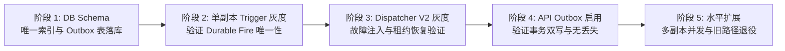

# ADR-003: Durable 调度器生产三角色矩阵、金丝雀发布与回滚规范 (Durable Scheduler Production Topology, Canary Rollout & Safeguards)

- **状态**: Accepted / Approved
- **日期**: 2026-09-23
- **决策者**: 核心架构团队 (Platform & Control Plane Architecture Group)
- **关联需求**: [`docs/architecture-hardening-and-governance-guide.md`](../architecture-hardening-and-governance-guide.md) §6, §11

---

## 1. 背景与问题描述 (Context)

Control Plane 历史架构中，HTTP API 网关、定时任务扫描触发以及 Outbox 异步事件派发运行在同一单体 Node.js 进程中。这导致了三个核心风险：
1. **事件循环资源挤占**：大批量执行分发或定时扫描引发密集 I/O 与 JSON 序列化，挤压核心 HTTP API 的响应延迟；
2. **遗留调度器的并发安全性缺陷**：旧版 `SchedulerService` 的 autocommit 查询中虽然包含 `FOR UPDATE SKIP LOCKED`，但因单语句结束后数据库行锁立即释放，后继网络调用与任务创建脱离事务保护，多副本部署下存在严重的重复触发（Double-Fire）隐患；
3. **缺少生产角色隔离与回滚准则**：在多容器部署时，如果未能严格按角色配置 Feature Flag，容易引发“API 容器偷跑消费者”或“Trigger 容器未启用 Outbox 导致持久化事件无法投递”等配置漂移。

---

## 2. 决策内容 (Decision)

### 2.1 生产环境三角色与 Feature Flag 矩阵
生产部署（`docker-compose.production.yml` 或 Kubernetes Deployment）必须将 Control Plane 分解为三个物理隔离的角色，各角色环境变量矩阵必须严格遵守下表：

| 生产容器/角色 | `EXECUTION_OUTBOX_ENABLED` | `EXECUTION_DISPATCHER_V2_ENABLED` | `SCHEDULE_FIRE_V2_ENABLED` | 职责描述 |
| :--- | :---: | :---: | :---: | :--- |
| **`control-plane-api`** | `true` | `false` | `false` | 仅对外提供 REST/GraphQL API，以事务方式向 `executions` 与 `execution_outbox` 写入数据，**严禁启动消费循环**。 |
| **`execution-dispatcher`** | `true` | `true` | `false` | 专职后台消费者。通过短事务原子 Claim (`SKIP LOCKED`) 获取租约，向 Worker 与 Domain Handler 派发执行任务。 |
| **`schedule-trigger`** | `true` | `false` | `true` | 专职定时器触发器。评估定时/周期规则，以 `(schedule_id, scheduled_at)` 唯一事务写入 `schedule_fires` 并投递 Outbox 事件。 |

> [!IMPORTANT]
> `schedule-trigger` 必须同时开启 `EXECUTION_OUTBOX_ENABLED: true` 与 `SCHEDULE_FIRE_V2_ENABLED: true`。若仅开启后者而未开启 Outbox，Durable Schedule 链路会因无处投递而静默失败。

### 2.2 金丝雀发布阶梯 (Canary Rollout Stages)
升级必须按以下五个阶段严格执行，禁止跨阶段全量推进：

1. **阶段 1：数据底座就绪**：
   - 部署包含 `(schedule_id, scheduled_at)` 唯一约束及 `execution_outbox` 索引的 Schema 迁移；
   - 验证既有查询的向后兼容性。
2. **阶段 2：单副本 Trigger 金丝雀**：
   - 以单副本部署 `schedule-trigger` 并开启 `SCHEDULE_FIRE_V2_ENABLED: true`；
   - 验证连续 24 小时内的定时任务未发生漏发或重发。
3. **阶段 3：Dispatcher V2 与故障注入验证**：
   - 部署 `execution-dispatcher` V2，并执行两种高危故障注入：
     - **Fault-A**：Worker 在 `claim` 租约成功后立即 `SIGKILL`，验证租约到期后其它副本能否安全接管；
     - **Fault-B**：Worker 在外部调用完成、`markPublished` 提交前 `SIGKILL`，验证外发效果账本与 UNKNOWN 机制能否阻断重复副作用。
4. **阶段 4：API Outbox 写入贯通**：
   - 开启 `control-plane-api` 的 Outbox 写入路径，验证业务请求落库与 Outbox 事件处于同一短事务中。
5. **阶段 5：水平扩展与退役旧路径**：
   - `schedule-trigger` 扩容至 2+ 副本，`execution-dispatcher` 扩容至 3+ 副本；
   - 观察 50 并发下无任何锁冲突或事件堆积。

### 2.3 紧急回滚与防双重消费机制 (Rollback & Anti-Dual-Consumption)
- **回滚准则**:
  - 当发现调度异常，优先回滚 `SCHEDULE_FIRE_V2_ENABLED=false`；
  - **防双重消费保底**: 任何时候禁止 V1 调度器（autocommit 轮询）与 V2 调度器（ScheduleFireService）在同一个队列中同时处于 Active 状态。
  - 回滚时，旧实例启动前必须先平滑停止（`SIGTERM`）V2 容器，等待当前租约耗尽或完成，再启动 V1。

### 2.4 旧版 Autocommit 调度器退役时刻表
1. **过渡期（当前）**：旧版 `SchedulerService` 严格限定为单副本运行（`REPLICAS: 1`），仅作为故障回退备用；
2. **锁定期（灰度后 30 天）**：在 V2 连续平稳运行 30 天且无任何 P0/P1 事件后，标记旧调度路径为 `@deprecated`；
3. **物理移除（下一主版本）**：彻底移除 `SchedulerService` 中的 autocommit 轮询方法，仅保留纯 Durable `ScheduleFireService`。

---

## 3. 影响评估 (Consequences)

### 正向影响 (Positive)
- 彻底解决了多副本下调度器并发冲突与重复 Fire 的隐患，平台具备真正的水平弹性扩展能力；
- 实现了读写隔离与负载分离：HTTP 延迟不再受后台繁重调度与派发循环波动的冲击。

### 负向影响与对策 (Negative & Mitigation)
- 运维拓扑中容器数量增加（由 1 个 Control Plane 拆分为 3 类容器）：通过 Compose 与 Helm Chart 统一模板管理，降低配置维护成本；
- 必须严格把控环境变量一致性：CI 门禁与发布前自检脚本加入三角色配置合规性校验。
