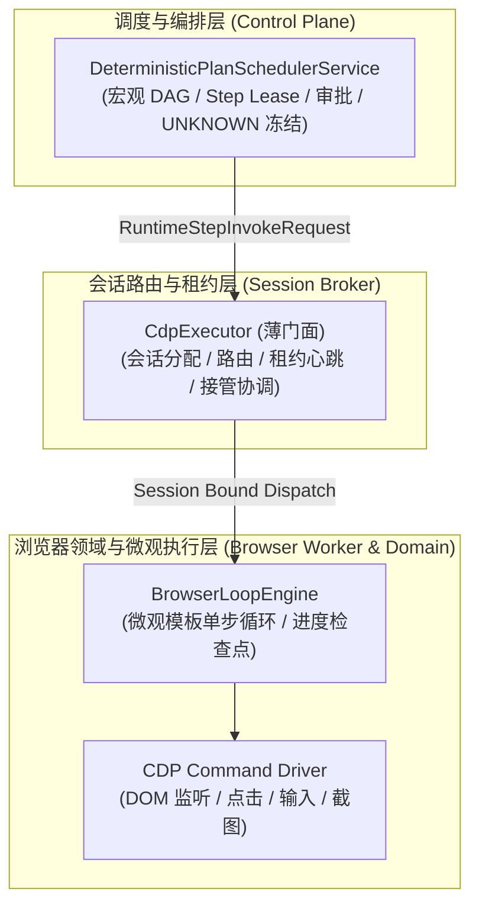

# ADR-005: 浏览器自动化执行权属划分与 CdpExecutor 绞杀者迁移架构 (Browser Automation Execution Ownership & CdpExecutor Strangler Migration)

- **状态**: Accepted / Approved
- **日期**: 2026-09-23
- **决策者**: 核心架构团队 (Platform & Browser Automation Architecture Group)
- **关联需求**: [`docs/architecture-hardening-and-governance-guide.md`](../architecture-hardening-and-governance-guide.md) §8.1, §11

---

## 1. 背景与问题描述 (Context)

在浏览器自动化执行链路中，系统曾存在职责定位与抽象边界的混淆：
1. **执行器双重抽象误解**：曾有观点认为 `control-plane` 中的 `DeterministicPlanSchedulerService` 与 `session-broker` 中的 `CdpExecutor` 属于“重复抽象”，主张将两者全部合并进 Control Plane；
2. **微观与宏观职责混同**：实际上，`DeterministicPlanSchedulerService` 面向宏观计划（DAG 依赖、Step Lease、审批门禁、人工接管、外发效果账本），而 `CdpExecutor` 面向单浏览器会话内的微观循环（CDP 指令流、DOM 变化监听、模板单步执行、错误重试与结果提取）；
3. **单文件复杂度逼近红线**：[`apps/backend/execution-control/session-broker/src/modules/execution/cdp.executor.ts`](../../apps/backend/execution-control/session-broker/src/modules/execution/cdp.executor.ts) 源码当前为 1,174 行，逼近团队代码规范所规定的 1,200 行预警阈值。该文件集成了浏览器动作、DOM 文本抽取、模板多步循环与 HTTP 调度等多种职责；
4. **Session Broker 职责过载**：`session-broker` 的核心领域本应是浏览器实例的分配、生命周期路由、租约心跳、冻结/解冻与协同接管，承担沉重的模板微观循环代码造成其领域职责发散。

---

## 2. 决策内容 (Decision)

### 2.1 架构权属与边界划分 (Domain Boundary Separation)

- **宏观编排器（Control Plane）**：负责跨能力、跨服务的全局计划编排，只向 Session Broker 发送标准的 `RuntimeStepInvokeRequest`（`runtimeType: 'browser'`），不感知 CDP 细节；
- **会话代理（Session Broker）**：合法职责是管理 Chrome/Playwright 实例的生命周期（Allocate / Release / Lock）、Session 租约心跳、状态冻结与人工接管桥接；
- **微观执行引擎（Browser Domain / Worker）**：负责模板内多步循环（Loop Plan）、DOM 选择器匹配、页面变化监听与低阶 CDP 指令下发。

### 2.2 CdpExecutor 绞杀者迁移路线 (Strangler Refactoring Plan)
为避免大刀阔斧重构引入回归缺陷，对 `cdp.executor.ts` 采用**绞杀者模式（Strangler Pattern）**分步拆解：

1. **第一阶段：动作模型与纯解析函数剥离（已基本完成）**：
   - 提取 [`cdp-executor.types.ts`](../../apps/backend/execution-control/session-broker/src/modules/execution/cdp-executor.types.ts)（类型定义）；
   - 提取 [`cdp-html-text.ts`](../../apps/backend/execution-control/session-broker/src/modules/execution/cdp-html-text.ts)（HTML 净化与文本提取纯算法）。
2. **第二阶段：微观循环编排独立化**：
   - 将 `executeLoop()`、`executeStepWithRetry()` 等循环逻辑下沉至独立的 `BrowserLoopEngine` 服务；
   - 确保 `cdp.executor.ts` 主文件行数降至 **600 行以内**。
3. **第三阶段：CDP 通讯与浏览器执行向 `browser-worker` 下沉**：
   - 将具体的 HTTP `postJson` 与 CDP 命令序列下沉为可插拔的 `BrowserDriver` 接口；
   - 统一通过 `browser-worker` 承接执行。
4. **第四阶段：`session-broker` 保留精简门面**：
   - `session-broker` 中的 `CdpExecutor` 退化为薄门面（Facade $\le 200$ 行），仅负责校验 Session 租约、注入认证凭证并转发请求。

### 2.3 检查点、取消信号与崩溃恢复模型
- **进度检查点（Checkpointing）**：模板多步循环的每次迭代向外汇报 `iterationIndex`、`collectedItemsCount` 与 `lastSuccessStepId`，供宏观调度器展示与断点恢复；
- **心跳与租约失效（Session Lease Timeout）**：会话租约每 5 秒心跳续期一次。若 `browser-worker` 进程崩溃或页面卡死导致租约超时，Session Broker 立即释放失效会话，Control Plane 将步骤转为 `takeover_required`；
- **取消信号透传（Cancelation Propagation）**：当用户在前端或 Control Plane 终止执行时，标准 `AbortSignal` 经 HTTP 传至底层 CDP Driver，立刻发出 `Page.stopLoading` 并关闭会话，防止浏览器僵尸进程驻留。

---

## 3. 影响评估 (Consequences)

### 正向影响 (Positive)
- 根除了“两个执行器属于重复造轮子”的认知偏差，边界职责清晰明确；
- 避免了核心源码文件突破 1,200/1,600 行代码复杂度门禁红线；
- 浏览器微观执行具备了细粒度的进度检查点和租约容灾能力。

### 负向影响与对策 (Negative & Mitigation)
- 拆分后增加了模块间的调用跳转：通过在同一模块目录内保持清晰的接口定义（`cdp-executor.interface.ts`）与单元测试覆盖，确保维护体验顺畅。
