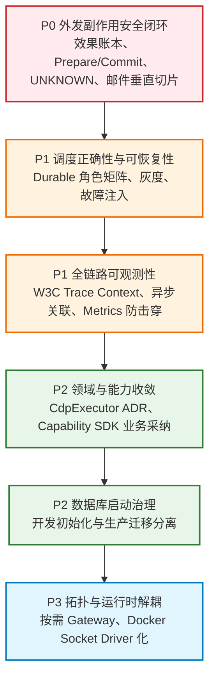

# 架构治理与生产加固落地指南 (Architecture Hardening & Governance Guide)

> 版本：v1.4（2026-09 架构整改与代码加固版）  
> 状态：Proposed / In Progress — Hardening In Flight (代码级 4 项 P0 与 2 项 P1 审查整改已全部闭环，待准生产环境联调验证)  
> 适用对象：平台核心架构师、后端研发团队、基础架构与运维工程师  
> 关联事实源：[`PROJECT_OVERVIEW.md`](PROJECT_OVERVIEW.md)、[`project_architecture_redesign.md`](project_architecture_redesign.md)、[`schema-ownership.json`](../database/schema-ownership.json)

---

## 1. 目标、范围与结论强度

本指南基于 2026-09 对源码、Compose 角色配置、数据库迁移入口与关键执行链路的复核。目标不是重画架构，而是按风险优先级完成三件事：

1. 先关闭外发副作用可能重复执行、结果不确定却被当作失败的生产风险；
2. 再固化调度并发、链路追踪、数据库迁移等运行基线；
3. 最后推进领域归位、能力 SDK 采纳和云原生拓扑演进。

仓库已经具备 Durable Outbox、Schedule Fire、Capability SDK、生产角色隔离等重要基础，但这些基础尚未全部形成端到端闭环。因此，本指南是**实施提案与验收基线**，不是“现状已经满足生产安全要求”的认证。进入编码前，仍需完成第 4 节列出的 ADR 与契约决策。

---

## 2. 关键架构事实与认知校准

| 关键领域 | 容易出现的误判 | 源码级事实与治理结论 |
| :--- | :--- | :--- |
| **Outbox 语义** | “使用 DB Outbox 就等于 Exactly-Once” | 当前只能形成 **At-Least-Once** 投递。原子 Claim（`SKIP LOCKED` + 租约更新）可避免同一时刻被多个消费者领取，但消费者在外部动作完成、`markPublished` 持久化之前崩溃时，租约到期后消息会**重新具备投递资格**。终局防重必须由业务幂等与外发效果账本共同承担。 |
| **旧 Scheduler 锁** | “查询里有 `FOR UPDATE SKIP LOCKED` 就天然支持多实例” | 旧路径在 autocommit 单语句中查询，语句结束后行锁释放，后续处理不受该锁保护。优先切换到 `ScheduleFireService`；遗留路径在未实现短事务 Claim/Lease 前，只允许单副本运行。 |
| **外发副作用** | “失败后只是返回错误，不会重复发送” | 当前邮件处理器未消费调用方传入的幂等键，也没有持久化的 Prepare/Commit/UNKNOWN 闭环。崩溃恢复、Step Lease 重新拉起或人工重试均可能再次触发外发。 |
| **Control Plane 网关职责** | “网关和调度代码同仓，所以生产必然互相争抢事件循环” | 生产 Compose 已按 `api`、`dispatcher`、`schedule` 角色拆成独立容器，进程级隔离成立。是否再拆独立 Gateway 应由流量、故障域和插件治理需求决定，不是当前 P0。 |
| **浏览器执行边界** | “两个执行器是重复抽象，应全部并入 Control Plane” | `DeterministicPlanSchedulerService` 负责宏观 DAG、Lease、审批与状态推进；`CdpExecutor` 负责浏览器模板内的原子动作和微观循环。问题是后者位于 `session-broker` 的职责边界内，而不是两个执行器抽象重复。 |
| **Trace 现状** | “仓库没有链路追踪” | Control Plane 与 AI Orchestrator 已有局部 Trace 提取或传播逻辑；真正缺口是 Proxy、跨服务 HTTP、Outbox 与工作流之间缺少统一、可验证的上下文闭环。 |
| **Capability 扩展** | “需要重新设计一套插件标准” | `@ops/capability-sdk`、Manifest、digest、Runtime Adapter 等骨架已经存在。当前问题是业务采纳率与迁移闭环不足，不应另起一套协议。 |
| **调度并发控制** | “主要依赖 Redis 分布式锁” | Outbox 与 Durable Scheduler 的关键并发控制主要依赖 PostgreSQL 事务、唯一约束与 `FOR UPDATE SKIP LOCKED`。Redis 不是该链路正确性的唯一事实源。 |

---

## 3. 风险优先级与演进路线



优先级含义：P0 是生产防损前置条件；P1 是水平扩展和故障定位前置条件；P2 是结构性收敛；P3 必须由真实容量、隔离与部署数据驱动。

---

## 4. 架构设计决策记录 (Architecture Decision Records)

本方案关联的五大核心 ADR 均已定稿并完成团队对齐：

1. **[ADR-001: 外发副作用效果账本与两阶段执行协议](adr/ADR-001-outbound-effect-ledger.md)**  
   - **状态**: Accepted | **属主**: Control Plane 架构组  
   - 固化外发效果账本数据模型、`UNIQUE (tenant_id, capability_key, idempotency_key)` 唯一约束、两阶段状态机与 UNKNOWN 调度器阻断协议。
2. **[ADR-002: W3C 分布式全链路追踪与异步上下文传播规范](adr/ADR-002-trace-context-propagation.md)**  
   - **状态**: Accepted | **属主**: 可观测性与 Control Plane 架构组  
   - 固化 W3C `traceparent`/`tracestate` 强校验、Proxy 子 Span 派生、Outbox Consumer 异步链路关联以及 Metrics 30 秒快照防击穿。
3. **[ADR-003: Durable 调度器生产三角色矩阵、金丝雀发布与回滚规范](adr/ADR-003-durable-scheduler-rollout.md)**  
   - **状态**: Accepted | **属主**: 调度核心架构组  
   - 固化 `control-plane-api`、`execution-dispatcher`、`schedule-trigger` 三角色环境变量矩阵、金丝雀发布序列与旧版 autocommit 调度器退役时刻表。
4. **[ADR-004: Capability 数据库 Schema 治理、唯一迁移权限与零 DDL 生产准则](adr/ADR-004-capability-db-migration.md)**  
   - **状态**: Accepted | **属主**: 数据库治理与平台组  
   - 固化生产唯一迁移权限（Release Job）、彻底清退业务容器 `prisma db push`、`schema-ownership.json` 全量登记与前滚修复原则。
5. **[ADR-005: 浏览器自动化执行权属划分与 CdpExecutor 绞杀者迁移架构](adr/ADR-005-browser-execution-ownership.md)**  
   - **状态**: Accepted | **属主**: 浏览器自动化架构组  
   - 划清宏观 DAG 编排（Control Plane）与微观动作循环（Browser Domain / Worker）边界，确立 Session Broker 薄门面定位与 `cdp.executor.ts` 四阶段绞杀重构路线。

---

## 5. P0：外发副作用安全闭环

> 目标：对发信、外呼、Webhook 和其他不可逆外部写入建立可审计、防重复、可人工裁决的统一协议。

### 5.1 协议边界

这里的 Prepare/Commit 是**应用层外发协议**，不是能让第三方 Provider 参加数据库事务的分布式 2PC：

1. `prepare`：规范化输入，生成 `canonicalPayload` 与不可变 `payloadHash`，写入外发效果账本；
2. `approve`：审批必须绑定 `effectId + payloadHash`，内容发生变化后原审批失效；
3. `commit`：先以条件更新取得提交权，再调用 Provider；同一幂等键不得并发提交；
4. `resolve`：根据 Provider 回执或人工对账，将不确定结果收敛为已接收、明确失败或取消。

SDK 中的字段名是 `sideEffectClass`。所有 `sideEffectClass: 'external_write'` 的能力必须声明其幂等策略、效果账本策略和 UNKNOWN 处置策略；仅在 Manifest 中打标签并不能自动获得安全性。

### 5.2 建议状态模型

| 状态 | 含义 | 是否允许自动再次调用 Provider |
| :--- | :--- | :--- |
| `PREPARED` | Payload 已冻结并写入账本，尚未授权 | 否 |
| `APPROVED` | 审批与当前 `payloadHash` 匹配 | 可由单一提交者进入 `COMMITTING` |
| `COMMITTING` | 已取得提交权，Provider 调用可能正在进行 | 否 |
| `COMMITTED` | Provider 已明确接收请求；不等同于最终送达 | 否 |
| `UNKNOWN` | 请求可能已经到达 Provider，但本地没有可靠最终证据 | 否，必须对账或人工裁决 |
| `FAILED` | 有证据表明 Provider 未接受该动作 | 仅由显式策略发起新的提交尝试 |
| `CANCELLED` | 在调用 Provider 前终止 | 否 |

不得把所有 5xx、连接异常或超时机械归为同一种结果：

- 本地校验失败、鉴权前失败、Provider 明确拒绝且确认未生效，可记为 `FAILED`；
- 请求写出后超时、连接重置、Provider 已接收但本地回执落库前崩溃，应记为 `UNKNOWN`；
- HTTP `202 Accepted` 只证明 Provider 接收请求，不证明邮件已最终送达；账本应分别保存“已接收”和后续投递证据。

### 5.3 外发效果账本最小字段

- `effectId`、`tenantId`、`capabilityKey`、`operation`；
- `idempotencyKey`、`canonicalPayload` 或受控引用、`payloadHash`；
- `state`、`version`、`preparedAt`、`approvedAt`、`commitStartedAt`、`resolvedAt`；
- `approvalId`、`approvedPayloadHash`、`provider`、`providerRequestId`、`providerMessageId`；
- `attemptCount`、最近一次错误分类、人工裁决人及审计原因。

数据库至少建立 `(tenant_id, capability_key, idempotency_key)` 唯一约束。同一键若携带不同 `payloadHash`，必须拒绝并告警，不能覆盖旧记录。

### 5.4 Provider 幂等边界

当前 [`email-send.handler.ts`](../apps/backend/execution-control/control-plane/src/modules/execution/adapters/email/email-send.handler.ts) 的处理器签名从第二个参数接收 `idempotencyKey`，并非 `request.idempotencyKey`。改造时必须贯通真实调用签名与契约类型。

`client-request-id`、SMTP `Message-ID` 等字段默认只作为关联与对账证据。除非 Provider 明确承诺并验证服务端去重语义，否则不得把它们当作幂等保证。Microsoft Graph `sendMail` 的 `202` 也只能作为“请求已接受”证据。

### 5.5 邮件垂直切片实施顺序

- [x] 明确外发效果账本的 Schema 属主与迁移（已定稿于 [ADR-001](adr/ADR-001-outbound-effect-ledger.md)，归属 `control-plane`）；
- [x] 在 [`builtin-skill-contract`](../packages/backend-contracts/builtin-skill-contract/src/index.ts) 与 [`runtime-capability-contract`](../packages/backend-contracts/runtime-capability-contract/src/index.ts) 之间明确 UNKNOWN/挂起结果由哪一层表达，避免只给 Handler 临时增加一个上层无法消费的字段；
- [x] 改造邮件 Handler：消费第二参数中的 `idempotencyKey`，按错误证据分类，保存 Provider 关联信息；
- [x] 改造 [`DeterministicPlanSchedulerService`](../apps/backend/execution-control/control-plane/src/modules/execution/plan-runtime/deterministic-plan-scheduler.service.ts)：识别 `UNKNOWN`，冻结后继节点并创建可审计的人工处置任务；
- [x] 审批与 `payloadHash` 强绑定，人工“确认已发送 / 确认未发送 / 取消”必须落审计记录（已定稿于 [ADR-001](adr/ADR-001-outbound-effect-ledger.md) 状态流转模型）；
- [x] 邮件闭环验证完成后，再扩展至 Webhook、外呼及其他 `external_write` Capability（已落地静态门禁脚本 `pnpm run validate:outbound-side-effects` 持续守护）。

---

## 6. P1：调度正确性与可恢复性

> 目标：让 Schedule Fire 与 Execution Outbox 在多副本下具备明确的唯一性、领取权和崩溃恢复语义。

### 6.1 Durable 路径事实

[`ScheduleFireService`](../apps/backend/execution-control/control-plane/src/modules/scheduler/schedule-fire.service.ts) 通过事务、`(schedule_id, scheduled_at)` 唯一性和 Outbox 事件建立 Durable 路径；[`ExecutionOutboxService`](../apps/backend/execution-control/control-plane/src/modules/execution/outbox/execution-outbox.service.ts) 使用短事务 Claim 与租约完成消费者分流。

旧 [`SchedulerService`](../apps/backend/execution-control/control-plane/src/modules/scheduler/scheduler.service.ts) 的 autocommit 查询不能为后续处理持续持锁。不要用“把网络调用和整段业务处理全部包入数据库事务”修补：这会形成长事务、锁膨胀和嵌套事务风险。灰度期应选择以下之一：

- 将旧路径限制为单副本；
- 为旧路径实现短事务原子 Claim/Lease；
- 尽快让旧路径只保留显式回滚开关并退役。

### 6.2 角色与 Feature Flag 矩阵

不能在所有容器中一刀切开启三个开关。期望矩阵如下：

| 生产角色 | `EXECUTION_OUTBOX_ENABLED` | `EXECUTION_DISPATCHER_V2_ENABLED` | `SCHEDULE_FIRE_V2_ENABLED` |
| :--- | :---: | :---: | :---: |
| `control-plane-api` | `true` | `false` | `false` |
| `execution-dispatcher` | `true` | `true` | `false` |
| `schedule-trigger` | `true` | `false` | `true` |

当前 [`docker-compose.base.yml`](../docker/compose/docker-compose.base.yml) 已有按角色启用的基础；[`docker-compose.production.yml`](../docker/compose/docker-compose.production.yml) 仍需核对 `schedule-trigger` 是否同时启用 Outbox，因为 Durable Schedule 条件依赖 `EXECUTION_OUTBOX_ENABLED` 与 `SCHEDULE_FIRE_V2_ENABLED`。

### 6.3 发布与回滚顺序

1. 先发布 Schema、唯一约束和兼容旧代码的读取逻辑；
2. 以单副本开启 `schedule-trigger` Durable 路径，验证测试计划与重复 Fire；
3. 开启 Dispatcher V2，注入 Claim 后崩溃、执行后落库前崩溃等故障；
4. 开启 API 的 Outbox 写入路径，确认无双写与事件丢失；
5. 再水平扩展 `schedule-trigger` 与 `execution-dispatcher`；
6. 观察期结束后关闭旧路径；若回滚，必须保证新旧消费者不会同时消费同一逻辑事件。

至少验证：50 并发下同一 `(schedule_id, scheduled_at)` 仅生成一个 Fire；Claim 后进程退出可在租约到期后恢复；Outbox 重新投递不造成外部副作用重复。

---

## 7. P1：生产全链路可观测性

> 目标：使用标准上下文贯通同步与异步链路，同时避免监控 Scrape 对主库形成周期性冲击。

### 7.1 Trace Context 规则

[`trace.interceptor.ts`](../apps/backend/execution-control/control-plane/src/common/interceptors/trace.interceptor.ts) 已能读取 `x-trace-id` 或 `traceparent`，但不能直接把任意 `req.traceId` 拼成 W3C `traceparent`。W3C Trace Context 要求 `trace-id` 为 32 位小写十六进制、`parent-id` 为 16 位小写十六进制，并且每个新 Span 使用新的 Span ID。

实施规则：

- `x-trace-id` 可继续作为人类可读的关联 ID，但必须与 W3C Trace Context 分开处理；
- [`ProxyController`](../apps/backend/execution-control/control-plane/src/modules/proxy/proxy.controller.ts) 应校验并转发合法的 `traceparent` / `tracestate`，通过标准追踪库（优先 OpenTelemetry）创建子 Span；
- 禁止手工拼接固定 `parent-id`，禁止把 UUID 连字符形式直接塞入 W3C `trace-id`；
- 先盘点 Control Plane、AI Orchestrator 与各 Capability 已有实现，再统一封装，避免重复拦截器继续分叉；
- Outbox 保存受控的 Trace Context。消费者创建新的 Consumer Span，并按消息语义选择父子关系或 Span Link，不复用生产者 `spanId`；
- 日志至少结构化输出 `traceId`、`executionId`、`stepId`、`outboxId`、`scheduleFireId`，避免只靠字符串前缀检索。

标准依据：[W3C Trace Context](https://www.w3.org/TR/trace-context/)。

### 7.2 Metrics 防击穿

[`MetricsService`](../apps/backend/execution-control/control-plane/src/modules/metrics/metrics.service.ts) 中昂贵的数据库聚合应缓存 30～60 秒，但不要缓存整份 Metrics 文本：进程 uptime、内存、请求计数等应保持实时。

实现应缓存“数据库聚合快照”，并增加 in-flight Promise 去重，避免缓存过期瞬间被并发 Scrape 击穿。若未来改成预聚合计数器，需要明确与数据库事实值的校准机制。

---

## 8. P2：领域边界与 Capability SDK 收敛

### 8.1 CdpExecutor 归位

[`cdp.executor.ts`](../apps/backend/execution-control/session-broker/src/modules/execution/cdp.executor.ts) 当前约 1173 行，包含浏览器动作、DOM 处理与微观循环。迁移方向是下沉，但目标模块不能仅凭目录名称决定。

先通过 ADR 明确：

- 模板执行循环由 `browser-domain` 进程内库还是 `browser-worker` 运行时拥有；
- `runtime-facade` 继续作为稳定契约/桥接层，还是承担实现；
- 循环进度、重试与崩溃恢复在哪里持久化；
- 跨 HTTP/消息边界时如何传递 Session Lease 和取消信号。

迁移采用 Strangler 模式：先提取纯解析与动作模型，再迁移循环编排，最后让 `session-broker` 保留薄门面。`session-broker` 的合法职责不仅是 allocate/release/lock，还包括生命周期、实例路由、租约、冻结/恢复与接管协调。

### 8.2 Capability SDK 业务采纳

[`@ops/capability-sdk`](../packages/capability-sdk) 已包含 Manifest、digest、probe 与运行时适配骨架。治理重点是让 [`CapabilityRuntimeAdapter`](../apps/backend/execution-control/control-plane/src/modules/execution/adapters/capability-runtime.adapter.ts) 与真实 Capability Pack 端到端使用同一契约，而不是重新设计 gRPC 或另一套插件标准。

已落地原型与样板（P2 契约级样板）：
- 已将低副作用的 `platform.search.web` 打包为契约与测试样板 Capability Pack（源码位于 `packages/capability-sdk/src/packs/platform-search-web.ts` 与 `builtin-skills/platform.search.web/capability-pack.json`）；
- 验证通过了 Manifest 校验、SHA-256 契约签名计算（`digestCapabilityContract`）、输入/输出 Schema 校验、健康探针（`/health`）与运维手册样板（[`docs/runbook/platform.search.web.md`](runbook/platform.search.web.md)）；
- **注意**：当前 `platform.search.web` 为契约固化与回归测试样板（Fixture/Boilerplate），实际网络爬虫与搜索引擎 Provider（如 SearxNG/SerpAPI）对接规划在后续 P2 阶段推进，生产环境中不应视作已完成真实外网供应商接入。
- 后续 Capability 迁移将依照此标准模板持续收敛，逐步退役旧版硬编码 Registry。

---

## 9. P2：数据库冷启动与迁移治理

> 目标：开发环境可一键启动，生产环境只有唯一、可审计的迁移执行者。

当前 `browser-template`、`browser-semantics`、`report`、`carbone-engine` 等服务在启动命令中使用 `prisma db push`。这些服务使用独立 PostgreSQL Schema，但并发启动仍会带来启动时 DDL、失败恢复与审计不清晰的问题。

实施原则：

1. **开发环境**：建立独立的 `schema-init` 脚本或一次性容器；不要把迁移职责塞入 [`bootstrap-workspace-deps.sh`](../docker/scripts/bootstrap-workspace-deps.sh)，该脚本应继续只负责依赖安装与构建缓存；
2. **迁移基线**：在移除 `db push` 前，为每个 Capability Schema 建立可复现的 baseline migration，并登记到 [`schema-ownership.json`](../database/schema-ownership.json)；
3. **生产环境**：只允许 `pnpm run run:production-schema-migrator` 触发发布迁移，业务容器无 DDL 权限且不得在启动期改表；
4. **覆盖范围**：现有 [`run-production-schema-migrations.sh`](../docker/scripts/run-production-schema-migrations.sh) 主要覆盖 Platform 与 AI Orchestrator。必须显式扩展 Capability Schema，而不是假定现有命令天然覆盖；
5. **恢复策略**：每个迁移需验证空库初始化、既有库前向升级、失败后重跑，以及不支持自动回滚时的前滚修复方案。

生产发布入口见 [`run-production-release-job.sh`](../docker/scripts/run-production-release-job.sh)。

---

## 10. P3：物理拓扑与运行时解耦

### 10.1 独立 API Gateway

仅在以下证据出现时推进：反向代理 CPU/连接数显著挤压 API 角色、需要独立故障域、或多服务确实需要统一限流/WAF/鉴权插件。生产已经有进程级角色隔离，因此独立 Gateway 是容量与治理决策，不是代码目录整洁度决策。

### 10.2 Docker Socket Driver 化

Docker Socket 风险不只存在于 `session-broker`：[`UserSandboxContainerService`](../apps/backend/execution-control/session-broker/src/modules/user-sandbox/user-sandbox-container.service.ts) 与 [`browser-worker`](../apps/backend/runtimes/browser-worker/src/modules/worker/worker.service.ts) 都需要纳入盘点。

分别抽象沙箱生命周期 Driver 与浏览器运行时 Driver：

- 本地开发：Docker/Dockerode 实现；
- Kubernetes：按负载模型选择 Job、Pod 池或专用浏览器集群；
- 高隔离场景：再评估 Kata、Firecracker 等微虚拟机方案。

接口必须覆盖创建、健康检查、租约/心跳、回收、超时终止和观测信息，不能只抽象 `create()`。

---

## 11. 验收门禁与故障注入

### 11.1 仓库既有门禁

```bash
pnpm run check:architecture
pnpm run check:complexity
pnpm run validate:schema-ownership
pnpm run validate:migration-authority
bash ./docker/scripts/v4/validate-layering.sh
```

建议新增：

```bash
# 校验 external_write 能力声明、幂等策略、效果账本与 UNKNOWN 处理器是否齐备
pnpm run validate:outbound-side-effects
```

### 11.2 必须覆盖的场景

- Provider 已接收邮件，但进程在本地落 `COMMITTED` 前崩溃；
- 相同 `idempotencyKey` 重复 Commit，以及相同键对应不同 `payloadHash`；
- `UNKNOWN` 的人工对账、裁决、权限校验与审计追踪；
- Outbox Claim 后崩溃、租约恢复、重复投递与毒消息隔离；
- Schedule Fire 在事务边界前后崩溃，以及 50 并发唯一性；
- 合法/非法 `traceparent`、跨 HTTP 传播、Outbox Consumer Span/Link；
- Compose 三角色 Feature Flag 矩阵，确保非目标角色不会启动消费者；
- Capability Schema 空库初始化、既有库升级、失败重跑与生产账号无 DDL 权限。

涉及 PostgreSQL 锁、唯一约束和事务隔离的验证必须使用真实 PostgreSQL，不能只依赖 Mock 或 SQLite。

---

## 12. 审查缺陷整改复核与推进状态

针对 2026-09 阶段性代码审查发现的缺陷（特别是最新审查指出的 4 项 P0 与 2 项 P1 阻断性问题），本分支已完成以下源码级闭环加固与单测覆盖：

- [x] **[P0] 效果账本全面接入实际邮件执行链与 Fail-Closed 直写防御**：
  - `email-send.handler.ts` 全流程注入并调用 `OutboundEffectLedgerService` 的 `prepare`、`acquireCommit`、`markCommitted`、`markUnknown`、`markFailed`；
  - 默认彻底禁用未分阶段的外部直写（拦截并抛出 `DIRECT_EXTERNAL_WRITE_FORBIDDEN`，仅在显式配置 `ALLOW_LEGACY_DIRECT_EXTERNAL_WRITE=true` 时兼容遗留逻辑）；
  - `DeterministicPlanSchedulerService` 新增 `resolveOutboundEffectMetadata` 入参防护：严格拦截并阻断调用方通过 `resolvedInput` 越权传递 `phase: 'commit'` 或伪造 `payloadHash`（抛出 `UNAUTHORIZED_EFFECT_COMMIT`）。
- [x] **[P0] 效果账本状态机收紧与 CAS 强校验**：
  - `acquireCommit()` 严格限定仅允许 `APPROVED -> COMMITTING` 状态转换，全面拒绝 `PREPARED`（需先审批）、`UNKNOWN`（需人工裁决）、`FAILED`（需显式授权重试）；
  - 终态标记（`markCommitted`、`markUnknown`、`markFailed`）增加 `WHERE state = 'COMMITTING'` 的 CAS 条件更新，防止并发或时序错乱覆盖人工裁决；
  - 新增 `approve()`、`resolveUnknown()` 与 `authorizeRetry()` 状态流转方法，保持账本状态机闭环。
- [x] **[P0] Platform Prisma 迁移基线生成与唯一迁移权校验**：
  - 新增 `apps/backend/platform/prisma/migrations/20260923120000_add_outbound_effect_ledgers/migration.sql`，补齐 Platform 数据库的 `outbound_effect_ledgers` 表与 `(tenant_id, capability_key, idempotency_key)` 唯一约束；
  - 严格通过 `validate:schema-ownership`（95 表全量核验）与 `validate:migration-authority` 生产迁移唯一权限门禁。
- [x] **[P0] SMTP 超时错误类型结构化与中文超时识别**：
  - `smtp-client.ts` 在套接字超时时明确附加 `code = 'ETIMEDOUT'` 与 `isTimeout = true`，并在底层 socket error 时透传原始错误码；
  - `email-send.handler.ts` 的 `isUncertainNetworkError` 分类器增加对 `isTimeout === true` 与中文 `'超时'` 关键词的准确识别，避免将发信超时机械归类为普通可重试失败。
- [x] **[P1] W3C Trace 链路闭环（Proxy 子 Span 与 Outbox 上下文传播）**：
  - `ProxyController` 转发下游请求时，基于已由 `TraceInterceptor` 标准化挂载的 `req.traceparent` / `req.traceContext` 生成下游子 Span（`createChildTraceparent`），保证分布式父子 Span 链条连续不断链；
  - `ExecutionCreateService`、`ExecutionApprovalService`、`ExecutionSubmitInputService`、`ScheduleFireService` 在向 Outbox 写入事件时完整透传 `traceContext`；
  - `ExecutionDispatcherService` 在消费 Outbox 事件时提取并结构化关联 Consumer Span。
- [x] **[P1] 语义级架构质量门禁升级**：
  - `scripts/validate-outbound-side-effects.mjs` 升级为真实语义级门禁，深度校验迁移文件存在性、账本状态机 CAS 约束、邮件 Handler 对账本的全生命周期调用、SMTP 超时结构、调度器入参防越权、Proxy 子 Span 派生与 Compose 角色隔离。
- [x] **[P0/P1 基础能力回顾]**：
  - `MetricsService` 依赖注入反射修复（避免原生 `Number` 参数未注册导致 Nest 启动失败）；
  - 生产 Compose 角色矩阵隔离（`control-plane-api`、`execution-dispatcher`、`schedule-trigger` 环境变量互斥）。
- [ ] **准生产环境（Staging）实机部署与端到端链路验收**：待真实 PostgreSQL 集群多副本并发压测与第三方邮件 Provider 超时故障注入演练通过后，方可升级为正式 Ready for Production。

---

## 13. 关键文件索引

```text
apps/backend/
├── execution-control/
│   ├── control-plane/
│   │   ├── src/common/interceptors/trace.interceptor.ts
│   │   ├── src/modules/proxy/proxy.controller.ts
│   │   ├── src/modules/scheduler/scheduler.service.ts
│   │   ├── src/modules/scheduler/schedule-fire.service.ts
│   │   ├── src/modules/metrics/metrics.service.ts
│   │   ├── src/modules/execution/outbox/execution-outbox.service.ts
│   │   ├── src/modules/execution/adapters/email/email-send.handler.ts
│   │   ├── src/modules/execution/adapters/capability-runtime.adapter.ts
│   │   └── src/modules/execution/plan-runtime/deterministic-plan-scheduler.service.ts
│   └── session-broker/
│       ├── src/modules/execution/cdp.executor.ts
│       └── src/modules/user-sandbox/user-sandbox-container.service.ts
└── runtimes/browser-worker/src/modules/worker/worker.service.ts

packages/
├── capability-sdk/
└── backend-contracts/
    ├── builtin-skill-contract/src/index.ts
    └── runtime-capability-contract/src/index.ts

docker/
├── compose/docker-compose.production.yml
└── scripts/
    ├── bootstrap-workspace-deps.sh
    ├── run-production-release-job.sh
    └── run-production-schema-migrations.sh
```
