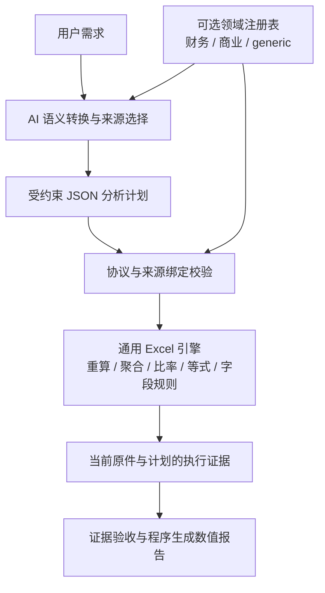

# Excel 分析工程优化与领域语义分层

本轮目标是减少小模型回答波动对计算、来源和交付的影响，并将财务分析从通用 Excel 能力中分离。已完成通用分析执行、证据验收与可选领域注册表的第一轮实现；没有将某个工作簿的表名、坐标或答案写入产品规则。270 项相关回归通过，实际沙箱的 34 个模块及 Skill 哈希与仓库一致，财务和实验数据两种确定性计划均执行成功。

这说明工程执行与拦截能力已经得到验证，不代表小模型每次都会正确理解业务。此前真实模型试跑仍出现错表头、漏指标、错误等式和漏检。最后一轮按用户要求停止逐次追着模型输出改规则，改为验证架构边界和确定性行为。

## 分层设计

| 层 | 已实现职责 | 与领域的关系 |
|---|---|---|
| Excel 适配与计算 | 真实表头、业务范围、过滤、公式缓存、单位、期间、受限表达式、字段统计、来源哈希 | 共用，不要求财务字段 |
| 领域语义 | 指标 ID、别名、类型、分子分母关系、概念要求、工具能力、业务验证钩子 | 财务和商业词汇独立、可选 |
| 编排和交付 | AI 生成计划，受控执行，有限修复，只采信本轮成功回执，数值由程序生成 | 通过领域接口获取要求 |

`analysis_semantics.py` 负责注册表与领域策略；`analysis_domain_finance.py` 维护财务定义；`analysis_domain_commerce.py` 保留订单、销售与库存词汇。领域包不依赖 openpyxl，也不读取工作表或单元格。`spreadsheet_semantic_bindings.py` 将 Excel 来源转换为逻辑字段与范围绑定；领域验证接收这些绑定，其他数据适配器可以提供同样的协议。当前尚未实现其他存储适配器。

这里采用轻量语义层，具备本体的一部分结构：概念、指标、类型、关系和约束。没有引入 OWL/RDF、图数据库或通用推理器。项目目前最需要的是可执行的指标定义和来源校验；增加完整本体系统并不能自动消除模型的业务理解错误。

### 领域如何启用

- `DSH_ANALYSIS_DOMAIN=generic|finance|commerce|auto`；可信配置优先，未知配置报错。
- 默认 `auto` 是兼容性的请求词汇路由；未知或混合领域采用 generic，不根据工作簿名或扩展名强制启用财务规则。该路由仍是词汇匹配，不冒充完整语义推理。
- 直接调用通用计算函数默认 generic，调用方可显式注入领域。运行时通过单次工具作用域注入策略，不修改环境、不跨调用泄漏。模型工具参数不能切换领域。
- 可选 `calculation.metric_id` 提供稳定语义标识，例如 `finance.net_margin`。AI 仍必须选择原件中的真实字段和期间；ID 不是计算结果，也不替代数据绑定。
- 财务方法文档独立位于 `skills/xlsx/references/finance-analysis.md`，通用 xlsx Skill 不要求非财务任务提供利润指标。

例如“净利率”被映射到已注册指标后，财务包提供“汇总净利润 / 同期间汇总收入”的关系。Excel 引擎只执行计划中的聚合和除法；领域验证检查绑定的字段、汇总方法与范围。实验数据的“合格率”则可用同一引擎执行“合格数量 / 投入数量”，无需启用财务包。

## 工程稳定性改动

1. **来源结构与样本分离**：初始上下文保留目录、表头候选、业务范围候选、坐标和有限样本。样本不被标为全表覆盖。`extraction_mode` 与 `coverage_complete` 分开，非空行数不能冒充业务记录数。
2. **缩小工具选择面**：聚合、等式和字段检查分别使用三个原生工具，共用受限计算引擎；偏差极值保留已有列比较工具。未知分析措辞也不能绕过只读工具与执行证据。
3. **受限计划代替自由代码计算**：显式选择表、字段、业务范围和过滤。允许受限表达式、同计划引用与明确地址算式；拒绝循环、未知引用、错列、非法范围、常量伪造事实和超预算计划。协议归一化不猜业务含义。
4. **原件、缓存和单位核验**：验证原件与重算缓存哈希，计算期间原件不能变化。比率和金额换算由程序完成；不依赖模型口算单位。已注册领域指标还需通过相应来源绑定校验。
5. **交付前独立验收**：工具仍为必选，直到本轮证据满足已识别任务契约。失败、部分执行、历史答案、调用尝试不构成完成证据。有限修复用尽时输出未验证状态，不宣称成功。
6. **防止草稿先发布**：原生分析阶段关闭草稿增量和缓冲全文发布；最终数值由当前成功回执编译。假设单独标注，不能在假设中重写具体数字。成功结果之后的失败补充计划仍显示未完成。
7. **保留工程追溯**：保存本轮完整回执，记录计划/原件哈希、证据 ID、错误类别和门禁决策。领域 ID 与定义版本进入回执和证据摘要。
8. **职责拆分**：工具调度和旧抽样守卫从 agent loop 下沉；领域规则从通用任务解析、期间校验和通用提示中抽出。agent loop 从此前约 1533 行降为 1219 行，仍略高于 1200 行建议阈值，后续新增能力应继续下沉。

## 验证结果与运行生效

### 回归

以下八个测试模块共 **270 项通过**，耗时 15.937 秒；Python 编译检查和 `git diff --check` 通过：

`test_analysis_domains`、`test_spreadsheet_analysis`、`test_table_comparison`、`test_financial_workbook_fixes`、`test_small_model_protocol`、`test_dsh_skills`、`test_dsh`、`test_office_sandbox`。

验证重点包括：尾部异常与全部声明记录、单位与比率、错误期间和字段绑定、旧原件/失败回执拒绝、循环引用、过滤外行号、来源附件范围、隐藏草稿、任务契约未满足时继续要求工具、跨领域配置隔离，以及不依赖 Excel 对象的财务语义验证。测试通过不等同于模型业务解读通过。

### 实际用户沙箱

通过仓库根目录的 `./docker/start-smart.sh full exec -T session-broker`，使用既有沙箱执行接口启动新的 Python 进程。没有在最终分层后继续进行随机模型试跑，也没有改写原始业务会话。

- 34 个运行时模块哈希全部与当前仓库一致。
- 运行时 xlsx Skill 与独立财务参考文档哈希均与仓库一致。
- 原工作簿 SHA256：`9d71ca8cc6172add7e558ac6a906f677c784fcc5c9d3444cbb17de2772fd992f`；前后相同。
- 当前来源结构上下文为 14,785 字符；这不是单次模型请求的总 Token，不能由此推算全部会话成本。
- 当前服务采用源码只读挂载、每次 CLI 请求新建 Python 进程，因此这批 Python 改动通过下一次进程加载生效，未重启服务。没有源码挂载的镜像部署仍需构建和更新镜像。

| 确定性计划 | 运行结果 |
|---|---|
| finance：下半年收入 | 68,900 千元 |
| finance：下半年净利润 | 9,757.35 千元 |
| finance：下半年净利率 | 14.161611030478955…% |
| generic：实验两批合格率 | (8＋24)/(10＋30) = 80% |

财务计划使用真实来源绑定和已注册指标 ID；实验计划使用临时工作簿，验证通用引擎的复用。它们是人工指定计划的确定性冒烟，不冒充小模型自行规划的成功率。

### 此前真实小模型试跑的实际限制

模型配置显示名为 `qwen36-35b-a3b`。以下是分层完成前的开发试跑，各版本间存在代码变化，不能当作固定版本的统计基准。

| 试跑 | 模型/工具次数 | 观察结果 |
|---|---:|---|
| v11 盈利变化 | 4 / 2 | 成功回执仍缺三种利润率，最终门禁拒绝 |
| v11 字段质量 | 2 / 1 | 全量处理 80 条，字段概况包含大额、跨期日期及待审批原件位置 |
| v12 盈利变化 | 3 / 3 | 单项费用冒充三项费用被拒绝，修复后完成相关金额和利润率 |
| v12 勾稽 | 4 / 4 | 声明等式最终执行成功，但漏掉资产负债检查，部分业务表达式仍有问题 |
| v12 字段质量 | 4 / 4 | 模型反复选错表头与范围，四次均失败，最终输出未验证状态 |

这六次记录均未发现未验证草稿的 `DSH_DELTA` 内容输出。勾稽任务的“声明等式执行成功”只证明这些表达式被计算，不能列为完整财务审计通过。字段质量从一次成功变为一次失败，直接说明单次输出具有波动；工程优化的收益包括让失败明确可见，不能据此宣称业务成功率已稳定提升。

## 剩余边界与后续方向

- 通用引擎验证的是显式计划和声明范围。模型如果漏选整张表或业务关系，表达式全部成功仍可能不满足用户完整意图。
- 已注册指标的直接字段和标准比率可校验；未注册派生指标、复杂财务等式完整性、主体差异、符号约定和因果解释仍需业务证据。
- 字段范围、枚举和阈值的判定只表示符合声明规则，不能自动解释为业务合规。未知阈值优先提供字段概况。
- auto 路由仍有词汇歧义。业务场景明确时优先配置领域；将来可增加受约束的领域/概念识别步骤和显式歧义状态，再交给规则和来源验证，而不是增加整句问题补丁。
- 下一步可将经过业务审核的等式模板、指标定义版本和来源绑定状态纳入任务契约。模板提供可复用算子结构，数据绑定仍由来源决定；不应在通用 Excel 层固定财务问题的答案。

机器可读证据保存在同目录 `excel-analysis-engineering-optimization-2026-10-09.json`，包括当前运行时哈希与冒烟结果、270 项回归摘要、早期确定性参考执行和上述真实模型试跑摘要。
