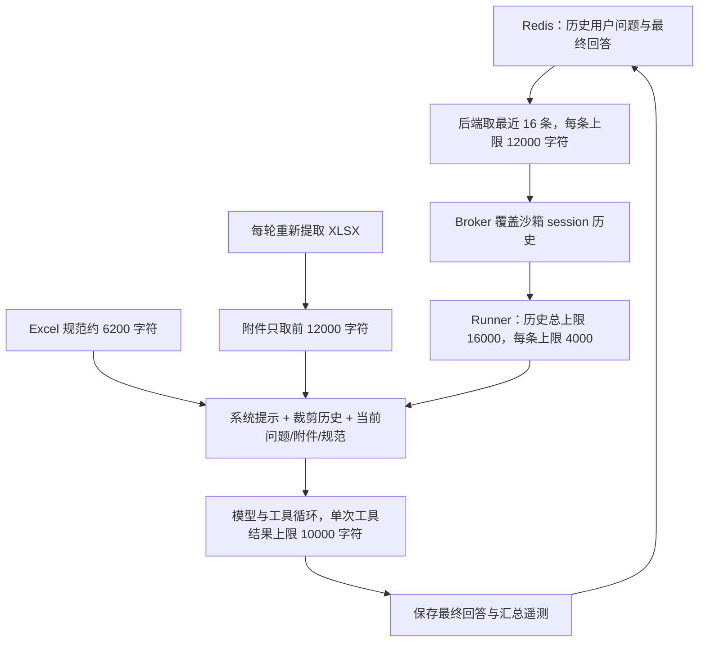

# 19:44 起财务会话调用与上下文管理复核

复核日期：2026-10-08，北京时间。会话：`chat-session-1791459811914-hu0smavn`。范围为“列出工作簿中的Sheet，并说明每个Sheet用途。”起的连续四次提问，至 19:46:39 的“解释下半年盈利能力变化。”。本次没有修改业务代码、重启服务或重放真实模型请求。

## 结论

调用链已正常运行，先前的后端部署和类型问题已解决；但这组财务分析仍不能判定通过。问题已从“重复回答 Sheet 清单”变成“读取了公式却未可靠计算、错误结论进入后续上下文、工具权限随措辞变化”。

上下文有会话和附件隔离，也有字符裁剪；目前缺少按问题选择来源、保存计算证据、核对跨轮矛盾，以及覆盖整次模型请求的 Token 预算。这不是简单增大上下文窗口可以解决的问题。

## 最新修改确认

- ai-orchestrator 的 dispatcher/conversation 编译文件已于 19:40:57 更新，运行产物包含 DNS 分类和 `executionTrace`。本次四条实际 assistant 消息均保存执行轨迹，不再只有最终正文。
- 运行沙箱中 runner、prompt_builder、agent_loop、office_tools、skill_router、llm、runtime_policy、artifact_exporter、context_budget、telemetry 共 10 个文件与当前源码一致。
- 后端 `tsc --noEmit --incremental false` 通过，前次报告的 3 处类型错误已消除。
- 协议回归 37 项、上下文预算及遥测相关回归 4 项均通过。
- 用 19:17 原始 SVG 截断片段验证：新增修复已补齐属性引号和 SVG，提示也不再断言 Token 上限。此项仅验证该具体片段，未证明任意 HTML 都可修复。
- 本轮没有验收前端 ` ` 渲染修改，也没有测试真实 DNS 故障。

## 实际调用

四轮始终使用用户指定的 `qwen36-35b-a3b`，没有发现模型切换、网络错误或超时。下表输入 Token 是该用户轮次内所有模型调用的累计值，不是单次上下文长度，也不是收费金额。

| 提问 / 完成时间 | 模型调用数 | 工具调用数 | 累计输入 Token | 累计输出 Token | 整轮耗时 | 判断 |
| --- | ---: | ---: | ---: | ---: | ---: | --- |
| Sheet 清单 / 19:44:00 | 1 | 0 | 13,724 | 872 | 13.43 秒 | 能直接利用附件预览回答，调用方式合理；输入偏重 |
| 全年四项指标 / 19:44:58 | 4 | 3 | 74,124 | 1,917 | 29.26 秒 | 需公式计算，当前工具面不足；净利润错误 |
| 最大预算偏差月份 / 19:46:13 | 4 | 3 | 74,069 | 5,926 | 61.67 秒 | 正文反复自我更正且最终净利润结论错误 |
| 下半年盈利能力 / 19:46:39 | 1 | 0 | 19,911 | 1,544 | 20.34 秒 | 没有新工具调用，却声称“经重算验证”；数值继续漂移 |

合计 10 次模型调用、6 次工具调用，输入 181,828 Token、输出 10,259 Token，合计 192,087 Token。各轮结束原因分别为 `stop`、`tool_calls × 3 → stop`、`tool_calls × 3 → stop`、`stop`。

第二、三轮的 4 次调用与“最多 3 轮工具循环，再请求最终总结”的代码路径一致，不能单凭次数认定死循环。现有轨迹没有工具名称、参数和结果摘要，因此不能确认这 3 次具体调用是否重复读取，也不能证明第三轮执行过计算。

## 用原工作簿独立核对回答

原文件的 `月度经营!N16`、`利润表!B14` 公式缓存仍为空。本次只读加载原始公式及输入，使用 Decimal 按工作簿实际月度公式独立计算；没有执行工作簿中的任意代码，没有改动文件，没有将核算结果回填到被审会话。

| 项目 | 会话输出 | 独立核算 |
| --- | --- | --- |
| 全年营业收入 | 124,020 | 124,020，正确 |
| 全年毛利率 | 43.09% | 43.0924%，正确 |
| 全年营业利润 | 21,209.40 | 21,209.40，正确 |
| 全年净利润 | 第二轮 15,861.10；第四轮 16,204.40 | **16,038.30** |
| 收入预算绝对偏差最大 | 第三轮开头写 3 月，后面改为 12 月 | **12 月，+1,870.00** |
| 净利润预算绝对偏差最大 | 最终写 12 月，+206 | **7 月，-445.6875（约 -445.69）** |
| 下半年收入 | 69,950 | **68,900** |
| 下半年净利润 | 8,742.90 | **9,757.35** |

第三轮将 1 月净利润写成 950、7 月写成 1,184、12 月写成 1,861；正确值分别约为 863.93、934.31、2,080.20。第四轮同一答案中 12 月净利润率先写 13.5%，表内又写 15.2%，按实际数据应为 15.52%。

另外，“其他收益 -120”发生在营业利润之后、税前利润之前，不能直接作为营业利润下降的计算原因；“高毛利产品占比增加”等原因缺少业务明细证据，应明确作为待验证解释。

首轮 Sheet 名称及顺序基本正确，但把“交易明细有效行数 82”当作“82 条交易”。实际第 4–83 行是 80 条数据，另外两行是标题、字段行。其额外给出的勾稽关系说明不能替代勾稽核查。

## 当前上下文如何流转

该流程不会把 Redis 历史与沙箱历史重复拼接成两份；Broker 是覆盖写入。附件按当前 session 绑定，未发现混入之前 18:28、19:17 会话的问答或其他附件。四轮也都没有触发“无独立主题的上下文继承硬性要求”。

### 1. 历史没有整轮丢失，但错误正文被当作可复用背景

用实际 Redis 问答和运行代码离线重建，四轮带入的历史分别为 0、2、4、6 条，裁剪后的历史长度为 0、1,547、3,680、7,706 字符，没有因 16,000 总预算丢弃早期整条消息。

第四轮将上一条 4,527 字符的分析截为前 4,000 字符，加截断标记，丢掉末尾 527 字符。开头的错误“3 月最大”仍在，后面的总结与建议被截掉。当前只做从头截取，不会保留最终确认、数值更正或矛盾标记。

更重要的是，历史只保存用户问题与 assistant 最终文本；工具调用、公式计算结果、单元格来源、核算状态均未保存。Broker 下轮又从 Redis 的最终问答覆盖沙箱历史。于是错误分析会作为历史继续输入，而能用于复核的工具证据没有跨轮传递。

这是错误传播风险的证据，不能据此断言第四轮某个错误数字一定来自上一轮。第四轮还生成了新的错误年度数字，说明模型自身计算/编造问题也存在。

### 2. 附件每轮重复注入，截断与问题无关

原 XLSX 全部提取文本为 22,179 字符，每轮注入前 12,000 字符及截断提示。截断发生在“交易明细”第 6 行中间；“管理驾驶舱”正文位于约 21,355 字符处，不在预览内，但 Sheet 清单仍有其名称。

本次四项财务指标需要的“参数”“月度经营”“利润表”“预算对比”均在预览内，不能将净利润错误解释为这几张表完全没进入上下文。真正缺的是公式求值结果及其可靠验证。

列 Sheet 只需要名称、表头和少量样本；解释下半年只需要月度经营与相关假设。当前每轮都加入前面几张表的全部公式、无关资产负债表/现金流量表等内容，再附约 6,200 字符 Excel 规范，输入选择不够精确。

### 3. “只读分析”与“只读计算”被混为一谈

按实际提问重建的工具面：

| 提问 | inspect | 工具面 |
| --- | --- | --- |
| 列出 Sheet | true | 5 个：read_file、scan_knowledge、vision_inspect、web_search、fetch_page |
| 总结财务指标 | true | 同上，没有公式重算或 Python 计算能力 |
| 找出偏差最大月份 | false | 14 个完整工具，包含 bash、文件修改、图片、发送文件、提醒等 |
| 解释盈利变化 | false | 同上 |

`runner.py:192` 的只读分支会直接移除 bash；提示构建也要求只用只读工具。同时 XLSX 提取提示和指标纠偏文案又建议运行 Python/recalc。能力与指令互相冲突。

“找出”“解释”没有被稳定识别为同类只读分析；仅因匹配到 XLSX 技能就进入完整工具分支。这里没有观察到实际误发消息或设置提醒，但开放与当前问题无关的工具会增加协议长度、选择成本和误用机会。

合理的边界是“不修改原文件、不生成用户未要求的交付物”，同时提供受约束的只读计算/重算；不应要求模型仅靠读取公式文本手算财务结果。

### 4. 字符限制尚不是完整的模型上下文预算

当前历史总额、每个附件、每个规范和每个工具结果分别限长，预算并未合并覆盖系统提示、全部附件、历史、工具 schema、当前轮追加消息及预留输出。

历史裁剪只在进入循环前执行；循环中继续追加工具结果，每份可达 10,000 字符，没有重新执行整段上下文预算。多附件还会逐个各取 12,000 字符，而非共享附件总预算。

本次没有记录到 `length`、上下文超限或超时，不能把 74,124/74,069 的累计输入误读成一次请求塞入约 74k。第四轮实际单次输入为 19,911 Token；这些记录证明重复输入成本和结果错误，尚不证明模型窗口溢出。

### 5. 当前保护措施不检查财务正确性

指标对齐保护只识别“财务提问却返回 Sheet 清单”，不验证公式结果、最大值排序、正负号、正文与表格一致性，也不比较前后轮年度指标。

本次将三条实际错误财务回答输入当前保护函数，均得到 `pass`。第三轮达到工具预算后，最终总结路径还额外要求“深入、结构完整、详尽”，容易形成冗长解释；该路径没有强制保留可追溯计算结论或再次核对数字。

`finishReason=stop`、`exitCode=0` 表示调用结束，不代表财务分析正确。“经重算验证”需要成功计算工具及其结果支持，当前记录没有这种证据。

## 建议按以下顺序处理

1. **先补只读计算能力。** 用受约束的计算工具读取 Sheet/范围、计算公式与聚合，返回结果及来源；保留原文件。未得到可用公式结果时明确不能确认，避免直接猜值。将“总结”“找出”“解释”“比较”等财务分析统一到同一工具策略。
2. **保存已核算事实。** 按文件内容哈希/版本保存年度指标、逐月实际与预算、公式来源、计算方法和核算状态。后续轮次优先读取这些事实；assistant 的文字分析只能作为待验证背景。冲突时重新计算并使旧结论失效。
3. **按问题取数据。** Sheet 清单只加载目录与表头；指标问题加载相关范围及计算结果；趋势问题加载半年/月度聚合。附件变更时重新计算，避免每轮都注入相同的前 12,000 字符。
4. **改进历史压缩。** 保留最近问答与用户要求，较早内容压缩为带来源的事实、未解决问题和更正记录。长回复优先保留最终确认，避免只保留开头推演。若只是删除，提示应写“省略”，不要称为已经精简归档。
5. **统一 Token 预算。** 每次模型调用前计算完整 messages 与 tools 的输入预算，预留输出，并在工具循环后重新评估；先缩小不相关数据和重复规范，再压缩历史。
6. **补足可观测性和数值校验。** 每轮保存工具名、脱敏参数、结果摘要/哈希、调用级用量、计算状态及上下文裁剪清单。对年度合计、税前减税后、实际减预算、最大绝对值和跨轮同指标一致性做确定性检查。

## 遥测修复仍有的边界

新增 `roundFinishReasons` 已在真实会话中生效，但 `received_done` 没有随每轮遥测保存。更上游的 OpenAI-compatible 客户端仍在流 `end` 时直接成功，proxy 再发送自己的 `[DONE]`。所以 Harness 收到 `[DONE]` 不能独立证明原模型发送过完整终止事件。这不是本次财务数值错误的已证实原因，但此前 HTML 静默中断排查仍需在上游保存原始结束状态。

另外，四条 executionTrace 的 outboundFiles 都列出了原始上传工作簿。该字段不能作为新交付物生成的证据，应区分输入附件与实际新产物。

## 证据与限制

已读取实际服务日志、Redis 消息、沙箱 session 文件、运行容器代码及预算，并对原工作簿做只读核算。上下文分配由相同代码与实际历史离线重建；运行规范长度约 6,228 字符，本地规范加载约 6,197 字符，存在路径/环境文字差异，因此不把本地重建字符总数当作实际发送 Token 数。

本轮未获得每次工具的参数与结果、原始模型请求快照或账单；无法追溯模型生成某个错误数字的完整过程，也不据此声称每次工具调用均合理。可确认的是：调用稳定、原部署问题解决，而数值可靠性和上下文证据管理仍未通过。
