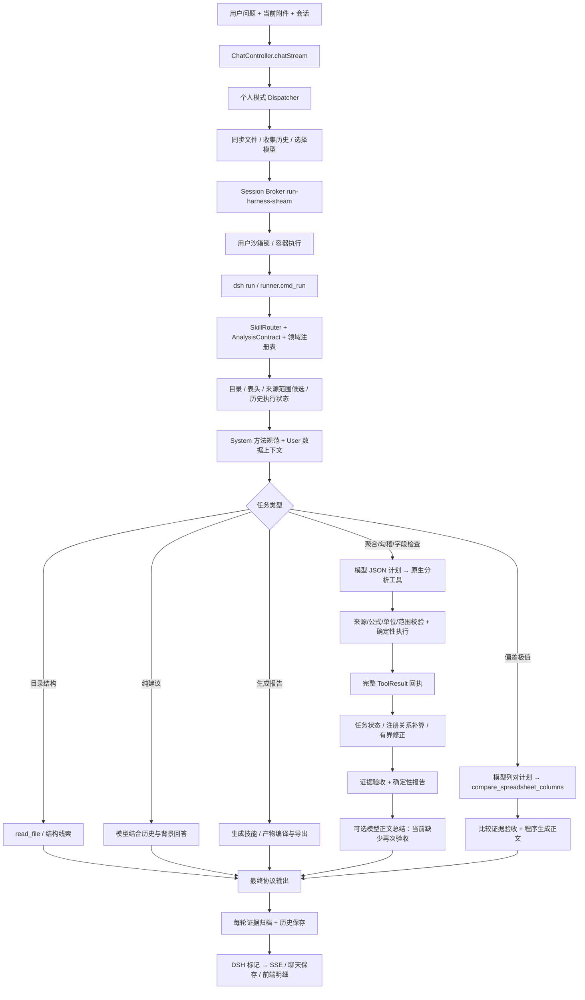

# 个人沙箱财务问询全流程分析

日期：2026-10-10，时区：Asia/Shanghai。对象：当前工作区源码、正在运行的个人沙箱、已有真实会话证据。此次只做分析与只读复核，未修改业务代码、原始工作簿、会话历史或模型配置，未重启服务，未新增真实模型调用。

## 1. 结论与证据边界

当前系统已形成“自然语言任务 → 技能/领域选择 → 来源结构 → 模型制定计划 → 确定性工具核算 → 证据验收 → 报告”的主链。财务知识和 Excel 计算分层清楚：财务层提供语义，Excel 层提供来源绑定、受限表达式与执行回执。

但不能把当前链路理解为“所有财务结论都已自动验证”。它主要证明选定来源上的运算、声明范围覆盖和部分指标语义；任务完整性、业务规则适用性、期间/主体一致性及最后自然语言正文还存在缺口。

本次最值得优先处理的三处是：

1. 核算验收之后的模型正文改写没有再次校验数字、遗漏或业务判断。
2. 任务验收没有完整表达“请求了哪些字段检查、哪些等式、哪个期间/主体”；某些局部成功会被标记为整体完成。
3. “总结指标并给建议”会被当前咨询识别规则清空指标要求，从核算路径转入无强制执行证据的建议路径。

证据等级：

| 标记 | 含义 | 本次用途 |
|---|---|---|
| 当前源码 | 当前未提交工作区中的真实实现 | 解释函数、分支、协议和限制 |
| 运行环境 | 容器状态、挂载、文件哈希、只读配置探针 | 确认 Python 核心流程适用于当前沙箱 |
| 真实归档 | 已有会话的回执、门禁和回答 | 说明实际成功/缺项，不新增模型请求 |
| 隔离探针 | 本地 mock 或已归档回执的只读检查 | 验证具体门禁行为，不当作真实模型成功率 |
| 改进建议 | 基于上述事实提出的方案 | 不代表本次已经实施 |

仓库存在大量既有未提交改动，本文分析的是当前工作区，不是仅分析 HEAD。代码图已重新索引；图中存在同名方法的错误跨模块边，调用链已用源码 imports、HTTP 地址和实际分发代码交叉核对，不将图中的同名 `get/close/evaluate` 边当成真实服务调用。

运行中的沙箱为 `ops-user-sandbox:local`，用户为 `sandbox`。`src/dsh_modules` 挂载到 `/usr/local/bin/dsh_modules`，`bin/dsh` 挂载到 `/usr/local/bin/dsh`，均为只读；`/workspace`、`/knowledge` 持久化可写。7 个关键模块哈希与仓库一致，系统共享技能的 `xlsx/SKILL.md`、`references/finance-analysis.md`、`scripts/recalc.py` 也一致。TypeScript 调度层已按当前源码分析，但没有通过新 HTTP 请求逐项证明其所有分支在常驻进程中生效。

## 2. 全链路总览

普通个人聊天的财务分析主链不经过工作模式的 Control Plane 执行计划，也不依赖 Carbone 来核算 Excel。模型访问由 AI Orchestrator 内部代理提供；模型名称不是固定写死为某一家。

### 2.1 聊天入口与文件交接

入口为 `ChatController.chatStream`，路由 `chat/stream`。解析模式为 `chat` 时进入个人沙箱；`office-` 会话、`source=office-addin` 或显式 `bypassSandbox=true` 可绕过沙箱。绕过后走普通 `streamChat`，其财务核算保障不能与本文原生工具路径混同。

`UserSandboxDispatcherService.dispatchPersonalSandbox`：

1. 读取会话历史，收集历史附件元数据与本轮附件。
2. 将本轮文件同步至用户工作区，维护会话附件索引。
3. 构造提示：区分本轮主要附件、历史参考附件、附件文本预览与用户指令。
4. 传递 recentHistory、files、model、thinking、timeout 等参数。若有本轮上传，传给 Broker 的 files 优先为本轮文件；否则使用当前会话附件。
5. 调用 `/user-sandboxes/run-harness-stream`；流式端点不可用时退回 `/run-harness`。
6. 解析 DSH 标记，将正文、思考/进度、指标和产物转换为 SSE 事件，保存聊天结果。

附件文件名用于路由和范围隔离，财务指标列必须继续根据实际表头定位。即使输入里包含提取文本预览，真实核算仍应从原件读取。

源码：

- [ChatController.chatStream](/Users/chain/Documents/MyProject/ops-automation/apps/backend/intelligence/ai-orchestrator/src/modules/chat/chat.controller.ts:236)
- [Dispatcher 主入口](/Users/chain/Documents/MyProject/ops-automation/apps/backend/intelligence/ai-orchestrator/src/modules/chat/user-sandbox-dispatcher.service.ts:241)
- [Broker 请求参数](/Users/chain/Documents/MyProject/ops-automation/apps/backend/intelligence/ai-orchestrator/src/modules/chat/user-sandbox-dispatcher.service.ts:474)

### 2.2 Broker 与个人容器

`UserSandboxHarnessService.runHarness` 清洗 user/session 标识，写入历史和附件索引，组装 `dsh run <prompt> --session-id ... --files ...`。随后获取用户级沙箱锁，在 `/workspace` 执行，finally 释放锁。默认任务超时为 300 秒，默认锁排队等待为 35 秒。

这里的“技术执行成功”以进程退出码为依据，不等于“财务任务完整完成”。业务完成需再看回执与任务门禁。

值得后续检查的并发边界：当前历史及附件写入位于获取沙箱锁之前。并发同会话请求理论上可能在真正执行前覆盖输入文件；本次没有并发复现，不将其描述为已发生故障。

源码：[runHarness](/Users/chain/Documents/MyProject/ops-automation/apps/backend/execution-control/session-broker/src/modules/user-sandbox/user-sandbox-harness.service.ts:197)。

### 2.3 `runner.cmd_run` 的准备工作

运行策略 → 会话历史 → 会话附件 → Skill 路由 → 按需个人知识扫描 → 附件哈希与备份 → 来源结构上下文 → 工具选择 → 历史执行状态 → Prompt → Agent 循环。

附件初始上下文优先级：

1. 有效的实际/预算候选结构 `build_comparison_source_context`。
2. 普通分析的 `build_spreadsheet_source_context`。
3. 不满足前两项时，原有 `read_workspace_file` 提取。

前两项提供目录、真实表头、候选范围、带坐标样本；不把样本当成计算结果。核算时重新读声明业务范围。初始上下文不会因为工作簿名带“财务”就预置收入或毛利率的答案。

System 包含运行规则和技能方法；User turn 包含问题、附件、文件数据与检索数据。历史按字符预算裁剪，历史执行状态单独从证据档案中恢复。

源码：[cmd_run](/Users/chain/Documents/MyProject/ops-automation/apps/backend/runtimes/personal-sandbox-runner/src/dsh_modules/runner.py:373)、[附件与上下文](/Users/chain/Documents/MyProject/ops-automation/apps/backend/runtimes/personal-sandbox-runner/src/dsh_modules/runner.py:455)、[结构上下文](/Users/chain/Documents/MyProject/ops-automation/apps/backend/runtimes/personal-sandbox-runner/src/dsh_modules/spreadsheet_context.py:25)。

## 3. 财务知识“本体”的实际构成

### 3.1 当前是轻量语义注册表

核心是 `analysis_semantics.py` + `analysis_domain_finance.py`，组成：

| 层 | 保存内容 | 用途 |
|---|---|---|
| 指标定义 | 稳定 ID、名称、正则别名、number/percentage 类型 | 识别请求与来源字段、检查类型 |
| 派生关系 | 分子指标、分母指标 | 生成可信比率补算配方 |
| 概念定义 | 概念名称、触发词、required_metrics、capabilities | 把盈利能力等概念展开为任务要求 |
| 校验钩子 | 标签与字段、比率范围、复合费用项数量 | 拦截部分错误计划 |
| 方法提示 | 同期汇总比率、等式假设、数值与原因边界 | 指导模型制定计划 |
| Excel 适配 | 真实表头、字段键、选中行范围 | 将物理来源转换为语义校验输入 |

它未实现 OWL/RDF 类层次、完整会计政策推理、主体/合并范围推理或规则知识图谱检索。文件源码版本为 `VERSION="1"`；不是财务知识库的完整版本治理机制。

### 3.2 当前注册的 7 个指标

| ID | 名称 | 类型 | 注册派生关系 |
|---|---|---|---|
| `finance.revenue` | 营业收入 | number | 无 |
| `finance.gross_profit` | 毛利润 | number | 无 |
| `finance.operating_profit` | 营业利润 | number | 无 |
| `finance.net_profit` | 净利润 | number | 无 |
| `finance.gross_margin` | 毛利率 | percentage | 毛利润 / 营业收入 |
| `finance.operating_margin` | 营业利润率 | percentage | 营业利润 / 营业收入 |
| `finance.net_margin` | 净利率 | percentage | 净利润 / 营业收入 |

重要口径：期间利润率使用同期间 `sum(利润)/sum(收入)`，不聚合月度比率列。注册关系仅生成三种利润率；毛利润、营业利润、净利润的业务构成、现金流关系、资产负债恒等式没有在这张指标表中完整注册。

`profitability` 概念要求上述 7 项指标，并要求聚合能力；`reconciliation` 概念只要求等式工具，没有固定的必检等式集合。通用 `data_quality` 概念只要求字段检查工具，没有为每个请求字段列出必须满足的规则或统计项。

### 3.3 领域选择

`DSH_ANALYSIS_DOMAIN=generic|finance|commerce|auto`。当前沙箱探针结果符合默认 auto：收入/利润率问句进入 finance；“识别金额、日期和审批状态异常”“检查现金流量表”进入 generic。

auto 根据请求词汇匹配领域包；未知或多个领域同时命中时使用 generic。模型工具参数不能自行切换领域。调用作用域使用 ContextVar 注入并恢复；底层 `calculate_spreadsheet_analysis` 直接调用默认 generic。

因此“有财务附件”不保证启用 finance。“收入”和商业包词汇同时命中也可能降为 generic。此时 Excel 引擎仍可算数，但不会自动获得 finance 的全部语义约束。

源码：[财务注册表](/Users/chain/Documents/MyProject/ops-automation/apps/backend/runtimes/personal-sandbox-runner/src/dsh_modules/analysis_domain_finance.py:5)、[领域选择](/Users/chain/Documents/MyProject/ops-automation/apps/backend/runtimes/personal-sandbox-runner/src/dsh_modules/analysis_semantics.py:50)、[来源语义绑定](/Users/chain/Documents/MyProject/ops-automation/apps/backend/runtimes/personal-sandbox-runner/src/dsh_modules/spreadsheet_semantic_bindings.py:10)。

### 3.4 Skill 方法与个人知识库不等价

系统 `xlsx/SKILL.md` 提供读取、只读核算、原件保护、生成重算和领域使用规范。领域 GUIDANCE 在分析路径另外注入。

`references/finance-analysis.md` 存在且已同步，但 `skills.read_skill` 当前只对 PDF 的部分 reference 做自动加载，没有自动展开 xlsx 财务参考。该参考中的要点有部分已在主技能与领域 GUIDANCE 中重复，所以不能推断“财务方法全部缺失”；但文件存在不代表其完整内容进了模型上下文。

个人 `/knowledge` 扫描仅在“个人空间/知识库”等精确意图命中时预先执行；扫描返回最多 15 个文件的各 300 字符预览，并非财务政策语义检索。当前核算工具裁剪后也不保留 `scan_knowledge`。本次没有发现该用户 knowledge 下命名为 finance/财务的独立技能文件；这不能证明其没有其他命名的财务资料。

源码：[技能读取](/Users/chain/Documents/MyProject/ops-automation/apps/backend/runtimes/personal-sandbox-runner/src/dsh_modules/skills.py:204)、[知识扫描](/Users/chain/Documents/MyProject/ops-automation/apps/backend/runtimes/personal-sandbox-runner/src/dsh_modules/file_tools.py:190)、[财务参考](/Users/chain/Documents/MyProject/ops-automation/apps/backend/runtimes/personal-sandbox-runner/skills/xlsx/references/finance-analysis.md)。

## 4. 任务契约和分流

`build_analysis_contract` 从问题识别指标、年份/部分期间文本、极值操作、月份维度、偏差、预算/同比/环比基准、排序、概念、审计及咨询意图。它主要是规则/正则解析；并不自动证明实际来源是用户要求的主体和期间。

| 请求 | 当前主要路径 | 交付保障 |
|---|---|---|
| 列出 Sheet 和用途 | 目录读取 | 真实目录与线索；用途解释仍依赖模型 |
| 总结年度收入、毛利率等 | 聚合/比率分析 | 指标类型、来源表达式、执行证据 |
| 找出收入与净利润偏差最大的月份 | 专用列比较能力 | 指标列对、基准、排序、并列结果、金额单位 |
| 解释下半年盈利能力变化 | 盈利能力概念 + 多期间核算 | 7 指标要求；对照窗口与部分期间约束 |
| 检验利润、现金和资产负债勾稽 | 等式工具 | 明确左右表达式、容差、假设；必检关系完整性弱 |
| 查重复凭证/关键字段缺失/异常 | 字段规则与概况 | 声明范围扫描；请求字段逐项完成约束弱 |
| 如何提升毛利率/提出管理建议 | 定性咨询 | 不强制本轮 Excel 执行证据 |
| 生成一页报告 | 生成技能/网页报告 | 产物落盘与导出；不继承核算路径的完整验收 |

`supports_column_comparison` 要求极值 + variance + 有指标 + 全部指标为 number。比率极值、未知指标或泛称偏差可能不进入列比较分支。

工具选择有两层：`select_active_tools` 决定初始工具面，`select_analysis_tools` 再按任务能力裁剪。例如盈利能力保留聚合和结构工具，勾稽保留等式和结构工具。执行分发器另外按当轮工具名称白名单拦截，不仅靠提示词限制。

普通核算最终往往只保留原生分析工具和 `inspect_spreadsheet_structure`；`read_file`、网络和知识扫描即使初始允许，也可能在第二层被移除。结构不充分时只能按允许工具继续探索，不能假设模型还能调用 bash 或读取完整财务政策。

源码：[任务契约](/Users/chain/Documents/MyProject/ops-automation/apps/backend/runtimes/personal-sandbox-runner/src/dsh_modules/analysis_contract.py:57)、[初始工具选择](/Users/chain/Documents/MyProject/ops-automation/apps/backend/runtimes/personal-sandbox-runner/src/dsh_modules/runner.py:208)、[分析工具裁剪](/Users/chain/Documents/MyProject/ops-automation/apps/backend/runtimes/personal-sandbox-runner/src/dsh_modules/spreadsheet_analysis_schema.py:113)。

## 5. Excel 原子操作与组合方式

这里的原子操作不是 Excel UI 中的点击、选区、写值。它们是后台只读数据能力和受限表达式；生成/编辑 Excel 是另一条脚本与重算路径。

### 5.1 对外工具

| 工具 | 输入要点 | 真实能力 | 不应推定的能力 |
|---|---|---|---|
| `read_file` | file_path、sheet、range 等 | 文件读取、带地址 Excel 提取、目录/切片 | 读到样本即完成全表核查 |
| `inspect_spreadsheet_structure` | file_path、1–4 个真实 sheets | 范围、表头候选、行标签、坐标样本 | 全量业务统计、公式已核算 |
| `aggregate_spreadsheet` | tables、calculations | 聚合、加权比率、受限四则、期间变化 | 自动猜列/年度/实体 |
| `check_spreadsheet_equations` | tables、checks | 左右值、残差、容差、假设 | 自动证明会计准则和必检关系完整 |
| `validate_spreadsheet_rows` | tables、可选 rules | 全列概况、缺失/唯一/日期/枚举/数值范围规则 | 自动知道合法审批值或金额阈值 |
| `compare_spreadsheet_columns` | 分组、列对、基准、范围、排序、expected_groups | 差额、相对差额、最大/最小、全部并列极值 | 分组重复时自动聚合、猜基准 |
| `analyze_spreadsheet` | 通用组合计划 | 聚合/检查/规则共用执行入口 | 每轮都会向模型暴露该组合工具 |

前三类分析工具实际上都进入 `execute_spreadsheet_analysis` → `calculate_spreadsheet_analysis`。字段工具额外设置 `profile_tables=True`。列比较进入独立的 `calculate_column_comparison`。

### 5.2 表和范围原语

`tables` 定义 table id、真实 sheet、header_row、A1 范围和 filters。header_row 需要单层文本字段；过滤基于来源列和值。显式范围开始于表头时排除该表头，不自动识别所有正文中的小计/合计。

范围当前受总计 200,000 单元格预算约束；最多 16 表、64 计算项、32 等式、32 规则。范围里的 `coverage_complete=True` 表示所有声明行已处理，不证明模型挑选的范围覆盖了用户要求的全部业务总体。

`inspect_spreadsheet_structure` 只读有限前缀与表尾：最多 64 列、候选表头取前 20 行、候选取单层文本行；初始样本很紧凑。复杂多层表头、多个数据块、年维度藏在标题里、隐藏行或中间小计，仍需要更明确的来源适配。

### 5.3 表达式原语

| 原语 | 含义 | 约束 |
|---|---|---|
| `aggregate` | sum/min/max/count + table + column | 聚合声明行；数值运算不把空值当零；count 是选中行数 |
| `cell` | sheet + 单元格地址 | 来源单元格真实且为有限数值 |
| `constant` | 无量纲常量 | 不能仅用常量伪造业务事实 |
| `op` | add/subtract/multiply/divide | 有限操作数、维度一致、零分母拒绝 |
| `ref` / 单字段 `id` | 引用同计划 calculation | 编译展开；拒绝未知或循环引用 |
| `table_id/column/row` | 显式地址适配 | 编译为受限来源表达式 |

表达式深度最多 12，节点预算 4096。金额/比率/数值维度独立，计算用 Decimal；金额单位从原件声明读取，支持元、千元、万元、亿元。百分比呈现由引擎转换，模型不应手工乘 100。

`sum`、`min`、`max` 没有同时直接返回极值所在业务分组；需要分组归因的预算偏差使用列比较能力。通用引擎当前也没有独立的任意 group-by、join、分位数、条件表达式原语。

### 5.4 字段规则原语

`unique`、`not_empty`、`date_range`、`allowed_values`、`number_range`。规则提供 assumptions；缺少枚举或边界时拒绝，不补造业务规则。范围可单边，唯一性/缺失结果保留异常坐标，最多展示 20 个例子但总数来自声明范围全量处理。

profile 提供缺失、数值极值及行号、日期范围、分类计数和低频值坐标。profile 有统计事实，不等同于异常判定。业务允许负数、待审批或特定币种时，不能仅凭低频或符号直接认定错误。

### 5.5 列比较原语

差额 `left-right`；相对差额 `(left-right)/abs(right)`；排序为绝对差额、有符号差额或绝对相对差额，极值 max/min；保留并列。基准为零时不能完成全范围相对排序。

分组值必须非空且唯一，重复类别需要先明确聚合。`expected_groups` 校验模型声明的分组集合，不能独立证明用户总体。每次工具可完成部分指标，最终验收累计所有成功回执。

源码：[工具分发](/Users/chain/Documents/MyProject/ops-automation/apps/backend/runtimes/personal-sandbox-runner/src/dsh_modules/tools.py:497)、[计算引擎](/Users/chain/Documents/MyProject/ops-automation/apps/backend/runtimes/personal-sandbox-runner/src/dsh_modules/spreadsheet_analysis.py:72)、[表达式解释器](/Users/chain/Documents/MyProject/ops-automation/apps/backend/runtimes/personal-sandbox-runner/src/dsh_modules/spreadsheet_expression.py:64)、[列比较](/Users/chain/Documents/MyProject/ops-automation/apps/backend/runtimes/personal-sandbox-runner/src/dsh_modules/table_comparison.py:65)。

## 6. 一次核算内部如何执行

1. 分发器核对当轮可用工具；不在白名单内直接返回 `tool_not_available`。
2. 解析参数，在原生分析调用作用域注入领域；`execute_tool` 进入对应适配器。
3. 检查沙箱路径与附件范围；建立原件 SHA-256。
4. 以公式模式读取原件，预先验证表名、表头、范围和计划数量。
5. 若有公式，取得可信重算副本；核对状态、原件哈希及副本哈希。
6. 用 data_only 数值视图构建表、应用过滤、编译引用表达式与合法协议适配。
7. 读取金额单位；进行来源绑定、期间标签和财务语义校验。
8. 执行 facts、checks、rules、profiles；记录实际访问单元格和实际行。
9. 再次检查原件哈希，防止执行过程中来源变化。
10. 生成 plan_hash、evidence_id、semantic_domain、coverage 和 provenance。
11. 完整 ToolResult 留在本轮运行时；发送给模型的是裁剪摘要，不包含全部逐行明细。

重算通过 `workbook_calculation.get_or_create_recalculated_workbook` 调用无头 LibreOffice 的 `recalc.py`，副本缓存采用内容哈希和验证版本。原件不改写。公式缓存非空本身不足以作为核算可信凭据；执行器要求验证状态和来源哈希。

当前普通分析会扫描整本工作簿是否存在公式，随后可能要求全工作簿重算通过；字段检查即使只看字面值列，也可能被其他无关 Sheet 的公式问题阻断。列比较仅先看目标分组/比较列是否含公式，但重算仍针对工作簿。

源码：[执行约束](/Users/chain/Documents/MyProject/ops-automation/apps/backend/runtimes/personal-sandbox-runner/src/dsh_modules/tool_dispatch.py:15)、[重算缓存](/Users/chain/Documents/MyProject/ops-automation/apps/backend/runtimes/personal-sandbox-runner/src/dsh_modules/workbook_calculation.py:191)。

## 7. Agent 循环、自动补算与证据交付

`run_agent_loop` 为核算路径附加分析规范及领域指标目录。尚无完整证据时要求模型选择工具；支持原生 tool_calls、部分旧协议与受限文本计划恢复。恢复出的工具仍受同一白名单约束。

工具调用后，`AnalysisTurn`：

1. `analysis_task_state` 独立核验成功回执、原件哈希、结果非空、声明覆盖、指标类型及部分变化窗口。
2. 返回结构化 issues/missing_metrics；已有指标不应重复算。
3. `RegisteredMetricCompletion` 尝试可信注册关系补算。
4. 已注册任务满足要求时，可直接结束规划循环；未知任务仍保留探索轮次。
5. 最终 canonical_response 的证据 ID 由程序维护，模型错误 ID 或错误可选 hypotheses 不阻断已核验事实。

### 7.1 注册关系补算的边界

只对用户请求且注册了分子/分母关系的比率尝试补算。要求同原件、当前领域版本、同 Sheet/表头/实际选中行、分子分母唯一绑定、来源哈希有效，且当轮提供聚合能力。

复用的是 sum 来源表达式，重新进入原核算引擎；不用缓存数字口算。新回执带 `execution_origin=registered_derivation`、parent_evidence_ids、recipe_domain/version。每轮最多四个内部执行计划，相同失败计划不再尝试。跨表、范围不同、直接 cell 或复杂表达式不能自动视为可补算的简单 sum 绑定。

### 7.2 当前预算

运行沙箱实测配置：

| 项目 | 值 | 含义 |
|---|---:|---|
| 默认 Agent 轮数 | 3 | 错误修复可扩充，但硬上限 4 |
| 单模型请求超时 | 180 秒 | 受任务总截止约束 |
| 任务总超时 | 300 秒 | Broker/CLI 默认值，可由请求配置覆盖 |
| 模型重试数 | 2 | 上游瞬时错误可能产生额外代理请求 |
| 历史总预算 | 16,000 字符 | 不是 token 上限 |
| 单历史条目 | 4,000 字符 | 上游也有自己的历史裁剪 |
| 单附件 | 24,000 字符 | 多附件累积需另看总上下文 |
| Skill | 12,000 字符 | 超限裁剪 |
| 工具摘要 | 10,000 字符 | 完整回执另存 |
| 模型输出 | 16,384 tokens | 不表示整个调用输入预算 |

4 轮是规划/工具循环上限，不是全部真实模型调用上限：网络重试、生成任务的规划阶段、最终 `analysis_synthesis` 都可能额外调用模型。最终总结最长单次 30 秒；未完成说明最长 20 秒，都接收同一任务 deadline。

源码：[循环](/Users/chain/Documents/MyProject/ops-automation/apps/backend/runtimes/personal-sandbox-runner/src/dsh_modules/agent_loop.py:886)、[任务状态](/Users/chain/Documents/MyProject/ops-automation/apps/backend/runtimes/personal-sandbox-runner/src/dsh_modules/analysis_task_state.py:10)、[注册补算](/Users/chain/Documents/MyProject/ops-automation/apps/backend/runtimes/personal-sandbox-runner/src/dsh_modules/registered_metric_completion.py:41)。

### 7.3 最终呈现目前有两种保障强度

列比较：程序从当前成功回执编译正文与明细，正文再次进入比较一致性检查。

普通分析：先通过任务与 evidence_error 检查，程序产生确定性正文与明细；随后 `synthesize_analysis_summary` 可能调用模型生成新的正文，直接拼接原审计明细。当前成功条件仅是非空、至少 20 字符、不是纯 JSON，没有再次核验数字、指标覆盖、原因或结论强度。网络不可用/异常才使用确定性 fallback。

该总结 digest 包含 facts、checks、rules 的部分内容及文件名，不包含完整 profiles、范围、业务假设和待验证解释。因此模型未必知道 profile 中的金额极值、审批低频值或等式适用边界。正确明细不能证明改写正文同样正确。

`analysis_synthesis` 的代理调用也未接收/记录当前 TelemetryStats，其 token 和调用次数不自动计入原循环统计。这会影响后续成本与延迟评估。

源码：[普通分析呈现](/Users/chain/Documents/MyProject/ops-automation/apps/backend/runtimes/personal-sandbox-runner/src/dsh_modules/spreadsheet_analysis_evidence.py:138)、[总结模型](/Users/chain/Documents/MyProject/ops-automation/apps/backend/runtimes/personal-sandbox-runner/src/dsh_modules/analysis_synthesis.py:92)、[比较呈现](/Users/chain/Documents/MyProject/ops-automation/apps/backend/runtimes/personal-sandbox-runner/src/dsh_modules/comparison_delivery.py:20)。

## 8. 会话证据与后续问询

回执归档到 `<session>.evidence/<turn_id>.json`，最新兼容视图为 `<session>.evidence.json`。内容包括 query、source_hashes、verified、guard_decisions、完整 receipts。采用临时文件 + fsync + 原子替换。

历史独立执行状态：最多检查最近 12 个归档，最多注入 4 轮，默认 4500 字符；当前附件哈希匹配且来源文件有效才可注入。失败计划作为 unresolved 保留。状态仅帮助定位/修复，不成为当前轮完成证据。

Broker 同步历史通常只保留 role/content，会覆写 session JSON 中额外的 verification 字段；独立回执归档可避免执行状态完全丢失。生成一页报告或定性建议没有原生分析回执时，latest evidence sidecar 仍可能指向前一个核算请求，不能当作这次生成已核验。

DSH 输出最终正文、metrics、outbound 等标记，经 Dispatcher 解码为聊天事件。当前源码已保存 executionTrace/metrics；旧 10 月 8 日报告中“完全不保存遥测”的问题不能继续直接套用。完整证据主要仍在个人工作区，未形成与前端消息一一关联的统一证明状态。

源码：[证据归档/恢复](/Users/chain/Documents/MyProject/ops-automation/apps/backend/runtimes/personal-sandbox-runner/src/dsh_modules/evidence_store.py:23)、[聊天执行摘要保存](/Users/chain/Documents/MyProject/ops-automation/apps/backend/intelligence/ai-orchestrator/src/modules/chat/user-sandbox-dispatcher.service.ts:850)。

## 9. 真实案例如何沿链路运行

当前测试原件 SHA-256 为 `9d71ca8cc6172add7e558ac6a906f677c784fcc5c9d3444cbb17de2772fd992f`，包含使用说明、参数、月度经营、利润表、预算对比、资产负债表、现金流量表、部门分析、交易明细、管理驾驶舱 10 张表。

### 9.1 年度指标：四项请求与辅助毛利

请求“总结2026年收入、毛利率、营业利润和净利润”：finance 契约识别 4 项。模型选择《月度经营》A4:N15、表头第 3 行、12 个月，引用 B 收入、D 毛利、I 营业利润、N 净利润，unit=amount。

归档回执给出收入 124020、毛利 53443.25、营业利润 21209.40、净利润 16038.3000，单位千元。收入和毛利的唯一同范围 sum 表达式满足补算条件时，当前机制可按注册关系重新执行毛利率。10 月 9 日的历史修复报告记录了 43.0924447669…% 的只读复验；本文没有将该复验当作本次新的外部模型运行。

推荐模型直接提交同范围 `divide(sum(毛利),sum(收入))`；程序补算是遗漏恢复机制，不应取代明确计划。

### 9.2 预算偏差：不能把收入减净利润

请求“找出收入与净利润偏差最大的月份”：两个指标独立比较。实际归档使用《预算对比》A4:H15，分组 A，收入 C/B，净利润 F/E；basis=budget、rank_by=absolute_difference、extreme=max、覆盖 12 月。

已核验结果：收入最大偏差为 12 月 +1870 千元；净利润为 7 月 −445.6875 千元。符号表示实际相对预算的方向，绝对差额不能写成负数。此请求不是“收入−净利润”的跨指标差额。

实际会话归档：[偏差证据](/Users/chain/Documents/MyProject/ops-automation/data/users/e7fce333-a8f4-4097-9a53-f0a4c729da46/workspace/.dsh/sessions/chat-session-1791554420515-mktq143g.evidence.json)。

### 9.3 勾稽：执行完成可同时包含未通过等式

2026-10-09 23:43 归档请求“检验利润、现金和资产负债是否勾稽”：先出现地址计划错误，之后读取结构，再执行 5 条等式。三条数值一致；资产负债恒等式残差 −6188.3 千元，期末现金与货币资金残差 +3738.3 千元。

归档 `verified=true` 表示这些声明检查真实执行并可交付，不表示所有等式通过或报表业务正确。最终模型正文添加了现金等价物、录入错误等解释；回执没有证明这些原因，应保持为待验证线索。

还可观察到 assumptions 文本写“货币资金第5行”，实际表达式用了 B4/C4。数值引擎执行真实表达式，但 assumptions 文本中的地址不是强约束。这再次说明描述正确性与表达式执行正确性需要分别验证。

实际会话归档：[勾稽证据](/Users/chain/Documents/MyProject/ops-automation/data/users/e7fce333-a8f4-4097-9a53-f0a4c729da46/workspace/.dsh/sessions/chat-session-1791558229996-zrfl8agr.evidence.json)。

### 9.4 最新字段异常请求：局部成功与任务缺项

2026-10-10 09:40 归档请求“识别金额、日期和审批状态异常”：第一次规则计划缺 allowed，被拒绝；第二次成功计划只含日期范围、金额非空、税额非空三条规则，扫描交易明细 A4:K83 共 80 条。

profile 实际包括所有列，其中含审批状态；但总结 digest 不包含 profiles，呈现层又只展示已设规则字段的 profile。最终正文承认未设审批校验，归档整体仍 `verified=true`。金额“非空”也不能独立回答是否存在数值异常。

这是一例“执行的规则真实、原件完整、但用户问题未逐项完成”的真实样本。不能把未提供业务 allowed 等同于审批字段不存在；应呈现已扫描的审批值分布、说明规则依据待定，并将任务状态表示为部分完成。

该会话随后还有“提出3条建议”“生成一页报告”。最新 sidecar 仍是字段核算请求；一页报告本身不拥有这份证据的自动完成证明。

实际归档：[字段异常证据](/Users/chain/Documents/MyProject/ops-automation/data/users/e7fce333-a8f4-4097-9a53-f0a4c729da46/workspace/.dsh/sessions/chat-session-1791594978313-x575xi13.evidence.json)、[会话问答](/Users/chain/Documents/MyProject/ops-automation/data/users/e7fce333-a8f4-4097-9a53-f0a4c729da46/workspace/.dsh/sessions/chat-session-1791594978313-x575xi13.json)。

## 10. 本次隔离探针结果

所有探针无外部模型调用，不覆写原件/会话。源码与已有回执相互验证。

| 探针 | 实际结果 | 含义 |
|---|---|---|
| 正常年度四指标 | 识别收入、毛利率、营业利润、净利润 | 常见注册问句契约可用 |
| “总结2026年收入、毛利率，并给出改善建议” | advisory=true、explicit_calc=false、metrics=[] | 混合请求丢失核算义务 |
| “如何提升毛利率” | metrics=[]、concepts=[毛利率] | 纯建议去掉核算义务符合当前设计 |
| “总结2026年营业利润率” | 同时要求营业利润率和营业利润 | 名称子串重叠增加额外义务 |
| “检查现金流量表” | generic、无指标/概念 | 财务表名未触发财务概念要求 |
| 给总结模型 mock 错数字 999999、无依据增长85% | 正文被接受，正确 audit 仍附在后面 | 证明最终正文缺再次验收；不是声称真实模型曾输出这些数值 |
| 将2026收入归档回执交给当前任务状态检查，问2027收入 | complete=true | 门禁本身没有比较请求年份与事实期间；不是说在线系统直接把历史回执用作当前证据 |

期间探针只把回执 provenance 的容器路径换成同哈希宿主机原件，以便本地检查；数值、标签、范围均沿用归档。说明的是任务状态函数的缺口，在线系统仍禁止直接拿历史证据当本轮完成证据。

## 11. 可改进点、优先级与验收方式

### P1：先闭合可靠性边界

| 改进点 | 已有证据 | 建议方案 | 验收标准 |
|---|---|---|---|
| 最终正文再次核验 | mock 错金额/增长被接受；真实勾稽正文扩展原因 | 固定程序数值区块；模型只写受约束的 explanation/hypotheses，或输出有 fact/check/rule 引用的结构化 claims 后编译 | 捏造金额/比率/排名、遗漏请求指标、把假设写成事实均不能发布 |
| 逐任务义务覆盖 | 最新审批请求未设置规则仍整体通过 | 契约增加字段、检查类型、关系集合、期间、主体、来源角色；区分 complete/partial/blocked | 仅执行日期不能完成日期+金额+审批任务；profile 可以完成“分布观察”，不能冒充“合法性检查” |
| 请求期间与事实期间核对 | 2027任务接受2026标签回执的门禁探针 | 事实绑定 report_period、实体、actual/budget 角色；与请求契约显式比较，未知保持未验证 | 错年度/部分月份/跨主体来源不得标整体完成；“全年”需可验证完整总体 |
| 混合咨询意图 | 总结+建议清空指标 | 将计算目标与建议目标并列保存；先完成或说明计算缺项，再给建议 | “总结…并给建议”仍要求本轮指标证据；纯“如何提升”可直接建议 |
| 失败诊断准确分类 | missing_metrics 被文本直接说成表格缺列 | 区分 plan_missing、source_not_found、rule_basis_unknown、tool_unavailable、calculation_failed | 模型漏算/计划错不能要求用户重新上传已存在的数据 |

关键源码位置：`analysis_synthesis.py:92`、`analysis_task_state.py:10`、`analysis_contract.py:179`、`spreadsheet_scope.py:55`、`report_presentation.py:160`。

### P2：扩充语义与恢复能力

1. **指标识别消除子串重叠**：营业利润率不应自动成为营业利润的显式请求；辅助分子可作为依赖加入，而不是混入用户义务。区分注册依赖与用户要求。
2. **财务本体增加可版本化关系**：注册勾稽关系的 required operands、符号、主体、期间、适用会计政策、来源依据和容差策略。金额异常规则应结合交易类型/借贷方向/业务允许值，避免默认所有金额为正。
3. **来源绑定扩展**：行式财务报表、直接 cell、复杂派生表达式目前数值可核验，但字段语义校验较弱。应绑定行标签与来源角色；`semantic_bindings` 对 cell 目前只返回 kind。
4. **领域选择与知识加载协调**：使用可信任务领域配置或显式的领域决策记录，保留混合领域能力而非静默 generic；按需要载入经过来源管理的政策片段。自动加载 finance reference 时保持方法与附件数据隔离。
5. **结构探索可恢复**：第二层工具裁剪不应使复杂布局无法精读。提供严格只读的范围结构读取/文本读取能力，避免遇到深层表头只能在四轮里反复猜参数。
6. **有限补算扩展**：保留当前“不猜、不跨范围、不拿旧值算”的原则；新增关系需要明确 recipe、版本和适用范围。允许多来源/期间前，先补实体与期间协议。
7. **会话输入并发一致性**：锁内写历史与附件，或生成不可变 request snapshot；再交给 CLI。仅调整锁顺序前需核对其他写入路径。
8. **生成报告继承证据约束**：结构化传递核验事实和部分完成状态，绑定 artifact 与 evidence IDs；生成/建议输出不能把先前未通过的检查变为确定结论。

### P2：性能与可观测性

1. 最终总结模型使用同一个 telemetry，明确阶段 `planning/execution/synthesis`；统计所有请求、重试、输入/输出 tokens、截止时间与失败原因。
2. 重算按目标值的公式依赖与必要检查推进，避免无关 Sheet 的错误阻断字面值规则检查；保留来源哈希和缓存校验。涉及依赖未覆盖时保持明确未验证。
3. 缓存命中后当前调用者发现 output_hash 不符会拒绝；缓存函数本身没有完整重验证/淘汰流程，应支持受控失效再算。缓存并发/原子写入需要配套审计。
4. 将整体上下文预算落实为多附件总预算和协议对象预算，而不仅是每个字段单独裁剪。结构摘要与完整证据分别保存。
5. 按错误类别决定修正预算。四轮上限是明确的成本限制，但复杂多表任务可能在结构探索中耗尽，应给出任务拆分或明确 partial 状态。

### P3：代码职责下沉

当前 `agent_loop.py` 1250 行、Dispatcher 1211 行，已超过 1200 行评估阈值；runner 992、tools 728、SkillRouter 731 行。此前 1533 行的旧记录已不代表当前 agent_loop。

下一轮扩展应将会话输入准备、工具策略、分析编排、协议输出、生成产物处理进一步下沉，保持 AnalysisTurn/引擎/领域注册表/呈现器的单向依赖。此次只分析，没有顺手改业务代码。

## 12. 后续评估应怎样组织

先建覆盖矩阵，再决定是否改架构。建议把每个场景拆成四个独立评分：计划是否正确、声明范围是否完整、执行事实是否正确、交付正文是否忠于事实。额外单列业务规则适用性，不能用“程序通过”替代。

| 场景组 | 应覆盖的变体 |
|---|---|
| 目录 | 10+ Sheet、sheet10 顺序、隐藏表、未知维度、复杂表头 |
| 注册指标 | 毛利额/毛利率混淆、同名多列、单指标、混合领域、零收入 |
| 期间 | 全年/半年/季度、缺月、跨年同月份、多主体、标签与范围不符 |
| 比较 | 默认预算歧义、显式同比/环比、并列极值、基准零、重复分组 |
| 勾稽 | 完整项/缺项、符号、调整项、主体差异、错误假设、容差 |
| 质量 | 三字段请求只查两字段、只有profile、未知审批枚举、负支出合法、金额极值 |
| 连续问询 | 先核算后建议、核算+建议同一句、新附件、旧附件变更、生成报告 |
| 协议/恢复 | 参数错误、错误ID、未提供工具、结构不足、四轮耗尽、正文假数 |
| 运维 | 模型DNS/超时、重算缓存损坏、并发同会话、证据保存失败 |

指标建议：任务覆盖率、正确来源/期间比例、错误结论发布率、部分完成误标率、工具错误恢复率、真实总 tokens、分阶段耗时、重算命中率、最终正文验证拒绝率。现有报告中的单次成功不能作为整体成功率或性能基准。

建议实施顺序：先修正文门禁与混合意图；再建立任务义务/期间协议；然后扩展财务语义与规则依据；最后基于阶段遥测调整上下文、重算和轮次预算。

## 13. 本次交付与验证

新增本文及同名 JSON 分析摘要，未改变业务逻辑。完成：代码图刷新、核心源码核对、容器状态/挂载检查、7 模块哈希比较、3 技能文件比较、原件哈希与目录只读检查、真实归档分析、契约/期间/正文门禁隔离探针。

没有本次真实模型端到端重放，没有把历史测试数量当成本次测试结果。本文列出的真实会话来自已有档案；隔离探针用于证明局部门禁行为。后续修复应通过仓库根目录 `./docker/start-smart.sh` 统一验证相关服务，并确认常驻 TypeScript 服务和新 CLI 进程各自加载了目标版本。

参考历史文档：

- [Excel 标准工具流程](/Users/chain/Documents/MyProject/ops-automation/docs/artifacts/reviews/excel-standard-tool-flow-2026-10-09.md)
- [注册指标补算修复](/Users/chain/Documents/MyProject/ops-automation/docs/artifacts/reviews/registered-metric-completion-2026-10-09.md)
- [21:43 年度指标失败审计](/Users/chain/Documents/MyProject/ops-automation/docs/artifacts/reviews/finance-call-review-2143-2026-10-09.md)

历史报告中的“只读取三表”“最终证据ID完全依赖模型”“核算思考流直接外发”等问题已有后续修复，本文没有将其重复列为当前确认故障。
