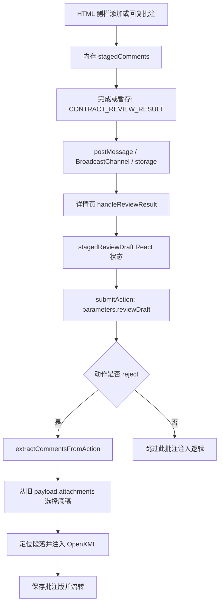

# HTML 批注回写 Word 流程审计

审计日期：2026-10-01。对象：当前工作区源码（包含未提交改动）。本次仅新增审计材料，没有修改业务代码，没有重启服务或操作真实协同任务。

结论：移除 NDA 条款字典、传递 clauseTitle、使用原生 Word 批注是正确方向，但当前实现不能认定为已完成的通用标准方案，更不能据此宣称工业级或任意合同 100% 自适应。存在一个阻断全部报告交互的脚本语法错误，以及多处静默错位、错误底稿和失败被吞的问题。

## 实际流程

HTML 的“添加批注”只是先放进内存；详情页提交才会进入这里的 Word 生成逻辑。可选 commentApiUrl 的 POST 和 DOCX_COMMENT_APPEND 消息是另一路径，预览弹窗并没有接收 DOCX_COMMENT_APPEND。完成/暂存的结果消息是当前主链路的关键桥梁。

## 问题清单

### 1. P1：生成的 HTML JavaScript 无法解析，添加批注及回传流程被阻断

位置：`apps/backend/capabilities/document-domain/runtime-facade/contract-review/contract-review-html-client-script.builder.ts:726`。

submitCommentCreateFromSidebar 中 `if (!text) {` 在 return 后没有闭合，下一条 clauseHeadingEl 声明落在该 if 内。源码是 TypeScript 模板字符串，普通 TypeScript 编译不会替浏览器验证字符串里的脚本。

直接调用 buildContractReviewClientScript，提取实际输出的 script，传入 Node vm.Script，得到 `SyntaxError: Unexpected end of input`。只在内存中补上这一个 `}` 后解析通过，确认了原因。缺陷会阻断该整段 script，包含函数声明、初始化与回传逻辑。

修复：补齐闭合括号，并对生成后的实际 JavaScript 加解析检查及浏览器添加/完成回传回归。

### 2. P1：底稿失效时生成替代合同，仍被当成成功批注版

位置：`docx-comment-injector.service.ts:323`、`:330`、`:634`；`coordination-action.processor.ts:136`、`:205`。

ZIP 打不开或没有 document.xml 时，注入器调用 createMinimalDocxFromText(title, '')。空文本会生成“约定范围、履约期限、权利义务、违约责任、争议解决”五条固定内容；业务处理器取得底稿失败时也会生成最小 DOCX。处理器还把 .doc 二进制文件列为候选，随后会进入无法作为 ZIP 打开的路径。

复现：输入 `Buffer.from('not a docx')`，返回正常 DOCX，含这五条替代内容，并打印 Successfully injected。原合同内容丢失，却没有业务错误。

另外，注入/保存异常只被记录日志，流程继续往下执行，调用者不能据此识别“驳回成功但 Word 生成失败”。

修复：合同原稿写回必须要求有效、可验证的 DOCX。无法读取或格式不支持应返回明确失败；文本转 DOCX 若要支持，应成为明确的独立能力，禁止默默替代合同内容。

### 3. P1：底稿选择没有绑定当前报告版本，可能批注历史文件

位置：`coordination-action.processor.ts:84`。

候选只来自旧 targetItem 的 payload.attachments，没有读取此次 dto.attachments 的替换/追加文件，也没有按报告的 sourceDocumentVersion、附件 ID 或内容哈希绑定。优先条件仅为文件名不含“_法务批注版”。一个历史清洁原稿会优先于当前正在审阅的版本；只有批注版时仍会选择批注版。

详情页实际上提交了含最新追加文件的 finalAttachments（`InboxTaskDetailModal.tsx:378`），因此这不是字段不存在，而是后端没有使用该来源。

修复：由报告携带 sourceAttachmentId + sourceDocumentHash，服务端按版本取得该确切原稿；不要凭名称推断清洁底稿或当前版本。对新上传的版本要求重新审阅或显式重新绑定。

### 4. P1：锚点全局首个匹配会覆盖正确条款信息；最终兜底造成静默错位

位置：`docx-comment-injector.service.ts:397`、`:497`。

锚点仅保留最多 20 个归一化字符，从所有段落中选首个命中，不以 clauseTitle、clauseId 限定范围。只要命中就跳过后续条款定位。重复用语或相同前缀很容易把第三条意见挂到第一条。

复现：第一条和第三条都含“提交材料并办理手续”，传入第三条的标题、编号与该引用，输出挂在第一条。完全不存在的标题、编号和引用也没有被报告为无法定位，而是挂在正文第一段。没有合适正文段时，代码甚至会选第 0 段，与注释“绝不挂在大标题”相违背。

修复：优先锁定条款范围，再解析完整引用的唯一匹配。返回 matched / ambiguous / unresolved 以及证据；匹配失败应保留为未定位意见，不能随机附着到合同条款。

### 5. P1：动态条款上下文透传没有接到实际保存位置

位置：`coordination-automation-runner.service.ts:662`、`coordination-stage-engine.service.ts:503`、`coordination-action.processor.ts:59`。

自动审阅结果把 out.clauses 放进报告，下一人工节点把报告保存为 payload.reviewReport。注入处理器读取的却是 payload.parameters.clauses、reviewDraft.clauses、payload.parameters.reviewResult.clauses，缺少 payload.reviewReport.clauses。

HTML 生成器输入没有 clauses 字段；finish/stage 的 reviewDraft 也没有 clauses。仅在处理器写上这些读取分支不能证明上游已把条款树放在那里。正常新增批注若带 clauseTitle 可以绕过此缺口，但标题缺失、文本回退或上下文消歧不能依赖这条映射。

修复：统一报告/草稿 schema 和实际存储位置，服务端从与该报告版本绑定的审阅结果取条款，不由任意请求内容替代可信条款树。

### 6. P1：数组索引、合同编号和标题位置被混为一谈

位置：`contract-review-engine.service.ts:196`；`docx-comment-injector.service.ts:456`、`:483`。

前端 clauseIndex 来自 clauses.map 的零基数组索引，可能包含前言、章节、附件，并不等同于正文“第 N 条”。注入器把它作为 clauseId 后，直接匹配“第 N 条”或 discoveredHeadings[N-1]。

discoverDocxHeadings 是平面启发式列表，没有层级、父节点或条款 ID；它还会把 1.1 等子项识别成标题。该列表不是完整大纲树。

复现：索引 1（无前言时对应第二条）挂到第一条；包含一个 1.1 子项及两个无编号标题时，索引 2 挂到第一个标题。新增的 DocxClauseItemContext 虽有 clauseNumber，定位逻辑没有使用它。

修复：分别保留 clauseIndex、clauseNumber、clauseId、sourceParagraphId，禁止在它们之间猜测换算。样式解析应处理真实 styles.xml、numPr/numbering.xml 和标题层级。

### 7. P2：XML 文本提取不解码实体，划词批注退化为错误首段；范围扩大为整段

位置：`docx-comment-injector.service.ts:365`、`:516`。

cleanText 只是正则剥离 XML 标签，不解码 &amp; / &lt; 等，不建立 w:t / run 与文本偏移的映射。浏览器选中的 R&D 与 XML 中的 R&amp;D 不相等。

复现：引用第二条的“R&D成果归属知识产权”，最终挂到第一条无关正文。

即使定位成功，commentRangeStart/End 放在段落起点及终点，并没有使用 selectedText 的实际起止位置。因此页面“划词添加”在 Word 中会变成整段批注；跨段选区也没有真实范围支持。

修复：解析 XML 文本节点并解码实体，记录段落/run/字符偏移，按选区分割 run 后添加范围，保留原格式。

### 8. P2：批准/完成动作不生成批注版，功能范围与通用“写入 Word”描述不一致

位置：`coordination-action.processor.ts:55`。

只有 reject 会进入注入器。approve/complete 即使携带 stagedComments，也跳过此逻辑。若业务约定只有驳回产生批注版，这可以成为明确限制；若用户在 HTML 添加后希望审批通过时也写入 Word，则当前不支持。

修复：把生成批注交付物从 reject 分支下沉为独立服务，并按明确产品规则在相应动作触发。

### 9. P2：“优先清洁底稿”没有提供幂等性，回复关系丢失

位置：`docx-comment-injector.service.ts:378`；`contract-review-html-client-script.builder.ts:627`、`:638`。

注入器每次分配新的 Word comment ID，没有保存前端稳定 comment ID 到 Word ID 的映射。相同底稿已含批注、只有批注版可用、重复处理时会追加。同一批注重复注入两次，实际 comments.xml 数量从 1 变成 2。

回复的发送 payload 有 parentCommentId，但 stagedComments 中 newCommentItem 没有该字段，extractCommentsFromAction 也不保留它；回写会成为独立批注，无法重建原回复线程。

修复：按 sourceDocumentHash + draftRevision / actionId 幂等生成，保留稳定 commentId、parentCommentId；清洁底稿重建需要明确跨轮次累计或当前轮次的策略，避免旧意见丢失。

### 10. P2：消息与版本校验允许缺失标识通过，后端也未验证报告绑定

位置：`HtmlReportPreviewModal.tsx:85`、`:107`、`:118`；`InboxTaskDetailModal.tsx:106`、`:415`；`workbench-coordination.service.ts:632`。

postMessage 校验 origin，却没有 event.source 绑定；BroadcastChannel 和 localStorage 使用所有报告共享的固定名字。详情页只有在双方标识都非空且不同才拦截，缺失执行单/产物/版本字段会放行。后端提交逻辑检查用户权限、组织和流程条件，但没有针对 reviewDraft 做上述报告版本一致性验证。

sourceDocumentVersion 还实际位于 reviewReport，而详情页取值不包含这一位置。多个报告窗口并行打开、缺失标识或新旧底稿混用时，前端校验不能构成可靠防串单机制。

修复：所有消息和动作使用必填 taskId、artifactId、sourceDocumentHash 和 draftRevision；消息通道按任务/报告隔离，并绑定 iframe/window；服务端重新校验真实报告与底稿的一致性。

## 其他契约和维护问题

- HTML approvalOpinions 输出为 findingId/opinion/status，注入器却要求 isWordComment，或 clauseId + anchorText；用前端真实形状复现提取为 0。若审批意见只用于审批文本，这是功能边界；若承诺也写入 Word，需统一数据契约。另 op.clauseTitle || title || clauseMap 的 title 总有默认值，使条款映射分支实际不可达。
- HTML/动作脚本仍有 contract-review/nda 默认 ruleSetId，故“所有合同相关默认值彻底移除”不成立。该默认值不直接决定批注位置，但会错误标识规则上下文。
- 文本摘要是展示层格式，不应成为主数据协议。单独依据序号、方括号、中文分段和启发式截断恢复批注，会丢失精确选区、父批注及版本信息。
- InboxTaskDetailModal 1316 行，超过仓库 1200 行评估阈值；注入器 670 行同时承担抽取、去重、定位、XML 包装、替代文档生成；处理器 783 行含底稿加载和文档生成。后续修复应拆出结构化 DTO/校验、底稿解析器、定位器和 OpenXML 写入器，保持业务处理器负责流程编排。

## 验证与证据边界

本次已实际执行：

| 验证 | 结果 |
|---|---|
| 实际生成客户端脚本的语法解析 | 失败：Unexpected end of input |
| 仅在内存补一个闭合括号后解析 | 通过，确认原因；未修改源码 |
| 零基索引到法律编号 | 错位复现 |
| 平面标题列表含子项 | 错位复现 |
| 相同引用在不同条款 | 错位复现 |
| 找不到条款和引用 | 静默挂到首段 |
| 含 XML 实体的引用 | 错位复现 |
| 无效 DOCX | 输出五条替代合同并报告成功 |
| 对同一已批注 DOCX 重复注入同条意见 | 数量变成 2 |
| 前端真实 approvalOpinions 形状 | 提取 0 条 |
| 7 份仓库不同合同样本的有效 DOCX 注入 | 剔除批注标记后的 document.xml 与原始 XML 一致 |

7 份样本包括 NDA、中日/中英买卖合同、中日/中英技术服务合同、无线设备更新合同。该正向检查只证明本次有效包的正文 XML 保留；没有验证 Word/WPS 打开、规范 schema、原生回复线程、实际浏览器交互或生产数据库流转。

现有 scripts/verify-nda-e2e.mjs 通过 HTTP 直接构造驳回和 stagedComments，绕过 HTML 交互；检查批注 XML/引用存在，但不检查是否挂在正确条款及选区。contract-review-comments.e2e.spec.ts 测的是预置 Word 批注提取与 HTML 渲染，不是 HTML 新增批注回写。这些测试不能证明当前页面到 Word 的端到端行为，也捕捉不到模板字符串中的脚本语法错误。本次没有运行会创建任务、发送回执的现有全流程脚本。

## 达到通用方案的建议顺序

1. 修复生成脚本语法，并增加生成脚本解析检查。
2. 禁止无效原稿和未匹配批注的静默成功；先保证不丢合同、不批错条款。
3. 统一报告、草稿、批注 DTO：taskId、artifactId、sourceAttachmentId、sourceDocumentHash、clauseId、clauseNumber、paragraph/run offset、commentId、parentCommentId、draftRevision。
4. 服务端按原稿版本绑定，接入真正保存的 reviewReport.clauses；依据源位置回写，标题/文本匹配用于恢复和校验。
5. 分离匹配结果与 OpenXML 写入，输出 matched/ambiguous/unresolved，不用正文首段强制兜底。
6. 建立幂等生成和明确跨轮次累计策略，明确 approve/complete 是否输出批注版及回复线程要求。
7. 执行真实浏览器“划词→新增→暂存/完成→详情页→提交→下载”的回归，断言批注文本、准确范围、正文保留、版本、重复提交和失败状态；再覆盖多合同与 Word/WPS 打开检查。
