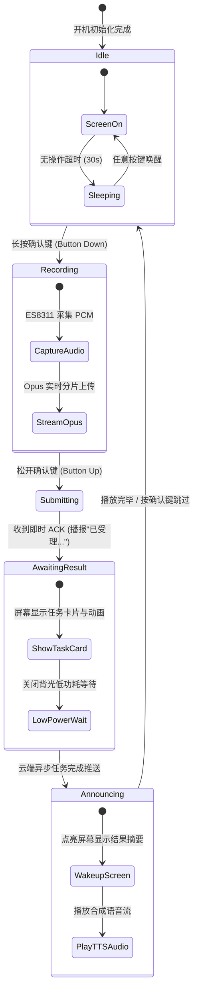

# AI Passport 随身语音任务终端 (AI Passport Voice Agent Terminal) 设计文档

- **项目标识**：`apps/ai-passport-agent`
- **定位**：面向 AI 自动化与日常任务编排的实体随身智能终端，**替代手机微信**作为 AI Agent 的首选物理交互入口。
- **硬件载体**：Folo AI Passport (ESP32-C3, 240×320 ST7789P3, ES8311 Codec, ADC 电阻梯按键, 无 PSRAM, 8MB Flash)
- **软件底座**：基于 `folo-ai-passport-xiaozhi` 硬件驱动与音频框架深度演进。

---

## 1. 业务背景与产品定位

### 1.1 痛点与替代微信的价值
在传统运维自动化或 AI 个人助理场景中，用户通常需要：
1. 掏出手机 → 解锁手机；
2. 打开微信 → 搜索找到 AI 机器人或工作群；
3. 打字输入或录制语音消息；
4. 等待 AI 返回文本或语音，期间不能锁屏或需要反复查看通知。

**AI Passport 模式**：
- 佩戴在胸前或随身携带，随时可触达；
- **长按确认键直接说话**，松开即刻提交任务；
- 即时收到确认反馈（“任务已收到，开始执行...”），设备进入低功耗异步等待；
- 任务执行完毕后（无论耗时数秒还是数分钟），设备主动唤醒，**语音朗读执行结果**并在屏幕展示文字摘要。

### 1.2 典型工作流场景
- **运维巡检与故障响应**：“帮我重启测试环境的支付服务”、“检查生产集群 Pod 状态”；
- **日程与任务下达**：“记录一个待办：下午 3 点参加架构评审”、“提醒我半小时后出门”；
- **智能分析与速报**：“今天系统的错误日志有异常激增吗？”

---

## 2. 系统总体架构

```mermaid
graph TD
    subgraph 物理硬件层 [AI Passport ESP32-C3]
        HW_KEY[GPIO0 电阻梯按键 PTT]
        HW_AUDIO[ES8311 麦克风/扬声器]
        HW_LCD[ST7789P3 240x320 屏幕]
        HW_PWR[PWM背光与电源管理]
    end

    subgraph 固件运行时 [apps/ai-passport-agent]
        AppSM[TaskApplication 状态机]
        AudioEngine[AudioService / Opus编解码]
        DisplayMgr[LcdDisplay / 任务卡片渲染]
        Router{Transport Router}
        WiFiProto[WiFi WebSocket/MQTT 协议]
        BLEProto[NimBLE Gateway 协议]
    end

    subgraph 接入中继网关
        WiFi_AP[家庭 / 办公 Wi-Fi]
        Phone_BLE[手机端伴随网关 / 微信小程序]
    end

    subgraph 云端 AI 平台 [ops-automation 平台]
        GatewayServer[Agent Voice Gateway]
        STT_TTS[Whisper STT / CosyVoice TTS]
        Orchestrator[Intelligence 智能体编排引擎]
        ExecCtrl[Execution Control 任务执行引擎]
    end

    HW_KEY --> AppSM
    HW_AUDIO <--> AudioEngine
    HW_LCD <-- DisplayMgr
    AppSM <--> AudioEngine
    AppSM <--> DisplayMgr
    AppSM <--> Router

    Router <-->|Wi-Fi 模式| WiFiProto <--> WiFi_AP <--> GatewayServer
    Router <-->|随身 BLE 模式| BLEProto <--> Phone_BLE <--> GatewayServer

    GatewayServer <--> STT_TTS
    GatewayServer <--> Orchestrator <--> ExecCtrl
```

---

## 3. 双通道联网设计（Wi-Fi 直连 + 手机 BLE 中继）

为了适应办公室、家庭以及户外随身各种场景，终端支持双链路智能切换：

### 3.1 模式 A：Wi-Fi 直连模式（独立运作）
- **触发条件**：检测到已配置的 Wi-Fi 信号可用。
- **协议链路**：基于 WebSocket / MQTT 直连云端 `Agent Voice Gateway`。
- **长连接与心跳**：采用轻量级 Ping/Pong 心跳包，保证云端异步任务完成时能随时下发通知。

### 3.2 模式 B：手机蓝牙中继模式（随身伴随）
- **触发条件**：无 Wi-Fi 连接或 Wi-Fi 断开时，开启 BLE GATT 广播。
- **手机伴随端**：提供轻量级**微信小程序**（免安装，利用手机蓝牙与蜂窝网络）。
- **GATT 服务规范**：
  - `Service UUID`: `0000FFF0-0000-1000-8000-00805F9B34FB`
  - `Characteristic 1 (Audio Stream)`: 支持 Opus 语音切片分包传输（MTU 协商至 256 或 512 字节）。
  - `Characteristic 2 (Control & Event)`: JSON 格式的任务指令（`task_start`、`task_ack`、`task_notify`）。
- **手机行为**：小程序在后台或前台维持与云端平台的 WebSocket，充当透明数据传输桥梁。

---

## 4. 固件交互与状态机设计



### 按键交互映射：
| 按键操作 | 待机状态 | 录音状态 | 播报状态 |
| :--- | :--- | :--- | :--- |
| **确认键 (短按)** | 唤醒屏幕 / 查看上一条任务卡片 | 无 | 中止当前语音播报 |
| **确认键 (长按)** | **开始录制任务**（进入 PTT 模式） | **松开结束录制**并提交 | 无 |
| **上键 (短按)** | 音量 +10 / 列表上翻 | 无 | 音量 +10 |
| **下键 (短按)** | 音量 -10 / 列表下翻 | 无 | 音量 -10 |

---

## 5. ESP32-C3 极度受限环境调优规范

针对硬件 **无外部 PSRAM**、内部 SRAM 仅约 400KB 的硬约束：
1. **禁用 Bluedroid，使用 Apache NimBLE**：节省至少 80KB~100KB 内存；
2. **Opus 流式切片**：每 20ms 一帧音频采集即编码发送，零整段缓存；
3. **Wi-Fi 与 BLE 互斥/动态切换**：
   - Wi-Fi 连通时停止高频 BLE 广播以保障 RF 性能与内存；
   - Wi-Fi 断开后拉起 NimBLE 广播等待伴随手机连接；
4. **字模与图标 SPIFFS 外部化**：2MB `assets` 分区存储字体与动画帧，不占用 RAM。

---

## 6. 与 `ops-automation` 平台的接口契约

### 6.1 终端提交任务包 (JSON + Binary Opus)
```json
{
  "type": "task.submit",
  "device_id": "passport-c3-001",
  "timestamp": 1726327200,
  "transport": "wifi",
  "audio_format": "opus/24000/1"
}
```

### 6.2 平台即时受理回复 (ACK)
```json
{
  "type": "task.ack",
  "task_id": "tsk_8f92a10",
  "status": "queued",
  "immediate_tts": "任务已接收，正在处理"
}
```

### 6.3 平台任务完成主动通知 (Push Notification)
```json
{
  "type": "task.completed",
  "task_id": "tsk_8f92a10",
  "status": "success",
  "summary_text": "生产支付服务已成功重启，健康检查正常。",
  "has_audio_stream": true
}
```
终端收到后，立即拉取或直接接收随包下发的 TTS 音频流进行播报。

---

## 7. 落地规划与演进步骤

- **阶段一：工程立项与驱动移植**
  - 在 `apps/ai-passport-agent` 建立干净的单板代码框架；
  - 继承 `folo-ai-passport-xiaozhi` 的 ST7789P3、ES8311 与 ADC 按钮基线。
- **阶段二：PTT 任务对讲与异步通知状态机**
  - 重构 `Application` 与 `AudioService`，实现按住录音、松开发送与异步通知唤醒播报。
- **阶段三：双通道网络实现**
  - 保留 Wi-Fi WebSocket 协议；
  - 集成 NimBLE GATT Server 并提供基础数据中继规范。
- **阶段四：平台与实机联调**
  - 对接 `ops-automation` 网关完成端到端任务语音流转。
