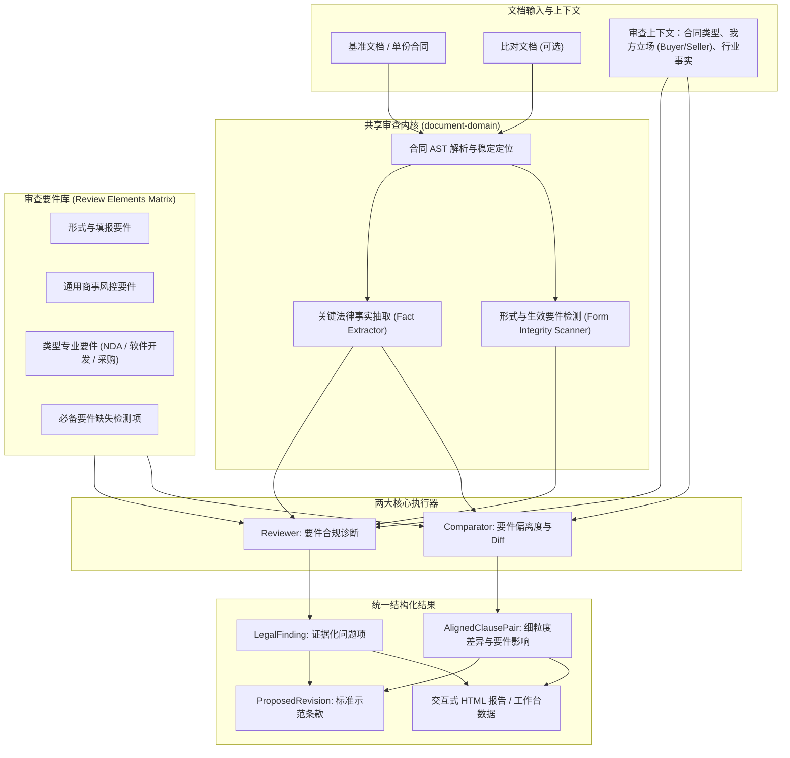
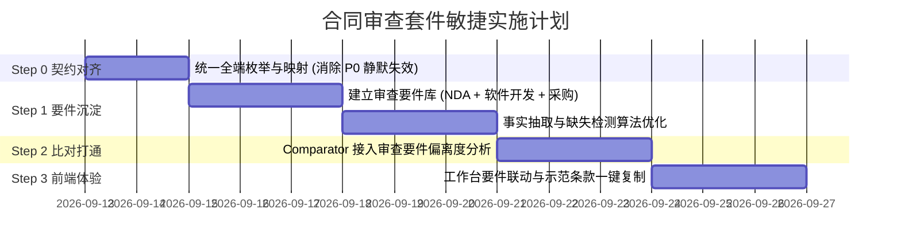

# 合同法务审查与红线比对套件功能设计 v1.0

> 设计对象：`platform.document.contract-reviewer`、`platform.document.contract-comparator`  
> 文档状态：Approved  
> 设计阶段：法务审查要件强化与工具套件升级（明确不扩张为重型合同生命周期审批系统）  
> 更新日期：2026-09-12

---

## 1. 文档目的与设计定位

本文聚焦完善现有两项基础法务工具能力：

- **合同文档智能审查与合规诊断**（`platform.document.contract-reviewer`）
- **合同文档智能比对与红线审查**（`platform.document.contract-comparator`）

### 1.1 核心价值定位：审查要件与事实偏离度引擎
本套件定位为**法务专业人员的高效审查辅助工具（Legal Copilot Toolkit）**，其核心价值在于：
1. **审查要件全覆盖**：基于法务专业实践，对合同形式要件、通用商事要件、业务专属要件及必备缺失要件提供确定性检查；
2. **证据可追溯**：每个审查结论必须精准锚定到原文段落与字符偏移，提供客观事实观察；
3. **消除规则割裂**：比对（Comparator）与单份审查（Reviewer）共享同一套风控要件库，比对不仅展示字符差异，更指出**“要件偏离度”**；
4. **务实可用**：提供标准化法务建议与可一键复制的示范条款，辅助人工决策，不假装具有替代法务的法律确定性。

### 1.2 明确非目标（防过度扩张声明）
为确保工程重心聚焦于“把审查要件审准、审透”，本阶段**坚决不涉足**以下外溢领域：
- **不自研 BPM/审批流引擎**：不实现复杂的合同流转状态机、多级审批授权、超时催办等流程（复用平台现有通用任务流机制）；
- **不自研 DSL 规则解释引擎**：不设计复杂的 AST 语法规则解释器或表达式求值器，采用“结构化 JSON Schema + 关键事实抽取 + 提示词引导”；
- **不做 DOCX 二进制逆向排版与修订回写**：修改建议以“规范示范条款”和“一键复制对照”形式输出，不直接重构高风险的 OpenXML 格式文件；
- **不做分布式事件驱动总线与独立微服务**：完全依托现有 NestJS `document-domain` 单体运行时门面，不引入跨服务事件总线与冗余 CRUD 接口。

---

## 2. 核心设计原则

### 2.1 审查要件优先（Review Elements First）
合同审查的质量取决于审查要件的科学性与覆盖率。系统将审查要件分为三层：
1. **形式与生效要件**：主体适格性、统一社会信用代码、空白下划线/未填占位符、签名签章完备性；
2. **通用商事风控要件**：争议管辖、责任限制与例外、不可抗力、单方解除权对等性；
3. **业务特定专业要件**：针对 NDA、软件定制开发、采购买卖等不同合同类型的特定权责分配要件。

### 2.2 “红线”概念严格拆分
- **文本红线（Redline Diff）**：版本间发生的客观增、删、改、移；
- **法务红线（Policy Red Flag）**：违反组织底线政策、构成实质权利减损或引致重大责任敞口的要件缺陷。  
文本发生修改不代表有法律风险；未修改的条款同样可能蕴含法务红线。

### 2.3 区分客观事实观察与法理推理
AI 审查输出的最小业务单元为结构化问题项 `LegalFinding`，必须严格区分：
```text
【客观事实观察 (Factual Observation)】：候选版本第 8.2 条删除了“直接经济损失”中的“直接”二字。
【法理研判理由 (Reasoning)】：责任赔偿范围由实际直接损失扩大至可得利益等全部间接损失，命中“责任范围过度扩大”红线。
【潜在业务影响 (Business Impact)】：可能在发生一般违约时面临远超合同交易总额的索赔敞口。
【推荐示范条款 (Proposed Revision)】：违约方赔偿责任以守约方遭受的合理、直接实际经济损失为限。
```

### 2.4 两项能力的协同分工
| 子能力 | 核心职责 | 在审查要件中的角色 |
| :--- | :--- | :--- |
| **Reviewer（单份诊断）** | 诊断单份合同版本的要件完备性 | 检查该版本是否满足所有必备要件、是否存在不利要件与形式缺陷 |
| **Comparator（版本比对）** | 诊断版本演进过程中的要件偏离度 | 检查修改版相较基准版，哪些核心要件被悄悄削弱、篡改或删除 |

---

## 3. 现状评估与关键断层修复

### 3.1 现状与已具备基础
项目已在 `apps/backend/capabilities/document-domain/runtime-facade/` 建立了坚实的基础设施：
- **文档解析**：支持 DOCX、PDF、纯文本解析为合同条款树（AST），具备段落与版块定位；
- **单份审查**：`ContractReviewEngineService` 支持合同类型自动识别、形式完整性检测（`ContractFormIntegrityScannerService`）、内置规则匹配（`ContractChecklistMatrixService`）以及 LLM 语义审查与降级回退（`ContractLlmReviewService`）；
- **版本比对**：`ContractCompareService` 支持章节对齐（`SectionAlignerService`）、字符/Token 级精确 Diff（`CharDiffEngineService`）与双栏 HTML 交互渲染。

### 3.2 阻碍审查要件生效的关键断层（P0 级必修清单）

| 严重度 | 缺陷定位 | 根因与影响 | 解决方案 |
| :--- | :--- | :--- | :--- |
| **P0** | **合同类型枚举分裂** | 管理端/用户端使用 `software_development`、`employment`；后端 `contract-review.types.ts` 使用 `software_dev`、`labor`。导致前端传入时命中 `default` 空规则，**软件类审查要件全部静默失效**！ | 全系统标准化为 `software_development`、`employment`，后端建立适配器向下兼容 `software_dev` 与 `labor`。 |
| **P0** | **审查立场枚举分裂** | 前端使用 `party_a`、`party_b`、`both`；后端提示词引擎使用 `buyer`、`seller`、`neutral`。导致用户设定的审查立场无法准确映射到法律推理。 | 全系统标准化立场枚举，建立前置映射层：`party_a -> buyer`，`party_b -> seller`，`both -> neutral`。 |
| **P0** | **比对引擎要件脱节** | `contract-compare.service.ts` 的 `enrichLegalRisk` 完全独立写死粗糙正则，与 Reviewer 审查要件库毫无联系。 | 比对引擎引入审查要件评估器，以“要件是否被削弱”替代孤立正则匹配。 |
| **P1** | **要件缺失检测粗暴** | 原 `detectMissingClauses` 仅通过单一关键词反向匹配（如 `!/不可抗力/i.test`），同义表达极易造成误报。 | 升级为“多组同义词族覆盖检测 + 语义检索兜底”，并返回未找到的置信度。 |
| **P1** | **健康分缺乏法律依据** | 原 `healthScore` 采用简单的固定算术扣分，容易产生虚假安全感。 | 更名为“辅助风险指数”，显著声明计算规则与免责声明，不得作为正式放行依据。 |

---

## 4. 审查套件系统架构



---

## 5. 核心体系：合同审查要件（Review Elements）架构

### 5.1 审查要件模型定义
审查要件是整个套件的业务核心，统一建模如下：

```ts
export interface ReviewElement {
  id: string;                                   // 要件唯一标识，如 "nda_duration_limit"
  title: string;                                // 要件名称，如 "保密义务存续期合理性"
  category: ReviewElementCategory;              // 要件分类
  applicableContractTypes: ContractType[];      // 适用的合同类型
  applicablePosition: 'buyer' | 'seller' | 'both'; // 我方立场敏感度
  severity: 'HIGH' | 'MEDIUM' | 'LOW';          // 默认风险等级
  checkType: 'PRESENCE' | 'SUBSTANTIVE' | 'FORM'; // 检查类型：必备存在性 / 实质合理性 / 形式规范

  /**
   * 结构化事实抽取目标（指导事实抽取器提取具体要素）
   */
  factKeys?: Array<'duration_years' | 'liability_cap' | 'forum_location' | 'delivery_unit'>;

  /**
   * 触发判定的条件描述（供 LLM 研判与本地规则降级）
   */
  riskCondition: string;                        // 构成风险的情形描述
  riskSummaryTemplate: string;                  // 风险事实说明模板
  legalAdviceTemplate: string;                  // 法务对策与修改指引

  /**
   * 规范化示范条款（可配置、带参数占位符）
   */
  standardRevisionTemplate?: string;
}

export type ReviewElementCategory =
  | 'FORM_AND_VALIDITY'       // 形式完整与生效要件
  | 'DISPUTE_AND_GOVERNING'   // 争议管辖与适用法
  | 'LIABILITY_AND_REMEDY'    // 违约责任与救济
  | 'INTELLECTUAL_PROPERTY'   // 知识产权与归属
  | 'CONFIDENTIALITY'         // 保密范围与期限
  | 'DELIVERY_AND_ACCEPTANCE' // 交付履行与验收
  | 'PAYMENT_AND_SETTLEMENT'  // 付款结算与账期
  | 'TERMINATION_AND_SURVIVAL';// 合同解除与存续
```

### 5.2 审查要件关键事实抽取（Fact Extraction）规范
要件研判不能只依赖模糊语义理解，必须优先抽取关键事实要素：

| 事实要素 | 抽取字段 | 典型正则与抽取逻辑 | 用于哪些审查要件 |
| :--- | :--- | :--- | :--- |
| **保密期限** | `confidentialityYears`, `isPerpetual` | `/(永久|无期限|一直有效|(\d+)年)/` | NDA 保密期限、离职后保密义务 |
| **工期计算口径** | `deliveryDayType`, `deliveryDays` | `/(工作日|自然日|日历日)/` + `/\d+日/` | 软件开发交付工期、采购到货期 |
| **责任限额** | `liabilityCapType`, `capPercentage` | `/(合同总额.*%|实际支付金额|无限责任)/` | 违约责任上限、保密赔偿限制 |
| **管辖地点** | `forumType`, `forumLocation` | `/(原告所在地|被告所在地|甲方住所地|仲裁委员会)/` | 争议管辖条款合规性 |
| **付款前置条件** | `auditCondition`, `paymentDays` | `/(内部审计后|集团审批完成后|验收合格后(\d+)日)/` | 采购/软件付款账期可控性 |

---

## 6. 核心业务合同审查要件实务规范

### 6.1 形式与生效要件（全合同通用基础要件）

```text
[FORM-01] 签约主体适格性与信用代码
- 审查点：签约各方名称是否为法定登记全称；是否存在 18 位统一社会信用代码（USCC）；
- 判定标准：首部未载明企业名称或存在曾用名、简称；缺失社会信用代码且未约定法定代表人。
- 示范条款：甲方（统一社会信用代码：【{{partyA_uscc}}】），法定代表人：【{{partyA_legalRep}}】。

[FORM-02] 模板未填占位符与留白下划线排查
- 审查点：正文是否存在未替换的参数占位符 {{var}}、{var}、[待定]、[TBD] 或空白下划线（3个以上下划线）。
- 判定标准：发现未填写变量扣减合规完整度，提示签署前必须完成商务要素固化。

[FORM-03] 签字盖章与授权要素完整性
- 审查点：尾部签署区是否包含法定代表人/授权代表签字栏、加盖公章/合同专用章要求、签署日期。
```

### 6.2 通用商事风控要件（全合同通用）

```text
[COMM-01] 司法管辖偏向性审查
- 审查点：争议管辖法院或仲裁地。
- 判定标准：
  - 我方为原告/优势地位时，约定对方所在地管辖为【高危】；
  - 诉讼管辖与仲裁机构约定混淆（“向仲裁委提起诉讼”）为【中危】。
- 示范修改：因本协议引起的或与本协议有关的任何争议，均由原告所在地有管辖权的人民法院管辖。

[COMM-02] 违约赔偿范围边界
- 审查点：赔偿金范围是否包含惩罚性赔偿、无过错连带责任或不确定的间接可得利益。
- 判定标准：出现“赔偿一切直接和间接损失”、“无论是否有过错均承担连带责任”。
- 示范修改：违约方应赔偿守约方因违约行为直接遭受的实际财产损失，不包括间接损失或商业信誉损失。

[COMM-03] 单方解除权对等性
- 审查点：是否赋予相对方单方无因解除权，而限制我方的合同解除救济。
- 判定标准：对方有权“随时书面通知解除”，我方仅在对方破产时方可解除。
- 示范修改：任一方行使法定解除权必须基于相对方发生实质性重大违约，且经书面催告后 15 日内仍未纠正。
```

### 6.3 商业保密协议（NDA）专属审查要件规范

| 要件编号 | 要件名称 | 审查核心要点 | 风险触发判定条件 | 示范修改策略 |
| :--- | :--- | :--- | :--- | :--- |
| **NDA-01** | 保密信息定义与标记 | 是否限定书面标记或口头确认期 | “凡一方接触到的任何信息均属保密”，无标记要求且无口头书面确认期 | 补充口头信息 10 个工作日内书面确认，且书面介质需加盖保密标记 |
| **NDA-02** | 法定五大除外情形 | **必备要件检查**：公知、已知、合法第三方、独立研发、强制披露 | 缺少上述任一法定除外（尤其是司法强制披露与独立研发）为【高危阻断】 | 补充完整的五大排除情形条款 |
| **NDA-03** | 注意义务标准合理性 | 接收方保护措施程度 | 要求“确保绝对安全”、“达到最高安全标准”、“杜绝任何泄密事件” | 修改为“不低于保护自身同类重要信息的谨慎标准，且不低于合理注意标准” |
| **NDA-04** | 保密期限双轨区分 | 一般信息与商业秘密的期限划分 | 对全部普通商务信息约定“永久保密”或“无限期有效” | 一般商业信息限制为 2~3 年；仅依法构成商业秘密的信息在存续期内持续有效 |
| **NDA-05** | 介质销毁与自动备份 | 终止后文档销毁的可行性 | 要求“立即物理销毁一切副本，包括灾备磁带”，无备份例外 | 明确因系统常规自动备份产生的无法即时删除的电子副本，可自然留存并继续受保密约束 |
| **NDA-06** | 救济与责任限额 | 违约赔偿金与直接损失 | 约定巨额固定违约金（如百万元以上）或无上限连带责任 | 限制为可证明的直接实际经济损失，删除惩罚性定额赔偿 |

### 6.4 软件定制开发协议专属审查要件规范

| 要件编号 | 要件名称 | 审查核心要点 | 风险触发判定条件 | 示范修改策略 |
| :--- | :--- | :--- | :--- | :--- |
| **SOFT-01** | 交付物完整性（源代码） | **必备要件检查**：交付物是否明确包含源码与技术文档 | 仅约定交付“可运行程序”或“安装包”，未明确源代码、构建脚本、API 文档 | 增加交付物清单：必须包含未经混淆的代码、数据字典、架构文档与构建部署脚本 |
| **SOFT-02** | 知识产权独家归属 | 定制研发成果权利归属 | 约定定制代码“归开发方所有”或仅授予我方“普通许可” | 明确约定定制开发形成的代码自交付起独家归我方所有；开发方仅保留原有通用框架非排他许可 |
| **SOFT-03** | 工期自然日陷阱排查 | 交付工期计算口径 | 交付周期出现“自然日/日历日”计算，未排除法定节假日 | 坚持采用“工作日”口径，或明确增设“因需求确认延迟导致工期对等顺延”保护条款 |
| **SOFT-04** | 试运行与验收标准 | 验收程序与通过门槛 | 约定“上线后 3 日内未提出异议即视为验收通过”的默示签收条款 | 确保包含不少于 15 个工作日的业务试运行期，且以双方书面签署《验收合格报告》为准 |
| **SOFT-05** | 第三方侵权连带担保 | 供应商不侵权承诺与兜底 | 未约定开发方就交付物承担第三方知识产权侵权抗辩与赔偿义务 | 增加第三方侵权担保：开发方自担费用应诉并赔偿我方因此遭受的全部直接损失与律师费 |
| **SOFT-06** | 付款与内部审计脱钩 | 付款账期起算点 | 约定“经甲方集团内部审计完成后支付”等单方不可控前置条件 | 纠正为固定账期（如“验收合格并收到等额合规增值税发票后 30 日内付款”） |

---

## 7. 子能力实现设计

### 7.1 Reviewer：合同文档智能审查与合规诊断

#### 输入与前置映射
```ts
export interface ContractReviewInput {
  fileBase64?: string;
  fileName?: string;
  text?: string;
  contractType?: ContractType; // 标准枚举
  myPosition?: 'buyer' | 'seller' | 'neutral'; // 标准化立场
  customCheckpoints?: CustomCheckpointDto[];
}
```

#### 执行流程
1. **AST 结构化解析**：提取合同正文条款、章节目录树及段落 Block；
2. **类型与立场规范化**：自动分类或校验输入类型，将旧版 `software_dev` 兼容映射到 `software_development`；
3. **形式要件扫描**：`ContractFormIntegrityScannerService` 排查占位符、留白与主体要素；
4. **要件矩阵逐条匹配**：
   - 提取条款中关键事实（期限、违约金比例、管辖地）；
   - 匹配对应要件的风险判定条件；
   - 结合我方立场调用 LLM 进行深度法理研判，输出事实观察与针对性建议；
5. **必备要件缺失检测**：对全文进行结构化缺失排查，输出 `MissingClauseAlert`；
6. **输出统一结构化模型**：生成包含证据高亮范围与示范条款的诊断输出。

### 7.2 Comparator：合同文档智能比对与红线审查

#### 定位升级：从字符 Diff 走向“要件偏离度分析”
Comparator 的核心输出不仅是文本变动，更在于**揭示修改对审查要件的影响**：
- **状态划分**：`UNCHANGED`（未变）、`MODIFIED`（修改）、`ADDED`（新增）、`DELETED`（删除）；
- **要件偏离度研判**：
  - 若修改涉及工期，对比是否由“工作日”退化为“自然日”；
  - 若修改涉及责任条款，对比赔偿范围是否被删除限定词（如“直接损失”变为“损失”）；
  - 若删除条款命中了“必备要件”（如删除了争议管辖或保密例外），立即提升为 **HIGH** 等级法务红线提示；
- **纯格式变动降噪**：过滤空格、换行、全半角标点符号变动，避免干扰法务视线。

---

## 8. 统一领域数据契约与规范

### 8.1 规范枚举定义（消除分裂）
```ts
// 单一事实源：全端必须统一使用本枚举
export type ContractType =
  | 'nda'                    // 商业保密协议
  | 'software_development'   // 软件定制开发与系统集成
  | 'procurement'            // 企业采购与供货
  | 'employment'             // 劳动雇佣与竞业禁止
  | 'lease'                  // 场地与房屋租赁
  | 'general';               // 通用框架合作

export type PartyPosition =
  | 'buyer'                  // 甲方 / 采购方 / 委托方 / 披露方
  | 'seller'                 // 乙方 / 服务商 / 受托方 / 接收方
  | 'neutral';               // 中立客观商事法务立场
```

### 8.2 结构化问题项模型（LegalFinding）
```ts
export interface LegalFinding {
  id: string;
  elementId?: string;               // 对应的审查要件 ID (如 nda_perpetual_duration)
  title: string;                    // 问题标题
  category: ReviewElementCategory;  // 要件分类
  severity: 'HIGH' | 'MEDIUM' | 'LOW';
  
  // 核心法务内容分栏
  factualObservation: string;       // 客观事实观察（客观事实，不带主观评价）
  reasoning: string;                // 法理研判与合规风险说明
  businessImpact?: string;          // 潜在商业/经济影响
  
  // 精确原文证据
  evidence: EvidenceAnchor[];       // 原文引用与高亮定位
  
  // 推荐修改方案
  proposedRevision?: {
    originalText: string;           // 原条款文本
    recommendedText: string;        // 示范修改文本（带高亮标示）
    actionType: 'REPLACE' | 'INSERT' | 'DELETE';
  };
  
  analysisSource: 'DETERMINISTIC_RULE' | 'LLM_SEMANTIC' | 'FORM_SCANNER';
  confidence: number;
}

export interface EvidenceAnchor {
  clauseNumber?: string;
  clauseTitle?: string;
  startOffset?: number;
  endOffset?: number;
  quotedText: string;
}
```

---

## 9. 前端交互设计（轻量法务审查工作台）

### 9.1 工作台三栏布局
不引入重型协同审批流，保持直观、专注的审查视图：

```text
┌────────────────────────────────────────────────────────────────────────┐
│ 📄 合同名称: 软件开发定制合同_v2.docx  | 类型: 软件研发 | 立场: 甲方/采购方   │
├──────────────────┬─────────────────────────────┬───────────────────────┤
│ 📋 审查要件清单  │ 📜 合同正文 (或双栏比对)    │ 🔍 要件分析与示范修改 │
│ ───────────────  │ ─────────────────────────── │ ───────────────────── │
│ 🔴 成果源码交付  │ 点击左侧要件/问题项，正文中 │ 【事实观察】          │
│ 🟡 自然日工期    │ 精准滚动并高亮黄色背景标记  │ 条款未约定源码交付。  │
│ 🟢 保密期限      │                             │ 【法理分析与对策】    │
│ ⚪ 必备要件完整  │ 交付物不仅包括系统编译程序  │ 面临代码资产锁定风险。│
│                  │ 还需要满足交付验收标准...   │ ───────────────────── │
│                  │                             │ 💡 【推荐示范条款】   │
│                  │                             │ [一键复制示范条款]   │
└──────────────────┴─────────────────────────────┴───────────────────────┘
```

### 9.2 核心交互特性
1. **要件驱动联动**：点击左侧审查要件，中间原文立即滚动至证据所在段落并以醒目颜色高亮；
2. **事实与对策分离**：右侧卡片清晰呈现“抓到的事实”与“法理建议”，拒绝笼统的 AI 客套话；
3. **示范条款一键复制**：直接复制符合法理的规范示范文本，便于法务人员粘贴回原编辑软件或直接发送业务同事；
4. **比对模式要件差异高亮**：双栏比对中，若修改触碰了要件红线，在差异区块上方以角标明确提示“触发【工期口径】要件变更”。

---

## 10. 代码目录重构建议

依托现有 NestJS `document-domain` 模块进行职责收敛，避免过度拆分微服务：

```text
apps/backend/capabilities/document-domain/runtime-facade/
├── contract-review/
│   ├── contract-review.controller.ts
│   ├── contract-review.service.ts
│   ├── contract-review-engine.service.ts
│   ├── contract-checklist-matrix.service.ts  <-- 升级为集中式审查要件库
│   ├── contract-form-integrity-scanner.service.ts
│   ├── contract-llm-review.service.ts
│   └── contract-review.types.ts              <-- 规范枚举与 LegalFinding 结构
├── contract-compare/
│   ├── contract-compare.controller.ts
│   ├── contract-compare.service.ts           <-- 接入共享要件偏离度分析
│   ├── section-aligner.service.ts
│   ├── char-diff-engine.service.ts
│   └── contract-compare.types.ts
└── contract-elements/                        <-- 新增：共享审查要件定义
    ├── review-element.types.ts
    ├── elements-nda.ts
    ├── elements-software.ts
    ├── elements-general.ts
    └── element-fact-extractor.ts
```

---

## 11. 敏捷落地实施计划（四步走）



### Step 0：契约对齐与断层消除（P0 级最高优先）
- 目标：确保前端、后端、管理端合同类型与立场完全一致；
- 交付物：更新 `contract-review.types.ts`、`ContractReviewerConfigPanel.tsx`、`contractReviewRules.types.ts`，彻底消除 `software_development` 被降级为空规则的隐患。

### Step 1：集中式合同审查要件库沉淀
- 目标：将形式要件、通用要件、NDA 12 要件与软件开发 6 要件固化入后端系统；
- 交付物：升级 `ContractChecklistMatrixService`，强化结构化事实抽取与同义词覆盖度检测。

### Step 2：比对引擎与审查要件打通
- 目标：彻底消灭比对引擎中独立的死规则正则；
- 交付物：重构 `ContractCompareService.enrichLegalRisk`，让条款修改与删除能够精确命中被触碰的审查要件。

### Step 3：前端审查要件证据化与实用交付
- 目标：为用户提供要件清单、原文证据高亮与示范条款复制的流畅体验；
- 交付物：优化 HTML 报告与前端交互面板，支持一键复制示范文本。

---

## 12. 验收标准

1. **枚举准确性**：传入 `software_development` 与 `employment` 时，后端 100% 正确命中对应专业要件，零静默降级；
2. **要件覆盖率**：在标杆测试集（NDA、定制软件合同）中，核心要件（保密期限、除外情形、源码交付、工期口径、知识产权独家性）检出率达 95% 以上；
3. **证据确凿度**：每个输出的高危问题项必须附带具体的原文引文（Quoted Text），严禁虚构证据；
4. **比对一致性**：对同一个删除或篡改核心要件的操作，Reviewer 与 Comparator 输出一致的要件违规评级。
