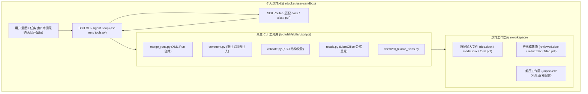

# 第一阶段：深度 Office/PDF 能力架构与个人沙箱 (DSH) 隔离验证设计方案

> 文档版本：v1.0  
> 所属阶段：Phase 1 (办公文档与企业格式深度能力)  
> 核心原则：**沙箱隔离先行 (Sandbox-First)、零破坏现有业务链路、黑盒脚本工具化**  
> 目标运行环境：`docker/user-sandbox` (DeepSeek Harness / `dsh`)

---

## 1. 背景、痛点与设计定位

### 1.1 现有能力现状与瓶颈
目前平台生产环境中，文档处理主要依靠 `capabilities/document-domain`（原 `document-engine`）与 `carbone-engine`：
- **优点**：基于既定 Word/Excel 模板（包含 `{d.field}` 占位符）的高并发邮件合并渲染与 PDF 转换性能稳定。
- **痛点**：
  1. **无法进行自适应非模板生成**：当用户输入无固定模板、结构多变的分析报告或财务测算时，无法动态排版。
  2. **缺少真正的合同审阅留痕能力**：法务合同审阅场景中，现有 `contract-reviewer` 仅能输出 Markdown 审核意见，无法在原有 `.docx` 文件中留下符合 Word 规范的修订红线（Tracked Changes `<w:ins>/<w:del>`）和侧边批注（Comments）。
  3. **Excel 公式缺少计算值缓存**：使用 `openpyxl` 写入的公式默认不含预计算缓存（Cached Values），下游系统（如 Pandas、预览插件）直接读取会呈现 `None`，且大模型容易引入 LibreOffice 不支持的动态数组函数导致渲染报错。
  4. **PDF 仅限于静态拆合**：无法识别和填报政府、银行、企业的交互式 PDF 表单（AcroForms）。

### 1.2 借鉴 Anthropic Skills 的核心理念
Anthropic 官方的 `docx`、`xlsx`、`pdf` 技能沉淀了极其珍贵的工业级避坑指南与黑盒脚本工具集：
- **碎片化 XML 处理**：针对 Word XML 中文字常因拼写检查、修订版本被打碎成多个 `<w:r>` 标签的问题，提供 `merge_runs.py` 安全合并。
- **公式强制重算器**：`recalc.py` 驱动无头 LibreOffice 静默重算并固化公式结果，自动捕捉 `#NAME?`、`#VALUE!`。
- **PDF 交互式表单闭环**：`check_fillable_fields.py` + `extract_form_field_info.py` + `fill_fillable_fields.py` 实现结构化表单提取与填充。

### 1.3 核心设计红线：个人沙箱隔离先行 (Zero-Regression)
**本阶段所有新增脚本与技能升级仅在个人沙箱 `dsh` (`docker/user-sandbox`) 内落地与验证**：
1. **零改动生产微服务**：不触碰 `capabilities/document-domain`、`carbone-engine`、`platform` 的核心代码与 Compose 编排。
2. **零影响当前工作模式**：平台目前的模板渲染、任务调度不受任何干扰。
3. **沙箱作为试验田**：在 `dsh` 容器沙箱内对真实 Word 合同、Excel 模型、PDF 表单进行充分验证，成熟后再评估向全平台能力域的迁移方案。

---

## 2. 核心架构与沙箱交互流



---

## 3. 三大 Office 核心能力在 DSH 中的深度实现

### 3.1 Word (DOCX) 审阅红线与批注系统

#### 1. 痛点根因分析
Word 文档本质是 ZIP 压缩的 XML 包。在 `word/document.xml` 中，看似连续的一句文本（如“付款期限为30天”），在 XML 内部可能因为历史拼写检查、输入法分词被切断为：
```xml
<w:r><w:t>付款</w:t></w:r>
<w:r><w:rPr><w:lang w:val="zh-CN"/></w:rPr><w:t>期限为</w:t></w:r>
<w:r><w:t>30天</w:t></w:r>
```
大模型直接文本替换或正则查找会完全失效。

#### 2. 解决方案设计
1. **解压与防路径穿越**：
   ```bash
   unzip -q contract.docx -d unpacked/
   find unpacked -type l -delete  # 严防软链接安全风险
   ```
2. **XML Run 合并 (`merge_runs.py`)**：
   合并相邻格式完全相同的 `<w:r>` 节点，将文本合并为一个 `<w:t>`，使文字在 XML 中可精确查找。
3. **留痕修订语法规范 (Tracked Changes)**：
   - 插入内容必须使用 `<w:ins w:id="..." w:author="AI_Legal_Reviewer" w:date="2026-09-19T20:00:00Z"><w:r><w:t>新文本</w:t></w:r></w:ins>`。
   - 删除内容必须使用 `<w:del>` 包裹，且删除文本节点为 `<w:delText>` 而不是 `<w:t>`。
   - 整段删除必须包含段落标记符的删除属性。
4. **侧边批注多表联动 (`comment.py`)**：
   在 Word 中添加批注涉及 6 个 XML 文件的相互引用关系（`comments.xml`、`commentsExtended.xml`、`commentsExtensible.xml`、`commentsIds.xml`、`people.xml` 以及 `[Content_Types].xml`）。
   沙箱提供封装脚本 `comment.py`：
   ```bash
   python /opt/dsh/skills/docx/scripts/comment.py unpacked/ "条款瑕疵：违约金比例过高，建议下调至 20%" --author "AI法务合规官"
   ```
5. **打包与 Schema 强校验 (`validate.py`)**：
   ```bash
   (cd unpacked && zip -Xr ../reviewed_contract.docx .)
   python /opt/dsh/skills/docx/scripts/validate.py reviewed_contract.docx --original contract.docx
   ```

---

### 3.2 Excel (XLSX) 公式重算与兼容性防火墙

#### 1. 痛点根因分析
- Python 的 `openpyxl` 库在写入公式（如 `=SUM(B2:B10)`）时，**完全不计算值，也不写入缓存**。
- 下游工具（Pandas、前端在线表格预览、PDF 转换器）读取到该单元格时值均为 `None`。
- 如果大模型擅自使用了 Excel 365 动态数组函数（如 `XLOOKUP`, `UNIQUE`, `SORT`），开源渲染引擎（LibreOffice）在无 spill metadata 时会导致数据截断或报 `#NAME?`。

#### 2. 解决方案设计
1. **函数兼容性白名单指南**：
   - 优先使用 Excel 2007 经典稳固函数：`SUMIFS`, `INDEX`, `MATCH`, `IFERROR`, `COUNTIF`。
   - 对现代函数严格补充 `_xlfn.` 前缀：如 `_xlfn.TEXTJOIN`, `_xlfn.IFS`, `_xlfn.CONCAT`。
   - 严禁在自动化流水线中使用未溢出展开的动态数组函数，排序和去重由 Python 预先处理后写入。
2. **无头公式重算器 (`recalc.py`)**：
   在沙箱内部调用预装的无头 LibreOffice 执行后台静默计算，并将真实计算结果固化回 `.xlsx` 文件的缓存区中：
   ```bash
   python /opt/dsh/skills/xlsx/scripts/recalc.py output_model.xlsx
   ```
   返回结构化 JSON 诊断：
   ```json
   {
     "status": "success",
     "total_formulas": 48,
     "total_errors": 0,
     "error_summary": []
   }
   ```
   若存在 `#NAME?` 或 `#REF!`，沙箱 Agent 必须捕获该错误并自动重写修正公式，直至 `total_errors == 0`。

---

### 3.3 PDF 交互式表单识别与填报

#### 1. 痛点根因分析
很多政务审批表、开户申请单、企业入驻登记表是含有 AcroForm 交互式表单字段的 PDF 文件，使用常规文本抽取工具无法感知字段控件（文本框、单选组、复选框）。

#### 2. 解决方案设计
1. **表单属性探测 (`check_fillable_fields.py`)**：
   快速检测输入 PDF 是否具备填报属性。若无，自动降级为 OCR / 坐标标注层覆盖模式。
2. **结构化提取 (`extract_form_field_info.py`)**：
   解析输出标准字段元数据 `field_info.json`：
   - 字段唯一 ID、所在页码、绝对物理坐标 Bounding Box、字段类型（text, checkbox, radio_group, choice）。
3. **视觉辅助对齐与值映射**：
   通过 `convert_pdf_to_images.py` 将单页渲染为高质量图片，Agent 结合视觉理解与用户输入生成映射文件 `field_values.json`。
4. **受控填报与写回 (`fill_fillable_fields.py`)**：
   执行填充并校验数据类型，产出合法、文字对齐工整的终态 PDF 文件。

---

## 4. DSH 沙箱落地工程改造清单

所有改动严格限制在以下沙箱目录内，完全独立于后端微服务：

```text
docker/user-sandbox/
├── Dockerfile                                 # 补充安装 poppler-utils (pdftoppm) 与 libreoffice-calc-nogui
├── skills/
│   ├── docx/
│   │   ├── SKILL.md                          # 升级：引入 Run 合并、Tracked Changes 与批注编写规范
│   │   └── scripts/                          # 移植 merge_runs.py, comment.py, validate.py, accept_changes.py
│   ├── xlsx/
│   │   ├── SKILL.md                          # 升级：引入公式前缀规则、避坑指南与重算流程
│   │   └── scripts/                          # 移植 recalc.py
│   └── pdf/
│       ├── SKILL.md                          # 升级：引入 AcroForm 识别与填表工作流
│       ├── forms.md                          # 交互式表单操作专有指导手册
│       └── scripts/                          # 移植 check_fillable_fields.py, extract_form_field_info.py, fill_fillable_fields.py
```

### 4.1 上下文保护（防 Context Bloat）机制
根据 Anthropic 设计规范，在 `dsh_modules/prompt_builder.py` 中：
- `SKILL.md` 仅呈现高层决策树与 CLI 调用参数示例。
- **严禁**将 `merge_runs.py`（数百行）或 `recalc.py` 的源码直接载入 LLM 上下文。
- Agent 通过命令行 `--help` 读取参数，保持 Token 消耗极低。

---

## 5. 验证场景与验收标准 (Acceptance Criteria)

| 验证场景 | 输入文件 | 目标操作 | 验证标准 |
| :--- | :--- | :--- | :--- |
| **场景 1：Word 合同审阅留痕** | `sample_contract.docx` | 审查付款条款，修改违约责任，添加合规风险批注 | 1. 产出的 `.docx` 在 Word/WPS 中打开可见明显的红色修订留痕。<br>2. 侧边栏准确显示批注内容与作者。<br>3. `validate.py` 检查 Schema 0 错误。 |
| **场景 2：财务模型公式生成** | 用户自然语言需求 | 生成含 10 列跨表计算与汇总公式的财务预测表 | 1. 运行 `recalc.py` 结果为 `status: success, total_errors: 0`。<br>2. 使用 Pandas 读取能直接读出计算后数值而非 `None`。<br>3. 无非法 spill 函数。 |
| **场景 3：PDF 交互式表单填报** | `application_form.pdf` | 提取填报字段并自动录入企业注册信息 | 1. 正确勾选复选框。<br>2. 文本框文字字号自适应，无重叠越界。<br>3. 生成文件符合 PDF/A 标准。 |

---

## 6. 后续演进评估（阶段一成熟后）

当以上能力在个人沙箱 `dsh` 中验证稳定、测试用例 100% 通过后：
1. **能力下沉**：将成熟的 Python 核心脚本抽离封装为 `@ops/capability-document-core` 纯逻辑模块。
2. **接口包装**：在 `capabilities/document-domain` 增加标准 HTTP/GRPC Handler，升级 `platform.document.contract-reviewer` 具备输出真实 `.docx` 留痕件的能力。
3. **平滑过渡**：现有基于 Carbone 的模板流水线继续保留，形成“**模板高并发渲染 + LLM 自由深度留痕**”的双引擎格局。
