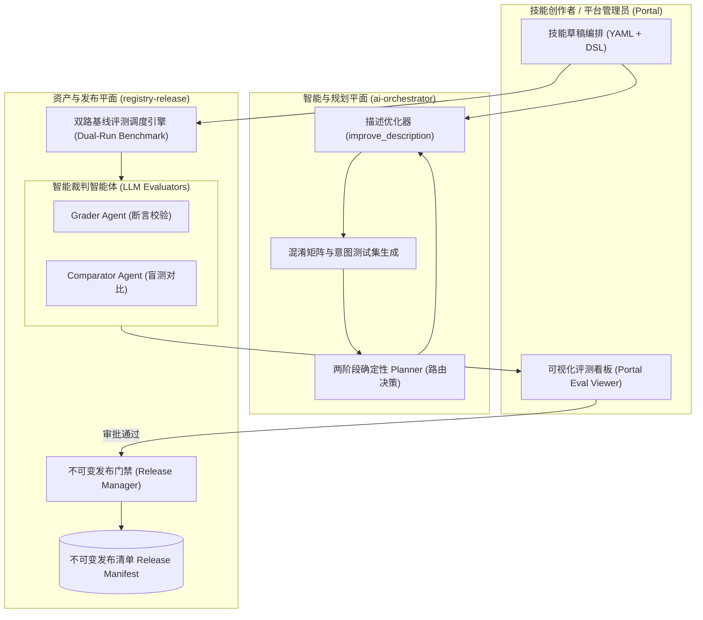

# 第二阶段：技能全生命周期工程、意图优化与双路评测体系设计方案

> 文档版本：v1.0  
> 所属阶段：Phase 2 (资产注册、发布门禁与意图规划引擎演进)  
> 借鉴来源：Anthropic `skill-creator`、`discernment-nudge`  
> 涉及模块：`apps/backend/registry-release` (`skill-registry`, `release-manager`)、`apps/backend/intelligence/ai-orchestrator`、`apps/frontend/portal`

---

## 1. 背景、痛点与演进目标

### 1.1 现有机制现状与瓶颈
目前平台的技能体系分为内置资产库（`builtin-skills/`）与发布态编排资产：
- **静态配置驱动**：技能的触发严重依赖 `manifest.yaml` 中的 `planner.triggerKeywords`（写死的一组关键词）与 `matchSummary`。
- **痛点 1：随着技能增多产生意图漂移与碰撞 (Intent Collision)**
  - 当技能从目前的十几个扩展到上百个时，语义相近的技能（如“文档比对”、“合同审查”、“差异提取”）关键词严重重叠，`ai-orchestrator` 的两阶段规划器第一阶段（DAG 拓扑选能力）极易出现误判（False Positive）或漏选（False Negative）。
- **痛点 2：缺乏真实的技能效能度量与回归评测**
  - 目前发布门禁（`release-manager`）仅支持针对单组固定输入（`fixtures/smoke-input.json`）的单次 Smoke 测试，无法评估：
    - 加载该技能后，Agent 的回答质量和完成率到底相比 Baseline（无技能原生推理）提升了多少？
    - 技能 Prompt 是否引入了意外的副作用（如回答冗长、Token 消耗剧增、格式漂移）？
- **痛点 3：缺乏直观的可视化调优与盲测工具**
  - 开发者修改技能说明后，全靠人工输入单条 Query 盲调，无法全量回归，更无法在前端清晰对比双路运行效果。

### 1.2 借鉴 Anthropic `skill-creator` 的核心突破
Anthropic 的 `skill-creator` 建立了一整套完整的 Agent 技能工程学方法论：
1. **意图触发词/描述自动优化循环 (`improve_description.py`)**：通过生成边缘 Query 集构建混淆矩阵，自动优化 Skill Description，实现高达 95%+ 的触发精准率。
2. **双路并行基线评测 (Dual-Run Benchmark)**：同一 Prompt 并发运行“无技能 Baseline”与“加技能 With-Skill”，自动记录延迟、Token 消耗与定量断言通过率。
3. **LLM 自动化裁判矩阵**：引入专门的 Grader（打分员）、Analyzer（根因分析员）、Comparator（盲测仲裁员）智能体角色。
4. **轻量化独立评测看板 (`viewer.html`)**：零额外依赖的纯前端看板，支持折叠查看各 Case 的 Trace、工具调用链路与打分详情。

---

## 2. 总体架构与数据流设计



---

## 3. 核心功能模块详细设计

### 3.1 技能意图触发优化器 (Trigger Description Optimizer)

#### 1. 算法流程
位于 `apps/backend/registry-release/release-manager/src/eval/optimizer.ts`：
1. **生成意图评估数据集 (Generate Trigger Eval Queries)**：
   - 根据技能的定位，调用大模型生成 3 类典型测试 Query：
     - **True Positives (应当触发)**：高频用户表述、口语化表达、带错别字的真实 Query（如 “帮我审下这个补充协议看看违约金合理不”）。
     - **True Negatives (绝不应触发)**：看似相关但属于其他领域的任务（如 “写一份新的劳动合同模板” 或 “把合同转成图片”）。
     - **Hard Negatives (易混淆边缘案例)**：包含相近词汇但意图不同的 Query。
2. **两阶段规划器意图探测**：
   - 将 Query 集合批量投递至 `ai-orchestrator` 的意图识别接口，收集各技能的召回状态。
3. **混淆矩阵计算**：
   - 统计 Precision（精确率）、Recall（召回率）与 F1 分数：
     $$\text{Precision} = \frac{TP}{TP + FP}, \quad \text{Recall} = \frac{TP}{TP + FN}$$
4. **Prompt & Keywords 反向自愈迭代**：
   - 若出现 FP（误触发），提取混淆 Query 的特征词，在 Skill 描述中补充“明确不适用的负向约束（Negative Boundaries）”；
   - 若出现 FN（漏触发），在 `triggerKeywords` 中扩充近义词簇与正则模式；
   - 重复迭代直至整体综合得分超过门禁阈值（默认 $\ge 0.92$）。

---

### 3.2 双路基线自动化评测引擎 (Dual-Run Benchmark Engine)

#### 1. 双路运行设计
评测执行器在隔离沙箱集群中发起两组并发 Run：
- **Run A (Baseline)**：仅提供系统全局通用 Prompt，不注入该技能手册与特定工具。
- **Run B (With-Skill)**：完整装载该技能的 `manifest.yaml`、专用工具契约与执行规范。

#### 2. 定量与定性三维打分模型
```text
综合评分 (Score: 0~100)
 ├── 1. 结构化定量断言 (Deterministic Assertions, 40%)
 │    ├─ 必需产物是否生成 (ArtifactRef 存在且 mimeType 合法)
 │    ├─ 输出 Schema 是否严格满足 contracts.output
 │    └─ 耗时与步骤数是否在 SLA 阈值内
 ├── 2. LLM 语义准确性裁判 (Semantic Grader, 40%)
 │    ├─ 业务规则覆盖率 (是否指出所有关键法务/数据风险项)
 │    └─ 幻觉率校验 (引用的条款或数据是否与输入文件一致)
 └── 3. 盲测净胜率 (Blind Preference Comparator, 20%)
      └─ 将 A/B 两路结果脱敏打乱送入裁判，评判哪份成果更专业、更易用
```

---

### 3.3 可视化评测审查看板 (Portal Eval Viewer)

在平台管理控制台 `apps/frontend/portal` 中新增 **“技能工坊 / 质量评测”** 模块：
- **并排比对视图 (Side-by-Side Comparison)**：左侧展示 Baseline 的执行轨迹与输出，右侧展示 With-Skill 的真实产物与工具调用链。
- **指标雷达图**：展示耗时变动、Token 开销对比、断言通过率。
- **失败用例一键调试**：直接筛选出所有 Grader 打分为 Fail 的 Query，展示大模型的扣分理由（Failure Reason）与改善建议。

---

### 3.4 人机协同与决断提示 (Discernment Nudge)

借鉴 Anthropic 的 `discernment-nudge` 技能，在智能规划中确立企业级人机协作红线：
- **高风险动作自动挂起 (Human-in-the-Loop)**：
  - 当任务涉及**资金支付、正式邮件全员发送、系统权限变更、不可逆数据删除**时，Planner 强制在 DAG 中插入审批断点（`waiting_approval`），生成清晰的影响面摘要与差异对比单，等待用户确认后才推进 Control Plane 执行。

---

## 4. 落地实施路线与改动边界

| 步骤 | 实施范围 | 核心交付物 |
| :--- | :--- | :--- |
| **Step 1** | `packages/backend-contracts` | 补充 `SkillEvalSuite`、`EvalResult`、`ConfusionMatrix` 契约定义。 |
| **Step 2** | `apps/backend/registry-release` | 引入 `eval/` 子模块，实现意图测试集生成与双路执行器。 |
| **Step 3** | `apps/backend/intelligence` | 为 `ai-orchestrator` 增加 `/ai/eval-match` 模拟意图匹配诊断接口。 |
| **Step 4** | `apps/frontend/portal` | 嵌入 HTML/React 评测看板，连接发布审批流。 |

---

## 5. 验收标准

1. **意图路由准确率**：引入优化器后，平台内置的 15+ 核心技能在 200 条合成测试 Query 下的意图混淆率降至 5% 以下。
2. **发布门禁拦截有效性**：当技能改动导致历史核心 Case 出现退化（Regression）时，Release Manager 必须能够阻断发布并生成详细的差异诊断报告。
