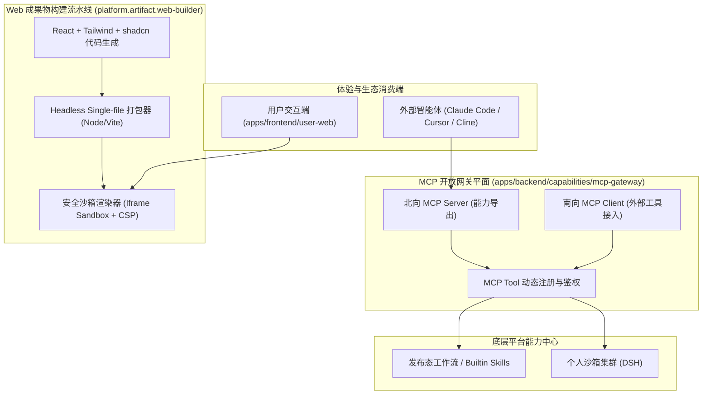

# 第三阶段：交互式 Web 成果物生成与 MCP 开放生态网关设计方案

> 文档版本：v1.0  
> 所属阶段：Phase 3 (体验端交互跃迁与开放生态集成)  
> 借鉴来源：Anthropic `web-artifacts-builder`、`theme-factory`、`frontend-design`、`mcp-builder`  
> 涉及模块：`apps/frontend/user-web`、`apps/backend/capabilities`、`packages/backend-contracts`

---

## 1. 背景、痛点与演进目标

### 1.1 现有机制现状与瓶颈
- **痛点 1：成果物形态过于初级（纯静态 Markdown）**
  - 当前平台的 `platform.document.markdown-artifact-writer` 仅能将分析结论写入静态 Markdown 文件。
  - 在实际企业场景中，用户迫切需要**交互式可视化报表、可筛选排序的数据表格、动态试算器（如还款测算/ROI敏感度分析）、审批交互表单**。静态文本无法承载多维探索。
- **痛点 2：平台能力与外部 Agent 生态割裂**
  - 目前平台的能力资产主要对内服务于自身 Web 端与微信通道。
  - 企业工程师使用外部主流智能开发工具（如 Claude Code、Cursor、Cline、VSCode）时，无法直接调度 Ops Automation 经过严格发布的生产级工作流与沙箱能力。

### 1.2 借鉴 Anthropic 的突破性实践
1. **单文件交互式 Web Artifacts (`web-artifacts-builder`)**：
   - 采用 React 18 + Tailwind CSS + shadcn/ui 现代前端栈，由构建器（Parcel/Vite-singlefile）在秒级内将多文件源码打包压缩成单一的独立 `.html` 文件。
   - 具备完整的前端响应式状态管理、图表渲染与交互能力，且可安全嵌入任何沙盒 `iframe`。
2. **专业审美与主题工厂 (`theme-factory` & `frontend-design`)**：
   - 摆脱低质“AI Slop”（滥用紫色渐变、过度居中、生硬卡片），注入 10 套专业工业级调色板、字阶排版与数据可视化设计规范。
3. **标准 MCP 协议生态 (`mcp-builder`)**：
   - 全面支持 Model Context Protocol，遵循工具高内聚、低耦合、自描述明确的工业级规范。

---

## 2. 总体架构设计



---

## 3. 核心功能一：单文件交互式 Web Artifacts 体系

### 3.1 成果物构建流水线
新增平台内置技能：`platform.artifact.interactive-web-writer`：
1. **代码生成层**：
   - 大模型在沙箱或代码生成平面中编写多组件 React 源码（含状态逻辑 `useState`、Lucide 图表、UI 组件）。
   - 遵循 `frontend-design` 规范：采用高对比度无衬线排版、严谨的数据密度设计、专业图表配色。
2. **极速单文件打包 (Single-File Bundling)**：
   - 调用预置打包引擎：
     ```bash
     node /opt/artifacts-builder/bundle.js --entry ./src/App.tsx --output ./dist/artifact.html
     ```
   - 打包器自动内联（Inline）所有 JavaScript（打包为自执行 IIFE）、CSS（Tailwind 摇树裁剪）与 SVG 图标，输出大小通常在 100KB~400KB 的单个 HTML 文件。
3. **受控存储与 Artifact 引用**：
   - 生成的 HTML 文件存入受控对象存储，并返回标准 `ArtifactRef`：
     ```json
     {
       "type": "web_artifact",
       "id": "art_20260919_001",
       "name": "Q3财务敏感度交互测算板.html",
       "mimeType": "text/html",
       "metadata": {
         "hasInteraction": true,
         "sandboxPermissions": ["allow-scripts"]
       }
     }
     ```

### 3.2 安全沙箱渲染机制 (Zero-Trust Iframe Sandbox)
在 `apps/frontend/user-web` 的聊天对话流与工作台中：
- 使用极简受限 `<iframe>` 渲染成果物：
  ```html
  <iframe
    src="/api/artifacts/art_20260919_001/render"
    sandbox="allow-scripts allow-forms"
    referrerpolicy="no-referrer"
    csp="default-src 'none'; script-src 'unsafe-inline'; style-src 'unsafe-inline' data:; img-src data: blob:;"
  />
  ```
- **安全红线**：禁止 `allow-same-origin`，彻底杜绝生成的 Web 代码读取宿主页面的 LocalStorage、Cookie、Token 或操控父级 DOM。

---

## 4. 核心功能二：Model Context Protocol (MCP) 开放网关

### 4.1 北向：平台能力作为 MCP Tool 导出
在 `apps/backend/capabilities` 下新增 `mcp-gateway` 服务：
1. **基于 `@modelcontextprotocol/sdk` 实现**：
   - 提供标准 SSE (Server-Sent Events) 与 Stdio 双传输通道。
2. **能力投影映射 (Projection Mapper)**：
   - 将平台已发布的优质 Built-in Skill 与 Temporal 工作流自动投影为 MCP Tool：
     - `ops_review_contract`：调用法务合同审查流；
     - `ops_run_dsh_sandbox`：在个人沙箱中执行复杂分析代码；
     - `ops_render_office_document`：调用 Carbone / Office 引擎生成专业报表。
3. **企业级鉴权与审计**：
   - 外部 Agent 连接时携带专属 API Key，所有 MCP Tool 调用记录完整接入平台控制面的审计发件箱（Outbox）与审计日志。

### 4.2 南向：外部标准 MCP 工具动态挂载
- 支持用户在控制台注册外部第三方 MCP Server（如 GitHub MCP、Postgres MCP、Jira MCP）。
- `skill-registry` 将外部 MCP 工具解析为平台内的虚拟 Skill 节点，无缝纳入 `ai-orchestrator` 的两阶段规划拓扑中。

---

## 5. 验收标准与交付物清单

1. **交互体验**：在用户端能够即时渲染并操作带图表联动、动态筛选的高保真 Web 成果物，首屏渲染耗时 $< 800\text{ms}$。
2. **沙箱安全性**：Web 成果物在受限 `iframe` 中运行，穿透测试确认无法获取任何宿主环境凭据。
3. **MCP 互操作性**：使用 Claude Code 或 Cursor 配置本平台的 MCP Server 端点后，外部工具能够秒级发现工具列表并成功执行一次端到端工作流。
