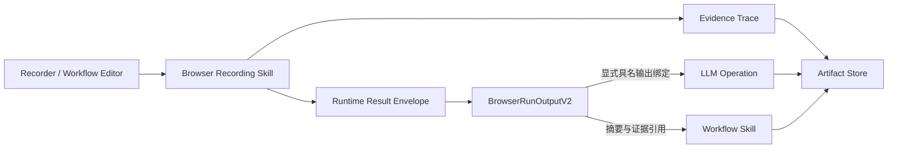
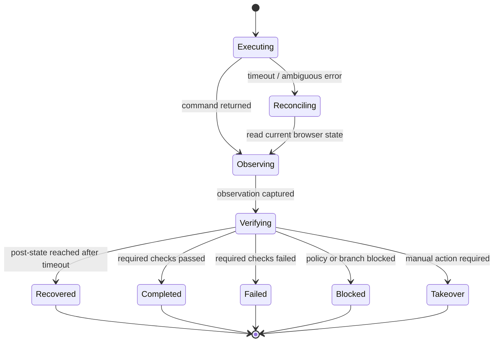
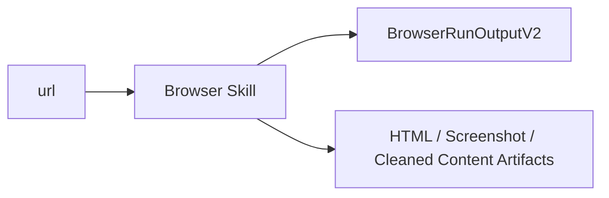
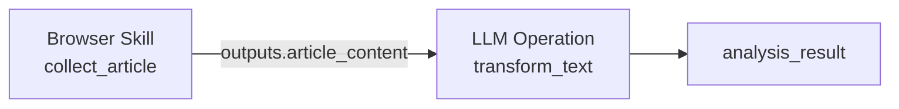
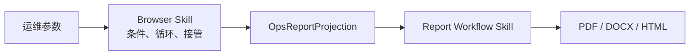

# 浏览器执行结果契约、证据链与工作流组合设计

状态：Design Proposal  
日期：2026-08-26  
适用范围：浏览器录制、Browser Recording Skill、确定性多步骤计划、LLM Operation、Temporal Workflow Skill、运维报告生成

关联文档：

- [浏览器录制模块功能概要](browser-recorder-module-overview.md)
- [浏览器模板生成与发布桥接功能概要](browser-template-generation-and-release-bridge-overview.md)
- [统一多步骤能力契约、AI 代码生成与验证门禁设计](unified-capability-contract-and-validation-design.md)
- [确定性规划输出契约解析标准](deterministic-output-contract-resolution-standard.md)
- [三类能力体系与 LLM Operation 可控治理设计](three-capability-types-and-llm-operation-governance-design.md)
- [P0：契约稳定化落地与检验设计](browser-execution-p0-implementation-and-validation-design.md)
- [P1：正文提取与显式工作流组合落地及检验设计](browser-execution-p1-implementation-and-validation-design.md)
- [P2：追踪、证据治理与评测平台落地及检验设计](browser-execution-p2-implementation-and-validation-design.md)

## 1. 结论

本设计不新增一套浏览器自动化引擎，也不把 LLM 或报告生成逻辑合并进浏览器能力。目标是为现有浏览器执行能力建立稳定、可版本化、可验证、可被下游工作流消费的公共结果契约。

最终边界如下：

```text
Browser Recording Skill
负责：顺序动作、条件、循环、恢复、接管、页面采集、确定性正文清理

Runtime Contract
负责：统一状态、错误、重试、接管、指标和 Artifact 引用

Evidence Plane
负责：完整动作轨迹、截图、原始 HTML、DOM Snapshot、必要的网络与控制台证据

Business Output
负责：模板设计时明确声明并命名的下游可消费数据

Deterministic Plan
负责：显式连接 Browser Skill、LLM Operation 和 Workflow Skill
```

核心决策：

1. 浏览器执行结果采用“小而稳定的主输出 + 外置完整证据 + 具名业务输出”三层结构。
2. 原始 HTML、截图、完整轨迹不直接内联到主结果，统一通过 Artifact 引用。
3. 页面正文清理属于浏览器采集能力，不依赖 LLM。
4. LLM Operation 必须在模板或工作流编辑时显式添加，并显式绑定上游输出；Recorder 不承载后处理配置。
5. 运维报告使用已发布的 Workflow Skill，不新增专用子工作流节点类型。
6. 动作执行、页面观察、后置验证、业务目标验证相互分离。
7. 导航超时后必须进行真实页面状态对账，允许产生 `recovered` 结果。
8. 条件、循环和人工接管继续复用现有 Browser Recording IR 与运行时。
9. 所有 Browser Template（单步或确定性多步）必须通过 Session Broker 申请并校验标准 `RuntimeSession`，禁止发布运行时自行创建临时 worker 会话。

## 2. 背景与问题定义

### 2.1 目标使用场景

本设计重点覆盖两类场景。

场景一：网页内容采集与可选 LLM 处理。

```text
打开指定 URL
-> 获取页面结果
-> 保存截图和原始 HTML
-> 确定性清理正文
-> 可选：显式调用 LLM 进行总结、分析或解读
```

场景二：运维网页流程与后续报告工作流。

```text
按照录制流程执行网页操作
-> 使用现有条件、循环、风险控制和人工接管
-> 形成结构化执行摘要与证据索引
-> 显式调用已发布的运维报告 Workflow Skill
-> 生成 PDF、DOCX 或 HTML 报告 Artifact
```

### 2.2 当前故障暴露的问题

Recorder Debug 会话曾出现以下现象：

```text
页面最终已经正常打开
但该轮结果显示：
已失败 / 验证失败 / 置信度 0% / Verifier: navigate
```

根因不是页面最终没有打开，而是：

1. `page.goto()` 在等待窗口内超时。
2. 执行控制器立即将该轮标记为失败。
3. 失败分支复用了旧的 `about:blank` observation。
4. `navigate` 验证器得到 `tool_command_succeeded=false` 和 `url_changed=false`。
5. 页面在超时之后继续完成加载，但该轮结果没有重新观察和对账。

这说明当前 `success` 混合了不同层次的语义：

- 命令是否在超时前返回；
- 浏览器是否最终到达目标状态；
- 页面是否产生了可用内容；
- 用户的业务目标是否完成。

本设计要求这些语义分别记录和验证。

### 2.3 当前输出声明与运行结果不一致

Recorder 导出当前可以推导以下输出：

- `pageState`
- `executionResult`
- `snapshotArtifact`
- `pageText`

但 Browser Recording Runtime 的实际主要结果是：

```ts
{
  runtimeSessionId,
  backend,
  stepResults,
  variables,
  executionPlanVersion,
  degradedMode,
  degradeReason,
  trace,
  runtimeEvidence
}
```

文本读取结果通常保存到 `variables[outputVar]`，而不是稳定的顶层 `pageText`。这会导致：

- Catalog 声明的输出和运行时实际输出不一致；
- 确定性计划只能依赖启发式字段查找；
- 下游 LLM 或 Workflow 无法稳定绑定浏览器结果；
- 输出 Schema 可能在运行时验证阶段失败。

### 2.4 多页面证据缺少稳定关联

当前系统已经可以顺序访问多个页面，但结果主要围绕：

- 当前 URL；
- 扁平 `stepResults`；
- 分散的 snapshot、截图和 HTML；
- 运行时变量。

缺少稳定的：

```text
stepId
  -> pageId
      -> screenshotRef
      -> rawHtmlRef
      -> snapshotRef
      -> cleanedContentRef
```

在条件和循环场景中，还需要进一步关联：

```text
loopId + iteration + stepId + pageId
```

否则运维报告无法可靠回答“第几轮、哪一步、哪个页面产生了这张截图或这个判断”。

## 3. 现有能力评估

### 3.1 可以直接复用的能力

浏览器录制与发布运行时已经具备：

- 固定执行计划；
- 顺序动作；
- `read_value` 和 `outputVar`；
- 条件分支；
- 循环终止条件；
- 最大循环次数；
- 无进展检测；
- 风险动作策略；
- 人工接管和会话冻结；
- 执行日志与 runtime evidence。

确定性计划已经具备：

- `skill` 节点；
- `llm_operation` 节点；
- `runtimeType: browser_template`；
- `runtimeType: workflow`；
- 节点输出绑定；
- 输出 Schema 校验；
- `contractRef` 与 `contractDigest`；
- 最终输出解析。

发布运行时已经支持：

- `browser_recording`；
- `temporal_workflow`；
- 已发布 Skill 调用；
- Workflow 执行状态、日志和 Artifact 结果。

因此，本设计不重写条件、循环、风险控制、确定性调度器或 Temporal 执行层。

### 3.2 需要补齐的能力

| 能力 | 当前状态 | 主要缺口 |
|---|---|---|
| 浏览器运行时 | 已具备 | 缺少版本化公共业务输出契约 |
| 页面采集 | 部分具备 | 页面、步骤和 Artifact 关联不稳定 |
| 正文读取 | 基础文本读取 | 缺少面向文章的正文清理与元数据提取 |
| 运维页面采集 | 已有截图/HTML 能力 | 缺少 audit/application 采集策略 |
| 下游绑定 | 确定性计划已支持 | 浏览器真实输出路径与声明不一致 |
| 大文本传递 | Artifact 基础存在 | 缺少 ContentRef 加载和限制策略 |
| 验证 | 已有 verifier | 动作结果和最终页面状态未完全分离 |
| 可观测性 | 自定义 runtimeEvidence | 缺少统一 trace/span/page/step 关联 |
| Template 组合 | 能承接 Recorder 导出的 Browser Skill | 缺少独立的 LLM/Workflow 后续节点声明与发布门禁 |

## 4. 外部研究与开源实践

### 4.1 WebArena：以功能正确性验证长流程任务

WebArena 构建了真实、可复现的网页任务环境，并以端到端功能正确性评价 Agent，而不是只检查某个浏览器命令是否执行。论文显示真实长流程网页任务仍然非常困难，说明动作返回成功不能替代目标状态验证。

对本设计的影响：

- 将动作执行与业务目标验证分离；
- 验证器必须读取动作后的真实页面状态；
- 支持页面状态、后台状态或明确业务谓词验证；
- 验收指标以任务最终正确率为主，而不是命令成功率。

参考：[WebArena: A Realistic Web Environment for Building Autonomous Agents](https://arxiv.org/abs/2307.13854)

### 4.2 BrowserGym：统一 Action、Observation 与 Validation

BrowserGym 为多个网页任务基准提供统一接口，将观察空间、动作空间和任务验证作为不同职责。它允许通过受控高层动作映射限制任意代码执行，也支持动作后基于页面状态执行任务验证。

对本设计的影响：

```text
Action
-> Observation
-> Validation
-> Evidence
```

四者必须有独立数据模型。当前受限 BrowserCommand、固定 Recording IR 和风险策略可以保留，并继续作为安全动作空间。

参考：[The BrowserGym Ecosystem for Web Agent Research](https://arxiv.org/abs/2412.05467)

### 4.3 Playwright Trace：证据轨迹与断言分离

Playwright Trace 可以记录每个动作的 DOM snapshot、截图和网络活动；测试断言属于更高层验证逻辑。该模式说明完整执行证据适合独立保存为 Trace Artifact，而不是作为业务输出 Schema 的主体。

对本设计的影响：

- 完整动作轨迹独立存储；
- 主输出只保留索引和 Artifact 引用；
- 页面采集围绕动作前后状态组织；
- verifier 结果不能只由 tracing 成功与否推导。

参考：[Playwright Tracing](https://playwright.dev/docs/api/class-tracing)

### 4.4 Mozilla Readability 与 Trafilatura：正文清理需要专用策略

Mozilla Readability 可以从 DOM 中提取处理后的 HTML、纯文本、标题、作者、站点、语言和发布时间。Trafilatura 提供正文、评论和元数据提取，并给出了公开评估。

对本设计的影响：

- 文章页面采用 `article` Capture Profile；
- 优先使用 Readability；
- 失败时使用内容密度算法或异步 Trafilatura 回退；
- 原始 HTML 永远保留，清理结果是派生产物；
- 清理后的 HTML 在渲染前仍需 sanitizer。

参考：

- [Mozilla Readability](https://github.com/mozilla/readability/blob/main/README.md)
- [Trafilatura: A Web Scraping Library and Command-Line Tool for Text Discovery and Extraction](https://aclanthology.org/2021.acl-demo.15/)

### 4.5 Temporal 与 OpenTelemetry：耐久编排和因果证据链

Temporal 用于保证长时间工作流在进程或网络故障后继续执行，适合承载独立的运维报告 Workflow Skill。OpenTelemetry 使用 Span、Event 和 Link 描述操作、瞬时状态变化和异步因果关系，适合作为浏览器运行与报告运行之间的追踪参考。

对本设计的影响：

- 报告生成保持为独立 Workflow Skill；
- 浏览器执行完成后通过确定性计划显式调用；
- Browser Run、Browser Step、Report Workflow 使用统一 trace context；
- 页面变为可交互、超时恢复等记录为带时间戳事件；
- 报告执行通过 Span Link 或等价字段关联浏览器执行。

参考：

- [Temporal 官方文档](https://docs.temporal.io/)
- [OpenTelemetry Traces](https://opentelemetry.io/docs/concepts/signals/traces/)

## 5. 设计目标与非目标

### 5.1 设计目标

- 为浏览器执行提供版本化、可验证的公共输出契约。
- 支持单页面和多页面顺序执行。
- 支持条件、循环、人工接管和恢复结果。
- 保留截图、HTML、snapshot 和完整执行轨迹。
- 为文章页面生成清理后的正文和元数据。
- 为运维页面提供应用态和审计态采集。
- 允许下游节点稳定绑定具名业务输出。
- 只有模板编辑时明确配置，才生成 LLM 或 Workflow 后续节点。
- 支持浏览器到运维报告工作流的证据引用。
- 兼容现有 RuntimeStepInvokeResult 和确定性计划。
- 支持旧结果双写和渐进迁移。

### 5.2 非目标

- 不重写 Browser Recording IR。
- 不移除现有条件和循环实现。
- 不把 LLM 推理嵌入 browser worker。
- 不让浏览器 Skill 内部隐式调用报告工作流。
- 不对所有网页统一使用文章正文算法。
- 不在主结果 JSON 中内联所有截图和原始 HTML。
- 不允许 Planner 动态发明浏览器输出字段。
- 不在第一阶段实现通用大规模爬虫或 Request Queue。
- 不用一次迁移删除所有 legacy 字段兼容逻辑。

## 6. 总体架构

### 6.1 三层结果模型



浏览器执行结果分为三层：

1. Runtime Envelope：跨能力共通的生命周期、错误、重试、接管、指标和 Artifact 引用。
2. BrowserRunOutputV2：浏览器专用但体积受控的业务结果、页面索引和验证摘要。
3. Evidence Trace：完整步骤轨迹、DOM、截图、HTML、网络和控制台证据，以 Artifact 形式保存。

### 6.2 权威边界

| 数据 | 权威来源 | 是否进入主输出 |
|---|---|---|
| 生命周期状态 | Runtime Envelope | 是 |
| 浏览器结果结构 | BrowserRunOutputV2 | 是 |
| 具名业务输出 | `BrowserRunOutputV2.outputs` | 是 |
| 页面元数据和产物索引 | `BrowserRunOutputV2.pages` | 是 |
| 完整动作轨迹 | Trace Artifact | 仅引用 |
| 原始 HTML | HTML Artifact | 仅引用 |
| 截图 | Image Artifact | 仅引用 |
| 清理后的正文 | ContentRef | 小内容可内联，完整内容可引用 |
| LLM 分析结果 | LLM Operation 输出 | 不属于浏览器输出 |
| 报告文件 | Workflow Skill 输出 | 不属于浏览器输出 |

## 7. 公共运行时信封

继续使用现有 `RuntimeStepInvokeResult` 作为跨能力信封：

```ts
interface RuntimeStepInvokeResult {
  success: boolean;
  status:
    | 'completed'
    | 'failed'
    | 'blocked'
    | 'waiting'
    | 'takeover_required';

  output?: Record<string, unknown>;

  errorCode?: string;
  errorMessage?: string;
  retryable?: boolean;

  requiresTakeover?: boolean;
  takeoverReason?: string;

  artifacts?: ArtifactRef[];
  snapshot?: SnapshotRef | null;
  metrics?: RuntimeMetrics;
  rawResult?: Record<string, unknown>;
}
```

Browser Recording Skill 的返回方式：

```ts
const result: RuntimeStepInvokeResult = {
  success: true,
  status: 'completed',
  output: browserRunOutputV2,
  artifacts: allPublishedArtifacts,
  metrics: {
    durationMs,
    attemptCount,
  },
};
```

约束：

- `RuntimeStepInvokeResult.status` 不新增浏览器专用状态。
- `completed_with_warnings` 放在浏览器输出内部的 `summary.outcome`。
- `recovered` 是步骤级状态，不是公共运行时终态。
- 公共信封负责调度；浏览器输出负责表达业务细节。

## 8. BrowserRunOutputV2

### 8.1 顶层定义

```ts
interface BrowserRunOutputV2 {
  schemaVersion: 'browser-run-output/v2';

  run: BrowserRunIdentity;
  summary: BrowserRunSummary;

  steps: BrowserStepSummary[];
  pages: BrowserPageCapture[];

  outputs: Record<string, BrowserOutputValue>;

  verification: BrowserRunVerification;
  evidence: BrowserEvidenceIndex;
}
```

### 8.2 运行标识

```ts
interface BrowserRunIdentity {
  executionId: string;
  runtimeSessionId: string;
  capabilityId?: string;
  capabilityVersion?: string;

  executionPlanVersion: string;
  startedAt: string;
  completedAt: string;

  traceId?: string;
  rootSpanId?: string;
}
```

`executionId` 表示平台执行单；`runtimeSessionId` 表示浏览器会话。两者不得互相替代。

Browser Template 的会话生命周期以整条执行计划为边界：

- 单步与多步使用同一套 Session Broker 分配协议；
- 同一计划内的多个浏览器节点复用该执行单的活动浏览器会话；
- Browser Skill 完成后若仍有显式 LLM/Workflow 后续节点，不得提前关闭会话；
- 最终节点和最终输出持久化完成后再关闭活动会话；
- `takeover_required` 产生的 frozen 会话必须保留，直到人工恢复或显式关闭。

### 8.3 运行摘要

```ts
interface BrowserRunSummary {
  outcome:
    | 'completed'
    | 'completed_with_warnings'
    | 'failed'
    | 'blocked'
    | 'takeover_required';

  completedSteps: number;
  recoveredSteps: number;
  failedSteps: number;
  skippedSteps: number;

  visitedPageCount: number;
  finalPageId?: string;

  warningCount: number;
}
```

整体状态聚合规则：

- 所有必需步骤成功：`completed`。
- 必需步骤成功，但存在恢复、降级或非致命警告：`completed_with_warnings`。
- 必需步骤最终失败：`failed`。
- 条件、循环或策略主动阻断：`blocked`。
- 需要人工继续完成：`takeover_required`。

### 8.4 步骤摘要

```ts
type BrowserStepStatus =
  | 'completed'
  | 'recovered'
  | 'failed'
  | 'blocked'
  | 'takeover_required'
  | 'skipped';

interface BrowserStepSummary {
  stepId: string;
  sequence: number;
  name: string;
  action: string;
  status: BrowserStepStatus;

  startedAt: string;
  completedAt: string;
  durationMs?: number;

  attemptCount: number;

  beforePageId?: string;
  afterPageId?: string;

  loopContext?: {
    loopId: string;
    iteration: number;
    phase?: 'before' | 'iteration' | 'after';
  };

  conditionResult?: {
    expression: string;
    outcome: 'matched' | 'mismatched' | 'error';
    selectedBranch?: string;
  };

  outputNames?: string[];
  verification?: BrowserStepVerification;
  warningCodes?: string[];

  error?: {
    code: string;
    message: string;
    retryable: boolean;
  };
}
```

完整命令输入、底层输出和调试细节不重复塞入 `BrowserStepSummary`，统一进入 Trace Artifact。

### 8.5 页面采集

```ts
interface BrowserPageCapture {
  pageId: string;
  alias?: string;

  producedByStepId: string;
  captureReason:
    | 'navigation'
    | 'checkpoint'
    | 'failure'
    | 'takeover'
    | 'final';

  loopContext?: {
    loopId: string;
    iteration: number;
  };

  url: string;
  title?: string;
  capturedAt: string;

  readiness: {
    state:
      | 'loading'
      | 'dom_content_loaded'
      | 'interactive'
      | 'network_idle'
      | 'unknown';
    reconciledAfterTimeout: boolean;
  };

  content?: BrowserPageContent;

  screenshotRef?: ArtifactRef;
  rawHtmlRef?: ArtifactRef;
  snapshotRef?: ArtifactRef;
}
```

页面使用稳定 `pageId`，而不是仅使用 URL。原因包括：

- 同一个 URL 可能在表单提交后呈现不同状态；
- SPA 可能不改变 URL；
- 循环可能反复访问同一页面；
- 同一页面可能在不同时间产生不同截图和 HTML。

### 8.6 页面内容

```ts
interface BrowserPageContent {
  profile: 'article' | 'application' | 'audit' | 'raw';

  cleaned?: ContentRef;

  extraction?: {
    strategy:
      | 'readability'
      | 'article_selector'
      | 'main_selector'
      | 'role_main'
      | 'content_density'
      | 'explicit_selector'
      | 'body_fallback';

    selector?: string;
    confidence?: number;
    language?: string;
    byline?: string;
    siteName?: string;
    publishedTime?: string;

    originalCharCount?: number;
    extractedCharCount?: number;
    truncated: boolean;
  };
}
```

### 8.7 ContentRef

```ts
interface ContentRef {
  kind: 'text' | 'markdown' | 'html' | 'json';
  mimeType: string;

  inlineValue?: string;
  artifactRef?: ArtifactRef;

  charCount: number;
  byteCount?: number;
  sha256?: string;
  truncated: boolean;

  trust: 'untrusted_web_content';
}
```

规则：

- 小内容允许 `inlineValue + artifactRef` 同时存在。
- 大内容只保留预览和 `artifactRef`。
- `sha256` 用于完整性校验和去重。
- 网页正文始终标记为 `untrusted_web_content`。
- LLM Runtime 读取时必须把内容作为数据，不得把页面文本解释为系统指令。

### 8.8 具名业务输出

```ts
interface BrowserOutputValue {
  type: 'string' | 'number' | 'boolean' | 'json' | 'text' | 'artifact';

  value?: unknown;
  contentRef?: ContentRef;
  artifactRef?: ArtifactRef;

  source: {
    stepId: string;
    pageId?: string;
    selector?: string;
    extractor?: string;
  };

  schemaRef?: string;
}
```

`outputs` 只包含模板或工作流设计时明确声明的字段。例如：

```json
{
  "article_title": {
    "type": "string",
    "value": "Example title",
    "source": {
      "stepId": "extract-title",
      "pageId": "article-page",
      "selector": "h1"
    }
  },
  "article_content": {
    "type": "text",
    "contentRef": {
      "kind": "markdown",
      "mimeType": "text/markdown",
      "artifactRef": {
        "type": "cleaned_page_content",
        "id": "artifact-content-1"
      },
      "charCount": 18234,
      "truncated": false,
      "trust": "untrusted_web_content"
    },
    "source": {
      "stepId": "capture-article",
      "pageId": "article-page",
      "extractor": "readability"
    }
  }
}
```

### 8.9 验证结果

```ts
interface BrowserStepVerification {
  verifier: string;
  success: boolean;
  confidence: number;

  checks: Array<{
    code: string;
    success: boolean;
    required: boolean;
    expected?: unknown;
    actual?: unknown;
    evidenceRefs?: ArtifactRef[];
  }>;
}

interface BrowserRunVerification {
  success: boolean;
  confidence: number;
  requiredChecksPassed: boolean;
  checks: BrowserStepVerification['checks'];
  warnings: BrowserWarning[];
}

interface BrowserWarning {
  code: string;
  message: string;
  stepId?: string;
  pageId?: string;
  retryable?: boolean;
}
```

推荐警告码：

```text
NAVIGATION_TIMEOUT_RECOVERED
PAGE_READINESS_UNKNOWN
CONTENT_EXTRACTION_FALLBACK
CONTENT_EXTRACTION_LOW_CONFIDENCE
CONTENT_TRUNCATED
SCREENSHOT_CAPTURE_FAILED
HTML_CAPTURE_FAILED
TRACE_CAPTURE_DEGRADED
```

### 8.10 证据索引

```ts
interface BrowserEvidenceIndex {
  traceRef: ArtifactRef;

  screenshotRefs: ArtifactRef[];
  htmlRefs: ArtifactRef[];
  snapshotRefs: ArtifactRef[];
  contentRefs: ArtifactRef[];

  retentionPolicy?: string;
  sensitivity?: 'public' | 'internal' | 'confidential' | 'restricted';
}
```

主输出中的 Artifact 引用允许重复指向 `evidence` 中的对象，但 Artifact 本体只存储一次。

## 9. Capture Policy

### 9.1 配置模型

```ts
interface BrowserCapturePolicy {
  profile: 'article' | 'application' | 'audit' | 'raw';

  captureOn: Array<
    'navigation' | 'checkpoint' | 'failure' | 'takeover' | 'final'
  >;

  screenshot: boolean;
  rawHtml: boolean;
  domSnapshot: boolean;
  cleanedContent: boolean;

  networkSummary?: boolean;
  consoleSummary?: boolean;

  maxInlineTextChars?: number;
  maxArtifactBytes?: number;

  redact?: {
    enabled: boolean;
    selectors?: string[];
    patterns?: string[];
  };
}
```

### 9.2 Profile 行为

| Profile | 默认采集 | 正文处理 | 适用范围 |
|---|---|---|---|
| `article` | 截图、HTML、正文、元数据 | Readability 优先，密度算法回退 | 新闻、博客、文档 |
| `application` | 截图、HTML、DOM snapshot | 显式 selector / accessibility 区域 | 后台、表格、表单 |
| `audit` | 截图、HTML、DOM snapshot、必要网络与控制台摘要 | 不自动丢弃应用结构 | 运维审计、故障报告 |
| `raw` | 原始截图、HTML、snapshot | 不清理 | 调试、离线分析 |

### 9.3 采集时机

默认不在每个 DOM 变化时生成完整 Artifact，以避免存储爆炸。推荐规则：

- 导航完成或状态对账后采集；
- 录制时明确添加 checkpoint 时采集；
- 必需步骤失败时采集；
- 进入人工接管前采集；
- 运行结束时采集最终页面；
- 循环内只对具名 checkpoint、异常或策略要求的迭代采集完整页面。

完整 Playwright Trace 可以持续记录轻量动作轨迹，并与页面 Artifact 分开管理。

## 10. 动作、观察与验证状态机



### 10.1 导航状态对账

当 `goto` 返回超时或不明确错误时：

1. 不立即使用旧 observation 生成最终结果。
2. 读取当前 URL、标题、DOM readiness 和主要页面内容。
3. 根据目标 URL 策略判断是否已经落地。
4. 检查页面是否包含浏览器错误页、空白页或业务错误提示。
5. 如果目标已到达，步骤标记为 `recovered`。
6. 写入 `NAVIGATION_TIMEOUT_RECOVERED`。
7. 捕获该页面的截图、HTML 和 snapshot。
8. 如果仍未到达，才标记为 `failed`。

### 10.2 验证层次

每个步骤最多包含三层验证：

| 层次 | 说明 | 示例 |
|---|---|---|
| Execution | 底层命令是否返回 | Playwright click 是否抛错 |
| Post-state | 浏览器是否达到动作后状态 | URL、标题、元素、页面指纹变化 |
| Business | 业务目标是否满足 | 服务器状态变为 healthy、工单已提交 |

整体 Browser Skill 的成功不能只由 Execution 层决定。

### 10.3 条件与循环

条件和循环继续由现有运行时执行，但必须补充结构化结果：

- 条件表达式；
- 条件输入值摘要；
- 匹配结果；
- 选择的分支；
- 被跳过步骤的 `skipped` 结果；
- 循环 ID；
- 当前迭代；
- 终止原因；
- 无进展证据；
- 达到最大迭代次数的证据。

## 11. 场景一：打开 URL、获取正文与可选 LLM 处理

### 11.1 仅执行网页采集

用户目标：

```text
打开指定 URL，获取页面内容，清理后保留正文。
```

Recorder 生成的 Browser Skill：

```text
goto(url)
-> wait/readiness
-> capture_page(profile=article, alias=article_page)
-> declare_output(article_content)
```

执行拓扑：



示例输出：

```json
{
  "schemaVersion": "browser-run-output/v2",
  "summary": {
    "outcome": "completed",
    "completedSteps": 3,
    "recoveredSteps": 0,
    "failedSteps": 0,
    "skippedSteps": 0,
    "visitedPageCount": 1,
    "finalPageId": "article-page",
    "warningCount": 0
  },
  "pages": [
    {
      "pageId": "article-page",
      "alias": "article_page",
      "producedByStepId": "capture-article",
      "captureReason": "checkpoint",
      "url": "https://example.com/article",
      "title": "Example article",
      "capturedAt": "2026-08-26T10:00:00.000Z",
      "readiness": {
        "state": "interactive",
        "reconciledAfterTimeout": false
      },
      "rawHtmlRef": {
        "type": "browser_page_html",
        "id": "html-1",
        "mimeType": "text/html"
      },
      "screenshotRef": {
        "type": "browser_page_screenshot",
        "id": "screenshot-1",
        "mimeType": "image/png"
      }
    }
  ],
  "outputs": {
    "article_content": {
      "type": "text",
      "contentRef": {
        "kind": "markdown",
        "mimeType": "text/markdown",
        "artifactRef": {
          "type": "cleaned_page_content",
          "id": "article-content-1"
        },
        "charCount": 18234,
        "truncated": false,
        "trust": "untrusted_web_content"
      },
      "source": {
        "stepId": "capture-article",
        "pageId": "article-page",
        "extractor": "readability"
      }
    }
  }
}
```

未明确添加 LLM 时：

- 不创建 LLM 节点；
- 不生成分析或摘要；
- 不推测用户可能需要的后续处理；
- Browser Skill 到此结束。

### 11.2 显式调用 LLM

用户在模板编辑时进一步声明：

```text
将 article_content 交给 LLM，分析核心观点、依据和潜在风险。
```

导出的确定性计划：



Browser Skill 和 LLM Operation 保持两个独立节点：

```ts
const browserNode: SkillPlanNodeV1 = {
  kind: 'skill',
  nodeId: 'collect_article',
  sequence: 1,
  title: '打开网页并采集正文',
  dependsOn: [],
  inputBindings: {
    url: {
      source: 'user_input',
      path: 'url',
    },
  },
  outputContract: {
    outputs: 'json',
    pages: 'json',
    evidence: 'json',
  },
  failurePolicy: 'abort',
  skillId: 'published-browser-article-collector',
  skillVersion: '2.0.0',
  runtimeType: 'browser_template',
};
```

```ts
const llmNode: LlmOperationPlanNodeV1 = {
  kind: 'llm_operation',
  nodeId: 'analyze_article',
  sequence: 2,
  title: '分析文章',
  dependsOn: ['collect_article'],
  inputBindings: {
    content: {
      source: 'node_output',
      nodeId: 'collect_article',
      path: 'outputs.article_content',
    },
    instruction: {
      source: 'literal',
      value: '分析核心观点、依据和潜在风险',
    },
  },
  outputContract: {
    markdown_content: 'markdown_content',
  },
  failurePolicy: 'abort',
  operationId: 'transform_text',
  operationVersion: '1',
  operationDigest: '<frozen-operation-digest>',
  contractDigest: '<frozen-contract-digest>',
};
```

### 11.3 ContentRef 输入解析

当前 LLM Operation 通常接收字符串。为支持大正文，下游绑定层需要提供受控解析：

```text
BrowserOutputValue
-> 如果存在内联完整文本，直接使用
-> 否则按 ArtifactRef 加载
-> 校验 mimeType、大小、hash、权限
-> 根据 LLM Operation 限制截断或分块
-> 标记内容为 untrusted_web_content
-> 传入 LLM Operation 的 content/text 字段
```

不建议让 Planner 自行选择 `inlineValue` 或 `artifactRef`。解析应由运行时 Binding Resolver 或专用 Content Resolver 完成。

## 12. 场景二：运维浏览器流程与报告工作流

### 12.1 执行拓扑



浏览器 Skill 继续负责：

- 登录后的页面操作；
- 条件检查；
- 循环处理；
- 读取状态；
- 风险判断；
- 人工接管；
- 截图、HTML 和审计证据；
- 具名业务结果。

报告 Workflow Skill 负责：

- 读取执行摘要和必要 Artifact；
- 组织报告数据；
- 必要时在 Workflow 内部调用其受控 LLM Activity；
- 渲染 PDF、DOCX 或 HTML；
- 返回报告 Artifact。

浏览器 Skill 不感知报告工作流内部是否使用 LLM。

### 12.2 运维报告投影

报告工作流不应直接消费完整 `BrowserRunOutputV2`。增加一个确定性投影：

```ts
interface OpsReportProjection {
  schemaVersion: 'ops-report-browser-input/v1';

  sourceExecution: {
    executionId: string;
    runtimeSessionId: string;
    capabilityId?: string;
    capabilityVersion?: string;
    traceId?: string;
  };

  operation: {
    name: string;
    outcome: BrowserRunSummary['outcome'];
    startedAt: string;
    completedAt: string;
  };

  statistics: {
    completedSteps: number;
    recoveredSteps: number;
    failedSteps: number;
    skippedSteps: number;
    visitedPageCount: number;
  };

  outputs: Record<string, BrowserOutputValue>;

  importantPages: Array<{
    pageId: string;
    alias?: string;
    url: string;
    title?: string;
    screenshotRef?: ArtifactRef;
    htmlRef?: ArtifactRef;
  }>;

  warnings: BrowserWarning[];
  evidenceTraceRef: ArtifactRef;
}
```

投影规则必须在设计时确定，不能由 LLM 临时猜测：

- 只包含报告需要的页面；
- 只包含声明过的业务输出；
- 原始 HTML 只传引用；
- 截图按报告选项选择；
- 敏感字段先执行脱敏；
- 报告工作流按权限加载 Artifact。

### 12.3 报告 Workflow Skill 输入输出

```ts
interface OpsReportWorkflowInput {
  browserExecution: OpsReportProjection;

  reportOptions: {
    templateId?: string;
    format: 'pdf' | 'docx' | 'html';
    language?: string;
    includeScreenshots?: boolean;
    includeRawHtmlReferences?: boolean;
  };
}
```

```ts
interface OpsReportWorkflowOutput {
  reportId: string;
  status: 'completed' | 'failed';

  reportArtifact: ArtifactRef;
  supportingArtifacts?: ArtifactRef[];

  summary?: string;
  temporalWorkflowId?: string;
}
```

确定性计划中继续使用现有 Skill 节点：

```ts
const reportNode: SkillPlanNodeV1 = {
  kind: 'skill',
  nodeId: 'generate_ops_report',
  sequence: 2,
  title: '生成运维报告',
  dependsOn: ['execute_ops_browser_flow'],
  inputBindings: {
    browserExecution: {
      source: 'node_output',
      nodeId: 'execute_ops_browser_flow',
      path: 'reportProjection',
    },
    reportOptions: {
      source: 'user_input',
      path: 'reportOptions',
    },
  },
  outputContract: {
    reportArtifact: 'artifact_ref',
  },
  failurePolicy: 'abort',
  skillId: 'published-ops-report-workflow',
  skillVersion: '1.0.0',
  runtimeType: 'workflow',
};
```

## 13. Recorder 与导出设计

### 13.1 Recorder 中的三类步骤

Recorder 需要明确区分：

浏览器动作：

- 导航；
- 点击；
- 填写；
- 等待；
- 条件；
- 循环；
- 下载；
- 人工接管。

浏览器采集与输出：

- 页面采集 checkpoint；
- 页面别名；
- Capture Profile；
- 提取元素文本；
- 提取文章正文；
- 提取表格或 JSON；
- 声明输出变量。

显式后续处理：

- 添加 LLM Operation；
- 选择上游具名输出；
- 配置 LLM 指令；
- 添加已发布 Workflow Skill；
- 配置 Workflow 输入绑定；
- 声明最终输出。

### 13.2 页面别名和输出命名

多页面录制不能让用户依赖数组下标。Recorder 应允许命名：

```text
page alias: article_page
output name: article_content

page alias: server_list
output name: unhealthy_server_count

page alias: server_detail
output name: server_status
```

发布前检查：

- 页面别名在能力版本内唯一；
- 输出名称在能力版本内唯一；
- 每个输出必须有确定来源；
- 输出类型必须与 Schema 一致；
- 下游绑定只能引用已声明输出。

### 13.3 导出模式

Recorder 提供两个明确出口：

```text
仅发布 Browser Skill
```

以及：

```text
发布复合确定性工作流
```

复合工作流仍引用独立发布并冻结版本的 Browser Skill、LLM Operation 和 Workflow Skill。Recorder 不把这些节点编译成一个不可分割的浏览器脚本。

### 13.4 禁止隐式后续调用

以下情况不生成 LLM 或 Workflow 节点：

- 用户只要求打开页面；
- 用户只要求保存截图或 HTML；
- 用户只要求提取正文；
- Recorder 推测正文“可能适合总结”；
- 系统发现存在某个报告工作流。

只有出现显式后续步骤，并完成输入绑定与契约验证后，才生成对应节点。

## 14. Artifact 与证据管理

### 14.1 Artifact 类型

建议统一以下类型：

```text
browser_trace
browser_page_screenshot
browser_page_html
browser_dom_snapshot
browser_network_summary
browser_console_summary
cleaned_page_content
browser_download
ops_report_pdf
ops_report_docx
ops_report_html
```

### 14.2 Artifact 元数据

```ts
interface BrowserArtifactMetadata {
  executionId: string;
  runtimeSessionId: string;
  stepId?: string;
  pageId?: string;

  loopId?: string;
  iteration?: number;

  url?: string;
  capturedAt: string;

  sha256?: string;
  sensitivity?: 'public' | 'internal' | 'confidential' | 'restricted';
  redacted?: boolean;
  retentionPolicy?: string;
}
```

### 14.3 存储策略

- 主输出只保存 Artifact 引用。
- Artifact 保存完整内容和 hash。
- 相同 HTML 或内容可以按 hash 去重。
- 截图和 HTML 支持独立保留周期。
- 失败和接管证据可以使用更长保留周期。
- 报告 Artifact 不默认继承原始 HTML 的公开权限。
- 删除执行记录时按照 retention policy 处理关联 Artifact。

## 15. 安全与数据治理

### 15.1 网页内容不可信

网页正文、DOM、HTML 和页面提示都属于不可信外部数据。传入 LLM 时必须：

- 使用数据边界包装；
- 明确标记 `untrusted_web_content`；
- 禁止页面文本覆盖系统和工作流指令；
- 禁止页面内容动态改变工具权限；
- 对 prompt injection 关键模式记录安全事件；
- 保留来源 pageId、URL 和 hash。

### 15.2 敏感数据

运维后台截图和 HTML 可能包含：

- 用户名；
- Token；
- Cookie；
- 主机地址；
- 内部工单；
- 业务指标；
- 客户信息。

Capture Policy 必须支持：

- selector 脱敏；
- 正则脱敏；
- 密码字段默认遮蔽；
- Header、Cookie 和存储数据不进入普通 HTML Artifact；
- Artifact 访问权限继承执行上下文；
- 报告工作流只能读取其声明允许的 Artifact 类型。

### 15.3 清理后的 HTML

Readability 等工具负责正文提取，不负责完整安全净化。任何需要重新渲染的 cleaned HTML 必须经过 sanitizer 和 CSP 约束。

### 15.4 审计

以下事件必须可审计：

- 浏览器 Skill 版本和契约摘要；
- Capture Policy；
- 具名输出声明；
- LLM/Workflow 后续节点的显式配置；
- Artifact 读取；
- 人工接管；
- 超时恢复；
- 脱敏策略；
- 报告工作流版本和最终 Artifact。

## 16. 失败传播策略

### 16.1 Browser Skill 到 LLM

- Browser Skill `failed/blocked/takeover_required`：不执行 LLM。
- Browser Skill `completed`：正常执行。
- Browser Skill `completed_with_warnings`：如果具名输入完整，可以执行，并把 warning 作为元数据传递。
- 必需 `ContentRef` 缺失或校验失败：阻断 LLM 节点。
- 正文置信度过低：由模板中声明的阈值决定继续、阻断或人工确认。

### 16.2 Browser Skill 到报告 Workflow

- 运维操作失败但需要生成失败报告：允许显式配置 `report_on_failure=true`。
- 进入人工接管：默认等待接管完成，不立即生成最终报告。
- 操作完成但存在恢复警告：报告中必须包含 warning。
- Artifact 不完整：报告可以降级，但必须列出缺失证据。
- 报告生成失败不改变已经完成的浏览器执行事实。

### 16.3 幂等性

浏览器和报告工作流使用不同的幂等键：

```text
browser: executionId + browserNodeId + attempt
report: sourceExecutionId + reportNodeId + reportContractDigest
```

重试报告生成不得重新执行浏览器运维操作；重试浏览器执行不得覆盖已经发布的旧报告 Artifact。

## 17. 实施分层

### 17.1 公共契约层

职责：

- 定义 `BrowserRunOutputV2`；
- 定义 `ContentRef`；
- 定义页面、步骤、验证、警告和证据索引；
- 提供 JSON Schema；
- 提供 Schema 版本和摘要；
- 提供 TypeScript 类型守卫和运行时验证器。

建议位置：

```text
packages/backend-contracts/browser-execution-contract/
```

不建议继续把正式浏览器契约定义在 Recorder 内部 types 文件中。

### 17.2 Browser Worker 采集层

职责：

- 原子浏览器动作；
- 动作后的页面状态读取；
- 截图、HTML 和 DOM snapshot 采集；
- `article/application/audit/raw` Capture Profile；
- Readability 正文提取；
- Artifact 原始数据产生；
- 导航超时后的状态读取接口。

Browser Worker 不负责：

- 生成确定性计划；
- 选择 LLM Operation；
- 调用报告 Workflow；
- 决定业务最终输出。

### 17.3 Browser Runtime 结果物化层

职责：

- 将现有 `stepResults/variables/runtimeEvidence` 物化成 V2；
- 生成稳定 pageId；
- 关联步骤、循环和页面；
- 写入具名业务输出；
- 生成运行摘要；
- 聚合 verifier；
- 发布 Artifact 并建立索引；
- 生成 `OpsReportProjection`。

建议以独立 Service 承担，避免继续扩大现有步骤执行器和结果服务。

### 17.4 Recorder 与导出层

职责：

- Capture Profile 配置；
- 页面别名；
- 具名输出声明；
- 显式 LLM Operation；
- 显式 Workflow Skill；
- 输入输出绑定预览；
- Browser Skill 与复合工作流两种导出方式。

### 17.5 确定性计划与 Binding 层

职责：

- 验证浏览器节点输出契约；
- 只允许绑定已声明的 `outputs`；
- 解析 ContentRef；
- 执行 Artifact 权限和完整性校验；
- 生成报告工作流投影；
- 冻结 Browser Skill、LLM Operation 和 Workflow Skill 版本。

### 17.6 Report Workflow 层

职责：

- 接受 `OpsReportWorkflowInput`；
- 按需读取允许的 Artifact；
- 生成结构化报告数据；
- 渲染报告文件；
- 返回稳定 `OpsReportWorkflowOutput`。

## 18. 分阶段实施计划

### 阶段 0：ADR 与契约冻结

目标：在改变运行行为前冻结边界。

工作项：

- 审核本设计；
- 确认三个数据层的权威来源；
- 确认 Artifact 类型；
- 确认 ContentRef 解析责任；
- 确认 legacy 兼容期限；
- 形成 ADR；
- 冻结 `browser-run-output/v2` Schema。

完成门槛：

- Browser Worker、Recorder、Release Manager、Control Plane 和 Report Workflow 对字段语义达成一致；
- Schema 有唯一 owner；
- 不再新增 legacy 浏览器输出字段。

### 阶段 1：V2 结果物化与双写

目标：不改变现有浏览器行为，先提供稳定 V2 输出。

工作项：

- 新建公共契约包；
- 实现 Browser Runtime Result Materializer；
- 将 `variables` 映射为 `outputs`；
- 将 `stepResults` 映射为步骤摘要；
- 生成 pageId 和页面索引；
- 将现有 snapshot、截图和 HTML 转为 ArtifactRef；
- 同时保留 legacy 输出；
- 在发布验证中校验 V2 Schema。

完成门槛：

- 旧消费者不受影响；
- 新消费者只通过 V2 字段工作；
- Recorder 声明输出与实际 V2 输出一致；
- 输出 Schema 校验通过。

### 阶段 2：状态对账与证据链

目标：解决动作返回状态与真实页面状态不一致。

工作项：

- 失败和超时后重新观察页面；
- 增加 `recovered`；
- 增加标准 warning code；
- 捕获失败、接管和最终页面证据；
- 生成 Trace Artifact；
- 建立 `stepId/pageId/loop iteration/artifact` 关联；
- 接入 traceId/spanId 或兼容字段。

完成门槛：

- 导航最终到达时不再错误显示为 0% 失败；
- UI 能区分“命令超时但状态恢复”和“最终未到达”；
- 任意截图和 HTML 都能定位到步骤与页面。

### 阶段 3：Capture Profile 与正文清理

目标：支持网页文章采集，同时不破坏运维应用页面。

工作项：

- 实现 Capture Policy；
- 接入 Readability；
- 增加 selector 与内容密度回退；
- 评估 Trafilatura 作为离线或 Sidecar 回退；
- 输出正文元数据和置信度；
- 保存原始 HTML；
- 增加 sanitizer；
- 增加内容大小与截断策略。

完成门槛：

- 文章测试集正文准确率达到约定门槛；
- 运维页面不会因 article cleaning 丢失表格和状态信息；
- 清理失败时仍保留完整原始证据。

### 阶段 4：Template Editor 显式组合

目标：Recorder 只生成纯 Browser 资产，再由模板编辑器可靠生成 Browser + LLM 或 Browser + Workflow 计划。

工作项：

- 页面别名 UI；
- 输出名称和类型声明；
- Capture Profile 选择；
- LLM Operation 选择和输入绑定；
- Workflow Skill 选择和输入绑定；
- 绑定契约预检；
- 提供“仅发布 Browser Skill”和“发布复合工作流”。

完成门槛：

- 未配置时不生成任何 LLM/Workflow 节点；
- 所有下游绑定都引用具名输出；
- 复合计划可冻结版本和 contract digest；
- 浏览器 Skill 可以独立复用。

### 阶段 5：ContentRef 与报告工作流

目标：打通两个目标使用场景。

工作项：

- 实现 Content Resolver；
- 支持 ContentRef 到 LLM 输入；
- 增加大小、权限、hash 和 trust 校验；
- 实现 OpsReportProjection；
- 定义标准报告 Workflow 输入输出；
- 支持报告 Artifact；
- 支持 `report_on_failure`；
- 关联浏览器和报告 Trace。

完成门槛：

- 单页面文章可以显式进入 LLM 分析；
- 运维浏览器流程可以调用报告 Workflow；
- 报告失败不会重跑浏览器动作；
- 报告可以引用并展示选定截图。

### 阶段 6：Legacy 收敛

目标：移除新链路对字段猜测的依赖。

工作项：

- 统计 legacy 输出消费者；
- 为旧能力提供显式 Legacy Adapter；
- 禁止新发布能力依赖 `pageText/pageState` 启发式路径；
- 将 Planner 和 Scheduler 切换到权威 V2 Schema；
- 最终停止 Browser Runtime legacy 双写。

完成门槛：

- 新能力只依赖 V2；
- 旧能力都有迁移记录或明确豁免；
- 调度器不再猜测浏览器输出位置。

## 19. 兼容与迁移策略

### 19.1 双写格式

迁移期运行结果可以同时包含：

```ts
{
  browserRunOutput: BrowserRunOutputV2,

  // Legacy compatibility
  stepResults,
  variables,
  runtimeEvidence,
}
```

规则：

- `browserRunOutput` 是新链路唯一权威来源。
- legacy 字段只能由 V2 Materializer 的输入或兼容投影生成。
- 禁止两个分支分别计算业务结果。
- 新测试必须断言 V2。
- legacy 字段设置废弃告警和使用统计。

### 19.2 输出名称迁移

| Legacy 声明 | V2 对应 |
|---|---|
| `pageState` | `pages + summary.finalPageId` |
| `executionResult` | `steps + evidence.traceRef` |
| `snapshotArtifact` | `pages[].snapshotRef` |
| `pageText` | 模板中声明的 `outputs.<name>` 或 `pages[].content.cleaned` |
| `variables` | `outputs` |
| `runtimeEvidence` | `evidence + verification + trace metadata` |

`pageText` 不应机械映射为固定字段，因为多页面执行可能产生多个文本结果。迁移时必须为每个实际业务输出指定稳定名称。

### 19.3 版本策略

- Schema 使用语义化、不可变版本标识。
- 已发布 Browser Skill 固定输出版本。
- 不允许在同一版本中改变字段含义。
- 新字段优先 optional；破坏性变化升级主版本。
- 确定性计划冻结 `contractRef + contractDigest`。
- Artifact 元数据版本与主输出版本分开演进。

## 20. 测试策略

### 20.1 单元测试

- legacy 结果到 V2 的物化；
- pageId 生成；
- 步骤状态聚合；
- warning code；
- 条件结果映射；
- 循环 iteration 关联；
- ContentRef 大小和 hash；
- Artifact 元数据；
- OpsReportProjection；
- JSON Schema 验证。

### 20.2 契约测试

- Browser Runtime 实际输出满足 V2 Schema；
- Catalog output schema 与 Runtime 输出一致；
- LLM Operation 输入与 ContentRef Resolver 一致；
- Report Workflow 输入输出满足冻结契约；
- 生产者和消费者之间字段路径可解析；
- 缺失必需输出时计划必须阻断。

### 20.3 集成测试

至少覆盖：

1. 打开单一 URL，返回正文、HTML 和截图，不调用 LLM。
2. 显式添加 LLM，正确分析具名正文输出。
3. 顺序访问多个页面，每个页面产物互不覆盖。
4. SPA 状态变化但 URL 不变，仍产生新的 pageId。
5. 条件匹配和不匹配都有结构化结果。
6. 循环每轮证据都能定位到 iteration。
7. 循环无进展触发阻断或接管。
8. 导航超时但页面最终到达，步骤为 `recovered`。
9. 导航最终未到达，步骤为 `failed`。
10. Browser Skill 后调用报告 Workflow，生成报告 Artifact。
11. 报告失败时不重新执行浏览器动作。
12. 未显式配置 LLM/Workflow 时，后续调用次数为零。

### 20.4 安全测试

- 网页正文包含 Prompt Injection；
- 页面包含密码和 Token；
- HTML 包含脚本和事件处理器；
- Artifact 越权访问；
- hash 不匹配；
- 超大 HTML；
- 压缩炸弹和异常编码；
- 报告工作流请求未授权 Artifact；
- 重试导致重复运维动作。

### 20.5 回归任务集

参考 WebArena 和 WorkArena 的功能正确性思路，建立内部固定任务集：

- 文章和文档类页面；
- SPA 运维后台；
- 表格和分页；
- 条件分支；
- 循环列表处理；
- 弹窗和 Cookie Banner；
- 慢加载和超时恢复；
- 人工接管；
- 报告生成。

任务验收以最终状态和证据完整性为主，不以单个命令返回成功为主。

## 21. 验收指标

| 指标 | 说明 |
|---|---|
| 任务最终状态正确率 | 浏览器业务目标真实完成的比例 |
| Verifier 准确率 | 验证结论与真实页面状态一致的比例 |
| 超时恢复识别准确率 | 正确区分 recovered 与 failed |
| Artifact 完整率 | 需要的截图、HTML、snapshot 是否齐全 |
| 页面关联正确率 | Artifact 是否关联正确 step/page/iteration |
| 输出契约通过率 | Browser Runtime 输出满足冻结 Schema |
| 下游绑定成功率 | Browser 到 LLM/Workflow 的字段绑定成功率 |
| 隐式调用次数 | 未显式配置时必须为零 |
| 正文提取质量 | 正文覆盖、噪声比例、结构保留情况 |
| 敏感数据泄漏率 | 未脱敏敏感数据进入非授权 Artifact 的比例 |
| 平均 Artifact 体积 | 控制存储和传输成本 |
| 重复副作用次数 | 重试导致浏览器业务动作重复的次数 |

## 22. 发布门禁

Browser Skill 发布前必须通过：

- 输入 Schema 校验；
- BrowserRunOutputV2 输出 Schema 校验；
- 具名输出来源检查；
- 页面别名唯一性检查；
- Capture Policy 检查；
- 敏感数据策略检查；
- 真实运行 Smoke Test；
- Artifact 可读取性检查；
- 超时和失败证据检查。

复合工作流发布前额外通过：

- Browser → LLM 输入兼容性；
- Browser → Workflow 输入兼容性；
- ContentRef Resolver 能力检查；
- Workflow Skill 版本可用性；
- 最终输出 Artifact 检查；
- 未声明隐式节点检查。

## 23. 推荐实施优先级

### P0：必须先做

- V2 公共契约；
- 结果 Materializer；
- 具名 `outputs`；
- 页面和 Artifact 关联；
- 超时后状态对账；
- legacy 双写。

### P1：支撑目标场景

- Capture Profile；
- Readability 正文清理；
- Recorder 页面别名和输出声明；
- 显式 LLM/Workflow 节点；
- ContentRef Resolver；
- OpsReportProjection。

### P2：增强工程质量

- Playwright Trace Artifact；
- OpenTelemetry 兼容；
- Trafilatura 回退；
- Artifact 去重和高级 retention；
- 内部 WebArena/WorkArena 风格任务集；
- 执行轨迹可视化。

## 24. 不建议实施的方向

- 不重写现有条件和循环运行时。
- 不新增专用“报告节点”，继续使用 Workflow Skill。
- 不把 LLM 调用编译进 Browser Recording IR。
- 不让 Browser Worker 直接调用 LLM 或报告服务。
- 不把完整 HTML 和截图 Base64 内联进主结果。
- 不让下游通过 `stepResults[n]` 读取业务数据。
- 不统一对运维后台使用 Readability。
- 不用延长所有导航超时作为主要解决方案。
- 不让 Recorder 配置或添加 LLM；也不让 Template Editor 根据“看起来需要分析”自动添加 LLM。
- 不用 Prompt 或字段名正则代替真实输出 Schema 验证。

## 25. 待确认决策

以下问题需要在阶段 0 ADR 中确认：

1. `BrowserRunOutputV2` 公共包的最终目录和 owner。
2. Artifact Store 是否支持按 execution/page/step 查询。
3. 原始 HTML 默认保留周期。
4. 运维截图默认敏感级别。
5. ContentRef Resolver 位于 Control Plane 还是 Capability Runtime Adapter。
6. Trafilatura 使用 Sidecar、异步任务还是仅作为离线质量基准。
7. 报告工作流是否允许在失败状态下运行。
8. 浏览器 Trace 是否直接采用 Playwright trace.zip，还是增加平台标准 JSON 索引。
9. Recorder 复合工作流编辑是否在现有录制页完成，还是跳转到工作流编辑器。
10. Legacy 双写的期限和移除门槛。

## 26. 相关代码锚点

- `packages/backend-contracts/runtime-capability-contract/src/index.ts`
- `packages/backend-contracts/deterministic-plan/src/index.ts`
- `apps/backend/intelligence/ai-orchestrator/src/modules/browser/export/browser-recording-execution-plan.ts`
- `apps/backend/intelligence/ai-orchestrator/src/modules/browser/export/recorder-export.service.ts`
- `apps/backend/intelligence/ai-orchestrator/src/modules/browser/execute/browser-execution-controller.service.ts`
- `apps/backend/intelligence/ai-orchestrator/src/modules/browser/execute/recorder/recorder-debug-verification.ts`
- `apps/backend/registry-release/release-manager/src/compiler/browser-recording-runtime.types.ts`
- `apps/backend/registry-release/release-manager/src/publisher/capability-release-browser-runtime-step-executor.service.ts`
- `apps/backend/registry-release/release-manager/src/publisher/capability-release-browser-runtime-loop-executor.service.ts`
- `apps/backend/registry-release/release-manager/src/publisher/capability-release-browser-runtime-result.service.ts`
- `apps/backend/registry-release/release-manager/src/publisher/capability-release-runtime.service.ts`
- `apps/backend/execution-control/control-plane/src/modules/execution/plan-runtime/deterministic-plan-scheduler.service.ts`
- `apps/backend/runtimes/browser-worker/src/modules/browser/adapters/playwright-cli.adapter.ts`

## 27. 参考资料

### 论文与研究项目

- Zhou et al. [WebArena: A Realistic Web Environment for Building Autonomous Agents](https://arxiv.org/abs/2307.13854), 2023.
- Le Sellier de Chezelles et al. [The BrowserGym Ecosystem for Web Agent Research](https://arxiv.org/abs/2412.05467), TMLR 2025.
- Drouin et al. [WorkArena: How Capable are Web Agents at Solving Common Knowledge Work Tasks?](https://proceedings.mlr.press/v235/drouin24a.html), ICML 2024.
- Barbaresi. [Trafilatura: A Web Scraping Library and Command-Line Tool for Text Discovery and Extraction](https://aclanthology.org/2021.acl-demo.15/), ACL-IJCNLP 2021.

### 开源项目与官方文档

- [ServiceNow/BrowserGym](https://github.com/ServiceNow/BrowserGym)
- [Microsoft Playwright Tracing](https://playwright.dev/docs/api/class-tracing)
- [Mozilla Readability](https://github.com/mozilla/readability)
- [Browser Use](https://github.com/browser-use/browser-use)
- [Temporal Documentation](https://docs.temporal.io/)
- [OpenTelemetry Traces](https://opentelemetry.io/docs/concepts/signals/traces/)

## 28. 最终建议

本方案值得实施，但必须把投入集中在“浏览器结果与证据契约工程”，而不是浏览器执行引擎重构。

最优路径是：

```text
先统一结果
-> 再修正状态对账
-> 再建立页面和 Artifact 证据链
-> 再增加正文清理 Profile
-> 最后开放显式 LLM 与 Workflow 组合
```

这样可以在保留现有录制、条件、循环、接管、截图和 HTML 能力的前提下，同时支撑网页内容分析与运维报告两个场景，并确保后续能力通过权威契约组合，而不是依赖字段猜测或隐式推理。
