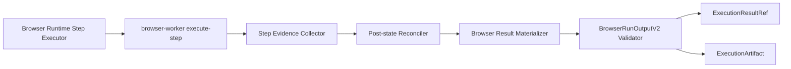

# 浏览器执行契约 P0 完整落地与检验设计

状态：Implemented（灰度 / 真实环境验收待执行）  
日期：2026-08-26  
优先级：P0  
上位设计：[浏览器执行结果契约、证据链与工作流组合设计](browser-execution-contract-and-workflow-composition-design.md)

## 1. P0 结论

P0 的目标不是增加新的浏览器业务能力，而是让现有 Browser Recording Skill 产生稳定、可验证、可追踪的 `BrowserRunOutputV2`，并解决“动作超时但页面最终成功”被永久记录为失败的问题。

P0 完成后必须达到：

```text
现有顺序、条件、循环、接管行为保持不变
Browser Runtime 返回 V2 + Legacy 双写结果
每个步骤、页面、截图、HTML、snapshot 可以稳定关联
失败或超时后仍采集真实页面状态
导航最终到达时返回 recovered，而不是错误的 failed
Catalog 输出声明与实际运行结果一致
新链路不再依赖 pageText/pageState 字段猜测
```

## 2. 范围

### 2.1 P0 必须实施

- 建立浏览器公共契约包。
- 定义并校验 `BrowserRunOutputV2`。
- 实现 Browser Runtime Result Materializer。
- 将 `variables` 物化为稳定顶层 `outputs`。
- 将 `stepResults` 物化为结构化步骤摘要。
- 建立 `stepId -> pageId -> ArtifactRef`。
- 将现有 screenshot、HTML、snapshot 规范化为 ArtifactRef。
- 失败和超时分支也返回 pageState、Artifact 和 post-check evidence。
- 实现导航状态对账和 `recovered`。
- 使用现有 `ExecutionResultRef` 保存 V2 结果引用。
- 使用现有 `ExecutionArtifact` 保存 Artifact 索引。
- Runtime 结果进行 V2/Legacy 双写。
- Recorder Debug UI 能展示 recovered 和当前页面状态。
- 建立单元、契约、集成、回归和发布门禁测试。

### 2.2 P0 明确不做

- 不接入 Readability 或 Trafilatura。
- 不增加 `article/application/audit/raw` Capture Profile UI。
- 不实现 ContentRef 到 LLM 的加载。
- 不实现 Recorder 中的 LLM/Workflow 节点编辑。
- 不实现运维报告投影。
- 不实现完整 Playwright trace.zip 管理。
- 不实现 OpenTelemetry 全链路。
- 不重写现有 branch/loop 运行时。
- 不替换当前 Browser Artifact 本地存储后端。

以上内容分别进入 P1、P2。

## 3. 当前基础与差距

### 3.1 可直接复用

现有基础：

- `RuntimeStepInvokeResult.artifacts/snapshot/output`。
- browser-worker `execute-step`。
- browser-worker `inspect-state`。
- browser-worker `assert-state`。
- browser-worker 自动采集 HTML 和截图。
- browser-worker `/browser/artifacts/:filename`。
- Release Manager Browser Runtime 的 `stepResults/variables/runtimeEvidence`。
- Control Plane `ExecutionResultRef` 和字段投影。
- Control Plane `ExecutionArtifact`。
- Recorder outcome/verification UI。
- Browser Recording action policy、branch、loop 和 takeover。

### 3.2 已确认差距

1. `ExecuteStepResultDto` 成功分支返回 pageState，失败分支只返回 error。
2. Playwright CLI 已采集 HTML 和 screenshot，但 `execute-step.artifacts` 主要只暴露 snapshot。
3. browser worker Artifact ID 依赖 `Date.now()`，不能稳定关联重试。
4. Release Manager 只保存扁平 `stepResults/variables/runtimeEvidence`。
5. Recorder 声明 `pageText/pageState`，实际文本位于 `variables[outputVar]`。
6. 导航失败后没有统一 post-state reconciliation。
7. Recorder Debug 失败分支可能复用旧 observation。
8. `playwright-cli.adapter.ts` 已超过 3500 行，不能继续新增大段职责。

## 4. P0 目标架构



职责边界：

- browser-worker：执行动作并采集动作后的真实浏览器状态和原始证据。
- Release Manager：判断步骤最终状态并物化浏览器公共输出。
- Control Plane：持久化结果引用和 Artifact 索引，验证节点输出契约。
- Recorder：展示执行、恢复、页面和证据，不重新计算权威状态。

## 5. 公共契约包

### 5.1 新目录

```text
packages/backend-contracts/browser-execution-contract/
├── package.json
├── tsconfig.json
├── src/
│   ├── index.ts
│   ├── browser-run-output.types.ts
│   ├── browser-run-output.schema.ts
│   ├── browser-run-output.validator.ts
│   ├── browser-warning-codes.ts
│   └── legacy-browser-output.types.ts
└── test/
    ├── schema.test.ts
    ├── validator.test.ts
    └── fixtures/
```

包名建议：

```text
@ops/backend-browser-execution-contract
```

### 5.2 P0 契约子集

P0 实现上位设计中的：

- `BrowserRunOutputV2`
- `BrowserRunIdentity`
- `BrowserRunSummary`
- `BrowserStepSummary`
- `BrowserPageCapture`
- `BrowserOutputValue`
- `BrowserRunVerification`
- `BrowserEvidenceIndex`
- `BrowserWarning`

P0 的 `BrowserPageContent` 只保留基础字段，不实现正文清理：

```ts
interface BrowserPageContentP0 {
  profile: 'raw';
  textPreview?: string;
  truncated: boolean;
}
```

P1 再增加完整 Capture Profile 和 `ContentRef`。

### 5.3 JSON Schema 要求

Schema 必须：

- `$id` 固定为 `browser-run-output/v2`。
- 顶层 `additionalProperties: false`。
- `schemaVersion` 使用 `const`。
- 核心数组设置明确 item Schema。
- status、outcome、captureReason 使用 enum。
- ArtifactRef 复用 runtime capability contract 定义或通过 `$ref` 引用。
- `outputs` 允许动态字段名，但每个 value 必须符合 `BrowserOutputValue`。
- required 字段与 TypeScript 类型一致。

### 5.4 契约摘要

发布 Browser Skill 时计算：

```text
sha256(canonicalJson(browserRunOutputV2Schema))
```

写入：

- Published Skill output schema digest。
- Deterministic Plan `contractDigest`。
- `ExecutionResultRef.schemaDigest`。
- BrowserRunOutputV2 `run` 或 trace metadata。

## 6. browser-worker 落地设计

### 6.1 文件拆分要求

禁止继续把采集与对账逻辑堆入 `playwright-cli.adapter.ts`。

新增：

```text
apps/backend/runtimes/browser-worker/src/modules/browser/application/
├── browser-step-evidence-collector.service.ts
├── browser-post-action-state.service.ts
├── browser-artifact-ref.factory.ts
└── browser-step-result-enricher.service.ts
```

adapter 只负责调用这些服务或暴露底层能力。

Chrome DevTools adapter 使用相同接口，允许 P0 初期部分证据降级，但返回结构必须一致。

### 6.2 ExecuteStepResultDto 增量字段

保持现有字段，增量增加：

```ts
interface ExecuteStepResultV2Additions {
  executionState?: 'completed' | 'failed' | 'ambiguous';

  attemptedAt?: string;
  observedAt?: string;

  pageState?: BrowserPageStateDto;
  artifacts?: ArtifactRefDto[];
  snapshot?: SnapshotRefDto;

  postCheck?: {
    inspected: boolean;
    targetReached?: boolean;
    evidence: Array<{
      code: string;
      passed: boolean | 'unknown';
      expected?: unknown;
      actual?: unknown;
    }>;
  };

  warningCodes?: string[];
}
```

不删除 `success/errorCode/errorMessage`，避免破坏当前调用方。

### 6.3 成功分支

成功执行后：

1. 调用 `inspectPageState`。
2. 从 action result 中提取 snapshot。
3. 将自动截图转为 `browser_page_screenshot` ArtifactRef。
4. 将 HTML 转为 `browser_page_html` ArtifactRef。
5. 将 snapshot 转为 `browser_dom_snapshot` 或 `browser_snapshot` ArtifactRef。
6. 返回 `executionState=completed`。
7. 返回真实 `pageState`。

### 6.4 失败和超时分支

捕获异常后不能立即只返回 error：

1. 保存原始异常码和异常消息。
2. 调用 `inspectPageState`，失败时返回最小 session state。
3. 尝试捕获 screenshot、HTML 和 snapshot。
4. 对 `goto` 执行目标 URL post-check。
5. 如果状态仍不明确，返回 `executionState=ambiguous`。
6. 如果页面明显未到达，返回 `executionState=failed`。
7. Artifact 采集失败只生成 warning，不覆盖原始动作错误。

### 6.5 ArtifactRef 规范化

worker 返回的 ArtifactRef 至少包含：

```ts
{
  type: 'browser_page_screenshot',
  id: stableArtifactId,
  name: fileName,
  url: `${browserWorkerPublicBase}/browser/artifacts/${fileName}`,
  mimeType: 'image/png',
  sizeBytes,
  metadata: {
    runtimeSessionId,
    executionId,
    stepId,
    kind: 'screenshot',
    localPath,
    sha256,
  }
}
```

P0 允许继续使用当前 browser-worker Artifact 目录，但必须：

- 配置持久化 volume。
- 使用 `path.basename` 防止路径穿越。
- 对返回 URL 使用服务公开地址，而不是本地绝对路径。
- 记录 `sizeBytes` 和 `sha256`。
- Artifact ID 使用执行标识、步骤标识、attempt 和 kind 生成。

建议 ID：

```text
sha256(executionId|stepId|attempt|kind|contentHash).slice(0, 32)
```

### 6.6 HTML 处理

当前 adapter 对 HTML 有最大字符数限制。P0 需要明确：

- `output` 中不内联完整 HTML。
- HTML 写入 `.html` Artifact 文件。
- `ArtifactRef.metadata.truncated` 标记是否被截断。
- `ArtifactRef.metadata.originalSizeUnknown` 标记无法得知完整长度的情况。
- 主结果只保留 HTML ArtifactRef。

正文清理属于 P1。

## 7. Release Manager 落地设计

### 7.1 新服务

```text
apps/backend/registry-release/release-manager/src/publisher/browser-runtime-result/
├── browser-run-output-materializer.service.ts
├── browser-step-summary.mapper.ts
├── browser-page-capture.builder.ts
├── browser-artifact-normalizer.service.ts
├── browser-output-variable.mapper.ts
├── browser-run-summary.service.ts
├── browser-post-state-reconciler.service.ts
└── browser-legacy-output.adapter.ts
```

现有 `capability-release-browser-runtime-result.service.ts` 保持为 facade，避免超过当前职责阈值。

### 7.2 Runtime Mutable State 扩展

```ts
type BrowserRuntimeMutableStateV2 = BrowserRuntimeMutableState & {
  startedAt: string;
  captureOrdinal: number;
  attemptByStepId: Record<string, number>;

  stepSummaries: BrowserStepSummary[];
  pages: BrowserPageCapture[];
  normalizedArtifacts: ArtifactRef[];
  warnings: BrowserWarning[];

  latestPageId?: string;
};
```

旧 `stepResults/variables/runtimeEvidence` 在迁移期继续保存。

### 7.3 步骤物化

每次 step 完成后立即物化，而不是运行结束后从日志反推：

```text
worker result
-> normalize execution status
-> reconcile post-state if needed
-> create page capture if page state/evidence changed
-> normalize artifacts
-> map outputVar
-> append BrowserStepSummary
-> update run summary counters
```

### 7.4 pageId 生成

pageId 必须表示一次页面状态采集，不等同于 URL。

建议：

```text
page_${sha256(executionId|stepId|attempt|captureOrdinal|pageFingerprint).slice(0, 24)}
```

如果没有 fingerprint，使用 URL、title 和 capture ordinal。

相同 URL 在以下情况下仍生成新 pageId：

- 页面 fingerprint 改变。
- 显式 checkpoint。
- 不同循环 iteration。
- failure/takeover/final capture。

### 7.5 variables 到 outputs

只有 execution plan 中声明过的输出进入权威 `outputs`：

```text
executionPlan.outputs
-> validate declared name
-> find state.variables[name]
-> find producer step/outputVar
-> infer or validate type
-> build BrowserOutputValue
```

未声明变量：

- 可以保留在 legacy `variables`。
- 不进入 V2 `outputs`。
- 发布验证产生 warning。

已声明但缺失的必需输出：

- Browser Skill 结果不得标记为完整成功。
- 生成 `DECLARED_OUTPUT_MISSING`。
- 根据输出契约 required 属性决定 failed 或 completed_with_warnings。

### 7.6 V2/Legacy 双写

返回结构：

```ts
{
  browserRunOutput: materializedV2,

  // Legacy compatibility
  runtimeSessionId,
  backend,
  stepResults,
  variables,
  executionPlanVersion,
  degradedMode,
  degradeReason,
  trace,
  runtimeEvidence,
}
```

权威规则：

- 新消费者只读 `browserRunOutput`。
- Legacy Adapter 从同一 state 生成旧字段。
- 不允许 V2 与 legacy 分别执行验证或业务计算。

## 8. Post-state Reconciliation

### 8.1 触发条件

以下情况进入对账：

- worker `executionState=ambiguous`。
- `success=false` 且 action 是 `goto`。
- `success=false` 但 pageState 与 before state 明显不同。
- timeout/errorCode 属于可恢复类别。
- worker 返回了页面证据但未给出明确 targetReached。

### 8.2 导航目标规范化

比较 URL 时：

- 解析 scheme、host、port、pathname、query。
- 支持 `www` 规范化策略，但不默认认为两个域名完全等价。
- 对 hash 是否重要由 assertion 配置决定。
- 允许显式 redirect host/path 规则。
- query 参数按录制 assertion 决定精确或部分匹配。
- 不把 URL 查询串再次交给自然语言命令解析器。

### 8.3 对账判定

```text
Execution failed/ambiguous
AND current page is not browser error page
AND current URL satisfies target/redirect policy
AND readyState is interactive/complete or meaningful DOM exists
= recovered
```

如果 URL 不变但页面 fingerprint 或 assertion 满足，也可以对非导航动作判为 recovered。

### 8.4 输出

对账成功：

```ts
{
  stepStatus: 'recovered',
  warningCodes: ['NAVIGATION_TIMEOUT_RECOVERED'],
  verification: {
    success: true,
    confidence: reconciledConfidence,
    checks: [...]
  }
}
```

对账失败保留原始错误，同时附加 post-state checks。

### 8.5 Recorder Debug 路径

`BrowserExecutionControllerService` 在最终 recovery execution 失败时仍必须调用 `observePageSafely`，不能复用旧 failure observation。

修改原则：

- `initialExecution.success` 不再决定是否观察。
- 只要 browser session 可用，都尝试 post-execution observation。
- observation 失败才使用旧 observation，并明确 `PAGE_OBSERVATION_FAILED`。
- `RecorderDebugOutcomeService` 使用 reconciliation 后状态。

注意：现有 `ExecutionReconcileService` 面向人工接管后的恢复计划，不应混入 P0 post-state reconciliation。新增服务需避免同名和职责混淆。

## 9. Control Plane 持久化

### 9.1 数据库策略

P0 默认不新增 Prisma 表，复用：

- `ExecutionResultRef`
- `ExecutionArtifact`
- `ExecutionPhaseArtifact`
- `ExecutionStep.outputJson`

### 9.2 ResultRef

当 `RESULT_REF_ENABLED=true`：

- `browserRunOutput` 作为节点输出的一部分进入 ResultRef。
- `schemaDigest` 使用冻结 BrowserRunOutputV2 Schema digest。
- preview 仅保留 summary、final page、输出名和 warning。
- preview 不包含 HTML、Token、Cookie 或长文本。

需要扩展 `ResultRefService.create`：允许调用方传入权威 `schemaDigest`，避免只基于推断 shape 计算。

建议兼容签名：

```ts
create({
  executionId,
  producerStepId,
  payload,
  outputSchema,
  schemaDigest,
})
```

### 9.3 ExecutionArtifact

每个 worker ArtifactRef 同步为 `ExecutionArtifact`：

- `producerNodeId` 使用确定性计划 nodeId；
- `producerStepId` 使用 Control Plane execution step UUID；
- `artifactType` 使用规范类型；
- `externalArtifactId` 使用 worker artifact ID；
- `url/mimeType/sizeBytes/sha256` 直接映射；
- metadata 保存 browser stepId、pageId、loop iteration 和 runtimeSessionId。

### 9.4 无新迁移的限制

P0 复用 JSON metadata 保存 pageId/loop 信息，因此查询能力有限。P2 再评估专用索引字段或 Artifact Store。

## 10. 发布与运行时校验

### 10.1 Bridge 校验

`BrowserRecordingExecutionPlanValidatorService` 增加：

- 输出名称唯一。
- 输出 name/type/sourceStep 合法。
- outputVar 对应 producer step。
- V2 output schema 存在。
- contract digest 存在。
- 新发布能力禁止空 outputs 后仍声明 pageText。

### 10.2 Runtime 校验

Materializer 完成后：

1. 使用公共 validator 校验 V2。
2. 校验所有必需具名输出。
3. 校验 pageId 唯一。
4. 校验 ArtifactRef 引用的 pageId/stepId 存在。
5. 校验 finalPageId 存在于 pages。
6. 校验 summary 计数与 steps 一致。
7. 失败时写入明确 errorCode，不允许静默返回 legacy payload。

### 10.3 Scheduler 校验

确定性调度器对 Browser Skill：

- 权威路径为 `browserRunOutput`。
- V2 模式禁止从 `stepResults/results/data` 猜字段。
- Legacy 能力继续通过 Legacy Adapter。
- 结果不满足冻结输出 Schema 时阻止下游节点。

## 11. Recorder 前端

### 11.1 类型下沉

将 `RecorderOutcomeDetailCard.tsx` 内部类型移动到：

```text
apps/frontend/portal/src/features/recorder/lib/outcome.types.ts
apps/frontend/portal/src/features/recorder/lib/browser-run-output.types.ts
```

避免继续扩大组件文件。

### 11.2 P0 展示

新增：

- 步骤状态 `recovered` 标签。
- 原始动作错误和最终对账结果分开展示。
- 页面列表：pageId、URL、标题、采集原因。
- 每个页面的 screenshot/HTML/snapshot 链接。
- warning code。
- “该轮最终状态”和“当前会话页面”分开展示。

### 11.3 兼容展示

- 存在 `browserRunOutput` 时使用 V2。
- 不存在时继续显示 legacy outcome。
- 前端不重新计算 verifier confidence。
- 前端不根据当前 URL 覆盖历史步骤状态。

## 12. Feature Flags

建议：

```text
BROWSER_RUN_OUTPUT_V2_ENABLED
BROWSER_RUN_OUTPUT_V2_DUAL_WRITE
BROWSER_POST_STATE_RECONCILIATION_ENABLED
BROWSER_NORMALIZED_ARTIFACTS_ENABLED
```

灰度顺序：

1. 开启 Materializer 但只记录 shadow result。
2. 对比 V2 与 legacy，不返回客户端。
3. 开启 dual write。
4. Recorder UI 读取 V2。
5. Scheduler 新 Browser Skill 读取 V2。
6. 保留关闭开关直到 P1 稳定。

## 13. 文件级实施清单

### 13.1 新增

- `packages/backend-contracts/browser-execution-contract/**`
- `browser-step-evidence-collector.service.ts`
- `browser-post-action-state.service.ts`
- `browser-artifact-ref.factory.ts`
- `browser-step-result-enricher.service.ts`
- `browser-run-output-materializer.service.ts`
- `browser-step-summary.mapper.ts`
- `browser-page-capture.builder.ts`
- `browser-artifact-normalizer.service.ts`
- `browser-output-variable.mapper.ts`
- `browser-run-summary.service.ts`
- `browser-post-state-reconciler.service.ts`
- `browser-legacy-output.adapter.ts`
- Recorder 前端 V2 类型与展示子组件。

### 13.2 修改

- `apps/backend/runtimes/browser-worker/src/dto/worker.dto.ts`
- `apps/backend/runtimes/browser-worker/src/modules/browser/browser.service.ts`
- `apps/backend/runtimes/browser-worker/src/modules/browser/adapters/playwright-cli.adapter.ts`
- `apps/backend/runtimes/browser-worker/src/modules/browser/adapters/chrome-devtools-cli.adapter.ts`
- `apps/backend/runtimes/browser-worker/src/modules/browser/mappers/browser-step.mapper.ts`
- `apps/backend/registry-release/release-manager/src/publisher/capability-release-browser-runtime.types.ts`
- `apps/backend/registry-release/release-manager/src/publisher/capability-release-browser-runtime-step-executor.service.ts`
- `apps/backend/registry-release/release-manager/src/publisher/capability-release-browser-runtime-loop-executor.service.ts`
- `apps/backend/registry-release/release-manager/src/publisher/capability-release-browser-runtime-result.service.ts`
- `apps/backend/registry-release/release-manager/src/publisher/capability-release-browser-runtime.service.ts`
- `apps/backend/registry-release/release-manager/src/validator/browser-recording-execution-plan-validator.service.ts`
- `apps/backend/intelligence/ai-orchestrator/src/modules/browser/execute/browser-execution-controller.service.ts`
- `apps/backend/intelligence/ai-orchestrator/src/modules/browser/execute/recorder/recorder-debug-verification.ts`
- `apps/backend/intelligence/ai-orchestrator/src/modules/browser/export/recorder-export.service.ts`
- `apps/backend/execution-control/control-plane/src/modules/execution/result-ref/result-ref.service.ts`
- `apps/backend/execution-control/control-plane/src/modules/execution/step-runner/steps/execution-step-writer.service.ts`
- Recorder 前端详情页与 outcome 组件。

### 13.3 文件复杂度门禁

- 不继续把业务逻辑加入 3500+ 行 Playwright adapter。
- 不继续把新展示逻辑全部加入 652 行 Recorder Debug 页面。
- 新 Service 原则上不超过 500 行。
- Result Materializer 按步骤、页面、Artifact、输出职责拆分。

## 14. 检验设计

### 14.1 公共契约单元测试

| 编号 | 用例 | 预期 |
|---|---|---|
| C-01 | 最小 completed 输出 | Schema 通过 |
| C-02 | 缺少 schemaVersion | Schema 失败 |
| C-03 | 非法 step status | Schema 失败 |
| C-04 | finalPageId 不存在 | 语义校验失败 |
| C-05 | pageId 重复 | 语义校验失败 |
| C-06 | ArtifactRef 缺 mimeType | 按类型规则失败或 warning |
| C-07 | outputs 动态字段 | value 合法时通过 |
| C-08 | summary 计数不一致 | 语义校验失败 |

### 14.2 worker 单元测试

| 编号 | 用例 | 预期 |
|---|---|---|
| W-01 | click 成功 | pageState + screenshot/html Artifact |
| W-02 | goto 超时但 URL 已变化 | ambiguous + pageState + evidence |
| W-03 | goto 失败且 about:blank | failed + evidence |
| W-04 | screenshot 失败 | 原动作结果保留，生成 warning |
| W-05 | HTML 读取失败 | 原动作结果保留，生成 warning |
| W-06 | Artifact 文件名路径穿越 | 拒绝 |
| W-07 | 同一 step 重试 | Artifact ID 按 attempt 区分 |
| W-08 | HTML 超过上限 | truncated=true |

### 14.3 Materializer 单元测试

| 编号 | 用例 | 预期 |
|---|---|---|
| M-01 | 线性成功步骤 | completed summary |
| M-02 | outputVar 已声明 | 写入 outputs |
| M-03 | 未声明 variable | 只保留 legacy |
| M-04 | 必需输出缺失 | failed/warning 按契约 |
| M-05 | 条件跳过步骤 | status=skipped |
| M-06 | 循环第三轮页面 | loopId/iteration=3 |
| M-07 | 同 URL 不同 fingerprint | 两个 pageId |
| M-08 | Artifact 与 page 关联 | 引用完整 |
| M-09 | recovered 导航 | completed_with_warnings |
| M-10 | failure 有部分页面 | 保留证据和失败状态 |

### 14.4 Reconciliation 单元测试

| 编号 | 场景 | 预期 |
|---|---|---|
| R-01 | goto timeout，目标 URL 到达 | recovered |
| R-02 | goto timeout，经允许 redirect 到达 | recovered |
| R-03 | goto timeout，错误页 | failed |
| R-04 | URL 未变但目标 selector 出现 | 按 assertion recovered |
| R-05 | URL 到达但 DOM 空白 | ambiguous/failed |
| R-06 | post-state observation 失败 | failed + observation warning |
| R-07 | 带 query URL | 查询串不产生额外 fill 命令 |
| R-08 | www 与 apex host | 仅按显式 redirect policy 判定 |

### 14.5 Control Plane 契约测试

- V2 输出生成 ResultRef。
- 调用方提供的 schemaDigest 被保存。
- preview 脱敏 Token、Cookie、password。
- ArtifactRef 写入 ExecutionArtifact。
- `producerStepId/producerNodeId/pageId` metadata 正确。
- 权限不足不能投影 ResultRef。
- 新 Browser Skill 输出 Schema 不匹配时 Scheduler 阻断。

### 14.6 Recorder 前端测试

- recovered 标签展示。
- timeout 原始错误与 post-check 分开展示。
- 历史步骤状态不被当前页面覆盖。
- 页面 Artifact 链接正确。
- legacy 会话仍可展示。
- 0% failed 和最终 recovered 不再同时显示为同一轮结论。

## 15. 端到端验收场景

### 15.1 原始问题复现

步骤：

1. 使用原始 MarkTechPost URL。
2. 模拟 `www` SSL 错误或首次导航失败。
3. fallback 导航在等待阈值处超时。
4. 页面随后到达目标文章。

预期：

- 原始错误被保留。
- post-state URL/标题/readyState 被采集。
- 步骤状态为 `recovered`。
- warning 包含 `NAVIGATION_TIMEOUT_RECOVERED`。
- 总体为 `completed_with_warnings`。
- 页面包含 screenshot/html/snapshot refs。
- 不产生 query 尾部的伪 `fill username` 命令。

### 15.2 多页面线性流程

步骤：打开列表页、点击详情、返回列表、打开第二个详情。

预期：

- 至少四个 page capture。
- 同一列表 URL 的两次状态可拥有不同 pageId。
- 每个截图和 HTML 关联正确步骤。
- finalPageId 指向第二个详情页。

### 15.3 条件与循环

步骤：读取表格、按条件进入详情、循环处理三行。

预期：

- 条件结果有 matched/mismatched。
- 被跳过步骤显式为 skipped。
- 三轮输出都带 iteration。
- 无进展时正确 blocked/takeover。
- 已产生证据不会因最终失败丢失。

## 16. 验证命令

所有 Docker 操作从仓库根目录通过 `./docker/start-smart.sh` 执行。

建议最小命令集：

```bash
pnpm --filter @ops/backend-browser-execution-contract test

pnpm --filter @ops/browser-worker test

pnpm --filter @ops/release-manager test

pnpm --filter @ops/control-plane test

pnpm --filter @ops/portal test
```

涉及容器运行时：

```bash
./docker/start-smart.sh docker-compose.base.yml up -d browser-worker release-manager control-plane ai-orchestrator platform
```

然后执行真实 Browser Recording Skill Smoke Test，并查询执行结果、ResultRef 和 Artifact。

具体 package 名称应在实施时依据 workspace 实际名称确认，不允许为了匹配文档盲目新增重复 package。

## 17. 发布门禁

P0 不得进入默认开启状态，除非：

- 所有公共契约测试通过。
- worker 成功和失败分支测试通过。
- Materializer 测试通过。
- 原始问题端到端用例通过。
- 多页面、条件和循环用例通过。
- V2/Legacy shadow 对比无关键语义差异。
- Artifact URL 在目标环境可读取。
- ResultRef 权限测试通过。
- Recorder legacy 展示回归通过。
- 相关服务重启后实际加载新代码。

## 18. 灰度与回滚

### 18.1 灰度

1. Shadow materialization，仅记录 V2 校验结果。
2. 开启 dual write，客户端仍读 legacy。
3. Recorder Debug 指定用户读取 V2。
4. 新发布 Browser Skill 使用 V2。
5. Control Plane 对新能力强制 V2 契约。

### 18.2 回滚

回滚只关闭 feature flag：

- 停止客户端读取 V2。
- 停止 Scheduler 对 Browser Skill 强制 V2。
- 保留已经写入的 ResultRef 和 Artifact。
- Legacy 返回路径继续工作。

不得通过删除执行数据或 Artifact 完成回滚。

## 19. P0 完成定义

P0 完成必须同时满足：

- `BrowserRunOutputV2` 有公共包和权威 Schema。
- Browser Runtime 实际返回通过 Schema 校验。
- 声明输出和 `outputs` 真实一致。
- 失败和超时分支可以看到动作后的真实页面。
- recovered 语义端到端可见。
- 多页面和循环证据可稳定关联。
- HTML、截图和 snapshot 继续保留。
- V2/Legacy 双写可灰度和可回滚。
- 没有把 P1/P2 能力偷偷合并进 P0。
