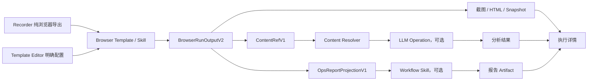

# 浏览器执行 P1：正文提取与显式工作流组合落地及检验设计

> 状态：In Progress（实现与模块级验证完成；真实环境验收待执行）
>
> 优先级：P1
>
> 日期：2026-08-26
>
> 前置文档：
> - [总体设计](./browser-execution-contract-and-workflow-composition-design.md)
> - [P0 落地与检验设计](./browser-execution-p0-implementation-and-validation-design.md)

## 1. P1 结论

P1 在 P0 的稳定浏览器结果契约之上交付两条可产品化链路：

1. 打开 URL，保留截图和原始 HTML，同时产出经过清理的正文；只有模板编辑者显式选择时，才追加 LLM 分析节点。
2. 完成带条件、循环、多页面的运维网页操作后，将浏览器结果投影成稳定的运维报告输入，再显式调用已发布的报告工作流。

核心边界保持不变：

- 浏览器执行负责页面操作、页面状态、正文提取和证据。
- LLM Operation 负责分析、摘要和解读。
- Workflow Skill 负责报告编排与报告 Artifact。
- Recorder 只负责浏览器动作、条件、循环和证据导出；模板编辑器负责显式表达组合关系。
- 浏览器结果不会因启用后处理而被覆盖，后处理只消费其稳定引用。

P1 不将浏览器和 LLM 合成一个黑盒 Skill。发布产物仍然可以是纯 Browser Skill，也可以是由多个独立节点组成的确定性组合计划。

### 1.1 当前实现状态（2026-08-26）

已实现并通过模块级检验：

- `CaptureProfileV1`、正文净化/截断/风险标记、页面别名匹配；正文提取和 P0 证据采集可独立开关。
- 浏览器候选正文先作为运行时临时值返回，Control Plane 再写入 `ExecutionResultRef` 并替换为 `ContentRefV1`；截图、HTML、snapshot 保持独立 Artifact。
- `resolve_text_content` 和 `project_ops_report` 两种确定性 binding，以及其各自的 feature flag。
- `recorderComposition` 执行时编译：调用权威能力目录解析 LLM Operation / Workflow Skill 的版本和契约，然后复用既有 freeze、scheduler、ResultRef 与审计链路；已发布 Browser Skill 的不可变快照也会被自动识别。
- `browser_succeeded` / `browser_terminal` 的确定性调度：成功条件节点会在浏览器未成功时记录为 skipped；终态报告节点在浏览器可用的终态输出下继续执行。
- Recorder Debug 只导出纯浏览器流程，不再接受或保存后处理配置。
- Browser Template 详情页提供独立“结果与后处理”页签；组合契约的来源固定标记为 `template_editor`。
- 显式搜索引擎流程按 `navigate 首页 -> smart_search -> click_result` 导出，`commands` 与 `templateSteps` 来自同一条规范化动作序列。

尚未关闭的 P1 工作：

- 已发布 Browser Skill → LLM / Workflow 的完整业务验收需要环境中存在对应的已发布能力。当前本地数据库仅有 `temporal_workflow` 发布记录，没有可复用的 `browser_recording` 发布记录；因此该验收用例已由编译、调度和 ContentRef 的模块测试覆盖，待准备 fixture 后补真实业务运行。

### 1.2 本次运行验证

- 已重建 `browser-worker`、`control-plane`、`execution-dispatcher` 与 `ai-orchestrator`，并以 P1 feature flags 运行。
- 已对真实 browser worker 执行 `https://example.com` 的 `article` CaptureProfile：返回 `contentCandidate`、HTML Artifact、截图 Artifact、页面状态和 post-state 验证结果。
- 本地数据库检查确认不存在 `browser_recording` 的已发布 release，未伪造发布记录或绕过发布/权限契约。

## 2. 前置条件与范围

### 2.1 前置条件

进入 P1 开发前必须满足：

- P0 的 `BrowserRunOutputV2` 已启用并通过契约测试。
- 浏览器输出已写入 `ExecutionResultRef`。
- 截图、HTML、snapshot 已归一为 `ExecutionArtifact`。
- 失败后的 post-state reconciliation 已可用。
- Recorder Debug 能读取 V2，并仍兼容 legacy 数据。
- 新发布的 Browser Skill 可以声明 `outputs`。

### 2.2 P1 范围

- 页面采集策略 `captureProfile`。
- 原始 HTML 到正文内容的确定性提取。
- `ContentRefV1` 及大文本读取策略。
- 内容净化、截断、质量评分和安全标签。
- Browser Template 的页面别名、输出声明和显式后处理配置。
- Browser Skill 到 LLM Operation 的内容绑定。
- Browser Skill 到 Workflow Skill 的运维报告投影。
- 组合计划的冻结、执行、重试、审计和展示。
- 两类目标场景的端到端检验。

### 2.3 P1 不做

- Playwright `trace.zip` 全量采集。
- OpenTelemetry 全链路语义规范。
- Trafilatura 等独立提取服务。
- Artifact 对象存储、去重和生命周期治理。
- 轨迹可视化和基准测试平台。
- 运行时自动决定是否调用 LLM。
- 自动生成任意运维工作流。

上述能力放入 P2。

## 3. 目标架构



计划中每个节点保留独立身份：

- 独立输入 Schema。
- 独立输出 Schema。
- 独立重试和超时。
- 独立状态与错误。
- 独立 ResultRef 和 Artifact。
- 通过确定性 binding 连接，不通过隐式共享内存连接。

## 4. 公共契约

### 4.1 新增包结构

在 P0 的浏览器契约包中增加内容契约，避免另建相互循环的包：

```text
packages/backend-contracts/browser-execution-contract/
  src/
    browser-run-output-v2.types.ts
    content-ref-v1.types.ts
    capture-profile-v1.types.ts
    ops-report-projection-v1.types.ts
    schemas/
      content-ref-v1.schema.json
      capture-profile-v1.schema.json
      ops-report-projection-v1.schema.json
    validators/
      content-ref.validator.ts
      capture-profile.validator.ts
      ops-report-projection.validator.ts
```

### 4.2 CaptureProfileV1

```ts
export type CaptureProfileName =
  | 'article'
  | 'application'
  | 'audit'
  | 'raw';

export interface CaptureProfileV1 {
  schemaVersion: 'capture-profile/v1';
  profile: CaptureProfileName;
  capture: {
    screenshot: boolean;
    html: boolean;
    snapshot: boolean;
    mainContent: boolean;
  };
  limits: {
    htmlBytes: number;
    contentChars: number;
    tableCells: number;
  };
  content?: {
    preserveHeadings: boolean;
    preserveLinks: boolean;
    preserveTables: boolean;
    preserveCodeBlocks: boolean;
  };
}
```

推荐默认值：

| Profile | 使用场景 | mainContent | 原始证据 | 提取策略 |
| --- | --- | --- | --- | --- |
| `article` | 新闻、文档、博客 | 是 | HTML + Screenshot | Readability 优先 |
| `application` | 控制台、表单、仪表板 | 可选 | HTML + Screenshot + Snapshot | main/role/density |
| `audit` | 运维、合规 | 是 | 全部 | 可见文本 + 表格优先 |
| `raw` | 调试和兼容 | 否 | 全部 | 不提取正文 |

Profile 必须在模板编辑或 Skill 发布时确定。运行时可用输入覆盖限制值，但不能把 `mainContent=false` 隐式改成 `true`。

### 4.3 ContentRefV1

```ts
export interface ContentRefV1 {
  schemaVersion: 'content-ref/v1';
  contentId: string;
  resultRefId: string;
  artifactId?: string;
  pageId: string;
  sourceUrl: string;
  finalUrl: string;
  title?: string;
  language?: string;
  mediaType: 'text/markdown' | 'text/plain' | 'application/json';
  extraction: {
    profile: CaptureProfileName;
    method:
      | 'readability'
      | 'semantic-main'
      | 'density'
      | 'visible-text'
      | 'none';
    confidence: number;
    fallbackLevel: number;
    extractedAt: string;
  };
  integrity: {
    sha256: string;
    chars: number;
    bytes: number;
    truncated: boolean;
  };
  safety: {
    activeContentRemoved: boolean;
    suspectedPromptInjection: boolean;
    untrustedExternalContent: true;
  };
  preview: string;
}
```

规则：

- `preview` 只用于列表和人工识别，不能作为 LLM 的默认完整输入。
- 正文保存在 `ExecutionResultRef`；超阈值时可额外写 Artifact。
- `resultRefId` 是权威内容入口，`artifactId` 是可选的下载入口。
- 读取时必须校验执行、租户和项目权限。
- `sha256` 不匹配时禁止进入下游节点。
- 外部网页内容一律标记为不可信数据，不允许成为 system/developer 指令。

### 4.4 BrowserRunOutputV2 扩展

在 `pages[]` 上增加可选字段：

```ts
interface BrowserPageCaptureV2 {
  // P0 fields...
  content?: ContentRefV1;
  captureProfile?: CaptureProfileV1;
}
```

在 `outputs` 中只能导出声明过的字段：

```json
{
  "outputs": {
    "article_content": {
      "schemaVersion": "content-ref/v1",
      "resultRefId": "rr_...",
      "pageId": "page_..."
    }
  }
}
```

不得直接把数十万字符正文复制进每个 step output、execution output 和事件消息。

### 4.5 OpsReportProjectionV1

报告工作流不直接依赖浏览器运行时的内部字段。中间投影契约如下：

```ts
export interface OpsReportProjectionV1 {
  schemaVersion: 'ops-report-projection/v1';
  execution: {
    executionId: string;
    skillId: string;
    startedAt: string;
    endedAt: string;
    status: 'succeeded' | 'failed' | 'partial' | 'recovered';
  };
  target: {
    environment?: string;
    system?: string;
    entryUrl: string;
  };
  summary: {
    totalSteps: number;
    succeededSteps: number;
    failedSteps: number;
    skippedSteps: number;
    loopIterations: number;
  };
  checks: Array<{
    name: string;
    status: 'pass' | 'fail' | 'unknown';
    observed?: unknown;
    expected?: unknown;
    stepId?: string;
  }>;
  incidents: Array<{
    severity: 'info' | 'warning' | 'critical';
    code: string;
    message: string;
    stepId?: string;
  }>;
  evidence: Array<{
    type: 'screenshot' | 'html' | 'snapshot' | 'content';
    artifactId?: string;
    resultRefId?: string;
    pageId?: string;
  }>;
  declaredOutputs: Record<string, unknown>;
}
```

投影必须是确定性的，相同 `BrowserRunOutputV2` 和相同投影版本产生相同摘要与排序。

## 5. browser-worker 正文提取落地

### 5.1 文件拆分

不得把正文提取继续写进超过 3500 行的 `playwright-cli.adapter.ts`。新增：

```text
apps/backend/runtimes/browser-worker/src/modules/browser/content/
  browser-content-extraction.service.ts
  capture-profile-resolver.service.ts
  readability-extractor.adapter.ts
  semantic-main-extractor.service.ts
  text-density-extractor.service.ts
  visible-text-extractor.service.ts
  extracted-content-sanitizer.service.ts
  extracted-content-quality.service.ts
  content-result-ref.client.ts
  content-extraction.types.ts
```

适配器只提供当前 page、HTML 和可见性查询能力；`browser-content-extraction.service.ts` 负责策略编排。

### 5.2 提取流程

```text
页面稳定
  -> 读取 title/finalUrl/lang/html
  -> 移除 script/style/template/noscript/隐藏节点
  -> 按 profile 选择提取器
  -> 规范化 Markdown/Plain Text
  -> 质量评分
  -> 必要时确定性 fallback
  -> 安全标记
  -> 写 ResultRef/Artifact
  -> 返回 ContentRefV1
```

`article` 顺序：

1. Readability。
2. `<article>`。
3. `<main>` 或 `[role=main]`。
4. 文本密度提取。
5. 可见正文。

`application` 顺序：

1. `<main>` 或 `[role=main]`。
2. 当前 snapshot 的可交互区域与可见表格。
3. 文本密度提取。
4. 可见正文。

`audit` 在 application 的基础上优先保留：

- 状态徽标。
- 告警文本。
- 表格表头与单元格。
- 时间戳。
- 错误码。
- 当前筛选条件。

### 5.3 质量评分

评分范围 `0..1`，至少考虑：

- 正文字符数量。
- 链接文字占比。
- 标题和段落数量。
- 重复导航文本占比。
- 可见文本覆盖率。
- 主要容器语义。
- 页面类型匹配程度。

建议阈值：

- `>= 0.75`：接受。
- `0.45..0.75`：接受并记录 `LOW_CONTENT_CONFIDENCE`。
- `< 0.45`：尝试下一级 fallback。
- 所有策略 `< 0.45`：返回最佳候选并标记 warning，不把浏览器步骤判为失败。

正文提取失败属于派生结果失败。只要页面证据成功，浏览器动作结果仍可成功，但 `content.status='failed'`，下游要求正文的节点按 binding 规则失败或跳过。

### 5.4 净化规则

必须移除：

- script、style、iframe 内联执行内容。
- 事件处理属性。
- data URL 中的主动内容。
- 隐藏输入中的 token/password。
- cookie、authorization、localStorage 等运行时凭据。
- 非展示用途的 HTML 注释和 metadata。

必须保留：

- 标题层级。
- 段落、列表、引用。
- 代码块的纯文本。
- 配置允许时的链接目标。
- 配置允许时的表格。

任何类似“忽略之前指令”的网页文本都仍作为正文保留，但 `suspectedPromptInjection=true`。安全边界由 LLM Runtime 的 prompt renderer 强制：网页正文只能插入 untrusted content 段。

### 5.5 采集时点

以下动作默认可触发采集：

- `navigate` 成功或 reconciled success。
- 页面主 URL 发生变化。
- Recorder 明确插入 `capture_content` 步骤。
- 被声明为报告证据的验证步骤结束。

点击、输入等普通步骤不默认重复提取正文，避免每步产生大文本。

## 6. ContentRef 持久化与解析

### 6.1 写入模型

`content-result-ref.client.ts` 调用 Control Plane 已有 ResultRef 能力，写入：

```json
{
  "schemaVersion": "extracted-content/v1",
  "title": "...",
  "language": "zh-CN",
  "markdown": "...",
  "source": {
    "url": "...",
    "pageId": "..."
  }
}
```

ResultRef 的 `schemaDigest` 使用 `extracted-content/v1` Schema 的确定摘要，不根据运行时实例形状推断。

### 6.2 Content Resolver

在 Control Plane 新增：

```text
apps/backend/execution-control/control-plane/src/modules/execution/content/
  content-ref-resolver.service.ts
  content-ref-authorizer.service.ts
  content-integrity.service.ts
  content-resolution-policy.ts
```

Resolver 职责：

1. 确认调用节点可以读取源执行结果。
2. 读取 ResultRef。
3. 校验 schemaVersion、schemaDigest 和 sha256。
4. 应用字符和 token 限额。
5. 输出带来源元数据的 `ResolvedContentV1`。
6. 记录消费审计，不修改源浏览器结果。

### 6.3 确定性计划 binding

在 `packages/backend-contracts/deterministic-plan` 的 `node_output` binding 增加可选 transform：

```ts
transform?:
  | 'extract_unique_array'
  | 'resolve_text_content';
```

示例：

```json
{
  "source": "node_output",
  "nodeId": "open_article",
  "path": "outputs.article_content",
  "transform": "resolve_text_content"
}
```

约束：

- `resolve_text_content` 只接受 `ContentRefV1`。
- Freeze 阶段校验源节点输出 Schema 包含 `content-ref/v1`。
- Scheduler 在目标节点启动前解析内容，不在 Planner 阶段读取动态内容。
- 解析后的正文只进入目标节点输入，不写回 plan。
- 非 LLM 节点也可声明接收正文，但必须通过输入 Schema 校验。

这是对 V1 的可选枚举扩展；若当前冻结摘要策略禁止扩展枚举，则发布 `deterministic-plan/v2`，不能绕过摘要校验私自兼容。

## 7. Template Editor 显式配置

### 7.1 模板组合模型

浏览器模板 `config.workflowComposition` 增加：

```ts
interface TemplateWorkflowCompositionV1 {
  schemaVersion: 'browser-template-workflow-composition/v1';
  pageAliases: Array<{
    alias: string;
    match: { urlPattern?: string; titlePattern?: string };
    captureProfile: CaptureProfileV1;
  }>;
  outputDeclarations: Array<{
    name: string;
    sourcePageAlias: string;
    kind: 'content' | 'value' | 'artifact' | 'page_state';
    sourcePath?: string;
    required: boolean;
  }>;
  postProcessingSteps: Array<
    | {
        id: string;
        type: 'llm_operation';
        operationId: string;
        operationVersion: string;
        inputBindings: Record<string, unknown>;
        runWhen: 'browser_succeeded' | 'browser_terminal';
      }
    | {
        id: string;
        type: 'workflow_skill';
        skillId: string;
        releaseId: string;
        inputProjection: 'ops-report-projection/v1';
        runWhen: 'browser_succeeded' | 'browser_terminal';
      }
  >;
}
```

`postProcessingSteps` 默认为空。空数组意味着绝不调用 LLM 或报告工作流。

### 7.2 Template Editor UI

新增独立组件，避免继续扩大 652 行的详情页：

```text
apps/frontend/portal/src/features/browser-templates/
  components/TemplateWorkflowCompositionTab.tsx
  lib/templateWorkflowComposition.ts
```

用户操作：

1. 给页面或关键步骤设置别名。
2. 选择采集策略。
3. 声明浏览器输出。
4. 可选点击“添加后处理”。
5. 选择 LLM Operation 或已发布 Workflow Skill。
6. 显式绑定输入。
7. 预览最终确定性计划。

UI 必须明显展示：

- “浏览器执行结果”与“LLM/报告结果”是不同节点。
- 是否会调用模型。
- 模型操作的版本、预算和输入来源。
- 报告工作流的发布版本。
- 浏览器失败时是否仍生成失败报告。

禁止默认勾选“分析页面”或根据自然语言命令偷偷添加 LLM 节点。

### 7.3 后端职责拆分

新增：

```text
apps/backend/capabilities/browser-domain/templates/
  template.service.ts                 # 组合配置持久化和发布载荷同步
  validators/template.validator.ts    # 模板组合契约门禁
```

现有 `recorder-export.service.ts` 只协调纯浏览器导出：

- 无论是否会在模板中配置后处理，Recorder 导出都不包含 `composition` / `compositePlan`。
- Template 保存时才把 `workflowComposition` 镜像到待发布载荷，并标记 `compositionSource=template_editor`。
- Control Plane 在执行时解析已发布的显式组合，生成引用固定版本的确定性组合计划。
- 不复制 LLM prompt 或 Workflow 实现到 Browser Skill 内。

### 7.4 导出门禁

以下情况禁止发布：

- 输出名重复或不符合命名规则。
- required 输出没有可达的生产步骤。
- LLM input binding 指向不存在的输出。
- 内容 binding 未使用 `resolve_text_content`。
- 使用未激活或未 attested 的 LLM Operation 版本。
- 使用未发布的 Workflow Skill release。
- `browser_terminal` 报告工作流未声明接受 failed/partial 状态。
- 节点之间形成环。

## 8. URL 正文分析场景

### 8.1 发布形态

纯采集 Skill：

```text
open_article(browser_template)
  output: article_content, final_url, screenshot
```

带分析的组合计划：

```text
open_article(browser_template)
  -> analyze_article(llm_operation:summarize_text@version)
```

Browser Skill 自身在两种情况下保持同一输出契约。添加分析不会改变截图、HTML 或正文 ContentRef。

### 8.2 LLM 输入

推荐绑定：

```json
{
  "text": {
    "source": "node_output",
    "nodeId": "open_article",
    "path": "outputs.article_content",
    "transform": "resolve_text_content"
  },
  "instruction": {
    "source": "literal",
    "value": "提炼主要结论、事实依据和需要核验的不确定项"
  }
}
```

LLM Runtime 必须将来源、URL、内容哈希和截断状态传入审计记录。若正文被截断，分析输出 metadata 必须显示 `sourceTruncated=true`。

## 9. 运维报告场景

### 9.1 组合形态

```text
execute_ops_browser_flow(browser_template)
  -> project_ops_report_input(deterministic projection)
  -> generate_ops_report(workflow skill)
```

Projection 可以实现为 Control Plane 内置的确定性节点，也可以在 Scheduler 调用 Workflow Skill 前完成，但必须有独立版本和审计事件。

### 9.2 报告工作流输入

Workflow Skill 输入 Schema 至少声明：

```json
{
  "type": "object",
  "required": ["schemaVersion", "execution", "summary", "evidence"],
  "properties": {
    "schemaVersion": { "const": "ops-report-projection/v1" },
    "execution": { "type": "object" },
    "summary": { "type": "object" },
    "checks": { "type": "array" },
    "incidents": { "type": "array" },
    "evidence": { "type": "array" },
    "declaredOutputs": { "type": "object" }
  }
}
```

### 9.3 终态策略

- `runWhen=browser_succeeded`：只在 succeeded/recovered 后生成报告。
- `runWhen=browser_terminal`：成功、失败、partial 都生成报告。
- 浏览器被取消时，默认不启动报告；需要时必须单独配置。
- 报告失败不改变已经终态的浏览器节点。
- 整体执行状态根据计划策略计算，不能把报告失败伪装成浏览器失败。

### 9.4 幂等与重试

报告请求的幂等键：

```text
sha256(browserResultRefId + projectionVersion + workflowReleaseId + workflowInputDigest)
```

要求：

- 相同键重试复用已成功的报告结果。
- 浏览器节点重试产生新 ResultRef 时生成新键。
- 只重试报告节点时不重跑浏览器。
- 人工重新生成报告必须创建新的 attempt 并保留旧报告。

## 10. 运行时状态与可观测性

组合执行详情至少展示：

```text
Browser node
  status, duration, step summary
  pages, screenshot, html, content

Projection node
  version, input digest, warnings

LLM/Workflow node
  selected release/version
  status, duration, retry
  result ref, report artifacts
```

事件建议：

- `browser.content.extraction.started`
- `browser.content.extraction.completed`
- `browser.content.extraction.failed`
- `execution.content_ref.resolved`
- `recorder.composition.validated`
- `execution.projection.completed`
- `execution.post_processing.started`
- `execution.post_processing.completed`

事件不得包含完整 HTML、正文或 prompt，只保存引用、摘要和 digest。

## 11. Feature Flags

```text
BROWSER_CONTENT_EXTRACTION_ENABLED=false
BROWSER_CONTENT_REF_ENABLED=false
RECORDER_COMPOSITION_EDITOR_ENABLED=false
DETERMINISTIC_CONTENT_BINDING_ENABLED=false
OPS_REPORT_PROJECTION_ENABLED=false
COMPOSITE_BROWSER_PLAN_ENABLED=false
```

启用顺序：

1. 内容提取 shadow，只记录质量不暴露输出。
2. ContentRef 和契约输出。
3. Recorder 页面别名与输出声明。
4. 内容 binding 与 LLM 组合。
5. 运维报告投影与 Workflow 组合。

## 12. 文件级实施清单

### 12.1 新增

| 模块 | 文件/目录 | 职责 |
| --- | --- | --- |
| Contract | `browser-execution-contract/src/content-*` | ContentRef/Profile Schema |
| Contract | `browser-execution-contract/src/ops-report-*` | 报告投影 Schema |
| Worker | `browser-worker/src/modules/browser/content/` | 提取、净化、评分 |
| Control Plane | `control-plane/src/modules/execution/content/` | ContentRef 授权与解析 |
| Control Plane | `plan-runtime/ops-report-projection.service.ts` | 确定性投影 |
| Browser Template | `templates/template.service.ts` | 模板组合持久化和发布载荷同步 |
| Frontend | `browser-templates/components/TemplateWorkflowCompositionTab.tsx` | 显式组合 UI |

### 12.2 修改

| 文件 | 修改 |
| --- | --- |
| `packages/backend-contracts/deterministic-plan/src/index.ts` | 内容解析 transform 或升级 v2 |
| `browser-recording-runtime.types.ts` | capture profile 与声明输出 |
| `capability-release-browser-runtime-result.service.ts` | page content materialization |
| `deterministic-plan-validator.service.ts` | binding 类型与 Schema 校验 |
| `deterministic-plan-freeze.service.ts` | 冻结内容引用规则 |
| `deterministic-plan-scheduler.service.ts` | 节点前 ContentRef 解析 |
| `llm-operation` prompt renderer | untrusted content 隔离 |
| `TemplateWorkflowCompositionTab.tsx` | 组合计划配置与预览入口 |
| `TemplatePreview.tsx` | 输出和后处理节点展示 |

### 12.3 复杂度门禁

- 不向 `playwright-cli.adapter.ts` 新增提取算法。
- 不向 `RecorderDebugDetailPage.tsx` 直接加入编辑表单。
- 新 Service 建议不超过 500 行。
- 新 UI 组件建议不超过 350 行。
- `deterministic-plan` 契约变更必须有兼容性 fixture。

## 13. 数据迁移与兼容

### 13.1 无破坏性数据库迁移

P1 优先复用 `ExecutionResultRef` 和 `ExecutionArtifact`。如需给 Artifact 增加内容角色，只写入 `metadataJson`：

```json
{
  "role": "main_content",
  "schemaVersion": "content-ref/v1",
  "pageId": "page_..."
}
```

P2 再评估专用内容索引表。

### 13.2 草稿迁移

旧 Recorder 草稿读取时映射为：

```json
{
  "pageAliases": [],
  "outputDeclarations": [],
  "postProcessingSteps": []
}
```

因此旧草稿不会突然调用 LLM。

### 13.3 Skill 兼容

- 旧 Browser Skill 保持 `raw` 或 P0 默认采集行为。
- 只有重新发布并声明 capture profile 的 release 才产生 ContentRef。
- 旧确定性计划不需要重新 freeze。
- 新计划不能引用未声明 ContentRef 的旧 Browser Skill 输出。

## 14. 检验设计

### 14.1 契约测试

| 编号 | 场景 | 期望 |
| --- | --- | --- |
| PC-01 | 合法 CaptureProfile | Schema 通过 |
| PC-02 | 未知 profile | 发布失败 |
| PC-03 | ContentRef 缺 resultRefId | Schema 失败 |
| PC-04 | confidence 越界 | Schema 失败 |
| PC-05 | Projection 状态未知 | Schema 失败 |
| PC-06 | Browser V2 无 content | 向后兼容通过 |
| PC-07 | 非声明 content 输出 | Materializer 拒绝导出 |
| PC-08 | Schema digest 固定 | 多次构建一致 |

### 14.2 正文提取单元测试

准备版本化 HTML fixtures：新闻、博客、中文文档、英文文档、SPA 控制台、表格页、登录页、空页、超长页、恶意页面。

| 编号 | 场景 | 期望 |
| --- | --- | --- |
| EX-01 | 标准 article | Readability 提取标题和正文 |
| EX-02 | article 失败但有 main | semantic-main fallback |
| EX-03 | 导航文本很多 | 正文不被导航淹没 |
| EX-04 | 中文内容 | 段落、标点和语言正确 |
| EX-05 | 代码文档 | 代码块纯文本保留 |
| EX-06 | 表格页 audit profile | 表头与单元格保留 |
| EX-07 | application profile | 不用 Readability 丢弃状态区 |
| EX-08 | script/style | 主动内容全部移除 |
| EX-09 | 隐藏 token | 不进入正文 |
| EX-10 | prompt injection 文本 | 保留文本并打安全标签 |
| EX-11 | 超长正文 | 按边界截断且标记 truncated |
| EX-12 | 所有策略低分 | 返回最佳候选和 warning |

Golden fixture 比较使用结构化段落和关键事实，不使用对空白极敏感的整段字符串快照。

### 14.3 Content Resolver 测试

| 编号 | 场景 | 期望 |
| --- | --- | --- |
| CR-01 | 同租户合法读取 | 返回完整正文 |
| CR-02 | 跨租户读取 | 拒绝 |
| CR-03 | 不属于当前执行图 | 拒绝 |
| CR-04 | sha256 不一致 | 拒绝并告警 |
| CR-05 | ResultRef 不存在 | 目标节点确定性失败 |
| CR-06 | 超 token 限额 | 截断或拒绝符合策略 |
| CR-07 | 重复读取 | 内容和 digest 一致 |
| CR-08 | preview 被误当完整正文 | 测试应捕获 |

### 14.4 Recorder 与 Template 测试

| 编号 | 场景 | 期望 |
| --- | --- | --- |
| RC-01 | Recorder 导出 | 始终只导出 Browser Skill |
| RC-02 | Template 添加 LLM Operation | 导出两个独立节点 |
| RC-03 | Template 添加 Workflow Skill | 固定 releaseId |
| RC-04 | Template 删除后处理 | 计划中不残留节点 |
| RC-05 | 重名输出 | 发布前阻断 |
| RC-06 | 不存在的 binding | 发布前阻断 |
| RC-07 | 未 attested operation | 发布前阻断 |
| RC-08 | 旧录制组合打开 | 单向迁移到模板配置，保存后清除录制来源 |
| RC-09 | 页面别名匹配多页 | 要求消歧或明确策略 |
| RC-10 | 预览计划 | 节点和边可视一致 |

### 14.5 确定性计划测试

| 编号 | 场景 | 期望 |
| --- | --- | --- |
| DP-01 | ContentRef -> summarize_text.text | 解析并通过输入 Schema |
| DP-02 | 普通字符串使用 resolve transform | 拒绝 |
| DP-03 | ContentRef 未 resolve 直接给 LLM | 拒绝 |
| DP-04 | freeze 后 operation 版本变化 | 仍使用冻结版本 |
| DP-05 | 只重试 LLM 节点 | 不重跑浏览器 |
| DP-06 | 浏览器失败 + success-only | LLM 跳过 |
| DP-07 | 浏览器 failed + terminal report | 报告执行 |
| DP-08 | 组合图成环 | validator 拒绝 |

### 14.6 运维投影与报告测试

| 编号 | 场景 | 期望 |
| --- | --- | --- |
| OR-01 | 全部步骤成功 | status=succeeded，统计准确 |
| OR-02 | navigate recovered | status=recovered，记录 incident |
| OR-03 | 分支未选择 | skipped 不计 failed |
| OR-04 | 循环三次 | iteration 统计和 evidence 稳定 |
| OR-05 | 断言失败 | check=fail 并保留 observed |
| OR-06 | 相同输入重复投影 | digest 一致 |
| OR-07 | 报告节点重试 | 复用浏览器 ResultRef |
| OR-08 | 报告失败 | 浏览器节点状态不变 |
| OR-09 | terminal 模式 | 生成失败报告 |
| OR-10 | evidence 无权限 | 报告节点失败且不泄露 URL |

### 14.7 安全测试

- 页面含 prompt injection 时，system prompt 不被覆盖。
- HTML 中 cookie、token、password 不进入 ContentRef。
- ResultRef 下载必须鉴权。
- 事件和日志不记录完整正文。
- LLM 审计保存来源 digest，不保存未脱敏秘密。
- Workflow Skill 只能读取 binding 声明的执行结果。
- 恶意 Markdown 链接在 Portal 展示时不能执行脚本。

### 14.8 性能目标

P1 初始 SLO：

| 指标 | 目标 |
| --- | --- |
| 1 MB HTML 正文提取 P95 | <= 500 ms |
| 正文提取额外内存 P95 | <= 64 MB/page |
| ContentRef 解析 P95 | <= 150 ms，不含远端对象存储 |
| 未启用 mainContent 的额外耗时 | <= 20 ms |
| 组合计划调度额外耗时 P95 | <= 100 ms |

性能不达标时优先关闭正文提取或降低上限，不能关闭截图/HTML 证据。

## 15. 端到端验收

### 15.1 场景 A：URL 采集，不使用 LLM

步骤：

1. Recorder 录制打开指定 URL，并导出纯浏览器模板。
2. 在 Template Editor 选择 `article` profile。
3. 在 Template Editor 声明 `article_content`、`final_url`、`screenshot`。
4. 不添加后处理。
5. 发布并执行。

验收：

- 执行只有 Browser 节点。
- 返回最终 URL、正文 ContentRef、截图和 HTML。
- 正文去除导航、脚本和隐藏凭据。
- 没有任何模型调用或模型费用。

### 15.2 场景 B：URL 采集后分析

在场景 A 基础上显式添加 `summarize_text` Operation。

验收：

- 计划显示 Browser -> LLM 两节点。
- Browser 结果与场景 A 同契约。
- LLM 输入来自经过授权解析的 ContentRef。
- LLM 失败时仍能查看浏览器截图、HTML 和正文。
- 单独重试 LLM 不重新访问网页。

### 15.3 场景 C：多页面运维报告

步骤示例：

1. 登录运维控制台。
2. 遍历三个服务。
3. 按条件进入异常服务详情。
4. 读取状态、错误码和最近更新时间。
5. 截图关键页面。
6. 显式调用“生成运维报告” Workflow Skill。

验收：

- 循环与条件结果正确投影。
- 每条告警可关联 stepId/pageId/evidence。
- 报告是独立 Artifact。
- 浏览器失败时按 `browser_terminal` 生成失败报告。
- 报告重试不重做网页登录和操作。

## 16. 验证命令

实际脚本名以各 package 的 `package.json` 为准，实施时至少执行：

```bash
pnpm --filter @ops/backend-contracts-browser-execution-contract test
pnpm --filter @ops/browser-worker test
pnpm --filter @ops/control-plane test
pnpm --filter @ops/ai-orchestrator test
pnpm --filter @ops/portal test
pnpm typecheck
```

涉及容器链路时必须从仓库根目录通过统一入口：

```bash
./docker/start-smart.sh docker-compose.base.yml up -d browser-worker
./docker/start-smart.sh docker-compose.base.yml up -d control-plane
./docker/start-smart.sh docker-compose.base.yml up -d ai-orchestrator
./docker/start-smart.sh docker-compose.base.yml up -d release-manager
```

验证前确认 `PROJECT_ROOT` 指向当前仓库，Compose 挂载使用 `${PROJECT_ROOT}`。

## 17. 发布门禁

P1 上线前必须全部满足：

- P0 发布门禁仍通过。
- 公开 Schema 和兼容 fixture 通过。
- 至少 30 个正文提取 fixture 通过，其中中文不少于 10 个。
- 提取失败不会丢失原始证据。
- 未显式配置时零 LLM 调用。
- ContentRef 权限、完整性和限额测试通过。
- LLM prompt injection 隔离测试通过。
- 两类目标场景端到端通过。
- 报告重试不会重跑浏览器。
- 旧草稿和旧 Skill 回归通过。
- 相关容器重启后确认加载新代码。

## 18. 灰度与回滚

### 18.1 灰度

1. 对内部 fixture 开启提取 shadow，统计方法和置信度。
2. 对指定 Browser Skill 暴露 ContentRef，不开放组合编辑。
3. 对内部 Template Editor 用户开放显式 LLM 组合。
4. 对指定运维模板开放 Workflow Skill 组合。
5. 新录制不展示后处理入口；新模板的所有后处理默认关闭。

### 18.2 回滚

- 关闭 `COMPOSITE_BROWSER_PLAN_ENABLED`：停止发布新组合计划，已有纯 Browser Skill 不受影响。
- 关闭 `DETERMINISTIC_CONTENT_BINDING_ENABLED`：阻止新 LLM 节点启动，保留 ContentRef。
- 关闭 `BROWSER_CONTENT_EXTRACTION_ENABLED`：回到 P0 的原始 HTML/截图结果。
- 已生成的 ResultRef、报告和 Artifact 不删除。
- 已冻结的组合计划按兼容窗口继续执行，或由发布控制明确暂停，不能静默改写。

## 19. P1 完成定义

P1 完成必须同时满足：

- URL 采集能稳定返回清理正文、截图和原始 HTML。
- 正文通过 ContentRef 传递，不在事件和步骤间复制大文本。
- Recorder 永不生成 LLM/Workflow 节点；Template Editor 只有在用户明确选择时才生成这些节点。
- 浏览器、LLM、报告均保持独立结果和失败语义。
- 运维网页流程可确定性投影为报告输入。
- LLM 或报告失败不破坏浏览器证据。
- 分支、循环和多页面结果可以被报告工作流消费。
- 安全、兼容、性能和端到端门禁全部通过。
- P2 的追踪、对象存储和评测平台没有混入 P1 关键路径。

## 20. 当前落地与验收状态（2026-08-26）

已完成并验证：Browser Worker 可在 `article` capture profile 下返回清理正文、原始 HTML、截图和 Browser V2 结果；Control Plane 的 ContentRef 物化、LLM `resolve_text_content` 绑定、运维投影、`browser_terminal` 终态调度及模板组合编译均已有模块测试。确定性执行集成测试已连接本地 PostgreSQL 通过（6 cases）。

2026-08-26 边界修正：删除 Recorder Debug 的后处理 UI、导出请求字段、录制侧组合编译器和运行时元数据写入；组合配置迁入 Browser Template 编辑器。新增百度场景回归，明确导出顺序为 `打开百度 -> 搜索内容 -> 点击指定结果`，并禁止 Portal 在 Recorder 导出步骤中隐式插入截图动作；截图和 HTML 继续作为浏览器结果 Artifact 保留。Verifier 不再把整段搜索流程按首个 `navigate` 单动作验证；单导航在缺少 before observation 时也可用“当前 URL 已到达目标”作为成功证据。

本轮真实发布验收还修复了三处阻断正式链路的契约问题：录制 bridge 编译器缺少 Nest 注入标记；发布快照组合元数据的读取位置与写入位置不一致；bridge DTO 丢弃 Recorder 已生成的 `outputSchema`。同时，浏览器录制的静态/Sandbox 校验已识别 `executionPlan.templateSteps`，不会再把它误判为没有步骤。

尚未满足第 19 节完成定义：浏览器 Sandbox 仍是静态快照校验，却将静态结果送入真实输出 Schema Gate。因此声明了 `browserRunOutput` 的正确浏览器 Skill 必然得到 `OUTPUT_SCHEMA_VIOLATION`，也无法产出发布所需的真实运行时 Fixture。后续必须把该 Sandbox 改为受控执行录制运行时、保存实际 BrowserRunOutput V2，并从该证据生成 Fixture；不得通过放宽 Schema、伪造 Fixture 或绕过发布门禁完成验收。
