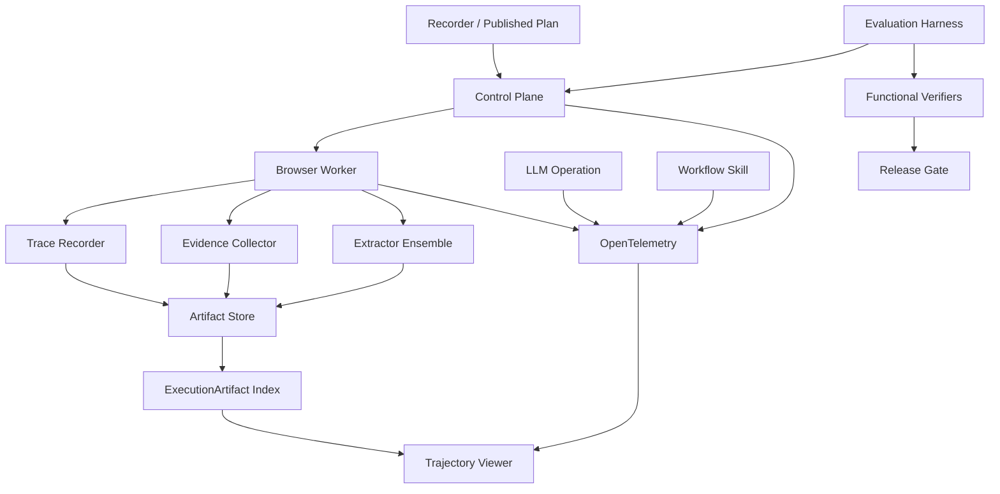

# 浏览器执行 P2：追踪、证据治理与评测平台落地及检验设计

> 状态：Implementation Ready after P0/P1
>
> 优先级：P2
>
> 日期：2026-08-26
>
> 前置文档：
> - [总体设计](./browser-execution-contract-and-workflow-composition-design.md)
> - [P0 落地与检验设计](./browser-execution-p0-implementation-and-validation-design.md)
> - [P1 落地与检验设计](./browser-execution-p1-implementation-and-validation-design.md)

## 1. P2 结论

P2 不再增加浏览器与 LLM 的耦合，而是把 P0/P1 已形成的契约提升到生产级：

- 用 Playwright Trace 和结构化轨迹解释“实际发生了什么”。
- 用 OpenTelemetry 把 Browser、LLM Operation、Workflow Skill 串成可查询但仍相互独立的链路。
- 用持久 Artifact Store 替代临时文件目录作为长期证据来源。
- 用提取器组合与离线评测提升正文质量，但保留确定性降级。
- 用版本化任务集、功能验证器和回放机制防止行为回归。
- 用轨迹查看器帮助运维、开发和审核人员定位失败。

P2 的价值不是让系统“更聪明地猜”，而是让每次执行可解释、可度量、可复现、可治理。

## 2. 前置条件、范围与非目标

### 2.1 前置条件

- `BrowserRunOutputV2` 已成为新 Browser Skill 的默认结果。
- `ContentRefV1` 和 `OpsReportProjectionV1` 已稳定。
- Browser、LLM、Workflow 节点有独立 ResultRef。
- `ExecutionArtifact` 已能索引截图、HTML、snapshot 和报告。
- Recorder 不会隐式创建 LLM 节点。
- P0/P1 的端到端门禁连续通过。

### 2.2 P2 范围

- Playwright trace 的启停、切片、上传和索引。
- 统一浏览器轨迹事件 `BrowserTrajectoryV1`。
- OpenTelemetry span、event、link 和指标。
- Artifact Store 抽象、对象存储适配、完整性和生命周期。
- Artifact ACL、加密、删除、审计和 legal hold。
- 高级正文提取 fallback 与离线质量选择。
- WebArena/WorkArena/BrowserGym 思路的内部任务集。
- 功能验证器、回放、差异比较和发布 Gate。
- Recorder/Execution Detail 的轨迹查看器。
- 性能、成本、采样和容量设计。

### 2.3 非目标

- 任意网站的大规模爬虫平台。
- 自动破解验证码或绕过访问控制。
- 允许模型动态生成并执行未审核脚本。
- 用视觉相似度替代业务正确性验证。
- 以 Trace 作为唯一业务结果。
- 永久保存所有执行的全部证据。
- 在 P2 重写现有 Scheduler 或 Temporal 工作流模型。

## 3. 参考实现与取舍

总体设计已经给出论文和开源项目依据，P2 将其转化为工程取舍：

| 参考 | 采用部分 | 不直接照搬部分 |
| --- | --- | --- |
| Playwright Trace Viewer | trace.zip、网络/DOM/截图时间线、步骤定位 | 不把 trace 当业务契约 |
| OpenTelemetry | trace/span/link、语义属性、采样 | 不把完整正文写入 telemetry |
| Mozilla Readability | 文章主内容提取 | 不用于应用控制台的唯一提取器 |
| Trafilatura | 复杂正文和 metadata fallback | 不放进 P1 的同步关键路径 |
| WebArena | 可复现任务、功能性 evaluator | 不直接依赖公网和其完整环境 |
| WorkArena | 企业应用任务、角色化场景 | 使用内部脱敏应用 fixture |
| BrowserGym | 统一任务接口与轨迹评测 | 不引入其 Agent 决策层 |

原则：学习其评测和可观测结构，不改变本系统“确定性工作流 + 明确契约 + 显式后处理”的核心。

## 4. P2 目标架构



数据面分为三类：

1. 业务结果：ResultRef、声明输出、报告。
2. 证据 Artifact：截图、HTML、snapshot、trace、提取正文。
3. Telemetry：span、metric、event，只保存低基数 metadata 和引用。

三者互相引用，但不能互相替代。

## 5. BrowserTrajectoryV1

### 5.1 契约位置

继续扩展公共浏览器契约包：

```text
packages/backend-contracts/browser-execution-contract/src/
  browser-trajectory-v1.types.ts
  trace-index-v1.types.ts
  artifact-retention-v1.types.ts
  evaluation-result-v1.types.ts
  schemas/
    browser-trajectory-v1.schema.json
    trace-index-v1.schema.json
    evaluation-result-v1.schema.json
```

### 5.2 轨迹结构

```ts
export interface BrowserTrajectoryV1 {
  schemaVersion: 'browser-trajectory/v1';
  executionId: string;
  runtimeSessionId: string;
  planDigest: string;
  startedAt: string;
  endedAt: string;
  events: BrowserTrajectoryEventV1[];
  traceIndexRef?: {
    resultRefId: string;
    artifactIds: string[];
  };
}

export interface BrowserTrajectoryEventV1 {
  sequence: number;
  timestamp: string;
  monotonicOffsetMs: number;
  type:
    | 'session.started'
    | 'page.opened'
    | 'page.closed'
    | 'step.started'
    | 'step.completed'
    | 'step.failed'
    | 'step.reconciled'
    | 'loop.iteration.started'
    | 'loop.iteration.completed'
    | 'branch.selected'
    | 'artifact.created'
    | 'content.extracted'
    | 'takeover.started'
    | 'takeover.completed'
    | 'session.completed';
  stepId?: string;
  nodeId?: string;
  pageId?: string;
  loop?: { loopId: string; iteration: number };
  branch?: { branchId: string; selectedCase: string };
  status?: string;
  data?: Record<string, unknown>;
}
```

### 5.3 轨迹约束

- `sequence` 在单次 runtime session 内严格递增。
- `monotonicOffsetMs` 用于排序，墙钟时间只用于跨系统关联。
- event data 不含完整 DOM、HTML、正文、截图 base64 或凭据。
- 大数据只通过 ResultRef/Artifact 引用。
- 每个 step 必须最多有一个 terminal event。
- reconciliation 使用独立事件，不覆盖原 failure。
- takeover 前后的事件必须可区分自动动作与人工动作。
- branch、loop 必须保留结构身份，不只展开为平面 step。

### 5.4 BrowserRunOutputV2 扩展

```ts
interface BrowserRunOutputV2 {
  // existing fields...
  trajectory?: {
    schemaVersion: 'browser-trajectory/v1';
    resultRefId: string;
    eventCount: number;
    traceAvailable: boolean;
  };
}
```

轨迹缺失不能让已经成功的业务执行变失败，但必须产生 `TRAJECTORY_INCOMPLETE` warning。对于 audit profile，可以通过发布策略将轨迹完整性设为强制门禁。

## 6. Playwright Trace 落地

### 6.1 文件拆分

```text
apps/backend/runtimes/browser-worker/src/modules/browser/trace/
  browser-trace-orchestrator.service.ts
  playwright-trace.adapter.ts
  browser-trace-chunk.service.ts
  browser-trace-index.service.ts
  browser-trajectory-writer.service.ts
  browser-trajectory-validator.service.ts
  trace-redaction.service.ts
  trace.types.ts
```

`playwright-cli.adapter.ts` 只暴露 context/page 句柄和动作生命周期 hook，不承载 trace 编排。

### 6.2 采集级别

```ts
type TraceLevel = 'off' | 'failure' | 'sampled' | 'full';
```

| 级别 | 行为 | 推荐场景 |
| --- | --- | --- |
| `off` | 不启动 trace | 敏感环境或极低成本任务 |
| `failure` | 环形保留，失败时提交 | 默认生产任务 |
| `sampled` | 按采样规则提交 | 质量监控 |
| `full` | 全程提交 | 调试、审计、基准任务 |

### 6.3 生命周期

```text
browser context created
  -> tracing.start
  -> optional startChunk per phase/iteration
  -> execute actions
  -> stopChunk to temporary explicit path
  -> redact/index/hash
  -> upload Artifact Store
  -> persist ExecutionArtifact
  -> tracing.stop
  -> cleanup temporary file
```

异常规则：

- Worker 崩溃后，由启动清理任务识别孤儿临时文件。
- Artifact 上传失败时保留本地临时文件到短 TTL，并进入异步补偿队列。
- trace stop 失败不覆盖原始业务错误。
- full trace 达到大小上限时停止新 chunk，记录 `TRACE_LIMIT_REACHED`。
- 每个 chunk 必须关联 executionId、step 范围、pageId 列表和 sha256。

### 6.4 TraceIndexV1

```ts
export interface TraceIndexV1 {
  schemaVersion: 'trace-index/v1';
  executionId: string;
  chunks: Array<{
    chunkId: string;
    artifactId: string;
    sha256: string;
    sizeBytes: number;
    firstSequence: number;
    lastSequence: number;
    stepIds: string[];
    pageIds: string[];
    redactionVersion: string;
  }>;
  incomplete: boolean;
  warnings: string[];
}
```

### 6.5 脱敏

Trace 可能包含网络、DOM 和输入值，因此上传前必须：

- 对 password 类型输入打码。
- 对配置的敏感 selector 打码。
- 对请求头中的 authorization、cookie、API key 脱敏。
- 对 URL query 中的敏感键脱敏。
- 禁止记录 localStorage/sessionStorage 的值。
- 支持域名和页面级 `traceLevel=off`。
- 记录 `redactionVersion`，便于审计脱敏策略。

由于 trace.zip 是复合压缩格式，P2 实施前必须验证 Playwright 版本是否支持安全的源头脱敏。无法可靠脱敏的敏感场景必须禁用 trace，不能先上传再清理。

## 7. Artifact Store

### 7.1 抽象接口

```ts
export interface ArtifactStore {
  put(input: PutArtifactInput): Promise<StoredArtifact>;
  head(key: string): Promise<ArtifactMetadata | null>;
  getAuthorizedUrl(input: AuthorizedReadInput): Promise<string>;
  delete(key: string): Promise<void>;
  applyRetention(key: string, policy: ArtifactRetentionV1): Promise<void>;
}
```

新增包或基础设施模块：

```text
apps/backend/execution-control/control-plane/src/modules/artifact-store/
  artifact-store.port.ts
  artifact-store.service.ts
  local-artifact-store.adapter.ts
  s3-compatible-artifact-store.adapter.ts
  artifact-key.factory.ts
  artifact-access.service.ts
  artifact-retention.service.ts
  artifact-integrity.service.ts
  artifact-cleanup.worker.ts
```

### 7.2 对象键

禁止使用未经净化的 URL 或用户文件名作为对象键。推荐：

```text
tenant/{tenantHash}/project/{projectHash}/yyyy/mm/dd/
execution/{executionId}/artifact/{artifactId}/{sha256}.{extension}
```

数据库继续以 `ExecutionArtifact` 作为索引，存储 provider、objectKey、sha256、size、retention 和 encryption metadata。公开 API 不暴露永久对象地址，只返回短期授权地址或代理下载地址。

### 7.3 Artifact 类型

P2 统一枚举：

- `browser.screenshot`
- `browser.html`
- `browser.snapshot`
- `browser.trace`
- `browser.trajectory`
- `browser.content`
- `workflow.report`
- `evaluation.diff`
- `evaluation.video`

### 7.4 完整性与幂等

- 上传前和上传后校验 sha256。
- 相同 executionId、artifact role、sha256 的重复上传复用记录。
- 相同内容跨执行是否去重由租户策略决定，默认不跨租户去重。
- `ExecutionArtifact` 状态建议增加 `pending|available|corrupt|deleted|expired`。
- Artifact 尚未 available 时，BrowserRunOutput 仍可返回 pending 引用，但 UI 必须显示处理中。

### 7.5 生命周期策略

```ts
export interface ArtifactRetentionV1 {
  schemaVersion: 'artifact-retention/v1';
  policy: 'ephemeral' | 'standard' | 'audit' | 'legal_hold';
  expiresAt?: string;
  allowUserDelete: boolean;
  encryptionClass: 'platform' | 'tenant_managed';
}
```

推荐默认值：

| Artifact | ephemeral | standard | audit |
| --- | --- | --- | --- |
| Screenshot | 24h | 30d | 180d |
| HTML | 24h | 14d | 180d |
| Snapshot | 24h | 30d | 180d |
| Trace | 24h | 7d | 90d |
| Content | 24h | 30d | 180d |
| Report | 7d | 180d | 按审计策略 |

实际 TTL 由组织安全和合规策略覆盖。

### 7.6 删除与 legal hold

- 删除执行记录时发出 Artifact 删除请求，不直接同步删除大对象。
- Cleanup Worker 幂等执行并写审计事件。
- legal hold 阻止 TTL 和用户删除。
- 删除后下载返回明确的 `ARTIFACT_DELETED`，不回退到临时 worker URL。
- 数据库索引保留最小墓碑信息：artifactId、类型、删除时间、原因和审计人。

### 7.7 从临时目录迁移

迁移阶段：

1. 双写 worker 临时目录与 Artifact Store。
2. 后台校验数量、大小和 sha256。
3. 新执行读取 Artifact Store，失败时短期回退 worker endpoint。
4. 关闭新执行的本地永久读取。
5. 保留临时目录短 TTL 和补偿机制。

不得一次性删除现有 `temp/playwright-cli-artifacts`。清理只能针对已验证上传且超过 TTL 的显式文件。

## 8. OpenTelemetry 设计

### 8.1 Trace 拓扑

```text
execution.run                      root span
  execution.node browser          Browser Skill node
    browser.session
      browser.step                one per logical step/iteration
      browser.reconcile
      browser.content.extract
      artifact.upload
  execution.node projection
  execution.node llm_operation
  execution.node workflow_skill
```

Temporal Activity、跨服务消息或异步工作流不能总是使用父子 span；此时使用 span link 关联同一 executionId/nodeId/attempt。

### 8.2 语义属性

低基数属性：

```text
ops.execution.id
ops.execution.attempt
ops.node.id
ops.node.type
ops.skill.id
ops.skill.release_id
browser.runtime.backend
browser.step.kind
browser.step.status
browser.capture.profile
browser.reconciliation.outcome
artifact.type
artifact.status
llm.operation.id
llm.operation.version
workflow.skill.id
```

高基数或敏感信息不能作为 metric label：

- 完整 URL。
- selector。
- 页面标题。
- 错误 message 原文。
- prompt、HTML、正文。
- 用户输入值。

这些信息可以作为受控事件字段的哈希、分类码或 ResultRef 引用。

### 8.3 指标

```text
browser_execution_total{status,backend}
browser_step_duration_ms{kind,status}
browser_step_failure_total{kind,error_code}
browser_reconciliation_total{outcome}
browser_content_extraction_duration_ms{method,profile}
browser_content_quality{method,profile,bucket}
browser_artifact_upload_bytes{type,status}
browser_trace_bytes{level,status}
execution_post_processing_total{node_type,status}
evaluation_task_total{suite,status}
```

URL、skillId、executionId 不进入 metric label，避免高基数爆炸；需要单执行查询时使用 trace/log 索引。

### 8.4 日志关联

所有相关服务结构化日志包含：

```text
traceId, spanId, executionId, nodeId, attempt, runtimeSessionId
```

日志只记录错误分类、warning code 和引用。原始浏览器 console/network 日志作为受控 Artifact，不能散落在普通服务日志。

### 8.5 采样

建议：

- failed/recovered/partial：100% trace telemetry。
- audit profile：100%。
- 普通成功：默认 5%，按租户和 Skill 配置。
- benchmark：100%。
- Artifact trace.zip 与 OTel 采样独立配置。

采样决策要在 root execution 建立时确定并传播，避免服务各自随机采样导致链路断裂。

## 9. 高级正文提取 fallback

### 9.1 动机

P1 的内置同步提取优先保证可预测和低延迟。P2 为低置信度内容增加可选的高级提取器，例如 Trafilatura，但不替换 P1 主路径。

### 9.2 架构

```text
P1 extractor result
  confidence >= threshold -> accept
  confidence < threshold
    -> enqueue advanced extraction
    -> isolated extractor worker
    -> compare candidates
    -> publish new ContentRef revision
```

新增：

```text
apps/backend/capabilities/browser-domain/content-extraction/
  advanced-content-extraction.port.ts
  trafilatura-extractor.adapter.ts
  extraction-candidate-ranker.service.ts
  extraction-revision.service.ts
  extraction-evaluation.service.ts
```

高级提取器建议运行在隔离容器/worker 中，避免 Python 依赖进入 browser-worker 主镜像。

### 9.3 ContentRef 修订

不原地修改 P1 ContentRef。新增：

```ts
interface ContentRevisionV1 {
  contentId: string;
  revision: number;
  parentResultRefId?: string;
  resultRefId: string;
  extractor: string;
  extractorVersion: string;
  qualityScore: number;
  selected: boolean;
}
```

冻结的组合计划默认消费浏览器节点终态时选定的 revision。后到达的异步高级结果不会改变已启动 LLM 节点；人工重新分析可明确选择新 revision。

### 9.4 候选选择

候选排序必须基于确定性特征：

- 标题一致性。
- 主体文本长度区间。
- 导航/链接占比。
- 段落完整性。
- 语言一致性。
- 关键实体覆盖。
- fixture golden 的离线回归得分。

不得在线调用 LLM 来决定哪个提取结果正确，否则正文采集本身会变成隐式模型工作流。

## 10. 评测平台

### 10.1 目标

评测不只检查“点击函数返回 success”，而要检查业务后置条件、输出契约、证据和副作用。

内部基准借鉴 WebArena、WorkArena 和 BrowserGym 的任务抽象：

```ts
export interface BrowserEvaluationTaskV1 {
  taskId: string;
  suite: string;
  version: string;
  fixtureEnvironment: string;
  initialStateRef: string;
  skillReleaseId: string;
  inputs: Record<string, unknown>;
  verifier: FunctionalVerifierV1;
  expectedArtifacts?: string[];
  budget: {
    timeoutMs: number;
    maxSteps: number;
    maxArtifactBytes: number;
  };
}
```

### 10.2 测试套件

至少建设：

| Suite | 覆盖 |
| --- | --- |
| `navigation-core` | URL 归一、重定向、SPA、超时 reconciliation |
| `interaction-core` | click/input/select/upload/download |
| `control-flow` | 条件、循环、break、no-progress |
| `multi-page` | popup、tab、关闭、页面身份 |
| `content-extraction` | article/application/audit、中文、表格 |
| `ops-report` | 成功、失败、partial、报告重试 |
| `security` | prompt injection、秘密脱敏、权限隔离 |
| `artifact-resilience` | 上传失败、校验失败、TTL、恢复 |
| `compatibility` | legacy/V2、旧草稿、旧 release |

### 10.3 Fixture 环境

- 使用版本化、可重置的内部 Web 应用。
- 数据种子固定且可验证。
- 每个任务前恢复初态。
- 禁止把公网实时网站作为发布阻断测试。
- 可另设非阻断公网 canary，用于浏览器兼容趋势。
- Fixture 镜像、种子和 task definition 一起版本化。

### 10.4 功能验证器

```ts
type FunctionalVerifierV1 =
  | { type: 'url'; expected: string; normalization: string }
  | { type: 'dom'; selector: string; assertion: string; expected: unknown }
  | { type: 'api_state'; endpoint: string; jsonPath: string; expected: unknown }
  | { type: 'database_state'; queryId: string; expectedDigest: string }
  | { type: 'output_schema'; schemaDigest: string }
  | { type: 'artifact'; role: string; minCount: number }
  | { type: 'composite'; all: FunctionalVerifierV1[] };
```

优先级：

1. 后端/API/数据库状态。
2. 输出 Schema 和声明值。
3. DOM 语义状态。
4. URL。
5. 截图视觉差异只作为辅助信号。

这直接避免最初问题中 `navigate` verifier 只看旧 observation 而产生误判。

### 10.5 评测结果

```ts
export interface EvaluationResultV1 {
  schemaVersion: 'browser-evaluation-result/v1';
  taskId: string;
  taskVersion: string;
  skillReleaseId: string;
  executionId: string;
  status: 'pass' | 'fail' | 'infra_error';
  score: number;
  verifierResults: Array<{
    type: string;
    status: 'pass' | 'fail' | 'unknown';
    evidenceRefs: string[];
  }>;
  metrics: {
    durationMs: number;
    stepCount: number;
    retryCount: number;
    artifactBytes: number;
    modelCalls: number;
  };
  trajectoryRef?: string;
  diffArtifactId?: string;
}
```

`infra_error` 不计为任务能力失败，但超过阈值必须让评测批次无效，不能自动当作通过。

### 10.6 回归比较

比较基线 release 与候选 release：

- 任务通过率。
- recovered 比例。
- P50/P95 耗时。
- 步骤和重试数量。
- Artifact 字节数。
- 正文质量分布。
- 轨迹完整率。
- LLM 调用次数和预算。

推荐 Gate：

- 核心套件 100% 通过。
- 全量套件成功率下降不超过 1 个百分点。
- P95 耗时不恶化超过 15%。
- Artifact P95 不增长超过 25%，除非有批准的契约变化。
- 未配置后处理的任务模型调用数必须为 0。

### 10.7 回放

P2 支持两类回放：

1. 证据回放：只读取轨迹、snapshot、HTML 和 trace，不执行副作用。
2. Fixture 重执行：在可重置环境中重新执行冻结计划。

禁止把生产执行直接自动重放到生产系统。任何有副作用的重执行必须使用测试环境或人工批准的安全策略。

## 11. 轨迹查看器

### 11.1 UI 目标

从执行详情可以按时间查看：

- 节点和 step 状态。
- 页面切换。
- 条件分支和循环 iteration。
- 动作前后 screenshot/snapshot/URL。
- 原始 failure 与 reconciliation 结果。
- 内容提取方法和置信度。
- Artifact 上传状态。
- LLM/Workflow 节点链接。

### 11.2 组件拆分

```text
apps/frontend/portal/src/features/executions/trajectory/
  BrowserTrajectoryPanel.tsx
  TrajectoryTimeline.tsx
  TrajectoryEventRow.tsx
  StepEvidenceDrawer.tsx
  PageIdentityBadge.tsx
  ReconciliationDiffView.tsx
  ArtifactPreviewPanel.tsx
  TraceViewerLauncher.tsx
  useBrowserTrajectory.ts
  trajectory.types.ts
```

不要继续扩展 Recorder Debug 大页面。Recorder Debug 和通用 Execution Detail 复用上述只读组件。

### 11.3 交互规则

- 默认只加载轨迹摘要，不预取 trace.zip。
- 点击 step 后按权限加载证据。
- HTML 默认以文本/沙箱预览，禁止直接执行。
- Screenshot 可以对比前后状态。
- failure 和 recovered 同时展示，不能只显示最终绿色状态。
- LLM/Workflow 只显示节点摘要和链接，不把其日志混进浏览器 step。
- Artifact 已过期时显示 metadata 和过期原因。

### 11.4 Trace Viewer 集成

优先使用受控的 Playwright Trace Viewer 部署或离线打开方式。必须：

- 下载前鉴权。
- 使用短期 URL。
- 在隔离 origin 中展示。
- 设置严格 CSP。
- 不允许 trace 内容访问 Portal token。
- 显示 trace 的脱敏版本和保留期限。

## 12. 成本与容量治理

### 12.1 成本模型

每次执行记录：

```text
screenshotBytes
htmlBytes
snapshotBytes
traceBytes
contentBytes
reportBytes
artifactUploadCount
artifactDownloadCount
retentionClass
llmInputTokens
llmOutputTokens
```

成本聚合以 tenant/project/skill/day 为维度，但 metric label 不直接携带高基数 ID，使用离线账单表或日志管道聚合。

### 12.2 限额

建议默认：

| 项目 | 默认上限 |
| --- | --- |
| 单 screenshot | 10 MB |
| 单 HTML | 20 MB |
| 单 snapshot | 10 MB |
| 单 trace chunk | 100 MB |
| 单执行 trace | 500 MB |
| 单正文 | 5 MB |
| 单执行 Artifact 总量 | 1 GB |

达到上限时：

- 优先停止可选 trace 和重复截图。
- 不删除已经产生的关键失败证据。
- 在 BrowserRunOutput warnings 中记录被跳过的 Artifact。
- audit profile 超限按策略失败或进入人工处理，不能静默截断关键证据。

### 12.3 背压

- Artifact 上传使用有界并发。
- 大 Artifact 采用流式上传，避免全部驻留内存。
- 上传队列过载时按 trace -> 重复截图 -> HTML 的可选级别降级。
- 业务结果 ResultRef 优先级高于可选 trace。
- Cleanup、迁移和高级提取任务使用独立队列，避免阻塞浏览器执行。

## 13. 安全与合规

### 13.1 权限模型

Artifact 读取同时校验：

- tenant。
- project。
- execution read permission。
- artifact sensitivity。
- retention/legal hold 状态。
- 请求者角色。

报告工作流只得到计划 binding 允许的 Artifact 引用，不得到浏览器 session 凭据。

### 13.2 加密

- 传输使用 TLS。
- 对象存储服务端加密默认开启。
- 敏感租户支持 tenant-managed key metadata。
- 签名 URL 短期有效且不可跨 Artifact。
- 数据库不保存长期可公开下载 URL。

### 13.3 审计

记录：

- Artifact 创建、读取、下载、删除。
- retention 变更。
- legal hold 设置/解除。
- trace level 变更。
- benchmark 生产数据访问尝试。
- 人工回放和重新执行。

### 13.4 内容安全

- HTML 和 trace 视为主动不可信内容。
- Portal 预览必须 sandbox。
- 高级提取 worker 禁止访问内部 metadata 服务。
- 提取器依赖和镜像需要软件供应链扫描。
- 公网 URL 继续使用现有 SSRF 和 action policy；P2 不放宽网络边界。

## 14. Feature Flags 与配置

```text
BROWSER_TRAJECTORY_V1_ENABLED=false
BROWSER_PLAYWRIGHT_TRACE_LEVEL=off
BROWSER_TRACE_UPLOAD_ENABLED=false
ARTIFACT_STORE_V2_ENABLED=false
ARTIFACT_STORE_DUAL_WRITE=true
ARTIFACT_RETENTION_WORKER_ENABLED=false
OTEL_BROWSER_SEMANTICS_ENABLED=false
ADVANCED_CONTENT_EXTRACTION_ENABLED=false
BROWSER_EVALUATION_HARNESS_ENABLED=false
BROWSER_TRAJECTORY_VIEWER_ENABLED=false
```

租户级策略：

```ts
interface BrowserEvidencePolicyV1 {
  traceLevel: TraceLevel;
  retention: ArtifactRetentionV1;
  maxArtifactBytesPerExecution: number;
  allowAdvancedExtraction: boolean;
  telemetrySampleRate: number;
}
```

服务端必须施加组织上限，不能完全信任 Recorder 或 Skill 输入。

## 15. 文件级实施清单

### 15.1 新增

| 模块 | 目录 | 职责 |
| --- | --- | --- |
| Contract | `browser-execution-contract/src/*trajectory*` | 轨迹和 TraceIndex Schema |
| Browser Worker | `browser-worker/src/modules/browser/trace/` | Trace/trajectory 采集 |
| Control Plane | `control-plane/src/modules/artifact-store/` | Store、ACL、TTL、完整性 |
| Content | `browser-domain/content-extraction/` | 高级提取和修订 |
| Evaluation | `control-plane/src/modules/evaluation/browser/` | 任务、执行、验证、Gate |
| Frontend | `portal/src/features/executions/trajectory/` | 轨迹查看器 |
| Infra | `packages/observability/browser-semantics/` | OTel 语义常量和 helper |

### 15.2 修改

| 文件/模块 | 修改 |
| --- | --- |
| browser-worker session lifecycle | trace hook 与 trajectory writer |
| browser result materializer | trajectory/trace refs |
| `ExecutionArtifact` Prisma model | provider/objectKey/status/retention metadata |
| execution detail API | 轨迹摘要和授权 Artifact URL |
| deterministic scheduler | span/link 传播和评测 metadata |
| LLM operation runtime | 节点 link 与 token 指标 |
| workflow skill runtime | 节点 link 与报告 Artifact 指标 |
| Recorder Debug | 复用只读轨迹面板 |

### 15.3 数据库迁移建议

若现有字段不足，给 `ExecutionArtifact` 增加：

```text
provider
objectKey
status
retentionPolicy
expiresAt
encryptionClass
deletedAt
deleteReason
```

要求：

- 字段先可空。
- 先部署双写代码，再回填，再改变读取优先级。
- 不在同一次发布中强制非空。
- Prisma migration 必须有前向和回滚操作说明。
- 迁移验证通过 `./docker/start-smart.sh` 启动的数据库环境执行。

### 15.4 复杂度门禁

- trace、Artifact、evaluation 必须分别成模块。
- 不把 Artifact Store SDK 调用写进 browser adapter。
- 不把 evaluation 分支写进生产 Scheduler 主流程；使用明确的 evaluation metadata 和 adapter。
- 单个业务 Service 超过 500 行优先拆分。
- 超过 800 行必须评估并记录拆分。
- 超过 1200 行的普通业务文件不允许新增。

## 16. 检验设计

### 16.1 Trajectory 契约测试

| 编号 | 场景 | 期望 |
| --- | --- | --- |
| T-01 | sequence 连续递增 | 通过 |
| T-02 | 重复 terminal event | validator 拒绝 |
| T-03 | step.completed 无 stepId | 拒绝 |
| T-04 | reconciliation 覆盖 failure | 测试失败 |
| T-05 | loop event 无 iteration | 拒绝 |
| T-06 | event data 含完整 HTML | sanitizer/validator 拒绝 |
| T-07 | legacy output 无 trajectory | 兼容通过 |
| T-08 | TraceIndex chunk 范围重叠 | 按规则拒绝或告警 |

### 16.2 Playwright Trace 测试

| 编号 | 场景 | 期望 |
| --- | --- | --- |
| PT-01 | success + failure level | 不提交 trace |
| PT-02 | failed + failure level | 提交 trace |
| PT-03 | full 多页面 | chunk 包含 pageIds |
| PT-04 | loop 多 iteration | chunk 范围可定位 |
| PT-05 | trace 达上限 | 停止采集并 warning |
| PT-06 | stop 失败 | 原业务状态不被覆盖 |
| PT-07 | 上传暂时失败 | 本地短 TTL + 补偿 |
| PT-08 | password 输入 | trace 不含明文 |
| PT-09 | authorization header | trace 不含明文 |
| PT-10 | worker crash | 孤儿文件被安全清理 |

### 16.3 Artifact Store 契约测试

所有 adapter 使用同一套 contract tests：

| 编号 | 场景 | 期望 |
| --- | --- | --- |
| AS-01 | put/head/get | metadata 一致 |
| AS-02 | sha256 错误 | 状态 corrupt |
| AS-03 | 重复幂等上传 | 不产生重复有效记录 |
| AS-04 | 跨租户读取 | 拒绝 |
| AS-05 | 签名 URL 到期 | 无法读取 |
| AS-06 | TTL 到期 | cleanup 删除并留墓碑 |
| AS-07 | legal hold | cleanup 不删除 |
| AS-08 | 删除重试 | 幂等 |
| AS-09 | provider 中断 | pending 并可补偿 |
| AS-10 | 双写不一致 | 校验任务告警 |

### 16.4 OpenTelemetry 测试

| 编号 | 场景 | 期望 |
| --- | --- | --- |
| OT-01 | Browser -> LLM | 有 node span link |
| OT-02 | Browser -> Workflow | executionId 一致 |
| OT-03 | retry | attempt 可区分 |
| OT-04 | Temporal 异步边界 | 上下文或 link 保留 |
| OT-05 | 成功采样关闭 | 不产生详细 span |
| OT-06 | failed | 100% 采样 |
| OT-07 | metrics label | 不含 URL/executionId |
| OT-08 | logs | 含 traceId 且无正文 |

### 16.5 高级提取测试

| 编号 | 场景 | 期望 |
| --- | --- | --- |
| AE-01 | P1 高置信度 | 不调用高级提取 |
| AE-02 | P1 低置信度 | 异步产生候选 |
| AE-03 | 高级候选更优 | 创建新 revision |
| AE-04 | 高级候选更差 | 保留原 selected |
| AE-05 | 已启动 LLM | 不切换其输入 revision |
| AE-06 | 提取 worker 超时 | P1 内容仍可用 |
| AE-07 | 恶意 HTML | 隔离 worker 无内网访问 |
| AE-08 | 同 fixture 多次 | 选择结果确定一致 |

### 16.6 Evaluation Harness 测试

| 编号 | 场景 | 期望 |
| --- | --- | --- |
| EV-01 | 初态重置 | 每次任务数据一致 |
| EV-02 | API verifier | 验证真实后端状态 |
| EV-03 | URL 已到但状态未变 | 任务失败 |
| EV-04 | navigate 报错但目标已达 | reconciliation 后通过 |
| EV-05 | Artifact 缺失 | verifier 失败 |
| EV-06 | fixture 宕机 | infra_error，不算能力失败 |
| EV-07 | infra_error 超阈值 | 批次无效 |
| EV-08 | 候选回归 | Gate 阻断 |
| EV-09 | 零后处理任务 | modelCalls=0 |
| EV-10 | 生产重放请求 | 默认阻止 |

### 16.7 UI 测试

- 时间线顺序与 trajectory sequence 一致。
- branch/loop 分组正确。
- failure 与 recovered 同时显示。
- Artifact 权限错误不泄露 objectKey。
- trace.zip 不自动下载。
- HTML sandbox 无脚本执行。
- Artifact expired/deleted/pending 状态清晰。
- Recorder Debug 与 Execution Detail 使用同一轨迹解释。

### 16.8 混沌与恢复测试

- Artifact Store 5xx、超时、慢上传。
- Browser Worker 在 trace chunk 中途退出。
- Control Plane 在 Artifact 索引写入前后退出。
- OTel Collector 不可用。
- 高级提取队列积压。
- Cleanup Worker 重复消费。
- 对象已上传但 DB 未提交。
- DB 已提交但对象不存在。

业务原则：Telemetry 故障不阻塞执行；证据上传故障按 profile 区分 warning 或失败；ResultRef 写入失败仍按 P0 的契约门禁处理。

### 16.9 负载测试

基准至少覆盖：

- 100 个并发短执行。
- 20 个并发 full trace 长执行。
- 1000 个小 Artifact 批量索引。
- 10 GB/day cleanup 模拟。
- 轨迹 10,000 events 的查看器加载。

初始目标：

| 指标 | 目标 |
| --- | --- |
| trajectory writer 每事件 P95 | <= 2 ms |
| Artifact 索引写入 P95 | <= 100 ms |
| 100 MB trace 流式上传内存增量 | <= 32 MB |
| execution detail 摘要 P95 | <= 500 ms |
| 10k event UI 首屏 | <= 2 s |
| OTel collector 故障业务影响 | 0 个执行失败 |

## 17. 端到端验收场景

### 17.1 原始 navigate 误判场景

执行原始目标 URL 场景并注入 navigation response wait 超时。

验收：

- step 原始错误保留。
- reconciliation 读取到正确 URL 和页面内容。
- Browser 节点标记 recovered。
- trajectory 显示 failed -> reconciled。
- trace 能定位 navigation 和页面最终状态。
- functional verifier 通过，而不是凭旧 observation 失败。

### 17.2 正文分析场景

验收：

- 轨迹包含 content.extracted，但不含正文。
- 正文和原始 HTML 是不同 Artifact/ResultRef。
- LLM span 通过 link 关联 Browser 节点。
- 关闭后处理后 modelCalls 精确为 0。
- 高级提取生成 revision 时不改变已完成分析。

### 17.3 多页面运维报告场景

验收：

- 每个页面和循环 iteration 可在轨迹查看器定位。
- 关键 evidence 已进入持久 Store。
- 报告 Artifact 可从 Workflow 节点访问。
- Browser、Projection、Workflow span 独立且相关联。
- 只重试报告时没有新增浏览器 trace。

### 17.4 Artifact 故障场景

注入对象存储 5xx：

- standard profile 的可选 trace 进入 pending/warning。
- 核心 ResultRef 和浏览器结果仍返回。
- audit profile 按配置进入 partial/failed。
- 恢复后补偿上传并更新索引。
- 重试不创建重复 Artifact。

## 18. 验证命令

实施时以实际 package scripts 为准，至少运行：

```bash
pnpm --filter @ops/backend-contracts-browser-execution-contract test
pnpm --filter @ops/browser-worker test
pnpm --filter @ops/control-plane test
pnpm --filter @ops/ai-orchestrator test
pnpm --filter @ops/portal test
pnpm typecheck
```

数据库、对象存储和跨服务验证必须从仓库根目录通过统一入口：

```bash
./docker/start-smart.sh docker-compose.base.yml up -d
./docker/start-smart.sh docker-compose.base.yml up -d browser-worker
./docker/start-smart.sh docker-compose.base.yml up -d control-plane
```

如增加 Prisma 字段：

```bash
pnpm --filter @ops/control-plane exec prisma generate
pnpm exec prisma format
```

不直接执行裸 `docker compose`。验证前确认 `PROJECT_ROOT` 与 `${PROJECT_ROOT}` 挂载。

## 19. 发布阶段

### 19.1 阶段 A：只写轨迹摘要

- 开启 BrowserTrajectoryV1。
- 不采集 trace.zip。
- 检查事件完整率、开销和敏感字段。

### 19.2 阶段 B：Artifact Store 双写

- local 与对象存储双写。
- 后台比对 count/size/sha256。
- 读取仍以旧路径为主。

### 19.3 阶段 C：失败 Trace

- 内部和指定租户启用 failure level。
- 验证脱敏、补偿、TTL 和 Viewer。
- 审计场景暂不默认 full。

### 19.4 阶段 D：评测 Gate

- 先只生成报告。
- 稳定后阻断 Browser Runtime/契约相关 release。
- Gate 配置和例外必须审计。

### 19.5 阶段 E：高级提取与 full trace

- 只对低置信度正文开启高级提取。
- full trace 仅用于调试、基准和明确审计策略。
- 基于成本数据调整默认 TTL 和采样。

## 20. 发布门禁

P2 上线前必须满足：

- P0/P1 所有门禁持续通过。
- Trajectory Schema、sequence 和 terminal 规则通过。
- Trace 脱敏专项测试通过。
- Artifact Store 双写校验至少连续 7 天无未解释差异。
- legal hold、TTL、删除和权限测试通过。
- OTel 不包含正文、URL、secret 等禁止字段。
- Collector 故障不影响业务执行。
- 核心 benchmark 全部通过。
- 原始 navigate 误判回归任务稳定通过。
- 性能和容量目标满足。
- UI sandbox 与短期下载 URL 安全检查通过。
- 数据库迁移和服务重启后确认实际加载新代码。

## 21. 回滚

回滚顺序：

1. 关闭 Viewer 新入口。
2. 停止 full/sampled trace，保留 trajectory 摘要。
3. 停止高级提取队列。
4. 将 Artifact 读取切回旧路径，但继续保留已上传对象。
5. 关闭 Artifact 双写。
6. 关闭 OTel 新语义，不停止核心执行。

约束：

- 不删除已产生的 Artifact。
- 不解除 legal hold。
- 不回滚已执行的 TTL 删除。
- 数据库新增字段保持兼容，不在紧急回滚中 drop column。
- 评测 Gate 可切回只报告模式，但必须记录原因和期限。

## 22. P2 完成定义

P2 完成必须同时满足：

- 一次浏览器执行可以用结构化轨迹解释完整生命周期。
- 失败、recovered、分支、循环和多页面均可定位到证据。
- Trace、截图、HTML、snapshot、正文和报告由持久 Artifact Store 治理。
- Artifact 有完整性、权限、TTL、删除和 legal hold 语义。
- Browser、LLM、Workflow 通过 telemetry 关联但仍保持独立节点契约。
- 正文高级提取不会隐式触发 LLM，也不会改变已冻结节点输入。
- 版本化基准可用功能验证器捕获真实业务回归。
- 原始 `navigate` 误判成为永久回归用例。
- 生产成本、采样、限额和故障降级可配置、可观测。
- P0/P1 的业务行为和兼容能力没有因生产化治理而退化。
