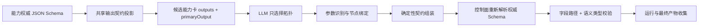

# 确定性规划输出契约解析标准

## 1. 背景与故障结论

用户请求“搜索 deekseek v4 flash 的新闻，并且进行总结，最后生成 MD 文件”在计划创建阶段失败：

```text
FINAL_OUTPUT_UNSATISFIED:
Final output field 'result' references output 'artifact_ref'
which is not in node 'n3_内置 Markdown 文件生成' output contract
```

根因不是 Markdown Skill 没有输出文件，而是规划器混淆了两个不同概念：

- `artifact`：运行时结果对象中的物理字段名，也就是可绑定的输出路径。
- `artifact_ref`：确定性计划类型系统中的语义类型，用于表达该字段的值是文件产物引用。

内置 Markdown Skill 的权威输出 Schema 声明字段 `artifact` 和 `artifacts`，旧组装器却把语义类型 `artifact_ref` 直接写入 `finalOutputs.fromNodeOutput`。控制面随后按物理路径查找，自然无法在输出契约中找到该字段。

此外，规划器和控制面原先各自实现一套 Schema 映射，并依赖 `artifact`、Skill ID、节点名包含 `md` 等启发式规则。这会让相同权威 Schema 在不同阶段得到不同结果，也是同类问题反复出现的系统性原因。

## 2. 标准模型

输出契约必须明确分成三层：

| 层次 | 示例 | 责任 |
| --- | --- | --- |
| 物理字段 | `artifact` | 运行时对象中的真实字段，可用于路径绑定 |
| 语义类型 | `artifact_ref` | 静态组合、最终产物和运行时类型校验 |
| 主输出 | `primaryOutput: artifact` | 多输出能力中用于最终结果的确定字段 |

标准计划应生成：

```json
{
  "outputContract": {
    "artifact": "artifact_ref",
    "artifacts": "json"
  },
  "finalOutputs": [
    {
      "targetField": "result",
      "fromNodeOutput": "artifact",
      "expectedType": "artifact_ref",
      "isArtifact": true
    }
  ]
}
```

禁止生成：

```json
{
  "fromNodeOutput": "artifact_ref"
}
```

除非能力的权威 Schema 确实定义了名为 `artifact_ref` 的物理字段。

## 3. 权威 Schema 扩展约定

能力发布方应在 JSON Schema 中显式声明语义类型和主输出：

```yaml
type: object
x-primary-output: artifact
properties:
  artifact:
    type: object
    x-value-type: artifact_ref
    properties:
      name: { type: string }
      url: { type: string }
      mimeType: { type: string }
  artifacts:
    type: array
```

支持以下等价元数据，便于不同能力注册来源接入：

- Schema 主输出：`primaryOutput`、`x-primary-output`、`xPrimaryOutput`。
- 字段语义类型：`valueType`、`semanticType`、`x-value-type`、`xValueType`。
- 字段级主输出：`primary: true` 或 `x-primary-output: true`。

新能力必须显式声明。已发布旧能力允许由兼容层识别标准 ArtifactRef 结构：对象同时具备 `name`、`url`、`mimeType` 字段时投影为 `artifact_ref`。兼容识别只解决迁移问题，不替代新契约的显式元数据。

## 4. 统一投影算法

共享包 `@ops/backend-deterministic-plan` 提供唯一的 Schema 投影与主输出解析实现。

投影顺序：

1. 使用字段显式语义元数据。
2. 对历史契约识别标准 ArtifactRef 对象结构。
3. 兼容既有 `results`、`searchResults`、`markdown_content` 契约。
4. JSON Schema 原子类型映射到 `string`、`number`、`boolean`。
5. 未声明语义的对象和数组映射为 `json`。

主输出解析顺序：

1. 使用权威 Schema 的显式主输出，且类型必须满足调用方要求。
2. 若调用方要求特定语义类型，只有唯一同类型字段时自动选择。
3. 普通值输出只有唯一字段时自动选择。
4. 多字段仍有歧义时拒绝规划，要求能力发布方声明主输出；不得依赖对象键顺序或猜字段名。

## 5. 端到端职责



- LLM 负责意图识别、能力选择和 DAG，不负责发明输出字段。
- 参数识别阶段只对选中能力的输入参数进行识别和补参。
- 组装器从候选卡的权威投影生成节点输出契约，并解析最终物理字段。
- 控制面冻结时从能力目录重新获取权威 Schema，使用同一共享函数覆盖规划器提交的契约。
- 最终输出校验只信任“真实字段存在且类型为 `artifact_ref`”，不再按 Skill ID、显示名或节点名猜测。

## 6. 本次落地

本次实现包含：

- 在共享确定性计划包新增 `projectOutputSchemaV1` 和 `resolvePrimaryOutputFieldV1`。
- 候选选择器分别处理输入参数摘要和输出契约投影，避免输入/输出类型逻辑混用。
- 两阶段契约组装器按主输出解析真实字段，不再硬编码 `artifact_ref` 字段名。
- 控制面冻结服务复用同一投影函数，消除双实现漂移。
- 控制面最终产物校验移除 Skill ID、平台前缀、节点名等启发式规则。
- Markdown Artifact Writer 升级到 `1.0.2`，显式声明 `x-primary-output` 与 `x-value-type`。
- 增加“搜索 → 总结 → Markdown 文件”三节点回归，以及显式元数据、历史结构兼容、契约驱动校验测试。

## 7. 发布与迁移

发布顺序：

1. 发布共享确定性契约包及引用它的 AI Orchestrator、Control Plane。
2. 重新部署 AI Orchestrator 和 Control Plane，确保二者使用相同投影版本。
3. Provision Markdown Artifact Writer `1.0.2`，使目录中的权威 Schema 带有显式元数据。
4. 对其他多输出能力补齐 `x-primary-output`；对结构化领域类型补齐 `x-value-type`。
5. 运行计划创建、冻结、执行和最终文件下载的端到端测试。

兼容策略：旧版 Markdown Skill 即使尚未 provision，仍可通过 ArtifactRef 结构识别正确投影为 `artifact: artifact_ref`；完成迁移后应以显式元数据为主。

## 8. 验收标准

- 请求“搜索新闻并总结，最后生成 MD 文件”生成三个节点。
- 最终节点输出契约包含 `artifact: artifact_ref`。
- `finalOutputs.fromNodeOutput` 等于 `artifact`，不是 `artifact_ref`。
- 控制面冻结后字段名和语义类型保持不变。
- Skill ID、显示名和节点 ID 全部改为无语义字符串时，只要权威契约不变，Artifact Skill 仍能通过验证。
- LLM Operation 即使伪造 `artifact_ref` 输出，也不能作为文件发布节点。
- 多个同类型输出且未声明主输出时，计划必须明确失败并提示发布方补全契约。

