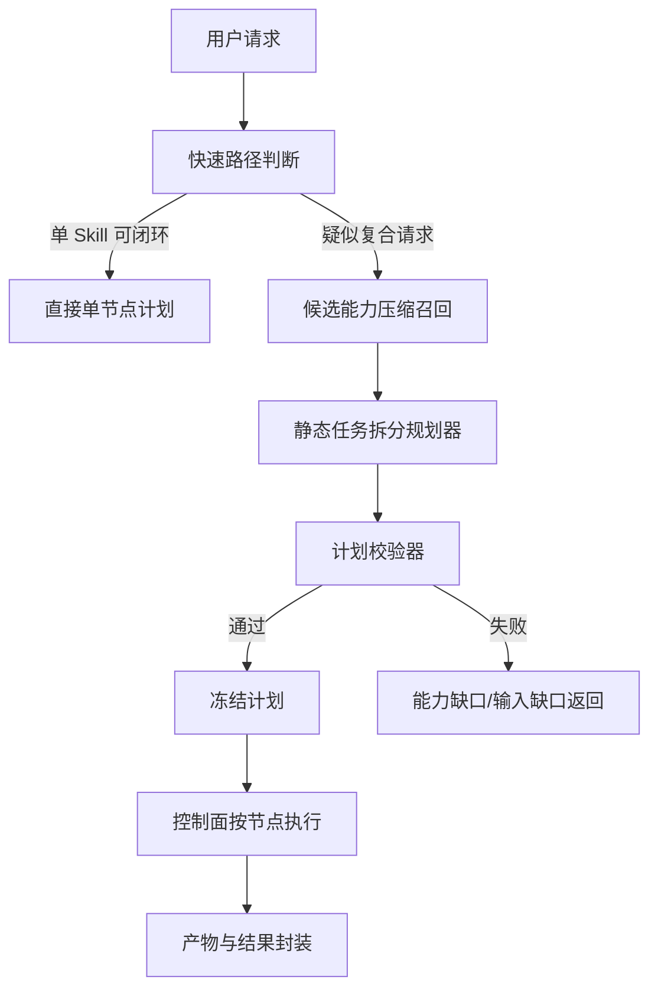

# 企业内确定性多步骤任务拆分设计方案

状态：Decision-updated Implementation Draft（已按 2026-07-29 内置能力决策更新）  
日期：2026-07-29  
适用阶段：Phase 1（固定流程优先）  
适用范围：企业内技能平台、AI 编排层、控制面执行层

## 0. 本次实态复核结论

本节记录 2026-07-28 对代码、数据库和 `full` Docker 运行环境的复核结果。后续如果本节与前文的“建议态”描述冲突，以本节、第 46～51 节为准。

### 0.1 已经落地的能力

| 能力 | 当前状态 | 真实落点 |
|---|---|---|
| 复合请求路由 | 已实现 | `planner/routing/plan-route-classifier.service.ts` |
| Skill 候选卡片 | 已实现 | `planner/candidate-selection/capability-candidate-selector.service.ts` |
| 静态计划生成 | 已实现 | `planner/deterministic/deterministic-plan-generator.service.ts` |
| 共享计划合同 | 已实现 | `packages/backend-contracts/deterministic-plan` |
| 计划二次校验、冻结和哈希 | 已实现 | Control Plane `plan-runtime` |
| 顺序节点调度与重启恢复 | 已实现 | `deterministic-plan-scheduler.service.ts`、`deterministic-plan-recovery.service.ts` |
| 受控 LLM Operation | 已实现 | AI Orchestrator `llm-operation` |
| 执行级 Artifact 索引 | 已实现 | `execution_artifacts` 与 `DeterministicFinalOutputService` |
| Chat 计划详情与失败事件 | 已实现 | `chat-orchestrator.service.ts` |
| Markdown 文件写入代码 | 已有实现雏形 | Document Domain `runtime-facade/markdown-artifact` |
| Markdown Document Runtime 分支 | 已实现 | `capability-release-document-runtime.service.ts` |

### 0.2 尚未闭环的能力

当前任务仍不能被认定为端到端完成，原因不是父计划调度器缺失，而是 Markdown Writer 的“运行代码 → 内置能力注册 → 部署/启用 → Planner 候选卡片”链路尚未闭合。

必须补齐：

1. 将 Markdown Writer 注册为正式内置能力，并完成版本化供给、部署、启用和审计；不要求经过普通 Capability Release 的正式校验、人工审批或发布领域服务。
2. 内置能力定义必须明确声明 `runtimeType=artifact`、`supportsArtifact=true` 和 `artifact_ref` 输出。
3. Platform 返回给 Planner 的用户可用 Skill 视图必须保留上述运行时元数据和可执行版本。
4. 当前 Markdown URL `/public/renders/...` 与 Document Domain 的静态目录挂载方式不一致；必须改为真实可访问的 `/renders/...`、下载 Controller 地址或对象存储 URL。
5. Markdown Writer 必须补齐输入校验、幂等、存储持久性和真实下载验证。
6. 必须增加使用真实已发布 Tavily Skill 和已部署 Markdown Writer 内置能力的端到端测试；现有 `deterministic-execution-e2e.test.ts` 只验证冻结落库，不代表三节点真实执行通过。
7. `DeterministicTaskExecutionService` 当前会把 Planner 的具体错误统一包装为 `PLANNER_OUTPUT_INVALID`；必须保留 `CAPABILITY_NOT_FOUND`、`FINAL_OUTPUT_UNSATISFIED` 等稳定错误码。
8. Control Plane 当前主要做结构、依赖、绑定和最终产物类型校验；还必须在冻结时依据受信任 Catalog Snapshot 二次校验 Skill 存在性、权限和版本。
9. 当前已计算并持久化 `planHash`，但 Scheduler 启动节点前尚未重新计算并比对；必须补上防篡改门禁。
10. 当前 LLM Operation Registry 已存在，但 Service 尚未严格验证请求中的 `promptTemplateId`、版本和 `modelPolicyId` 与注册表一致。

### 0.3 当前数据库事实

在 `full` 环境中已确认：

- Tavily 等搜索 Skill 已存在 `published + deployed` 版本。
- 当前数据库中可能不存在名称包含 Markdown/MD 的已发布 Skill；这不再是内置能力可用性的判定依据。
- Planner 应依据受信任内置能力目录判断 Markdown Writer 是否已注册、部署、启用并对当前租户可用；任一条件不满足时返回 `CAPABILITY_NOT_FOUND`。

### 0.4 “Skill”的项目内含义

本文中的 Skill 不是 Codex/Agent 的 `SKILL.md` 目录，也不是一个需要 Planner 扫描的文件夹。

本项目中的普通 Skill 是三层对象：

```text
固定可执行代码
  → Capability Release（版本、校验、发布、部署）
  → Skill Config / Published Skill（权限、召回、输入输出合同）
```

平台内置能力采用独立但等价受控的三层对象：

```text
固定可执行代码
  → Built-in Capability Definition（稳定键、版本、合同）
  → Built-in Capability Registry Entry（部署、启用、权限、审计）
```

Markdown Writer 的代码可以位于 Document Domain 的 runtime-facade 目录中，但 Planner 只能看到受信任内置能力目录投影出的 `builtInCapabilityKey + executableVersion + runtime metadata`。代码目录本身不是能力注册事实源。

### 0.5 内置能力发布决策

自 2026-07-29 起，平台内置能力不再强制复用普通 Skill 的 Capability Release、正式校验、人工审批和发布领域服务。内置能力由平台代码和部署链共同背书，通过独立 Built-in Capability Registry 完成版本、部署、启用、权限、审计和统一目录投影。

该决策适用于 Markdown Writer 以及后续新增的固定内置能力，不适用于租户自建、第三方或运营配置的普通 Skill。

内置工作流 Skill 的领域模型、Bundle、Registry、权限、版本、迁移和更新规范统一由
`builtin-workflow-skill-platform-design.md` 管理。本文第 51 节只描述确定性三节点任务如何消费
该能力；如有冲突，以独立内置 Skill 设计文档为准。

## 1. 背景

本次问题来自一次很典型的用户请求：

> 最新的人工智能的新闻，并且对结果进行总结，最终输出 md 文件

从业务语义看，这个请求天然包含 3 个连续动作：

1. 获取最新人工智能新闻
2. 对结果进行总结
3. 输出为 Markdown 文件

但系统实际只识别并执行了一个技能调用，表现为：

- 父执行单只生成了一个主任务
- 规划阶段只匹配到一个 `matchedSkill`
- 执行阶段只运行了搜索类 Skill
- “总结”由聊天展示层做了兜底式文本加工
- “输出 md 文件”没有进入正式执行计划，也没有形成受控产物

这说明当前系统并不是“不会执行 3 步”，而是“当前意图识别与规划合同，从结构上只允许单 Skill 命中”。

这不是提示词调一调就能解决的问题，而是现阶段规划合同、候选召回、执行建模、产物建模共同导致的结果。

## 2. 设计目标

本方案不追求通用 Agent，也不追求开放式任务推理，而是围绕企业内系统的要求，建立一套高确定性的多步骤任务拆分方案。

目标如下：

- 只基于统一可执行能力注册视图做拆分；该视图包含已发布、已授权的普通 Skill，以及已注册、已部署、已启用的内置能力
- 允许配合少量受控的 LLM 通用能力节点
- 规划结果在执行前一次性冻结，不在运行时自由改写
- 保持低 token 消耗，避免长链思维和动态反复规划
- 对“技能调用”“LLM 加工”“产物输出”进行正式建模
- 保留后续扩展脚手架，但当前阶段不引入动态能力与复杂多 Agent

## 3. 非目标

当前阶段明确不做以下能力：

- 不做开放式动态工具发现
- 不做运行时自主重规划
- 不做复杂多 Agent 协商执行
- 不做通用浏览器 Agent 自主探索
- 不允许 planner 临时发明新能力
- 不允许某个节点失败后自动换另一种陌生能力继续尝试

如果可执行 Skill 注册视图中没有对应 Skill，那么规划应当失败并明确暴露能力缺口，而不是偷偷用聊天层补行为。

## 4. 核心判断

### 4.1 为什么这次没有被识别成 3 个任务

根因不是用户表达不清，而是当前系统的识别合同偏向“单意图命中一个 Skill”。

现状可以概括为：

- 匹配器输出是单个 `matchedSkill`，而不是任务图
- planner 的输入是“找一个最像的 Skill”
- plan generator 生成的是“围绕这个 Skill 的执行步骤”
- 聊天层又额外承担了部分结果润色责任
- 最终产物写出没有被纳入正式执行节点

因此，像“搜索 + 总结 + 输出文件”这种复合请求，即使语义上明显是三段式，也会被压扁成“先找一个最相关 Skill 执行掉，再靠展示层补齐部分体验”。

### 4.2 当前逻辑本质上是什么

当前逻辑更接近：

1. 先判断用户最像是在调用哪个 Skill
2. 一旦命中，就把整个请求尽量塞进这个 Skill
3. Skill 执行后，如果返回内容适合展示，再由聊天层做轻量包装

这套逻辑适合：

- 单一工具型请求
- 参数收集型请求
- 固定流程已经全部内置在某一个 Skill 中的请求

但它不适合：

- 用户一句话里串联多个动作目标
- 中间结果需要显式传递给下一步
- 最终需要形成系统内正式产物

## 5. 设计原则

### 5.1 封闭能力集

规划器只能使用两类能力：

- 已发布 Skill 或已部署启用的内置能力
- 已注册的受控 LLM 通用操作

除此之外，一律不可规划。

### 5.2 先规划后执行

所有节点在执行前一次性生成、校验、冻结。执行阶段只负责按图运行，不负责重新理解用户意图。

### 5.3 类型化数据流

节点之间传递的不是聊天文本，而是结构化输出引用：

- `news_items`
- `summary_markdown`
- `artifact_ref`
- `api_result`
- `record_id`

### 5.4 LLM 受限使用

LLM 只能做白名单操作，例如：

- 摘要
- 提取
- 分类
- 改写
- 翻译
- 固定格式整理

不允许 planner 在执行阶段给 LLM 一个开放式目标，让它自由决定下一步工具。

### 5.5 缺能力即失败

如果系统没有“Markdown 文件输出”对应能力，则应当明确返回：

- 任务可拆分为 3 步
- 前 2 步有能力
- 第 3 步无可执行能力

而不是把文本显示出来后，假装“文件已经输出”。

## 6. 总体方案

引入“确定性任务拆分器 + 静态计划校验器 + 冻结执行图”三段式机制。

整体流程如下：



其中最关键的变化不是“加一个更聪明的 Prompt”，而是把规划输出从“一个 Skill”升级成“一个受约束的执行图”。

## 7. 能力模型

### 7.1 允许的节点类型

当前阶段只允许两类正式节点：

1. `skill`
2. `llm_operation`

其中：

- `skill`：调用现有已发布 Skill，或统一能力目录中的受信任内置能力
- `llm_operation`：调用平台内受控的通用 LLM 模板能力

未来可预留：

3. `control_builtin`

例如：

- `artifact_writer`
- `result_formatter`
- `approval_gate`

但当前阶段如果没有正式注册，就不要在规划里假装它存在。

### 7.2 Skill 分类约束

Skill 只允许来自以下企业内受控类别：

- API Skill：对外部或内部系统发起 API 调用
- Workflow Skill：固定业务流程
- Browser Template Skill：基于固定页面模板或录制流程执行
- Document/Artifact Skill：固定格式的文档、表单、文件产出

不允许把“开放浏览器探索”“自由脚本生成”“临时拼装工具链”作为 Phase 1 的正式能力。

### 7.3 内置能力分类与治理

内置能力是平台随代码交付、由平台团队承担信任责任的固定能力。Markdown Writer 是首个案例，后续文件转换、结果格式化、受控通知等固定能力可以沿用同一机制。

内置能力允许：

- 跳过普通 Capability Release 的正式评分校验
- 跳过人工审批
- 不调用普通发布领域服务
- 由受控 bootstrap/provision 入口直接维护注册、版本、部署和权限数据

内置能力仍必须满足：

- 使用全局唯一、不可复用的 `builtInCapabilityKey`
- definition 和 executable version 可追溯
- 输入、输出、runtime route 和副作用边界固定
- 注册、部署、启用、禁用、授权和 smoke test 可审计
- Planner 只能从统一能力目录选择，不允许名称硬编码或目录扫描
- Control Plane 冻结前和执行前都能解析精确版本
- 新增内置能力必须加入版本化 definition、测试和回滚清单

“跳过普通发布流程”只缩短受信任平台代码的供给路径，不代表可以跳过运行时合同、权限、审计、幂等和最终输出验证。

## 8. LLM 通用能力白名单

为了节省 token 并提高确定性，LLM 不能以自由 Prompt 形式使用，而是要注册为固定操作模板。

建议 Phase 1 仅开放以下能力：

- `summarize_text`
- `summarize_list`
- `extract_structured_fields`
- `rewrite_to_markdown`
- `classify_intent_label`
- `merge_multi_source_notes`

每个能力都需要固定元数据：

- `operationId`
- `promptTemplateId`
- `inputSchema`
- `outputSchema`
- `maxInputTokens`
- `maxOutputTokens`
- `temperature`，固定为 `0` 或极低值
- `repairPolicy`

这样“总结新闻”并不是一次开放式对话，而是一次固定合同的 `summarize_list` 调用。

## 9. 计划数据结构

建议把 planner 输出升级为静态计划草案，而不是单一命中结果。

示意结构如下：

```ts
type DeterministicPlan = {
  planVersion: "v1";
  plannerVersion: string;
  catalogVersion: string;
  intentType: "single" | "sequential";
  status: "draft" | "validated" | "frozen";
  userRequest: string;
  nodes: PlanNode[];
  finalOutputs: FinalOutputSpec[];
  validation: ValidationSummary;
  planHash?: string;
};

type PlanNode = SkillNode | LlmNode;

type SkillNode = {
  nodeId: string;
  nodeType: "skill";
  skillId: string;
  skillVersion: string;
  dependsOn: string[];
  inputBindings: InputBinding[];
  outputSchema: JsonSchemaRef;
  failurePolicy: "fail_fast" | "retry_then_fail";
};

type LlmNode = {
  nodeId: string;
  nodeType: "llm_operation";
  operationId: string;
  promptTemplateId: string;
  dependsOn: string[];
  inputBindings: InputBinding[];
  outputSchema: JsonSchemaRef;
  modelPolicyId: string;
  failurePolicy: "repair_once_then_fail";
};
```

这个结构的关键价值是：

- planner 可以表达多步关系
- validator 可以做静态检查
- control-plane 可以按节点执行
- 审计系统可以回放当时的计划

## 10. 输入输出绑定模型

每个节点的输入都必须来自显式绑定，而不是从上下文聊天文本里“猜”。

示意：

```ts
type InputBinding =
  | {
      source: "literal";
      targetField: string;
      value: unknown;
    }
  | {
      source: "user_input";
      targetField: string;
      path: string;
    }
  | {
      source: "node_output";
      targetField: string;
      fromNodeId: string;
      outputPath: string;
    };
```

例如新闻场景：

- 第一步搜索 Skill 输出 `news_items`
- 第二步摘要 LLM 从 `search_news.news_items` 读取
- 第三步写文件 Skill 从 `summarize_news.markdown` 读取

整个过程不依赖聊天层转述。

## 11. 规划器的工作方式

### 11.1 快速路径

为省 token，先做快速路径判断。

如果满足以下条件，则不进入多步拆分：

- 高置信度命中单一 Skill
- Skill 自身已经覆盖完整闭环
- 无显式产物输出要求
- 无明显串行动词

例如：

- “查询今天北京天气”
- “调用审批单查询接口”
- “执行员工入职固定流程”

### 11.2 进入拆分规划的触发条件

出现以下任一信号时，进入静态拆分：

- 请求中包含多个明确动作动词
- 存在“并且/然后/最后/输出为/生成文件”等串联词
- 结果需要经过加工后再产出
- 最终目标是文件/表格/报告等正式产物
- 单一 Skill 无法覆盖闭环

### 11.3 规划器的输入

规划器不要吃全量 Skill 文档，否则 token 很贵，也不稳定。

建议输入仅包括：

- 用户请求
- 已授权可用 Skill 的压缩卡片
- LLM 白名单操作卡片
- 计划约束规则

Skill 压缩卡片建议格式：

```ts
type SkillCard = {
  skillId: string;
  skillName: string;
  skillVersion: string;
  category: "api" | "workflow" | "browser_template" | "artifact";
  purpose: string;
  inputSummary: string[];
  outputSummary: string[];
  supportsArtifactOutput: boolean;
  allowedUseCases: string[];
};
```

每次只给 Top-K 候选，例如 `5` 到 `12` 个。

## 12. 计划校验器

计划校验器是本方案的核心，不应被弱化为“看看 JSON 能不能 parse”。

它至少要做以下检查：

### 12.1 能力存在性

- Skill 是否真实存在
- Skill 是否已发布
- Skill 是否对当前租户/用户可用
- LLM 操作是否在白名单内

### 12.2 依赖拓扑合法性

- 不允许环
- 不允许引用不存在的节点
- 不允许越级引用未声明输出

### 12.3 输入完整性

- 每个必填字段必须有来源
- 来源类型必须可解析
- 缺失输入应在执行前暴露

### 12.4 类型兼容性

- 上游输出类型必须兼容下游输入类型
- 文本列表不能直接喂给要求对象数组的节点
- 结构化结果不能在未映射的前提下直接写入文件节点

### 12.5 最终输出覆盖性

用户请求里如果包含明确交付物，例如：

- 输出 md 文件
- 生成 Excel
- 形成浏览器模板

那么计划里必须存在对应最终节点，否则校验失败。

### 12.6 安全性

- 计划中不落 API Key 明文
- 不把敏感连接信息送入 planner prompt
- 节点输出只传引用或脱敏摘要

## 13. 执行模型

### 13.1 一个父执行单，多节点执行

建议继续保留当前“一个用户请求对应一个父执行单”的模型，但父执行单下面不再只有一个 Skill 节点，而是一个冻结计划图。

也就是说：

- 父执行单 = 一个完整任务
- 执行步骤 = 计划节点实例
- Skill 内部 activity = 节点内部实现细节

这样可以把“用户层步骤”和“Skill 内部运行步骤”分层建模，避免混淆。

### 13.2 Phase 1 只正式支持顺序执行

虽然数据结构里可以保留 `dependsOn` 脚手架，但当前阶段建议只开放：

- `single`
- `sequential`

不要一开始就做复杂并行，因为企业内系统最重要的是：

- 可解释
- 可回放
- 易排障
- 行为稳定

并行可以先保留字段和编译位点，但默认关闭。

### 13.3 执行器职责

执行器只做三件事：

1. 按拓扑顺序调度节点
2. 收集结构化输出
3. 生成统一结果封装

执行器不重新理解用户意图，不临时改计划，不自主换技能。

## 14. 结果与产物模型

当前问题之一是“总结结果出现在聊天里，但不是正式产物”。

因此需要把最终结果与产物区分建模：

### 14.1 结果

用于界面展示与 API 返回，例如：

- 执行成功
- 摘要文本
- 关键指标
- 简短说明

### 14.2 产物

用于系统内交付与复用，例如：

- Markdown 文件
- Excel 文件
- 浏览器模板
- JSON 报告

建议统一成：

```ts
type ArtifactRef = {
  artifactId: string;
  artifactType: "markdown" | "xlsx" | "json" | "browser_template";
  name: string;
  storageUri: string;
  mimeType: string;
};
```

如果计划里要求“输出 md 文件”，那么最终成功条件应包括：

- 生成 `ArtifactRef`
- 可下载或可访问
- 被记录进执行结果 envelope

## 15. 针对新闻案例的目标行为

对于这条输入：

> 最新的人工智能的新闻，并且对结果进行总结，最终输出 md 文件

理想计划应类似：

```json
{
  "intentType": "sequential",
  "nodes": [
    {
      "nodeId": "search_ai_news",
      "nodeType": "skill",
      "skillId": "<TAVILY_PUBLISHED_SKILL_UUID>",
      "dependsOn": []
    },
    {
      "nodeId": "summarize_news",
      "nodeType": "llm_operation",
      "operationId": "summarize_list",
      "dependsOn": ["search_ai_news"]
    },
    {
      "nodeId": "write_markdown",
      "nodeType": "skill",
      "skillId": "platform.document.markdown-artifact-writer",
      "runtimeType": "artifact",
      "dependsOn": ["summarize_news"]
    }
  ]
}
```

如果系统没有已注册、已部署、已启用且当前租户可用的 Markdown Writer 内置能力，则正确行为不应是假装成功，而应返回：

- 已识别为三步任务
- 前两步可执行
- 第三步缺少正式文件输出能力

这对于企业内系统非常重要，因为它把“不支持”暴露成产品事实，而不是埋成体验幻觉。

## 16. 对当前项目的落地建议

结合当前项目现状，建议不要直接推翻现有结构，而是在现有模块上分层演进。

### 16.1 Skill Matcher 角色收缩

当前 Skill Matcher 更像“最终决策者”，后续应把它收缩为：

- 候选召回器
- 快速路径判定器

它可以继续输出高置信度单 Skill 命中，但不应再承担完整复合任务的唯一规划职责。

### 16.2 Planner 增加静态拆分阶段

Planner 新增一个正式阶段：

- `intent decomposition`

输入：

- 用户请求
- Top-K Skill Cards
- LLM Operation Cards

输出：

- `DeterministicPlan`

### 16.3 Control Plane 负责冻结与执行

控制面在创建执行单前做两件事：

1. 调用校验器
2. 持久化冻结计划

之后所有执行都只围绕冻结计划进行。

### 16.4 Chat 层退出业务补偿职责

聊天展示层可以做：

- 状态流式展示
- 结果摘要展示
- 产物链接展示

但不应再负责：

- 替代 planner 做总结
- 替代执行层补文件输出
- 修改任务语义

这一步非常关键，否则系统仍会长期陷入“底层能力不完整，聊天层偷偷缝补”的状态。

## 17. 推荐的模块边界

建议新增或明确以下职责边界：

### 17.1 `planner/candidate-selection`

职责：

- 可用 Skill 过滤
- 候选排序
- SkillCard 压缩

### 17.2 `planner/decomposition`

职责：

- 基于约束生成静态计划草案

### 17.3 `planner/validation`

职责：

- 计划结构校验
- 输入输出类型校验
- 能力可用性校验

### 17.4 `planner/compilation`

职责：

- 将静态计划转换为执行图快照

### 17.5 `execution/node-runners`

职责：

- Skill 节点执行
- LLM 节点执行

### 17.6 `artifacts`

职责：

- 产物写入
- 产物引用生成
- 产物元数据封装

这比把所有逻辑继续塞进一个 planner service 会健康得多，也符合当前仓库的文件复杂度控制要求。

## 18. Token 控制策略

用户已经明确希望节省 token，因此方案必须把 token 控制作为一等约束。

建议采用以下策略：

### 18.1 双路径规划

- 简单请求走快速路径
- 只有复合请求才进入拆分规划

### 18.2 卡片化输入

不把完整 Skill 定义喂给规划器，只给压缩卡片。

### 18.3 固定输出 JSON

planner 只能返回严格 JSON，不允许长文本解释。

### 18.4 限制候选数量

每次规划只输入少量候选 Skill 和少量 LLM 操作。

### 18.5 LLM 节点模板化

避免每个步骤重新构造长 Prompt。

## 19. 失败处理策略

企业内系统比“尽量帮用户做点什么”更重要的是“失败可解释”。

建议固定失败语义：

### 19.1 规划阶段失败

原因可能包括：

- 没有可用 Skill
- 缺少最终产物能力
- 输入条件不足
- 计划结构校验失败

返回应当结构化表达原因。

### 19.2 执行阶段失败

只允许有限重试：

- API/网络类 Skill：按既定策略重试
- LLM 格式错误：最多一次修复
- 类型不兼容：直接失败

不允许失败后自动改计划。

### 19.3 部分完成语义

如果前两步成功、最后一步失败，系统应明确显示：

- 哪些节点成功
- 哪个节点失败
- 是否已有中间结果可查看

而不是把整个任务简单写成“完成”。

## 20. 安全与审计

这类平台最终一定会走向审计要求，因此设计上应提前考虑：

- 计划快照可审计
- 节点输入输出可追踪
- 使用了哪个 Skill 版本可追溯
- 使用了哪个 LLM 模板可追溯
- 敏感信息不进入 planner prompt

尤其当前案例里，如果把外部搜索结果、摘要结果、文件产物分开建模，将来问题定位会清晰很多。

## 21. 演进路线

建议按三个阶段推进，而不是一次性上复杂系统。

### Phase 1：确定性顺序任务

目标：

- 支持 `single` 与 `sequential`
- 支持 `skill` 与 `llm_operation`
- 支持正式产物输出校验
- 支持计划冻结与节点级执行状态

这是当前最值得做、风险最低、收益最大的阶段。

### Phase 2：受控并行

目标：

- 允许无依赖节点并行
- 加入 join 节点或编译期汇聚逻辑

但仍不做动态重规划。

### Phase 3：保留扩展脚手架

可以预留但默认关闭：

- 动态能力
- 条件分支
- 子计划
- 多 Agent

也就是说，代码结构可以有扩展位，但产品行为不要提前开放。

## 22. 我的判断与建议

结合当前项目和这次案例，我的结论很明确：

### 22.1 当前问题不是识别精度不够，而是合同建模不对

只要系统还要求 planner 最终返回一个 `matchedSkill`，那么“搜索 + 总结 + 文件输出”这类任务就会持续被压成单节点。

### 22.2 最应该改的是计划结构，而不是继续堆 Prompt

继续优化 Prompt 只能让“命中哪个 Skill”稍微更像样，但不会从根上解决多步骤任务表达问题。

### 22.3 企业内系统应该优先选择静态受控拆分

这比通用 Agent 看起来“笨”一些，但它更符合企业环境的真实需求：

- 稳定
- 可审计
- 低成本
- 易灰度
- 易运维

### 22.4 聊天层不应该承担业务闭环补偿

如果继续让聊天层承担“帮忙总结一下、帮忙装作文件产出了”的职责，平台层能力边界会越来越模糊，后续会很难治理。

## 23. 推荐的验收标准

当以下场景都成立时，可以认为 Phase 1 设计达标：

1. 输入“搜索 AI 新闻并总结成 md 文件”时，系统生成 3 节点顺序计划
2. 如果缺少 Markdown 输出 Skill，系统明确报能力缺口，而不是标记完成
3. 相同输入在相同能力目录下，多次规划结果稳定一致
4. 执行记录中能看到节点级状态、输入来源、输出引用、最终产物
5. Chat 层不再私自承担总结和文件生成的业务责任

## 24. 可参考但不直接照搬的外部思路

外部论文和开源项目里，有几类思路值得借鉴，但都不应原样搬进当前阶段：

- Plan-and-Solve：可借鉴“先规划后执行”
- ReWOO：可借鉴“显式中间变量引用”
- Pi/Agent Loop：只借鉴编排骨架，不采用开放式循环自治
- LangGraph：可借鉴 DAG 表达，但当前阶段不需要其动态工作流复杂度
- Magentic-One/多 Agent 方案：本阶段明确不采用

换句话说，外部经验可以帮助我们把“计划图、变量绑定、执行分层”想清楚，但产品实现必须回到企业内高确定性这个前提上。

## 25. 结论

这次没有识别成 3 个任务，不是因为模型没看懂，而是因为当前系统在架构层面默认：

- 一个请求优先映射一个 Skill
- Skill 是规划和执行的核心原子
- 摘要与产物输出没有成为正式节点

因此，真正合理的改进方向不是“做更聪明的通用 Agent”，而是引入一套：

- 基于现有 Skill 的封闭能力目录
- 基于白名单 LLM 操作的受控加工节点
- 基于静态计划校验的确定性任务拆分
- 基于冻结执行图的可审计运行模型

这是我认为最适合当前项目阶段、也最符合你要求的方案。

## 26. Phase 1 工程交付范围

### 26.1 必须交付

Phase 1 必须交付以下能力：

1. 单 Skill 快速路径保持兼容
2. 复合请求可生成静态顺序计划
3. 计划节点只允许 `skill` 与 `llm_operation`
4. 计划经过纯代码校验后才能冻结
5. 冻结计划可持久化、可审计、可重放查看
6. 节点输入只能来自显式绑定
7. 节点输出以类型化结果或产物引用传递
8. 执行状态可细化到节点
9. 最终成功由交付物合同判定
10. 能力缺失在执行前失败，不允许伪成功

### 26.2 明确不交付

- 运行时新增、删除或替换节点
- 条件分支与循环
- 通用 ReAct/Agent Loop
- 多 Agent 协作
- 任意 Prompt 的 LLM 节点
- 自动发现或创建 Skill
- 失败后的自动重规划
- 跨父执行单的节点依赖

### 26.3 规模限制

Phase 1 使用硬限制控制复杂度：

| 项目 | 限制 |
|---|---:|
| 单计划最大节点数 | 6 |
| 最大依赖深度 | 5 |
| Skill 候选卡片数 | 12 |
| LLM 操作候选数 | 8 |
| Planner 格式修复次数 | 1 |
| LLM 节点格式修复次数 | 1 |
| 计划执行期间重规划次数 | 0 |
| 并行节点数 | 1 |

超过限制的请求必须返回结构化的 `PLAN_LIMIT_EXCEEDED`，不得截断计划后继续执行。

## 27. 版本化领域合同

建议建立独立的 `deterministic-plan/v1` 合同，避免直接复用当前单 Skill plan 对象造成语义混淆。

```ts
export interface DeterministicPlanV1 {
  schemaVersion: 'deterministic-plan/v1';
  planId: string;
  parentExecutionId: string;
  plannerVersion: string;
  catalogVersion: string;
  planType: 'single' | 'sequential';
  objective: string;
  originalRequest: string;
  status: 'draft' | 'validated' | 'frozen' | 'rejected';
  nodes: DeterministicPlanNodeV1[];
  finalOutputs: FinalOutputRequirementV1[];
  requiredUserInputs: RequiredUserInputV1[];
  validationResult?: PlanValidationResultV1;
  planHash?: string;
  createdAt: string;
  frozenAt?: string;
}

export type DeterministicPlanNodeV1 =
  | SkillPlanNodeV1
  | LlmOperationPlanNodeV1;

export interface PlanNodeBaseV1 {
  nodeId: string;
  sequence: number;
  title: string;
  dependsOn: string[];
  inputBindings: Record<string, ValueBindingV1>;
  outputContract: Record<string, ValueTypeV1>;
  failurePolicy: 'abort';
}

export interface SkillPlanNodeV1 extends PlanNodeBaseV1 {
  kind: 'skill';
  skillId: string;
  skillVersion: string;
  runtimeType: 'api' | 'workflow' | 'browser_template' | 'artifact';
  retryPolicyId: string;
}

export interface LlmOperationPlanNodeV1 extends PlanNodeBaseV1 {
  kind: 'llm_operation';
  operationId: LlmOperationIdV1;
  promptTemplateId: string;
  promptTemplateVersion: string;
  modelPolicyId: string;
  temperature: 0;
  maxInputTokens: number;
  maxOutputTokens: number;
}

export type LlmOperationIdV1 =
  | 'summarize_text'
  | 'summarize_list'
  | 'extract_structured_fields'
  | 'rewrite_to_markdown'
  | 'classify_intent_label'
  | 'merge_multi_source_notes';

export type ValueBindingV1 =
  | { source: 'literal'; value: unknown }
  | { source: 'user_input'; path: string }
  | { source: 'node_output'; nodeId: string; path: string }
  | { source: 'runtime_default'; key: string };

export type ValueTypeV1 =
  | 'string'
  | 'number'
  | 'boolean'
  | 'json'
  | 'text_list'
  | 'news_item_list'
  | 'markdown_content'
  | 'artifact_ref';
```

### 27.1 合同约束

- `nodeId` 在一个计划内唯一，使用稳定的语义化 snake_case。
- `sequence` 从 `1` 连续递增，Phase 1 执行器按此顺序运行。
- `dependsOn` 必须与 `sequence` 一致，只允许引用更小序号节点。
- `skillVersion`、`promptTemplateVersion` 必须是精确版本，禁止 `latest`。
- Planner 不能生成重试次数，只能选择预注册的 `retryPolicyId`。
- Planner 不能生成模型名，只能选择 `modelPolicyId`。
- `outputContract` 必须来自能力目录，Planner 不得自行改写。

## 28. 能力目录与压缩卡片

### 28.1 Skill 能力目录

每个可被规划的 Skill 必须发布规划元数据：

```ts
export interface PlannableSkillManifestV1 {
  skillId: string;
  skillVersion: string;
  status: 'published' | 'disabled';
  category: 'api' | 'workflow' | 'browser_template' | 'artifact';
  matchSummary: string;
  supportedGoals: string[];
  inputContract: Record<string, FieldContractV1>;
  outputContract: Record<string, ValueTypeV1>;
  retryPolicyId: string;
  permissionResource: string;
  plannerVisible: boolean;
}
```

只有同时满足以下条件的 Skill 才能进入候选集：

- `status = published`
- `plannerVisible = true`
- 当前租户与用户有权限
- 版本仍可执行
- 输入、输出合同完整

### 28.2 LLM 操作目录

LLM 操作必须和 Skill 一样注册、发布和版本化：

```ts
export interface LlmOperationManifestV1 {
  operationId: LlmOperationIdV1;
  promptTemplateId: string;
  promptTemplateVersion: string;
  status: 'published' | 'disabled';
  matchSummary: string;
  inputContract: Record<string, FieldContractV1>;
  outputContract: Record<string, ValueTypeV1>;
  modelPolicyId: string;
  maxInputTokens: number;
  maxOutputTokens: number;
  temperature: 0;
}
```

### 28.3 Skill Card 生成规则

传给 Planner 的卡片由代码从 manifest 投影生成，禁止人工拼装长文本：

```json
{
  "id": "tavily_search@3",
  "kind": "skill",
  "summary": "搜索互联网内容并返回结构化结果",
  "goals": ["web_search", "news_search"],
  "inputs": {
    "query": "string",
    "topic": "string?"
  },
  "outputs": {
    "results": "news_item_list"
  }
}
```

单张卡片序列化后建议不超过 800 字符；超过时构建阶段直接报错，避免能力描述无限膨胀。

## 29. 请求分类与路由

### 29.1 路由顺序

```text
显式 Skill 调用
  → 单 Skill 快速路径

否则执行复合信号检测
  → 无复合信号且单 Skill 高置信闭环：快速路径
  → 有复合信号或最终产物要求：静态规划路径
```

### 29.2 快速路径闭环判定

单 Skill 高置信命中不等于可直接执行，还必须满足：

1. Skill 输出合同覆盖用户最终输出要求
2. 用户没有要求额外 LLM 加工
3. 用户没有要求 Skill 合同之外的正式产物
4. 必填输入可在执行前解析

任何一项不满足，都必须进入静态规划路径。

### 29.3 复合信号

Phase 1 可采用“规则召回 + Planner 最终判断”，规则只负责提高召回率，不直接生成计划：

- 串联词：`然后`、`并且`、`再`、`最后`、`之后`
- 加工词：`总结`、`翻译`、`提取`、`整理`、`改写`
- 产物词：`输出文件`、`生成 md`、`生成 Excel`、`保存为`
- 明确的多个能力目标

验收时要求关键基准集复合请求召回率达到 `100%`；误召回可以接受，因为静态 Planner 仍可生成单节点计划。

## 30. Planner 输入输出规范

### 30.1 输入

```ts
export interface DeterministicPlannerRequestV1 {
  requestId: string;
  userRequest: string;
  locale: string;
  currentDate: string;
  skillCards: CompactCapabilityCardV1[];
  llmOperationCards: CompactCapabilityCardV1[];
  limits: {
    maxNodes: 6;
    maxDepth: 5;
    allowParallel: false;
    allowDynamicReplan: false;
  };
}
```

禁止输入：

- API Key、Cookie、Authorization Header
- 完整 Skill 配置或执行代码
- 历史执行日志
- 无关聊天历史
- 全量 HTTP 响应
- 数据库连接信息

### 30.2 输出

Planner 只允许返回符合 JSON Schema 的 `DeterministicPlanDraftV1`，不得附带 Markdown 解释。

模型输出解析失败时：

1. 使用同一模型执行一次固定格式修复
2. 修复输入仅包含原始 JSON 和 Schema 错误
3. 第二次仍失败则返回 `PLANNER_OUTPUT_INVALID`

不得因为解析失败切换为聊天文本计划。

### 30.3 Prompt 核心约束

系统提示必须明确：

- 只能选择输入中出现的能力 ID 和精确版本
- 不得创建未知 Skill、操作、字段或类型
- 每个用户要求的最终产物必须有正式生产节点
- 不完整计划应返回能力缺口，不得省略用户目标
- 只允许单节点或顺序节点
- 不输出推理过程

## 31. 确定性校验算法

校验器必须是纯代码实现，并返回稳定的错误码。

### 31.1 校验顺序

1. Schema 校验
2. 规模限制校验
3. 节点 ID 与顺序校验
4. 能力及版本存在性校验
5. 权限校验
6. DAG 与依赖校验
7. 必填输入绑定校验
8. 输入输出类型兼容校验
9. 最终交付物覆盖校验
10. 安全字段扫描
11. 规范化并计算计划哈希

### 31.2 错误码

| 错误码 | 含义 | 是否可重试 |
|---|---|---|
| `PLAN_SCHEMA_INVALID` | 计划不符合 v1 Schema | 仅允许格式修复一次 |
| `PLAN_LIMIT_EXCEEDED` | 节点数或深度超限 | 否 |
| `CAPABILITY_NOT_FOUND` | 能力不存在 | 否 |
| `CAPABILITY_VERSION_MISMATCH` | 能力版本不可用 | 重新规划前可重试 |
| `CAPABILITY_FORBIDDEN` | 当前用户无权限 | 否 |
| `PLAN_DEPENDENCY_INVALID` | 依赖不存在或成环 | 否 |
| `INPUT_BINDING_MISSING` | 必填参数无来源 | 可转 waiting_input |
| `INPUT_TYPE_MISMATCH` | 上下游类型不兼容 | 否 |
| `FINAL_OUTPUT_UNSATISFIED` | 没有覆盖最终交付物 | 否 |
| `PLAN_SENSITIVE_DATA_FOUND` | 计划含敏感值 | 否 |

### 31.3 计划规范化与哈希

冻结前执行：

- 对对象键进行稳定排序
- 去除时间戳、显示文案等非执行字段
- 保留节点顺序、能力版本、绑定和合同
- 对规范化 JSON 计算 SHA-256

执行器启动前必须重新计算哈希。哈希不一致时返回 `FROZEN_PLAN_TAMPERED`，禁止运行。

## 32. 持久化模型

建议新增独立表，不把多节点数据塞进现有单一 `resultJson`。

### 32.1 `execution_plans`

| 字段 | 类型 | 约束 |
|---|---|---|
| `id` | uuid | 主键 |
| `execution_id` | uuid | 唯一外键 |
| `schema_version` | varchar | 固定 `deterministic-plan/v1` |
| `planner_version` | varchar | 非空 |
| `catalog_version` | varchar | 非空 |
| `plan_type` | varchar | `single/sequential` |
| `status` | varchar | `draft/validated/frozen/rejected` |
| `objective` | text | 非空 |
| `plan_json` | jsonb | 非空 |
| `plan_hash` | varchar | frozen 时非空 |
| `validation_json` | jsonb | 非空 |
| `created_at` | timestamptz | 非空 |
| `frozen_at` | timestamptz | 可空 |

### 32.2 `execution_plan_nodes`

| 字段 | 类型 | 约束 |
|---|---|---|
| `id` | uuid | 主键 |
| `plan_id` | uuid | 外键 |
| `node_id` | varchar | 计划内唯一 |
| `sequence` | int | 计划内唯一 |
| `kind` | varchar | `skill/llm_operation` |
| `capability_id` | varchar | 非空 |
| `capability_version` | varchar | 非空 |
| `status` | varchar | 节点状态 |
| `input_bindings_json` | jsonb | 非空 |
| `output_contract_json` | jsonb | 非空 |
| `resolved_input_json` | jsonb | 执行时写入，需脱敏 |
| `output_envelope_json` | jsonb | 完成时写入 |
| `attempt_count` | int | 默认 0 |
| `started_at` | timestamptz | 可空 |
| `finished_at` | timestamptz | 可空 |
| `error_code` | varchar | 可空 |
| `error_message` | text | 可空、脱敏 |

### 32.3 `execution_artifacts`

| 字段 | 类型 | 约束 |
|---|---|---|
| `id` | uuid | 主键 |
| `execution_id` | uuid | 外键 |
| `producer_node_id` | varchar | 非空 |
| `artifact_type` | varchar | 非空 |
| `name` | varchar | 非空 |
| `mime_type` | varchar | 非空 |
| `storage_uri` | text | 非空 |
| `sha256` | varchar | 非空 |
| `size_bytes` | bigint | 非空 |
| `created_at` | timestamptz | 非空 |

### 32.4 数据迁移原则

- 新表只服务于 v1 静态计划。
- 旧执行记录不强制回填。
- 旧单 Skill 路径继续写原字段；开启新路径后同时写计划表。
- 禁止双写两个相互独立的节点状态源；新路径以 `execution_plan_nodes` 为准。

## 33. 状态机

### 33.1 父执行单状态

```text
created
  → planning
  → plan_validation
  → waiting_input | rejected | queued
  → running
  → succeeded | failed | cancelled
```

### 33.2 节点状态

```text
pending
  → ready
  → running
  → succeeded | failed | cancelled
```

Phase 1 不允许节点从 `succeeded` 回到 `running`。节点重试在 `running` 状态内通过 `attempt_count` 表达。

### 33.3 父状态聚合规则

| 条件 | 父执行状态 |
|---|---|
| 计划未冻结 | `planning/plan_validation` |
| 缺用户输入且未启动节点 | `waiting_input` |
| 任一节点 running | `running` |
| 任一节点 failed | `failed` |
| 所有节点 succeeded 且最终交付物满足 | `succeeded` |
| 节点均成功但交付物缺失 | `failed`，错误码 `FINAL_OUTPUT_MISSING` |
| 用户取消 | `cancelled` |

“所有节点执行完成”不等于“任务成功”；最终输出合同必须单独检查。

## 34. 节点执行器

### 34.1 统一接口

```ts
export interface PlanNodeRunner<TNode extends DeterministicPlanNodeV1> {
  supports(node: DeterministicPlanNodeV1): node is TNode;
  execute(context: NodeExecutionContextV1, node: TNode):
    Promise<NodeOutputEnvelopeV1>;
}
```

```ts
export interface NodeOutputEnvelopeV1 {
  nodeId: string;
  status: 'succeeded';
  outputs: Record<string, TypedValueV1>;
  artifacts: ArtifactRef[];
  metrics: {
    durationMs: number;
    inputTokens?: number;
    outputTokens?: number;
    attemptCount: number;
  };
}
```

### 34.2 Skill Runner

Skill Runner 必须：

- 使用冻结的 Skill ID 与版本
- 通过既有 Skill runtime 执行
- 将原始输出经过已注册 adapter 转为 `outputContract`
- 不允许从聊天上下文补参数
- 不允许在失败后切换 Skill

### 34.3 LLM Operation Runner

LLM Runner 必须：

- 只加载已发布模板及精确版本
- 使用固定 model policy
- `temperature = 0`
- 输入只包含绑定字段
- 使用结构化输出 Schema
- 输出格式错误最多修复一次
- 记录模板版本、模型策略及 token 使用量

### 34.4 Artifact Writer

建议把 Markdown 文件写出实现为平台内正式注册的 Artifact 内置能力，而不是 LLM 节点：

输入：

```json
{
  "content": "markdown_content",
  "fileName": "string",
  "mimeType": "text/markdown"
}
```

输出：

```json
{
  "artifact": "artifact_ref"
}
```

文件名需要做白名单清洗；Skill 不接受任意绝对路径，只能写入平台管理的产物存储。

## 35. API 规格

### 35.1 计划预览

`POST /api/v1/executions/plan-preview`

请求：

```json
{
  "request": "最新的人工智能新闻，并总结，最终输出 md 文件"
}
```

成功响应：

```json
{
  "status": "validated",
  "planType": "sequential",
  "nodes": [
    {"nodeId": "search_ai_news", "kind": "skill", "sequence": 1},
    {"nodeId": "summarize_news", "kind": "llm_operation", "sequence": 2},
    {"nodeId": "write_markdown", "kind": "skill", "sequence": 3}
  ],
  "finalOutputs": [
    {"type": "artifact_ref", "mimeType": "text/markdown"}
  ],
  "missingCapabilities": []
}
```

### 35.2 创建并执行

`POST /api/v1/executions`

服务端必须重新验证计划，不信任客户端提交的预览内容。创建成功后计划立即冻结。

### 35.3 获取执行详情

`GET /api/v1/executions/{executionId}`

响应至少包含：

- 父执行状态
- 冻结计划摘要与 plan hash
- 节点顺序及节点状态
- 每个节点的能力 ID/版本
- 输出引用
- 最终产物列表
- 结构化错误码

### 35.4 能力缺口响应

HTTP 状态建议使用 `422`：

```json
{
  "code": "FINAL_OUTPUT_UNSATISFIED",
  "message": "缺少 Markdown 文件输出能力",
  "details": {
    "recognizedSteps": [
      "搜索最新人工智能新闻",
      "总结搜索结果",
      "生成 Markdown 文件"
    ],
    "missingCapability": {
      "requiredOutput": "artifact_ref",
      "mimeType": "text/markdown"
    }
  }
}
```

## 36. 模块改造落点

Phase 1 建议按职责新增模块，不继续扩大已有大 Service：

```text
ai-orchestrator/src/modules/planner/
├── routing/
│   ├── plan-route-classifier.service.ts
│   └── plan-route.types.ts
├── candidate-selection/
│   ├── capability-candidate-selector.service.ts
│   └── compact-capability-card.mapper.ts
├── decomposition/
│   ├── deterministic-plan-generator.service.ts
│   ├── deterministic-plan.prompt.ts
│   └── deterministic-plan.schema.ts
├── validation/
│   ├── deterministic-plan-validator.service.ts
│   ├── plan-graph.validator.ts
│   ├── plan-binding.validator.ts
│   └── plan-output.validator.ts
└── compilation/
    ├── deterministic-plan-compiler.service.ts
    └── plan-hash.service.ts

control-plane/src/modules/execution-plan/
├── execution-plan.repository.ts
├── execution-plan.service.ts
├── execution-plan-node.scheduler.ts
├── node-runners/
│   ├── skill-plan-node.runner.ts
│   └── llm-operation-plan-node.runner.ts
└── artifacts/
    └── execution-artifact.service.ts
```

实际目录名称可按仓库模块规范调整，但职责边界不能重新合并成一个巨型 `PlanGeneratorService`。

### 36.1 现有模块处理

- 现有 `SkillMatcherService`：保留，作为快速路径与候选召回输入。
- 现有 `PlannerMatchPhaseResult`：旧路径继续使用；新路径不要把数组硬塞进该单值合同。
- 现有 `buildSkillPlan()`：仅服务单 Skill 路径。
- 现有 `chat-execution-stream` 总结后处理：受功能开关控制，新计划路径必须禁用。
- `master-planner`：可复用 `dependsOn` 概念，但 Phase 1 不启用 delegate、动态计划或 Agent 协作。

## 37. 功能开关与灰度

建议至少提供以下配置：

```text
DETERMINISTIC_PLAN_ENABLED=false
DETERMINISTIC_PLAN_TENANT_ALLOWLIST=
DETERMINISTIC_PLAN_SHADOW_MODE=false
DETERMINISTIC_PLAN_MAX_NODES=6
DETERMINISTIC_PLAN_DISABLE_CHAT_SUMMARY=true
```

灰度顺序：

1. 本地与测试环境启用
2. Shadow 模式只生成、校验并记录计划，不改变执行
3. 内部测试租户启用真实执行
4. 单个业务租户灰度
5. 观察稳定性后扩大范围

Shadow 模式严禁调用 Skill 或 LLM 节点，只允许 Planner 调用和静态校验。

## 38. 可观测性与审计

### 38.1 必须记录的指标

- `planner_route_total{route}`
- `planner_request_tokens`
- `planner_output_tokens`
- `planner_validation_failed_total{code}`
- `planner_node_count`
- `planner_duration_ms`
- `plan_execution_total{status}`
- `plan_node_execution_total{kind,status}`
- `plan_node_duration_ms{kind}`
- `final_output_missing_total`
- `chat_fallback_invoked_total`

### 38.2 日志关联字段

所有规划与执行日志必须包含：

- `requestId`
- `executionId`
- `planId`
- `planHash`
- `nodeId`（节点日志）
- `capabilityId`
- `capabilityVersion`

### 38.3 禁止记录

- API Key
- 完整 Authorization Header
- 未脱敏的 Cookie
- 敏感用户字段原文
- 完整大模型 Prompt
- 超长搜索正文

## 39. 测试策略

### 39.1 单元测试

至少覆盖：

- 快速路径闭环判定
- 复合信号召回
- 候选权限过滤
- Skill Card 压缩与长度限制
- JSON Schema 解析
- 节点数和深度限制
- 重复节点 ID
- 非法依赖与环
- 缺失输入绑定
- 类型不兼容
- 最终产物未覆盖
- 敏感字段扫描
- 计划规范化与稳定哈希
- 父状态聚合

### 39.2 合同测试

每个 Planner 可见 Skill 必须通过自动合同测试：

1. manifest 可以解析
2. input/output contract 非空
3. output adapter 实际输出符合声明
4. Skill 精确版本可解析
5. retry policy 存在

每个 LLM 操作必须通过：

1. 模板存在且版本固定
2. 模型策略存在
3. 温度为 0
4. 固定样例输出符合 Schema
5. 超限输入被确定性裁剪或拒绝

### 39.3 集成测试

核心集成场景：

| 编号 | 输入 | 预期 |
|---|---|---|
| I-01 | 查询北京天气 | 单 Skill 快速路径 |
| I-02 | 搜索 AI 新闻并总结 | 2 节点顺序计划 |
| I-03 | 搜索 AI 新闻、总结并输出 md | 3 节点顺序计划 |
| I-04 | 同 I-03，但禁用 writer 内置能力 | 规划失败，能力缺口 |
| I-05 | 搜索 Skill 无权限 | 规划失败，权限错误 |
| I-06 | 上游输出类型与摘要输入不符 | 校验失败 |
| I-07 | 摘要节点格式首次错误、修复成功 | 节点成功，attempt 记录正确 |
| I-08 | writer 执行失败 | 父任务失败，不得标记完成 |
| I-09 | 三节点成功且文件存在 | 父任务成功，返回 ArtifactRef |
| I-10 | 冻结计划被修改 | 执行拒绝 |

### 39.4 回归基准集

建立版本化基准数据集，至少包含：

- 30 条单 Skill 请求
- 30 条两步骤请求
- 20 条三步骤请求
- 10 条能力缺失请求
- 10 条歧义或缺输入请求

每个样例保存：

- 允许的计划类型
- 必须出现的节点能力
- 禁止出现的能力
- 最终输出要求
- 期望错误码

基准集不得保存生产密钥或真实敏感数据。

## 40. 明确、可量化的验收标准

本节替代第 23 节的原则性描述，作为 Phase 1 上线门禁。

### 40.1 功能正确性门禁

| AC | 验收项 | 通过标准 |
|---|---|---|
| AC-01 | 单 Skill 兼容 | 30 条单 Skill 基准请求通过率 100%，计划节点数均为 1 |
| AC-02 | 两步骤拆分 | 30 条两步骤请求中，必须能力与顺序完全匹配率 ≥ 95% |
| AC-03 | 三步骤拆分 | 20 条三步骤请求中，必须能力与顺序完全匹配率 ≥ 95%；新闻样例必须 100% 命中 3 节点 |
| AC-04 | 不虚构能力 | 全部 100 条基准请求中未知 capability ID 数量为 0 |
| AC-05 | 能力缺口 | 10 条缺能力请求全部在执行前失败，错误码匹配率 100%，Skill 实际调用次数为 0 |
| AC-06 | 绑定完整 | 所有已冻结计划必填输入绑定覆盖率 100% |
| AC-07 | 类型安全 | 人工构造的全部类型不兼容计划均被校验器拒绝 |
| AC-08 | 最终产物 | 要求文件且标记成功的执行，ArtifactRef 存在率 100%，存储对象可读取率 100% |
| AC-09 | 禁止伪成功 | 最终文件缺失、writer 失败、输出类型错误三类场景父执行成功数为 0 |
| AC-10 | 无动态规划 | 执行期间 Planner 调用次数为 0 |

### 40.2 确定性门禁

固定模型策略、模板、能力目录与输入，对基准集每条请求连续规划 5 次：

- 规范化 `planHash` 完全一致率不低于 98%
- 新闻样例 5 次结果必须 100% 一致
- 不一致样例必须进入人工分析清单
- 不允许通过忽略节点、能力版本或绑定字段来提高哈希一致率

### 40.3 性能与 Token 门禁

在测试环境使用固定样本测量：

| 指标 | 通过标准 |
|---|---:|
| 快速路径 Planner 额外调用 | 0 次 |
| 静态规划 LLM 调用 | 正常 1 次，格式修复最多再 1 次 |
| Planner 输入 token P95 | ≤ 4,000 |
| Planner 输出 token P95 | ≤ 1,200 |
| Planner 延迟 P95 | ≤ 5 秒 |
| 纯代码校验延迟 P95 | ≤ 100 毫秒 |
| 单张能力卡片长度 | ≤ 800 字符 |

若部署模型或基础设施无法满足绝对延迟指标，可由技术负责人调整延迟门槛，但 Token、调用次数与行为门禁不可降低。

### 40.4 可靠性门禁

- 计划冻结后重新读取与哈希校验成功率 100%
- 服务重启后可从首个未完成节点继续执行
- 已成功节点在恢复时不得重复执行
- 同一节点相同幂等键重复投递时，外部副作用最多发生一次
- 任一节点失败后，下游节点启动次数为 0
- 取消父执行后，尚未开始节点全部转为 `cancelled`

### 40.5 安全与权限门禁

- 无权限 Skill 被选入冻结计划的数量为 0
- Planner 请求快照中 API Key、Authorization、Cookie 命中数量为 0
- 数据库计划 JSON 中密钥扫描命中数量为 0
- 日志脱敏自动测试通过率 100%
- 产物下载沿用租户与用户权限校验，跨租户访问测试全部返回拒绝

### 40.6 可观测性门禁

对一条完整三节点执行：

- 可通过 `executionId` 查询到唯一 plan
- 可看到 3 个节点及准确状态
- 每个节点能追溯能力 ID 与精确版本
- 每个输入能追溯到 literal、user input 或上游输出
- 最终 Artifact 能追溯 producer node
- 失败场景有稳定错误码，不以模型自然语言作为唯一错误信息

### 40.7 Chat 层职责门禁

新静态计划路径启用时：

- `chat-execution-stream` 不得发起额外总结 LLM 调用
- Chat 层不得创建文件
- Chat 层只能展示执行层产生的摘要和 ArtifactRef
- `chat_fallback_invoked_total` 对新路径必须为 0

## 41. 新闻样例端到端验收脚本

前置条件：

- 发布搜索 Skill
- 发布 `summarize_list` LLM 操作
- 注册、部署并启用 Markdown Artifact Writer 内置能力
- 当前测试用户拥有三个能力的权限

输入：

```text
最新的人工智能新闻，并且对结果进行总结，最终输出 md 文件
```

必须依次验证：

1. 路由进入静态计划路径。
2. Planner 仅调用一次。
3. 计划包含且仅包含 3 个节点。
4. 节点顺序为搜索、总结、Markdown 写出。
5. 搜索输出绑定到总结输入。
6. 总结输出绑定到 writer 的 `content`。
7. 最终输出要求为 `artifact_ref` 和 `text/markdown`。
8. 校验器通过后生成 plan hash。
9. 冻结后节点定义不可修改。
10. 执行时严格按顺序运行。
11. writer 生成真实文件，文件扩展名为 `.md`。
12. Artifact 元数据包含 SHA-256、大小、mime type 与 producer node。
13. 下载文件内容与摘要节点输出一致。
14. 父执行单只有在 Artifact 可读取后才变为 `succeeded`。
15. Chat 返回产物链接，不再额外总结。

失败变体：

- 禁用、撤销租户权限或取消部署 writer 内置能力后，必须在计划生成阶段返回 `CAPABILITY_NOT_FOUND`。
- 如果能力存在但计划未声明 artifact 最终节点，必须在冻结前返回 `FINAL_OUTPUT_UNSATISFIED`。
- 取消搜索权限后，必须返回 `CAPABILITY_FORBIDDEN`。
- 篡改冻结计划后，必须返回 `FROZEN_PLAN_TAMPERED`。
- 模拟 writer 失败后，父执行必须为 `failed`，搜索与总结中间结果可审计，但不得显示“任务完成”。

## 42. 开发工作包与依赖关系

### WP-01：领域合同与 Schema

交付：

- `deterministic-plan/v1` TypeScript 类型
- JSON Schema
- 错误码定义
- 规范化与 plan hash

完成条件：

- 合同单元测试通过
- 非法样例全部拒绝
- 稳定哈希测试通过

### WP-02：能力目录投影

依赖：WP-01

交付：

- Skill manifest 规划字段
- LLM operation registry
- 权限与发布状态过滤
- Compact Card mapper

完成条件：

- 禁用或无权限能力不进入候选
- 卡片长度门禁通过
- 不包含敏感配置

### WP-03：路由与候选选择

依赖：WP-02

交付：

- 快速路径闭环判定
- 复合信号召回
- Top-K 候选选择

完成条件：

- 单 Skill 基准集不增加 Planner 调用
- 复合请求召回率满足 AC

### WP-04：静态 Planner

依赖：WP-01、WP-02、WP-03

交付：

- 固定 Prompt
- 结构化输出
- 一次格式修复
- 规划调用指标

完成条件：

- 不虚构能力
- Token 与调用次数达到门禁

### WP-05：计划校验与冻结

依赖：WP-01、WP-02、WP-04

交付：

- 全量确定性校验器
- 计划持久化
- 冻结与防篡改

完成条件：

- 第 31 节全部错误码有自动化测试
- 未通过校验的计划无法创建运行任务

### WP-06：节点执行与状态聚合

依赖：WP-05

交付：

- 顺序调度器
- Skill Runner
- LLM Operation Runner
- 节点状态与父状态聚合
- 固定重试与幂等键

完成条件：

- 服务恢复不重复成功节点
- 失败不启动下游
- 执行期间不调用 Planner

### WP-07：Artifact Writer 与产物合同

依赖：WP-01、WP-06

交付：

- Markdown Artifact Writer 内置能力
- Artifact 持久化
- 下载权限
- 最终输出检查

完成条件：

- 文件真实存在且 hash 正确
- 缺文件不得成功
- 跨租户访问被拒绝

### WP-08：Chat/UI 展示适配

依赖：WP-06、WP-07

交付：

- 节点进度展示
- 结构化错误展示
- Artifact 链接展示
- 新路径关闭 Chat 总结补偿

完成条件：

- Chat 层门禁全部通过

### WP-09：灰度、监控与回归

依赖：WP-03 至 WP-08

交付：

- 功能开关
- Shadow 模式
- 指标与告警
- 100 条版本化基准集
- 上线与回滚手册

完成条件：

- 第 40 节全部上线门禁通过

## 43. 推荐合并顺序

建议按以下顺序小步合并：

1. 合同、Schema、错误码，不接生产路径
2. 能力目录与卡片投影
3. 路由与 Shadow Planner
4. 校验器与只读计划持久化
5. 冻结计划及顺序执行器
6. LLM 固定操作 Runner
7. Artifact Writer
8. Chat/UI 适配
9. 测试租户真实执行
10. 扩大灰度

每一步必须保持旧路径可运行，不允许在节点执行器完成前把复合请求切到新路径。

## 44. 发布与回滚

### 44.1 发布前检查

- 数据库迁移已执行
- 三类 manifest 已发布
- 基准集全部通过
- 指标面板可用
- 功能开关默认关闭
- 旧路径回归通过

### 44.2 回滚策略

若发现问题：

1. 关闭租户 allowlist。
2. 停止创建新的静态计划。
3. 已冻结且正在执行的计划继续按原版本完成，除非存在安全风险。
4. 安全风险场景统一取消受影响执行。
5. 不删除计划与节点审计数据。
6. 新执行恢复旧单 Skill 路径。

数据库迁移采用向前兼容设计，普通回滚不删除新表。

## 45. Definition of Done

Phase 1 只有同时满足以下条件才算完成：

- WP-01 至 WP-09 全部交付
- 第 40 节全部强制门禁通过
- 新闻三节点端到端场景通过
- writer 缺失与失败场景不会伪成功
- 旧单 Skill 路径无阻断性回归
- 架构、API、数据库迁移、运维与回滚文档齐全
- 至少一个内部测试租户连续稳定运行一个观察周期
- 产品、后端、测试、安全和运维共同签字验收

任何“Planner 已经能输出 3 个步骤”，但尚未完成类型绑定、计划冻结、真实产物和失败语义的版本，都不能视为 Phase 1 完成。

## 46. 项目实态映射说明

本节及第 47～50 节是对当前仓库代码、数据库和服务调用链核对后的落地映射。

如果本节与前文的通用建议存在冲突，以本节为准。主要修正如下：

1. 当前执行事实源是 Control Plane 的 Prisma Schema，不是 AI Orchestrator 中的兼容 Schema。
2. 计划节点运行实例复用现有 `execution_steps`，不再新增第二套 `execution_plan_nodes` 状态表。
3. `execution_phases` 与 `execution_phase_steps` 继续表示单个 Skill 内部阶段，不用于表达用户级多步骤任务。
4. 父计划由 Control Plane 持久化调度；Temporal 仅作为某些 Skill 的内部运行时。
5. 新静态计划路径沿用现有 `/api/executions`、SSE 和查询接口，采用增量扩展，不新建平行执行 API。
6. `master-planner` 当前仍是脚手架；Phase 1 真实实现继续落在 AI Orchestrator，跨服务合同进入 `packages/backend-contracts`。

### 46.1 当前真实调用链

当前任务模式已经存在两条路径。

旧单 Skill 快速路径：

```text
ChatOrchestratorService.handleTaskMode
  → PlannerService.matchSkillPhase
  → PlannerService.completePlanFromMatchPhase
  → ControlPlaneClient.createExecution
  → POST /api/executions
  → ExecutionController.create
  → ExecutionService.create
  → ExecutionCreateService.create
  → ExecutionPlanningService / ExecutionPlanNormalizationService
  → execution_steps
  → ExecutionFlowRunnerService.advanceExecutionFlow
  → ExecutionStepExecutorService
  → RuntimeExecutionOrchestrator
  → WorkflowRuntimeAdapter / CapabilityRuntimeAdapter / DocumentRuntimeAdapter
  → POST /capabilities/runtime/execute
  → CapabilityReleaseRuntimeService
  → 具体 Skill 运行时
```

确定性多步骤路径：

```text
ChatOrchestratorService.handleTaskMode
  → DeterministicTaskExecutionService.shouldRouteToDeterministicPlan
  → SkillCacheService.loadAvailableSkills
  → DeterministicPlanGeneratorService.generatePlan
  → CapabilityCandidateSelectorService.selectCandidates
  → ControlPlaneClient.createExecution(executionMode=deterministic_plan)
  → ExecutionCreateService.createDeterministicExecution
  → DeterministicPlanFreezeService.freezeAndPersistPlan
  → DeterministicPlanSchedulerService.advanceExecution
  → Skill Node: CapabilityRuntimeAdapter
  → LLM Node: LlmOperationRuntimeAdapter
  → DeterministicFinalOutputService.assertSatisfied
```

历史单 Skill 收敛点仍然存在：

- `PlannerMatchPhaseResult.matchedSkill` 是单值。
- `PlanDraftDTO.skill_match` 是单值。
- 旧路径仍由父 Execution 的 `skillId` 驱动。
- 旧 `ExecutionStepExecutorService.executeSystemSkillStep()` 仍主要服务单 Skill 路径。

确定性路径已通过共享合同、nullable `Execution.skillId`、`executionMode`、节点级
`capabilityId` 和独立 Scheduler 避开上述单值限制。当前剩余重点不再是“能否表达三节点”，而是 Artifact 内置能力注册、Catalog 元数据、运行时合同和真实 E2E。

### 46.2 已核对的关键文件

| 领域 | 当前文件 |
|---|---|
| Planner façade | `apps/backend/intelligence/ai-orchestrator/src/modules/planner/facade/planner.service.ts` |
| Planner 单值合同 | `apps/backend/intelligence/ai-orchestrator/src/modules/planner/facade/planner.types.ts` |
| 现有计划 DTO | `apps/backend/intelligence/ai-orchestrator/src/interfaces/index.ts` |
| Chat 创建执行单 | `apps/backend/intelligence/ai-orchestrator/src/modules/chat/chat-orchestrator.service.ts` |
| Chat 结果后处理 | `apps/backend/intelligence/ai-orchestrator/src/modules/chat/chat-execution-stream.service.ts` |
| Control Plane 客户端 | `apps/backend/intelligence/ai-orchestrator/src/client/control-plane.client.ts` |
| 执行 API | `apps/backend/execution-control/control-plane/src/modules/execution/execution.controller.ts` |
| 执行 DTO | `apps/backend/execution-control/control-plane/src/modules/execution/state/execution.dto.ts` |
| 执行创建 | `apps/backend/execution-control/control-plane/src/modules/execution/creation/execution-create.service.ts` |
| Planner HTTP 桥接 | `apps/backend/execution-control/control-plane/src/modules/execution/step-runner/planning/execution-planning.service.ts` |
| 计划步骤编译 | `apps/backend/execution-control/control-plane/src/modules/execution/step-runner/planning/execution-plan-step.builder.ts` |
| 顺序执行流 | `apps/backend/execution-control/control-plane/src/modules/execution/step-runner/flow/execution-flow-runner.service.ts` |
| 节点执行器 | `apps/backend/execution-control/control-plane/src/modules/execution/step-runner/flow/execution-step-executor.service.ts` |
| 步骤读写 | `apps/backend/execution-control/control-plane/src/modules/execution/step-runner/steps/` |
| Control Plane Schema | `apps/backend/execution-control/control-plane/prisma/schema.prisma` |
| 能力权限 | `apps/backend/core/platform/src/modules/skill/skill-access.service.ts` |
| Skill 元数据 | `apps/backend/core/platform/src/modules/skill/interfaces.ts` |
| 能力运行入口 | `apps/backend/registry-release/release-manager/src/release/capability-release.controller.ts` |
| 能力运行实现 | `apps/backend/registry-release/release-manager/src/publisher/capability-release-runtime.service.ts` |
| Temporal 桥接 | `apps/backend/core/platform/src/modules/temporal-workflow/runtime-bridge/temporal-activity-execution.service.ts` |
| Temporal Client | `apps/backend/runtimes/sandbox-worker/src/api/sandbox_http_server.py` |
| 共享运行合同 | `packages/backend-contracts/runtime-capability-contract/src/index.ts` |
| 共享执行状态 | `packages/backend-contracts/execution-core/src/index.ts` |
| 共享错误码 | `packages/backend-contracts/error-codes/src/index.ts` |
| Master Planner 脚手架 | `apps/backend/intelligence/master-planner/src/plan/index.ts` |

## 47. ORM、实体与迁移实态映射

### 47.1 数据事实源

Phase 1 的唯一执行事实源必须是：

```text
apps/backend/execution-control/control-plane/prisma/schema.prisma
```

AI Orchestrator 下也存在一份包含 `Execution`、`ExecutionStep` 的 Prisma Schema，但当前任务执行的创建、查询、状态和步骤均由 Control Plane 管理。此次功能不得同时修改两份执行模型，也不得在 AI Orchestrator 建立第二套计划状态。

AI Orchestrator 只负责：

- 生成静态计划草案
- 执行受控 LLM Operation
- 返回结构化结果

Control Plane 负责：

- 二次校验
- 冻结和持久化计划
- 创建节点实例
- 调度、重试、恢复和状态聚合
- 产物索引

### 47.2 现有表的语义归属

| 现有表 | 当前语义 | Phase 1 处理 |
|---|---|---|
| `executions` | 用户任务/父执行单 | 继续复用，增加执行模式并允许复合任务无单一 Skill |
| `execution_steps` | 父执行单下的可观察执行步骤 | 复用为静态计划节点实例 |
| `execution_phases` | Browser/Document/Workflow Skill 内部阶段 | 保持不变 |
| `execution_phase_steps` | Phase 内部原子步骤 | 保持不变 |
| `execution_phase_artifacts` | 页面快照、证据等 Phase 级产物 | 不作为最终业务文件产物 |
| `execution_events` | 状态事件与 SSE 数据源 | 扩展计划/节点事件 |
| `runtime_sessions` | Browser 等运行时资源会话 | 保持不变；非浏览节点无需分配 Browser Session |

### 47.3 为什么复用 `execution_steps`

现有 `execution_steps` 已经具备：

- `execution_id`
- `step_index`
- `status`
- `input_json`
- `output_json`
- `retry_count`
- `started_at`
- `ended_at`
- 节点级错误码
- 现有查询、SSE、等待输入和失败跳过逻辑

如果再建立 `execution_plan_nodes`，将出现两个节点状态源：

```text
execution_plan_nodes.status
execution_steps.status
```

这会导致恢复、失败聚合、SSE 和 UI 状态不一致。因此本项目采用：

```text
execution_plans  = 冻结计划定义与审计快照
execution_steps  = 计划节点运行实例
```

这条决策替代第 32.2 节中新增 `execution_plan_nodes` 表的建议。

### 47.4 Prisma 模型改造

#### `Execution`

建议新增或调整：

```prisma
model Execution {
  // 现有字段
  skillId       String? @map("skill_id") @db.Uuid

  // 新增字段
  executionMode String  @default("single_skill") @map("execution_mode") @db.VarChar(50)

  // 新增关系
  plan          ExecutionPlan?
  artifacts     ExecutionArtifact[]
}
```

约束：

- 旧执行记录全部视为 `single_skill`。
- `single_skill` 模式仍要求 `skill_id` 非空，由服务层校验。
- `deterministic_plan` 模式允许 `skill_id` 为空。
- 不允许把第一个 Skill 强行写入 `skill_id` 伪装成父任务能力。
- `runtime_type` 对复合任务固定为 `plan`；节点自己的运行时从节点能力 manifest 解析。

#### `ExecutionPlan`

新增一对一计划表：

```prisma
model ExecutionPlan {
  id             String    @id @default(uuid()) @db.Uuid
  executionId    String    @unique @map("execution_id") @db.Uuid
  schemaVersion  String    @map("schema_version") @db.VarChar(100)
  plannerVersion String    @map("planner_version") @db.VarChar(100)
  catalogVersion String    @map("catalog_version") @db.VarChar(100)
  planType       String    @map("plan_type") @db.VarChar(50)
  status         String    @db.VarChar(50)
  objective      String    @db.Text
  planJson       Json      @map("plan_json")
  validationJson Json      @map("validation_json")
  planHash       String?   @map("plan_hash") @db.VarChar(128)
  createdAt      DateTime  @default(now()) @map("created_at") @db.Timestamptz
  frozenAt       DateTime? @map("frozen_at") @db.Timestamptz

  execution      Execution @relation(fields: [executionId], references: [id], onDelete: Cascade)

  @@index([status, createdAt(sort: Desc)])
  @@map("execution_plans")
}
```

Phase 1 每个 Execution 最多一个计划，不建 revision 表，因为本阶段禁止运行时重规划。

#### `ExecutionStep`

在现有表上增加计划节点字段：

```prisma
model ExecutionStep {
  // 现有字段继续保留

  planNodeId        String?   @map("plan_node_id") @db.VarChar(255)
  nodeKind          String?   @map("node_kind") @db.VarChar(50)
  capabilityId      String?   @map("capability_id") @db.VarChar(255)
  capabilityVersion String?   @map("capability_version") @db.VarChar(100)
  dependsOnJson     Json?     @map("depends_on_json")
  inputBindingsJson Json?     @map("input_bindings_json")
  outputContractJson Json?    @map("output_contract_json")
  resolvedInputJson Json?     @map("resolved_input_json")
  idempotencyKey    String?   @map("idempotency_key") @db.VarChar(255)
  leaseOwner        String?   @map("lease_owner") @db.VarChar(255)
  leaseExpiresAt    DateTime? @map("lease_expires_at") @db.Timestamptz

  @@unique([executionId, planNodeId])
  @@index([executionId, status, stepIndex])
  @@index([status, leaseExpiresAt])
}
```

说明：

- `capabilityId` 使用 `VarChar` 而不是 UUID，因为 LLM Operation ID 是稳定字符串。
- 普通 Skill 节点的 `capabilityId` 存已发布 Skill UUID；内置能力节点存稳定 `builtInCapabilityKey`。
- LLM 节点的 `capabilityId` 存 `summarize_list` 等操作 ID。
- `type` 保持现有执行器兼容值；新路径同时写 `nodeKind`。
- `inputJson` 是本次执行已解析输入，`inputBindingsJson` 是冻结绑定定义。
- `outputJson` 继续保存类型化节点输出 envelope。
- `retryCount` 继续复用，不再增加 `attempt_count`。

#### `ExecutionArtifact`

新增执行级产物索引：

```prisma
model ExecutionArtifact {
  id                String        @id @default(uuid()) @db.Uuid
  executionId       String        @map("execution_id") @db.Uuid
  producerStepId    String?       @map("producer_step_id") @db.Uuid
  producerNodeId    String        @map("producer_node_id") @db.VarChar(255)
  artifactType      String        @map("artifact_type") @db.VarChar(100)
  externalArtifactId String?      @map("external_artifact_id") @db.VarChar(255)
  name              String        @db.VarChar(500)
  url               String        @db.Text
  mimeType          String        @map("mime_type") @db.VarChar(255)
  sizeBytes         BigInt?       @map("size_bytes")
  sha256            String?       @db.VarChar(128)
  metadataJson      Json?         @map("metadata_json")
  createdAt         DateTime      @default(now()) @map("created_at") @db.Timestamptz

  execution         Execution     @relation(fields: [executionId], references: [id], onDelete: Cascade)

  @@index([executionId, createdAt(sort: Desc)])
  @@index([producerStepId])
  @@map("execution_artifacts")
}
```

这里复用 `@ops/backend-runtime-capability-contract` 中已有的 `ArtifactRef` 作为运行时输入格式，Control Plane 将其规范化后写入 `execution_artifacts`。

`ExecutionPhaseArtifact` 继续只表示页面证据或阶段快照，禁止用它保存最终 Markdown、Excel、PDF 等业务交付物。

### 47.5 迁移文件与执行机制

Control Plane 当前迁移不是统一由 `prisma migrate deploy` 自动执行。仓库中的实际机制是：

1. 在 `apps/backend/execution-control/control-plane/prisma/migrations/` 保存增量 SQL。
2. 在 `docker/scripts/apply-latest-db-schema.sh` 的 `CONTROL_PLANE_INCREMENTAL_SQL_FILES` 中显式登记。
3. 脚本通过 `./docker/start-smart.sh` 进入 Compose，并使用 PostgreSQL `psql` 执行。

因此本功能必须同时提交：

```text
apps/backend/execution-control/control-plane/prisma/migrations/
  <timestamp>_add_deterministic_execution_plan/migration.sql

apps/backend/execution-control/control-plane/prisma/schema.prisma

docker/scripts/apply-latest-db-schema.sh
```

迁移 SQL 必须：

- 使用 `IF NOT EXISTS` 或等价的可重复执行保护。
- 先新增 nullable 字段，再回填，再添加默认值或索引。
- 将现有 `executions.execution_mode` 回填为 `single_skill`。
- 最后再取消 `executions.skill_id` 的 `NOT NULL`。
- 不删除旧字段。
- 不对历史执行记录回填虚假的 plan。

回滚只关闭功能开关，不删除表和审计记录。

### 47.6 数据写入事务边界

复合执行创建必须在一个数据库事务中完成：

```text
创建 executions
  + 创建 execution_plans
  + 创建 execution_steps
  + 创建 execution.created / execution.plan.frozen 事件
```

只有上述事务提交成功后，才允许启动首节点。

不得出现：

- 已创建父执行单但没有冻结计划
- 已冻结计划但步骤未创建
- 步骤已经启动但 plan hash 尚未落库

## 48. Control Plane 与 Temporal 职责实态映射

### 48.1 当前真实边界

当前 Control Plane 没有直接创建 Temporal Client。Temporal Skill 的实际链路为：

```text
ExecutionStepExecutorService
  → RuntimeExecutionOrchestrator
  → WorkflowRuntimeAdapter
  → POST /capabilities/runtime/execute
  → CapabilityReleaseController
  → CapabilityReleaseRuntimeService
  → ActivityExecutionService.executeCodeStreaming
  → sandbox-worker /execute/stream
  → TemporalSandboxServer
  → temporalio.client.Client.start_workflow
```

因此 Phase 1 不应在 Control Plane 再引入第二套 Temporal Workflow 作为父计划编排器。

### 48.2 Phase 1 最终职责分配

| 能力 | Control Plane | Temporal / Skill Runtime |
|---|---|---|
| 父执行单状态 | 唯一负责 | 不负责 |
| 静态计划冻结 | 唯一负责 | 不负责 |
| 节点拓扑与顺序 | 唯一负责 | 不负责 |
| 节点状态与租约 | 唯一负责 | 不负责 |
| 输入绑定解析 | 唯一负责 | 只接收解析后的输入 |
| Skill 内部重试 | 记录策略并调用 | 按发布能力的固定策略执行 |
| Skill 内部 Activity | 只接收进度 | Temporal 负责 |
| 用户等待与审批 | Control Plane 负责 | 返回 waiting/blocked 信号 |
| 最终产物索引 | Control Plane 负责 | Skill 生成 ArtifactRef |
| 动态重规划 | 禁止 | 禁止 |

简化为：

```text
Control Plane = 父计划调度器
Temporal       = 某个 Skill 节点的内部运行时
```

### 48.3 节点调度落点

当前已经落地：

```text
apps/backend/execution-control/control-plane/src/modules/execution/plan-runtime/
├── deterministic-plan-validator.service.ts
├── deterministic-plan-freeze.service.ts
├── deterministic-plan-scheduler.service.ts
├── deterministic-plan-recovery.service.ts
├── deterministic-node-input-resolver.service.ts
└── deterministic-final-output.service.ts
```

尚未独立落地、但仍应补齐的职责：

```text
deterministic-node-output-validator.service.ts
frozen-plan-integrity.service.ts
catalog-snapshot-validator.service.ts
```

现有 `ExecutionFlowRunnerService` 继续服务旧路径；确定性路径已经使用独立
`DeterministicPlanSchedulerService`，不应再把新逻辑回填到旧 Runner。

当前分流原则：

- 旧 `single_skill` 继续走 `ExecutionFlowRunnerService`。
- 新 `deterministic_plan` 走 `DeterministicPlanSchedulerService`。
- 两者复用 `ExecutionStepReaderService`、`ExecutionStepWriterService`、事件和状态服务。
- 调度入口由 `ExecutionStartService` 根据 `executionMode` 分流。

### 48.4 节点能力解析

当前 `executeSystemSkillStep()` 主要从父 Execution 解析 capability。新路径必须改为：

```text
优先读取 execution_steps.capability_id / capability_version
  → 缺失时，仅 legacy single_skill 路径回退到 executions.skill_id
```

建议在 `RuntimeStepRequestFactory` 新增：

```ts
resolveStepCapability(step, execution): {
  capabilityId: string;
  capabilityVersion: string;
  nodeKind: 'skill' | 'llm_operation';
}
```

确定性路径禁止回退到父 `skillId`；节点能力缺失时直接失败：

```text
PLAN_NODE_CAPABILITY_MISSING
```

### 48.5 Skill 节点执行

Skill 节点继续复用现有：

- `CapabilityRuntimeAdapter`
- `WorkflowRuntimeAdapter`
- `DocumentRuntimeAdapter`
- `CapabilityReleaseController.executeCapabilityRuntime`
- `CapabilityReleaseRuntimeService.executePublishedSkill`

需要新增的只是：

- 从节点读取能力版本
- 使用节点幂等键
- 将节点输入绑定后的值传给 runtime
- 验证 runtime 输出是否符合冻结的 `outputContract`
- 收集 `RuntimeStepInvokeResult.artifacts`

不得修改已发布 Skill 的内部步骤，使其迎合父计划；Skill 仍是封闭原子能力。

### 48.6 LLM Operation 节点执行

Control Plane 不直接持有模型客户端。新增内部适配器：

```text
apps/backend/execution-control/control-plane/src/modules/execution/adapters/
  llm-operation-runtime.adapter.ts
```

它调用 AI Orchestrator 新增的受控接口：

```text
POST /ai/operations/execute
```

请求只包含：

```json
{
  "executionId": "...",
  "stepId": "...",
  "operationId": "summarize_list",
  "promptTemplateId": "news-summary-markdown",
  "promptTemplateVersion": "1",
  "modelPolicyId": "task-default",
  "input": {
    "items": []
  }
}
```

AI Orchestrator 必须根据代码注册表重新校验：

- operation 是否发布
- template ID 与 version 是否匹配
- model policy 是否允许
- 输入输出 Schema
- `temperature = 0`
- token 上限

控制面传入任意 Prompt 时必须拒绝。接口不接受 `systemPrompt`、`userPrompt`、`modelName` 和 `temperature`。

LLM 操作注册表落点：

```text
apps/backend/intelligence/ai-orchestrator/src/modules/llm-operation/
├── llm-operation.module.ts
├── llm-operation.controller.ts
├── llm-operation.service.ts
├── llm-operation.registry.ts
├── llm-operation.schemas.ts
└── templates/
    ├── summarize-list.v1.ts
    └── rewrite-to-markdown.v1.ts
```

当前仓库没有正式 Prompt Template Registry。Phase 1 使用版本化代码注册表，随发布包部署，不在数据库中开放在线编辑。这样更符合固定流程和低治理成本要求。

### 48.7 Temporal 确定性要求

当前 `ActivityExecutionService.executeCodeStreaming()` 在 sandbox-worker 不可用时仍可能回退到本地 subprocess。

对于 `deterministic_plan` 的 Skill 节点，必须增加严格执行选项，例如：

```ts
{
  requireTemporalRuntime: true,
  allowLocalSubprocessFallback: false
}
```

并沿以下链路传递：

```text
Control Plane node metadata
  → /capabilities/runtime/execute
  → CapabilityReleaseRuntimeService
  → ActivityExecutionService
```

当 Temporal/Sandbox 不可用时返回固定错误：

```text
TEMPORAL_RUNTIME_UNAVAILABLE
```

不得静默回退到本地进程，否则同一冻结计划在不同环境可能产生不同运行语义。

### 48.8 服务重启恢复

当前创建执行后通过异步 `hooks.startExecution()` 启动，尚无面向静态计划的启动恢复扫描。

新增 `DeterministicPlanRecoveryService`：

- 实现 `OnModuleInit`
- 启动时扫描 `deterministic_plan` 且状态为 `queued/running` 的执行
- 查找首个未完成步骤
- 使用数据库租约领取节点
- 租约过期后允许其他实例恢复
- 已 `succeeded` 的节点禁止重跑

领取节点必须采用条件更新：

```text
status = pending
AND (lease_expires_at IS NULL OR lease_expires_at < now())
```

节点幂等键：

```text
executionId + planNodeId + capabilityVersion
```

对于有外部副作用的 Skill，Release Runtime 必须接收并向下传递该幂等键；如果 Skill 不支持幂等且存在副作用，不得作为 Phase 1 自动重试节点。

### 48.9 成功判定

当前 `ExecutionFlowRunnerService` 在找不到 pending step 时会直接把父执行状态标记为 succeeded。

新调度器必须在成功前额外调用：

```text
DeterministicFinalOutputService.assertSatisfied()
```

顺序：

1. 所有节点为 `succeeded`
2. 每个节点输出合同验证通过
3. 最终输出绑定可解析
4. 要求文件时，`execution_artifacts` 中存在对应 Artifact
5. 必要时对下载 URL 做一次可访问性检查
6. 满足后才更新父状态为 `succeeded`

## 49. API、Controller、DTO 与兼容策略实态映射

### 49.1 当前 API 基线

Control Plane 设置了全局前缀 `api`，现有关键接口是：

```text
POST /api/executions
GET  /api/executions/:id
GET  /api/executions/:id/steps
GET  /api/executions/:id/phases
GET  /api/executions/:id/events/stream
POST /api/executions/:id/submit-input
POST /api/executions/:id/cancel
```

AI Orchestrator 当前没有全局 `api` 前缀，现有计划接口是：

```text
POST /ai/plans/generate
```

前文第 35 节中的 `/api/v1/...` 是抽象建议，本项目 Phase 1 不采用该路径。

### 49.2 Planner API

保留旧接口及返回结构：

```text
POST /ai/plans/generate
→ PlanDraftDTO
```

已经新增内部接口：

```text
POST /ai/plans/deterministic/generate
→ DeterministicPlanDraftV1
```

原因：

- 现有 `PlanDraftDTO`、`planner_mode`、`skill_match` 被 Chat 和 Control Plane 多处依赖。
- 将其直接改成 union 会扩大回归面。
- Phase 1 需要按功能开关独立灰度。

当前实际文件：

```text
apps/backend/intelligence/ai-orchestrator/src/modules/planner/deterministic/
├── deterministic-plan.controller.ts
├── deterministic-plan-generator.service.ts
└── deterministic-plan-generator.service.spec.ts
```

当前已使用独立 Controller：

```ts
@Controller('ai/plans/deterministic')
export class DeterministicPlanController {
  @Post('generate')
  generate(...) {}
}
```

### 49.3 共享计划合同

跨 AI Orchestrator 和 Control Plane 的合同新增到：

```text
packages/backend-contracts/deterministic-plan/
├── package.json
├── tsconfig.json
├── README.md
└── src/index.ts
```

包名建议：

```text
@ops/backend-deterministic-plan
```

放置规则：

- 静态计划、节点、绑定、输出合同、校验错误类型进入共享包。
- Planner Prompt、候选召回和模型调用不进入共享包。
- Control Plane Prisma 类型不进入共享包。
- `master-planner` 可以重新导出共享类型，但不作为 Control Plane 的运行时依赖。

同时扩展：

```text
packages/backend-contracts/error-codes/src/index.ts
packages/backend-contracts/execution-core/src/index.ts
packages/backend-contracts/execution-events/src/index.ts
```

新增稳定错误码和计划事件。

### 49.4 创建执行 DTO

现有 `CreateExecutionDto` 增量扩展：

```ts
export class CreateExecutionDto {
  // 旧字段保持
  skillId?: string;
  capabilityId?: string;
  skillVersion?: string;
  capabilityVersion?: string;
  runtimeType?: string;
  input: Record<string, unknown>;
  planDraft?: Record<string, unknown>;

  // 新增
  executionMode?: 'single_skill' | 'deterministic_plan';
  deterministicPlan?: DeterministicPlanDraftV1;
}
```

服务层校验矩阵：

| executionMode | skillId | deterministicPlan | 行为 |
|---|---|---|---|
| 未传/`single_skill` | 必填 | 忽略或拒绝 | 走旧路径 |
| `deterministic_plan` | 可空 | 必填 | 二次校验并冻结 |
| `deterministic_plan` | 可空 | 缺失 | `DETERMINISTIC_PLAN_REQUIRED` |
| `single_skill` | 缺失 | 任意 | 保持现有 400 |

新路径不得进入现有：

```text
ExecutionPlanningService.generatePlanDraft()
```

也就是说，Control Plane 收到 deterministic plan 后只做确定性校验，不再次调用 Planner。

### 49.5 Chat 接入

`ChatOrchestratorService.handleTaskMode()` 当前已经先调用
`DeterministicTaskExecutionService.shouldRouteToDeterministicPlan()` 分流。命中复合请求后，
不会先执行旧单 Skill match，也不会在创建失败时回退 ReAct。

当前分支：

```text
PlanRouteClassifier
  ├── single_skill
  │     → 保留现有 matchSkillPhase + completePlanFromMatchPhase
  └── deterministic_plan
        → POST /ai/plans/deterministic/generate
        → POST /api/executions
```

新路径创建请求：

```json
{
  "executionMode": "deterministic_plan",
  "input": {
    "prompt": "最新的人工智能新闻，并总结，最终输出 md 文件"
  },
  "deterministicPlan": {
    "schemaVersion": "deterministic-plan/v1",
    "nodes": []
  },
  "idempotencyKey": "..."
}
```

关键兼容规则：

- 新路径创建失败后禁止回退 ReAct。
- 目标要求是将 `CAPABILITY_NOT_FOUND`、`FINAL_OUTPUT_UNSATISFIED` 等错误原样展示；
  当前 `DeterministicTaskExecutionService` 仍会把 Planner 生成阶段错误包装为
  `PLANNER_OUTPUT_INVALID`，这是待修复项。
- 旧单 Skill 创建失败是否回退 ReAct 保持现状，由独立治理任务处理。
- 新路径不使用 `buildExecutionPlanDraft()` 把多节点压回旧 DTO。

由于 `chat-orchestrator.service.ts` 已有 619 行，本次必须把新分支下沉到：

```text
chat/deterministic-task-execution.service.ts
```

`ChatOrchestratorService` 只负责路由和流式事件转发。

### 49.6 Control Plane 查询 API

保留现有接口，做向后兼容扩展。

#### `GET /api/executions/:id`

`ExecutionDto` 新增可选字段：

```ts
executionMode?: 'single_skill' | 'deterministic_plan';
plan?: {
  schemaVersion: string;
  status: string;
  objective: string;
  planHash: string;
  nodeCount: number;
};
artifacts?: ExecutionArtifactDto[];
```

旧客户端忽略新增字段即可。

#### `GET /api/executions/:id/steps`

`ExecutionStepDto` 新增可选字段：

```ts
planNodeId?: string;
nodeKind?: 'skill' | 'llm_operation';
capabilityId?: string;
capabilityVersion?: string;
dependsOn?: string[];
inputBindings?: Record<string, unknown>;
outputContract?: Record<string, unknown>;
```

#### 新增 `GET /api/executions/:id/plan`

返回完整冻结计划、校验结果和计划哈希。权限检查复用：

```text
ensureExecutionPermission()
```

#### 新增 `GET /api/executions/:id/artifacts`

返回执行级业务产物。不得通过该接口暴露内部文件路径或存储凭据。

### 49.7 SSE 事件

在共享事件合同中新增：

```text
execution.plan.validated
execution.plan.frozen
execution.plan.rejected
execution.node.ready
execution.node.started
execution.node.succeeded
execution.node.failed
execution.artifact.created
execution.final_output.validated
```

现有 `step.*` 事件继续发送以兼容旧 UI；新 UI 优先消费 `execution.node.*`。

事件 payload 至少包含：

- `executionId`
- `planId`
- `planHash`
- `planNodeId`
- `stepId`
- `capabilityId`
- `capabilityVersion`

### 49.8 LLM Operation API

新增：

```text
POST /ai/operations/execute
```

该接口必须只允许内部服务身份调用。请求 DTO 使用白名单字段并启用现有全局：

```text
whitelist: true
forbidNonWhitelisted: true
transform: true
```

响应：

```json
{
  "success": true,
  "operationId": "summarize_list",
  "templateVersion": "1",
  "output": {
    "content": "# AI 新闻摘要"
  },
  "usage": {
    "prompt_tokens": 1000,
    "completion_tokens": 500,
    "total_tokens": 1500
  }
}
```

### 49.9 Artifact Writer 实态

当前代码已经存在以下实现：

```text
apps/backend/capabilities/document-domain/runtime-facade/
  markdown-artifact/
    markdown-artifact.controller.ts
    markdown-artifact.service.ts

apps/backend/registry-release/release-manager/src/publisher/
  capability-release-document-runtime.service.ts
```

已具备：

- 将 UTF-8 内容写入 Document Domain 管理的 `public/renders`
- 对文件名执行 `path.basename` 和字符过滤
- 自动补齐 `.md`
- 计算 `sizeBytes` 与 `sha256`
- 返回标准 `ArtifactRef`
- Document Runtime 在 `releaseRuntimeType=document_markdown_writer` 或
  `sourcePayload.templateFormat=markdown` 时调用该写入接口
- Control Plane 可从 runtime 返回的 `artifact/artifacts` 中建立
  `execution_artifacts` 索引

但尚有以下真实缺口：

1. 需要确认 Markdown Writer 已通过内置能力注册机制形成唯一 registry entry，并具备 definition/executable version、部署、启用、权限和审计状态；不要求存在普通 Published Skill。
2. 当前 `storageUri=/public/renders/...` 与 `app.useStaticAssets(public)` 的 URL 规则不一致，真实静态 URL 应为 `/renders/...`；更推荐返回下载 Controller 或对象存储的绝对 URL。
3. 当前服务允许空内容，未限制最大文件大小和文件名长度。
4. 当前使用随机 UUID 写文件，重试会产生重复产物，尚未使用节点 `idempotencyKey`。
5. 当前本地文件是否跨容器重建保留取决于 Compose volume，尚未形成正式存储合同。
6. `SkillRuntimeMetadata` 尚未正式声明 `runtimeType`、`supportsArtifact`、
   `producesArtifact` 等 Planner 字段。
7. Planner Skill Cache 与候选卡片之间必须确保
   `apiEndpoints.runtimeMetadata.outputParams` 不会在映射过程中丢失。

因此，这项能力的状态是：

```text
固定写文件代码：已有
Release Runtime 适配：已有
内置能力注册与版本：待验证
租户授权与候选召回：待验证
真实下载闭环：待修正
端到端验收：未完成
```

在该内置能力完成注册、部署、启用和授权前，新闻三步骤计划必须返回：

```text
CAPABILITY_NOT_FOUND
```

如果 Planner 已经生成了计划，但最终节点不是 `runtimeType=artifact` 的已发布 Skill 或受信任内置能力，
则 Control Plane 必须返回：

```text
FINAL_OUTPUT_UNSATISFIED
```

不能把 runtime-facade 中存在一段代码，等同于 Planner 已经拥有一个可调用能力；也不能仅凭名称特判绕过内置能力注册表。

## 50. 工作包、负责角色、依赖与迭代映射

### 50.1 负责角色约定

仓库中没有人员归属数据，因此文档只能明确负责角色，不能虚构具体姓名。

项目启动会必须将下列角色替换为实际 DRI：

- `ARCH`：架构负责人
- `AI-BE`：AI Orchestrator 后端负责人
- `CP-BE`：Control Plane 后端负责人
- `PLATFORM-BE`：Platform/Release Manager 后端负责人
- `DOC-BE`：Document Domain 后端负责人
- `FE`：前端负责人
- `QA`：测试负责人
- `SRE`：部署与可观测性负责人
- `SEC`：安全评审负责人

### 50.2 工作包实态映射

| WP | 当前状态 | 主负责 | 真实落点 | 剩余工作 |
|---|---|---|---|---|
| WP-01 共享合同 | 已实现 | ARCH | `packages/backend-contracts/deterministic-plan` | 补正式 Schema 版本兼容测试 |
| WP-02 能力卡片 | 部分实现 | PLATFORM-BE、AI-BE | Platform Skill 视图、`candidate-selection` | 保证 runtime metadata/outputParams 完整透传 |
| WP-03 路由分类 | 已实现 | AI-BE | `planner/routing`、Chat 路由 | 扩充路由基准集 |
| WP-04 静态 Planner | 已实现 | AI-BE | `planner/deterministic` | 补三节点 golden plan 稳定性测试 |
| WP-05 校验与冻结 | 已实现 | CP-BE | Schema、migration、`plan-runtime` | 补 migration/哈希兼容验证 |
| WP-06 节点调度 | 已实现雏形 | CP-BE | Scheduler、Recovery、Input Resolver | 补真实 Runtime E2E、租约和幂等 |
| WP-07 LLM Operation | 已实现雏形 | AI-BE | `llm-operation`、Control Plane adapter | 严格校验 template/version/model policy |
| WP-08 Markdown Writer | 代码已有、内置注册未闭环 | DOC-BE、PLATFORM-BE | document-domain + Built-in Capability Registry | 完成本节和第 51 节全部工作 |
| WP-09 Chat/UI | 后端已修复、前端待验收 | AI-BE、FE | Chat 流式事件、Execution UI | 验证错误态、节点 Skill 名称和下载链接 |
| WP-10 灰度与验收 | 未完成 | QA、SRE | 基准集、指标、功能开关、运行手册 | 真实三节点 E2E 和观察期 |

后续开发优先级应从 WP-08 开始，然后完成 WP-02 的 metadata 透传和 WP-10 的真实端到端验收。

### 50.3 推荐迭代

#### Iteration 0：合同定稿，3～5 个工作日

范围：

- WP-01
- 数据模型评审
- API 兼容评审
- 新闻案例 golden plan

退出条件：

- `deterministic-plan/v1` 合同冻结
- Prisma 变更方案通过评审
- 所有稳定错误码确定
- 实际 DRI 写入开发任务

#### Iteration 1：Shadow Planner，1～2 周

范围：

- WP-02
- WP-03
- WP-04
- WP-10 的基准集和规划指标部分

产品行为：

- 只生成和校验静态计划
- 不创建新路径执行单
- 不调用节点
- 记录 plan hash、token 和错误码

退出条件：

- 100 条基准集达到第 40 节规划门禁
- 未知 capability 数量为 0
- 新闻案例稳定生成三节点计划或明确能力缺口

#### Iteration 2：持久化顺序执行，约 2 周

范围：

- WP-05
- WP-06
- WP-07

产品行为：

- 内部测试租户可创建静态计划执行单
- 支持 Skill 与 LLM Operation 两类节点
- 支持重启恢复
- 尚未开放 Markdown 文件场景时，文件请求返回能力缺口

退出条件：

- 迁移、冻结、防篡改、租约与幂等测试通过
- 两节点“搜索 → 总结”端到端通过
- 执行期间 Planner 调用为 0

#### Iteration 3：产物闭环与灰度，1～2 周

范围：

- WP-08
- WP-09
- WP-10 剩余部分

产品行为：

- Markdown Writer 注册、部署并启用为正式内置能力
- 新闻三节点场景闭环
- Chat 展示节点和产物
- 新路径不再调用 Chat 总结兜底

退出条件：

- 第 40、41、45 节全部门禁通过
- 内部测试租户完成稳定观察周期
- 有明确回滚演练记录

### 50.4 工作包文件级任务清单

#### WP-01

新增：

```text
packages/backend-contracts/deterministic-plan/*
```

修改：

```text
packages/backend-contracts/error-codes/src/index.ts
packages/backend-contracts/execution-events/src/index.ts
packages/backend-contracts/execution-core/src/index.ts
apps/backend/intelligence/ai-orchestrator/package.json
apps/backend/execution-control/control-plane/package.json
```

#### WP-02

修改：

```text
apps/backend/core/platform/src/modules/skill/interfaces.ts
apps/backend/core/platform/src/modules/skill/skill-enrichment.service.ts
apps/backend/core/platform/src/modules/skill/skill-access.service.ts
apps/backend/registry-release/release-manager/src/capability-release-manifest.mapper.ts
```

新增：

```text
apps/backend/intelligence/ai-orchestrator/src/modules/planner/candidate-selection/
```

#### WP-03、WP-04

新增：

```text
apps/backend/intelligence/ai-orchestrator/src/modules/planner/routing/
apps/backend/intelligence/ai-orchestrator/src/modules/planner/deterministic/
```

修改：

```text
apps/backend/intelligence/ai-orchestrator/src/modules/planner/planner.module.ts
apps/backend/intelligence/ai-orchestrator/src/modules/chat/chat-orchestrator.service.ts
```

#### WP-05、WP-06

修改：

```text
apps/backend/execution-control/control-plane/prisma/schema.prisma
apps/backend/execution-control/control-plane/src/modules/execution/state/execution.dto.ts
apps/backend/execution-control/control-plane/src/modules/execution/state/execution.mapper.ts
apps/backend/execution-control/control-plane/src/modules/execution/execution.controller.ts
apps/backend/execution-control/control-plane/src/modules/execution/execution.module.ts
apps/backend/execution-control/control-plane/src/modules/execution/creation/execution-create.service.ts
apps/backend/execution-control/control-plane/src/modules/execution/step-runner/steps/*
apps/backend/execution-control/control-plane/src/modules/execution/step-runner/runtime/runtime-step-request.factory.ts
apps/backend/execution-control/control-plane/src/modules/execution/step-runner/flow/execution-start.service.ts
docker/scripts/apply-latest-db-schema.sh
```

新增：

```text
apps/backend/execution-control/control-plane/src/modules/execution/plan-runtime/*
apps/backend/execution-control/control-plane/prisma/migrations/<timestamp>_add_deterministic_execution_plan/migration.sql
```

#### WP-07

新增：

```text
apps/backend/intelligence/ai-orchestrator/src/modules/llm-operation/*
apps/backend/execution-control/control-plane/src/modules/execution/adapters/llm-operation-runtime.adapter.ts
```

修改：

```text
apps/backend/execution-control/control-plane/src/modules/execution/adapters/runtime-adapter.registry.ts
apps/backend/execution-control/control-plane/src/modules/execution/execution.module.ts
```

#### WP-08

当前已有：

```text
apps/backend/capabilities/document-domain/runtime-facade/markdown-artifact/*
```

当前已有相关改造：

```text
packages/backend-contracts/runtime-capability-contract/src/index.ts
apps/backend/capabilities/document-domain/runtime-facade/artifacts/document-artifact.helper.ts
apps/backend/registry-release/release-manager/src/publisher/capability-release-document-runtime.service.ts
```

剩余工作是按第 51 节修正存储/下载与幂等合同，并通过内置能力供给机制注册、部署、启用 Markdown Writer。该机制可以直接写入受控注册数据，不要求调用普通 Release Manager 发布领域服务。

#### WP-09

当前已有：

```text
apps/backend/intelligence/ai-orchestrator/src/modules/chat/deterministic-task-execution.service.ts
```

修改：

```text
apps/backend/intelligence/ai-orchestrator/src/modules/chat/chat-orchestrator.service.ts
apps/backend/intelligence/ai-orchestrator/src/modules/chat/chat-execution-stream.service.ts
apps/backend/intelligence/ai-orchestrator/src/client/control-plane.client.ts
```

前端文件在启动实施时根据当前 Execution 详情页和 Chat 组件实际位置登记，不在文档中猜测路径。

### 50.5 最小验证命令

所有 Docker 操作从仓库根目录执行，并通过 `./docker/start-smart.sh`。

本任务必须使用现有 `full` 栈，不使用 `dev`：

```bash
./docker/start-smart.sh full up -d
```

应用数据库变更：

```bash
./docker/scripts/apply-latest-db-schema.sh
```

构建：

```bash
./docker/start-smart.sh full exec -T control-plane pnpm --filter @ops/control-plane run build
./docker/start-smart.sh full exec -T ai-orchestrator pnpm --filter @ops/ai-orchestrator run build
./docker/start-smart.sh full exec -T platform pnpm --filter @ops/platform run build
./docker/start-smart.sh full exec -T carbone-engine pnpm --filter @ops/document-domain run build
```

定向测试：

```bash
./docker/start-smart.sh full exec -T control-plane pnpm --filter @ops/control-plane test -- deterministic
./docker/start-smart.sh full exec -T ai-orchestrator pnpm --filter @ops/ai-orchestrator test -- deterministic
./docker/start-smart.sh full exec -T carbone-engine pnpm --filter @ops/document-domain test -- markdown-artifact
```

后端代码修改后重启相关服务：

```bash
./docker/start-smart.sh full restart platform control-plane ai-orchestrator carbone-engine
```

验证后必须检查：

- Control Plane 日志中 plan hash 与 node ID
- AI Orchestrator 日志中 Planner 调用次数和 LLM Operation 模板版本
- Markdown Writer 是固定 Document Runtime Skill，不要求创建外层 Temporal Workflow
- 如果搜索 Skill 本身是 Temporal Skill，再检查 sandbox-worker 中该搜索 Skill 的 Workflow ID
- 数据库 `execution_plans`、`execution_steps`、`execution_artifacts`
- `GET /api/executions/:id`
- `GET /api/executions/:id/steps`
- `GET /api/executions/:id/plan`
- `GET /api/executions/:id/artifacts`

### 50.6 开发启动前最终决策清单

以下事项中，架构决策和基础实现已经完成的标记为 `[x]`；未完成项仍是上线阻断条件：

- [x] `Execution.skillId` 已改为 nullable
- [x] `execution_steps` 作为唯一节点状态源
- [x] `execution_plans` 只保存冻结定义，不保存第二套节点状态
- [x] LLM Operation 使用代码注册表，不开放任意 Prompt
- [x] 父计划不引入外层 Temporal
- [ ] deterministic path 的所有相关 Skill 均禁止不受控 runtime fallback
- [ ] Markdown Writer 作为注册型内置能力进入统一能力目录，不作为 Planner 写死工具
- [x] 迁移 SQL 已加入 `apply-latest-db-schema.sh`
- [x] 新路径创建失败不回退 ReAct
- [x] 最终产物缺失时父执行不能成功
- [ ] Planner 具体错误码原样传到 Chat/UI
- [ ] 执行前复核 plan hash
- [ ] Control Plane 使用 Catalog Snapshot 二次验证 Skill/版本/权限
- [ ] LLM Operation 严格验证 template/version/model policy
- [ ] 每个工作包已指定具体人员 DRI

## 51. 内置 Markdown 文件生成 Skill 详细设计

### 51.1 目标和定位

新增一个平台内置、固定实现、无 LLM、无自由工具调用的 Markdown Artifact Writer Skill。

它只负责：

```text
markdown_content + fileName
  → 写入受控存储
  → ArtifactRef
```

它不负责总结、改写、搜索、选择存储位置或运行其他 Skill。

“内置”表示运行代码随平台服务发布，由平台维护，并可跳过普通 Capability Release 的正式校验、人工审批和发布领域服务。它仍必须进入受信任的内置能力注册表，具有稳定标识、可执行版本、输入输出合同、部署/启用状态、租户权限和审计记录。Planner 不得直接调用 Controller，也不得根据代码目录推断能力存在。

### 51.2 三层身份

| 层 | 稳定标识 | 作用 |
|---|---|---|
| 内置运行实现 | `platform.document.markdown-artifact-writer` | 平台级稳定键 |
| Built-in Capability Definition | `builtInCapabilityKey` + definition version | 版本、合同、运行时路由与变更审计 |
| Built-in Capability Registry Entry | Registry UUID | 部署、启用、租户权限、候选召回和执行绑定 |

计划中必须保存内置能力稳定键和可执行版本；`skillId` 字段可承载稳定键，后续合同升级时可改名为更通用的 `capabilityId`：

```json
{
  "kind": "skill",
  "skillId": "platform.document.markdown-artifact-writer",
  "skillVersion": "1",
  "runtimeType": "artifact"
}
```

禁止在冻结计划中使用 `markdown_artifact_writer` 这类未注册别名。`platform.document.markdown-artifact-writer` 必须能够在受信任内置能力注册表中解析到精确版本和运行时。

### 51.3 运行时选择

该能力不是一个需要 Temporal 编排的长流程。文件 I/O 属于 Document Runtime 的固定副作用操作，由 Built-in Capability Runtime Registry 解析并路由到 Document Domain。

```text
Control Plane Skill Node
  → CapabilityRuntimeAdapter
  → BuiltInCapabilityRuntimeRegistry
  → Document Runtime Adapter
  → POST /document/markdown-artifact/create
  → MarkdownArtifactService
  → 受控存储
  → ArtifactRef
```

为了兼容统一能力目录，内置定义的逻辑 `sourceType` 使用：

```text
execution_flow_template
```

部署注册项的实际 runtime 为：

```text
flow_runtime
```

Planner 卡片中的逻辑类型为：

```text
artifact
```

这三个字段属于不同层，禁止混为一谈。

### 51.4 输入合同

```ts
interface MarkdownArtifactWriterInput {
  content: string;
  fileName?: string;
  idempotencyKey: string;
}
```

规则：

- `content` 必填，必须为 UTF-8 字符串，去除 BOM 后不得为空。
- Phase 1 单文件最大建议 `2 MiB`；超限返回 `ARTIFACT_CONTENT_TOO_LARGE`。
- `fileName` 可选，默认由固定规则产生，如 `ai-news-summary-YYYY-MM-DD.md`。
- 文件名经过 `path.basename`，只允许安全字符，最大 120 字符。
- 扩展名缺失时补 `.md`；其他扩展名统一替换为 `.md`。
- 不接受 `mimeType` 由调用方自由指定，运行时固定为 `text/markdown; charset=utf-8`。
- 不接受绝对路径、目录、存储桶、URL 或 ACL 参数。
- `idempotencyKey` 由 Control Plane 使用
  `executionId:planNodeId:capabilityVersion` 生成，不能由 Planner 或用户生成。

### 51.5 输出合同

```ts
interface MarkdownArtifactWriterOutput {
  artifact: ArtifactRef;
  artifacts: ArtifactRef[];
}
```

标准返回示例：

```json
{
  "artifact": {
    "type": "document",
    "id": "artifact-id",
    "name": "latest-ai-news-summary.md",
    "url": "https://document.example/api/artifacts/artifact-id/download",
    "mimeType": "text/markdown; charset=utf-8",
    "sizeBytes": 8421,
    "metadata": {
      "format": "md",
      "sha256": "<sha256>",
      "builtInCapabilityKey": "platform.document.markdown-artifact-writer"
    }
  },
  "artifacts": [
    {
      "type": "document",
      "id": "artifact-id",
      "name": "latest-ai-news-summary.md",
      "url": "https://document.example/api/artifacts/artifact-id/download",
      "mimeType": "text/markdown; charset=utf-8",
      "sizeBytes": 8421
    }
  ]
}
```

要求：

- `artifact` 与 `artifacts[0]` 指向同一产物。
- URL 必须能从用户浏览器访问，不能是容器内路径。
- 不返回 `filePath`。
- `sha256` 必须覆盖实际落盘字节。
- Control Plane 必须把该返回规范化写入 `execution_artifacts`。

### 51.6 存储与下载

当前实现使用：

```text
process.cwd()/public/renders
```

Phase 1 可以继续使用该实现，但必须满足：

1. `full` Compose 为目录配置持久化 volume。
2. 静态访问 URL 与 `app.useStaticAssets(public)` 一致，使用 `/renders/<file>`，不能使用 `/public/renders/<file>`。
3. 对外返回绝对 URL，或由 Control Plane 提供带权限检查的下载代理。
4. 容器重启后 URL 仍有效。
5. 同一 `idempotencyKey` 重试返回同一个 Artifact，不重复创建文件。

生产环境建议将存储适配器抽象为：

```ts
interface ArtifactStorage {
  put(input: {
    idempotencyKey: string;
    fileName: string;
    bytes: Buffer;
    mimeType: string;
  }): Promise<StoredArtifact>;
}
```

本地 volume 和对象存储分别实现适配器，Service 不直接决定外部 URL。

### 51.7 Built-in Capability Definition

使用版本化代码定义注册一个 `execution_flow_template` 内置能力。定义可以由 Platform 或专门的 Built-in Capability Registry 管理，不要求创建普通 Capability Release。建议 definition payload：

```json
{
  "name": "内置 Markdown 文件生成",
  "description": "将已生成的 Markdown 内容保存为可下载的 .md 文件并返回 ArtifactRef",
  "goal": "生成 Markdown 文件产物",
  "expectedResult": "返回 text/markdown 文件 ArtifactRef",
  "category": "document",
  "templateFormat": "markdown",
  "builtInCapabilityKey": "platform.document.markdown-artifact-writer",
  "paramsSchema": {
    "properties": {
      "content": {
        "type": "string",
        "description": "需要写入文件的 Markdown 内容",
        "required": true
      },
      "fileName": {
        "type": "string",
        "description": "输出文件名，扩展名固定为 .md",
        "required": false,
        "default": "summary.md"
      }
    },
    "required": ["content"]
  },
  "outputParams": {
    "properties": {
      "artifact": {
        "valueType": "artifact_ref",
        "description": "生成的 Markdown 文件"
      }
    }
  },
  "executionFlowKeys": [
    "生成md文件",
    "输出md文件",
    "Markdown文件",
    "保存Markdown"
  ],
  "steps": [
    {
      "id": "write_markdown_artifact",
      "name": "写入 Markdown 文件产物",
      "type": "document_builtin"
    }
  ],
  "apiEndpoints": {
    "runtimeMetadata": {
      "sourceType": "execution_flow_template",
      "runtimeType": "artifact",
      "supportsArtifact": true,
      "producesArtifact": true,
      "builtInCapabilityKey": "platform.document.markdown-artifact-writer",
      "matchSummary": "将 Markdown 文本保存为可下载的 .md 文件",
      "goal": "生成 Markdown 文件产物",
      "expectedResult": "artifact_ref",
      "outputParams": {
        "properties": {
          "artifact": {
            "valueType": "artifact_ref"
          }
        }
      }
    }
  }
}
```

统一目录投影与运行时路由仍要求 `steps` 至少一项且每项包含 `name` 和 `type`，因此内置执行描述保留该单步定义。

### 51.8 注册合同与目录投影

最终 Built-in Capability Registry Entry 投影到 Planner 的合同必须满足：

```json
{
  "name": "内置 Markdown 文件生成",
  "triggerKeywords": [
    "生成md文件",
    "输出md文件",
    "Markdown文件",
    "保存Markdown"
  ],
  "paramsSchema": {
    "properties": {
      "content": {
        "type": "string",
        "required": true
      },
      "fileName": {
        "type": "string",
        "required": false
      }
    },
    "required": ["content"]
  },
  "apiEndpoints": {
    "runtimeMetadata": {
      "runtimeType": "artifact",
      "supportsArtifact": true,
      "producesArtifact": true,
      "outputParams": {
        "properties": {
          "artifact": {
            "valueType": "artifact_ref"
          }
        }
      }
    }
  }
}
```

注册和部署完成后，以下条件必须同时成立：

- 内置能力注册项状态为 `deployed + enabled`
- `builtInCapabilityKey` 非空且全局唯一
- definition version 与 executable version 非空
- 当前租户/用户对该能力为 `authorized`
- Platform 统一能力响应包含 `builtInCapabilityKey` 和 `executableVersion`
- Planner Skill Cache 生成 `executableVersion`
- Candidate Card 为 `category=artifact`
- Candidate Card 为 `supportsArtifactOutput=true`
- Candidate Card 输出包含 `artifact: artifact_ref`

任何一项缺失，Planner 都不应冻结三节点计划。为保持兼容，统一能力 API 可以继续复用 `/skills` DTO，但不得伪造普通 Release 的审批或发布历史。

### 51.9 元数据透传改造

为避免发布成功但 Planner 仍看不到产物能力，需要正式扩展：

```ts
interface SkillRuntimeMetadata {
  runtimeType?: 'api' | 'workflow' | 'browser_template' | 'artifact';
  supportsArtifact?: boolean;
  producesArtifact?: boolean;
  builtInCapabilityKey?: string;
  outputParams?: Record<string, unknown>;
}
```

并保证映射链：

```text
skill_configs.api_endpoints.runtimeMetadata
  → Platform SkillConfigDto.apiEndpoints.runtimeMetadata
  → SkillCacheService.mapRawSkillDefinition
  → AvailableSkillDefinition.outputParams/runtimeHints
  → CapabilityCandidateSelectorService
  → CompactCapabilityCardV1
```

Candidate Selector 应同时读取：

```text
skill.outputParams
skill.runtimeHints.outputParams
skill.apiEndpoints.runtimeMetadata.outputParams
```

并以 runtime metadata 中的：

```text
supportsArtifact || producesArtifact
```

作为产物能力的显式声明。仅通过字段名猜测 `artifact` 只能作为兼容兜底。

### 51.10 Golden Plan

对请求：

> 搜索 最新的人工智能 的新闻 并且对结果进行总结，最终输出md文件

冻结计划必须等价于：

```json
{
  "schemaVersion": "deterministic-plan/v1",
  "plannerVersion": "v1",
  "catalogVersion": "<CATALOG_VERSION>",
  "planType": "sequential",
  "objective": "搜索最新人工智能新闻，总结后生成 Markdown 文件",
  "originalRequest": "搜索 最新的人工智能 的新闻 并且对结果进行总结，最终输出md文件",
  "status": "draft",
  "nodes": [
    {
      "nodeId": "search_ai_news",
      "sequence": 1,
      "title": "搜索最新人工智能新闻",
      "kind": "skill",
      "skillId": "<TAVILY_PUBLISHED_SKILL_UUID>",
      "skillVersion": "<TAVILY_EXECUTABLE_VERSION>",
      "runtimeType": "api",
      "dependsOn": [],
      "inputBindings": {
        "query": {
          "source": "literal",
          "value": "最新人工智能新闻"
        },
        "topic": {
          "source": "literal",
          "value": "news"
        }
      },
      "outputContract": {
        "results": "news_item_list"
      },
      "failurePolicy": "abort"
    },
    {
      "nodeId": "summarize_ai_news",
      "sequence": 2,
      "title": "总结人工智能新闻",
      "kind": "llm_operation",
      "operationId": "summarize_list",
      "promptTemplateId": "summarize_list",
      "promptTemplateVersion": "1",
      "modelPolicyId": "task-default",
      "temperature": 0,
      "maxInputTokens": 4000,
      "maxOutputTokens": 2000,
      "dependsOn": ["search_ai_news"],
      "inputBindings": {
        "items": {
          "source": "node_output",
          "nodeId": "search_ai_news",
          "path": "results"
        }
      },
      "outputContract": {
        "markdown_content": "markdown_content"
      },
      "failurePolicy": "abort"
    },
    {
      "nodeId": "write_markdown_file",
      "sequence": 3,
      "title": "生成 Markdown 文件",
      "kind": "skill",
      "skillId": "platform.document.markdown-artifact-writer",
      "skillVersion": "<MARKDOWN_WRITER_EXECUTABLE_VERSION>",
      "runtimeType": "artifact",
      "dependsOn": ["summarize_ai_news"],
      "inputBindings": {
        "content": {
          "source": "node_output",
          "nodeId": "summarize_ai_news",
          "path": "markdown_content"
        },
        "fileName": {
          "source": "literal",
          "value": "latest-ai-news-summary.md"
        }
      },
      "outputContract": {
        "artifact": "artifact_ref"
      },
      "failurePolicy": "abort"
    }
  ],
  "finalOutputs": [
    {
      "targetField": "artifact",
      "fromNodeId": "write_markdown_file",
      "fromNodeOutput": "artifact",
      "expectedType": "artifact_ref",
      "mimeType": "text/markdown",
      "isArtifact": true
    }
  ]
}
```

安全约束：

- 搜索节点不得包含 `apiKey`、`${TAVILY_API_KEY}`、token 或其他凭据绑定。
- Tavily 凭据只能来自 Skill 发布配置或运行时密钥管理。
- Markdown Writer 不接收任意路径或 URL。

### 51.11 端到端状态序列

成功链路：

```text
Chat: deterministic_plan
  → Planner 召回 Tavily + Markdown Writer
  → 一次 LLM 生成三节点计划
  → AI Orchestrator 校验能力卡片
  → Control Plane 二次校验
  → 冻结 plan hash
  → search_ai_news succeeded
  → summarize_ai_news succeeded
  → write_markdown_file succeeded
  → execution_artifacts 新增 text/markdown
  → final output 校验通过
  → 父 Execution succeeded
  → Chat/UI 展示三个具体能力与下载链接
```

失败链路必须稳定：

| 场景 | 预期错误 | 是否创建执行单 |
|---|---|---|
| Markdown Writer 未注册/未部署/未启用/未授权 | `CAPABILITY_NOT_FOUND` | 否 |
| Planner 未生成 artifact 最终节点 | `FINAL_OUTPUT_UNSATISFIED` | 否 |
| 计划含 `${TAVILY_API_KEY}` | `PLAN_SENSITIVE_DATA_FOUND` 或 `INPUT_BINDING_MISSING` | 否 |
| Tavily 返回 401 | `NODE_EXECUTION_FAILED`，父任务失败 | 是 |
| LLM 输出格式两次不合法 | LLM 节点失败，父任务失败 | 是 |
| Markdown 写入失败 | Writer 节点失败，父任务失败 | 是 |
| 文件写入成功但 Artifact 未索引 | `FINAL_OUTPUT_MISSING`，父任务失败 | 是 |
| 下载 URL 不可访问 | `FINAL_OUTPUT_UNSATISFIED` | 是 |

### 51.12 可执行验收标准

#### A. 内置能力注册验收

- [ ] Definition source type 为 `execution_flow_template`
- [ ] `templateFormat=markdown`
- [ ] Definition Schema 校验通过且无 error
- [ ] 内置能力已注册，状态为 `enabled`
- [ ] 部署状态为 `deployed`
- [ ] 用户统一能力列表可见且有权限
- [ ] Candidate Card 的 `supportsArtifactOutput=true`
- [ ] Candidate Card 的 `category=artifact`
- [ ] Candidate Card 输出为 `artifact_ref`

#### B. Writer 单能力验收

- [ ] 输入 `# Hello` 生成 UTF-8 `.md`
- [ ] 返回 `mimeType=text/markdown; charset=utf-8`
- [ ] `sizeBytes` 与实际字节一致
- [ ] `sha256` 与下载内容一致
- [ ] 文件名路径穿越输入被去路径化
- [ ] 非 `.md` 扩展名被替换
- [ ] 空内容和超过上限内容被拒绝
- [ ] 相同幂等键重试不产生第二个文件
- [ ] 容器重启后下载链接仍可访问

#### C. Planner 验收

- [ ] 示例请求稳定路由到 `deterministic_plan`
- [ ] 计划恰好包含 `skill → llm_operation → skill`
- [ ] Tavily Skill ID 是已发布 UUID；Writer ID 是已注册的稳定 `builtInCapabilityKey`
- [ ] 最终 Skill 的 `runtimeType=artifact`
- [ ] `finalOutputs.expectedType=artifact_ref`
- [ ] 计划中无任何凭据字段或 `${...}` 占位符
- [ ] 同一 catalog 版本重复规划 20 次，节点种类、依赖和最终产物合同一致率 100%

#### D. Control Plane 验收

- [ ] `execution_plans` 只有一个 frozen 计划
- [ ] `execution_steps` 恰好三条且顺序为 1、2、3
- [ ] 每步 `capabilityId/capabilityVersion` 与冻结计划一致
- [ ] 上游输出正确绑定到下游输入
- [ ] `execution_artifacts` 恰好一条 Markdown 业务产物
- [ ] Artifact 的 producer 为第三节点
- [ ] 最终产物未满足时父执行不允许进入 `succeeded`
- [ ] Control Plane 重启后不重跑已成功节点

#### E. Chat/UI 验收

- [ ] 冻结后展示三个节点
- [ ] Skill 节点展示 Skill 名称、发布版本和运行类型
- [ ] LLM 节点展示 operation/template version
- [ ] 任一节点失败后页面在一次 SSE/轮询周期内显示失败
- [ ] 页面不再停留在“执行中”
- [ ] 成功后展示 Markdown 文件名、大小和可点击下载链接

### 51.13 完成定义

只有以下四项同时成立，才能宣称示例任务“走通”：

1. 使用真实已发布 Tavily Skill 完成搜索。
2. 使用注册表中的 `summarize_list@1` 完成总结。
3. 使用真实已注册、已部署的 Markdown Writer 内置能力生成并索引可下载文件。
4. 父执行状态、Chat/UI 状态和实际文件产物三者一致。

仅通过 Planner 单测、冻结数据库测试、Mock Runtime 测试，或在聊天中返回 Markdown 文本，都不属于端到端完成。

### 51.14 内置能力的可重复供给

内置能力不能依赖某个环境中由管理员手工配置一次。必须提供版本化、幂等的供给机制。该机制是平台受信任的基础设施入口，可以跳过普通 Capability Release 的正式校验、人工审批和发布领域服务，也可以通过受控 Repository/Prisma 事务直接维护内置能力注册数据。

建议新增：

```text
apps/backend/core/platform/src/
├── builtin-capabilities/
│   ├── builtin-capability.definition.ts
│   ├── builtin-capability-registry.service.ts
│   └── definitions/
│       └── markdown-artifact-writer.definition.ts
└── commands/
    └── provision-builtin-capabilities.ts
```

这里的 `builtin-capabilities` 是平台内置能力定义代码，不是 Skill 文件目录，也不包含 Agent `SKILL.md`。真正执行文件写入的代码仍在 Document Domain。后续新增内置能力时复用同一注册服务和 provision 命令，不为每个能力复制一套发布流程。

Definition 固定包含：

- `builtInCapabilityKey`
- `sourceType`
- `sourceName`
- definition payload
- definition schema version
- definition hash
- executable version
- runtime route
- 默认权限策略
- smoke test input

Provision 可以直接使用受控 Repository/Prisma 事务写入内置能力注册数据；不要求调用 Release Manager 领域服务，也不要求生成普通 Release、Draft、Approval 或 Published Skill 记录。直接写入必须集中在 `BuiltinCapabilityRegistryService`，禁止业务代码散落 `$executeRawUnsafe`，并保证事务、参数化、唯一约束和审计记录。

幂等键使用：

```text
builtin:platform.document.markdown-artifact-writer
```

供给算法：

1. 按稳定 `builtInCapabilityKey` 查询注册项。
2. 不存在时创建 definition snapshot、注册项和部署记录。
3. 已存在且 definition hash 一致时复用，不新建版本。
4. definition hash 改变时创建新 definition version，不覆盖历史快照。
5. 执行轻量机器校验：Schema 可解析、稳定键唯一、版本合法、runtime route 已注册。
6. 将目标环境状态更新为 `deployed + enabled`。
7. 执行 smoke test，验证写入、下载和 hash。
8. 绑定默认内部角色/租户策略，或输出明确的授权待办。
9. 写入供给、部署、启用和 smoke test 审计事件。

脚本输出只能包含：

```json
{
  "builtInCapabilityKey": "platform.document.markdown-artifact-writer",
  "definitionVersion": 1,
  "registryId": "...",
  "deploymentStatus": "deployed",
  "enabled": true,
  "smokeTest": "passed"
}
```

不得输出绝对文件路径、数据库连接串或存储凭据。

环境行为：

| 环境 | 行为 |
|---|---|
| 本地/full | 允许显式执行 provision，使用持久化 volume |
| test | provision 后运行真实 runtime E2E，测试结束清理测试 Artifact |
| staging | 无人工审批要求；必须通过 smoke test |
| prod | 无普通发布审批要求；只能启用已通过 smoke test 的 definition hash |

允许 Platform 在 `OnModuleInit` 中幂等注册代码随附的内置能力，但启动注册只能收敛 definition、注册项和默认状态，不能吞掉错误或覆盖历史版本。生产环境是否自动启用由配置控制；部署、启用、权限和 smoke test 结果必须可审计、可重复、可失败回滚。

### 51.15 剩余代码任务与顺序

按以下顺序实施，任一步未完成都不要直接运行用户示例任务：

#### Step 1：补正式 metadata 合同

修改：

```text
apps/backend/core/platform/src/modules/skill/interfaces.ts
apps/backend/intelligence/ai-orchestrator/src/modules/react-engine/interfaces.ts
apps/backend/intelligence/ai-orchestrator/src/modules/planner/skill/skill-cache.service.ts
apps/backend/intelligence/ai-orchestrator/src/modules/planner/candidate-selection/capability-candidate-selector.service.ts
```

验收：使用内存 Skill DTO 可以稳定生成 `category=artifact`、
`supportsArtifactOutput=true`、`artifact=artifact_ref` 的卡片。

#### Step 2：完成 Writer 运行时

修改或新增：

```text
apps/backend/capabilities/document-domain/runtime-facade/markdown-artifact/
apps/backend/capabilities/document-domain/runtime-facade/document-runtime-facade.module.ts
apps/backend/registry-release/release-manager/src/publisher/capability-release-document-runtime.service.ts
docker/compose/docker-compose.full.yml
```

验收：输入、文件名、大小、幂等、持久化、URL、下载和 hash 全部通过。

#### Step 3：增加内置能力 definition、registry 与 provision

新增第 51.14 节文件，并通过内置能力 lifecycle 完成：

```text
define → register/version → deploy → enable → authorize → smoke
```

验收：数据库出现唯一、有效的 Built-in Capability Registry Entry；重复 provision 不产生重复能力或重复版本，相同 definition hash 可幂等收敛。

#### Step 4：补 Planner 和 Control Plane 门禁

修改：

```text
apps/backend/intelligence/ai-orchestrator/src/modules/chat/deterministic-task-execution.service.ts
apps/backend/intelligence/ai-orchestrator/src/modules/llm-operation/llm-operation.service.ts
apps/backend/execution-control/control-plane/src/modules/execution/plan-runtime/
```

验收：

- Planner 错误码不被覆盖。
- LLM operation/template/version/model policy 严格一致。
- 冻结前按 Catalog Snapshot 校验两个 Skill。
- 节点启动前重新校验 plan hash。
- Skill 和 LLM 输出均按 `outputContract` 校验。

#### Step 5：真实端到端验收

新增或改造测试，禁止只使用虚构字符串 Skill ID：

```text
apps/backend/intelligence/ai-orchestrator/.../deterministic-ai-news-markdown.e2e-spec.ts
apps/backend/execution-control/control-plane/test/deterministic-ai-news-markdown.e2e.test.ts
apps/backend/capabilities/document-domain/test/e2e/markdown-artifact.e2e-spec.ts
```

测试必须读取 provision 后的真实：

```text
Tavily publishedSkillId/version
Markdown Writer builtInCapabilityKey/executableVersion
```

并验证最终下载文件内容与第二节点 `markdown_content` 的字节级一致性。

### 51.16 本任务的最终发布门禁

在 `full` 环境运行用户原句前，先执行机器可判定的 preflight：

```text
1. Tavily Skill = published + deployed + authorized
2. Markdown Writer Built-in Capability = registered + deployed + enabled + authorized
3. Writer Candidate Card = artifact producer
4. LLM summarize_list@1 = registered
5. Control Plane migration = applied
6. Document artifact storage = writable and persistent
7. Artifact download endpoint = reachable
8. Platform / Control Plane / AI Orchestrator / Document Domain = healthy
```

任何 preflight 项失败，Chat 返回具体能力或环境错误，不创建 Execution。

只有 preflight 全部通过后，才允许进入：

```text
route → plan → validate → freeze → execute → index artifact → verify final output
```
