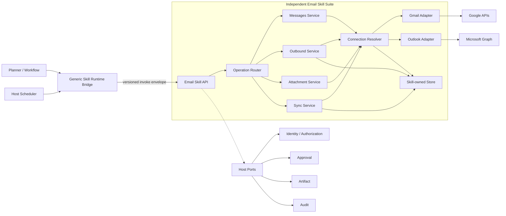

# 00. 总体架构与边界

## 1. 设计目标

Email Skill Suite 需要同时满足四个目标：

1. **接口少而够用**：模型无需在 `email_list`、`email_read`、`email_search` 之间猜测，也不能直接面对 Provider API 细节。
2. **连接由用户单位配置**：平台运营方不代管所有客户的 Google/Microsoft OAuth App；每个组织可配置自己的应用凭证和授权策略。
3. **Skill 自治**：连接、Token、Provider 差异、检查点、发送幂等属于 Skill，不污染宿主平台的领域模型。
4. **可被调度**：同一个读取契约既支持交互式读取，也支持宿主调度器周期性触发增量拉取。

## 2. 架构原则

### 2.0 对 DSH #528 的取舍

[DSH Discussion #528](https://github.com/deepseek-ai/deepseek-harness/discussions/528) 提供了很好的邮件插件原型思路。本设计对其做如下取舍：

| DSH 原型思路 | 本设计的处理 |
| --- | --- |
| 统一 Gmail / Outlook / IMAP 的邮件能力 | 借鉴统一抽象，但首期只实现 Gmail 和 Outlook Adapter |
| `email_list/read/search/send/...` 多个 Tool | 内部保留细粒度方法；模型侧合并为 `email.messages`，发送和附件仍独立 |
| 多账号与默认账号 | 借鉴，但改为租户隔离的 `mailboxKey + Connection ACL` |
| 连接池和 Provider 路由 | 借鉴，并放入 Skill 自有 Connection Resolver |
| 本地配置文件保存账号配置 | 不采用；改为组织 BYOA、管理 API 和加密数据模型 |
| 直接在插件配置中管理凭证 | 不采用；Secret/Token 分表、信封加密、最小解密面 |
| 内存 Watch Cursor | 不采用；改为持久化、每 Consumer 隔离的 Checkpoint + Receipt |
| Watch 作为能力接口 | 首期改为宿主 Schedule 调用 runtime-only `email.poll`；Push 后续只做唤醒 |
| 工具自身完成发送 | 保留，但增加宿主审批 Port、Payload Hash 和 Delivery Ledger |

因此这里借鉴的是“Provider 适配层 + 统一邮件域能力”，而不是把原型的配置、Tool 数量和状态管理方式原样嵌入当前系统。

### 2.1 独立能力域

Email Skill 不直接依赖宿主的 Prisma Model、NestJS Service、内部事件类或数据库表。它只依赖一个版本化的 `email-skill-contract` 和少量 Host Port。

这意味着：

- Skill 可以与当前系统同库不同 Schema、同集群独立服务部署；
- 以后也可以迁移到独立数据库或安装到其他宿主；
- 宿主升级内部实现时，只要兼容 ABI，Email Skill 无需同步重构；
- 卸载 Skill 后，宿主核心编排、调度和审批仍然成立。

### 2.2 一个 Suite，多个入口

“单独的 Skill”不等于“只能有一个万能 Tool”。推荐发布一个 Suite，并提供四个职责清晰的能力入口：

| 能力 | 是否对模型可见 | 风险级别 | 职责 |
| --- | --- | --- | --- |
| `email.messages` | 是 | L1 读取 | 最近邮件、条件搜索、按引用读取详情 |
| `email.send` | 是 | L2 外部写入 | 新邮件、回复；首期可暂缓转发 |
| `email.attachment` | 是，按需召回 | L1/L2 | 将指定附件读取到受控制品 |
| `email.poll` | 否，默认 runtime-only | L1 后台读取 | 按 Checkpoint 拉取变化并生成确定性结果 |

连接管理、OAuth 回调、健康检查属于管理面 API，不进入模型工具列表。

### 2.3 Provider API 不外泄

统一契约只表达业务意图，例如 `selector.kind=search`。Provider Adapter 再转换为 Gmail `q`、Microsoft Graph `$filter/$search` 或降级组合。

不能让上层传入：

- 任意 REST URL；
- Google access token / Microsoft access token；
- Gmail raw query 与 Graph OData 的混合字符串；
- Provider 原始分页 URL；
- Provider 原始邮件 ID。

这些约束同时降低模型误用、SSRF、越权连接和 Provider 锁定风险。

## 3. 逻辑架构



## 4. 控制面与数据面

### 4.1 控制面

控制面服务于组织管理员和邮箱所有者：

- 注册/更新 Provider App；
- 发起 OAuth 连接；
- 处理 OAuth Callback；
- 查询连接状态、Scope 和最后健康检查；
- 设置连接别名、默认读取邮箱和默认发送邮箱；
- 撤销连接；
- 检查某个能力是否具备所需 Scope；
- 初始化、暂停或重置同步 Checkpoint。

控制面请求必须经过宿主身份认证；Skill 只信任宿主签发的短期服务令牌和其中的租户上下文。

### 4.2 数据面

数据面只处理版本化能力调用：

```http
POST /v1/invoke
Authorization: Bearer <host-service-token>
Content-Type: application/json
```

请求必须包含：

- `contractVersion`；
- `capabilityKey`；
- `requestId`；
- 可信 `tenantContext`；
- `executionContext`；
- `input`；
- 可选 `approvalGrant`。

数据面不接受用户直接提交的 `orgId` 作为授权依据。`orgId` 必须来自宿主签名上下文。

## 5. 宿主与 Skill 的职责矩阵

| 职责 | 宿主 | Email Skill |
| --- | --- | --- |
| 用户登录与组织成员关系 | 负责 | 不复制用户体系 |
| Planner 召回与工作流编排 | 负责 | 提供 Manifest 与 Schema |
| 调度触发和执行历史 | 负责 | 提供可重入 `email.poll` |
| Provider App / 邮箱连接 | 不负责业务数据 | 负责 |
| OAuth State、PKCE、Token 刷新 | 不负责 | 负责 |
| Provider 路由与限流适配 | 不负责 | 负责 |
| 增量游标与去重 | 不负责 | 负责 |
| 写操作审批 UI/策略 | 负责策略与交互 | 生成预览、校验 Grant |
| 附件制品存储与病毒扫描 | 提供通用能力 | 调用 Host Port |
| Skill 内部审计 | 接收/汇聚 | 产生结构化事件 |
| 邮件正文长期归档 | 默认不做 | 默认不做 |

## 6. Host Port

Skill 仅允许依赖以下稳定抽象：

```ts
export interface EmailSkillHostPorts {
  identity: {
    authorize(input: AuthorizeInput): Promise<AuthorizeDecision>;
  };
  approval: {
    verifyGrant(input: VerifyApprovalGrantInput): Promise<ApprovalDecision>;
  };
  artifact: {
    putSensitive(input: PutSensitiveArtifactInput): Promise<ArtifactRef>;
  };
  audit: {
    append(event: EmailSkillAuditEvent): Promise<void>;
  };
}
```

约束：

- Port 接口位于独立合同包，不能引用宿主 ORM Entity 或框架类型；
- Host Port 可以通过 HTTP/gRPC 实现，也可在同进程模式下由函数适配；
- Skill 不得反向查询宿主任意数据库表；
- Host Port 调用要有超时、重试分类和熔断，不得无限等待；
- 宿主不可通过 Port 获取 Provider Refresh Token。

## 7. 运行时 ABI

建议采用如下调用信封：

```json
{
  "contractVersion": "email-skill.invoke/v1",
  "capabilityKey": "email.messages",
  "requestId": "req_01J...",
  "tenantContext": {
    "orgId": "org_123",
    "actorUserId": "usr_456",
    "roles": ["member"]
  },
  "executionContext": {
    "executionId": "exe_123",
    "stepId": "step_2",
    "attempt": 1,
    "consumerId": null,
    "trigger": "interactive"
  },
  "input": {}
}
```

`consumerId` 是同步状态的稳定消费者标识。对于定时任务，宿主应传入不可随单次执行变化的 Schedule ID；交互式调用通常为空。

响应统一为：

```json
{
  "contractVersion": "email-skill.result/v1",
  "requestId": "req_01J...",
  "status": "succeeded",
  "output": {},
  "warnings": [],
  "metrics": {
    "providerRequests": 2,
    "durationMs": 328
  }
}
```

业务失败必须返回稳定错误码；不得要求宿主解析 Gmail 或 Graph 的错误文本。

## 8. 建议源码边界

推荐将 Suite 保持在一个顶层目录中，但按职责拆包：

```text
skills/email/
  README.md
  contracts/
    invoke/
    capabilities/
    host-ports/
  manifests/
    email.messages/
    email.send/
    email.attachment/
    email.poll/
  core/
    application/
    domain/
    provider-spi/
  providers/
    gmail/
    outlook/
  service/
    control-api/
    runtime-api/
    persistence/
    crypto/
  adapters/
    ops-host/
    standalone-mock-host/
  migrations/
  tests/
```

边界规则：

- `core` 不依赖 NestJS、Prisma、Google SDK 或 Microsoft SDK；
- `providers/*` 实现 `provider-spi`；
- `service` 负责协议、持久化和进程生命周期；
- `adapters/ops-host` 只做当前项目的 ABI 映射，无邮件业务逻辑；
- `standalone-mock-host` 使 Suite 可以脱离当前平台进行合同测试和演示；
- 普通业务文件遵循仓库单一职责和行数规则，Provider Adapter 不写成巨石 Service。

## 9. 与当前平台的最小集成点

当前项目只需要补齐或复用以下通用能力：

1. 在 Runtime invoke 上下文中可靠传递 `orgId`、`actorUserId`、`executionId`、`stepId`、`attempt`、`consumerId`；
2. 注册一个通用的远程 Skill Runtime Adapter，例如 `workflow:remote-skill`；
3. 将 Email Suite 的四个 Manifest 投影到能力目录；
4. 将 `email.send` 标记为有副作用能力，接入通用审批；
5. 将附件和大正文写入通用 Artifact Port；
6. 定时 Saved Skill 触发时把稳定 Schedule ID 作为 `consumerId` 传入。

不建议新增：

- 平台内部 `GmailService` / `OutlookService`；
- 平台级 `email_connections` 表；
- 为每个邮件动作添加专用 Handler；
- 把 OAuth Client Secret 写入现有全局 Builtin Skill Runtime Config；
- 调度器直接调用 Gmail 或 Graph。

## 10. 可替换性验证

设计完成后应能通过以下问题验证松耦合：

- 把当前平台替换为 Mock Host，Email Skill 是否仍能完成 OAuth、读取和同步？
- 把 Email Skill 独立数据库迁走，宿主是否只需修改部署配置？
- 新增第三个 Provider 时，宿主是否无需新增邮件业务代码？
- 改变宿主调度实现时，`consumerId + invoke` 契约是否保持不变？
- 卸载 Email Skill 后，是否只需要撤销目录条目和路由配置？

若任一答案是否定的，应优先修正边界，而不是增加平台内嵌逻辑。
