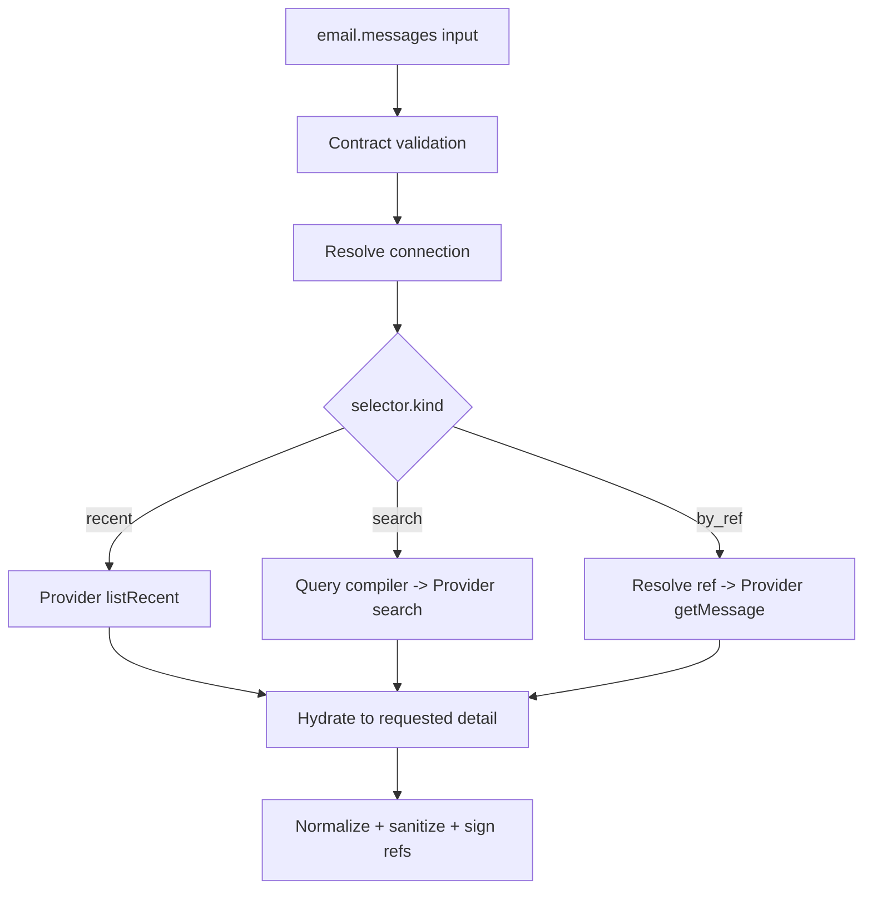

# 01. 能力暴露与统一契约

## 1. 为什么不直接暴露 `email_list / email_read / email_search`

这三个接口在底层语义上有差异，但对模型而言高度重叠：

- “看看我今天收到的邮件”可能被理解为 list，也可能被理解为 search；
- “读一下张三那封邮件”需要先 search/list，再 read；
- 模型容易在多个工具间反复调用，增加延迟、费用和权限面；
- Gmail 和 Outlook 的查询语言不同，直接暴露会使工作流绑定 Provider；
- 后续加入定时拉取时，如果复用 list/search 的分页语义，难以保证 Checkpoint 和去重。

因此，对模型只暴露一个统一读取入口 `email.messages`，通过判别联合类型明确三种选择器。内部仍保持 list、search、get 三条执行路径，便于优化和测试。

## 2. 能力目录

### 2.1 模型可见能力

| capabilityKey | 用户意图 | 副作用 | 默认召回策略 |
| --- | --- | --- | --- |
| `email.messages` | 看最近邮件、查找邮件、读邮件 | 无 | 常驻或按 email domain 召回 |
| `email.send` | 写信、回复 | 有 | 仅用户明确表达发送意图时召回 |
| `email.attachment` | 获取邮件附件内容 | 下载并产生制品 | 存在 `attachmentRef` 时召回 |

### 2.2 非模型能力

| capabilityKey | 调用方 | 用途 |
| --- | --- | --- |
| `email.poll` | 调度工作流/确定性运行时 | 增量拉取与 Checkpoint 推进 |
| `email.connection.probe` | 管理面 | 验证连接与 Scope |

`email.connection.probe` 可以是控制面 API，不一定发布成平台能力。

## 3. 通用类型

### 3.1 MailboxKey

`mailboxKey` 是组织内用户可理解的连接别名，例如 `work`、`sales-shared-candidate`。它由 Skill 管理，不是邮箱地址，也不是数据库 ID。

解析规则：

1. 显式传入时，必须在当前 `orgId + actorUserId` 权限范围内解析；
2. 未传入时，读取能力使用用户的默认读邮箱；
3. 发送能力使用用户的默认发件邮箱；
4. 存在多个候选且没有默认值时返回 `EMAIL_MAILBOX_AMBIGUOUS`，不能任意选择。

### 3.2 MessageRef / ThreadRef / AttachmentRef

所有引用都是 Skill 签发的不透明字符串：

```text
emsg_v1_<opaque>
ethr_v1_<opaque>
eatt_v1_<opaque>
```

引用至少绑定：

- `orgId`；
- `connectionId`；
- Provider 类型；
- Provider 原始 ID；
- 签发时间和可选过期时间；
- 类型标记；
- 完整性签名或服务端映射 ID。

上层不能拆解引用，不能把一个租户的 Ref 用到另一个租户，也不能把 `MessageRef` 当作 `AttachmentRef`。

### 3.3 Cursor

交互式分页 Cursor 与同步 Checkpoint 是两个不同概念：

- `cursor`：短期、不透明、绑定查询哈希，用于用户翻页；
- `checkpoint`：长期、服务端持久化、绑定 `connection + folder + consumerId`，不返回给模型。

## 4. `email.messages`

### 4.1 输入契约

```ts
type EmailMessagesInput = {
  mailboxKey?: string;
  selector:
    | {
        kind: "recent";
        folder?: "inbox" | "sent" | "drafts" | "archive" | "all";
        unreadOnly?: boolean;
        since?: string; // RFC 3339
        until?: string; // RFC 3339
      }
    | {
        kind: "search";
        text?: string;
        filters?: {
          from?: string[];
          to?: string[];
          subjectContains?: string;
          hasAttachment?: boolean;
          unreadOnly?: boolean;
          since?: string;
          until?: string;
          folder?: "inbox" | "sent" | "drafts" | "archive" | "all";
        };
      }
    | {
        kind: "by_ref";
        messageRef: string;
      };
  detail?: "summary" | "full";
  limit?: number;
  cursor?: string;
};
```

约束：

- `limit` 默认 20，最大 50；
- `by_ref` 时 `limit` 和 `cursor` 禁止出现；
- `detail=summary` 默认只取头部、snippet 和附件元数据；
- `detail=full` 最大返回 5 封正文，避免一次读取大量敏感数据；
- `search.text` 是普通自然文本，不是 Gmail Query 或 OData 表达式；
- 时间统一以 RFC 3339 输入，输出统一为 UTC；
- 不支持的过滤组合返回 `EMAIL_QUERY_UNSUPPORTED`，不能静默忽略。

### 4.2 输出契约

```ts
type EmailMessagesOutput = {
  mailboxKey: string;
  items: NormalizedMessage[];
  nextCursor?: string;
  fetchedAt: string;
  warnings: EmailWarning[];
};

type NormalizedMessage = {
  messageRef: string;
  threadRef?: string;
  internetMessageId?: string;
  folder: "inbox" | "sent" | "drafts" | "archive" | "other";
  subject: string;
  from?: MailAddress;
  to: MailAddress[];
  cc: MailAddress[];
  receivedAt?: string;
  sentAt?: string;
  isRead: boolean;
  importance?: "low" | "normal" | "high";
  labels: string[];
  snippet?: string;
  body?: {
    format: "text" | "sanitized_html";
    content?: string;
    artifactRef?: string;
    truncated: boolean;
  };
  attachments: Array<{
    attachmentRef: string;
    filename: string;
    contentType?: string;
    sizeBytes?: number;
    inline: boolean;
  }>;
  contentTrust: "untrusted_external";
};
```

隐私与稳定性约束：

- Provider 原始 ID、分页 Token、DeltaLink 不进入输出；
- HTML 必须清洗，不加载远程图片、脚本、CSS、表单或追踪像素；
- 正文超过内联阈值时写入敏感 Artifact，仅返回 `artifactRef`；
- 地址显示名和邮箱地址保持结构化，禁止拼成无法可靠解析的字符串；
- 缺失字段返回空值/空数组，不伪造数据。

### 4.3 内部路由



内部 Provider SPI 仍应保留清晰方法，而不是一个巨型 `execute`：

```ts
export interface EmailProviderAdapter {
  readonly provider: "gmail" | "outlook";
  probe(context: ProviderContext): Promise<ProviderProbe>;
  listMessages(input: ProviderListInput): Promise<ProviderMessagePage>;
  searchMessages(input: ProviderSearchInput): Promise<ProviderMessagePage>;
  getMessage(input: ProviderGetInput): Promise<ProviderMessage>;
  getAttachment(input: ProviderAttachmentInput): Promise<ProviderAttachmentStream>;
  send(input: ProviderSendInput): Promise<ProviderSendResult>;
  beginSync(input: ProviderBeginSyncInput): Promise<ProviderSyncPage>;
  continueSync(input: ProviderContinueSyncInput): Promise<ProviderSyncPage>;
}
```

模型看到的是少量意图接口；内部代码仍有充分的职责边界和 Provider 优化空间。

## 5. `email.send`

### 5.1 输入契约

```ts
type EmailSendInput = {
  mailboxKey?: string;
  mode: "new" | "reply";
  to?: MailAddressInput[];
  cc?: MailAddressInput[];
  bcc?: MailAddressInput[];
  subject?: string;
  textBody: string;
  replyToMessageRef?: string;
  attachmentArtifactRefs?: string[];
  clientRequestKey?: string;
};
```

首期规则：

- 优先支持纯文本正文；HTML 发送后续单独增加并做更严格清洗；
- `mode=new` 必须提供收件人和主题；
- `mode=reply` 必须提供 `replyToMessageRef`；是否允许额外收件人由组织策略控制；
- 附件只接受宿主 ArtifactRef，不接受本地路径或任意 URL；
- `clientRequestKey` 是调用方提供的业务幂等键，可选；运行时仍会生成强制 `requestId`；
- 收件人数、正文长度、附件总大小由组织策略和 Provider 限制的较小值决定。

### 5.2 审批预览

发送前生成不可变预览：

```ts
type EmailSendPreview = {
  mailboxKey: string;
  fromMasked: string;
  mode: "new" | "reply";
  to: MailAddressInput[];
  cc: MailAddressInput[];
  bccCount: number;
  subject: string;
  bodyPreview: string;
  bodySha256: string;
  attachments: Array<{
    artifactRef: string;
    filename: string;
    sha256: string;
    sizeBytes: number;
  }>;
  payloadHash: string;
};
```

审批 Grant 必须绑定 `orgId + actorUserId + connectionId + payloadHash + expiry`。任意收件人、主题、正文或附件变化都会使原 Grant 失效。

### 5.3 输出契约

```ts
type EmailSendOutput = {
  deliveryId: string;
  state: "accepted" | "unknown";
  providerMessageRef?: string;
  acceptedAt?: string;
  warning?: string;
};
```

`accepted` 只表示 Provider 已接受请求，不代表邮件已送达收件人。Microsoft Graph `sendMail` 返回 `202 Accepted` 时尤其不能表达为“已送达”。

如果请求超时发生在提交之后，结果必须是 `unknown`，不能自动重试并造成重复发送。

## 6. `email.attachment`

### 6.1 输入与输出

```ts
type EmailAttachmentInput = {
  mailboxKey?: string;
  attachmentRef: string;
};

type EmailAttachmentOutput = {
  artifactRef: string;
  filename: string;
  contentType?: string;
  sizeBytes: number;
  sha256: string;
  scanState: "clean" | "quarantined" | "unsupported";
};
```

处理流程：

1. 校验 Ref 与当前租户、连接和类型匹配；
2. 读取 Provider 元数据并预检大小；
3. 以流式方式下载，避免将整个附件驻留内存；
4. 计算 SHA-256；
5. 调用 Host Artifact Port 写入隔离区；
6. 完成病毒扫描/内容策略；
7. 仅在允许时返回可消费 ArtifactRef。

首期建议默认单附件 20 MiB 上限，组织可以调低。Provider 限制更低时服从 Provider 限制。

## 7. `email.poll`

`email.poll` 不允许模型指定任意 Checkpoint。Checkpoint 由 Skill 根据可信 `consumerId` 查找。

```ts
type EmailPollInput = {
  mailboxKey: string;
  folder?: "inbox";
  maxChanges?: number;
  includeBody?: boolean;
};

type EmailPollOutput = {
  mailboxKey: string;
  consumerId: string;
  changes: Array<{
    kind: "created" | "updated" | "deleted";
    message?: NormalizedMessage;
    messageRef?: string;
  }>;
  newMessageCount: number;
  hasMore: boolean;
  checkpointAdvanced: boolean;
  syncCompletedAt: string;
  warnings: EmailWarning[];
};
```

默认 `includeBody=false`，让定时任务先筛选元数据，只有后续步骤明确需要时才读取正文。

## 8. 错误契约

```ts
type EmailSkillError = {
  code: EmailErrorCode;
  message: string;
  retryable: boolean;
  retryAfterMs?: number;
  actionRequired?: "connect" | "reauthorize" | "approve" | "contact_admin";
  details?: Record<string, string | number | boolean>;
};
```

稳定错误码：

| 错误码 | 是否可重试 | 含义 |
| --- | --- | --- |
| `EMAIL_CONNECTION_REQUIRED` | 否 | 没有可用连接 |
| `EMAIL_MAILBOX_AMBIGUOUS` | 否 | 需要用户选择邮箱 |
| `EMAIL_CONNECTION_FORBIDDEN` | 否 | 当前主体无权使用该连接 |
| `EMAIL_REAUTH_REQUIRED` | 否 | Refresh Token 失效或授权被撤销 |
| `EMAIL_SCOPE_MISSING` | 否 | 当前授权缺少能力所需 Scope |
| `EMAIL_QUERY_UNSUPPORTED` | 否 | Provider 无法可靠表达该查询 |
| `EMAIL_REF_INVALID` | 否 | 引用伪造、过期、跨租户或类型不符 |
| `EMAIL_MESSAGE_NOT_FOUND` | 否 | 邮件不存在或已删除 |
| `EMAIL_RATE_LIMITED` | 是 | Provider 限流 |
| `EMAIL_PROVIDER_TEMPORARY` | 是 | Provider 暂时故障 |
| `EMAIL_SYNC_CURSOR_EXPIRED` | 有条件 | 增量游标过期，需要受控重建 |
| `EMAIL_SEND_APPROVAL_REQUIRED` | 否 | 缺少审批 Grant |
| `EMAIL_SEND_APPROVAL_DENIED` | 否 | 审批拒绝或 Payload 已变化 |
| `EMAIL_SEND_STATE_UNKNOWN` | 否 | 提交后超时，禁止盲目重试 |
| `EMAIL_ATTACHMENT_TOO_LARGE` | 否 | 超过大小限制 |
| `EMAIL_ATTACHMENT_UNSAFE` | 否 | 扫描不通过 |

Provider 错误体只写入受控诊断信息，不能原样返回给模型或最终用户。

## 9. Manifest 示例

下面是概念性片段，具体字段以平台能力合同为准：

```yaml
suite: platform.email
suiteVersion: 1.0.0
runtime:
  adapterRoute: workflow:remote-skill
  runtimeRef: email-skill-runtime
capabilities:
  - key: email.messages
    operation: read
    risk: L1
    modelVisible: true
    inputSchemaRef: email.messages.input/v1
    outputSchemaRef: email.messages.output/v1
  - key: email.send
    operation: external_write
    risk: L2
    approval: payload_bound
    modelVisible: true
    inputSchemaRef: email.send.input/v1
    outputSchemaRef: email.send.output/v1
  - key: email.attachment
    operation: artifact_import
    risk: L1
    modelVisible: on_demand
  - key: email.poll
    operation: background_read
    risk: L1
    modelVisible: false
```

`runtimeRef` 只能由部署配置解析到白名单地址，不能由 Manifest 直接携带任意 URL。

## 10. 典型调用

### 10.1 “看看今天未读邮件”

一次调用即可完成：

```json
{
  "selector": {
    "kind": "recent",
    "folder": "inbox",
    "unreadOnly": true,
    "since": "2026-09-02T00:00:00+08:00"
  },
  "detail": "summary",
  "limit": 20
}
```

### 10.2 “找王经理上周关于预算的邮件”

```json
{
  "selector": {
    "kind": "search",
    "text": "预算",
    "filters": {
      "from": ["王经理"],
      "since": "2026-08-24T00:00:00+08:00",
      "until": "2026-08-31T00:00:00+08:00"
    }
  },
  "detail": "summary",
  "limit": 20
}
```

### 10.3 “读第二封”

Planner 必须复用上一步返回的 `messageRef`：

```json
{
  "selector": {
    "kind": "by_ref",
    "messageRef": "emsg_v1_..."
  },
  "detail": "full"
}
```

这使模型面对三个稳定能力，而内部可以保留任意数量的 Provider API 操作和路由优化。

