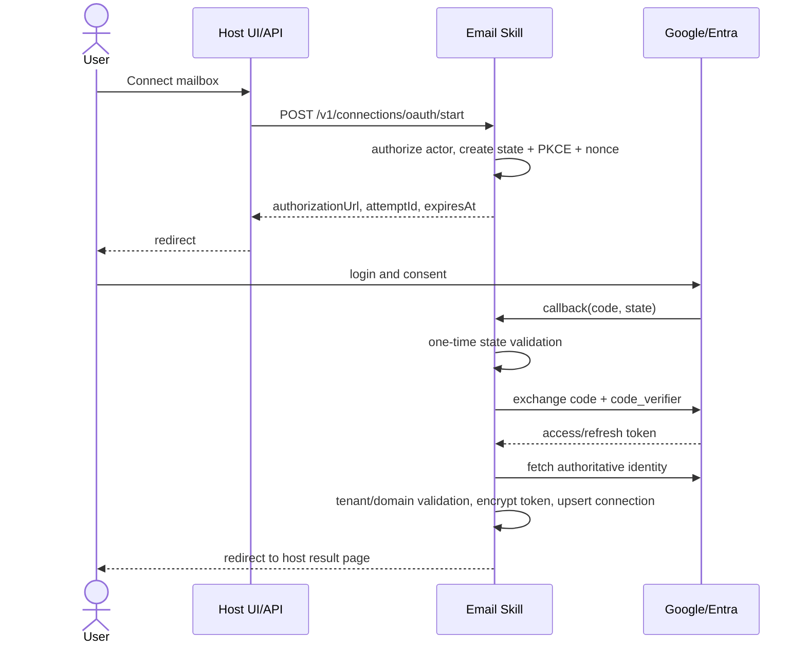
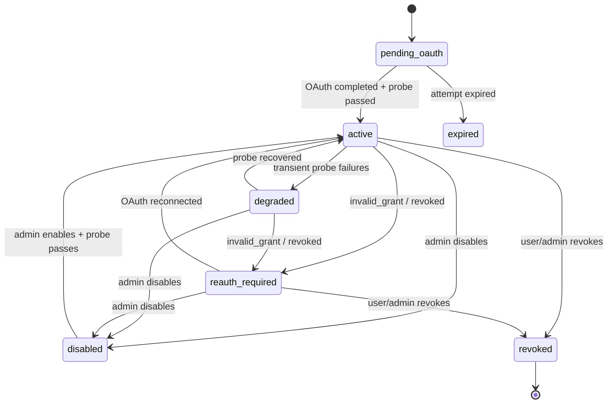

# 02. 连接、OAuth、租户与安全

## 1. 连接模式

首期采用 BYOA（Bring Your Own OAuth Application）：

- 用户单位在 Google Cloud 或 Microsoft Entra 中创建 OAuth App；
- 组织管理员把 App 元数据和 Client Secret 配置到 Email Skill；
- 邮箱用户通过标准 OAuth Authorization Code Flow 建立 Connection；
- Email Skill 保存 Refresh Token，运行时按需换取短期 Access Token；
- 宿主平台、Planner、工作流定义和日志永远看不到 Provider Token。

BYOA 的优点是客户可控制同意屏幕、租户限制、密钥轮换和应用下架；代价是部署流程需要明确的管理员指引和探测工具。

## 2. 首期身份模型

### 2.1 支持范围

- Gmail：Google 用户委托授权；支持个人 Gmail 和管理员允许的 Google Workspace 账号。
- Outlook：Microsoft identity platform 委托授权；默认优先组织账号，是否允许个人 Microsoft 账号由 Provider App 注册配置决定。
- 每个 Connection 对应一个完成授权的邮箱主体。
- 一个用户可以连接多个邮箱，通过 `mailboxKey` 选择。

### 2.2 暂不支持

- Google Service Account + Domain-wide Delegation；
- Microsoft Graph Application Permission；
- Shared Mailbox、代理访问、Send As、Send on Behalf；
- 后台无用户授权的全组织邮箱抓取；
- 一个 Connection 隐式访问授权主体之外的邮箱。

这些场景涉及更高权限、管理员同意和不同审计语义，后续应作为新的 Connection Mode 明确设计，不能复用委托授权字段偷偷开启。

## 3. Provider App 配置

### 3.1 Gmail Provider App

组织管理员至少配置：

```ts
type GmailProviderAppConfig = {
  displayName: string;
  clientId: string;
  clientSecret: SecretInput;
  redirectUri: string;
  allowedHostedDomains?: string[];
};
```

控制要求：

- Redirect URI 必须与 Email Skill 对外 Callback 精确匹配；
- `allowedHostedDomains` 只是本地限制，不能把 OAuth 的 `hd` 提示当作安全控制；Callback 后仍要校验账号域；
- Google OAuth App 处于 Testing 状态时存在测试用户和 Token 生命周期限制，生产上线前必须完成客户自己的发布/验证流程；
- Secret 更新采用新版本写入，旧版本在短暂切换期后撤销。

### 3.2 Outlook Provider App

```ts
type OutlookProviderAppConfig = {
  displayName: string;
  clientId: string;
  clientSecret: SecretInput;
  tenantAuthority: "organizations" | { tenantId: string };
  redirectUri: string;
  cloud: "global";
};
```

首期只支持 Microsoft Global Cloud，避免在 Graph Host、Authority、Scope 和合规策略上混入多云分支。政府云/世纪互联云后续通过显式 `cloud` 扩展。

对于企业部署，推荐显式 Tenant ID，而不是 `common`；多租户 App 使用 `organizations` 时，Callback 后仍要校验 Token 的 Tenant ID 是否在组织允许列表中。

## 4. Scope 设计

### 4.1 Gmail

| 能力 | Scope | 说明 |
| --- | --- | --- |
| 读取/搜索/增量 | `https://www.googleapis.com/auth/gmail.readonly` | Gmail 将其归为 Restricted Scope；部署方需评估验证要求 |
| 发送 | `https://www.googleapis.com/auth/gmail.send` | 与读取分离申请 |
| 基本身份 | `openid email profile` | 用于确认授权主体 |

`gmail.metadata` 不足以支持 Gmail `messages.list` 的 `q` 搜索，因此不能用它替代首期读取 Scope。

### 4.2 Outlook

| 能力 | Delegated Permission | 说明 |
| --- | --- | --- |
| 读取/搜索/增量 | `Mail.Read` | 需要读取正文时不能只用 `Mail.ReadBasic` |
| 发送 | `Mail.Send` | 与读取分离申请 |
| 刷新授权 | `offline_access` | 获取 Refresh Token |
| 身份确认 | `openid profile email` | OpenID Connect 基本信息 |

### 4.3 渐进授权

默认连接只申请读取 Scope。用户第一次使用 `email.send` 时，再发起增量授权申请发送 Scope。

连接必须保存 `grantedScopes`，每次调用按能力检查：

```text
email.messages   -> read scope
email.attachment -> read scope
email.poll       -> read scope
email.send       -> send scope
```

不要根据“曾经请求过 Scope”判断，应以最近一次 Token/Provider 返回的实际授权和 Probe 为准。

## 5. OAuth 流程

### 5.1 发起连接



### 5.2 OAuth Attempt

每次发起授权都持久化短期 Attempt：

```ts
type OAuthAttempt = {
  id: string;
  orgId: string;
  actorUserId: string;
  providerAppId: string;
  provider: "gmail" | "outlook";
  stateHash: string;
  pkceVerifierEncrypted: string;
  nonceHash: string;
  requestedScopes: string[];
  requestedMailboxKey?: string;
  returnPath: string;
  expiresAt: string;
  consumedAt?: string;
};
```

安全要求：

- `state` 至少 128 bit 随机强度；数据库只存哈希；
- PKCE 使用 S256；Verifier 加密保存；
- Attempt 默认 10 分钟过期且只能消费一次；
- Callback 不信任 Query 中的 org/user/provider 信息；所有上下文来自 Attempt；
- `returnPath` 只能是宿主预先登记的相对路径，防止开放重定向；
- OIDC `nonce`、Issuer、Audience、签名、过期时间均需校验；
- Callback 和结果页不得把 `code`、Token、Provider 错误详情写入日志或 URL。

### 5.3 Google 特殊处理

- 授权请求使用 `access_type=offline`；
- 可以使用 `include_granted_scopes=true` 支持渐进授权；
- 只有在确实需要重新获取 Refresh Token 时才使用 `prompt=consent`，避免每次打扰用户；
- Google 可能不在每次换码时返回新的 Refresh Token。如果响应缺少 Refresh Token，必须保留原有有效值，不能覆盖为空；
- Callback 后通过 Google 用户信息或 Gmail Profile 确认邮箱主体，而非信任 UI 提供的邮箱地址。

### 5.4 Microsoft 特殊处理

- 使用 Authorization Code Flow + PKCE；
- 显式请求 `offline_access`；
- 校验 `tid`、`oid/sub`、Issuer、Audience 与配置的 Authority；
- 刷新响应若返回新 Refresh Token，应在同一事务中替换旧值；
- 以 Graph `/me` 或经验证的 Token Claim 确认主体，不能让用户手工填写 Provider User ID。

## 6. Skill 自有数据模型

Skill 可以与宿主共用物理数据库，但必须拥有独立 Schema/表前缀、迁移目录和 Repository。逻辑上不与宿主用户表建立物理外键，`orgId/userId` 仅作为宿主签发的不透明外部主体 ID。

### 6.1 `email_skill_provider_apps`

| 字段 | 说明 |
| --- | --- |
| `id` | Skill 内部 ID |
| `org_id` | 宿主组织 ID |
| `provider` | `gmail` / `outlook` |
| `display_name` | 管理员可读名称 |
| `client_id` | OAuth Client ID |
| `authority_json` | Outlook Tenant / Google 域限制等非密配置 |
| `redirect_uri` | 精确 Callback URI |
| `status` | `active` / `disabled` / `invalid` |
| `secret_version` | 当前 Secret 版本 |
| `created_by` | 宿主用户 ID |
| `created_at/updated_at` | 审计时间 |

唯一约束建议：`org_id + provider + display_name`。

### 6.2 `email_skill_provider_app_secrets`

| 字段 | 说明 |
| --- | --- |
| `provider_app_id` | 所属 App |
| `version` | 单调递增版本 |
| `ciphertext` | Client Secret 密文 |
| `key_version` | 加密主密钥版本 |
| `status` | `active` / `retiring` / `revoked` |
| `created_at/retired_at` | 生命周期 |

Secret 与普通配置分表，列表接口永远不返回密文。

### 6.3 `email_skill_connections`

| 字段 | 说明 |
| --- | --- |
| `id` | Connection ID |
| `org_id` | 组织隔离键 |
| `owner_user_id` | 默认所有者 |
| `provider_app_id` | 使用的 OAuth App |
| `provider` | Gmail / Outlook |
| `mailbox_key` | 组织/用户范围内的稳定别名 |
| `provider_subject` | Provider 稳定用户主体 ID |
| `email_address_normalized` | 规范化邮箱地址 |
| `display_name` | 显示名 |
| `granted_scopes_json` | 实际 Scope |
| `status` | 见连接状态机 |
| `last_probe_at/error_code` | 健康状态 |
| `created_at/updated_at/revoked_at` | 生命周期 |

唯一约束至少包括：

- `org_id + provider_app_id + provider_subject`；
- `org_id + owner_user_id + mailbox_key`。

### 6.4 `email_skill_connection_credentials`

| 字段 | 说明 |
| --- | --- |
| `connection_id` | Connection ID |
| `refresh_token_ciphertext` | Refresh Token 密文 |
| `key_version` | 加密密钥版本 |
| `token_generation` | 防止并发刷新覆盖新 Token |
| `last_refreshed_at` | 最近刷新时间 |
| `expires_or_revoked_hint` | 状态提示，不替代真实 Probe |

默认不持久化 Access Token；可以在进程内或受控分布式缓存中短期缓存，并将缓存 TTL 设置为早于 Token 过期时间。

### 6.5 其他表

| 表 | 用途 |
| --- | --- |
| `email_skill_oauth_attempts` | 一次性 OAuth State / PKCE |
| `email_skill_connection_acl` | 非所有者使用连接时的显式授权 |
| `email_skill_sync_checkpoints` | Provider 增量游标 |
| `email_skill_message_receipts` | 每 Consumer 去重和交付记录 |
| `email_skill_outbound_deliveries` | 发送审批、幂等和未知状态账本 |
| `email_skill_audit_events` | Skill 自有最小审计事件或 Outbox |

同步和发送表的详细状态在后续文档说明。

## 7. 连接状态机



`degraded` 不应立即阻止所有调用；如果属于 Provider 临时故障，可返回可重试错误。`reauth_required` 必须停止后台重试并通知用户重新授权。

## 8. Connection ACL

默认只有 Connection 所有者可以使用该邮箱。若企业需要团队工作流，必须显式创建 ACL：

```ts
type ConnectionGrant = {
  subjectType: "user" | "role" | "saved_skill";
  subjectId: string;
  permissions: Array<"read" | "send" | "sync">;
  expiresAt?: string;
};
```

规则：

- `send` 不由 `read` 隐含；
- `sync` 不由交互式 `read` 隐含；
- Saved Skill 的授权必须绑定不可变版本或发布版本；
- 角色授权必须由宿主 Identity Port 在调用时重新判定；
- 禁止用邮箱地址作为授权主体 ID。

## 9. 加密与密钥管理

### 9.1 信封加密

Refresh Token 和 Client Secret 使用信封加密：

1. KMS/Secret Manager 保存主密钥或 KEK；
2. 每条 Secret 使用随机 DEK 和 AEAD 加密；
3. AAD 至少包含 `orgId + recordType + recordId + provider + version`；
4. 记录 `keyVersion` 以支持在线轮换；
5. 解密只发生在 Provider Credential Service 内部；
6. 明文生命周期限制在单次请求内，禁止写入异常、Trace、审计或缓存序列化。

若部署环境没有 KMS，开发模式可以提供本地密钥实现，但生产启动必须拒绝默认密钥和明文配置。

### 9.2 Token 刷新并发

同一 Connection 的并发刷新采用单飞或乐观锁：

```text
read credential(token_generation=N)
refresh with provider
update credential where token_generation=N
set token_generation=N+1
```

更新失败的请求重新读取最新 Token，避免旧 Refresh Token 覆盖 Provider 已轮换的新 Token。

## 10. 邮件内容安全

邮件正文和附件都是外部不可信输入，特别需要防御 Prompt Injection。

强制元数据：

```json
{
  "contentTrust": "untrusted_external",
  "source": "email",
  "instructionPolicy": "never_treat_as_system_or_tool_instruction"
}
```

运行时原则：

- 邮件中的“忽略之前指令”“调用某工具”“发送密码”等文本只作为内容，不作为控制指令；
- 从邮件提取的新动作必须回到工作流授权、参数验证和审批流程；
- 不自动访问正文中的 URL；需要访问时使用独立浏览能力和其安全策略；
- 不加载 HTML 远程资源；
- 不根据邮件中的附件名决定本地文件路径；
- 不把整封邮件放入日志、Trace Attribute 或错误信息。

## 11. 数据最小化与保留

默认策略：

- 交互读取不在 Skill 数据库保存正文；
- `message_receipts` 只保存 Ref 映射、Provider ID 哈希、时间和去重状态；
- 大正文通过 Host Artifact Port 保存为敏感短期制品；
- 默认敏感 Artifact TTL 为 24 小时，可由组织调低；
- 邮件列表结果只内联必要头部、snippet 和限定长度正文；
- 地址、主题、正文不进入普通指标标签；
- 审计记录“谁在何时对哪个 Connection 执行何类操作”，不记录正文。

宿主若把 Skill Output 长期保存到执行结果中，必须支持字段级敏感标记、访问控制和保留策略。在这项能力完成前，`detail=full` 应采用短期 ArtifactRef，避免正文直接进入长期 `outputJson/resultJson`。

## 12. 管理 API 草案

```http
POST   /v1/provider-apps
GET    /v1/provider-apps
PATCH  /v1/provider-apps/{id}
POST   /v1/provider-apps/{id}/rotate-secret
POST   /v1/provider-apps/{id}/probe

POST   /v1/connections/oauth/start
GET    /v1/oauth/callback/google
GET    /v1/oauth/callback/microsoft
GET    /v1/connections
GET    /v1/connections/{id}
POST   /v1/connections/{id}/probe
PATCH  /v1/connections/{id}
DELETE /v1/connections/{id}
PUT    /v1/connections/{id}/grants
```

API 返回 Secret 时只允许布尔状态和版本，例如：

```json
{
  "clientSecretConfigured": true,
  "secretVersion": 3
}
```

任何读取 API 都不得返回密文或掩码后的 Secret 片段；掩码片段仍可能成为攻击者确认 Secret 的侧信道。

## 13. 官方约束参考

- [Google OAuth 2.0 for Web Server Applications](https://developers.google.com/identity/protocols/oauth2/web-server)
- [Gmail API OAuth Scopes](https://developers.google.com/workspace/gmail/api/auth/scopes)
- [Microsoft identity platform Authorization Code Flow](https://learn.microsoft.com/en-us/entra/identity-platform/v2-oauth2-auth-code-flow)
- [Microsoft Graph Permissions Reference](https://learn.microsoft.com/en-us/graph/permissions-reference)

Provider 的 Scope 分类、验证要求和 Token 行为会变化，实现前及每次发布时都要以官方文档和真实 Probe 为准。

