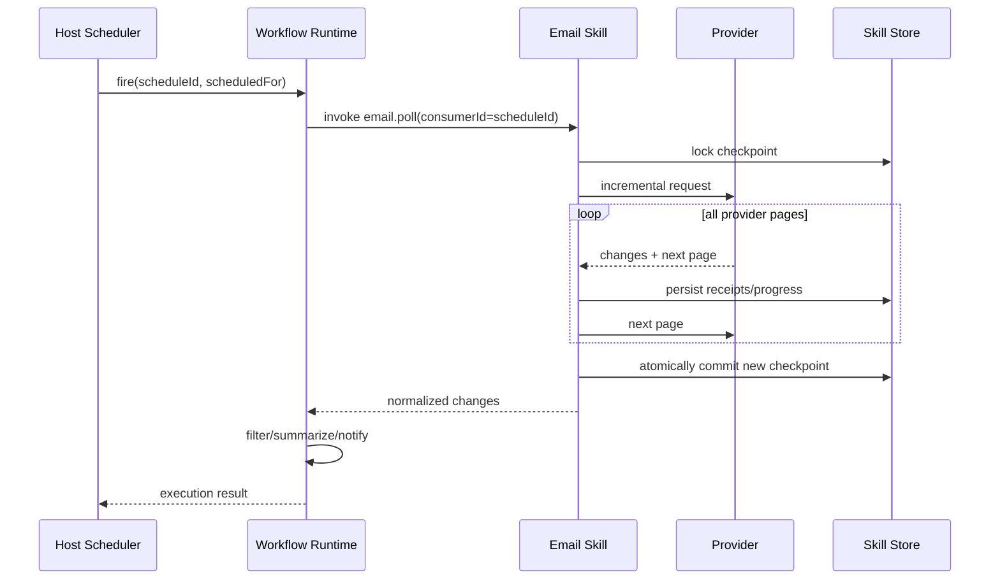
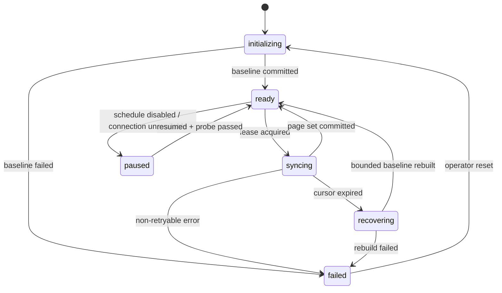
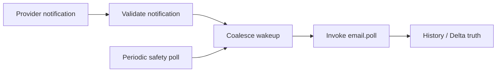

# 04. 定时拉取、增量同步与事件交付

## 1. 总体原则

定时邮件处理分成两个独立责任：

- **宿主调度器**决定何时触发、如何暂停、如何展示执行历史；
- **Email Skill**决定从哪个 Provider Checkpoint 开始、如何分页、如何去重、何时推进游标。

宿主不能保存 Gmail `historyId` 或 Outlook `deltaLink`；Email Skill 不能自建另一套用户可见 Cron 管理系统。

## 2. 调度调用模型

宿主把定时任务作为普通已发布 Saved Skill / Workflow 运行，其中确定性调用 `email.poll`：



推荐调用上下文：

```json
{
  "executionContext": {
    "executionId": "exe_...",
    "stepId": "poll_inbox",
    "attempt": 2,
    "consumerId": "schedule_...",
    "trigger": "schedule",
    "scheduledFor": "2026-09-02T01:00:00Z"
  }
}
```

`consumerId` 必须在同一个定时任务的多次执行间稳定。不能使用每次变化的 `executionId` 作为 Checkpoint Key。

## 3. 为什么每个 Consumer 独立 Checkpoint

同一邮箱可能同时存在多个自动化：

- 每 10 分钟检查客户投诉；
- 每天汇总财务邮件；
- 每小时提取带附件的订单。

如果它们共用一个邮箱级游标，先运行的任务会推进游标，其他任务就会漏信。因此检查点唯一键至少为：

```text
orgId + connectionId + folderKey + consumerId + syncContractVersion
```

筛选条件是否进入 Key 有两种模式：

1. 推荐：同步所有元数据变化，工作流在输出后筛选；Checkpoint 与过滤条件无关；
2. 若 Provider 原生增量协议支持且确认不会漏数，才允许把稳定 Filter Hash 纳入 Key。

首期采用第一种，保证行为简单可验证。

## 4. Checkpoint 数据模型

### 4.1 `email_skill_sync_checkpoints`

| 字段 | 说明 |
| --- | --- |
| `id` | Skill 内部 ID |
| `org_id` | 租户隔离键 |
| `connection_id` | 邮箱连接 |
| `consumer_id` | Schedule / Workflow 的稳定消费者 ID |
| `folder_key` | 首期固定 `inbox` |
| `provider` | Gmail / Outlook |
| `sync_contract_version` | Checkpoint 解释版本 |
| `committed_cursor_ciphertext` | 已提交 historyId / deltaLink |
| `working_cursor_ciphertext` | 长分页中间状态，可为空 |
| `state` | 状态机 |
| `generation` | 乐观锁版本 |
| `baseline_completed_at` | 基线建立时间 |
| `last_started_at` | 最近尝试 |
| `last_committed_at` | 最近成功推进 |
| `last_error_code` | 最近错误 |
| `lease_owner/expires_at` | 多实例互斥 Lease |
| `created_at/updated_at` | 审计时间 |

唯一约束：

```text
(org_id, connection_id, consumer_id, folder_key, sync_contract_version)
```

### 4.2 状态机



## 5. Receipt 与去重

### 5.1 `email_skill_message_receipts`

| 字段 | 说明 |
| --- | --- |
| `checkpoint_id` | 所属消费者 Checkpoint |
| `provider_event_key` | Provider 事件或消息版本的稳定哈希 |
| `provider_message_key_hash` | 原始消息 ID 的 HMAC/哈希 |
| `change_kind` | created/updated/deleted |
| `message_ref_id` | 服务端 Ref 映射，可为空 |
| `first_seen_at` | 首次见到 |
| `delivered_execution_id` | 返回给哪个执行 |
| `result_digest` | 规范化结果摘要 |

唯一约束建议：

```text
(checkpoint_id, provider_event_key)
```

Receipt 解决的是 Skill 重试导致的重复结果，不承诺整条工作流的端到端 exactly-once。下游通知、写库仍需要各自的幂等键。

### 5.2 Provider Event Key

- Gmail：可由 `historyId + messageId + changeType + labelId` 规范化后 HMAC；
- Outlook：可由 `delta cycle/page item identity + immutable message id + changeType + selected changeKey/lastModifiedDateTime` 规范化；
- 不把原始 Provider ID 作为日志或指标标签；
- Adapter 版本改变 Key 生成方式时，要提升 `syncContractVersion`。

## 6. Baseline 策略

新建定时任务时，产品必须明确第一次运行是否处理历史邮件。推荐提供两个策略：

```ts
type BaselinePolicy =
  | { mode: "from_now" }
  | { mode: "lookback"; duration: "PT1H" | "P1D" | "P7D" };
```

默认 `from_now`，避免用户一启用任务就处理整个邮箱。

### 6.1 激活前握手

创建/启用定时任务按以下顺序：

1. 宿主验证工作流版本已发布；
2. Email Skill Probe Connection 与 Scope；
3. Email Skill 创建 Checkpoint 并完成 Baseline；
4. Email Skill 返回 `checkpointReady=true`；
5. 宿主激活 Schedule；
6. 宿主审计记录 Baseline Policy 和连接别名。

不能先启用 Schedule 再异步初始化游标，否则第一次 Fire 的语义不确定。

### 6.2 Gmail Baseline

`from_now` 推荐流程：

1. 获取 Gmail Profile 的当前 `historyId`；
2. 保存为已提交 Checkpoint；
3. 后续从该 ID 之后的历史开始处理。

`lookback` 推荐流程：

1. 用受控 `after:` 条件枚举指定时间窗内的邮件；
2. 为历史候选生成初始 Receipt/输出批次；
3. 同时捕获一个明确的 historyId 边界；
4. 完成历史分页后，从边界继续增量；
5. 去重消除枚举和 History 窗口重叠。

实现必须用真实测试验证边界顺序，避免 Baseline 期间到达的新邮件丢失。

### 6.3 Outlook Baseline

Outlook Delta 的初始轮询会枚举当前 Folder 内容后返回 deltaLink。

`from_now` 仍需走到 deltaLink，但不把初始枚举项交付给工作流；只有 deltaLink 提交后才激活 Schedule。

`lookback` 可以在初始枚举项中按 `receivedDateTime` 过滤后交付，但仍需完整完成 Delta 初始化，以获得正确 deltaLink。

如果邮箱很大，Baseline 可能超过普通请求时限。此时由 Email Skill 内部后台初始化状态机完成，控制面轮询状态；不要让一次平台 Activity 长时间占用到超时。

## 7. 单次 Poll 算法

### 7.1 伪代码

```text
authorize(org, actor, connection, permission=sync)
load checkpoint by org + connection + consumer
acquire lease(checkpoint)

if state != ready:
  return explicit state/error

cursor = committed_cursor
working_batch = []

repeat:
  page = provider.continueSync(cursor)
  normalized = normalize(page.changes)
  new_items = insert receipts if absent
  append new_items to working_batch
  persist encrypted working cursor/page progress
  cursor = page.nextCursor
until page.finalCursor or maxChanges/resource budget reached

if finalCursor:
  atomically:
    set committed_cursor = finalCursor
    clear working_cursor
    increment generation
    link receipts to execution
  return working_batch, hasMore=false
else:
  persist continuation progress
  return bounded batch, hasMore=true
```

### 7.2 Checkpoint 提交原则

只有当这些条件全部成立时才推进已提交 Checkpoint：

- Provider 页全部成功获取；
- 变化已规范化；
- Receipt 已持久化；
- 需要的 MessageRef 已建立；
- 输出已能由同一执行可靠重放。

如果平台执行在取得输出后、执行结果持久化前崩溃，同一 Receipt 可能需要再次返回给同一逻辑 Fire。为此宿主应传递稳定 `scheduleFireId`，Skill 可将交付状态绑定到 Fire，而不是仅靠易变 execution attempt。

## 8. 分页、批量和背压

`email.poll` 必须有界：

- 单次最多处理 `maxChanges`，默认 200；
- 单次最长 Provider 时间预算，例如 30 秒；
- 达到预算但 Provider 还有下一页时返回 `hasMore=true`；
- 工作流可以在同一执行中确定性继续调用，也可以由后续 Fire 继续；
- 不允许为了“追平邮箱”无限循环；
- Connection 级限流优先于单个 Schedule 的实时性。

若积压持续增长，应产生 `email_sync_lag_seconds` 和 `email_sync_backlog_hint` 告警，而不是增加无界并发。

## 9. 并发控制

### 9.1 每 Checkpoint Lease

- 同一 Checkpoint 同时只能有一个 Sync Worker；
- Lease 有短 TTL 并支持心跳；
- Worker 只能提交自己持有的 `leaseOwner + generation`；
- 失去 Lease 的 Worker必须停止 Provider 翻页并丢弃未提交工作状态；
- Lease 到期恢复时从已提交 Cursor 或可验证的 Working Cursor 开始。

### 9.2 每 Connection 并发

同一邮箱可以有多个 Consumer，但它们共享 Provider 用户配额。Connection 级 Semaphore 控制总并发，并对交互式读取和后台同步设置公平队列。

建议优先级：

1. Token 刷新/连接恢复；
2. 用户交互读取；
3. 发送；
4. 后台 Poll；
5. Baseline 重建。

发送的优先级不意味着绕过审批或限流。

## 10. 重试与 Schedule 语义

### 10.1 可重试

- Provider 429，尊重 Retry-After；
- 网络连接失败且尚未进入发送提交；
- Provider 5xx；
- Host Artifact/Audit Port 的暂时故障；
- 数据库可恢复冲突。

采用指数退避 + 抖动，并设置最大尝试次数。

### 10.2 不应自动重试

- Connection `reauth_required`；
- 缺 Scope；
- ACL 拒绝；
- Contract 校验失败；
- 发送提交后的未知状态；
- 附件策略拒绝；
- 查询语义不支持。

### 10.3 Misfire

如果服务停机导致多个周期错过，恢复时默认只触发一次 catch-up Poll。因为 Provider 增量同步按游标覆盖变化，不需要为每个错过的 10 分钟窗口执行一次。

宿主调度策略建议：

```text
overlapPolicy = SKIP_OR_QUEUE_ONE
misfirePolicy = FIRE_ONCE_NOW
maxCatchUp = 1
```

## 11. 游标过期恢复

### 11.1 Gmail

当 `history.list` 因 startHistoryId 过旧返回 404：

1. 标记 Checkpoint 为 `recovering`；
2. 获取当前边界；
3. 在可配置 Lookback 窗口内重新枚举消息；
4. 通过 Receipt 去重已交付项；
5. 记录可能无法恢复的时间窗和 Warning；
6. 提交新 historyId；
7. 返回 `ready`。

默认恢复 Lookback 建议 7 天，但这是产品策略，不是无损保证。若组织要求不漏邮件，应缩短 Poll 间隔、监控 Lag，并配置更长受控补偿窗口。

### 11.2 Outlook

当 deltaLink 失效：

1. 标记 `recovering`；
2. 重新进行 Folder Delta 初始化；
3. 对初始快照与近期 Receipt 比对；
4. 产生新增/删除的补偿变化；
5. 到达新 deltaLink 后提交；
6. 对无法判断的更新返回审计 Warning。

## 12. 事件交付

首期 `email.poll` 将变化作为工作流步骤输出，后续步骤可以：

- 结构化过滤；
- LLM 摘要/分类；
- 写入业务系统；
- 发送通知；
- 由人工确认后触发后续动作。

建议每个变化包含稳定 `eventRef`，下游副作用用它构造幂等键：

```text
idempotencyKey = scheduleId + eventRef + downstreamStepStableId
```

不要把 Provider message ID 直接作为全局幂等键，因为不同连接可能重复，Outlook 默认 ID 还可能随移动变化。

## 13. 推送通知的后续演进

### 13.1 原则

Gmail Push Notification 和 Graph Change Notification 都只能作为“有变化，尽快 Poll”的唤醒信号。它们可能重复、延迟或丢失，最终事实仍由 history/delta 决定。



### 13.2 Gmail 后续能力

- 配置 Google Cloud Pub/Sub Topic；
- 调用 Gmail `watch`；
- 至少每 7 天续订，官方建议每日续订；
- 验证 Pub/Sub 身份和消息；
- 按 Connection 合并短时间内重复通知；
- 保留周期性安全 Poll。

### 13.3 Outlook 后续能力

- 创建 Graph Subscription；
- Webhook 按协议及时返回验证 Token；
- 校验 `clientState`；
- 处理 Subscription 到期和 Lifecycle Notification；
- Outlook Subscription 生命周期不足 7 天，需要可靠续订；
- 通知只触发 delta Poll。

首期不实现推送，是为了先验证连接、游标、Receipt、调度和租户隔离这条更关键的正确性链路。

## 14. 推荐调度产品约束

- 默认最小间隔 5 分钟；
- 同一组织大量 Schedule 自动加入稳定 Jitter；
- 连接进入 `reauth_required` 时暂停相关 Schedule，并产生一次用户通知；
- 连续 Provider 暂时失败达到阈值时降频；
- Schedule 删除时默认软删除 Checkpoint，保留短期恢复窗口；
- Schedule 重新创建会产生新 Consumer，不隐式继承旧 Checkpoint；
- 用户若选择继承，必须显式确认并记录审计。

## 15. 官方参考

- [Gmail Synchronize Clients](https://developers.google.com/workspace/gmail/api/guides/sync)
- [Gmail History List](https://developers.google.com/workspace/gmail/api/reference/rest/v1/users.history/list)
- [Gmail Push Notifications](https://developers.google.com/workspace/gmail/api/guides/push)
- [Microsoft Graph Message Delta](https://learn.microsoft.com/en-us/graph/api/message-delta?view=graph-rest-1.0)
- [Microsoft Graph Change Notifications via Webhooks](https://learn.microsoft.com/en-us/graph/change-notifications-delivery-webhooks)
- [Microsoft Graph Subscription Resource](https://learn.microsoft.com/en-us/graph/api/resources/subscription?view=graph-rest-1.0)
- [Microsoft Graph Lifecycle Notifications](https://learn.microsoft.com/en-us/graph/change-notifications-lifecycle-events)

