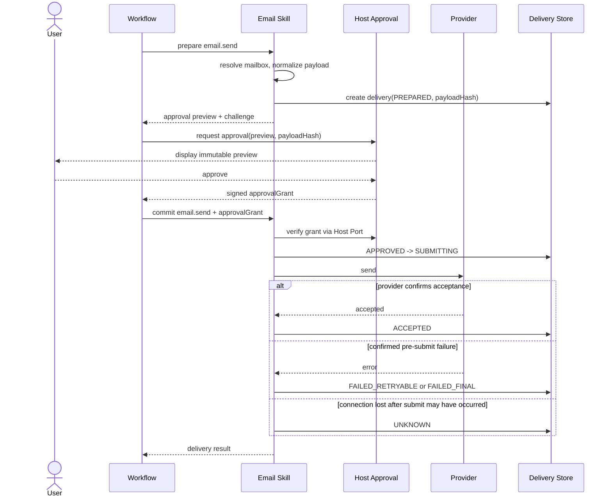
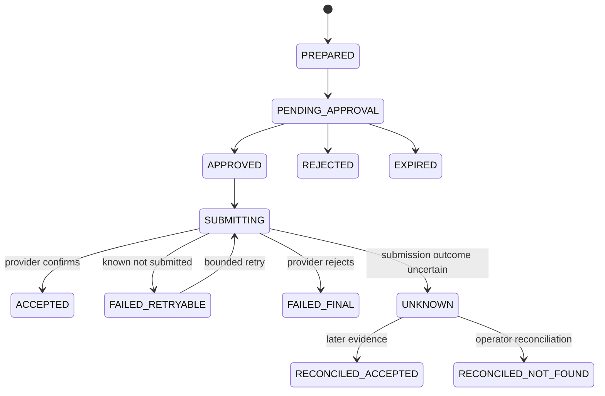

# 05. 发送审批、幂等与未知状态

## 1. 设计立场

邮件读取和邮件发送必须是两个能力。把发送塞进通用 `email` 工具，会使 Planner 的权限边界、审批时点和失败重试变得含糊。

`email.send` 的目标不是承诺 exactly-once delivery——Gmail 和 Microsoft Graph 均未为该调用提供跨超时重试的通用 exactly-once 保证——而是：

- 同一个确定性请求在 Skill 内不会被主动重复提交；
- 审批只对应用户看到的那份不可变 Payload；
- 提交前失败可以安全重试；
- 提交后结果不确定时明确进入 `unknown`，等待人工处置；
- 所有状态变化可审计。

## 2. 两阶段发送



若宿主审批框架只能“调用前审批一次”，也必须确保审批 UI 展示的是 Skill 规范化后的 Preview，并用 `payloadHash` 绑定后续真正发送的数据。

## 3. Payload 规范化

生成哈希前执行：

1. 解析并规范化邮箱地址；
2. 保留收件人顺序或定义稳定排序规则；
3. 规范化主题和正文换行；
4. 明确 `new/reply` 模式；
5. 解析 Reply Ref 到同一 Connection；
6. 读取每个 Artifact 的不可变版本、文件名、大小和 SHA-256；
7. 应用组织发送策略，拒绝不允许的收件人或附件；
8. 生成 canonical JSON；
9. 计算 `payloadHash=SHA-256(canonical JSON)`。

Canonical JSON 版本必须写入记录，例如 `email-send-canonical/v1`。未来改变空格、地址或附件排序规则时提升版本，避免新旧实现对同一 Payload 得出不同哈希。

## 4. Approval Grant

Approval Grant 最少绑定：

```ts
type EmailApprovalBinding = {
  grantId: string;
  orgId: string;
  actorUserId: string;
  connectionId: string;
  capabilityKey: "email.send";
  payloadHash: string;
  canonicalVersion: "email-send-canonical/v1";
  issuedAt: string;
  expiresAt: string;
  approvedBy: string;
};
```

验证规则：

- Grant 必须由宿主 Approval Port 验证，不能只相信客户端传入字段；
- 默认 15 分钟过期；
- Grant 只能用于同一 Delivery；
- Payload 任意变化都要求重新审批；
- 审批人是否允许等于发起人，由组织策略决定；
- 计划任务默认不得交互式发送。

## 5. 发送账本

### 5.1 `email_skill_outbound_deliveries`

| 字段 | 说明 |
| --- | --- |
| `id` | 对外 `deliveryId` 的内部记录 |
| `org_id` | 租户隔离 |
| `connection_id` | 发件 Connection |
| `actor_user_id` | 发起主体 |
| `execution_id/step_id` | 宿主执行上下文 |
| `request_id` | 单次 invoke ID |
| `client_request_key` | 可选业务幂等键 |
| `canonical_version` | Payload 规范化版本 |
| `payload_hash` | 审批和幂等绑定 |
| `payload_ciphertext` | 可选短期密文，不存明文正文 |
| `approval_grant_id` | 已使用 Grant |
| `state` | 发送状态 |
| `provider_submission_id` | 可用时保存，受保护 |
| `provider_message_ref_id` | 可用时保存 |
| `attempt_count` | 提交尝试次数 |
| `last_error_code` | 统一错误码 |
| `prepared_at/approved_at/submitted_at/accepted_at` | 状态时间 |
| `retention_expires_at` | 敏感 Payload 清理时间 |
| `generation` | 并发状态更新版本 |

唯一约束：

- `org_id + request_id`；
- 当 `client_request_key` 存在时，`org_id + connection_id + client_request_key`。

如果同一幂等键携带不同 `payloadHash`，返回 `EMAIL_IDEMPOTENCY_CONFLICT`，不能复用旧结果也不能创建新发送。

## 6. 状态机



关键约束：

- `ACCEPTED`、`UNKNOWN`、`FAILED_FINAL`、`REJECTED` 默认是自动流程终态；
- `UNKNOWN` 不自动进入 `SUBMITTING`；
- 只有能证明请求尚未提交到 Provider 的失败才进入 `FAILED_RETRYABLE`；
- 状态更新使用条件更新或事务，避免两个 Worker 同时发送；
- 取得提交 Lease 后才允许调用 Provider。

## 7. 重试判定

### 7.1 可安全重试的例子

- 解析输入失败前还未进入 `SUBMITTING`；
- 获取 Access Token 失败；
- Provider 限流响应在请求尚未被接受且语义明确；
- DNS/TLS 连接在写入请求前失败，HTTP Client 能可靠证明未发送；
- 本地数据库在提交调用前发生并发冲突。

### 7.2 必须进入 Unknown 的例子

- 已写出完整 HTTP Body 后连接重置；
- Provider 网关超时但服务器可能已处理；
- Graph `sendMail` 返回体丢失或反向代理在 202 后断开；
- Gmail 响应解析失败，但 HTTP 状态和调用完成情况不确定；
- Worker 在 Provider 调用返回与账本写入之间崩溃。

HTTP Client 必须提供请求生命周期信号，不能把所有 `ECONNRESET` 都粗暴归为可重试。

## 8. Gmail 与 Outlook 的确认差异

### 8.1 Gmail

Gmail `users.messages.send` 成功时返回 Message，可记录其内部 Provider ID 并签发 `providerMessageRef`。仍需注意：成功响应是 Gmail 接受消息，不是收件方送达证明。

### 8.2 Outlook

Graph `sendMail` 成功通常返回 `202 Accepted`，不返回 Message。输出应为：

```json
{
  "deliveryId": "edel_...",
  "state": "accepted",
  "providerMessageRef": null,
  "warning": "Provider accepted the request; delivery is not confirmed."
}
```

不能为了寻找 Sent Items 中的消息而用主题/时间模糊匹配并把结果当作确定证据。

## 9. Reply 安全

Reply 比新邮件多一层上下文约束：

- `replyToMessageRef` 必须属于同一组织和 Connection；
- 读取原邮件的 `Message-ID/References/conversationId`；
- 默认回复原始 Sender，不从正文中提取 Reply 地址；
- 若 Provider Header 的 Reply-To 存在，按 Provider 标准处理并在审批预览显示最终地址；
- 不默认 reply-all；
- 原邮件主题和目标收件人必须在预览中可见；
- 对自动回复、群发地址和外部域可增加策略提示。

## 10. 附件安全

发送附件前：

- 只接受不可变 Artifact 版本；
- 校验 Artifact 所属组织；
- 要求扫描状态为 clean；
- MIME 类型、扩展名和内容探测冲突时应用更严格策略；
- 计算附件总大小并预留 MIME/base64 膨胀；
- Payload Hash 绑定内容 SHA-256，而不仅是文件名；
- Provider 提交阶段不重新解析任意外部 URL。

## 11. 定时发送策略

首期默认：`schedule -> email.send` 禁止执行，除非组织管理员显式启用预授权策略。

未来可支持：

```ts
type ScheduledSendPolicy = {
  savedSkillVersionId: string;
  connectionId: string;
  allowedRecipientDomains: string[];
  maxRecipients: number;
  subjectTemplateHash: string;
  attachmentPolicy: "none" | "trusted_generated_only";
  expiresAt: string;
  approvedBy: string;
};
```

预授权绑定已发布、不可变的 Skill 版本，任何模板、收件人范围或附件策略变化都使授权失效。这个能力建议在读取和人工审批发送稳定之后再实现。

## 12. 运营处置

管理面需要提供 Delivery 查询，但默认不展示正文：

- 按 `deliveryId` 查询状态时间线；
- 查看脱敏发件箱、收件人数、域分布、主题摘要哈希；
- 查看审批人、Grant、Payload Hash；
- 对 `unknown` 标记人工确认结果；
- 不提供“无脑重发”按钮；重发应创建新的 Delivery 和新审批；
- 支持导出不含正文的审计记录。

