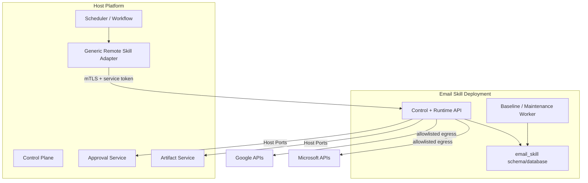

# 06. 部署、宿主集成、可观测性与实施计划

## 1. 部署目标

规范部署形态是独立 Email Skill Runtime：

- 独立进程和容器；
- 独立数据库逻辑 Schema 与迁移；
- 独立 Secret/KMS 配置；
- 固定 Google/Microsoft 出站目标；
- 通过版本化 HTTP 或 gRPC ABI 与宿主交互；
- 可在没有当前平台业务代码的情况下配合 Mock Host 启动和验证。

同进程 Package 模式可以作为开发优化，但不得成为合同定义：它仍必须经过相同的 Invoke DTO、授权、错误映射和 Host Port，不允许直接 import 宿主 Repository。

## 2. 进程与网络拓扑



网络要求：

- 宿主到 Email Skill 使用私网服务发现；
- 双向 TLS 或服务网格身份；
- Email Skill 只允许出站到配置的 Google OAuth/API 和 Microsoft Login/Graph 域；
- 禁止根据 Manifest、用户输入或 Provider nextLink 访问任意 Host；
- nextLink 使用前再次验证 scheme/host 白名单；
- OAuth Callback 是唯一需要公网或网关暴露的入口，单独限流和审计。

## 3. 服务端点

### 3.1 运行面

```http
POST /v1/invoke
POST /v1/invocations/{requestId}/cancel
GET  /healthz
GET  /readyz
GET  /metrics
```

`cancel` 是尽力而为：Provider 请求一旦提交，取消不能被描述为撤销发送。

### 3.2 控制面

控制面端点见连接设计文档。控制面和运行面可以由一个进程提供，但应使用不同路由组、授权 Audience、限流和审计策略。

### 3.3 维护面

```http
POST /internal/v1/checkpoints/{id}/resume
POST /internal/v1/checkpoints/{id}/rebuild
POST /internal/v1/connections/{id}/refresh-probe
POST /internal/v1/keys/rewrap
```

维护端点不面向普通用户或模型，必须使用管理员/运维权限并产生审计。

## 4. 宿主 Runtime Adapter

当前平台应增加或复用一个通用远程 Skill Adapter，而不是创建 `GmailHandler`、`OutlookHandler` 或 `EmailHandler`。

概念接口：

```ts
export class RemoteSkillRuntimeAdapter implements CapabilityRuntimeAdapter {
  readonly routeKey = "workflow:remote-skill";

  supports(manifest: CapabilityManifest): boolean;
  invoke(request: RuntimeStepInvokeRequest): Promise<RuntimeStepInvokeResult>;
  probe(input: RuntimeAdapterProbeInput): Promise<RuntimeAdapterProbeResult>;
}
```

适配器只做：

1. 根据受信部署配置解析 `runtimeRef`；
2. 把平台执行上下文映射为通用 Invoke Envelope；
3. 签发短期 Service Token；
4. 调用远程 Runtime；
5. 将统一结果/错误映射回平台合同；
6. 记录不含业务内容的调用指标。

适配器不解析邮件输入/输出，不保存 Token，不判断 Gmail/Outlook。

## 5. 对当前仓库的最小改动

### 5.1 Runtime Context

当前运行时合同已经包含 `userId` 等追踪字段，但 Email Skill 的多租户和同步场景还需要可信的：

```ts
type ExtendedRuntimeContext = {
  orgId: string;
  actorUserId: string;
  executionId: string;
  stepId: string;
  attempt: number;
  trigger: "interactive" | "schedule" | "api";
  consumerId?: string;
  scheduleFireId?: string;
  timezone?: string;
};
```

这些字段应成为通用 Runtime Contract 的演进，而不是 Email 专用 Header。

### 5.2 Runtime Config

当前 Builtin Skill Runtime Config 适合平台部署级配置，但其全局维度不适合组织级邮箱连接。Email Provider App、Connection、Refresh Token 必须保存在 Skill 自己的数据模型中。

平台部署配置只保存：

```yaml
remoteSkillRuntimes:
  email-skill-runtime:
    baseUrl: http://email-skill-runtime:8080
    audience: email-skill-runtime
    contractVersions:
      - email-skill.invoke/v1
    timeoutMs: 35000
```

`baseUrl` 由运维配置，不由数据库 Manifest 或模型输入覆盖。

### 5.3 Manifest 与目录投影

Email Skill 安装包携带四个 Manifest。平台只投影目录信息：

- 能力名称和描述；
- Input/Output Schema；
- Risk/Approval 元数据；
- `adapterRoute=workflow:remote-skill`；
- `runtimeRef=email-skill-runtime`；
- Suite 版本与兼容范围。

Connection 是否可用是租户运行态，不应通过为每个邮箱复制一份能力 Manifest 表达。

### 5.4 Scheduler

现有 Scheduler 继续触发 Saved Skill。需要保证：

- 从 Execution 关联解析可信 `orgId`；
- 将 Schedule ID 作为稳定 `consumerId`；
- 将本次 Fire 的稳定 ID 作为 `scheduleFireId`；
- 不把 Email Checkpoint 存入 Schedule payload；
- 同一个 Schedule 默认不并发重叠执行 Poll。

### 5.5 Approval 和 Artifact

- `email.send` 使用通用外部写入审批，不新增 Email 专用审批数据库；
- Approval UI 通过合同渲染 Skill 返回的 Email Preview；
- `email.attachment` 和超限正文使用通用 Artifact Service；
- Artifact Service 需要支持敏感级别、TTL、哈希、隔离区和扫描状态。

## 6. 安装包

推荐发布物：

```text
email-skill-suite-1.0.0/
  .codex-plugin-or-skill-manifest/   # 按宿主安装协议映射
  suite-manifest.yaml
  capabilities/
    email.messages.yaml
    email.send.yaml
    email.attachment.yaml
    email.poll.yaml
  contracts/
    *.schema.json
  deployment/
    docker-compose.fragment.yaml
    helm/
  migrations/
  operator/
    google-setup.md
    microsoft-setup.md
    connection-runbook.md
  sbom/
  signatures/
```

安装过程：

1. 验证包签名、SBOM 和兼容版本；
2. 创建 Skill 数据库 Schema；
3. 配置 KMS、服务身份、回调域名和出站策略；
4. 部署 Runtime 并通过 readiness；
5. 平台注册 `runtimeRef`；
6. 导入 Manifest 到能力目录但默认禁用；
7. 使用 Mock Provider 执行合同 Smoke；
8. 管理员配置 Provider App 并做真实 Probe；
9. 按组织逐步启用。

卸载顺序：

1. 禁止新 Invoke；
2. 暂停引用该 Suite 的 Schedule；
3. 等待运行中调用结束；
4. 撤销/删除 Provider Token；
5. 移除能力目录投影和 `runtimeRef`；
6. 数据按保留策略归档或销毁；
7. 保留不含正文/Token 的审计证明。

## 7. 配置分层

| 层级 | 示例 | 所有者 |
| --- | --- | --- |
| 构建配置 | 支持的合同版本、Provider Adapter 版本 | Skill 发布方 |
| 部署配置 | 数据库、KMS、Host Port、出站域、Runtime URL | 运维 |
| 组织配置 | Provider App、允许域、发送策略、保留期 | 组织管理员 |
| 用户配置 | Connection、mailboxKey、默认读/发邮箱 | 邮箱用户 |
| 工作流配置 | 查询条件、Baseline Policy、Schedule | 工作流作者 |

敏感配置不能通过工作流参数下传。

## 8. 健康检查

### 8.1 Liveness

`/healthz` 只验证进程事件循环/线程池仍可工作，不访问 Provider。

### 8.2 Readiness

`/readyz` 验证：

- 数据库连接与迁移版本；
- KMS/加密能力；
- Host Service Credential 可签发/验证；
- Provider Adapter 注册完整；
- 关键后台 Worker 状态；
- 不要求每个客户 Connection 都健康。

### 8.3 Connection Probe

连接级 Probe 独立运行，读取最小身份/Profile，并报告真实 Scope 能力。不能因为 Google/Microsoft 公网暂时不可用而让整个 Runtime 退出 Ready；应通过 Provider 指标和熔断反映。

## 9. 可观测性

### 9.1 指标

建议指标：

```text
email_skill_invocations_total{capability,provider,status,error_code}
email_skill_invocation_duration_seconds{capability,provider}
email_provider_requests_total{provider,operation,status_class}
email_provider_request_duration_seconds{provider,operation}
email_provider_rate_limited_total{provider,operation}
email_token_refresh_total{provider,result}
email_connections_total{provider,state}
email_sync_runs_total{provider,result}
email_sync_lag_seconds{provider}
email_sync_changes_total{provider,kind}
email_sync_receipt_deduplicated_total{provider}
email_outbound_deliveries_total{provider,state}
email_artifact_bytes_total{direction,provider}
```

禁止作为 Label：`orgId`、邮箱地址、主题、message ID、connection ID、schedule ID。这些高基数或敏感值只允许存在于受控 Trace/Event 字段中，且默认哈希/脱敏。

### 9.2 Trace

Trace Span 建议：

```text
email.invoke
  email.authorize
  email.connection.resolve
  email.token.refresh
  email.provider.list/search/get/send/sync
  email.normalize
  email.artifact.put
  email.checkpoint.commit
```

可记录：Provider、operation、HTTP status class、重试次数、页数、字节数、统一错误码。

不可记录：Token、Authorization Header、OAuth code/state、正文、主题、收件人完整地址、Provider nextLink/deltaLink。

### 9.3 审计事件

```ts
type EmailSkillAuditEvent = {
  eventId: string;
  eventType:
    | "provider_app.created"
    | "provider_app.secret_rotated"
    | "connection.created"
    | "connection.reauthorized"
    | "connection.revoked"
    | "message.read"
    | "attachment.imported"
    | "send.prepared"
    | "send.approved"
    | "send.submitted"
    | "send.state_changed"
    | "checkpoint.initialized"
    | "checkpoint.advanced"
    | "checkpoint.rebuilt";
  orgId: string;
  actorUserId?: string;
  connectionRef?: string;
  executionId?: string;
  occurredAt: string;
  metadata: Record<string, string | number | boolean>;
};
```

Skill 通过 Outbox 或 Host Audit Port 交付，不能因审计服务短暂不可用而悄悄丢事件。

## 10. 版本策略

独立版本：

| 版本 | 作用 |
| --- | --- |
| Suite Version | 发布包整体版本 |
| Invoke Contract Version | 宿主与 Runtime ABI |
| Capability Schema Version | 各能力输入/输出 |
| Provider Adapter Version | Provider 行为实现 |
| Sync Contract Version | Cursor/Receipt 解释方式 |
| Canonical Payload Version | 发送 Payload Hash |
| Database Schema Version | Skill 自有迁移 |

兼容规则：

- Runtime 同时支持当前和前一个 Invoke 主版本的迁移窗口；
- 能力 Schema 只做向后兼容字段增加，破坏性变更发布新版本；
- Sync Contract 破坏性变化新建 Checkpoint 或执行显式迁移；
- 发送 Canonical Version 不能原地改变旧 Delivery 的哈希解释；
- Provider SDK 升级必须跑 Adapter 合同回归。

## 11. 实施阶段

### P0：独立骨架与合同

- 建立 `skills/email` 独立目录；
- 定义 Invoke、错误、Host Port 和四个能力 Schema；
- 实现 Mock Host 与 Mock Provider；
- 实现通用 Remote Skill Runtime Adapter；
- 完成独立启动、Probe 和合同测试。

退出标准：Email Skill 不导入平台 ORM/Service，也能在 Mock Host 下运行。

### P1：Provider App 与 OAuth

- 自有 Schema、迁移、Repository；
- KMS/信封加密；
- Google、Microsoft OAuth + PKCE；
- Connection ACL、状态机和真实 Probe；
- 管理 API 与最小管理 UI。

退出标准：两个 Provider 都能完成连接、刷新、撤销和重新授权。

### P2：读取与搜索

- `email.messages`；
- Gmail list/search/get/MIME；
- Outlook list/search/get/ImmutableId；
- Ref、Cursor、正文清洗和敏感 Artifact；
- Provider 限流与错误映射。

退出标准：统一合同测试对两个 Provider 产生等价业务结果。

### P3：发送

- `email.send` Prepare/Commit；
- 宿主 Approval Port；
- Delivery Ledger 和状态机；
- Gmail send、Graph sendMail/reply；
- Unknown 运营处置。

退出标准：审批 Payload 变更无法发送，重试不会自动复制 Unknown 请求。

### P4：附件

- `email.attachment`；
- 流式下载、大小限制、哈希；
- Artifact 隔离与扫描；
- Gmail/Outlook 大附件边界测试。

### P5：定时增量

- `email.poll` runtime-only；
- Checkpoint、Lease、Receipt；
- Gmail History、Outlook Delta；
- Baseline、Cursor Expiry Recovery；
- 宿主 Schedule `consumerId/scheduleFireId` 传递。

### P6：推送唤醒（可选）

- Gmail Pub/Sub + Watch Renewal；
- Graph Webhook + Subscription Renewal；
- 通知去重、Lifecycle 处理和安全 Poll；
- 不改变 `email.poll` 事实来源。

## 12. 发布策略

1. 开发环境使用 Mock Provider；
2. 集成环境各准备一个专用 Gmail / Microsoft 365 测试租户；
3. 首批只启用读取；
4. 再启用附件；
5. 发送只对内部测试组织启用并强制审批；
6. 增量同步先 15 分钟间隔 Shadow，比较人工基线；
7. 观察 Provider 错误、重复率、Lag 和 Token 失效率；
8. 逐组织扩大；
9. 推送通知保持后续独立发布。

## 13. 回滚

- Manifest 可回滚到前一兼容版本；
- Runtime 蓝绿部署，同时兼容现存合同；
- 数据库迁移优先 expand/contract，发布阶段不做破坏性删除；
- 新 Provider Adapter 可按组织/连接 Feature Flag 回退；
- Sync 版本升级失败时保留旧 Checkpoint，不覆盖；
- Send 状态记录不可因版本回滚删除或重置；
- 紧急情况下可全局禁用发送而保留读取。

