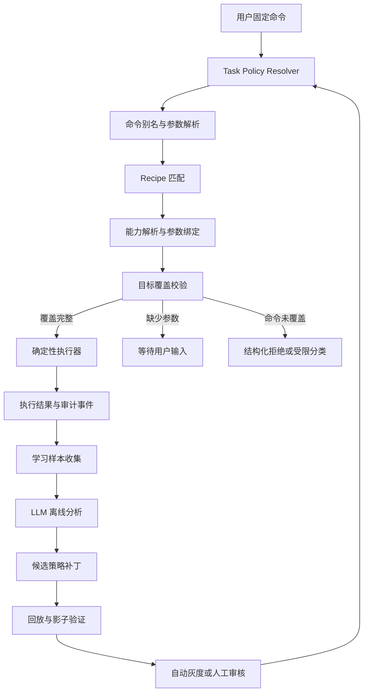

# 任务模式：策略驱动的受限规划器设计

## 1. 背景与目标

任务模式不是通用 Agent，而是受组织、部门、用户权限和已发布能力约束的**固定执行命令下发器**。用户输入的主要作用是选择已发布 Recipe、补齐参数并触发执行，不承担开放式问题求解。

本设计希望同时满足：

- 高频、高一致性任务通过固定 Recipe 执行，减少规划 Token 和运行波动。
- 部门术语、用户习惯、Recipe 触发条件和能力绑定不写死在业务代码中。
- LLM 主要在离线侧分析执行记录、部门表达和用户习惯并提出策略更新，不参与常规命令的在线拓扑决策。
- 每次规划可以解释、回放、审计和回滚。
- 只有全部用户目标均被覆盖并实际完成，执行单才能标记成功。

核心原则：

> 代码固定执行边界，配置表达组织知识，LLM 根据执行证据提出配置更新，验证并版本化后发布。

设计优先级从高到低为：

1. 固定命令可靠下发。
2. Recipe 和能力绑定可配置、可版本化。
3. 多轮结果能够作为下一条固定命令的输入。
4. 完成状态可验证、可审计。
5. LLM 帮助整理和更新策略知识。

复杂否定作用域、开放式意图推理和任意工具组合不属于当前阶段的优先目标。对涉及删除、外发、支付等副作用的简单否定表达，可以继续由风险层做保守阻断；不为此建设通用自然语言理解引擎。

## 2. 系统边界

### 2.1 固定在代码中的执行内核

- 身份、组织和部门权限边界
- 风险等级与审批要求
- 参数 Schema 和输出契约校验
- DAG 调度、超时、重试和幂等
- Recipe 解释与步骤绑定机制
- 目标覆盖和完成声明校验
- 策略版本冻结、审计和回滚机制

这些属于系统不变量，LLM 和业务策略均不能绕过。

### 2.2 配置化的业务知识

- 部门关键词、同义词和标准命令
- 用户习惯表达
- Recipe 及其触发条件
- 能力角色与具体 Skill/Operation 的绑定
- 参数默认值和可信参数来源
- 常用数据源与输出偏好
- 匹配阈值和完成声明

### 2.3 LLM 的职责

- 离线归纳部门关键词、用户习惯和高频成功执行路径。
- 输出符合 Schema 的词典、Recipe 或能力绑定候选补丁。
- 在管理员显式启用时，对无法命中固定命令的表达进行受限分类；分类结果只能选择现有命令，不得生成自由拓扑。
- 离线分析失败、纠正和重复成功样本，生成结构化策略补丁。

LLM 不得直接修改权限、风险、审批和生产策略。

### 2.4 非目标

- 不建设可以自由选择任意工具的通用 Agent。
- 不让 LLM 在生产执行期间创建任意步骤或修改已发布 Recipe。
- 不以覆盖所有自然语言表达为目标；无法可靠映射到固定命令时，应返回可解释错误或请求必要参数。
- 不优先建设完整的否定词、修辞和复杂语义作用域解析器。
- 不仅凭两个字段都是 `string` 就自动拼接能力。

## 3. 总体架构



在线执行和策略学习分离：

- 在线链路以固定 Recipe 为主，追求确定、零拓扑规划 Token 和低延迟。
- 离线链路允许 LLM 做聚类、归纳和补丁建议。
- 策略更新必须经过校验、回放、灰度和版本发布。

## 4. 核心数据模型

### 4.1 策略集 `task_policy_sets`

| 字段 | 说明 |
|---|---|
| `id` | 策略集 ID |
| `name` | 策略名称 |
| `scope_type` | `platform / organization / department / user` |
| `scope_id` | 对应作用域 ID |
| `status` | `draft / shadow / active / retired` |
| `version` | 不可变版本号 |
| `schema_version` | 策略 Schema 版本 |
| `policy_json` | 完整策略快照 |
| `created_by` | 创建人或系统来源 |
| `published_at` | 发布时间 |
| `created_at` | 创建时间 |

同一作用域只能存在一个活动版本。执行单必须保存实际使用的策略集 ID 和版本。

### 4.2 命令别名 `task_command_aliases`

| 字段 | 说明 |
|---|---|
| `policy_set_id` | 所属策略版本 |
| `canonical_command` | 标准命令，如 `web_extract` |
| `alias` | 用户或部门表达，如“看看重点” |
| `match_type` | `exact / phrase / regex / semantic` |
| `weight` | 匹配权重 |
| `source` | `builtin / admin / llm_proposal / user_correction` |
| `status` | 候选、影子或活动状态 |
| `evidence_count` | 支持该映射的证据数 |

示例：

| 作用域 | 表达 | 标准命令 |
|---|---|---|
| 平台 | 总结、归纳、概括 | `summarize` |
| 市场部 | 看看重点、整理舆情 | `summarize` |
| 用户 A | 简单说一下 | `summarize` |

### 4.3 Recipe `task_recipes`

| 字段 | 说明 |
|---|---|
| `recipe_key` | 稳定的 Recipe 标识 |
| `version` | Recipe 版本 |
| `required_commands` | 必须覆盖的标准命令 |
| `optional_commands` | 可选命令 |
| `trigger_json` | 触发条件 |
| `steps_json` | 固定步骤拓扑 |
| `bindings_json` | 步骤输入输出绑定 |
| `completion_claims` | 完成任务所需声明 |
| `risk_level` | Recipe 风险等级 |
| `status` | 发布状态 |

网页提取后总结的 Recipe：

```json
{
  "recipeKey": "web_extract_then_summarize",
  "requiredCommands": ["web_extract", "summarize"],
  "trigger": {
    "all": [
      { "command": "web_extract", "minConfidence": 0.85 },
      { "command": "summarize", "minConfidence": 0.8 }
    ]
  },
  "steps": [
    {
      "ref": "extract",
      "kind": "skill",
      "capabilityRole": "web_extract"
    },
    {
      "ref": "summarize",
      "kind": "llm_operation",
      "capabilityRole": "summarize",
      "dependsOn": ["extract"]
    }
  ],
  "bindings": [
    {
      "target": "summarize.text",
      "source": "extract.text"
    }
  ],
  "completionClaims": [
    "webpage_content_extracted",
    "summary_generated"
  ],
  "finalOutput": "summarize.summary"
}
```

### 4.4 能力角色绑定 `task_capability_bindings`

| 字段 | 说明 |
|---|---|
| `policy_set_id` | 所属策略版本 |
| `capability_role` | 如 `web_extract` |
| `capability_id` | 实际 Skill 或 Operation ID |
| `capability_version` | 冻结的能力版本 |
| `priority` | 同角色候选优先级 |
| `input_mapping_json` | 标准输入到能力输入的映射 |
| `output_mapping_json` | 能力输出到标准输出的映射 |
| `status` | 是否启用 |

示例：

```json
{
  "capabilityRole": "web_extract",
  "capabilityId": "打开网页获取正文-06d741f3",
  "inputMapping": {
    "url": "startUrl"
  },
  "outputMapping": {
    "content": "text",
    "url": "pageUrl"
  }
}
```

通过明确绑定，规划器不再依赖名称或字段正则猜测能力。

## 5. 策略作用域与合并

有效策略按以下优先级解析：

```text
平台基线
→ 组织策略
→ 部门策略
→ 用户习惯
→ 当前请求的显式要求
```

合并规则：

| 配置类型 | 合并方式 |
|---|---|
| 命令别名 | 追加，作用域越小权重越高 |
| Recipe | 相同 `recipe_key` 由更小作用域覆盖 |
| 能力绑定 | 用户、部门、组织、平台依次回退 |
| 默认参数 | 当前请求的显式参数优先 |
| 权限和风险 | 只能收紧，不能放宽 |
| 审批规则 | 只能增加，不能取消 |

用户习惯不能绕过组织权限。例如用户经常说“直接发出去”，也不能因此取消外发审批。

## 6. 在线规划算法

### 6.1 固定命令解析

输入：

```text
打开网页 然后进行总结
```

输出不是开放式语义计划，而是有限的命令选择结果：

```json
{
  "commands": [
    {
      "role": "web_extract",
      "confidence": 0.98,
      "evidence": ["打开网页"]
    },
    {
      "role": "summarize",
      "confidence": 0.96,
      "evidence": ["进行总结"]
    }
  ],
  "parameters": {},
  "relations": [
    {
      "from": "web_extract",
      "to": "summarize",
      "type": "result_dependency"
    }
  ]
}
```

解析顺序：

1. Recipe 名称、命令 ID 或精确别名。
2. 部门词典和已发布的用户习惯。
3. 已知动作短语及其固定顺序。
4. URL、文件、执行单 ID 等参数抽取。
5. 仍有歧义时返回候选命令；只有显式启用时才调用轻量 LLM 做有限分类。

LLM 只能从当前策略允许的命令或 Recipe ID 中选择，不能自由创造能力或拓扑。

当前阶段只需要识别少量会改变安全含义的简单排除表达，例如“不要发送”“不要删除”。复杂否定作用域不进入主规划算法，无法确定时按保守原则不执行副作用步骤。

### 6.2 Recipe 匹配

建议评分：

```text
recipeScore =
  requiredCommandCoverage × 0.50
  + commandConfidence × 0.20
  + entityReadiness × 0.15
  + userHabitScore × 0.10
  + departmentPreference × 0.05
```

决策阈值：

- 必需命令覆盖率小于 100%：禁止执行该 Recipe。
- 分数大于等于 0.90：直接走确定性 Recipe。
- 分数在 0.75 到 0.90：返回候选 Recipe，或进入只选 Recipe 的受限分类。
- 分数小于 0.75：视为不匹配。

### 6.3 能力解析

能力解析顺序：

1. Recipe 显式冻结的能力版本。
2. 用户级能力角色绑定。
3. 部门级能力角色绑定。
4. 组织级能力角色绑定。
5. 平台默认能力。
6. 最后才使用 Schema 做动态候选选择。

找不到能力时必须返回结构化原因：

```json
{
  "code": "RECIPE_CAPABILITY_ROLE_UNRESOLVED",
  "recipeKey": "web_extract_then_summarize",
  "missingRoles": ["web_extract"],
  "resolvedRoles": {
    "summarize": "summarize_text@1.0.18"
  }
}
```

不再统一返回“没有充分匹配的 Skills”。

### 6.4 目标覆盖校验

```json
{
  "goals": [
    {
      "command": "web_extract",
      "producer": "extract",
      "claim": "webpage_content_extracted"
    },
    {
      "command": "summarize",
      "producer": "summarize",
      "claim": "summary_generated"
    }
  ],
  "coverage": 1.0
}
```

校验两次：

- 计划创建前确认每个必需命令均有生产步骤。
- 执行结束前确认每个 Completion Claim 均已满足。

只有全部目标满足，执行单才允许进入 `succeeded`。网页提取成功但总结失败，应标记为 `partially_succeeded` 或 `failed`。

### 6.5 多轮结果接续 DSL

当前项目已经存在 `previousResultData`、`previousResultText`、`previousResultRef` 和单 Skill 接续能力。目标不是重新建设多轮系统，而是将这些入口统一为类型化上下文引用：

```json
{
  "target": "summarize.text",
  "source": {
    "kind": "session_result",
    "selector": "latest_compatible",
    "expectedSemanticType": "content.text",
    "paths": [
      "$.detailText",
      "$.structuredData.text",
      "$.structuredData.summary"
    ]
  }
}
```

支持的来源选择器至少包括：

- `latest_compatible`：最近一个语义类型兼容的执行结果。
- `execution_id`：用户明确指定的执行单。
- `artifact_id`：明确指定的附件或产物。
- `message_reference`：明确引用的历史消息。
- `current_request`：当前命令直接提供的数据。

禁止仅按“上一条结果”盲目绑定。上下文结果必须携带生产执行单、语义类型、Schema 版本、可信等级和创建时间。

### 6.6 基于证据的 Completion Claim

第三方 Skill 不要求原生返回平台 Claim。执行器根据输出契约和执行凭证统一合成 Claim。

数据产出型 Claim 可以通过以下条件自动签发：

- 节点终态成功。
- 输出满足 Schema。
- 必填字段存在且有效。
- 产物引用能够读取。
- 输出不是错误占位内容。

外部副作用型 Claim 不能只依据非空输出签发。例如发送、上传、删除必须包含第三方请求 ID、目标、状态和幂等键等执行凭证。

```json
{
  "claim": "message_send_accepted",
  "producerStep": "send",
  "evidence": {
    "provider": "wechat",
    "requestId": "provider-request-id",
    "recipient": "department-group-id",
    "providerStatus": "accepted",
    "idempotencyKey": "execution-step-key"
  }
}
```

需要区分 `send_requested`、`send_accepted`、`send_delivered` 等不同完成强度，Recipe 必须明确要求哪一种 Claim。

### 6.7 受控的微流水线连接

为了减少 Recipe 组合数量，可以允许 Recipe 使用可复用子链和 Adapter，但不允许任意能力自由拼接。

连接两个节点时必须同时满足：

- 结构类型兼容。
- 语义类型兼容。
- 数据基数兼容。
- 数据可信等级兼容。
- 风险和副作用约束兼容。

推荐使用“Recipe 骨架 + Adapter 自动插入”：Recipe 固定业务顺序和安全边界，类型系统只负责选择能力、绑定字段和插入已审核的数据转换节点。

## 7. LLM 辅助分类与离线策略整理

### 7.1 在线有限分类

在线 LLM 分类默认关闭或仅用于影子决策。启用后，输入只包含用户原文、允许的命令 ID、部门词典和少量候选 Recipe；输出只能选择现有 Recipe：

```json
{
  "recipeKey": "web_extract_then_summarize",
  "confidence": 0.92,
  "matchedCommandAliases": ["打开网页", "进行总结"]
}
```

如果没有足够置信度，返回 `TASK_COMMAND_NOT_RECOGNIZED`，不得让 LLM 自由创建拓扑。

### 7.2 离线策略整理

LLM 可以对失败、纠正、重复成功和部门术语样本进行聚类，提出以下候选补丁：

- 命令别名补丁。
- Recipe 触发规则补丁。
- Role-to-Capability 绑定补丁。
- 参数默认值和来源优先级补丁。
- 高频稳定拓扑转固定 Recipe 的建议。

所有补丁必须经过静态校验、历史回放、影子运行和版本发布，不能直接进入活动策略。

## 8. 用户习惯与策略学习

### 8.1 学习样本来源

只采集具有明确反馈意义的事件：

- 用户明确纠正任务目标。
- 用户重新表述后任务成功。
- 用户或管理员修改规划步骤。
- 固定 Recipe 未命中，但 LLM 规划成功。
- 某个拓扑重复成功达到阈值。
- 能力角色解析失败。
- 用户重复修改相同参数。

普通聊天内容不能直接成为生产习惯。

### 8.2 学习记录

```json
{
  "originalRequest": "打开网页看看重点",
  "originalDecision": {
    "commands": ["web_extract"],
    "result": "incomplete"
  },
  "correction": {
    "request": "我的意思是打开后总结",
    "successfulCommands": ["web_extract", "summarize"]
  },
  "scope": {
    "departmentId": "marketing",
    "userId": "user-a"
  }
}
```

### 8.3 LLM 策略提案

```json
{
  "proposalType": "command_alias",
  "scope": {
    "type": "user",
    "id": "user-a"
  },
  "alias": "看看重点",
  "canonicalCommand": "summarize",
  "confidence": 0.88,
  "evidenceCount": 4
}
```

LLM 只能输出符合策略补丁 Schema 的候选提案。

### 8.4 发布阈值

- 单次纠正：只建立用户级候选。
- 同一用户成功 3 次：进入用户级 `shadow`。
- 同部门至少 5 个用户、累计 20 个成功样本：生成部门级候选。
- 历史回放准确率不低于 95%，且没有权限影响：允许自动灰度。
- 涉及外发、删除、支付、审批：必须人工审核。

样本数量不是唯一依据。部门级提案还必须满足证据来自多个独立用户、跨时间重复出现、纠正后实际执行成功，并且与现有权限和黄金命令不冲突。单一用户重复操作不能直接提升为部门规则。

### 8.5 冷启动与样本污染防护

新组织或部门从经过审核的策略包继承基线，而不是等待积累足够样本：

```text
platform-core
→ organization-common
→ department-template
→ department-active-policy
→ user-habits
```

防护要求：

- 同一用户的重复样本去重或衰减。
- 部门级提案必须具有用户多样性。
- 越权、外发、删除、支付和审批相关规则永不自动晋级。
- 每个提案必须关联原始执行单和纠正证据。
- 被拒绝或回滚的提案降低相似候选的置信度。
- LLM 输出先经过允许字段、作用域和权限差异检查。

策略状态：

```text
candidate → shadow → active → retired
```

## 9. 策略回放与发布门禁

### 9.1 静态校验

- Recipe DAG 无环、无孤立节点。
- 所有能力角色均可解析。
- Binding 的结构类型与语义类型兼容。
- 必需命令和 Completion Claim 均被覆盖。
- 权限、风险和审批规则没有被放宽。

### 9.2 黄金命令回放

基于稳定的固定命令样本比较新旧策略，分别统计 Recipe 命中率、能力选择准确率、参数绑定准确率、目标覆盖率、等待输入准确率、Token 和延迟变化。

高风险指标必须为零容忍：

```text
权限放宽 = 0
审批绕过 = 0
错误外发 = 0
错误删除 = 0
```

### 9.3 历史生产样本回放

对脱敏后的真实任务记录同时运行当前活动策略和候选策略，列出命令、Recipe、能力、参数和风险判断差异。该阶段只规划，不执行。

### 9.4 生产影子运行

候选策略与活动策略并行计算，但只允许活动策略下发执行。影子观察以有效样本量和差异收敛为发布条件，不仅依赖固定天数。

## 10. 可观测性与审计

每次任务至少记录：

```json
{
  "policySetId": "marketing-policy",
  "policyVersion": 12,
  "recipeKey": "web_extract_then_summarize",
  "recipeVersion": 3,
  "matchedAliases": [
    {
      "text": "看看重点",
      "command": "summarize",
      "source": "department"
    }
  ],
  "goalCoverage": 1,
  "selectedCapabilities": [
    "web.extract@2.1.0",
    "summarize_text@1.0.18"
  ],
  "decisionSource": "department_policy"
}
```

需要支持按照执行单还原：

- 使用了哪个策略版本。
- 哪些词汇触发了哪些固定命令。
- 命中了哪个 Recipe。
- 为什么选择这些能力。
- 哪个目标或完成声明未满足。

## 11. 管理接口

```text
GET  /task-policies/effective
GET  /task-policies/:id/versions
POST /task-policies/:id/drafts
POST /task-policies/:id/validate
POST /task-policies/:id/replay
POST /task-policies/:id/publish
POST /task-policies/:id/rollback

GET  /task-learning/proposals
POST /task-learning/proposals/:id/approve
POST /task-learning/proposals/:id/reject

GET  /task-recipes
POST /task-recipes
PUT  /task-recipes/:id

GET  /task-capability-bindings
PUT  /task-capability-bindings/:role
```

5174 管理界面建议提供：

- 平台、组织、部门、用户作用域切换。
- 命令别名管理。
- Recipe 编辑和拓扑预览。
- 能力角色绑定。
- LLM 学习建议审核。
- 历史样本回放。
- 策略版本发布与回滚。

首版管理界面以表单、差异和回放为主，不优先建设任意拖拽拓扑编辑器，避免在契约尚未稳定时引入不可控组合。

## 12. 现有模块改造映射

| 当前模块 | 目标职责 |
|---|---|
| `RoutingPolicyService` | 加载并解析版本化有效策略 |
| `PlanRouteClassifierService` | 消费标准命令解析结果，不维护业务词汇 |
| `DeterministicRecipeMatcherService` | 从 Recipe 注册表匹配，不继续堆叠条件分支 |
| `DeterministicRecipeTopologyBuilderService` | 通用解释 `steps` 和 `bindings` |
| `DeterministicTopologyValidatorService` | 校验目标覆盖与 Completion Claim |
| `PlanningDecisionShadowService` | 记录新旧策略的影子决策 |
| 新增 `TaskPolicyResolverService` | 合并平台、组织、部门和用户策略 |
| 新增 `TaskCommandResolverService` | 将用户表达映射为固定命令、参数和依赖关系 |
| 新增 `TaskContextBindingService` | 统一上一执行结果、附件和显式引用的取数协议 |
| 新增 `CompletionClaimSynthesizerService` | 根据输出契约和外部凭证签发 Claim |
| 新增 `TaskPolicyLearningService` | 聚合证据并生成候选补丁 |
| 新增 `TaskPolicyReplayService` | 使用历史样本验证策略变更 |

## 13. 分阶段落地

### 阶段零：冻结契约与回放基线

1. 定义固定命令解析结果、Recipe Schema、Context DSL 和 Claim Evidence Schema。
2. 明确 Capability Role 的结构类型、语义类型、基数和风险元数据。
3. 从现有黄金用例与脱敏执行记录建立回放集。
4. 记录当前规划器的 Recipe 命中、能力选择、错误率、Token 和延迟基线。

### 阶段一：策略快照只读接入

1. 建立策略集、命令别名、Recipe、能力绑定和审计模型。
2. 将现有关键词与固定 Recipe 导入 `platform-baseline`。
3. 新旧策略同时计算，真实执行仍使用现有路径。
4. 保存不可变策略快照和影子决策差异。

### 阶段二：显式能力绑定与精确错误

1. Recipe 只引用能力角色，不直接依赖 Skill 名称猜测。
2. 建立 Role-to-Capability 及标准输入输出映射。
3. 将能力缺失、参数缺失、上下文缺失和目标未覆盖拆分成独立错误码。
4. 优先切换读取类、无副作用的固定 Recipe。

### 阶段三：多轮 Context 与 Claim 闭环

1. 统一现有 `previousResultData/Text/Ref` 等结果接续入口。
2. 引入类型化 Context Reference 和兼容性选择。
3. 在计划创建前执行固定命令覆盖校验。
4. 在执行器中加入 Schema Claim 与 Provider Receipt Claim 合成。
5. 执行终态由 Claim 聚合结果决定。

### 阶段四：回放发布与管理界面

1. 建立静态、黄金命令、历史生产和生产影子四层门禁。
2. 5174 提供策略查看、别名表单、能力绑定、Recipe 编辑、回放差异、发布和回滚。
3. 暂不提供任意拖拽组合，Recipe 编辑必须通过 Schema 和静态校验。

### 阶段五：LLM 离线学习

1. 收集纠正、重述、固定命令未命中和重复成功证据。
2. 使用 LLM 生成结构化候选补丁。
3. 先启用用户级低风险别名影子学习，再逐步提升到部门级。
4. 权限、审批和副作用相关补丁始终人工审核。
5. 在线 LLM 仅在明确启用时做现有 Recipe 有限分类，不生成自由拓扑。

## 14. 验收标准

- 相同输入、相同策略版本产生相同计划。
- 固定 Recipe 的拓扑规划不消耗 LLM Token。
- 部门词汇更新不需要重新部署服务。
- 用户习惯不会污染其他用户或部门。
- 任何策略变化均可影子验证、审计和回滚。
- 任务完成状态与用户目标覆盖一致。
- 缺少能力时能够指出具体 Recipe 和缺失角色。
- LLM 不能绕过权限、风险、审批和能力发布状态。
- 常规固定命令不调用 LLM 生成拓扑。
- 多轮接续只能绑定类型兼容且来源可追溯的结果。
- 第三方副作用必须具有可审计的执行凭证，不能只凭非空输出宣告完成。
