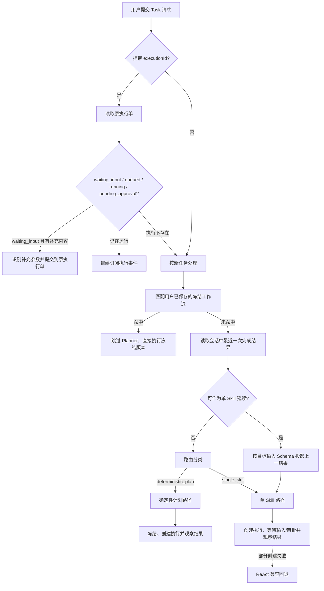

# 企业任务编排现状、调用流程与 Harness 对比

> 文档状态：当前代码基线说明  
> 基线日期：2026-08-24  
> 基线提交：`48986866`  
> 适用范围：Task Mode、AI Planner、Control Plane、Runtime、Capability、Docker 开发栈  
> 相关文档：[目标架构](./02-target-architecture.md) · [设计与落地计划](./03-design-and-implementation-plan.md)

## 1. 文档目的

本文以当前代码而不是历史规划为准，回答以下问题：

1. 当前企业任务系统由哪些功能组成。
2. 简单任务、多步骤任务和已保存工作流分别怎样调用。
3. AI Orchestrator、Control Plane 和 Runtime 的真实职责边界是什么。
4. 当前设计与 Pi Agent、DeepSeek Harness、YC QM 等通用 Harness 的差异是什么。
5. 在企业专用工作流、节约 Token、高复现和准确执行目标下，当前实现的优点和主要缺口是什么。

本文不替代已有的确定性计划、能力契约和发布治理专题设计，而是为这些文档提供统一的现状入口。

## 2. 系统定位

当前项目不是一个单纯的对话 Agent，也不是一个只依靠模型循环调用工具的 Agent Harness。它正在形成一套企业级技能和工作流平台，其核心链路是：

```text
用户意图
  -> Skill / Workflow 选择
  -> 参数识别与计划生成
  -> Release / Capability Contract 校验
  -> Execution 创建与冻结
  -> Runtime 调度执行
  -> 事件、产物、结果与审计
```

系统的主要质量目标是：

- 企业身份、权限、组织和租户边界可治理。
- 已知业务流程尽量不重复调用模型。
- 生成式计划必须受到能力目录、Schema 和版本约束。
- 执行阶段尽可能确定性、可恢复、可审计。
- 后续新增业务能力时不破坏 Planner 和 Control Plane。

## 3. 当前功能组成

### 3.1 体验与接入层

主要组成：

- `apps/frontend/user-web`：用户任务入口、Task Mode、执行状态和结果展示。
- `apps/frontend/portal`：平台管理、能力配置、发布和运维入口。
- Office Add-in、桌面端、移动端等其他交互入口。

Task Mode 的核心后端入口位于：

- `apps/backend/intelligence/ai-orchestrator/src/modules/chat/chat.controller.ts`
- `apps/backend/intelligence/ai-orchestrator/src/modules/chat/chat-orchestrator.service.ts`

### 3.2 Intelligence 平面

当前主要由 `ai-orchestrator` 承担：

- 对话上下文和历史结果读取。
- 已保存工作流快速匹配。
- 单 Skill 匹配和参数识别。
- 固定 Recipe 匹配。
- 受限多节点拓扑生成。
- 上一任务结果到下一能力输入的投影。
- LLM Operation 注册、版本、评测和调用。
- ReAct 探索式执行兼容路径。
- SSE 执行观察和结果展示归一化。

当前主编排入口为：

```text
ChatOrchestratorService.handleTaskMode()
```

该方法承担恢复、路由、规划、执行创建、等待输入、审批状态和结果观察等多种职责，是现阶段最重要的编排热点之一。

### 3.3 Registry / Release 与 Platform 平面

主要组成：

- Skill Registry。
- Workflow Registry。
- Template Registry。
- Agent Catalog。
- Release Manager。
- Builtin Skill Catalog。
- Temporal Workflow 定义、验证和发布。
- 身份、组织和权限治理模块。

从物理部署看，部分 `governance/*` 和 `registry-release/*` 目前以 Workspace Package 形式被 `platform` 组合加载，而不是全部作为独立服务部署。因此当前形态更接近“有清晰包边界的模块化单体”。

### 3.4 Execution Control 平面

`control-plane` 当前负责：

- Execution 创建、查询、取消和删除。
- 输入补充、审批和人工接管。
- 执行计划冻结和 Plan Hash。
- 权威 Capability Contract 解析。
- Step 创建、租约、推进和恢复。
- Runtime Adapter 路由。
- 执行事件、产物和最终结果保存。
- 保存工作流和定时计划。
- 部分经验学习和反馈数据。

`session-broker` 当前负责：

- Runtime Session。
- 浏览器资源和会话状态。
- 租约、冻结、接管和资源协调。

### 3.5 Capability 与 Runtime 平面

Capability 领域：

- `capabilities/browser-domain`：浏览器模板、语义、录制和领域适配。
- `capabilities/document-domain`：文档模板、内容提取、渲染、报表和产物。

Runtime：

- `runtimes/browser-worker`：浏览器原子动作、CDP/Playwright 和录制运行时。
- `runtimes/replay-worker`：回放、步骤日志和接管辅助。
- `runtimes/sandbox-worker`：动态代码和 Temporal Workflow/Activity 校验执行。
- Temporal Server：承载部分 Workflow/Activity 的持久执行。

### 3.6 共享合同层

`packages/backend-contracts` 已包含：

- Deterministic Plan。
- Runtime Capability Contract。
- Release Manifest。
- Execution Core / Events。
- Agent Execution Protocol。
- Builtin Skill Contract。
- Error Codes 和公共 DTO。

共享合同层是当前架构中非常重要的正向资产，使 Planner、Control Plane 和 Runtime 不必通过深层源码引用共享内部实现。

## 4. Task Mode 当前调用流程

### 4.1 总流程



### 4.2 执行恢复优先

当请求携带 `executionId` 时，系统优先读取现有执行单：

- `waiting_input`：识别本轮补充内容并提交到等待步骤。
- `queued` / `running`：继续观察原执行。
- `pending_approval`：展示审批状态并等待。
- 执行单不存在：降级为新任务规划。

这一顺序避免同一任务被重复创建，是可恢复任务体验的基础。

### 4.3 已保存工作流快速路径

新任务首先尝试匹配用户已保存的冻结工作流：

- 只考虑活动、可执行且至少包含两个步骤的候选。
- 支持名称、别名、习惯和词法匹配。
- 默认匹配阈值为 `0.82`。
- 候选差值小于 `0.08` 时视为歧义，不直接执行。
- 匹配时考虑终态发送、推送等动作覆盖，避免误匹配到相似但缺少最终动作的流程。

命中后直接创建保存工作流对应的确定性执行，不再调用拓扑 Planner。这是当前最节省 Token、最容易复现的路径。

### 4.4 上一结果单 Skill 延续

如果用户表达的是“把上一结果继续总结、转换或处理”，系统会：

1. 读取最近一次完成任务的结果。
2. 尝试匹配一个目标 Skill。
3. 根据目标 Skill 输入 Schema 投影上一结果字段。
4. 参数完整时直接创建单 Skill 执行。
5. 参数不足时进入等待输入或继续常规规划。

当前会话结果摘要允许读取较长文本，结构化结果也可能整体进入后续参数识别上下文，因此仍存在 Token 放大风险。

## 5. 简单任务路径

### 5.1 Skill 匹配

单 Skill 路径通过以下方式选择能力：

1. 用户显式指定 Skill 时优先确定性匹配。
2. 调用 Skill Match 服务进行语义匹配。
3. 应用置信度门槛。
4. 必要时使用关键词兼容回退。
5. 无可靠匹配时返回 `CAPABILITY_NOT_FOUND`，不创建执行单。

### 5.2 参数识别

匹配后系统执行：

- 用户文本参数识别。
- 上传文件参数注入。
- 上一结果字段投影。
- 默认值应用。
- 必填字段检查。
- Waiting Input 语义和展示信息生成。

### 5.3 执行创建

参数完整后提交到 Control Plane：

- 低风险任务进入 `queued`。
- 需要人工审查的任务进入 `pending_approval`。
- 缺少阻塞参数时进入 `waiting_input`。
- Control Plane 根据 Runtime Adapter 调用实际执行方。

### 5.4 当前问题

- 单 Skill 路径和确定性计划路径的风险/审批处理还未完全统一。
- 部分单 Skill 创建失败后会隐式回退到 ReAct，改变原有执行边界。
- “没有匹配能力”与“匹配成功但执行创建失败”的回退语义不完全一致。

## 6. 多步骤确定性计划路径

### 6.1 当前路由判断

当前路由器输出只有：

```typescript
type PlanRouteType = 'single_skill' | 'deterministic_plan';
```

路由器会计算：

- sequential signal。
- processing signal。
- artifact signal。
- document source signal。

但当前真正进入确定性计划的主要条件是：

```text
artifact || processing
```

因此“简单/多步”并不完全由实际步骤数、已知流程、风险或能力组合决定，而仍然依赖有限的文本信号。这是当前规划准确性的主要短板之一。

### 6.2 候选能力筛选

确定性规划只选择满足以下条件的能力：

- 存在可执行版本。
- 已发布。
- 已部署。
- 声明权威输出 Schema。
- 用户有权访问。

Skill 候选最多保留 12 个，并投影成紧凑 Routing Card。LLM Operation 也会以紧凑卡片加入候选目录。

### 6.3 Recipe 优先

系统优先匹配固定 Recipe，例如：

- PDF 提取。
- 搜索后总结。
- 搜索、总结并生成 Markdown。
- 已知的文档处理组合。

若 Recipe 无法覆盖用户显式指定的 Skill 或终态业务动作，才调用拓扑规划模型。

### 6.4 受限拓扑规划

LLM 拓扑 Planner 受到以下限制：

- 只能使用传入的 Capability Key。
- 不得虚构能力。
- 节点数限制为 1～6。
- 依赖只能指向前置节点。
- 最多使用 3 个 LLM Operation。
- 必须给出匹配决策、置信度和原因。
- 外部查询、发送、推送等动作必须由真实 Skill 完成。
- LLM Operation 只能承担提取、总结、翻译、转换等受控内容处理。

### 6.5 参数绑定

拓扑确定后，系统按以下来源绑定参数：

1. 系统和上传输入。
2. 用户指令中的显式字面量。
3. 上游节点输出。
4. 上一任务结果。
5. 参数识别模型。
6. Capability 默认值。
7. 仍缺失的必填输入。

### 6.6 冻结与执行

Control Plane 在执行前重新建立权威性：

- 校验 Skill 的访问权、发布态、部署态和精确版本。
- 从权威目录解析输入输出合同。
- 校验 LLM Operation 版本和 Attestation。
- 校验节点边之间的 Schema 兼容性。
- 对齐最终输出。
- 计算 Plan Hash。
- 在数据库事务中保存 Execution Plan 和 Steps。

执行时再次校验：

- Plan Hash 是否一致。
- Frozen Contract Digest 是否一致。
- 节点输入是否满足 Schema。
- 节点输出是否满足 Schema。
- 最终输出是否完整。

当前计划模型支持 DAG 表达，但 Scheduler 实际按 `stepIndex` 串行推进。串行提高了稳定性，但需要在语义上明确它目前不是通用并行 DAG 引擎。

## 7. 当前 Control Plane 与 Execution Plane 边界

### 7.1 设计意图

理想边界是：

- Control Plane：状态、审批、冻结、调度决策、审计。
- Session Broker：资源会话和租约。
- Runtime：真正执行浏览器、文档、代码和 Workflow 动作。

### 7.2 当前实际边界

当前 Runtime 的物理动作已经南向下沉，但 Control Plane 仍在同一 API 进程中承担：

- Execution API。
- 定时任务扫描。
- Ready Step 选择。
- Step Lease。
- Runtime Adapter 调用。
- 递归推进。
- 启动恢复扫描。

因此当前形态是“执行动作分离，执行驱动未完全分离”。

### 7.3 当前持久化和高可用特点

正向能力：

- Step 使用数据库 Lease 防止同时执行。
- 过期 Lease 可重置。
- 服务启动时扫描未完成计划。
- Plan Hash 和合同校验可阻止错误恢复。

主要缺口：

- 新执行通过进程内异步触发开始推进。
- 恢复扫描主要发生在服务启动时，不是持续 Dispatcher。
- Cron 的 `FOR UPDATE SKIP LOCKED` 查询没有覆盖领取和创建执行的完整事务。
- Cron 更新与 `ExecutionService.create()` 当前未共享同一个 Prisma Transaction Client。
- Control Plane API 无法与 Dispatcher 独立扩容和隔离故障。

## 8. 当前 Docker 组织

### 8.1 统一入口

所有 Compose 操作统一通过：

```text
./docker/start-smart.sh
```

它负责：

- 解析当前真实仓库路径。
- 设置 `PROJECT_ROOT`。
- 加载 `docker/.env`。
- 解析 dev、infra、test、addin 和兼容分层模式。
- 检测可能的混合 Compose 栈。
- 必要时创建共享网络。

### 8.2 默认开发栈

`docker-compose.base.yml` 当前包含约 18 个服务，覆盖：

- PostgreSQL、Redis。
- Platform、Control Plane、Session Broker。
- AI Orchestrator。
- Browser Template、Browser Semantics。
- Browser Worker、Browser Chrome。
- Document Domain、Report。
- Temporal、Temporal UI、Sandbox Worker。
- Portal、User Web。
- Workspace 依赖和数据库迁移初始化 Job。

### 8.3 正向能力

- Compose 挂载强制要求 `PROJECT_ROOT`。
- Workspace 依赖安装在其他服务启动前完成。
- PostgreSQL、Redis 和 Browser Chrome 有基础健康检查。
- 已存在 core/planner/runtime/experience 分层验证。
- 已存在 Compose 和 Shell 静态校验。
- 默认开发栈与分层服务集合当前保持一致。

### 8.4 当前不足

当前 Compose 主要面向开发而不是不可变生产部署：

- 多数服务挂载整个仓库。
- 服务启动时现场 build，部分服务使用 watch/dev。
- 安装依赖时使用 `--no-frozen-lockfile`。
- Python 依赖使用范围版本而不是锁定版本。
- 基础镜像多为可漂移标签。
- 应用服务健康检查和 restart 策略不完整。
- 大量固定 `container_name` 阻碍 Compose 多副本扩容。
- 大量内部服务端口直接暴露宿主机。
- Control、Runtime、Data 共用单一网络。
- Browser/Sandbox 运行时挂载 Docker Socket，权限边界较高。
- base Compose 与 legacy 分层 Compose 重复定义服务配置；现有校验主要验证服务集合，不验证全部配置完全一致。

## 9. Token、复现和准确执行现状

### 9.1 已有节省机制

- 保存工作流命中后跳过 Planner。
- 固定 Recipe 优先于 LLM 拓扑。
- 单 Skill 快速路径不调用拓扑 Planner。
- Capability 候选数量受限。
- 只向拓扑模型提供紧凑 Routing Card。
- 参数识别只针对已选择节点继续处理。

### 9.2 主要 Token 风险

- 候选上限 12 对大规模业务目录仍偏高。
- LLM Operation 卡片可能进一步扩大上下文。
- 上一结果长文本和结构化对象可能整体进入下一轮规划。
- Planner、参数识别和结果展示可能产生多次模型调用。
- Prompt、候选目录和工具顺序还没有形成统一的缓存快照机制。
- 缺少面向每次执行的计划 Token 预算和调用账本。

### 9.3 复现能力分级

当前需要区分三种复现：

| 层级             | 含义                               | 当前状态           |
| ---------------- | ---------------------------------- | ------------------ |
| 流程可复现       | 相同节点、版本、绑定和状态机       | 较强               |
| 业务效果可复现   | 相同外部数据、幂等副作用和补偿行为 | 部分具备           |
| 字节级结果可复现 | 输出内容逐字节相同                 | 仅确定性代码可承诺 |

即使固定模型和温度，LLM Operation 也不应被承诺为字节级确定性。需要精确结果的步骤必须使用确定性代码或版本化 Skill。

## 10. 与优秀 Harness 的对比

### 10.1 Pi Agent

Pi 是极简且高度可定制的 Agent Harness，强调：

- 小型核心。
- 按需加载 Skill。
- 可定制上下文压缩。
- 树状会话和分支历史。
- 通过扩展构建用户需要的 Plan、权限和工具能力。

参考：

- [Pi 官方网站](https://pi.dev/)
- [Pi Agent Harness 仓库](https://github.com/earendil-works/pi)

适合借鉴：

- 稳定、最小的系统 Prompt。
- Skill 渐进披露。
- 上下文压缩和结果引用。
- Session Tree 和可追溯上下文快照。

不适合直接照搬：

- Pi 的规划主要由 Agent 行为涌现，不是冻结合同。
- 权限和沙箱需要由部署者自行组合。
- 不适合作为企业副作用操作的直接执行权威。

### 10.2 DeepSeek Harness

DSH 强调“一切皆插件”和追加式事件日志：

- Model、Tool、Session、Sandbox、Loop、Scheduler 都是可替换插件。
- 模型看到的输入、工具调用和结果进入统一 Session Log。
- Tool Pipeline 支持前置 Gate、Guard、执行包装和后置处理。
- 可按 Agent 隐藏工具，减少无关 Schema Token。
- Code Mode 用一个执行入口和生成 SDK 代替大量原生工具定义，但不承诺所有场景都必然节省 Token。

参考：

- [DeepSeek Harness 官方仓库](https://github.com/deepseek-ai/deepseek-harness)
- [DSH Architecture](https://github.com/deepseek-ai/deepseek-harness/blob/master/docs/architecture.md)
- [DSH Plan Mode](https://github.com/deepseek-ai/deepseek-harness/blob/master/docs/subsystems/plan.md)
- [DSH Tools](https://github.com/deepseek-ai/deepseek-harness/blob/master/packages/core/tools/README.md)

适合借鉴：

- 注册式扩展接缝。
- 追加式、可重建的事件事实源。
- Tool/Runtime 调用前统一门禁。
- 不同模式只暴露必要能力。
- 保持工具集合和顺序稳定，提高 Prompt Cache 命中。

不适合直接照搬：

- DSH Plan Mode 是软指导，不是可执行合同。
- Agent Loop 不应替代企业工作流状态机。
- 项目仍处于快速演进阶段，不适合整体嵌入生产核心。

### 10.3 YC QM

QM 更接近组织级 Agent 平台，强调：

- 用户、房间和组织作用域。
- 独立 Memory、File、Keychain、Permission 和 Sandbox。
- 公司专有配置与通用核心分离。
- 同一核心可以切换不同 Harness。
- 部署目录精确固定解释它的 QM 版本和依赖锁。

参考：

- [YC QM 官方仓库](https://github.com/yc-software/qm)
- [QM Deployment Directory Contract](https://github.com/yc-software/qm/blob/main/docs/deploy-directory.md)

适合借鉴：

- 组织、团队、用户三级作用域。
- 企业专有配置、Skill 和基础设施与通用核心分离。
- 作用域内存和密钥隔离。
- 部署配置版本固定。

不适合直接照搬：

- QM 的中心仍是组织级 Agent Harness。
- 它不能替代本项目对业务流程版本、参数绑定、审批和确定性执行的要求。

### 10.4 总体对比

| 维度             | Pi                            | DSH                              | QM                       | 当前项目                                 |
| ---------------- | ----------------------------- | -------------------------------- | ------------------------ | ---------------------------------------- |
| 核心定位         | 极简个人 Agent Harness        | 全插件 Agent Harness             | 组织级协作 Agent 平台    | 企业技能与确定性工作流平台               |
| 规划方式         | 模型驱动                      | Agent Loop + 软 Plan Mode        | 可切换 Harness           | Recipe + 受限拓扑 + 冻结计划             |
| 执行权威         | Agent Loop                    | Agent Loop                       | 组织 Agent Core          | Control Plane                            |
| 扩展方式         | Extension / Skill             | Cordis Plugin                    | Deployment Layer / Skill | Package + Registry + Adapter，仍有硬编码 |
| Token 策略       | 极简 Prompt、按需 Skill、压缩 | 隐藏工具、稳定 Schema、Code Mode | Scope 化上下文           | 快速路径、候选压缩、Recipe，仍需结果引用 |
| 重放             | Session Tree                  | Append-only Session Log          | Durable Session          | Plan Hash、合同版本、Step/Event          |
| 企业权限         | 由扩展和部署负责              | 独立 Policy/Sandbox 插件         | 用户/房间/组织作用域     | JWT、RBAC、Approval，数据所有权待收口    |
| 业务副作用确定性 | 弱                            | 弱到中                           | 中                       | 较强                                     |

## 11. 综合评价

| 维度            |   评价 | 说明                                             |
| --------------- | -----: | ------------------------------------------------ |
| 战略方向        | 8.5/10 | 冻结计划和确定性执行适合企业流程                 |
| 规划路由        | 5.5/10 | 二元分类和关键词信号仍然粗糙                     |
| 运行时复现      |   8/10 | 版本、合同、Hash、Lease 基础较强                 |
| Token 效率      |   6/10 | 快速路径较好，结果传递和多次模型调用仍可压缩     |
| 企业治理        |   7/10 | 审批和权限已有基础，作用域与数据所有权仍需加强   |
| 扩展能力        |   6/10 | 目录和合同边界较好，注册方式和中心模块仍偏硬编码 |
| Docker 开发体验 |   8/10 | 统一入口和验证较成熟                             |
| 生产部署成熟度  | 4.5/10 | 仍是源码挂载、启动时构建和共享开发网络           |

总体结论：

> 当前项目不应转向完全开放的通用 Agent Loop。正确方向是保留确定性执行核心，吸收 Pi 的上下文克制、DSH 的插件与事件机制、QM 的组织作用域和部署分层，并把探索式 Agent 限制在流程设计和能力创作阶段。

## 12. 当前主要风险清单

### P0

- 路由器不能稳定区分工作流回放、单能力、固定 Recipe 和生成式计划。
- Control Plane API 与执行 Dispatcher 未分离。
- Cron 多实例领取与执行创建缺少完整原子性。
- 多步骤计划的风险审批没有与单 Skill 完全统一。
- 单 Skill 创建失败后的 ReAct 回退会改变执行边界。
- 开发 Docker 不能作为可复现生产部署。

### P1

- Platform 与 Control Plane 维护相同的完整 Prisma Schema 镜像。
- AI Orchestrator Schema 仍包含并不归它拥有的执行模型。
- Runtime Adapter 和 Builtin Handler 扩展需要修改 Control Plane。
- 上一执行结果缺少字段级引用和按需投影。
- 多个中心 Service 超过仓库文件复杂度阈值。
- Temporal 与自研 Scheduler 的顶层编排关系需要正式定义。

## 13. 代码证据索引

| 能力             | 当前代码位置                                                                                                                 |
| ---------------- | ---------------------------------------------------------------------------------------------------------------------------- |
| Task Mode 总编排 | `apps/backend/intelligence/ai-orchestrator/src/modules/chat/chat-orchestrator.service.ts`                                    |
| 保存工作流匹配   | `apps/backend/intelligence/ai-orchestrator/src/modules/chat/saved-workflow-matcher.ts`                                       |
| 路由分类         | `apps/backend/intelligence/ai-orchestrator/src/modules/planner/routing/plan-route-classifier.service.ts`                     |
| 候选能力筛选     | `apps/backend/intelligence/ai-orchestrator/src/modules/planner/candidate-selection/capability-candidate-selector.service.ts` |
| 确定性计划生成   | `apps/backend/intelligence/ai-orchestrator/src/modules/planner/deterministic/deterministic-plan-generator.service.ts`        |
| 拓扑规划         | `apps/backend/intelligence/ai-orchestrator/src/modules/planner/topology/deterministic-topology-planner.service.ts`           |
| 执行创建         | `apps/backend/execution-control/control-plane/src/modules/execution/creation/execution-create.service.ts`                    |
| 计划冻结         | `apps/backend/execution-control/control-plane/src/modules/execution/plan-runtime/deterministic-plan-freeze.service.ts`       |
| 确定性调度       | `apps/backend/execution-control/control-plane/src/modules/execution/plan-runtime/deterministic-plan-scheduler.service.ts`    |
| Runtime Adapter  | `apps/backend/execution-control/control-plane/src/modules/execution/adapters/`                                               |
| Cron 调度        | `apps/backend/execution-control/control-plane/src/modules/scheduler/scheduler.service.ts`                                    |
| Docker 统一入口  | `docker/start-smart.sh`                                                                                                      |
| 默认开发栈       | `docker/compose/docker-compose.base.yml`                                                                                     |
