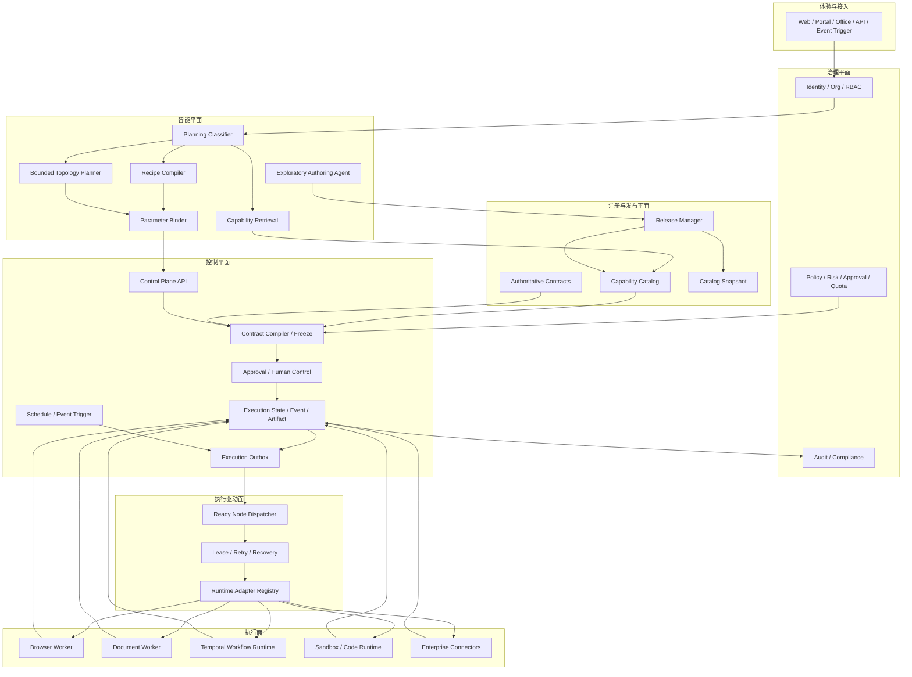

# 企业任务编排目标架构

> 文档状态：目标设计  
> 基线日期：2026-08-24  
> 适用范围：企业专用工作流、Skill、LLM Operation、Control Plane、Runtime、业务扩展包和部署体系  
> 相关文档：[现状与 Harness 对比](./01-current-state-and-harness-comparison.md) · [设计与落地计划](./03-design-and-implementation-plan.md)

## 1. 目标

目标架构需要同时满足：

1. 已知企业流程低成本、稳定执行，不因每次自然语言表达不同而重新规划。
2. 未知组合任务允许使用模型规划，但规划范围受能力目录、Schema、权限和节点数限制。
3. 执行过程可恢复、可审计、可审批、可回滚并支持幂等。
4. 模型参与不削弱生产副作用的安全边界。
5. 新增业务能力时以能力包接入，不修改中心 Planner 和 Control Plane。
6. Token 使用可预算、可归因、可压缩。
7. 开发环境方便，生产环境使用不可变、可验证的构建产物。
8. 支持从当前模块化单体平滑演进，不以一次性微服务拆分为前提。

## 2. 非目标

目标架构不追求：

- 让所有任务都进入自主 Agent Loop。
- 让 LLM 直接拥有付款、发送、删除、写入等业务副作用权限。
- 为了形式上的 DAG 而默认并行所有节点。
- 一次性把每个目录拆成独立微服务。
- 承诺 LLM 输出字节级一致。
- 同时维护两个顶层执行权威。

## 3. 核心原则

### 3.1 规划可以概率化，执行必须合同化

LLM 可以参与：

- 意图理解。
- 能力候选排序。
- 未知组合的最小拓扑生成。
- 参数提取、内容总结和转换。
- 候选 Workflow/Skill 创作。

LLM 不得自行决定：

- 能力真实版本。
- 权威输入输出 Schema。
- 用户是否有权执行。
- 高风险动作是否跳过审批。
- Runtime 路由和内部端点。
- 重试、幂等和补偿规则。

这些信息必须由 Registry、Policy 和 Control Plane 在冻结阶段重新注入。

### 3.2 快速路径优先

统一优先级：

```text
精确执行引用
  > 已保存冻结工作流
  > 单能力确定性匹配
  > 固定 Recipe
  > 受限生成式拓扑
  > 探索型 Agent
```

多步骤不等于必须调用 Planner。一个已发布的十步审批流程应直接回放；一个语义模糊的单步请求可能反而需要模型识别。

### 3.3 探索面与生产执行面分离

探索型 Agent 可以创建：

- 候选计划。
- 候选 Skill。
- 候选 Recipe。
- 参数映射草案。
- 测试 Fixture。

但必须经过：

```text
草案 -> 静态校验 -> 沙箱探测 -> Shadow 回放 -> 人工评审 -> 发布版本
```

发布后才可以进入生产执行目录。

### 3.4 一个顶层执行权威

系统必须正式选择：

- 数据库驱动的 Frozen Plan Dispatcher；或
- 基于 Temporal 的固定 Frozen Plan Workflow。

在迁移完成前，推荐继续以 Control Plane Frozen Plan 为顶层权威，Temporal 作为一种 Capability Runtime。不得让同一执行同时由两套状态机推进。

### 3.5 业务能力通过合同扩展

新增能力必须以版本化 Capability Pack 进入平台，不通过在 Router 中添加关键词、在 Control Plane 中添加 `if/else` 或写死服务 URL 的方式扩展。

## 4. 目标总体架构



## 5. 五级规划分类

目标系统不再使用简单的 `single_skill | deterministic_plan` 二分法，而使用：

```typescript
export type PlanningClass =
  | 'replay_workflow'
  | 'single_capability'
  | 'recipe_plan'
  | 'generated_plan'
  | 'exploratory_agent';
```

### 5.1 L0：Replay Workflow

适用：

- 用户显式指定工作流 ID、名称或别名。
- 定时计划或事件触发已经绑定精确 Workflow Version。
- 高置信度命中用户已审核习惯流程。

行为：

- 不调用拓扑模型。
- 仅校验版本、权限、固定输入和运行参数。
- 重新计算执行输入和 Plan Hash。
- 直接进入审批或调度。

### 5.2 L1：Single Capability

适用：

- 一个能力可以覆盖完整目标。
- 没有未覆盖的终态副作用。
- 参数可以直接识别或补充。

行为：

- 使用确定性索引、别名、语义检索和受限 Matcher。
- 只读取被选能力的完整输入合同。
- 不调用拓扑 Planner。

### 5.3 L2：Recipe Plan

适用：

- 业务组合已知。
- 拓扑固定，仅参数和能力版本可变。
- 例如查询、总结、通知，或提取、渲染、保存。

行为：

- Recipe Compiler 生成拓扑。
- LLM 只可参与参数识别或受控内容处理。
- Recipe 本身版本化、可测试、可灰度。

### 5.4 L3：Generated Plan

适用：

- 能力真实存在，但组合方式未注册。
- 用户目标可在小型候选集中完整覆盖。

行为：

- 先检索 Top 3～6 Routing Card。
- 模型只生成最小语义拓扑。
- 节点数、Operation 数、风险和成本受限。
- 由 Validator、Binder 和 Contract Compiler 重新建立权威性。

### 5.5 L4：Exploratory Agent

适用：

- 当前能力目录无法覆盖目标。
- 任务本身需要探索、创建能力或形成新流程。

行为：

- 在独立沙箱和权限范围内运行。
- 不直接继承生产 Task Mode 的副作用权限。
- 输出候选 Capability/Recipe/Workflow 和测试资料。
- 经评审发布后转为 L0～L3 可执行资产。

## 6. 规划决策合同

每次路由必须持久化：

```typescript
interface PlanningDecisionV1 {
  schemaVersion: 'planning-decision/v1';
  routeClass: PlanningClass;
  routeSource:
    | 'explicit_reference'
    | 'saved_workflow'
    | 'deterministic_match'
    | 'recipe'
    | 'llm_topology'
    | 'exploratory';
  confidence: number;
  reasonCodes: string[];
  candidateIds: string[];
  selectedCapabilityIds: string[];
  catalogSnapshotDigest: string;
  routingPolicyVersion: string;
  routingPolicyDigest: string;
  estimatedModelCalls: number;
  estimatedInputTokens: number;
  tokenBudget: number;
  riskLevel: 'L0' | 'L1' | 'L2' | 'L3';
  requiresApproval: boolean;
  replayability: 'exact' | 'contract' | 'best_effort';
}
```

该对象用于：

- 用户和管理员解释。
- 离线路由评估。
- Token 归因。
- 策略回滚。
- Shadow Planner 对比。
- 习惯学习和 Recipe 晋级。

## 7. Capability Pack

### 7.1 目标结构

```text
business-packs/
  procurement/
    capability-pack.json
    routing/
      cards.json
      examples.jsonl
      negative-examples.jsonl
    contracts/
      input.schema.json
      output.schema.json
    policies/
      risk-policy.json
      permissions.json
      data-policy.json
    runtime/
      adapter-manifest.json
    recipes/
      procurement-summary.recipe.json
    tests/
      contract/
      routing/
      replay/
      fixtures/
```

实际目录可以继续放在 `apps/backend/capabilities/*` 或私有部署仓库中，但必须遵循统一 Manifest。

### 7.2 Manifest 最低字段

```typescript
interface CapabilityManifestV1 {
  capabilityId: string;
  version: string;
  displayName: string;
  lifecycle: 'draft' | 'experimental' | 'certified' | 'production' | 'deprecated';
  inputContractRef: ContractRef;
  outputContractRef: ContractRef;
  routingCardRef: string;
  runtimeRoute: {
    runtimeType: string;
    capabilityType: string;
    adapterRoute: string;
  };
  sideEffectClass: 'none' | 'read' | 'write' | 'external_message' | 'financial' | 'destructive';
  idempotency: {
    supported: boolean;
    keyScope: 'execution' | 'step' | 'business';
  };
  retryPolicyRef?: string;
  compensationCapabilityRef?: string;
  requiredPermissions: string[];
  dataClassifications: string[];
  timeoutMs: number;
  estimatedCost?: Record<string, number>;
}
```

### 7.3 扩展规则

新增能力时不得要求：

- 修改中央 Router 关键词。
- 修改 `RuntimeAdapterRegistry` 构造函数。
- 修改 Control Plane 业务分支。
- 让 Planner 直接了解内部服务 URL。
- 让 Runtime 读取草稿态定义。

新增能力只应要求：

- 发布 Capability Pack。
- 注册 Routing Card 和 Contract。
- 部署或绑定 Runtime Adapter。
- 通过合同、真实探测和安全门禁。

## 8. Control Plane 目标职责

Control Plane API 只负责：

- 接收执行命令。
- 校验用户、组织、权限和幂等键。
- 获取权威 Release/Contract。
- 编译和冻结计划。
- 计算风险和审批状态。
- 创建 Execution、Plan、Step 和 Outbox Event。
- 接收补充输入、审批、取消和人工接管命令。
- 提供执行查询和事件流。

Control Plane API 不负责：

- 进程内递归推进节点。
- 直接进行浏览器或文档业务执行。
- 管理模型规划循环。
- 在请求结束后依赖 `setTimeout` 驱动任务。
- 维护具体 Runtime 端点的硬编码分支。

## 9. Dispatcher 目标职责

Dispatcher 是独立进程角色，负责：

- 消费 Execution Outbox。
- 周期扫描可执行和可恢复节点。
- 根据依赖关系计算 Ready Set。
- 原子领取 Step Lease。
- 定期续租和记录 Heartbeat。
- 调用 Runtime Adapter。
- 按策略重试、退避和熔断。
- 写入步骤结果和推进父执行状态。
- 处理进程死亡后的 Lease 接管。

Dispatcher 不负责：

- 修改冻结计划。
- 重新选择 Capability。
- 重新调用 Planner 改写拓扑。
- 绕过审批。
- 使用 Runtime 返回的自报合同替代权威合同。

## 10. Runtime 目标职责

每个 Runtime 只执行一个受控节点请求：

```typescript
interface RuntimeInvocationV2 {
  executionId: string;
  stepId: string;
  idempotencyKey: string;
  capabilityRef: {
    id: string;
    version: string;
    digest: string;
  };
  contractRef: {
    id: string;
    version: string;
    digest: string;
  };
  input: unknown;
  scope: {
    orgId: string;
    userId: string;
    roles: string[];
  };
  deadline: string;
  traceContext: Record<string, string>;
}
```

Runtime 返回：

- 标准状态。
- 合同化业务输出。
- Artifact Ref。
- Snapshot Ref。
- Retryable 信息。
- Takeover 信息。
- 资源和 Token 使用量。

Runtime 不理解整张拓扑，也不负责父 Execution 状态机。

## 11. 数据所有权

短期可以继续使用同一 PostgreSQL 实例，但需要拆分逻辑 Schema 和数据库角色：

| Schema         | 写入权威                           | 主要数据                                                           |
| -------------- | ---------------------------------- | ------------------------------------------------------------------ |
| `governance`   | Platform/Governance                | 用户、组织、角色、授权                                             |
| `registry`     | Registry/Release                   | Skill、Workflow、Release、Contract、Catalog Snapshot               |
| `execution`    | Control Plane                      | Execution、Plan、Step、Event、Artifact、Approval、Schedule、Outbox |
| `runtime`      | Session Broker/Runtime Coordinator | Runtime Session、Lease、资源状态                                   |
| `intelligence` | AI Orchestrator                    | Model、LLM Operation、Eval、Planning Observation                   |
| `document`     | Document Domain                    | 模板、渲染任务和领域产物元数据                                     |

规则：

- 每张表只有一个写入权威。
- 跨平面读取优先使用 API、事件或只读投影。
- 禁止多个服务维护完整镜像 Schema 并拥有同等写权限。
- 数据库角色按 Schema 授权。
- 所有业务记录携带 `orgId` 或明确的系统作用域。

## 12. Token 预算与上下文设计

### 12.1 稳定前缀

- 系统 Prompt 按版本固定。
- Routing Card 排序固定。
- 同一 Catalog Snapshot 的能力顺序固定。
- 不在稳定前缀中注入时间、随机文本或大段动态状态。
- Prompt、Policy、Catalog 都保存 Digest。

### 12.2 渐进披露

规划阶段只提供：

- Capability ID。
- 名称和短描述。
- 目标语义。
- 输入输出字段摘要。
- 副作用类别。
- 是否产生 Artifact。

只有节点被选择后，服务端才读取完整合同。完整 JSON Schema 不应全部进入拓扑模型上下文。

### 12.3 结果引用

上游和历史结果统一使用：

```typescript
interface ResultRefV1 {
  executionId: string;
  stepId?: string;
  resultType: string;
  schemaRef?: ContractRef;
  availablePaths: string[];
  preview?: string;
}
```

Binder 根据目标输入 Schema 请求字段投影，而不是把完整结果重新放入模型上下文。

### 12.4 Token 预算

每个 Planning Decision 声明：

- 最大候选数。
- 最大拓扑节点数。
- 最大模型调用次数。
- 最大输入和输出 Token。
- 是否允许展示总结模型调用。
- 超预算时的确定性降级行为。

## 13. 可复现执行证明

每个执行应保存 `ExecutionProvenanceV1`：

```typescript
interface ExecutionProvenanceV1 {
  executionId: string;
  planHash: string;
  planSchemaVersion: string;
  plannerVersion?: string;
  planningDecisionDigest: string;
  catalogSnapshotDigest: string;
  routingPolicyDigest: string;
  capabilityRefs: Array<{ id: string; version: string; digest: string }>;
  contractRefs: Array<{ id: string; version: string; digest: string }>;
  llmOperations: Array<{
    operationId: string;
    operationVersion: string;
    promptTemplateDigest: string;
    modelPolicyDigest: string;
  }>;
  environment: {
    imageDigests: Record<string, string>;
    runtimeVersions: Record<string, string>;
    timezone: string;
  };
  externalSnapshots: Array<{ source: string; ref: string; digest?: string }>;
}
```

该证明支持：

- 复盘为什么选择某个能力。
- 重建执行使用的精确合同和版本。
- 判断结果差异来自模型、外部数据还是 Runtime 版本。
- 对关键业务流程提供审计证据。

## 14. 风险、审批和副作用

计划风险由节点和数据共同决定：

```text
Plan Risk = max(Node Side Effect Risk)
          + Data Classification Adjustment
          + Cross-System Adjustment
          + Compensation Availability Adjustment
```

最低规则：

- 纯读取和确定性转换可自动执行。
- 外部发送需要明确接收方和内容预览。
- 写入和更新需要幂等键。
- 财务和破坏性操作必须人工审批。
- 无补偿动作的高风险多步骤计划默认人工审批。
- LLM Operation 不得直接执行高风险副作用。

## 15. Session、Memory 和习惯学习

Memory 必须分作用域：

- 用户私有。
- 团队共享。
- 组织发布。

习惯学习不能直接把高频执行自动提升为生产 Workflow。推荐生命周期：

```text
Observation
  -> Candidate Habit
  -> Candidate Recipe
  -> Shadow Evaluation
  -> Human Review
  -> Published Workflow Version
  -> Monitored Activation
```

每次晋级都保留来源执行、评估数据和回滚版本。

## 16. Docker 与部署目标

### 16.1 开发部署

- 保留 `./docker/start-smart.sh` 唯一入口。
- 使用源码挂载和 watch。
- 使用 `compose.dev.override.yml` 表达开发差异。
- 依赖安装使用冻结 Lockfile；更新依赖必须显式执行。
- 每个服务提供 readiness 和 liveness。

### 16.2 生产部署

- CI 构建不可变镜像。
- 镜像使用 Digest。
- 运行时不挂载源码、不安装依赖、不生成 Prisma Client。
- 数据库迁移为独立 Job。
- API、Dispatcher、Schedule Trigger 和 Runtime Worker 独立扩容。
- 取消固定 `container_name`。
- 只有 Gateway 暴露公网或宿主机端口。
- Control、Runtime、Data、Observability 使用隔离网络。
- Docker Socket 不直接暴露给业务容器；使用受限 Runtime Supervisor。

### 16.3 推荐 Compose 组织

```text
docker/
  compose/
    compose.infra.yml
    compose.control.yml
    compose.intelligence.yml
    compose.runtime.yml
    compose.experience.yml
    compose.dev.override.yml
    compose.test.override.yml
  images/
    node-service.Dockerfile
    browser-runtime.Dockerfile
    sandbox-runtime.Dockerfile
    document-runtime.Dockerfile
```

服务定义只能有一个权威来源。默认栈通过组合权威片段形成，不再复制一套内容不同但服务名相同的 legacy Compose。

## 17. 建议代码组织

```text
apps/backend/
  execution-control/
    control-plane/
      src/modules/
        execution-command/
        execution-query/
        plan-contract/
        human-control/
        event-outbox/
    execution-dispatcher/
    schedule-trigger/
    session-broker/

  intelligence/
    ai-orchestrator/
      src/modules/
        planning-classifier/
        capability-retrieval/
        recipe-planning/
        generated-planning/
        parameter-binding/
        task-presentation/

  capabilities/
    browser-domain/
    document-domain/
    <future-domain>/

  runtimes/
    browser-worker/
    document-worker/
    workflow-worker/
    sandbox-worker/

packages/
  backend-contracts/
  backend-sdk/
  capability-sdk/
  runtime-sdk/
```

`execution-dispatcher` 和 `schedule-trigger` 初期可以与 Control Plane 共用源码 Package 和数据库 Client，但必须拥有独立启动入口和进程角色。

## 18. 新增业务能力示例

以“采购合同审查并发送审批摘要”为例：

1. Procurement Pack 发布：
   - `procurement.contract.extract`。
   - `procurement.contract.review`。
   - `procurement.approval.submit`。
2. 每个 Capability 声明合同、权限、副作用、幂等和 Runtime Route。
3. 发布固定 Recipe：
   - 提取合同字段。
   - 规则审查。
   - 生成摘要。
   - 提交审批。
4. Router 通过 Recipe 匹配进入 L2，不调用拓扑模型。
5. Contract Compiler 冻结精确版本。
6. 因终态为外部写入，Plan 进入审批。
7. Dispatcher 逐节点调用 Document、Rule 和 Approval Runtime。
8. 每个节点输出按合同验证并保存 Artifact Ref。

新增该业务不应修改中央 Chat Orchestrator、Runtime Adapter Registry 或 Control Plane 的业务判断。

## 19. 目标架构验收标准

达到目标形态至少需要：

- 90% 以上常见企业请求走 L0～L2，不调用拓扑 Planner。
- 生成式计划只看到 Top 3～6 紧凑候选。
- 每次路由都有 Planning Decision 记录。
- 每次生产执行都有 Execution Provenance。
- 所有副作用节点有幂等和风险声明。
- Control Plane API 不再依赖进程内异步调用推进执行。
- 任一 Dispatcher 实例退出后，其他实例能在 Lease 期限内接管。
- 新业务 Capability Pack 接入不修改 Control Plane 核心代码。
- 每张核心表有唯一写入权威和数据库角色。
- 生产容器使用不可变镜像和冻结依赖。
- 同一冻结计划不会被两个顶层调度系统同时推进。
