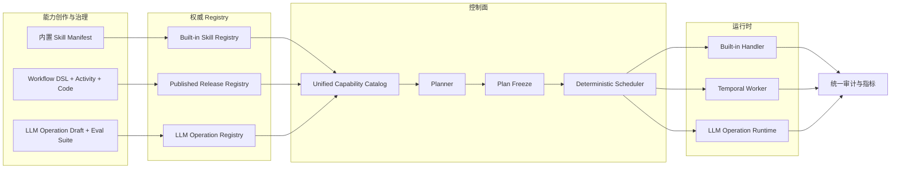

# 三类能力体系与 LLM Operation 可控治理设计

状态：Implementation Proposal

日期：2026-08-03

适用范围：技能管理、Capability Catalog、AI Orchestrator、Control Plane、Temporal Workflow、确定性计划、审计与评测

关联文档：

- `unified-capability-contract-and-validation-design.md`
- `deterministic-task-decomposition-design.md`
- `builtin-workflow-skill-platform-design.md`
- `references/pi-contract-validation-notes.md`
- `three-capability-types-and-llm-operation-implementation-plan.md`

> 2026-08-23 产品化更新：系统规划目录只暴露四个文本 Operation：`summarize_text`、`summarize_list`、`transform_text`、`extract_structured_fields`。意图分类回归路由器内部职责；旧 Markdown 格式化和多源合并退出规划目录但保留历史版本兼容。`transform_text` 接收用户转换指令，仍强制 `tools=disabled`、`externalAccess=denied`、`sideEffects=none`。图片处理暂不进入本期运行合同。

## 1. 结论

平台能力应明确分为三类：

1. **内置 Skill（`builtin_skill`）**：由平台维护、通过固定 Handler 执行的基础业务能力，例如 Markdown 文件生成、通知、文档处理。
2. **编排型 Skill（`published_skill`）**：由 Workflow DSL、Activity 和生成代码构建，经过验证、发布和部署后执行的能力。
3. **LLM Operation（`llm_operation`）**：只依赖模型本身完成的总结、分类、提取、改写、合并等无工具能力。

三类能力共享：

- 统一 Capability Contract；
- 统一 Capability Catalog 投影；
- 统一 Planner 候选卡片；
- 统一冻结引用和摘要；
- 统一执行审计字段；
- 统一输入、输出 Schema 裁决。

三类能力不共享同一套开发和发布生命周期：

- 内置 Skill 使用 Manifest、Provision、Deployment Pointer 和固定 Handler；
- 编排型 Skill 使用 DSL、代码生成、真实验证、Capability Release 和 Temporal Runtime；
- LLM Operation 使用语义签名、Prompt/模型策略版本、评测门禁、Activation Pointer 和受控模型运行时。

LLM Operation 不能继续作为代码中的 Prompt 常量存在，也不应伪装为普通 Skill。它必须成为具有不可变版本、完整摘要、评测凭证、审批记录、运行策略和审计记录的一等能力资产。

## 2. 背景与当前问题

### 2.1 当前三类能力已经存在，但边界不完整

当前项目已经具备三类能力的雏形：

| 类型          | 当前事实源                                            | 当前运行入口                              | 主要问题                                   |
| ------------- | ----------------------------------------------------- | ----------------------------------------- | ------------------------------------------ |
| 内置 Skill    | `BuiltinSkill`、`BuiltinSkillVersion`、Manifest       | Built-in Runtime Adapter / Domain Handler | 已开始独立，但 UI 仍与普通 Skill 混合      |
| 编排型 Skill  | `SkillConfig`、`CapabilityRelease`、Temporal Workflow | Release Runtime / Temporal                | 生命周期较完整，但仍有 Legacy 兼容逻辑     |
| LLM Operation | `LLM_OPERATION_TEMPLATES` 代码常量                    | `/ai/operations/execute`                  | 无数据库版本、无管理 UI、Prompt 更新需发版 |

Capability Contract V2 已经允许：

```text
published_skill | builtin_skill | llm_operation
```

因此本设计不是增加第四套协议，而是把已有的 `llm_operation` 从手写常量提升为受治理资产，并让技能管理页面真实反映三类能力。

### 2.2 当前 LLM Operation Registry 与 Planner 已经漂移

AI Orchestrator 的 `llm-operation.registry.ts` 当前注册了六个 Operation：

- `summarize_list`
- `rewrite_to_markdown`
- `summarize_text`
- `extract_structured_fields`
- `classify_intent_label`
- `merge_multi_source_notes`

但 `capability-candidate-selector.service.ts` 中又手写了一份候选卡片，只包含前四个。

这造成：

- Registry 能执行的能力不一定能被 Planner 选择；
- 新增 Operation 时需要同步修改多个文件；
- 名称、输入输出字段和展示文案可能分别漂移；
- 无法证明 Planner 使用的是权威 Registry 版本。

LLM Operation 候选卡片必须由 Registry 投影生成，不能继续维护第二份手写目录。

### 2.3 Prompt 只是运行制品的一部分

当前冻结字段主要围绕：

```text
promptTemplateId + promptTemplateVersion
```

但实际影响运行结果的完整制品包括：

```text
输入 Schema
+ 输出 Schema
+ System Prompt
+ User Prompt Template
+ Parser / Structured Output 策略
+ Repair Prompt
+ Model Policy 版本
+ Temperature / Token / Stop 参数
+ Safety Policy
+ Provider Request Mode
```

只回滚 Prompt 文本不能恢复旧运行行为。平台必须冻结整个 Operation Version，并计算统一的 `operationDigest`。

### 2.4 AI Activity 直连模型绕过治理

`builtin:aiStructuredTransform` 当前直接调用：

```text
/ai/model/call
```

这条路径没有绑定 LLM Operation 版本，输出 JSON 模式只验证“能够解析 JSON”，没有使用 Registry 中的权威输出 Schema 和完整审计信息。

它会造成：

- 相同模型行为在 Workflow 和确定性计划中有两套实现；
- Prompt、模型策略和 Repair 逻辑无法统一升级；
- Workflow 中的 AI 步骤无法明确显示对应 Operation 版本；
- 运行审计只能看到 Activity，无法看到模型能力制品。

后续应迁移为“确定性计划 LLM Operation 节点 → Control Plane Runtime Adapter → LLM Operation Runtime”。LLM Operation 不得嵌入 Workflow，也不得包装成 Temporal Activity。Workflow 只保留工具调用和外部 I/O；需要组合时，由上层确定性计划把 Workflow/Skill 节点与 LLM Operation 节点连接为兄弟节点。

### 2.5 Capability 类型名称仍存在兼容漂移

Capability Contract V2 使用 `published_skill`，但当前 Control Plane 的
Catalog 本地类型仍出现 `custom_skill`。这不是新增第四类能力，而是旧命名残留。

统一规则：

- 新 Catalog 投影、冻结计划和审计事件只写 `published_skill`；
- 迁移窗口内允许读取 `custom_skill` 并在边界映射为 `published_skill`；
- 不允许 UI、Planner 或 Runtime 继续生成新的 `custom_skill`；
- 兼容读取移除前必须先完成存量数据统计和回放验证。

## 3. 术语和分类

### 3.1 三类顶层能力

#### 3.1.1 内置 Skill

定义：由平台维护、具有固定代码实现和固定 Handler Binding 的能力。

特点：

- 能执行文件写入、通知、文档渲染等副作用；
- 使用版本化 Manifest；
- Runtime 只能调用白名单 Handler；
- 使用幂等键、权限和风险策略；
- 不进入普通自定义 Skill 的 Release 流程；
- 可通过 Deployment Pointer 激活、升级和回滚。

示例：

```text
platform.document.markdown-artifact-writer
```

#### 3.1.2 编排型 Skill

定义：由 Workflow DSL、Activity、生成代码和 Result Builder 组成，经发布后成为可执行 Skill 的能力。

特点：

- 通过 Temporal 实现持久化编排；
- 支持重试、超时、恢复、Replay 和版本共存；
- 必须经过静态检查、Sandbox、真实验证和发布门禁；
- 发布后由 `publishedSkillId + version + contractDigest` 唯一标识；
- 可以组合普通 Activity、内置 Skill 引用和 LLM Operation 引用。

#### 3.1.3 LLM Operation

定义：仅依靠一次或受控少量模型调用完成、不调用 Tool、不访问外部业务系统、不产生业务副作用的语义转换能力。

典型类型：

- 总结；
- 分类；
- 结构化提取；
- 文本改写；
- 多源内容合并；
- 语气或格式转换；
- 受 Schema 约束的内容生成。

LLM Operation 允许调用模型 Provider，但不得：

- 暴露 Tool Definitions；
- 接收或执行模型生成的 Tool Call；
- 隐式访问检索、数据库、文件、浏览器或网络；
- 在 Prompt 内嵌业务密钥；
- 使用未冻结的 Prompt、模型策略或输出契约。

### 3.2 Activity 不是第四类顶层能力

Activity 是 Workflow 的实现原语，负责执行非确定性 I/O。它可以承载：

- HTTP 请求；
- 数据库操作；
- 文档渲染；
- 调用内置 Skill Adapter；

LLM Operation 不属于 Workflow 实现原语。它由 Control Plane 在确定性计划中直接调用独立 Runtime V2；Temporal Workflow DSL、生成代码、Worker 和导出包均不得包含新的模型执行步骤。历史 `aiStructuredTransform` 仅由旧 Worker 在迁移窗口内兼容，不作为新架构入口。

## 4. 设计目标与非目标

### 4.1 必须达到

- 技能管理页面明确显示三类能力。
- LLM Operation 有独立的管理 Tab、API、Registry 和版本模型。
- Prompt 更新不要求重新发布 AI Orchestrator 代码。
- 任何生产 Prompt 修改都会产生新版本，不能原地覆盖。
- Registry 是 LLM Operation 元数据、契约和候选卡片的唯一事实源。
- Planner 只能选择 Registry 返回的 Operation。
- 冻结计划必须绑定精确 `operationId + version + operationDigest`。
- 运行时不得按 `latest` 或 `production` 动态解析版本。
- 输出必须通过权威 JSON Schema。
- 模型请求必须禁用 Tool Call。
- LLM Operation 具备离线 Fixture、真实模型评测、回归对比和发布凭证。
- 每次模型调用可关联执行单、步骤、版本、模型、Token、耗时和验证结果。
- 老冻结计划继续使用老版本，新版本不会改变历史计划行为。
- AI 可以建议 Prompt，但不能自动激活 Production。

### 4.2 非目标

- 不构建通用 Prompt 市场。
- 不允许租户上传任意代码成为 LLM Operation。
- 不把聊天 Agent 的所有 System Prompt 都纳入本期治理。
- 不承诺模型 Provider 更新权重后仍可逐字复现历史输出。
- 不把隐藏思维链作为审计依据。
- 不允许 LLM Operation 直接执行外部动作。
- 不在第一阶段自动优化并自动上线 Prompt。

## 5. 设计原则

### 5.1 统一 Catalog，不统一生命周期

Planner 只消费统一的 `ExecutableCapabilityView`，但 Catalog 是投影层，不反向成为所有底层定义的事实源。

权威来源：

| 类型          | 权威来源                           |
| ------------- | ---------------------------------- |
| 内置 Skill    | Built-in Skill Registry            |
| 编排型 Skill  | Published Release / Skill Registry |
| LLM Operation | LLM Operation Registry             |

### 5.2 Prompt 负责实现，Schema 负责裁决

Prompt 可以告诉模型应该产生什么，但不能成为类型系统。

运行时顺序必须是：

```text
resolve frozen operation version
→ validate input schema
→ render prompt
→ beforeModelCall policy
→ call model with tools disabled
→ parse output
→ optional bounded repair
→ validate output schema
→ persist audit event
→ return RuntimeStepResultV2
```

### 5.3 版本整个 Operation，不只版本 Prompt

每次以下任一字段变化，都产生新 Operation Version：

- Prompt；
- 输入或输出 Schema；
- Parser；
- Repair 策略；
- 模型策略；
- 推理参数；
- Safety Policy；
- 最大输入输出预算。

### 5.4 运行约束必须位于模型之外

以下规则不能依赖 Prompt 自觉遵守：

- 禁用 Tool；
- 输入输出 Schema；
- Token 和超时预算；
- 敏感数据策略；
- 租户权限；
- Repair 次数；
- 审计保留策略；
- 生产版本选择。

### 5.5 可回滚不等于动态读取

`production`、`staging` 等 Activation Pointer 只在创建或重新冻结计划时解析。

计划一旦冻结，只保存：

```text
operationId
operationVersion
operationDigest
modelPolicyVersion
contractDigest
```

运行时不能重新读取 `production` 指针，否则 Prompt 切换会改变已冻结计划和 Temporal Replay 行为。

## 6. 总体架构



### 6.1 服务职责

| 服务            | 职责                                                                  |
| --------------- | --------------------------------------------------------------------- |
| Platform        | Built-in/Published Skill 管理、统一 Catalog、权限投影                 |
| AI Orchestrator | LLM Operation Registry、Prompt 渲染、模型策略解析、模型执行、评测执行 |
| Control Plane   | 计划冻结、契约摘要校验、步骤调度、版本精确调用、结果持久化            |
| Temporal Worker | 只执行 Workflow 与工具型 Activity，不执行 LLM Operation               |
| Portal          | 三类能力管理 UI、Prompt Diff、评测、审批、激活与审计查询              |

LLM Operation 的权威定义由 AI Orchestrator 持有；Platform 的统一 Catalog 只保存或实时获取其只读投影，不复制 Prompt 正文成为第二事实源。

## 7. 统一 Capability Catalog

### 7.1 Catalog 投影结构

```ts
interface ExecutableCapabilityViewV2 {
  capabilityRef: {
    id: string;
    version: string;
    digest: string;
  };
  capabilityKind: 'builtin_skill' | 'published_skill' | 'llm_operation';
  displayName: string;
  summary: string;
  goals: string[];
  inputSchema: JsonSchema;
  outputSchema: JsonSchema;
  runtime: {
    type: 'builtin_handler' | 'temporal' | 'llm_operation';
    executionRuntimeType?: string;
  };
  lifecycle: {
    status: 'active' | 'deprecated' | 'disabled';
    environment?: string;
  };
  governance: {
    attestationId?: string;
    evaluatedAt?: string;
    approvedAt?: string;
  };
}
```

### 7.2 Planner 候选规则

- 候选卡片只能由 Catalog 投影生成。
- Planner 不允许生成或修改能力 ID、版本、Schema 和摘要。
- `llm_operation` 候选必须来自激活版本。
- 未通过评测或无 Attestation 的 Operation 不进入 Production 候选集。
- 候选卡片中的输入输出字段由 JSON Schema 投影生成。
- 删除所有具体 Operation 名称特判和第二份手写列表。

## 8. LLM Operation Manifest

### 8.1 示例

```yaml
apiVersion: platform.ops/v1alpha1
kind: LlmOperation

metadata:
  id: summarize-list
  displayName: 列表摘要
  description: 对列表、搜索结果或文章集合生成结构化 Markdown 摘要
  owner: ai-platform
  tags: [summary, list, markdown]

spec:
  operationVersion: 1.1.0

  signature:
    inputSchema:
      type: object
      additionalProperties: false
      required: [items]
      properties:
        items:
          type: array
          minItems: 1
    outputSchema:
      type: object
      additionalProperties: false
      required: [markdown_content]
      properties:
        markdown_content:
          type: string
          minLength: 1

  prompt:
    type: chat
    systemTemplate: |
      你是专业的总结分析助手……
    userTemplate: |
      请对以下内容做结构化总结：
      {{items}}
    variables: [items]

  response:
    mode: json_schema
    parser: strict_json

  modelPolicy:
    id: task-default
    version: 3
    digest: sha256:...

  inference:
    temperature: 0
    maxInputTokens: 4000
    maxOutputTokens: 4000
    timeoutMs: 180000

  repair:
    enabled: true
    maxAttempts: 1
    promptTemplate: schema-repair-v1

  executionPolicy:
    tools: disabled
    externalAccess: denied
    sideEffects: none

  evaluation:
    suiteRef: summarize-list-core
    suiteVersion: 2
    thresholds:
      schemaPassRate: 1.0
      taskSuccessRate: 0.90
      hallucinationRateMax: 0.02

status:
  phase: candidate
```

### 8.2 模型输出传输与思考档位

- Manifest 使用 `modelOutputMode: text | json` 区分模型传输格式；业务 Output Schema 始终由 Runtime 负责封装和校验，不要求模型为纯文本任务生成 JSON 胶水。
- `summarize_text` 的输出上限为 6000，思考默认关闭，预算优先留给完整业务正文；`finishReason=length` 仍按截断失败处理，不能把残缺正文当作成功。
- 产品层只暴露 `关闭 / 低 / 中 / 高`。供应商适配层负责转换：OpenRouter/OpenAI 使用 effort，DashScope 使用 `enable_thinking + thinking_budget`，Anthropic 新模型使用 adaptive + effort、旧模型使用安全预算，MiniMax 仅支持自适应/关闭时明确降级为开关。
- 若具体模型明确拒绝“关闭思考”，客户端只重试一次并降级到最低共享档位 `low`，同时缓存该模型能力；后续请求直接使用 `low`，不按模型名称维护硬编码名单。
- 供应商不支持某档位时不得透传未知字段；降级必须可预测，并由适配器单测固定协议。

### 8.3 Operation Digest

规范摘要输入必须包含：

```text
canonical(inputSchema)
+ canonical(outputSchema)
+ canonical(prompt)
+ canonical(response/parser)
+ modelPolicy.id/version/digest
+ canonical(inference)
+ canonical(repair)
+ canonical(executionPolicy)
+ evaluation suite ref/version
```

以下内容不进入摘要：

- 展示名称；
- UI 排序；
- 非执行型标签；
- 创建时间；
- 当前 Activation Pointer。

## 9. 数据模型

### 9.1 逻辑表

#### `llm_operations`

保存稳定身份：

- `id`；
- `operation_key`；
- `display_name`；
- `description`；
- `owner`；
- `status`；
- `created_at`、`updated_at`。

#### `llm_operation_versions`

保存不可变版本：

- `operation_id`；
- `version`；
- `definition_json`；
- `input_schema`、`output_schema`；
- `prompt_snapshot`；
- `model_policy_snapshot`；
- `operation_digest`；
- `contract_digest`；
- `source`；
- `change_summary`；
- `created_by`、`created_at`。

任何已进入 `candidate` 的版本不得原地修改。

#### `llm_operation_activations`

保存环境指针：

- `operation_id`；
- `environment`；
- `label`：`staging`、`production`、`canary`；
- `version_id`；
- `activated_by`、`activated_at`；
- `previous_version_id`；
- `rollout_percent`。

该表只保存当前环境指针；每次激活、Canary 调整和回滚另写
`llm_operation_activation_events`，不能依赖覆盖后的当前行还原历史。

#### `llm_operation_eval_suites` / `llm_operation_eval_cases`

保存版本化评测集和单个 Case。

#### `llm_operation_eval_runs`

保存评测运行、模型快照、得分、失败 Case 和对比基线。

#### `llm_operation_invocations`

保存模型调用审计索引。完整输入输出可按数据等级选择脱敏、加密或不落库。

### 9.2 与现有 Attestation 的关系

优先复用平台现有 `CapabilityAttestation` 的通用凭证语义：

```yaml
attestation:
  capabilityKind: llm_operation
  operationDigest: sha256:...
  contractDigest: sha256:...
  evalSuiteDigest: sha256:...
  validatorVersion: 1.0.0
  schemaTests: passed
  offlineEvals: passed
  liveEvals: passed
  securityEvals: passed
```

LLM Operation Registry 保存 `attestationId`，不要复制 Attestation 全部字段形成第二事实源。

## 10. 生命周期和版本策略

### 10.1 状态机

```text
draft
  → validating
  → candidate
  → approved
  → deprecated
  → retired
```

`active` 是某环境 Activation Pointer 派生出的部署状态，不是 Version 自身状态。
同一个已审批版本可以同时被不同环境引用，也可以从 Production 回滚后仍保留为
可审计、可再次激活的已审批版本。

失败状态：

```text
validation_failed
approval_rejected
activation_failed
```

`candidate` 不是人工可直接设置的状态。管理员提交验证后，服务端针对已持久化的精确 Draft 依次执行 Gate 0、Gate 1、Gate 2 并生成 Attestation；只有凭证成功落盘，才自动从 `validating` 进入 `candidate`。任一门禁、模型调用或凭证写入失败都进入 `validation_failed`。该状态允许修订并保存回 `draft`，也允许在 Digest 未变化时重试验证。

### 10.2 版本规则

使用语义版本：

- Major：输入输出契约不兼容；
- Minor：新增可选输入、兼容输出或显著能力增强；
- Patch：Prompt、Repair、模型策略或推理参数调整，契约保持兼容。

即使只是 Prompt 文案变化，也必须产生新 Patch 版本和新 `operationDigest`。

### 10.3 激活与回滚

- `production` 是受保护的 Activation Pointer。
- 修改 Production 必须经过审批。
- 回滚通过把 Production Pointer 指回已验证旧版本完成。
- 回滚只影响后续新计划和明确选择动态重冻结的计划。
- 已冻结执行、定时任务实例和 Temporal History 继续引用旧版本。

## 11. LLM Operation Runtime

### 11.1 调用协议

```ts
interface ExecuteLlmOperationV2Request {
  executionId: string;
  stepId: string;
  planHash: string;
  operationId: string;
  operationVersion: string;
  operationDigest: string;
  contractDigest: string;
  input: Record<string, unknown>;
  idempotencyKey: string;
}
```

运行时禁止调用方传入：

- Prompt 正文；
- 自定义模型 ID；
- 自定义 Temperature；
- 自定义 Output Schema；
- Tool Definitions；
- 未注册 Repair Prompt。

这些字段必须从冻结版本解析。

### 11.2 执行顺序

```text
resolve exact version by id/version
→ compare operationDigest
→ validate input
→ apply data classification policy
→ render prompt with declared variables only
→ resolve exact model policy version
→ call provider with tools=[]
→ reject tool_calls
→ parse structured output
→ bounded repair if eligible
→ validate output schema
→ persist invocation audit
→ return normalized result
```

### 11.3 返回协议

```ts
interface LlmOperationRuntimeResultV2 {
  success: boolean;
  operationRef: {
    id: string;
    version: string;
    digest: string;
  };
  data: Record<string, unknown>;
  usage: {
    inputTokens?: number;
    outputTokens?: number;
    totalTokens?: number;
  };
  metadata: {
    provider: string;
    requestedModel: string;
    responseModel?: string;
    finishReason?: string;
    repairAttempts: number;
    latencyMs: number;
    schemaValidated: boolean;
  };
}
```

## 12. Workflow 与 LLM Operation 集成

### 12.1 DSL 表达

Workflow DSL 应允许显式引用：

```yaml
steps:
  - id: summarize
    type: llm_operation
    operationRef:
      id: summarize_list
      version: 1.1.0
      digest: sha256:...
    input:
      items:
        source:
          step: search
          path: $.searchResults
```

### 12.2 执行结果

编译器不生成模型 Activity。确定性调度器在 Workflow Skill 节点之间直接执行：

```text
Control Plane Scheduler
  → LlmOperationRuntimeAdapter
  → frozen operation ref + resolved input
  → Runtime V2
```

Runtime Adapter 只负责：

- 把控制面步骤调用转发到 LLM Operation Runtime；
- 传递超时、取消、幂等键和执行上下文；
- 返回标准结果；
- 不包含 Prompt 和模型选择逻辑。

### 12.3 `aiStructuredTransform` 迁移

迁移策略：

1. 注册 `structured_transform` LLM Operation。
2. 现有 `aiStructuredTransform` 仅由历史 Worker 兼容执行，不再迁移成另一种 Activity。
3. 新 Workflow DSL 不再生成直连 `/ai/model/call` 的代码。
4. 老 Workflow 继续使用 Legacy Adapter，并记录 `legacyDirectModelCall=true`。
5. 迁移窗口结束后禁止发布新的直连模型 Activity。

## 13. Planner 和冻结计划

### 13.1 Planner 职责

Planner 可以决定：

- 是否需要 LLM Operation；
- 选择哪个 Operation；
- 上下游字段如何绑定；
- 节点依赖顺序。

Planner 不可以决定：

- Prompt；
- Operation 版本；
- 模型；
- Temperature；
- Schema；
- Repair 策略；
- Tool 权限；
- Production Pointer。

### 13.2 冻结规则

Control Plane 二次解析 Planner 输出：

1. 根据 Catalog 确认 Operation 存在且激活。
2. 将别名解析为精确版本。
3. 获取权威输入输出 Schema。
4. 覆盖 Planner 产生的版本和 Contract。
5. 计算并验证 `operationDigest`、`contractDigest`。
6. 验证生产者到 Operation 输入的组合兼容性。
7. 写入冻结计划。

## 14. Prompt 编辑和发布

### 14.1 编辑器能力

LLM Operation 管理页提供：

- System/User Prompt 分区编辑；
- 声明变量列表；
- 输入输出 Schema 编辑和预览；
- Fixture 运行；
- 单 Case Playground；
- 新旧版本 Diff；
- 模型策略选择；
- Token 预算预估；
- 输出 Schema 实时验证；
- 评测结果比较。

### 14.2 权限

建议角色：

| 权限     | 能力                                  |
| -------- | ------------------------------------- |
| Viewer   | 查看元数据、契约和脱敏审计            |
| Editor   | 创建 Draft、编辑 Prompt、运行开发评测 |
| Reviewer | 审阅 Diff、评测和风险变化             |
| Approver | 批准 Candidate                        |
| Operator | 激活、Canary、回滚、停用              |

生产激活至少要求“编辑者与批准者不是同一人”的四眼原则，可在 P2 启用。

## 15. 评测和验证门禁

### 15.1 Gate 0：Manifest 与 Contract Lint

- Manifest 字段完整；
- Input/Output Schema 合法；
- `additionalProperties` 明确；
- Prompt 变量都在输入 Schema 声明；
- 必填输入都能进入 Prompt 或 Parser；
- Tools 必须为 disabled；
- Repair 次数不超过平台上限。

### 15.2 Gate 1：确定性 Fixture

不调用真实模型，使用固定 Raw Output 验证：

- Prompt 渲染；
- JSON 提取；
- Parser；
- Repair 分支；
- Output Schema；
- 错误码。

每个 Operation 至少包含：

- 一个正常 Fixture；
- 一个 Schema 失败 Fixture；
- 一个非法 JSON Fixture；
- 一个 Tool Call 拒绝 Fixture；
- 一个超预算 Fixture。

### 15.3 Gate 2：真实模型评测

使用版本化数据集运行真实模型，记录：

- Schema Pass Rate；
- Task Success Rate；
- 事实一致性；
- 遗漏率；
- 幻觉率；
- 拒绝率；
- 平均和 P95 Token；
- 平均和 P95 延迟；
- 敏感内容与 Prompt Injection 表现。

管理 API 的“提交验证”必须把 Gate 0、Gate 1、Gate 2 和 Attestation 作为一个业务编排执行，而不是仅写入 `validating` 状态。UI 不提供手工进入 `candidate` 的按钮；API Key、模型或评测集不可用时失败关闭。确定性负例不发送给真实模型，真实 Eval 只运行正例，避免把“预期失败”的安全用例错误计入生成质量指标。

### 15.4 Gate 3：回归比较

Candidate 必须和当前 Production 版本在相同评测集、相同模型策略快照下比较。

阻断条件示例：

- Schema Pass Rate 小于 100%；
- 核心任务成功率显著下降；
- 幻觉率超过阈值；
- Token 或延迟超过预算；
- 安全用例退化；
- 输出契约发生未声明破坏性变化。

### 15.5 Gate 4：Canary 和在线指标

- 支持按组织或比例 Canary；
- Canary 只影响新冻结计划；
- 监控错误率、Repair Rate、Schema Failure、Token 和用户反馈；
- 达到回滚阈值时自动停止扩量，但是否回滚由策略决定。

## 16. 审计与可观测性

### 16.1 每次调用必须记录

- `traceId`、`executionId`、`stepId`、`planHash`；
- `operationId`、`operationVersion`、`operationDigest`；
- `contractDigest`；
- Prompt Digest；
- Model Policy ID、版本和摘要；
- 实际 Provider、请求模型和响应模型；
- 输入输出哈希；
- 脱敏预览或加密引用；
- Token、延迟、Finish Reason；
- Parser 和 Schema 结果；
- Repair 次数和原因；
- Safety Policy 结果；
- 错误码；
- Actor、组织和环境。

### 16.2 不记录隐藏思维链

审计依赖：

```text
输入 + 冻结配置 + 模型响应 + 解析结果 + 校验结果 + 策略决策
```

不要求、也不应默认保存模型隐藏思维链。对于“为什么选择此能力”，保存 Planner 的结构化选择理由和候选评分，而不是自由形式的隐式推理。

### 16.3 数据分级

| 等级         | 保存策略                   |
| ------------ | -------------------------- |
| Public       | 可保存正文                 |
| Internal     | 保存脱敏正文和哈希         |
| Confidential | 加密保存，限制角色读取     |
| Restricted   | 只保存哈希、长度和策略结果 |

## 17. 错误模型

建议新增或固定：

| 错误码                                  | 含义                  |
| --------------------------------------- | --------------------- |
| `LLM_OPERATION_NOT_FOUND`               | Operation 不存在      |
| `LLM_OPERATION_VERSION_NOT_FOUND`       | 精确版本不存在        |
| `LLM_OPERATION_DIGEST_MISMATCH`         | 冻结摘要不一致        |
| `LLM_OPERATION_NOT_ACTIVE`              | 环境未激活            |
| `LLM_OPERATION_EVAL_REQUIRED`           | 缺少有效评测凭证      |
| `LLM_OPERATION_INPUT_SCHEMA_VIOLATION`  | 输入不符合 Schema     |
| `LLM_OPERATION_OUTPUT_SCHEMA_VIOLATION` | 输出不符合 Schema     |
| `LLM_OPERATION_TOOL_CALL_FORBIDDEN`     | 模型返回 Tool Call    |
| `LLM_OPERATION_MODEL_POLICY_MISMATCH`   | 模型策略版本不一致    |
| `LLM_OPERATION_BUDGET_EXCEEDED`         | Token、超时或成本超限 |
| `LLM_OPERATION_REPAIR_EXHAUSTED`        | Repair 后仍不合规     |
| `LLM_OPERATION_SAFETY_BLOCKED`          | Safety Policy 阻断    |

## 18. 管理页面信息架构

### 18.1 顶层 Tab

技能管理页面调整为：

```text
内置 Skill | 编排型 Skill | LLM Operation | 全部能力（可选）
```

“全部能力”是只读聚合视图，不是第四类能力。

### 18.2 LLM Operation 列表

列字段：

- 名称 / Operation ID；
- Production 版本；
- Contract / Operation Digest；
- 模型策略版本；
- 评测状态和得分；
- Schema Pass Rate；
- 状态；
- 最近激活时间；
- 最近调用量、失败率和 Token 成本。

### 18.3 详情页 Tab

```text
概览
Prompt
输入输出契约
Fixture 与评测
版本历史 / Diff
部署与回滚
运行审计
```

生产版本只能“克隆为新 Draft”，不能直接编辑。

## 19. 外部项目和论文借鉴

### 19.1 Langfuse / MLflow Prompt Registry

吸收：

- 不可变版本；
- Production/Staging Label；
- Prompt Diff；
- 评测后晋升；
- 快速回滚；
- Prompt 与 Trace 关联。

本项目增强：冻结整个 Operation Version，而不仅是 Prompt 文本。

参考：

- https://langfuse.com/docs/prompt-management/features/prompt-version-control
- https://mlflow.org/prompt-registry

### 19.2 DSPy

吸收：

- 先声明语义 Signature，再把 Prompt 视为实现；
- 评测指标驱动 Prompt 优化；
- Prompt 优化结果是可比较制品。

本项目不允许优化器自动晋升 Production。

参考：

- https://arxiv.org/abs/2310.03714
- https://arxiv.org/abs/2312.13382

### 19.3 ReAct

ReAct 将 Reasoning 与 Acting 明确区分。本项目进一步把边界固化为：

- LLM Operation：模型语义处理，不产生动作；
- Skill：受控执行动作；
- Planner/Workflow：明确组合两者。

参考：https://arxiv.org/abs/2210.03629

### 19.4 AgentSpec

吸收：运行时约束必须由结构化规则和外部 Enforcement Point 执行，不能只写在 Prompt 中。

本项目的 Enforcement Point 包括：

- Plan Freeze；
- Before Model Call；
- Provider Request Builder；
- Output Parser；
- Schema Validator；
- After Model Call Audit。

参考：https://arxiv.org/abs/2503.18666

### 19.5 OpenTelemetry GenAI

吸收其 Provider、Model、Prompt、Token、Finish Reason、Tool 和 Evaluation 的语义字段，避免自定义一套不可互操作的埋点命名。

参考：https://opentelemetry.io/docs/specs/semconv/registry/attributes/gen-ai/

### 19.6 pi

吸收：

- Provider 适配与 Agent Runtime 分离；
- 工具调用生命周期；
- 状态和事件可组合；
- 小核心、边界清晰。

不直接复制：

- pi 默认不提供完整权限边界；
- 本项目必须保留 Control Plane、Schema、RBAC、审批和审计；
- Prompt/Tool 不得以本地扩展方式绕过 Registry。

参考：https://github.com/earendil-works/pi

## 20. 兼容和迁移原则

### 20.1 当前六个 Operation

现有六个 Operation 作为 `source=system_seed` 的 `1.0.0` 初始版本导入 Registry，保留现有 Operation ID。

### 20.2 双读期

迁移初期：

1. 优先读取数据库 Registry；
2. 数据库无记录时回退代码常量；
3. 回退时记录 `LLM_OPERATION_LEGACY_REGISTRY_FALLBACK`；
4. 数据回填完成后关闭回退；
5. 最终删除代码中的 Prompt 正文常量，仅保留 Seed Manifest。

### 20.3 老冻结计划

- 能解析到 Legacy 版本快照的继续执行；
- 没有 Digest 的新计划拒绝冻结；仅已冻结历史计划按迁移窗口降级并记录事件；
- 新冻结计划必须有精确版本和 Digest；
- 不批量重写历史计划。

## 21. 实施决策

1. LLM Operation 不写入 `skill_configs`。
2. LLM Operation 使用独立 Registry，但投影到统一 Catalog。
3. Planner Candidate 从 Registry 自动生成。
4. Production Prompt 不允许原地编辑。
5. 版本对象覆盖 Prompt、Schema、模型策略、Parser、Repair 和 Policy。
6. Activation Pointer 只在计划冻结时解析。
7. 运行时禁止 Tool Call 和隐式外部访问。
8. Workflow 内的 LLM 调用通过受控 Adapter 执行。
9. AI 生成的 Prompt 只能成为 Draft。
10. 评测和审批是 Production 激活前置条件。
11. 审计不依赖隐藏思维链。
12. 现有统一 Contract 和 RuntimeStepResultV2 继续作为协议基础。

## 22. 完成定义

本设计完成落地必须满足：

- 技能管理出现独立 LLM Operation Tab。
- 当前六个 Operation 全部来自同一 Registry 并可见。
- Planner 不再维护手写 LLM Operation Card 列表。
- Prompt 更新无需重新构建 AI Orchestrator。
- 生产版本不可变且支持 Diff、审批、激活和回滚。
- 冻结计划包含 Operation 精确版本和 Digest。
- Runtime 拒绝 Tool Call。
- Input/Output Schema 在运行前后强制验证。
- 每个 Production Operation 有有效评测凭证。
- 真实执行可按执行单和步骤查询完整 Operation 审计索引。
- `aiStructuredTransform` 新版本不再直连通用模型接口。
- 老计划和老 Workflow 在迁移窗口内继续可执行，并产生明确降级事件。
