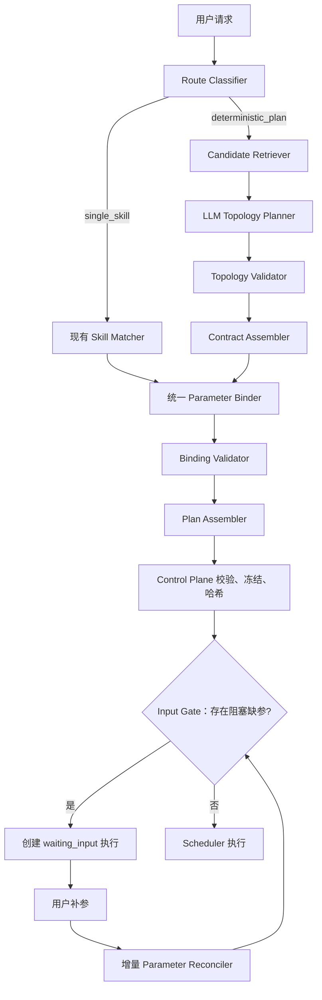
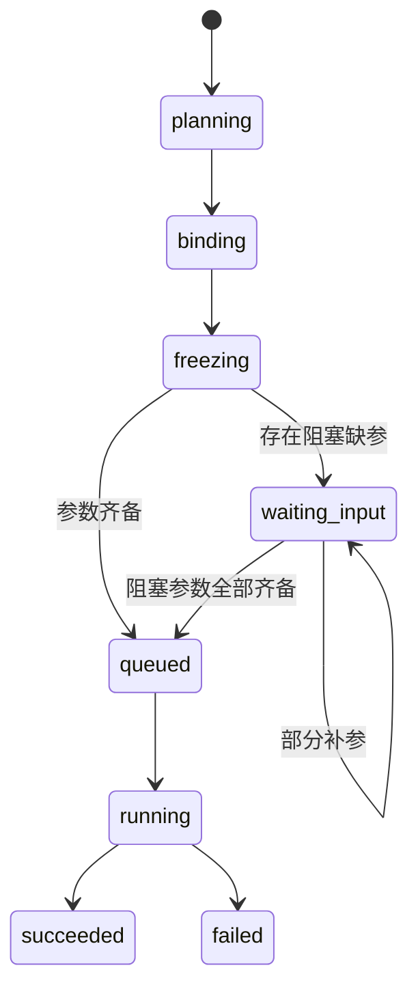

# 两阶段确定性任务规划与参数绑定设计

状态：Core Pipeline Implemented  
日期：2026-08-11  
适用范围：AI Orchestrator Planner、Control Plane Deterministic Runtime、Chat 补参链路  
关联设计：`deterministic-task-decomposition-design.md`、`three-capability-types-and-llm-operation-governance-design.md`

## 1. 文档目的

本文解决当前确定性复合任务规划中的两个核心问题：

1. Planner 在一次模型调用中同时承担能力选择、步骤编排、参数识别、数据绑定和完整计划 JSON 生成，提示词与输出 token 成本过高。
2. 单 Skill 已经采用“先匹配 Skill、再识别参数和补参”的流程，而复合任务没有复用同一参数解析能力，导致两条链路的输入语义、补参体验和错误处理逐渐分叉。

本文提出的目标方案是：

```text
候选能力召回
→ 阶段一：只生成任务拓扑
→ 代码组装权威节点合同
→ 阶段二：只解析所选节点参数
→ 组装并冻结拓扑与绑定定义
→ 缺参时进入 waiting_input
→ 参数齐备后按已冻结拓扑执行
```

这里的“两阶段”是把一次过大的模型任务拆成轻量拓扑识别和已选能力参数识别。系统应把版本、权限、Schema、默认值、类型和输出路径等可确定内容放入代码，只让模型处理语义判断。

## 2. 决策摘要

本设计做出以下决策：

1. 新增内部合同 `DeterministicTopologyDraftV1`，阶段一只表达选中了哪些能力以及节点依赖关系。
2. 最终提交 Control Plane 的合同继续使用 `DeterministicPlanDraftV1`，第一期不升级外部计划 Schema。
3. Skill ID、版本、运行时类型、输入输出合同、节点序号、失败策略和最终输出类型全部由代码组装，不再要求 LLM 生成。
4. 参数解析复用现有单 Skill recognizer 和 `ParamRecognizerService` 语义，新增面向多节点的批量绑定层。
5. `node_output` 绑定优先由权威 JSON Schema 的兼容关系确定，LLM 不猜上游字段路径。
6. 用户明确提供或后续补充的值统一写入标准化执行输入，并通过 `user_input` binding 引用；不把补参值写回计划正文。
7. 默认值使用 `runtime_default` 或在运行时按权威 input policy 解析；凭据字段不进入计划。
8. 缺少必填参数时可以先冻结拓扑和绑定定义，但执行必须处于 `waiting_input`，不得启动业务节点。
9. 用户补参只重新解析受影响字段，不重新进行 Skill 召回和拓扑规划。
10. 意图和能力组合必须由 LLM 结合 Skill 名称、描述和合同语义识别；固定规则只负责权限、发布状态、DAG、类型、默认值与安全校验。

### 2.1 2026-08-11 落地状态

本次已落地核心主链路：

- `DeterministicPlanGeneratorService` 已移除 Recipe-first 的零 LLM 旁路；两阶段组件已注入时，Topology 失败会直接失败，不再降级到固定规则或旧完整计划 Prompt。
- `CapabilityCandidateSelectorService` 只保留发布、部署、版本和输出 Schema 硬门禁，不再根据“搜索/总结/Markdown”关键词打分。
- Routing Card 已增加 `displayName` 和 `description`，Topology LLM 输出 `finalOutputKind`。
- `MultiNodeParameterBinderService` 已改为复用 `RecognizerService`，仅向 LLM 发送已选能力未被上游绑定的非敏感字段。
- 复合规划调用 Recognizer 时设置 `fallbackMode=none`；但在调用模型前，允许依据能力合同的 `semanticRole`/标准字段名与版本化 Routing Policy 解析唯一、无歧义的文本槽位。例如搜索能力的唯一 `query` 可从“搜索 X 的新闻，然后总结”确定性绑定为 `X`。这不是通用正则猜测；无法唯一解析时仍进入 Recognizer，模型不可用则必填字段进入缺参结果。
- 默认值在 Binder 和 Temporal 发布 Schema 编译器中都会按声明类型归一化，`type=number, default="5"` 将变为数值 `5`。
- 已增加“查询 AI 新闻并总结”两阶段回归测试，覆盖 LLM 拓扑、LLM 参数识别、`topic=news`、`maxResults=5(number)` 和上游绑定。

本次未完成的后续项：语义/向量 Top-K 候选召回、多 Skill 批量参数 structured extraction、Control Plane `waiting_input` 闭环、Topology LLM 完整 prompt-debug 记录。

## 3. 背景与当前实现

### 3.1 改造前的复合规划链路

本次改造前，复合任务的主链路为：

```text
ChatOrchestratorService
→ PlanRouteClassifierService
→ SkillCacheService.loadAvailableSkills
→ DeterministicTaskExecutionService
→ DeterministicPlanGeneratorService.generatePlan
→ CapabilityCandidateSelectorService.selectCandidates
→ 单次 LLM 生成完整 DeterministicPlanDraftV1
→ parseAndValidatePlanJson 后处理
→ Control Plane createExecution
→ DeterministicPlanFreezeService.freezeAndPersistPlan
→ DeterministicPlanSchedulerService
```

相关代码：

- `apps/backend/intelligence/ai-orchestrator/src/modules/chat/chat-orchestrator.service.ts`
- `apps/backend/intelligence/ai-orchestrator/src/modules/chat/deterministic-task-execution.service.ts`
- `apps/backend/intelligence/ai-orchestrator/src/modules/planner/deterministic/deterministic-plan-generator.service.ts`
- `apps/backend/intelligence/ai-orchestrator/src/modules/planner/candidate-selection/capability-candidate-selector.service.ts`
- `apps/backend/execution-control/control-plane/src/modules/execution/creation/execution-create.service.ts`
- `apps/backend/execution-control/control-plane/src/modules/execution/plan-runtime/deterministic-plan-freeze.service.ts`
- `apps/backend/execution-control/control-plane/src/modules/execution/plan-runtime/deterministic-plan-scheduler.service.ts`

### 3.2 当前单 Skill 链路

单 Skill Planner 已经有清晰的两段职责：

```text
PlannerMatchPhaseService.matchSkillPhase
→ PlannerPlanDraftService.completePlanFromMatchPhase
→ RecognizerService.recognizeParams
→ ParamRecognizerService.buildRequiredInputs
→ PlanGeneratorService.buildSkillPlan
```

这说明“先匹配能力，后解析参数”不是全新机制，而是复合任务应复用的既有模式。

### 3.3 改造前的提示词负担

当前确定性 Planner 提示词要求模型输出完整计划，包含：

- 能力 ID 与版本
- 节点 ID、标题、序号和依赖
- runtimeType
- inputBindings
- finalOutputs
- 多个固定顶层字段
- 完整 JSON 示例

但后处理又会覆盖或派生其中大量字段：

- 将 Skill ID 对齐到 `publishedSkillId`
- 将版本对齐到 `executableVersion`
- 根据能力卡片覆盖 runtimeType
- 从权威输出 Schema 派生 `outputContract`
- 根据真实输出字段修正 `node_output.path`
- 根据生产者输出合同修正 `finalOutputs.expectedType`
- 从 Registry 补全 LLM Operation version、digest 和模型策略
- 强制覆盖 `originalRequest` 和 `status`

因此当前模型输出中存在大量“生成后立即丢弃或修正”的 token。

### 3.4 当前实现的结构性差距

#### 3.4.1 候选召回没有真正按请求排序

`CapabilityCandidateSelectorService.selectCandidates()` 接收 `userRequest`，但当前核心逻辑仍是：

```ts
availableSkills.slice(0, 12);
```

这会导致：

- 候选数量随可见 Skill 数增长而被机械截断。
- 真正相关的 Skill 可能不在前 12 个。
- Planner prompt 被无关能力卡片占用。
- Token 优化只能治标，无法提升召回质量。

#### 3.4.2 提示词与正式合同不一致

`ValueBindingV1` 实际支持：

```text
literal
user_input
node_output
runtime_default
```

当前提示词却只允许 `literal` 和 `node_output`。这直接限制了确定性计划表达补参和运行时默认值的能力。

#### 3.4.3 示例诱导模型猜测输出路径

当前示例固定使用 `results`，真实 Skill 可能声明 `searchResults`、`results` 或其他字段。代码因此需要 `alignInputBindingPaths()` 事后修复。

正确方向不是增加更多路径示例，而是从权威生产者 output schema 和消费者 input schema 自动建立边绑定。

#### 3.4.4 确定性执行创建后立即排队

`createDeterministicExecution()` 当前创建状态为 `queued`，冻结完成后立即调用 Scheduler。它没有依据 `requiredUserInputs` 决定是否先进入 `waiting_input`。

即使计划中使用 `user_input` binding，缺失值也可能在节点启动时解析成 `undefined`，最终表现为运行时失败，而不是用户可理解的补参请求。

#### 3.4.5 现有补参存储与确定性解析来源未完全对齐

现有补参服务主要更新 `normalizedInputJson`，而确定性节点解析器当前读取 `execution.inputJson`。两条数据路径必须统一，否则用户提交值后确定性 Scheduler 仍可能读不到新值。

## 4. 设计目标

### 4.1 功能目标

- 复合请求可以先确定能力拓扑，再解析所选能力的参数。
- 单 Skill 和复合计划使用相同参数识别与补参语义。
- 支持 `literal`、`user_input`、`node_output`、`runtime_default` 四类绑定。
- 缺少参数时生成稳定、可展示、可提交的 `requiredUserInputs`。
- 用户补参后不重新选择 Skill，不改变已经确认的任务拓扑。
- 最终计划仍可由现有 Control Plane 校验、冻结、哈希和调度。

### 4.2 Token 与性能目标

- 阶段一 Prompt 不携带完整输入 Schema，只携带路由和组合所需摘要。
- 阶段二只携带被选中节点的输入 Schema。
- 不让模型生成可由系统确定的字段。
- 阶段一始终调用 Topology LLM，不允许关键词 Recipe 绕过意图识别。
- 同一请求中参数识别尽量批量完成，不为每个节点重复发送用户原文。
- 静态系统指令支持 Prompt Cache，动态用户内容与候选摘要单独组织。

### 4.3 质量目标

- 不允许虚构能力、版本或输出字段。
- 不允许把不兼容的上游输出连接到下游输入。
- 不允许凭据进入计划或模型 Prompt。
- 不允许缺少阻塞参数时启动业务节点。
- Planner 的模型错误不能修改权威 Registry/Catalog 信息。

## 5. 非目标

本设计不包含：

- 运行时自主重规划。
- 执行失败后让模型自由选择新能力。
- 动态工具发现或开放式 Agent 循环。
- 替代现有 Capability Registry、LLM Operation Registry 或 Control Plane 冻结机制。
- 把自然语言参数识别完全改造成通用聊天 Agent。
- 在计划中存储 apiKey、token、password 等凭据。

## 6. 总体架构



核心组件职责：

| 组件                | 职责                                                              | 是否调用 LLM           |
| ------------------- | ----------------------------------------------------------------- | ---------------------- |
| Route Classifier    | 判断单 Skill 快速路径或复合计划路径                               | 默认否                 |
| Candidate Retriever | 从用户可见能力中召回 Top-K                                        | 默认否，可选 embedding |
| Topology Planner    | 基于 Skill 名称、描述和合同语义选择能力并建立依赖                 | 是，主路径必调         |
| Topology Validator  | 校验能力存在、节点数量、DAG 和基本可组合性                        | 否                     |
| Contract Assembler  | 从 Registry/Catalog 填充版本和权威合同                            | 否                     |
| Parameter Binder    | 对已选能力调用 LLM 识别用户值，再由代码处理上游输出、默认值与缺参 | 有未绑定字段时调用     |
| Plan Assembler      | 生成最终 `DeterministicPlanDraftV1`                               | 否                     |
| Control Plane       | 二次校验、冻结、等待补参和执行                                    | 否                     |

## 7. 分层数据合同

### 7.1 路由能力卡片

阶段一不需要完整 `CompactCapabilityCardV1`，新增更小的内部投影：

```ts
export interface RoutingCapabilityCardV1 {
  key: string; // 本次请求内短别名，例如 s0、o1
  capabilityKind: 'skill' | 'llm_operation';
  displayName: string;
  description: string;
  goals: string[];
  accepts: ValueTypeV1[];
  produces: ValueTypeV1[];
  supportsArtifactOutput: boolean;
  sideEffectLevel?: 'none' | 'read' | 'write' | 'external_commit';
  freshness?: 'live' | 'cached' | 'static';
}
```

限制：

- `key` 仅在本次 Planner 请求内有效。
- 不把 UUID、版本、digest 和完整 Schema 发给阶段一模型。
- `accepts/produces` 由权威 Schema 投影，不由运营手填第二份数据。
- 真实能力 ID 映射只保存在服务端 `CandidateSnapshot`。

### 7.2 候选快照

```ts
export interface CandidateSnapshotV1 {
  snapshotId: string;
  catalogVersion: string;
  createdAt: string;
  aliasMap: Record<
    string,
    {
      capabilityKind: 'skill' | 'llm_operation';
      capabilityId: string;
      executableVersion: string;
      inputSchema: Record<string, unknown>;
      outputSchema: Record<string, unknown>;
      runtimeType?: string;
      supportsArtifactOutput?: boolean;
      contractDigest?: string;
    }
  >;
}
```

候选快照必须具备：

- 当前用户授权范围。
- 已发布、已部署、已启用状态。
- 精确可执行版本。
- 权威 input/output schema。
- 在一次规划过程中保持不变。

### 7.3 阶段一拓扑合同

```ts
export interface DeterministicTopologyDraftV1 {
  schemaVersion: 'deterministic-topology/v1';
  objective: string;
  nodes: Array<{
    ref: string; // n1、n2，模型只负责本地引用
    capabilityKey: string; // s0、o1 等短别名
    dependsOn: string[];
  }>;
  finalNodeRef: string;
  finalOutputKind: 'value' | 'artifact';
}
```

不允许出现在拓扑合同中的字段：

- `skillId`
- `skillVersion`
- `runtimeType`
- `inputBindings`
- `outputContract`
- `finalOutputs.expectedType`
- `operationVersion`
- `operationDigest`
- Prompt、模型参数和凭据

这些字段要么属于阶段二，要么属于代码组装与冻结阶段。

### 7.4 参数绑定结果

```ts
export interface DeterministicBindingDraftV1 {
  schemaVersion: 'deterministic-binding/v1';
  normalizedInput: Record<string, unknown>;
  nodeBindings: Record<
    string,
    {
      inputBindings: Record<string, ValueBindingV1>;
      paramResolution: Record<string, DeterministicParamResolutionEntryV1>;
    }
  >;
  requiredUserInputs: DeterministicRequiredUserInputV1[];
}

export interface DeterministicParamResolutionEntryV1 {
  nodeRef: string;
  field: string;
  inputPath: string;
  type: string;
  required: boolean;
  source: 'node_output' | 'user_input' | 'runtime_default' | 'literal' | 'unresolved';
  value?: unknown;
  confidence?: number;
  missing: boolean;
  needsConfirmation: boolean;
  final: boolean;
}

export interface DeterministicRequiredUserInputV1 {
  key: string; // 例如 n1.query，补参接口使用的稳定键
  nodeRef: string;
  field: string;
  inputPath: string; // planInputs.n1.query
  prompt: string;
  type: string;
  enum?: unknown[];
  required: true;
  missing: true;
  groupLabel?: string;
}
```

### 7.5 标准化执行输入布局

为避免不同节点出现同名参数，复合计划使用节点作用域：

```json
{
  "prompt": "搜索最新 AI 新闻，总结并输出 md",
  "planInputs": {
    "n1": {
      "query": "最新人工智能新闻",
      "topic": "news"
    },
    "n3": {
      "fileName": "ai-news.md"
    }
  },
  "paramResolution": {
    "n1.query": {
      "source": "user_input",
      "missing": false,
      "final": true
    }
  },
  "requiredInputs": []
}
```

对应 binding：

```json
{
  "query": {
    "source": "user_input",
    "path": "planInputs.n1.query"
  }
}
```

### 7.6 最终计划合同

最终仍组装为现有 `DeterministicPlanDraftV1`：

```ts
export interface DeterministicPlanDraftV1 {
  schemaVersion: 'deterministic-plan/v1';
  plannerVersion: string;
  catalogVersion: string;
  planType: 'single' | 'sequential';
  objective: string;
  originalRequest: string;
  status: 'draft' | 'validated' | 'frozen' | 'rejected';
  nodes: DeterministicPlanNodeV1[];
  finalOutputs: FinalOutputRequirementV1[];
  requiredUserInputs?: RequiredUserInputV1[];
}
```

第一期保持 V1 的原因：

- Control Plane 已具备 V1 校验、冻结、哈希和调度能力。
- 新增拓扑与绑定合同只在 AI Orchestrator 内部流转。
- 降低迁移风险，允许新旧 Planner 通过 feature flag 并行。

需要扩展 `RequiredUserInputV1` 的展示字段时，应采用可选字段向后兼容，而不是立即升级整个计划 Schema。

## 8. 阶段零：候选能力召回

### 8.1 召回流程

```text
用户授权可见能力
→ 发布/部署/启用状态过滤
→ 硬约束过滤
→ 文本/标签/向量相关性排序
→ 产物能力强制保留
→ LLM Operation 按目标召回
→ 输出 Top-K Routing Cards
```

### 8.2 硬约束过滤

候选能力必须满足：

- 当前用户有权使用。
- Skill 已发布并部署，或内置能力已注册、部署、启用。
- 存在精确可执行版本。
- 存在权威输出 Schema。
- 用户要求文件产物时，至少保留一个 `supportsArtifactOutput=true` 的候选。
- 用户要求最新或外部信息时，至少保留一个 live/read Skill，不能只提供 LLM Operation。

### 8.3 排序信号

推荐综合分数：

```text
score =
  0.40 * semanticSimilarity
  + 0.20 * goalOverlap
  + 0.15 * keywordMatch
  + 0.10 * inputEvidence
  + 0.10 * outputGoalFit
  + 0.05 * historicalSuccessRate
```

第一期不必一次性引入向量数据库，可以先用：

- displayName、summary、goals 的分词匹配。
- 用户请求中的动作词与产物词。
- category/runtimeType。
- 固定的 artifact/live-data 强制保留规则。

### 8.4 候选数量

默认建议：

| 类型            |                                    默认上限 |
| --------------- | ------------------------------------------: |
| 普通/内置 Skill |                                           6 |
| LLM Operation   | 5（当前系统基线；新增能力后仍需按目标召回） |
| Artifact Skill  |                                  额外保留 1 |

不能继续以“可见列表前 12 个”为候选策略。

## 9. 阶段一：任务拓扑规划

### 9.1 Planner 只回答三个问题

阶段一只需要回答：

1. 哪些能力是完成目标所必需的？
2. 它们的先后和依赖关系是什么？
3. 哪个节点提供最终结果？

阶段一不识别 Skill 具体参数，不生成 output path，不处理缺参。

### 9.2 受审计 Recipe 优先，未覆盖意图再进入 LLM 拓扑规划

经过版本化 Routing Policy、精确前置条件和合同验收的稳定模式，可以先由
`DeterministicRecipeMatcherService` 生成最小拓扑。例如搜索后总结、文档提取后总结，以及“已有可信结果 + 单次文本变换”。Recipe 必须记录版本、命中原因和所选能力，并在能力缺失或存在未覆盖外部动作时失败关闭到 Topology LLM，而不是勉强执行。

没有受审计 Recipe 覆盖的请求，Topology LLM 必须综合：

- Skill/LLM Operation 的 `displayName` 和 `description`。
- `goals`、可接受输入和可产生输出。
- 是否支持 artifact 输出。
- 用户原始目标及各子目标间的依赖。

禁止在 Service 中散落场景正则。所有 Recipe 信号必须来自同一份版本化 Routing Policy；涉及实时数据、外部系统或副作用的请求不能仅由 LLM Operation Recipe 完成。

### 9.3 LLM Topology Planner Prompt

静态 system prompt 建议压缩为：

```text
你是受限任务拓扑规划器。
只能选择输入中的 capabilityKey。
输出 deterministic-topology/v1 JSON。
节点必须是 DAG，最多 6 个；依赖只能引用前序节点。
只选择完成目标必要的能力。
需要实时/外部信息时必须选择 Skill，不能仅使用 LLM Operation。
需要文件产物时 finalNode 必须能产生 artifact_ref。
禁止输出参数、版本、合同、Prompt 或解释。
```

动态输入：

```json
{
  "request": "搜索最新 AI 新闻，总结并输出 md",
  "capabilities": [
    { "k": "s0", "g": ["web_search"], "in": ["string"], "out": ["news_item_list"] },
    { "k": "o0", "g": ["summarize"], "in": ["news_item_list"], "out": ["markdown_content"] },
    {
      "k": "s1",
      "g": ["write_markdown"],
      "in": ["markdown_content"],
      "out": ["artifact_ref"],
      "artifact": true
    }
  ]
}
```

目标输出：

```json
{
  "schemaVersion": "deterministic-topology/v1",
  "objective": "搜索最新 AI 新闻，总结并输出 Markdown 文件",
  "nodes": [
    { "ref": "n1", "capabilityKey": "s0", "dependsOn": [] },
    { "ref": "n2", "capabilityKey": "o0", "dependsOn": ["n1"] },
    { "ref": "n3", "capabilityKey": "s1", "dependsOn": ["n2"] }
  ],
  "finalNodeRef": "n3"
}
```

### 9.4 结构化输出

模型调用必须优先使用 JSON Schema/structured output，而不是通过长示例约束格式。

如果当前 `ModelService.callModel()` 不支持 response schema，应扩展模型抽象，而不是继续增加示例和 repair prompt。

建议接口：

```ts
modelService.callStructuredModel<T>({
  modelId,
  staticSystem,
  dynamicInput,
  responseSchema,
  mode: 'reasoning',
  promptCacheKey,
});
```

### 9.5 拓扑校验

`TopologyValidatorService` 至少校验：

- `schemaVersion` 正确。
- 节点数 1～6。
- `ref` 唯一。
- capabilityKey 全部存在于候选快照。
- 依赖存在且无环。
- 最终节点存在。
- 需要 artifact 时最终节点产生 `artifact_ref`。
- 需要实时数据时存在 Skill 数据源。
- 不允许只有 LLM Operation 伪造外部数据。
- 每条依赖至少存在一个潜在兼容的 output→input 类型。

无法通过的拓扑直接拒绝或执行一次受限 repair。Repair 输入只包含：

- 原拓扑 JSON。
- 校验错误码。
- 候选别名摘要。

不得再次发送完整能力 Schema。

## 10. 合同组装

`DeterministicContractAssemblerService` 根据 Candidate Snapshot 将拓扑节点展开为内部节点描述：

```ts
interface AssembledTopologyNodeV1 {
  nodeRef: string;
  sequence: number;
  title: string;
  kind: 'skill' | 'llm_operation';
  capabilityId: string;
  capabilityVersion: string;
  runtimeType?: string;
  dependsOn: string[];
  inputSchema: Record<string, unknown>;
  outputSchema: Record<string, unknown>;
  outputContract: Record<string, ValueTypeV1>;
  contractDigest?: string;
}
```

组装规则：

- sequence 按稳定拓扑排序生成。
- nodeId 使用 `n1_search_news` 这类可读且稳定的代码生成值。
- title 来自能力 displayName 和 objective 的安全截断，不要求 LLM 生成。
- Skill version 使用候选快照精确版本。
- LLM Operation version/digest 在 Registry 中解析。
- outputContract 从权威 output schema 派生。
- failurePolicy 第一期固定为 `abort`。
- runtimeType 从 Registry/Catalog 填充。

## 11. 阶段二：参数绑定

### 11.1 输入来源优先级

对每个节点输入字段按以下顺序处理：

```text
1. 上游权威输出可满足 → node_output
2. 用户请求/上下文明确提供 → user_input
3. 发布配置或运行时有默认 → runtime_default
4. 安全的系统固定字面量 → literal
5. 必填但无法得到 → unresolved + requiredUserInputs
6. 可选且无值 → 不生成 binding
```

安全固定字面量仅限：

- 系统选定的枚举默认值。
- 经过 Schema 类型归一化和枚举校验的权威默认值。
- 非敏感、无需用户确认、不会影响外部副作用的系统值。

用户自然语言中提取出来的业务值优先写入 `normalizedInput.planInputs`，再用 `user_input` 引用，不直接散落为计划 literal。这样用户补参时不需要修改计划，也不会让 planHash 随补参内容变化。

### 11.2 自动建立 node_output

输入：

- 上游节点权威 output schema。
- 当前节点权威 input schema。
- 拓扑依赖。

匹配规则：

1. 精确字段语义和类型匹配。
2. 注册表显式 binding hints。
3. 兼容类型匹配，例如 `markdown_content → string`。
4. 已登记的标准别名，例如 `results/searchResults/news_item_list`。
5. 仍存在多个候选时标记歧义，不让模型直接猜。

推荐在能力发布合同中逐步增加：

```json
{
  "compositionHints": {
    "outputs": {
      "searchResults": {
        "semanticType": "news_item_list"
      }
    },
    "inputs": {
      "items": {
        "acceptsSemanticTypes": ["news_item_list"]
      }
    }
  }
}
```

第一期可继续兼容当前 alias map，但 alias 只能存在于一个共享模块，不能分别散落在 Planner、Validator 和 Scheduler。

### 11.3 复用现有参数识别能力

单 Skill 路径当前调用：

```text
RecognizerService.recognizeParams
→ ParamRecognizerService.mergeRecognizedWithCollectedContext
→ applyBilingualCompletionToRecognized
→ buildRequiredInputs
```

复合任务新增 `MultiNodeParameterBinderService`，内部复用上述能力：

```ts
interface BindPlanParametersInput {
  userRequest: string;
  context?: Record<string, unknown>;
  nodes: AssembledTopologyNodeV1[];
  existingNormalizedInput?: Record<string, unknown>;
  targetFields?: Array<{ nodeRef: string; field: string }>;
}
```

但不能简单循环节点并为每个节点发起一次完整 LLM 调用。推荐策略：

- 单节点：直接复用现有 recognizer。
- 多节点且字段较少：一次批量 structured extraction。
- 字段较多：按节点组或业务组分批，但用户原文只放动态段并启用 Prompt Cache。
- 仅补少数字段：使用 `targetFields` 做增量识别。

### 11.4 批量参数识别 Schema

发送给模型的字段使用短别名：

```json
{
  "request": "搜索最新 AI 新闻，总结并输出 ai-news.md",
  "fields": {
    "f0": { "type": "string", "description": "搜索关键词", "required": true },
    "f1": { "type": "string", "enum": ["general", "news", "finance"], "default": "general" },
    "f2": { "type": "string", "description": "Markdown 文件名", "required": true }
  }
}
```

输出：

```json
{
  "values": {
    "f0": { "value": "最新人工智能新闻", "confidence": 0.98 },
    "f2": { "value": "ai-news.md", "confidence": 0.99 }
  }
}
```

模型不输出：

- source 类型。
- missing 状态。
- input path。
- enum 默认值。
- node_output。
- requiredUserInputs。

这些都由 Binder 根据 Schema 和策略计算。

### 11.5 缺参和确认

以下情况进入 `requiredUserInputs`：

- `required=true` 且无值、无默认、无上游绑定。
- 识别置信度低于字段阈值。
- 字段标记 `needsConfirmation`。
- 高副作用字段要求显式确认。
- 用户值违反 enum、格式或范围约束。

低置信度值可以保留为候选，但不得标记为 `final=true`。

### 11.6 敏感字段

字段名或 Schema 标记命中以下类别时：

```text
apiKey token secret password credential authorization cookie privateKey
```

处理方式：

- 不发送给参数识别模型。
- 不生成 literal 或 user_input binding。
- 如果运行时支持默认凭据，使用 `runtime_default` 或完全省略 binding。
- 如果能力没有受控凭据来源，计划校验失败，返回 `CREDENTIAL_BINDING_UNAVAILABLE`。

## 12. 计划组装

`DeterministicPlanAssemblerService` 将拓扑、权威合同和绑定结果合并成最终 V1。

### 12.1 节点字段来源

| 字段                            | 权威来源                       |
| ------------------------------- | ------------------------------ |
| `nodeId`                        | 代码生成                       |
| `sequence`                      | 稳定拓扑排序                   |
| `title`                         | 能力 displayName + 代码模板    |
| `kind`                          | Candidate Snapshot             |
| `skillId/operationId`           | Candidate Snapshot             |
| `skillVersion/operationVersion` | Registry/Catalog               |
| `runtimeType`                   | Registry/Catalog               |
| `dependsOn`                     | Topology Draft                 |
| `inputBindings`                 | Parameter Binder               |
| `outputContract`                | 权威 output schema             |
| `failurePolicy`                 | 固定策略                       |
| `finalOutputs`                  | finalNode + 权威 output schema |

### 12.2 finalOutputs 生成

规则：

- `finalNodeRef` 指向的节点必须存在。
- 优先使用节点声明的 primary output。
- 没有 primary output 时，按 `artifact_ref > markdown_content > 业务类型 > json` 选择唯一输出。
- 多个同优先级输出且没有声明 primary output 时，计划失败，要求能力合同补充元数据。
- `expectedType` 直接使用权威 output contract 类型。
- 产物输出自动设置 `isArtifact=true` 和 mimeType。

## 13. 补参状态机

### 13.1 状态定义



### 13.2 冻结时机

推荐冻结的是“拓扑 + 绑定定义 + 权威合同”，不是用户参数值本身。

因此可以：

1. 生成 `user_input` binding path。
2. 对缺失值生成 `requiredUserInputs`。
3. 冻结计划和 binding 定义。
4. 创建 `waiting_input` 执行。
5. 用户补值写入执行输入，不修改 frozen plan。
6. 参数齐备后 Scheduler 按 frozen binding 读取值。

这保持了 planHash 的稳定性，也避免补参后重新规划。

### 13.3 Control Plane 创建行为

`createDeterministicExecution()` 修改为：

```text
验证能力可访问和版本
→ 冻结计划
→ 规范化执行输入
→ 检查 requiredUserInputs 对应路径
→ 有阻塞缺参：status=waiting_input，创建 input_collection step，不调度业务节点
→ 无阻塞缺参：status=queued，异步 advanceExecution
```

### 13.4 input_collection step

确定性计划缺参时创建一个系统输入收集步骤：

```json
{
  "type": "input_collection",
  "status": "waiting_input",
  "inputJson": {
    "requiredInputs": [
      {
        "name": "n1.query",
        "inputPath": "planInputs.n1.query",
        "type": "string",
        "description": "请输入搜索关键词",
        "missing": true
      }
    ]
  }
}
```

### 13.5 补参提交

第一期继续复用：

```text
POST /executions/:id/submit-input
```

请求：

```json
{
  "stepId": "input-collection-step-id",
  "input": {
    "n1.query": "最新人工智能新闻"
  }
}
```

Control Plane 根据 `requiredInputs[].inputPath` 将值写入：

```text
normalizedInputJson.planInputs.n1.query
```

然后：

- 更新 paramResolution。
- 重新校验 enum、格式与 required 条件。
- 若仍有缺参，保持 `waiting_input`。
- 若全部齐备，状态切到 `queued` 并启动 Deterministic Scheduler。

### 13.6 统一解析来源

`DeterministicNodeInputResolverService` 不应继续只读取创建时的 `execution.inputJson`。

建议统一读取优先级：

```text
execution.normalizedInputJson.planInputs
→ execution.inputJson.planInputs（兼容旧执行）
→ runtime default
```

或者在补参事务中同步更新两列。长期建议明确：

- `inputJson`：原始请求输入，只读审计。
- `normalizedInputJson`：当前可执行输入和参数裁决事实源。

Scheduler 应读取 `normalizedInputJson`。

## 14. 单 Skill 与复合任务统一

### 14.1 统一目标结构

```text
单 Skill：
Skill Matcher
→ AssembledTopologyNodeV1[1]
→ Parameter Binder
→ Plan Assembler / Legacy Plan Adapter

复合任务：
Candidate Retriever
→ Topology Planner
→ AssembledTopologyNodeV1[n]
→ Parameter Binder
→ Deterministic Plan Assembler
```

### 14.2 复用边界

应复用：

- 参数 Schema 清洗。
- context 合并。
- enum/default 策略。
- bilingual completion。
- required input 构造。
- confidence 和 confirmation 规则。
- waiting_input 展示语义。

不应复用：

- 单 Skill `PlanDraftDTO.steps` 的具体结构作为复合计划拓扑。
- 依赖单一 `skill_match` 的 metadata。
- 只支持平铺参数名的输入布局。

### 14.3 参数核心抽取

建议从当前 `PlannerPlanDraftService.buildSkillPlan()` 中下沉通用能力：

```text
ParameterRecognitionFacade
├── recognizeFields
├── mergeCollectedContext
├── applySchemaPolicy
├── buildParamResolution
└── buildRequiredInputs
```

单 Skill 和 Multi-node Binder 都依赖该 Facade，避免维护两份 prompt、阈值和默认值逻辑。

## 15. Prompt 与 Token 优化

### 15.1 当前固定成本来源

当前 Prompt 的主要固定成本包括：

- 十条自然语言规则。
- 完整 Skill 和 LLM Operation 卡片。
- 两个完整计划示例。
- 重复输出字段。
- 修复时重新发送完整系统 Prompt 和上次完整输出。

### 15.2 优化措施

| 措施                             | 作用                                |
| -------------------------------- | ----------------------------------- |
| 拓扑内部合同                     | 大幅减少阶段一输出字段              |
| 短别名                           | 避免反复输出 UUID 和长 Operation ID |
| Top-K 召回                       | 不发送无关能力                      |
| 路由卡片                         | 阶段一不发送完整输入 Schema         |
| Structured Output                | 删除两个完整 JSON 示例              |
| 代码组装版本/合同                | 减少模型生成后被覆盖的内容          |
| Schema 自动连边                  | 不让模型猜 output path              |
| 批量参数识别                     | 用户原文不按节点重复发送            |
| Prompt Cache                     | 缓存静态参数识别规则                |
| 增量补参                         | 补参时只处理缺失字段                |
| 拓扑卡片仅保留名称/描述/合同摘要 | 保持 LLM 意图识别的同时降低 token   |

### 15.3 Token 预算门禁

新增可观测预算：

```ts
interface PlannerTokenBudgetV1 {
  maxRoutingCandidates: number;
  maxTopologyPromptTokens: number;
  maxBindingPromptTokens: number;
  maxRepairCalls: number;
  maxTotalPlannerTokens: number;
}
```

建议初始值：

| 项目                |                 建议值 |
| ------------------- | ---------------------: |
| Skill routing cards | 6 + 1 artifact reserve |
| LLM Operation cards |      5（当前系统基线） |
| Topology repair     |              最多 1 次 |
| Parameter repair    |          每组最多 1 次 |
| 节点上限            |                      6 |

具体 token 阈值应通过实际模型 tokenizer 和基线流量测量后确定，不在设计文档中硬编码模型相关数字。

### 15.4 调用次数策略

不能只看调用次数，要看总 token、延迟和成功率：

| 场景                           | Topology 调用 |                     Binding 调用 |
| ------------------------------ | ------------: | -------------------------------: |
| 单 Skill                       |             0 |                             0～1 |
| 已有结果 + 受审计单次 LLM 变换 |             0 |                                0 |
| 复合任务                       |             1 | 按已选且存在未绑定字段的能力调用 |
| 用户补参                       |             0 |              0 或仅缺失字段 1 次 |

只有当所有字段都已由 `node_output` 绑定时，Binding 才不调用 LLM；不允许回退到正则或关键词参数猜测。

## 16. API 设计

### 16.1 保留现有对外入口

继续支持：

```text
POST /ai/plans/deterministic/generate
```

对外仍返回最终 `DeterministicPlanDraftV1`。内部改为新的 pipeline。

### 16.2 可选调试接口

仅管理/调试环境提供：

```text
POST /ai/plans/deterministic/topology
POST /ai/plans/deterministic/bind
```

不得向普通用户暴露候选能力未授权信息、完整 Prompt 或合同中的敏感默认值。

### 16.3 内部服务接口

```ts
interface DeterministicPlanningPipeline {
  generate(input: GenerateDeterministicPlanRequestDto): Promise<{
    planDraft: DeterministicPlanDraftV1;
    normalizedInput: Record<string, unknown>;
    diagnostics: PlannerDiagnosticsV1;
  }>;
}
```

`DeterministicTaskExecutionService` 创建执行时必须同时提交：

```json
{
  "executionMode": "deterministic_plan",
  "input": {
    "prompt": "...",
    "planInputs": {},
    "paramResolution": {},
    "requiredInputs": []
  },
  "deterministicPlan": {}
}
```

## 17. 模块与文件落地

### 17.1 AI Orchestrator 目标目录

```text
src/modules/planner/
├── candidate-selection/
│   ├── capability-candidate-retriever.service.ts
│   ├── routing-capability-card.projector.ts
│   └── candidate-snapshot.service.ts
├── topology/
│   ├── deterministic-topology.types.ts
│   ├── deterministic-topology-planner.service.ts
│   └── deterministic-topology-validator.service.ts
├── binding/
│   ├── multi-node-parameter-binder.service.ts
│   ├── node-output-binding-resolver.service.ts
│   ├── deterministic-required-input.service.ts
│   ├── deterministic-input-path.service.ts
│   └── deterministic-binding.types.ts
├── deterministic/
│   ├── deterministic-contract-assembler.service.ts
│   ├── deterministic-plan-assembler.service.ts
│   ├── deterministic-planning-pipeline.service.ts
│   ├── deterministic-plan-generator.service.ts
│   └── deterministic-plan.controller.ts
└── params/
    └── parameter-recognition.facade.ts
```

职责约束：

- `deterministic-plan-generator.service.ts` 只保留 Facade/兼容入口，不继续扩大。
- Prompt 构造从 Generator 中拆出。
- Candidate Retriever 不负责生成计划。
- Topology Planner 不读取完整参数 Schema。
- Binder 不选择能力。
- Plan Assembler 不调用模型。

### 17.2 共享合同

修改：

```text
packages/backend-contracts/deterministic-plan/src/index.ts
```

建议：

- 保留现有 V1。
- 扩展 `RequiredUserInputV1` 可选字段，或新增独立 deterministic input contract package。
- 不把纯 AI Orchestrator 内部的 Candidate Snapshot 暴露给 Control Plane。
- `ValueBindingV1` 四种 source 保持不变。

### 17.3 Control Plane

新增或调整：

```text
src/modules/execution/plan-runtime/
├── deterministic-plan-input-gate.service.ts
├── deterministic-node-input-resolver.service.ts
└── deterministic-plan-freeze.service.ts

src/modules/execution/creation/
└── execution-create.service.ts

src/modules/execution/human-control/
├── execution-input-resolution.service.ts
└── execution-submit-input.service.ts
```

具体职责：

- `DeterministicPlanInputGateService`：在执行创建和恢复时检查阻塞缺参。
- `ExecutionCreateService`：缺参时创建 waiting_input 执行和 input_collection step。
- `ExecutionSubmitInputService`：支持 scoped key 到 inputPath 的写入。
- `DeterministicNodeInputResolverService`：读取 normalized input，并严格校验缺失路径。
- `DeterministicPlanFreezeService`：继续负责权威合同、边兼容性、hash 和持久化。

### 17.4 Chat 与前端

AI Orchestrator：

- `ChatOrchestratorService` 继续展示冻结拓扑。
- 创建结果为 `waiting_input` 时，不展示“正在执行”，而是展示缺失字段。
- `ChatExecutionStreamService` 复用现有 WAITING_INPUT event。

User Web：

- 支持 `n1.query` 这类 scoped key，但 UI 展示使用 `displayName/groupLabel`。
- 同一节点字段聚合展示。
- 部分补参后展示剩余缺失项。

## 18. 错误模型

新增或明确错误码：

| 错误码                           | 含义                           | 阶段               |
| -------------------------------- | ------------------------------ | ------------------ |
| `CAPABILITY_NOT_FOUND`           | 没有可执行候选能力             | 召回               |
| `TOPOLOGY_OUTPUT_INVALID`        | 拓扑结构不合法                 | 阶段一             |
| `TOPOLOGY_CAPABILITY_UNKNOWN`    | 使用了候选外能力               | 阶段一             |
| `TOPOLOGY_EDGE_UNSATISFIED`      | 依赖之间无可组合字段           | 拓扑校验           |
| `PARAM_BINDING_AMBIGUOUS`        | 多个 output→input 绑定无法确定 | 阶段二             |
| `PARAM_REQUIRED_MISSING`         | 存在阻塞缺参                   | 阶段二，非失败状态 |
| `INPUT_SCHEMA_VIOLATION`         | 用户值违反权威 Schema          | 补参/执行前        |
| `INPUT_BINDING_MISSING`          | binding path 无值              | 执行前             |
| `CREDENTIAL_BINDING_UNAVAILABLE` | 无受控凭据来源                 | 绑定               |
| `FINAL_OUTPUT_UNSATISFIED`       | 最终输出无法满足               | 组装/冻结          |
| `PLANNER_TOKEN_BUDGET_EXCEEDED`  | 超过规划预算                   | 任一 LLM 阶段      |

`PARAM_REQUIRED_MISSING` 不应转换为任务失败，而应转换为 `waiting_input`。

## 19. 安全与治理

### 19.1 能力权限

- Candidate Snapshot 必须在用户权限上下文中生成。
- 快照创建后、执行创建前，Control Plane 仍需再次校验权限和精确版本。
- 别名只在当前规划请求有效，不能作为长期能力标识。

### 19.2 Prompt 安全

- 用户原文始终作为数据段，不拼入系统规则。
- 能力描述来自受信任 Registry，但仍按数据编码。
- 参数 Schema 中的 description 不得携带可执行系统指令。
- 结构化输出 Schema 必须限制 additionalProperties。

### 19.3 数据最小化

- 阶段一不发送完整 Schema。
- 阶段二只发送所选节点的非敏感输入字段。
- uploaded files 只传受控引用和必要元数据，不把文件全文默认注入 Planner。
- Prompt debug 受角色和配置控制。

### 19.4 审计

记录：

- route 决策。
- Candidate Snapshot ID 和候选别名映射摘要。
- Topology LLM 调用与校验结果。
- Topology 输出和校验结果。
- Binding 来源裁决，不记录密钥值。
- required input 和补参事件。
- 每阶段 token、延迟、repair 次数。
- 最终 planHash、contractDigest 和版本。

## 20. 可观测性与指标

### 20.1 指标

```text
planner_route_total{route}
planner_candidate_count{kind}
planner_topology_llm_total{result}
planner_topology_llm_calls_total
planner_binding_llm_calls_total
planner_prompt_tokens_total{stage}
planner_completion_tokens_total{stage}
planner_repair_total{stage,reason}
planner_topology_validation_failure_total{code}
planner_binding_source_total{source}
planner_waiting_input_total
planner_input_resume_total
planner_plan_freeze_failure_total{code}
```

### 20.2 关键比率

- Topology LLM 首次校验通过率。
- 平均候选数。
- 单次规划总 token。
- Topology 首次通过率。
- 参数首次识别完整率。
- waiting_input 后恢复成功率。
- 计划因错误 path 被拒绝的比例。
- 计划创建到首个业务节点启动的延迟。

### 20.3 基线对比

上线前采集当前旧 Planner 基线：

- 固定 Prompt 字符数和实际 tokenizer token。
- 候选卡片 token。
- 完整输出 token。
- repair 率。
- `alignInputBindingPaths()` 命中次数。
- enum 自动纠正次数。
- Control Plane 冻结失败原因。

新旧两条链路使用同一批 fixture 对比，不能只比较 token 而忽略计划正确率。

## 21. 缓存与幂等

### 21.1 Prompt Cache

可缓存：

- Topology Planner 静态规则。
- Parameter Binder 静态提取规则。
- JSON response schema。

不可跨权限缓存：

- Candidate Snapshot。
- 用户请求。
- 用户上下文和上传文件。

### 21.2 Candidate Snapshot Cache

缓存键至少包含：

```text
tenantId + userId/roleDigest + catalogVersion + requestIntentDigest
```

当能力发布、部署、停用或权限变化时失效。

### 21.3 规划幂等键

```text
sha256(userRequest + userContextDigest + candidateSnapshotId + plannerVersion)
```

只能复用 draft，不得绕过 Control Plane 的权限与版本二次校验。

## 22. 迁移与灰度

### 22.1 Feature Flags

```text
DETERMINISTIC_TWO_STAGE_PLANNER_ENABLED
DETERMINISTIC_BATCH_BINDER_ENABLED
DETERMINISTIC_WAITING_INPUT_GATE_ENABLED
DETERMINISTIC_STRUCTURED_OUTPUT_ENABLED
```

### 22.2 分阶段实施

#### Phase 0：建立基线

- 为旧 Planner 增加 stage token、repair 和 normalization 指标。
- 固化 20～50 个代表性 fixture。
- 记录旧链路的输出和冻结结果。

验收：能够回答“token 花在哪里、哪些后处理最常修正模型”。

#### Phase 1：Prompt 瘦身但保持外部行为

- 使用短候选别名。
- 删除两个完整计划示例。
- 引入 structured output。
- 由代码填充固定顶层字段、版本、runtime 和 final output。
- 保持现有单次调用作为兼容桥。

验收：最终 V1 行为一致，Prompt token 显著下降，冻结通过率不降低。

#### Phase 2：引入 Topology Draft

- 新增 Routing Card、Candidate Snapshot、Topology Planner/Validator。
- 先只在 shadow 模式生成拓扑，不用于实际执行。
- 与旧完整 Planner 输出做结构对比。

验收：目标能力集合和依赖准确率达到门槛。

#### Phase 3：引入统一 Binder

- 抽取 `ParameterRecognitionFacade`。
- 单 Skill 先迁移到 Facade，确保行为不变。
- 新增 Multi-node Binder 和 node_output resolver。
- 组装最终 V1。

验收：单 Skill 回归通过；复合计划参数源和缺参结果可解释。

#### Phase 4：补参闭环

- Control Plane 增加 Deterministic Input Gate。
- 创建 waiting_input execution。
- 支持 scoped required input。
- Scheduler 改读 normalized input。
- 补参后恢复 Deterministic Scheduler。

验收：缺参计划不会启动业务节点；补齐后不重规划即可完成执行。

#### Phase 5：默认开启与观测

- 默认开启 LLM 拓扑 + LLM 参数识别。
- 新 Planner 灰度 5% → 25% → 50% → 100%。
- 旧 Planner 保留短期回滚开关。

验收：总 token、P95 延迟和成功率达到目标后默认开启。

### 22.3 回滚

- Feature flag 切回旧 Generator。
- 最终合同仍为 V1，因此 Control Plane 无需双版本回滚。
- 已冻结的新计划继续按 V1 执行。
- waiting_input 新字段应保持可选，旧前端可退化显示 description。

## 23. 测试设计

### 23.1 Candidate Retriever 单测

- 相关 Skill 不在原列表前 12 个仍能被召回。
- 未发布/未部署/无权限能力被过滤。
- 文件请求强制保留 artifact Skill。
- 最新信息请求强制保留 live Skill。
- 候选别名稳定且不泄漏 UUID 给模型。

### 23.2 Topology Planner 单测

- 搜索+总结生成两节点。
- 搜索+总结+文件生成三节点。
- 模型返回候选外 capabilityKey 被拒绝。
- 循环依赖被拒绝。
- artifact 请求最终节点错误被拒绝。
- 最新数据请求仅选择 LLM Operation 被拒绝。

### 23.3 Binder 单测

- 上游 `searchResults` 自动绑定下游 `items`。
- 不再依赖 Prompt 示例中的 `results`。
- 用户明确值写入 `planInputs` 并生成 `user_input`。
- 默认值生成 `runtime_default`。
- 缺少 required 字段生成 requiredUserInputs。
- enum 非法值进入确认/补参，不静默写入错误 literal。
- 凭据字段不进入模型和计划。
- 多节点同名字段使用 scoped key。

### 23.4 Plan Assembler 单测

- 版本来自 Candidate Snapshot。
- outputContract 来自权威 Schema。
- finalOutputs 自动生成正确 expectedType。
- LLM Operation metadata 来自 Registry。
- planHash 不受后续补参值影响。

### 23.5 Control Plane 单测

- 有缺参时创建 waiting_input execution。
- 创建 input_collection step。
- 不调用 Scheduler。
- 部分补参保持 waiting_input。
- 全部补齐后切到 queued 并推进计划。
- Scheduler 从 normalizedInputJson 解析 user_input path。
- 缺失 path 在启动前返回 INPUT_BINDING_MISSING。

### 23.6 端到端场景

#### 场景 A：参数完整

```text
搜索最新人工智能新闻，总结并输出 ai-news.md
```

预期：

- Topology Planner 生成 3 节点。
- query/topic/fileName 均完成绑定。
- execution 直接 queued/running。
- 最终得到 artifact_ref。

#### 场景 B：缺文件名

```text
搜索最新人工智能新闻，总结并输出 md 文件
```

策略二选一：

- 如果产品允许稳定默认名，使用 `runtime_default`，直接执行。
- 如果要求用户指定，进入 waiting_input，仅询问文件名。

策略必须来自字段 policy，不由模型临时决定。

#### 场景 C：缺搜索目标

```text
帮我搜索并总结，然后输出 md
```

预期：

- 拓扑仍为 Search → Summarize → Writer。
- `n1.query` 进入 requiredUserInputs。
- 不启动 Search。
- 用户补充后直接恢复同一计划。

#### 场景 D：非法枚举

用户将 topic 补为 `technology`，权威枚举只有 `general/news/finance`。

预期：

- 返回 INPUT_SCHEMA_VIOLATION 和可选 enum。
- execution 保持 waiting_input。
- 不自动截断或猜测为其他值。

#### 场景 E：能力不可用

用户要求输出 md，但当前没有可用 artifact Skill。

预期：

- Candidate 阶段返回 CAPABILITY_NOT_FOUND。
- 不调用 Topology LLM。
- 不创建 execution。

## 24. 验收标准

### 24.1 功能验收

- [ ] 单 Skill 路径仍保持先匹配、后参数识别。
- [ ] 复合任务阶段一不生成具体参数。
- [ ] 阶段二只加载所选节点 Schema。
- [ ] node_output path 由权威 Schema 建立。
- [ ] 缺参执行进入 waiting_input。
- [ ] 补参后不重新规划即可继续。
- [ ] 最终计划仍通过现有 V1 Freeze/Validator。
- [ ] artifact 和 freshness 门禁保持有效。

### 24.2 Token 验收

- [ ] 记录旧、新两条链路真实 tokenizer 数据。
- [ ] 阶段一不再包含两个完整计划示例。
- [ ] 阶段一不发送完整 input schema。
- [x] 复合任务不再存在 Recipe-first 的零 LLM 意图旁路。
- [ ] 参数补充不重新发送候选能力列表。
- [ ] 总 token 降低且正确率不低于旧链路。

### 24.3 稳定性验收

- [ ] 拓扑首次 Schema 通过率达到上线阈值。
- [ ] 不再因 `results/searchResults` 示例差异导致冻结失败。
- [ ] 不再因缺少 user_input path 直接启动并运行时失败。
- [ ] 新旧 Planner 可通过 feature flag 快速切换。
- [ ] 已冻结计划不受 Planner 回滚影响。

## 25. 实施任务清单

### 25.1 P0：必须先做

- [x] Candidate Selector 不再使用关键词意图排序，仅保留确定性可执行门禁和稳定 token 上限。
- [ ] 建立阶段 token 和 normalization 指标。
- [ ] 定义 `DeterministicTopologyDraftV1`。
- [ ] 定义 scoped `planInputs` 和 required input key。
- [ ] 扩展结构化模型调用接口。
- [ ] 明确 normalizedInputJson 为确定性执行输入事实源。

### 25.2 P1：核心能力

- [x] Routing Card Projector（包含 Skill 名称与描述）。
- [ ] Candidate Snapshot Service。
- [x] Topology Planner 和 Validator。
- [x] Contract Assembler。
- [x] Node Output Binding Resolver。
- [x] Multi-node Parameter Binder（复用 `RecognizerService`）。
- [ ] Deterministic Plan Assembler。
- [ ] Planner Pipeline Facade。

### 25.3 P1：补参闭环

- [ ] Deterministic Plan Input Gate。
- [ ] waiting_input execution 创建。
- [ ] input_collection step 创建。
- [ ] scoped input 提交和 path 写入。
- [ ] Scheduler 读取 normalized input。
- [ ] WAITING_INPUT Chat 事件和 UI 展示。

### 25.4 P2：优化

- [ ] 语义/向量候选召回（不得使用固定业务意图规则）。
- [ ] 批量参数 structured extraction。
- [ ] Prompt Cache。
- [ ] Candidate Snapshot Cache。
- [ ] compositionHints 标准化。
- [ ] Shadow 对比和自动回归报告。

## 26. 建议的首个迭代范围

为了控制风险，首个可交付迭代只覆盖：

```text
Search Skill
→ summarize_list
→ Markdown Artifact Writer
```

支持两种请求：

- 搜索 + 总结。
- 搜索 + 总结 + 输出 Markdown。

首个迭代必须完成：

1. Top-K 候选召回。
2. LLM 基于能力名称、描述和输入输出语义生成拓扑。
3. 自动建立 `searchResults → items → markdown_content → content`。
4. query、topic、maxResults、fileName 参数绑定。
5. query 缺失时 waiting_input。
6. 补参后恢复并生成 artifact_ref。
7. 旧完整 Planner 作为 feature flag fallback。

该迭代可以先验证最核心的“拓扑与参数分离”价值，同时避免一次引入所有长尾组合。

## 27. 最终结论

当前问题不应继续通过扩充完整计划 Prompt 解决。最合适的架构是把复合确定性规划拆成：

```text
轻量能力召回
→ 最小任务拓扑
→ 权威合同代码组装
→ 按所选节点参数识别
→ 缺参等待与增量补充
→ V1 计划冻结执行
```

真正的 token 节省来自三点：

1. 模型不再生成系统已经知道的字段。
2. 阶段一不再携带未选中能力的完整参数 Schema。
3. 参数阶段只向模型发送已选能力的非敏感 Schema，默认值与类型校验仍由代码处理。

同时，该方案让单 Skill 与复合任务共享参数识别和补参语义，减少两条链路长期漂移，是比单纯缩短提示词更稳定的工程解法。
