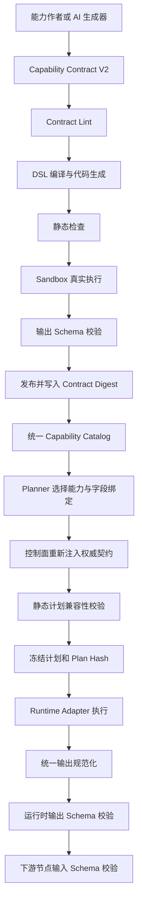

# 统一多步骤能力契约、AI 代码生成与验证门禁设计

状态：Implementation Proposal  
日期：2026-07-31  
最近审阅修订：2026-07-31  
适用范围：自定义 Skill、平台内置 Skill、受控 LLM Operation、Temporal Workflow、确定性多步骤计划  
关联文档：

- `deterministic-task-decomposition-design.md`
- `builtin-workflow-skill-platform-design.md`
- `references/pi-contract-validation-notes.md`
- `../temporal-draft-sessions-analysis.md`

## 1. 结论

多步骤执行当前最需要解决的不是提示词准确率，而是能力契约缺少唯一事实源。

本设计要求自定义 Skill、平台内置 Skill 和受控 LLM Operation 统一声明不可变的输入、输出契约；规划器只能选择能力和绑定字段，不能生成或修改能力契约；DSL 编译器负责生成结果封装代码；发布门禁必须执行真实代码并按契约验证实际输出；控制面运行时校验作为最后防线。

最终责任边界如下：

```text
提示词负责建议
DSL 负责声明
Catalog 负责提供权威契约
编译器负责生成协议胶水
Schema 负责裁决
端到端测试负责证明
运行时校验负责最后防线
```

本方案可直接防止以下已出现的问题：

1. `responseMetadata` 已由 Activity 提取，但遗漏写入 `result.businessData`。
2. 用户请求“最新的 AI 新闻”时，模型把自然语言写入 `topic`，违反 `general | news | finance` 枚举约束。
3. 单 Skill 执行可由前端容错展示，但多步骤计划在生产者与消费者之间发生输出契约违规。
4. 自定义 Skill 的输出 Schema 未进入统一 Catalog，Planner 只能猜测或退化为通用 `data` 字段。

## 2. 背景与问题定性

### 2.1 已确认故障

Web Search 的多步骤执行声明搜索节点必须输出：

```text
searchResults
responseMetadata
```

实际 Workflow 结果组装曾只写入：

```python
"businessData": {
    "query": params.get("query"),
    "topic": params.get("topic", "general"),
    "searchResults": search_results,
    "totalResults": len(search_results),
}
```

Activity 已提取 `responseMetadata`，但最终结果组装遗漏了该字段。确定性调度器在搜索步骤完成后校验输出契约，因而拒绝继续执行下游总结步骤。

修复后的结果为：

```python
"businessData": {
    "query": params.get("query"),
    "topic": params.get("topic", "general"),
    "searchResults": search_results,
    "responseMetadata": response_metadata,
    "totalResults": len(search_results),
}
```

该修复是正确的，但它只修复一个具体生产者，并未消除其他 AI 生成 Workflow 再次遗漏字段的可能性。

### 2.2 为什么单独执行正常，多步骤执行失败

单 Skill 模式和确定性多步骤模式承担的责任不同：

| 模式 | 主要消费者 | 当前行为 |
|---|---|---|
| `single_skill` | 前端展示层 | 可以从多个路径提取结果并容错展示 |
| `deterministic_plan` | 下游执行节点 | 必须保证生产者输出可稳定绑定到消费者输入 |

前端“能够展示”不等于输出满足可组合协议。多步骤执行必须在步骤边界实施更严格的输入输出校验。

### 2.3 本次问题不是数据库重启导致的数据不一致

本次故障的直接原因是运行时输出形状与冻结契约不一致，而不是镜像重启时对数据库进行了错误处理。

数据库中可能同时保存：

- Capability Release；
- Published Skill；
- Built-in Capability Definition；
- 冻结计划；
- 节点输出；
- 校验结果。

这些记录让问题表现为“数据库状态不一致”，但根因是多个模块分别保存或推断契约，没有共享同一个不可变 Schema 和摘要。

后续应通过 `contractRef + contractDigest` 判断记录是否引用同一份契约，而不是通过字段名、现场数据库状态或运行时启发式逻辑推断。

## 3. 当前实现评估

### 3.1 确定性计划契约表达能力不足

`packages/backend-contracts/deterministic-plan/src/index.ts` 中的 `ValueTypeV1` 只支持少量扁平类型标签，例如：

```text
string
number
boolean
json
text_list
news_item_list
markdown_content
artifact_ref
```

当前 `outputContract` 是：

```ts
Record<string, ValueTypeV1>
```

它无法完整表达：

- required 与 optional；
- 嵌套对象；
- 数组 item 类型；
- enum；
- default；
- nullable；
- `oneOf`、`anyOf`；
- `additionalProperties`；
- Schema 版本和内容摘要；
- 输出位于运行时结果中的规范路径。

### 3.2 Temporal DSL 不能声明强输出契约

当前 `WorkflowDsl.outputParams` 只包含：

```ts
Record<string, {
  description?: string;
  sourceStep?: string;
}>
```

DSL 无法声明：

- `responseMetadata` 是必填对象；
- 字段来自 Activity 结果中的哪个 JSON Path；
- 最终字段必须写入 `result.businessData`；
- 字段丢失时构建或发布必须失败。

### 3.3 AI 生成代码校验属于源码形状检查

当前生成代码校验主要通过正则确认：

- 源码是否包含 `execution`、`trigger`、`result` 等字符串；
- 是否调用结果构建函数；
- 是否返回指定变量。

源码中出现 `responseMetadata` 字符串并不能证明最终返回值包含：

```text
$.result.businessData.responseMetadata
```

因此，继续强化 Prompt 或增加字段名正则不能形成可靠保证。

### 3.4 三类能力的契约成熟度不同

| 能力来源 | 当前输入契约 | 当前输出契约 | 当前主要缺口 |
|---|---|---|---|
| 平台内置 Skill | Manifest Schema | Manifest Schema | Provision 校验较浅，Smoke Test 存在能力专用断言 |
| 自定义 Published Skill | `paramsSchema` 等 | Catalog 中可能为空 | Planner 缺少可靠输出结构 |
| LLM Operation | DTO 和模板代码 | `parseAndValidateOutput()` | Schema 隐藏在手写解析器中，无法跨模块共享 |

### 3.5 调度器承担了过多兼容和推断职责

当前调度器会：

- 从顶层或 `result.businessData` 查找字段；
- 处理 `searchResults`、`results`、`data` 等别名；
- 将业务字段提升到顶层；
- 对 Markdown、Artifact、搜索结果执行字段专用判断；
- 对其余类型主要检查字段是否存在。

这套逻辑适合遗留兼容，但不应继续作为新协议的事实定义。

## 4. 设计目标

### 4.1 必须达到

- 三类能力使用同一份机器可读契约模型。
- 输入输出使用 JSON Schema 2020-12 或平台限定子集。
- 每个可执行版本绑定不可变的 `contractDigest`。
- Planner 不得生成能力输出契约。
- 冻结计划引用 Catalog 中的权威契约。
- AI 生成代码不得自行组装关键协议 Envelope。
- 发布前真实执行并验证实际输出。
- 多步骤计划必须进行生产者—消费者兼容性检查。
- Temporal Workflow 保持确定性，外部 I/O 和 LLM 调用位于 Activity。
- 旧能力通过明确的 Legacy Adapter 迁移，不允许新能力依赖字段猜测。

### 4.2 非目标

- 不在第一阶段实现完整的任意 JSON Schema 子类型证明。
- 不允许 Planner 在执行中动态修改契约。
- 不允许通过一次运行样本反向生成正式输出契约。
- 不要求立即移除现有 `WorkflowResultEnvelope`。
- 不要求普通 Skill 与内置 Skill 共用发布审批流程。

## 5. 总体架构



关键约束：

1. LLM 只能产生“能力选择和绑定建议”。
2. Control Plane 必须从受信任 Catalog 重新解析能力版本和契约。
3. 冻结计划保存精确能力版本、Schema 引用和摘要。
4. Scheduler 不根据字段名称猜测新协议。

## 6. Capability Contract V2

### 6.1 顶层结构

```yaml
apiVersion: ops-automation/v2
kind: Capability

metadata:
  id: web-search
  version: 2.1.0
  sourceType: published_skill
  contractDigest: sha256:... # metadata 成员，不得在顶层重复声明

contracts:
  input:
    schemaRef: capability://web-search/2.1.0/input
    schema: {}

  output:
    schemaRef: capability://web-search/2.1.0/output
    dataPath: $.result.businessData
    schema: {}

runtime:
  type: temporal
  workflowType: WebSearchWorkflow

compatibility:
  policy: backward

tests:
  fixtures: []
```

### 6.2 字段语义

| 字段 | 要求 |
|---|---|
| `metadata.id` | 稳定能力标识 |
| `metadata.version` | 不可变可执行版本 |
| `metadata.sourceType` | `published_skill`、`builtin_skill` 或 `llm_operation` |
| `metadata.contractDigest` | 规范化输入输出契约的 SHA-256；固定归属 `metadata`，不得在其他层级重复声明 |
| `schemaRef` | 跨模块稳定引用 |
| `dataPath` | 从运行时 Envelope 中提取规范业务输出的位置 |
| `runtime` | 执行适配器和固定运行入口 |
| `tests.fixtures` | 发布门禁使用的有效与无效样本 |

`metadata.contractDigest` 的计算输入不包含 `metadata.contractDigest` 自身，避免递归摘要。规范化输入至少包含 `apiVersion`、`kind`、能力稳定 ID、版本、source type 和完整 `contracts`；运行代码另由 `sourceDigest` 约束。

### 6.3 Web Search 示例

```yaml
contracts:
  input:
    schema:
      type: object
      required:
        - query
      properties:
        query:
          type: string
          minLength: 1
        topic:
          type: string
          enum:
            - general
            - news
            - finance
          default: general
      additionalProperties: false

  output:
    dataPath: $.result.businessData
    schema:
      type: object
      required:
        - searchResults
        - responseMetadata
      properties:
        query:
          type: string
        topic:
          type: string
          enum:
            - general
            - news
            - finance
        searchResults:
          type: array
          items:
            $ref: "#/$defs/searchResult"
        responseMetadata:
          type: object
        totalResults:
          type: integer
          minimum: 0
        extensions:
          type: object
          description: 显式承载未进入核心契约的扩展字段
          additionalProperties: true
      additionalProperties: false
```

规范业务输出默认采用封闭对象。确有扩展字段透传需求时，必须通过显式 `extensions` 或运行时 `metadata` 承载，不得开放整个业务输出对象。

### 6.4 LLM Operation 示例

LLM Operation 也必须注册相同结构：

```yaml
metadata:
  id: summarize-news
  version: 1.0.0
  sourceType: llm_operation

contracts:
  input:
    schema:
      type: object
      required:
        - newsItems
      properties:
        newsItems:
          type: array
          items:
            $ref: capability://common/news-item/1

  output:
    dataPath: $.data
    schema:
      type: object
      required:
        - markdownContent
      properties:
        markdownContent:
          type: string

runtime:
  type: llm_operation
  operationId: summarize-news
  promptTemplateId: news-summary
  promptTemplateVersion: 1
  modelPolicyId: controlled-summary
```

`parseAndValidateOutput()` 可以保留，但必须由共享 Schema Validator 执行最终裁决，避免 Registry 内手写解析规则与 Planner、Scheduler 认知不一致。

## 7. 统一运行时结果

### 7.1 展示 Envelope 与步骤数据分离

现有 `WorkflowResultEnvelope` 同时服务：

- 前端展示；
- 下载产物；
- 运行状态；
- 节点间数据传递。

长期应拆分为。`data` 顶层固定为 JSON 对象，具体字段结构由 `contractRef` 指向的 output Schema 约束：

```ts
type JsonPrimitive = string | number | boolean | null;
type JsonValue = JsonPrimitive | JsonObject | JsonValue[];
type JsonObject = { [key: string]: JsonValue };

interface RuntimeStepResultV2 {
  status: 'succeeded' | 'failed';
  data: JsonObject;
  artifacts?: ArtifactRef[];
  presentation?: PresentationPayload;
  metadata?: JsonObject;
}
```

TypeScript 的 `unknown` 本身比 `any` 更安全，因为调用方必须先收窄类型；但它无法表达本协议要求的“节点输出必须是具名字段对象”。改为 `JsonObject` 是为了固定 Envelope 形态，并不意味着 TypeScript 可以根据动态 `contractRef` 推导所有字段。字段级安全仍由计划静态检查和运行时 Schema Validator 保证。

语义如下：

| 字段 | 消费者 |
|---|---|
| `data` | 下游执行节点 |
| `artifacts` | Artifact 索引、下载和审计 |
| `presentation` | 前端展示 |
| `metadata` | 运行诊断、计费、来源信息 |

短期迁移阶段允许：

```yaml
dataPath: $.result.businessData
```

Runtime Adapter 提取该路径后统一返回 `data`。新下游节点不得直接依赖完整展示 Envelope。

### 7.2 Legacy Output Adapter

旧能力可以通过版本化适配器支持：

```text
原始结果
  → Legacy Alias Mapping
  → dataPath 提取
  → JSON Schema 校验
  → 规范 RuntimeStepResultV2
```

要求：

- 别名必须显式配置，不能根据字段名无限猜测。
- 转换前后都记录摘要和版本。
- 转换后必须重新执行输出 Schema 校验。
- 新发布能力不得默认使用 Legacy Adapter。

## 8. Workflow DSL V2

### 8.1 DSL 示例

```yaml
workflow:
  id: web-search
  version: 2.1.0

steps:
  - id: search_activity
    type: activity
    activity: web_search

output:
  schemaRef: capability://web-search/2.1.0/output
  dataPath: $.result.businessData

  fields:
    searchResults:
      type: array
      required: true
      source:
        step: search_activity
        path: $.searchResults

    responseMetadata:
      type: object
      required: true
      source:
        step: search_activity
        path: $.responseMetadata

    totalResults:
      type: integer
      required: true
      expression:
        kind: length
        source:
          step: search_activity
          path: $.searchResults
```

### 8.2 DSL 静态规则

DSL 编译前必须验证：

1. `output.schemaRef` 可解析。
2. 每个 required 输出字段都有 source 或 expression。
3. source 引用的步骤存在并位于当前步骤之前。
4. source JSON Path 对应上游声明输出。
5. source 类型可以赋值给目标字段类型。
6. 未声明字段不能写入关闭的对象 Schema。
7. default 只属于输入 Schema，不由 Planner 随意生成。
8. enum literal 按第 9.2 节统一决策树处理：有 Schema default 时允许受控降级，无 default 时不得冻结。
9. 当输出 Schema 使用 `additionalProperties: true` 时，必须标记 `contractCheckMode=required_only`；Gate 3 只能证明已声明 required 字段兼容，不能把结果标记为完整结构兼容。

### 8.3 编译器生成 Result Builder

Result Builder 必须由 DSL 编译器生成，而不是由 LLM 自由生成：

```python
def _build_workflow_result(params, search_activity_result):
    business_data = {
        "searchResults": search_activity_result["searchResults"],
        "responseMetadata": search_activity_result["responseMetadata"],
        "totalResults": len(search_activity_result["searchResults"]),
    }
    return build_workflow_result(
        result={"businessData": business_data},
        artifacts=[],
        presentation=build_default_presentation(business_data),
    )
```

编译器同时生成运行前断言：

```python
assert_required_path(search_activity_result, "$.responseMetadata")
```

AI 可以生成：

- Activity 业务逻辑；
- 参数转换建议；
- 展示文案；
- Fixture 候选。

AI 不可以生成或修改：

- required 字段集合；
- Schema；
- `dataPath`；
- Result Builder 核心映射；
- `contractDigest`；
- Temporal 重试和确定性边界的最终配置。

## 9. Planner 与冻结计划

### 9.1 Planner 输出职责

Planner 只输出：

```json
{
  "capabilityId": "web-search",
  "capabilityVersion": "2.1.0",
  "inputBindings": {
    "query": {
      "kind": "user_input",
      "path": "$.query"
    }
  }
}
```

Planner 不输出权威 `outputContract`。

### 9.2 枚举和默认值处理

以 `topic` 为例，以下值非法：

```json
{
  "topic": "最新的AI新闻"
}
```

统一决策树：

1. Planner binding 包含合法 enum 字面量时，保留该 literal binding。
2. Planner binding 包含非法 enum 字面量且 Schema 有 default 时：
   1. 删除非法 binding；
   2. 由 Schema 默认值处理器应用 default；
   3. 记录 `INVALID_ENUM_LITERAL_DEFAULTED` 降级事件；
   4. 允许冻结计划。
3. Planner binding 包含非法 enum 字面量且 Schema 无 default 时，拒绝冻结并返回 `INVALID_ENUM_LITERAL`。
4. 非法值来自用户直接输入而非 Planner 生成时，不自动改写用户输入，在 `beforeCapabilityCall` 返回 `INPUT_SCHEMA_VIOLATION`。
5. 不允许把整段用户自然语言文本当作 enum 值传入。

该决策树是 DSL 静态校验、计划冻结和运行时输入校验的唯一枚举处理规则，其他模块不得再实现不同的隐式回退。

### 9.3 Control Plane 二次解析

冻结计划时：

1. 根据能力稳定 ID 和精确版本查询受信任 Catalog。
2. 校验租户权限、部署状态和运行时类型。
3. 忽略 Planner 自报的输出结构。
4. 写入权威 `inputSchemaRef`、`outputSchemaRef` 和 `contractDigest`。
5. 将这些字段纳入规范化 Plan Hash。

建议节点结构：

```ts
interface FrozenCapabilityNodeV2 {
  nodeId: string;
  capabilityId: string;
  capabilityVersion: string;
  sourceType: 'published_skill' | 'builtin_skill' | 'llm_operation';
  contractRef: string;
  contractDigest: string;
  inputBindings: Record<string, InputBindingV2>;
  outputProjection?: Record<string, string>;
}
```

## 10. 强制验证门禁

### 10.1 Gate 0：Contract Lint

校验内容：

- JSON Schema 是否符合平台支持的版本和子集；
- required 字段是否存在于 properties；
- default 是否符合字段类型和 enum；
- `$ref` 是否可解析；
- `dataPath` 是否合法；
- Fixture 是否符合输入或输出 Schema；
- Contract 规范化后摘要是否稳定。

失败时禁止进入代码生成。

### 10.2 Gate 1：生成代码静态检查

Python Workflow 至少执行：

- `ast.parse`；
- `py_compile`；
- 导入白名单检查；
- 禁止 Workflow 直接访问网络、数据库和文件系统；
- 禁止 Workflow 使用系统时间、随机数和非确定性并发；
- 检查外部调用是否位于 Activity；
- 检查返回值是否经过编译器生成的 Result Builder。

初始导入白名单分为三层：

| 类别 | 初始范围 |
|---|---|
| Python 标准库 | `typing`、`dataclasses`、`datetime` 的纯值类型、`json`、`math`、`re` 等确定性子集 |
| Temporal SDK | `temporalio.workflow` 及平台批准的 Workflow API；Activity Worker 可使用 `temporalio.activity` |
| Platform SDK | 版本锁定的结果构建器、Schema 断言、错误类型和 DTO |

`os`、`subprocess`、`socket`、HTTP 客户端、数据库客户端、文件系统写入、系统时间、随机数等不得出现在 Workflow 白名单中。Activity 的依赖白名单独立管理，并由 Sandbox 的网络和凭据策略继续限制。

正则可以作为快速提示，但不能作为发布裁决。

### 10.3 Gate 2：Sandbox 输出契约测试

必须真实执行生成代码：

```text
Fixture Input
  → Workflow/Activity Sandbox
  → Actual Runtime Result
  → dataPath 提取
  → Output JSON Schema Validator
```

以下情况必须失败：

- 缺少 `responseMetadata`；
- `searchResults` 不是数组；
- `topic` 输出不在枚举内；
- Artifact 引用缺少必要字段；
- LLM Operation 返回无法解析或不符合 Schema 的 JSON。

发布成功不能只依据“Workflow 返回成功状态”或评分达到阈值。

Fixture 和外部依赖规范：

1. 每个能力版本至少提供：
   1. 一个有效输入 Fixture；
   2. 一个有效运行时输出 Fixture；
   3. 一个故意违反 output Schema 的负例 Fixture，用于证明 Validator 和发布门禁会拒绝错误结果。

   负例 Fixture 不要求能力正常执行后主动生成错误结果；它用于直接驱动输出 Validator 或注入错误的 Activity/LLM Mock，以验证门禁自身不会误放行。

2. Fixture 由能力作者或 AI 生成器提出，但必须经过 Contract Lint；AI 生成的 Fixture 不是权威契约来源。
3. Fixture 与能力 Bundle 一起版本化，并纳入 `sourceDigest` 或独立 `fixtureDigest`。
4. Sandbox 中 HTTP、数据库、对象存储和 LLM 调用必须使用确定性 Mock，默认禁止访问真实外部服务。
5. Mock 应模拟“外部依赖原始响应”，而不是直接返回能力的最终输出，以便真实执行解析、映射和 Result Builder。
6. Mock 原始响应必须符合该依赖适配器声明的 response Schema，并随 Fixture Bundle 版本化。
7. LLM Operation 使用固定 raw text/JSON Mock，不执行真实模型推理；测试覆盖 Prompt 输入组装、`parseAndValidateOutput()`、Repair 分支和最终 output Schema。
8. 真实 Tavily、模型或对象存储调用属于独立的 Staging Integration Test，不作为可重复发布门禁的唯一依据。

### 10.4 Gate 3：生产者—消费者组合验证

对计划中的每一条边验证：

```text
Producer.output[path] → Consumer.input[field]
```

检查：

- 上游路径存在；
- required 语义；
- primitive 类型兼容；
- array item 类型兼容；
- object required 字段兼容；
- enum 集合兼容；
- nullable 兼容；
- Artifact 类型和媒体类型兼容。

Phase 1 建议只支持一个可判定的 JSON Schema 子集，遇到复杂 `oneOf` 或动态引用时拒绝自动组合，要求显式 Adapter。

当生产者使用 `additionalProperties: true` 时，组合检查只能验证已声明的 required 字段和显式 properties。校验结果必须标记为 `required_only`，不能宣称已完成完整对象兼容性证明。

### 10.5 Gate 4：Temporal 端到端与 Replay

必须覆盖：

- Activity 重试；
- Worker 重启；
- Workflow 恢复；
- 幂等键重复执行；
- Timeout 和 Cancellation；
- 已保存 History 的 Replay；
- 新旧 Worker 或 Workflow 版本并存；
- 旧冻结计划继续引用旧契约。

Workflow 运行期间不得动态访问 Schema Registry。Schema 内容和摘要必须在发布或计划冻结阶段固定，避免 Replay 时外部状态变化。

### 10.6 Gate 5：发布验证凭证

发布产物携带：

```yaml
attestation:
  sourceDigest: sha256:...
  contractDigest: sha256:...
  generatedCodeDigest: sha256:...
  validatorVersion: 2.0.0
  tests:
    contractLint: passed
    staticAnalysis: passed
    sandbox: passed
    composition: passed
    temporalReplay: passed
```

Activation 只能指向具有有效验证凭证的版本。

## 11. 运行时调用中间件

参考 pi 的工具调用生命周期，平台能力执行统一为：

```text
prepareArguments
  → input schema validation
  → beforeCapabilityCall
  → executeCapability
  → afterCapabilityCall
  → normalizeOutput
  → output schema validation
  → persist ordered result event
```

### 11.1 Before Capability Call

职责：

- 兼容旧参数；
- 应用 Schema default；
- 校验 enum；
- 权限检查；
- 密钥和敏感数据策略；
- 幂等键准备；
- 运行预算检查。

任何参数修改后必须重新执行 input schema validation。

### 11.2 After Capability Call

职责：

- 统一 Envelope；
- 提取规范 `data`；
- 验证 output schema；
- 验证 Artifact；
- 写入审计信息；
- 产生稳定错误码。

### 11.3 并发和事件顺序

如果未来允许同层节点并发：

- 完成事件可以按实际完成顺序发出；
- 冻结结果和节点消息必须按计划中的稳定节点顺序持久化；
- 每个事件携带 `planHash`、`nodeId`、`contractDigest`；
- 重放时不能依赖数据库返回的无序集合。

Phase 1 继续顺序调度，不新增并发节点，因此天然按稳定节点顺序持久化。并发执行与“完成事件乱序、持久化结果有序”的实现推迟到 P3；P0～P2 只要求事件结构预留上述字段。

## 12. 错误模型与可观测性

### 12.1 稳定错误码

建议新增：

| 错误码 | 含义 |
|---|---|
| `CAPABILITY_CONTRACT_NOT_FOUND` | 无法解析能力契约 |
| `CAPABILITY_CONTRACT_DIGEST_MISMATCH` | 冻结摘要与 Catalog 不一致 |
| `INPUT_SCHEMA_VIOLATION` | 节点输入不符合 Schema |
| `OUTPUT_SCHEMA_VIOLATION` | 节点实际输出不符合 Schema |
| `OUTPUT_MAPPING_MISSING` | DSL required 字段没有映射 |
| `EDGE_TYPE_INCOMPATIBLE` | 上下游字段类型不兼容 |
| `INVALID_ENUM_LITERAL` | Planner 产生非法枚举字面量 |
| `GENERATED_CODE_POLICY_VIOLATION` | 生成代码违反静态策略 |
| `TEMPORAL_REPLAY_INCOMPATIBLE` | Workflow 修改无法回放旧 History |

`INVALID_ENUM_LITERAL_DEFAULTED` 是允许继续冻结的审计降级事件，不是失败错误码；它必须单独计数并关联原始 Planner binding 的字段路径，但不得记录包含敏感信息的完整用户输入。

错误上下文至少包含：

```json
{
  "executionId": "...",
  "nodeId": "search_step",
  "capabilityId": "web-search",
  "capabilityVersion": "2.1.0",
  "contractDigest": "sha256:...",
  "instancePath": "/responseMetadata",
  "keyword": "required"
}
```

不得在错误中记录敏感输入或完整 LLM Prompt。

### 12.2 关键指标

- 每类能力的输入、输出契约违规次数；
- Legacy Adapter 使用次数；
- Planner 非法 enum 修正次数；
- Sandbox 与运行时结果不一致次数；
- 契约摘要不匹配次数；
- 生产者—消费者组合失败率；
- Temporal Replay 失败率；
- 按能力版本统计的成功率。

## 13. 版本与兼容策略

### 13.1 契约变更分类

| 变更 | 兼容性 |
|---|---|
| 增加 optional 输出字段 | 通常向后兼容 |
| 增加 required 输出字段 | 破坏生产者实现，必须新版本 |
| 删除输出字段 | 破坏消费者 |
| 收窄 enum | 破坏现有输入 |
| 放宽输入 enum | 仅在绑定 Worker 也支持新值时兼容；必须配合 Worker/Capability 版本检查 |
| 修改字段类型 | 默认破坏性 |
| 修改 `dataPath` | 破坏性 |
| 修改数组 item Schema | 需要完整兼容性检查 |

### 13.2 发布和运行规则

- 已发布版本不可原地修改 Schema。
- 相同版本、不同 digest 必须拒绝。
- 新执行使用当前 active version。
- 已冻结执行继续使用原能力版本和原契约。
- 旧版本存在可恢复执行时不得清理。
- 契约兼容不代表 Temporal Workflow History 一定兼容，仍需独立 Replay 测试。

### 13.3 Prompt 和模型版本

LLM Operation 必须固定：

- `operationId`；
- `promptTemplateId`；
- `promptTemplateVersion`；
- `modelPolicyId`；
- 输出 Schema 版本；
- Repair Prompt 版本。

模型调用属于 Activity。模型 SDK 的内部重试应关闭或限制，由 Temporal Activity Retry Policy 负责持久重试，避免双重重试产生不可控调用次数。

## 14. 对 pi 的借鉴

参考：

- 本地摘要：`references/pi-contract-validation-notes.md`
- [pi Agent Loop（审阅快照）](https://github.com/earendil-works/pi/blob/027a5847901b5dde30270abaa1041046cd2b4b55/packages/agent/src/agent-loop.ts)
- [pi Agent 类型和生命周期（审阅快照）](https://github.com/earendil-works/pi/blob/027a5847901b5dde30270abaa1041046cd2b4b55/packages/agent/src/types.ts)
- [pi Coding Agent 扩展协议（审阅快照）](https://github.com/earendil-works/pi/blob/027a5847901b5dde30270abaa1041046cd2b4b55/packages/coding-agent/docs/extensions.md)
- [pi 仓库与发布检查（审阅快照）](https://github.com/earendil-works/pi/tree/027a5847901b5dde30270abaa1041046cd2b4b55)

### 14.1 应吸收

1. 工具参数在执行前进行类型 Schema 校验。
2. `beforeToolCall` 和 `afterToolCall` 形成统一扩展中间件。
3. 并发执行和持久化消息顺序分离。
4. 自定义能力通过小型注册接口接入。
5. 提供统一 `check`、测试和隔离发布安装验证。
6. 版本、依赖和发布内容使用可复现摘要。

### 14.2 不应直接复制

1. pi 的工具结果 `details` 是任意结构，不能满足确定性多步骤输出契约。
2. pi 扩展修改参数后不会自动重新校验；本平台必须重新校验。
3. pi 不提供内置文件、进程、网络和凭据权限隔离；本平台必须保留服务边界、Sandbox 和 Temporal Worker 隔离。
4. pi 的 Agent Loop 面向动态 Tool Calling，本平台 Phase 1 仍以冻结静态计划为主。

## 15. 分阶段落地计划

### 15.1 P0：统一运行时裁决

目标：阻止新的输出形状漂移进入生产。

规划基线：

- 规模：M。
- 粗估工作量：12～18 工程人日；Backend 8～12，测试与 Fixture 3～5，Frontend 0～1。
- 建议主责：Platform Contract、Release Manager、Control Plane。
- 主要风险：自定义 Skill 输出 Schema 缺失、旧 Schema 格式不一致、统一 Validator 在多服务间的版本同步。
- 说明：人日为排期量级，不代表串行工期；进入迭代前需按实际人员和存量数据复核。

改造项：

1. 在共享 contracts package 中新增 `CapabilityContractV2`。
2. 引入统一 JSON Schema Validator，建议使用支持 2020-12 的 Ajv。
3. 自定义 Skill 发布时强制保存 `outputSchema`。
4. 统一 Catalog 禁止对新版本返回空 `outputSchema`。
5. LLM Operation Registry 增加机器可读 input/output Schema。
6. Sandbox 验证增加实际输出 Schema 断言。
7. Scheduler 在现有兼容转换后执行统一输出 Schema 校验。

主要代码落点：

- `packages/backend-contracts/deterministic-plan`
- `packages/backend-contracts/builtin-skill-contract`
- `apps/backend/core/platform/src/modules/builtin-skill/catalog-projection`
- `apps/backend/intelligence/ai-orchestrator/src/modules/llm-operation`
- `apps/backend/registry-release/release-manager/src/compiler`
- `apps/backend/execution-control/control-plane/src/modules/execution/plan-runtime`

验收标准：

- 缺少 `responseMetadata` 的 Web Search 发布失败。
- 非法 `topic` 在计划冻结前被修正为 Schema default 或明确拒绝。
- 自定义 Skill 无输出 Schema 时不能进入确定性多步骤候选集。

### 15.2 P1：DSL 和代码生成强约束

目标：协议组装不再依赖 AI 自由生成。

规划基线：

- 规模：L。
- 粗估工作量：15～25 工程人日；Backend/Compiler 12～20，测试 3～5，Frontend 0。
- 建议主责：Platform Workflow、Temporal Runtime、Release Manager。
- 主要风险：V1 DSL 兼容、生成代码模板漂移、Sandbox Mock 与真实 Activity 适配器行为不一致。

改造项：

1. 新增 `WorkflowDslV2.output`。
2. 定义字段 source、JSON Path、required 和 expression。
3. DSL 编译器生成 Result Builder。
4. AI 只生成 Activity 业务代码。
5. 使用 AST 和编译检查替代字段名正则裁决。
6. 发布时验证 DSL Schema 与 Capability Contract 摘要一致。

主要代码落点：

- `apps/backend/core/platform/src/modules/temporal-workflow/temporal-workflow.types.ts`
- `apps/backend/core/platform/src/modules/temporal-workflow/temporal-workflow-codegen.service.ts`
- Temporal Workflow 模板和 Runtime Adapter

验收标准：

- 删除任意 required 字段映射时 DSL 编译失败。
- AI 生成代码无法覆盖编译器生成的 Result Builder。
- Workflow 中直接执行网络或 LLM 调用时静态检查失败。

### 15.3 P2：冻结计划与组合校验

目标：计划只引用权威契约，并证明所有边可组合。

规划基线：

- 规模：L。
- 粗估工作量：15～24 工程人日；Backend 12～18，测试 3～6，Frontend 0。
- 建议主责：AI Orchestrator、Control Plane、共享 Contract 团队。
- 主要风险：冻结计划数据迁移、Plan Hash 兼容、JSON Schema 子类型判断范围膨胀。

改造项：

1. Planner 输出移除权威 `outputContract`。
2. Control Plane 从 Catalog 注入契约。
3. Plan Hash 纳入 `contractRef + contractDigest`。
4. 静态 Validator 增加边类型兼容检查。
5. Scheduler 启动节点前重新校验 Plan Hash。
6. 将 Legacy Alias 迁移到独立 Adapter。

验收标准：

- Planner 伪造输出字段不影响冻结计划。
- 上游字段存在但类型不兼容时冻结失败。
- Catalog 契约在冻结后发生变化时执行拒绝启动。

### 15.4 P3：发布证明与 Temporal 回放

目标：完成可审计、可回滚的发布链路。

规划基线：

- 规模：L～XL。
- 粗估工作量：20～35 工程人日；Backend 12～20，基础设施 4～8，测试与 Replay Fixture 5～8。
- 建议主责：Release Manager、Temporal Runtime、QA/平台基础设施。
- 主要风险：历史样本覆盖不足、跨 Worker 版本回放、验证凭证生命周期和旧版本清理。

改造项：

1. 增加验证凭证。
2. 建立 Fixture、负例和组合测试生成器。
3. 保存关键 Workflow History 作为 Replay Fixture。
4. Activation 强制校验验证凭证。
5. 建立契约兼容性 Diff 工具。
6. 增加旧版本保留和安全清理策略。

验收标准：

- Worker 重启后多步骤执行可恢复。
- 新 Workflow 代码可以回放既有 History。
- 破坏性 Schema 变更无法覆盖原版本。
- 回滚仅切换 active version，不修改旧记录。

## 16. 测试矩阵

| 场景 | Contract Lint | Sandbox | Plan Freeze | 组合验证 | Temporal E2E | 预期 |
|---|---:|---:|---:|---:|---:|---|
| 合法 Web Search | 通过 | 通过 | 通过 | 通过 | 通过 | 可发布、可执行 |
| 缺少 `responseMetadata` | 通过 | 失败 | 不执行 | 不执行 | 不执行 | 禁止发布 |
| Planner 生成 `topic=最新的AI新闻` | 通过 | 通过 | 应用 default 后通过 | 通过 | 通过 | 不携带非法值并记录降级事件 |
| 用户直接输入非法 `topic` | 通过 | 不执行 | 通过 | 通过 | 失败 | 返回 `INPUT_SCHEMA_VIOLATION` |
| Search 输出数组绑定 Summary 字符串输入 | 通过 | 通过 | 失败 | 失败 | 不执行 | 禁止冻结 |
| LLM 返回非 JSON | 通过 | 失败 | 不执行 | 不执行 | 不执行 | 修复一次后失败 |
| Artifact 缺少下载引用 | 通过 | 失败 | 不执行 | 失败 | 不执行 | 禁止发布 |
| 相同版本不同 digest | 失败 | 不执行 | 不执行 | 不执行 | 不执行 | 拒绝导入 |
| Planner 伪造 `outputContract` | 通过 | 不执行 | 通过 | 通过 | 通过 | Control Plane 忽略伪造值并注入 Catalog 契约 |
| Worker 重启 | 通过 | 通过 | 通过 | 通过 | 通过 | 从 History 恢复 |

必须包含负例测试，不能只验证成功路径。

## 17. 迁移策略

### 17.1 双协议期

引入：

```text
CapabilityContractV1
CapabilityContractV2
```

规则：

1. 新发布能力必须使用 V2。
2. 新建确定性多步骤计划不得将无可信输出 Schema 的 V1 能力加入候选集。
3. 已冻结且已启动的 V1 执行允许完成、重试和恢复，不得因迁移门禁中断。
4. 已冻结但尚未启动的 V1 执行在迁移宽限期内允许启动，并标记 `legacy=true`。
5. P0 上线后默认提供 30 天宽限期；具体日期由环境配置和发布公告确定，不硬编码在 Scheduler。
6. 宽限期结束后，尚未启动的 legacy 执行拒绝新实例启动；已经运行或进入恢复流程的执行继续完成。
7. 旧能力通过 Catalog Adapter 投影 V2 时必须标记 `legacy=true` 和 `contractCheckMode=heuristic`，不得伪装成完整 V2。
8. 缺少输出 Schema 的 V1 能力仍可用于 `single_skill` 展示路径，但必须记录降级指标。

建议引入：

```yaml
legacyPolicy:
  allowInFlightRecovery: true
  allowNewDeterministicPlans: false
  graceDeadline: 2026-08-30
  onGraceExpired: reject_not_started
```

宽限期日期只是 P0 排期示例，正式日期由发布负责人确认。任何策略都不得阻断已运行 Temporal Workflow 的恢复。

### 17.2 数据回填

禁止只根据一次执行结果自动回填正式契约。

允许生成候选 Schema：

```text
历史声明 + 多份执行样本 + 人工确认
  → Candidate Schema
  → Fixture 验证
  → 新 Capability Version
```

回填不能修改已发布版本。

### 17.3 调度器收敛

迁移阶段：

```text
V1 → 旧启发式校验 + 统一日志
V2 → Schema Validator
```

所有新字段特例禁止继续加入 Scheduler；兼容逻辑必须进入独立 Legacy Adapter。

## 18. 实施决策清单

实施前需要确认以下技术决策：

1. JSON Schema 使用 2020-12，还是先限制为平台子集。
2. `RuntimeStepResultV2.data` 是否立即启用，还是先使用 `dataPath` 兼容 Envelope。
3. Contract Registry 存储完整 Schema 还是内容寻址引用。
4. Fixture 是否作为 Capability Bundle 的强制组成部分。
5. LLM Operation 是否迁移到与 Built-in Skill 相同的 Manifest 结构。
6. V1 自定义 Skill 的迁移宽限期、未启动执行处置策略和环境级例外审批机制。

本设计推荐：

- Schema 标准采用 2020-12，组合兼容检查先实现受控子集。
- 第一阶段保留现有 Envelope，通过 `dataPath` 迁移。
- Release 内保存完整 Schema，同时计算内容摘要。
- 每个能力至少一个有效 Fixture 和一个关键负例。
- LLM Operation 使用相同 Contract，保留独立 Runtime Registry。
- 新建确定性多步骤计划禁止选择无可信输出 Schema 的能力；存量执行按第 17.1 节分级迁移，不中断已运行实例。

## 19. 完成定义

只有同时满足以下条件，统一多步骤能力协议才可视为落地：

- 三类能力均可从统一 Catalog 获得 input/output Schema。
- 冻结计划不接受 LLM 自行声明的输出字段。
- AI 生成 Workflow 的结果映射由 DSL 编译器生成。
- Sandbox 对真实结果执行输出 Schema 校验。
- 每条计划边执行类型兼容检查。
- Scheduler 不再为新能力增加字段名特例。
- Contract digest 纳入冻结计划和 Plan Hash。
- 关键 Workflow 具有 Replay 测试。
- 缺少 `responseMetadata` 和非法 `topic` 的回归测试均稳定通过。
- V1 legacy 策略可以区分新计划、未启动执行、运行中执行和恢复执行。
