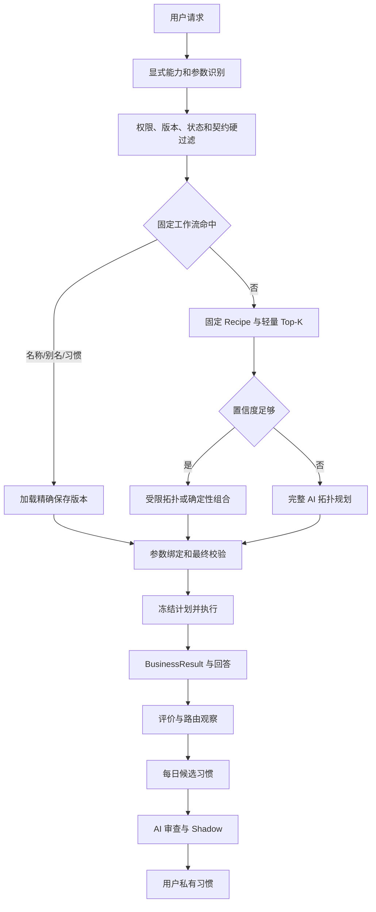
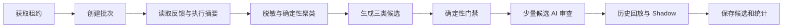

# 企业级用户习惯、反馈闭环与受控能力召回设计

> - 状态：Partial Implementation（Phase 0/1 与 Phase 2 的 `workflow_reuse` 子集已落地）
> - 日期：2026-08-23
> - 定位：企业级、契约驱动、固定流程优先的受控个性化
> - 关联设计：`two-stage-deterministic-planning-and-parameter-binding-design.md`、`user-private-multistep-scheduled-skill-design.md`、`unified-capability-contract-and-validation-design.md`

## 0. 目的与结论

本文解决四个问题：

1. 用户保存的固定工作流尚未成为自然语言请求的优先召回对象。
2. 重复任务反复进入 AI 拓扑规划，增加 Token、延迟和不确定性。
3. 系统缺少评价，不能判断问题来自回答、路由、步骤、参数还是运行时。
4. 需要每天生成“候选习惯”，但不能让系统在线修改生产流程。

最终定位：

> 不建设通用自进化 Agent；在冻结工作流、精确版本和权威契约之上，增加可解释、可关闭、可回滚的用户级复用和偏好学习。

核心决策：

- 固定工作流、确定性 Recipe 和标准适配器优先于 AI 生成拓扑。
- 用户习惯只支持：工作流复用、参数默认、输出偏好。
- AI 只识别和审查，不修改计划、合同、版本或已发布 Schedule。
- 技术 success 不是业务正反馈，必须结合 BusinessResult、评价和用户纠正。
- 每日任务生成用户私有候选；确定性门禁与精确版本 AI 审查均通过后自动生效，不需要管理员逐条审批。
- 外部副作用需要用户明确保存、确认或正向评价。
- 每条习惯属于确定用户，不进入公开 Skill Catalog。
- Embedding、Rerank 仅保留接口和关闭状态，不做具体实现。

## 1. 范围

### 1.1 本期实施

- 保存工作流名称、描述和用户别名匹配。
- 名称、目标、终态动作和契约驱动的轻量 Top-K。
- 固定 Recipe 和确定性结构转换器。
- 回答下方 👍 / 👎 和负向原因。
- 路由来源、计划版本、Token、BusinessResult 的观察记录。
- 每日候选习惯、AI 只读审查、Shadow、自动激活、Hold 和回滚。
- 管理员总览、候选、评价、路由和批次页面。
- 用户关闭个性化、暂停习惯和清除数据。

### 1.2 本期不实施

- Embedding 模型调用、缓存和模型版本管理。
- 向量字段、向量数据库、索引和 RRF。
- Cross-Encoder 或 LLM Rerank。
- 从执行轨迹自动生成新的 DAG。
- 自动修改保存工作流或 Schedule。
- 自动把个人习惯发布为平台 Skill。
- 对每次执行进行模型反思。
- 管理员逐条审批所有低风险个人习惯。

## 2. 当前基线与模块职责

已有基础：

- 两阶段确定性规划：拓扑和参数绑定分离。
- Routing Capability Card、权威输入输出契约和 Control Plane 二次验证。
- 用户私有保存工作流、精确版本、固定输入和 Hash 校验。
- 保存工作流立即执行与定时发布。
- 用户聊天回答下方统一操作区和“保存工作流”。
- Portal 集中管理员路由。

代码落点：

```text
Planner                 apps/backend/intelligence/ai-orchestrator/src/modules/planner/
保存工作流              apps/backend/execution-control/control-plane/src/modules/saved-skill/
用户定时任务            apps/backend/execution-control/control-plane/src/modules/scheduler/
用户聊天                apps/frontend/user-web/src/features/chat/components/
共享回答操作            apps/frontend/shared/chat-web/components/ChatMessageActions.tsx
管理员路由              apps/frontend/portal/src/app/router/routeManifest.tsx
```

服务职责：

| 服务 | 责任 |
| --- | --- |
| AI Orchestrator | 意图识别、候选选择、拓扑规划、聊天反馈入口、候选习惯 AI 审查 |
| Control Plane | 工作流、执行、反馈、路由观察、候选习惯、Active Habit 和管理 API 的事实源 |
| Platform/Catalog | 平台能力版本、授权、发布状态和权威契约 |
| User Web | 评价、保存工作流、用户个性化控制 |
| Admin Portal | 反馈、候选、路由和批次治理 |

约束：AI Orchestrator 和 Control Plane 不得分别维护一份用户习惯事实；每日学习不复用只处理 `skill_schedules` 的用户调度逻辑。

## 3. 企业版请求处理



### 3.1 Level 0：保存工作流精确复用

同时满足以下条件时不调用拓扑模型：

- 当前用户拥有该工作流。
- 名称、用户确认别名或 Active Habit 命中。
- 工作流 active，精确版本存在。
- 终态动作满足本次请求。
- 参数可从用户输入、允许默认值或补参获得。
- `planHash`、`inputHash` 和能力契约有效。

执行顺序固定为：

```text
所有权 → 精确版本 → 参数覆盖 → 契约 → 风险确认 → 执行
```

### 3.2 Level 1：Recipe 与确定性适配器

稳定组合示例：

```text
搜索 -> 总结
PDF 提取 -> 总结
结构化数据 -> 模板渲染 -> Bark
搜索 -> 总结 -> Markdown Writer
```

连接顺序：

```text
精确语义字段 → 确定性转换器 → 受控 LLM Operation → 拒绝或重新规划
```

禁止用对象第一个字段作为 `content`、`text` 的兜底；`execution_status` 不能绑定到 `message_body`。

#### 3.2.1 受治理路由策略词表

产品名和别名（例如 Bark）、意图信号、终态动作、Recipe 角色识别词不得散落在分类器、召回器和拓扑生成器中。统一使用 `routing-policy/v1` 快照：

```text
审计基线
  + 管理员批准的 routing-policy-patch/v1（只允许增量）
  -> Schema 与数量上限校验
  -> version + SHA-256 digest
  -> 运行时快照
```

策略补丁只允许增加以下内容：

- 意图信号：顺序、内容处理、文档来源、产物、搜索、总结和未覆盖终态动作。
- 终态动作别名：如 Bark、邮件、短信、Markdown 和 PDF。
- 能力角色别名：搜索、Markdown Writer、文档提取器。
- 意图规范化同义词和停用词。

策略补丁禁止修改 Recipe DAG、能力 ID/版本、参数绑定、契约、风险级别和副作用许可。错误配置保留最后一个有效快照，不降级为空策略。AI Orchestrator 支持 `ROUTING_POLICY_FILE` 或 `ROUTING_POLICY_JSON`；内联 JSON 优先，文件模式在路由请求到来时惰性检查，最多每 30 秒按内容和修改时间重载一次。

最小补丁示例：

```json
{
  "schemaVersion": "routing-policy-patch/v1",
  "version": "admin-approved-7",
  "additions": {
    "signals": {
      "processing": ["飞书推送"],
      "uncoveredAction": ["飞书推送"]
    },
    "terminalActions": {
      "feishu": ["飞书推送"]
    }
  }
}
```

该策略属于平台/租户治理配置，不属于某个用户的 Active Habit。用户反馈和执行成功只能形成“路由策略候选”，不能直接写生产词表；用户自己的表达仍通过保存工作流别名和 `habitIntentKeys` 参与用户级召回，不能扩散到其他用户。

### 3.3 Level 2：轻量 Top-K

召回来源：

1. 当前用户保存工作流名称和别名。
2. 平台 Skill 名称、描述和目标。
3. 显式终态动作，如 Bark、邮件、文件输出。
4. 输入输出语义类型。
5. 当前用户 Active Habit。
6. 历史业务成功与用户纠正摘要。

处理顺序：

```text
硬过滤
→ 精确名称/别名
→ 词法目标
→ 终态动作
→ 契约兼容排序
→ 用户习惯有限加权
→ 最多 5 个短卡片进入 Planner
```

多个候选接近时，本期直接进入现有受限拓扑 Planner，不实现 Rerank。

### 3.4 Level 3：完整 AI 规划

只用于没有固定流程、新多目标组合或 Top-K 置信度不足的请求。Planner 仍只能选择 Catalog 中已有能力，不能生成新 Skill。

## 4. 轻量 Top-K 与预留接口

### 4.1 候选短卡片

```ts
interface EnterpriseRoutingCardV1 {
  key: string;
  sourceKind: 'published_skill' | 'builtin_skill' | 'llm_operation' | 'saved_workflow';
  sourceId: string;
  sourceVersion: string;
  ownerUserId?: string;
  displayName: string;
  description: string;
  aliases: string[];
  goals: string[];
  accepts: string[];
  produces: string[];
  terminalActions: string[];
  sideEffectLevel: 'none' | 'read' | 'write' | 'external_commit';
  contractDigest: string;
}
```

不包含完整计划、完整 Schema、参数值、凭据和历史结果正文。

### 4.2 硬过滤与排序

硬过滤项：所有权、权限、发布/部署/启用状态、精确版本、合同摘要、显式能力、输入输出兼容、最终输出类型和副作用策略。模型和习惯不能恢复已过滤候选。

排序优先级：

```text
显式指定
> 保存工作流精确名称
> 用户确认别名
> 目标和终态完整覆盖
> 契约兼容
> 已确认工作流习惯
> 业务成功与正向评价
> 普通词法相似度
```

业务失败、用户纠正、缺少终态动作、不必要副作用和合同变化降低排序或使候选失效。习惯永远不能覆盖本次明确要求。

### 4.3 Embedding 接口，仅预留

```ts
interface SemanticCandidateRetriever {
  readonly providerId: string;
  search(input: {
    userId: string;
    normalizedRequest: string;
    candidates: EnterpriseRoutingCardV1[];
    limit: number;
  }): Promise<Array<{ candidateKey: string; score: number; providerId: string }>>;
}
```

本期仅注册：

```ts
class DisabledSemanticCandidateRetriever implements SemanticCandidateRetriever {
  readonly providerId = 'disabled';
  async search() { return []; }
}
```

### 4.4 Rerank 接口，仅预留

```ts
interface CandidateReranker {
  readonly providerId: string;
  rerank(input: {
    normalizedRequest: string;
    candidates: EnterpriseRoutingCardV1[];
  }): Promise<{
    decision: 'ranked' | 'no_match' | 'not_available';
    orderedCandidateKeys: string[];
    reason?: string;
  }>;
}
```

本期仅注册 `DisabledCandidateReranker`，固定返回 `not_available`。Feature Flag 默认关闭：

```text
routing.semanticRetriever.enabled = false
routing.candidateReranker.enabled = false
```

未来只有离线数据证明词法 Recall@5 不足，且成本、审计和可靠性可接受时，才单独立项实现。

## 5. Token、可靠性与信任

### 5.1 Token 预算

| 场景 | 规划 Token |
| --- | ---: |
| 保存工作流精确/别名命中 | 0 |
| 固定 Recipe/适配器 | 0 |
| 受限 Top-K 拓扑 | 一次短输入调用 |
| 新多步骤任务 | 完整拓扑调用 |
| 已发布 Schedule | 0 |

控制方式：Planner 最多接收 5 个短卡片；完整 Schema 选中后由代码加载；每日任务先用代码聚类，AI 只审查少量摘要；相同请求、版本和策略允许缓存路由结果。

### 5.2 信任模型

| 属性 | 要求 |
| --- | --- |
| 可预测 | 精确工作流版本、固定 Schedule、显式参数优先 |
| 可解释 | 展示匹配来源、方式、版本、终态、是否调用 AI 和 Token |
| 可验证 | 契约、Schema、BusinessResult 与技术状态分别验证 |
| 可回滚 | 习惯版本、Hold、回滚、用户禁用和合同变化失效 |
| 可控制 | 用户关闭个性化，企业级 Kill Switch，管理员可 Hold/回滚，习惯不提高权限 |

执行详情路由摘要示例：

```text
匹配来源：用户保存工作流
匹配方式：确认别名
工作流版本：3
终态动作：Bark 推送
拓扑模型：未调用
Embedding/Rerank：未启用
估算节省规划 Token：约 1,200
```

## 6. 回答评价

### 6.1 页面与交互

```text
┌──────────────────────────────────────────────────────┐
│ AI 回答 / TaskOutcomeBlock                          │
│ 已查询天气并通过 Bark 推送。                         │
└──────────────────────────────────────────────────────┘
  [保存工作流] [复制] [重试] [👍] [👎]       18:24
```

- 只显示在已完成的 Assistant 消息下方。
- Streaming、等待输入、等待审批、人工接管不显示。
- 任务完成和失败都允许评价。
- 👍 直接提交；👎 必须选原因，可选说明。
- 可切换或取消，网络失败恢复原状态。
- `userId + sessionId + messageId` 保证幂等。

### 6.2 负向原因与归因

```ts
type NegativeReasonCode =
  | 'answer_incorrect'
  | 'wrong_skill_or_workflow'
  | 'missing_step'
  | 'wrong_parameters'
  | 'wrong_output_format'
  | 'execution_failed'
  | 'unsafe_or_unexpected_side_effect'
  | 'other';
```

| 原因 | 分析通道 |
| --- | --- |
| answer_incorrect | 回答/总结质量 |
| wrong_skill_or_workflow | 路由负样本 |
| missing_step | 拓扑目标覆盖 |
| wrong_parameters | 参数识别与默认值 |
| wrong_output_format | 输出偏好 |
| execution_failed | 运行质量，不直接作为偏好 |
| unsafe_or_unexpected_side_effect | 强负反馈，立即 Hold |

### 6.3 前端模块

```text
apps/frontend/user-web/src/features/chat/components/feedback/
  MessageFeedbackActions.tsx
  NegativeFeedbackPopover.tsx
  useMessageFeedback.ts
  feedbackReasonOptions.ts
```

`ChatMessageItem` 只组合组件；共享 `ChatMessageActions` 只提供展示槽位，不承载 API 状态。

### 6.4 接口与事件

```http
PUT    /chat/sessions/:sessionId/messages/:messageId/feedback
GET    /chat/sessions/:sessionId/messages/:messageId/feedback
DELETE /chat/sessions/:sessionId/messages/:messageId/feedback
```

```ts
interface AssistantFeedbackEventV1 {
  schemaVersion: 'assistant-feedback/v1';
  eventId: string;
  revision: number;
  eventType: 'set' | 'clear';
  userId: string;
  sessionId: string;
  messageId: string;
  executionId?: string;
  rating?: 'positive' | 'negative';
  reasonCode?: NegativeReasonCode;
  sanitizedComment?: string;
  occurredAt: string;
}
```

AI Orchestrator 验证消息归属并清理评论，Control Plane 追加保存事件并维护当前评价投影。有 `executionId` 时补充执行和计划引用；普通聊天评价不生成工作流习惯。

## 7. 用户习惯

### 7.1 类型与边界

```ts
type HabitKind = 'workflow_reuse' | 'parameter_default' | 'presentation_preference';
```

| 类型 | 示例 |
| --- | --- |
| workflow_reuse | 微博热点总结优先使用保存工作流版本 3 |
| parameter_default | 天气地点默认北京，未明确平台时默认微博 |
| presentation_preference | 默认中文、简洁、Markdown |

禁止学习：新 DAG、节点和依赖、绑定路径、Skill 升级、凭据、未经确认的副作用，以及来自单次技术成功的长期偏好。

### 7.2 生命周期与生效

```text
candidate → shadow → active → disabled / expired
任意阶段可进入 held / rejected
```

- `workflow_reuse` 只能引用已有保存工作流精确版本。
- 外部副作用需要用户明确保存、👍 或“以后都这样”。
- 参数习惯只填充未提供字段。
- 输出偏好不能改变业务数据和步骤。
- 本次明确输入永远优先。
- 合同变化后习惯回到 shadow 或 expired。

### 7.3 用户控制

```text
设置 / 个性化
  ├── 允许根据历史执行优化推荐
  ├── 当前生效习惯
  ├── 暂停某条习惯
  └── 清除全部个性化数据
```

关闭个性化不影响保存工作流和已有 Schedule。

## 8. 每日候选习惯

### 8.1 调度与流程

每日学习是独立系统任务，不使用 `skill_schedules`，不产生普通用户 Execution。新增 `SystemJobScheduler`，通过数据库租约和水位保证幂等与恢复；默认每天 `02:30 Asia/Shanghai`。

```text
windowStart = previousSuccessfulWatermark
windowEnd   = currentRunCutoff
```



### 8.2 输入与签名

输入事实：BusinessResult、技术状态、冻结 `planHash`、脱敏计划签名、保存工作流、创建 Schedule、评价、重试前后变化和 Routing Observation。

```text
planSignature = hash(
  capability ids and versions
  + normalized DAG edges
  + semantic bindings
  + terminal action
)
```

签名排除参数值、凭据、Execution ID、时间戳和展示名。

### 8.3 候选门槛

| 证据 | 处理 |
| --- | --- |
| 保存工作流或明确“以后都这样” | 直接生成候选 |
| 30 天内相同意图和计划至少 3 次业务成功 | 生成候选 |
| 至少 2 次业务成功且有一次 👍 | 生成候选 |
| 只有技术 success | 弱信号，不激活 |
| 任意强负反馈 | 阻止自动激活 |
| 非预期副作用 | 立即 held |

证据不足时允许零候选。

### 8.4 AI 审查与 Shadow

AI 只接收脱敏候选摘要，输出 `pass | warning | reject`，不能返回修改后的计划。模型不可用时候选保持 candidate，不影响线上任务。

用户私有 `workflow_reuse` 候选不进入管理员审批队列。保存工作流时已经完成 AI 审查，因此每日任务复用相同冻结版本的审查结果，避免重复消耗 Token 和产生审查漂移：

```text
显式保存的用户私有工作流
→ 精确版本与 planHash 校验
→ 复用该版本 AI 审查
→ pass：自动写入 Active Habit
→ warning / block / 审查不可用：保持 candidate，不影响路由
```

自动生效只增加该用户的 `habitIntentKeys`，不会修改工作流 DAG、参数、凭据、Schedule 或平台词表。用户关闭个性化时 Active Habit 不参与召回；`HABIT_LEARNING_ACTIVATION_ENABLED=false` 是企业级紧急暂停开关，而不是日常审批开关。

Shadow 只比较：基线选择、应用候选后的假设选择、精确工作流版本、合同结果、风险结果和后续评价。不得执行第二次 Bark、邮件、发布等真实副作用。

### 8.5 路由策略候选边界

路由词表优化必须拆成两条链，不能把用户私有学习和平台共享策略混在一起。

用户私有自动路由：每日任务从该用户的误路由反馈、明确纠正、成功复用和保存别名中生成 `user_routing_hint`，绑定用户、保存工作流和精确版本。确定性门禁通过后由 AI 只读审查，`pass` 自动写入该用户的 Active Habit，不需要管理员审核；`warning/block` 不生效。管理员只能观察、Hold 和回滚。

```text
单用户反馈与明确纠正
→ 脱敏的 user_routing_hint
→ 所有权、版本、终态和冲突检查
→ AI 只读审查
→ Shadow 回放
→ pass 自动写入该用户 habitIntentKeys
```

平台共享策略：每日任务未来可以从多用户、脱敏后的误路由与纠正数据中生成 `routing_policy_candidate`，它是平台治理对象，不是用户习惯。只有这一条跨用户链路需要管理员发布：

```text
重复误路由/明确纠正
→ 聚合且脱敏的候选别名
→ 冲突、覆盖率与回归样本检查
→ AI 只读审查
→ Shadow 回放
→ 管理员批准并发布平台共享策略版本
→ 灰度加载与可回滚
```

禁止按单次成功或单个用户评价生成全局别名。用户私有自动路由与平台共享词表必须隔离：用户已明确保存且精确版本 AI 审查为 `pass` 时，即使固定流程包含推送等已确认终态，也可自动启用该用户的路由习惯；系统不会在 Shadow 阶段再次执行副作用。当前已落地用户保存工作流名称形成的 `workflow_reuse` 自动激活；从反馈纠正中抽取全新 `user_routing_hint` 仍待实现。平台侧当前已落地受治理策略加载器和集中词表，`routing_policy_candidate` 的聚合生成、管理发布和版本存储尚未落地。

## 9. 管理员可视化

### 9.1 入口与布局

新增 `/admin/habit-learning`，导航名称“习惯学习”，与技能管理、Prompt 调试相邻，不与用户侧“我的工作流”混合。

```text
┌─ 习惯学习 ───────────────────────────────────────────────┐
│ 最近批次：成功 08-23 02:30  下次运行：08-24 02:30       │
│ [重跑失败批次] [暂停自动生效] [查看策略版本]             │
├──────────────────────────────────────────────────────────┤
│ 今日候选 42 │ Shadow 30 │ Active 8 │ Held 1             │
│ 评价覆盖率 14% │ 固定工作流复用率 32% │ Token -38%       │
├──────────────────────────────────────────────────────────┤
│ 候选趋势                 │ 负向评价原因                  │
├──────────────────────────────────────────────────────────┤
│ [候选习惯] [生效习惯] [评价分析] [路由诊断] [运行批次]  │
└──────────────────────────────────────────────────────────┘
```

总览指标：批次状态、水位、积压、候选状态分布、评价覆盖和原因、固定流程复用率、直接复用/Recipe/Top-K/完整 Planner 比例、Planner Token 和激活后的反馈变化。本期不显示 Embedding/Rerank 调用指标。

### 9.2 候选列表与详情

列表支持状态、类型、风险、批次、证据、AI 结论、副作用和匿名用户筛选。字段包括：脱敏意图、习惯类型、保存工作流精确版本、业务成功、👍/👎、纠正次数、审查、风险和状态。

详情 Drawer：

```text
基本信息：类型、状态、匿名用户、策略和批次
建议内容：意图、工作流版本或偏好字段
固定流程：Weather -> Template Renderer -> Bark
证据：业务/技术结果、评价和纠正
审查：确定性门禁、AI、合同和风险
Shadow：基线与假设选择
操作：Hold、拒绝、回滚；AI 审查通过后自动激活，不提供管理员“批准激活”操作
```

### 9.3 管理边界

管理员可以观察、Hold、拒绝、回滚、重跑批次、暂停自动生效和调整门槛；不能批准或修改用户私有路由候选，不能修改用户工作流、参数、凭据、Schedule，也不能把个人习惯直接发布为平台 Skill。用户私有候选由 AI 审查，不需要管理员逐条审批。

## 10. 数据与 API

### 10.1 数据表

| 表 | 用途 | 关键约束 |
| --- | --- | --- |
| `assistant_feedback_events` | 追加评价事实 | 用户、会话、消息、revision 唯一 |
| `assistant_feedback_current` | 当前评价投影 | 用户、会话、消息主键 |
| `user_workflow_aliases` | 保存工作流词法别名 | owner、skill、version、alias |
| `routing_observations` | 候选、选择、Token、合同与结果摘要 | 不保存敏感原文 |
| `habit_learning_runs` | 水位、租约、批次、Token、错误 | 窗口和策略幂等 |
| `user_habit_candidates` | 候选、证据、审查、Shadow、风险 | owner 必填 |
| `user_habits` | 生效习惯投影和版本 | owner 必填 |

本期不新增向量字段或向量表。

### 10.2 用户 API

```http
PUT/GET/DELETE /chat/sessions/:sessionId/messages/:messageId/feedback
GET               /user-habits
PATCH             /user-habits/:id/status
DELETE            /user-habits/:id
DELETE            /user-habits
PATCH             /user-preferences/personalization
```

### 10.3 管理 API

```http
GET  /admin/habit-learning/overview
GET  /admin/habit-learning/candidates
GET  /admin/habit-learning/candidates/:id
POST /admin/habit-learning/candidates/:id/hold|reject|rollback
GET  /admin/habit-learning/habits
GET  /admin/habit-learning/feedback-analytics
GET  /admin/habit-learning/routing-diagnostics
GET  /admin/habit-learning/runs
GET  /admin/habit-learning/runs/:id
POST /admin/habit-learning/runs/:id/retry
PATCH /admin/habit-learning/policy
```

管理员写操作记录操作者、原因、目标、前后摘要和时间。

## 11. 推荐代码组织

```text
packages/backend-contracts/experience-learning/
  feedback.ts  routing.ts  habit.ts  admin.ts

ai-orchestrator/src/modules/planner/retrieval/
  enterprise-candidate-retriever.service.ts
  deterministic-candidate-ranker.service.ts
  semantic-candidate-retriever.port.ts
  disabled-semantic-candidate-retriever.adapter.ts
  candidate-reranker.port.ts
  disabled-candidate-reranker.adapter.ts
  routing-observation.service.ts

ai-orchestrator/src/modules/chat-feedback/

control-plane/src/modules/experience-learning/
  feedback/  workflow-alias/  routing-observation/
  habit-candidate/  habit-evaluation/  habit-activation/
  system-job/  admin/

user-web/src/features/chat/components/feedback/
user-web/src/features/settings/personalization/
portal/src/features/admin/habit-learning/
```

不要扩大 `saved-skill.service.ts`、`scheduler.service.ts` 或主消息组件；页面按总览、候选、评价、路由和批次拆分。

## 12. 安全、可观测与验收

### 12.1 安全

- 管理页面默认匿名用户短 Hash，不返回原始 Prompt、完整结果和参数值。
- 评论清理 Token、Cookie、Authorization、URL 凭据和用户路径。
- 习惯只保存结构化偏好或精确工作流引用；凭据只保存 Credential Reference。
- 用户关闭或清除个性化后，候选和 Active Habit 一并停用。
- 用户评论作为不可信数据进入 AI，不能成为系统指令。
- 反馈默认不用于外部模型训练。

### 12.2 指标

```text
routing_decision_total{source}
routing_saved_workflow_reuse_total
routing_no_match_total
routing_contract_rejections_total
planner_input_tokens_total
assistant_feedback_total{rating,reason}
assistant_feedback_coverage_ratio
habit_learning_run_total{status}
habit_candidates_total{kind,status,risk}
habit_activation_total
habit_rollback_total
```

### 12.3 验收

- 用户 A 的工作流不能进入用户 B 的候选。
- 精确名称/别名命中不调用拓扑模型。
- 显式 Bark 请求不能选择缺少 Bark 的流程。
- 合同不兼容候选不能执行。
- 习惯不能覆盖显式 Skill 和参数。
- Disabled Embedding/Rerank 不产生任何外部调用且不改变排序。
- Streaming 不显示评价；👎 必须选原因；评价切换和取消幂等。
- 每日批次按水位恢复，不重复候选；单用户失败不阻断全批次。
- 只有技术 success 不生成 Active Habit；强负反馈阻止激活。
- Shadow 不执行真实外部副作用。
- 非管理员不能访问治理页面；用户私有候选不等待管理员批准；Hold 和回滚立即生效并写审计。

产品指标：

| 指标 | 初始目标 |
| --- | --- |
| 保存工作流名称/别名 Recall@5 | 100% |
| 用户私有候选越权 | 0 |
| 合同不兼容进入执行 | 0 |
| 已确认固定流程规划 Token | 0 |
| 重复任务平均规划 Token | 下降至少 40% |
| 评价写入成功率 | ≥ 99.9% |
| Shadow 重复副作用 | 0 |

## 13. 分阶段落地

### 13.0 落地矩阵（2026-08-23）

| 能力 | 状态 | 当前边界 |
| --- | --- | --- |
| 回答评价与归属/幂等校验 | 已落地 | 👍 / 👎、原因和当前投影 |
| Routing Observation | 已落地 | 不保存原始 Prompt |
| 用户保存工作流名称、别名与 Active Habit 召回 | 已落地 | 用户级、精确版本、最多 Top-5、歧义拒绝 |
| `workflow_reuse` 每日候选与 AI 自动激活 | 已落地 | 仅明确保存、精确版本 AI 审查为 `pass` 的用户私有工作流；默认开启，可紧急暂停 |
| 候选 AI 审查 | 部分落地 | 当前复用保存工作流已有审查，不对每日候选再次调用模型 |
| Shadow | 部分落地 | 记录假设选择且不执行副作用；尚无完整离线回放评分器 |
| 管理员候选/批次/评价/路由页面 | 已落地 | 只做观察、Hold、拒绝和回滚，不承担用户候选审批 |
| 基线 Recipe | 已落地 | Recipe DAG 在代码中受审查；尚无 Catalog 与版本治理页面 |
| Routing Policy 集中加载 | 已落地 | 只增量、版本/Digest、文件或环境加载、无效配置保留旧版本 |
| 用户反馈发现 `user_routing_hint` | 未落地 | 目标链路是 AI 审查通过后仅对该用户自动生效，不经过管理员审批 |
| `routing_policy_candidate` 自动优化闭环 | 未落地 | 候选生成、聚合回归、管理员发布和版本存储均未实现 |
| `parameter_default` / `presentation_preference` | 未落地 | 不参与线上激活 |
| 公共 Skill Catalog 通用 Top-K | 已落地（轻量版） | 显式名称/别名先确定性命中；否则最多披露 5 张名称与短摘要卡片。Embedding、Rerank、历史行为排序保持关闭 |
| Embedding / Rerank | 仅接口 | Disabled Adapter，不调用模型、不建向量表 |

### Phase 0：评价与观察

- 共享 Feedback、Routing Observation、Habit 合同。
- 反馈事件、当前投影和用户所有权校验。
- User Web 增加 👍 / 👎。
- 记录候选来源、选择、Token 和 BusinessResult。
- 管理员先上线评价和路由统计。

不改变线上路由。

当前实现状态（2026-08-23）：

- 已落地 `assistant_feedback_events` 追加事实表和 `assistant_feedback_current` 当前投影表。
- 已落地 AI 会话归属校验、幂等事件写入和回答区 👍 / 👎 交互。
- 已落地管理员 `/admin/habit-learning` 页面，包含候选、批次、评价和路由诊断；用户私有候选默认由 AI 自动审核生效。
- 已落地 `SemanticCandidateRetriever`、`CandidateReranker` 及 Disabled Adapter；没有模型、向量表或排序实现。
- 已落地当前用户私有保存工作流的 Level 0 名称召回：规范化名称、高阈值匹配、歧义拒绝，命中后按精确保存版本直接创建执行，不调用拓扑模型。
- Level 0 当前只读取 Control Plane 的用户事实源，不把保存工作流混入公共 Skill Catalog；执行事件会标明 `routeSource=saved_workflow`。
- 已修复确定性计划缺参状态机：计划冻结后进入 `waiting_input`，补参值写入冻结 `user_input` 路径，并恢复同一执行单和原拓扑。
- 已增加 `clientMessageId` 端到端消息身份，长时间规划后不再依赖五分钟时间窗合并重复用户消息。
- 已落地用户确认别名及用户级唯一约束；“我的工作流”支持维护最多 10 个别名。
- 已落地保存工作流轻量 Top-K：先做所有权、状态、精确版本、步骤数和显式终态动作硬过滤，再做名称、别名、Active Habit 和普通词法的确定性排序；最多保留 5 个候选，歧义时拒绝直接复用。
- 已落地公共 Skill 单步匹配的分级披露：目标 Skill 上下文优先，显式名称/品牌别名唯一命中时零 LLM；只有歧义请求才向匹配模型披露最多 5 张短卡片，不披露参数 Schema、凭据、完整运行元数据和聊天历史；模型调用设置独立延迟预算，超时后退回确定性策略。
- 已落地单步续接参数的渐进披露：先应用可信上一执行结果、已采集值、系统值和默认策略；仅剩余字段进入参数识别，上一执行正文和聊天历史不再重复进入识别 Prompt。终态动作已有协议展示文案时，不再追加结果总结模型调用。
- 已落地 Routing Observation：只保存请求指纹、候选数、匹配方式、选择版本、路由策略 Version/Digest、Planner 是否调用和合同状态，不保存原始 Prompt；管理员页面展示最近 30 天路由诊断。
- 已落地每日候选基础链路：独立系统 Runner、上海时区 02:30、批次幂等键、成功水位、租约、单用户/单工作流失败隔离和手工触发。
- 已落地 `workflow_reuse` 候选。候选复用保存工作流精确版本已有的 AI 审查结果，不再次消耗审查 Token；Shadow 只记录假设选择并固定 `executedSideEffects=false`。
- 已落地管理员候选、运行批次、路由诊断和评价分析页面；候选支持 Hold、拒绝和回滚，写操作追加治理审计，管理员不负责批准激活。
- 已落地用户个性化开关、生效习惯列表、逐条暂停和清除；关闭或清除不影响保存工作流与 Schedule。
- 已落地 `workflow_reuse` AI 自动激活：只有明确保存、引用精确版本且该版本 AI 审查为 `pass` 的候选自动生效；不重复调用模型，Active Habit 只有在用户启用个性化时进入召回。
- 已落地 180 天过期、版本不一致自动不参与召回，以及“非预期副作用”负反馈立即 Hold。
- 已落地搜索/总结、PDF 提取/总结、Markdown 写入等基线 Recipe；Recipe 结构仍是受审查代码，信号词和能力角色别名已切到版本化 Routing Policy。Recipe Catalog、管理发布和回滚尚未落地。
- 已落地 Routing Policy 集中词表、增量补丁校验、版本/Digest、环境或文件加载、30 秒检查和无效配置 fail-closed；平台级 `routing_policy_candidate` 自动生成、管理员发布和策略版本存储尚未落地。
- 参数默认习惯和展示偏好习惯尚未进入线上激活；Embedding/Rerank 保持禁用接口。

### Phase 1：固定工作流优先与候选 Shadow

- 保存工作流别名、轻量 Top-K 和确定性排序。
- 精确命中绕过拓扑模型并展示路由解释。
- 每日 System Job、候选生成、AI 只读审查和 Shadow。
- 管理员上线候选、详情和批次。

当前进度：固定工作流名称/别名复用、用户私有与公共 Skill 轻量 Top-K、路由观测、每日批次、复用既有 AI 审查、无副作用 Shadow 和管理可视化已完成。基线 Recipe 已运行；Recipe Catalog、Embedding/Rerank 与基于历史行为的排序仍待后续独立实现。

### Phase 2：受控激活

- 用户个性化设置。
- 激活低风险参数默认和输出偏好。
- 激活有明确用户证据的固定工作流复用。
- Hold、回滚、过期和合同变化失效。

当前进度：用户个性化开关、`workflow_reuse` 精确版本 AI 自动激活、Hold、回滚、过期、版本失效和强负反馈自动 Hold 已完成；参数默认值和输出偏好的学习与激活仍保持关闭。自动激活默认开启，企业级 Kill Switch 和用户启用个性化是两个独立门禁，不存在管理员逐条批准门禁。

三个阶段都不实现 Embedding/Rerank，只提交 Port、Disabled Adapter 和默认关闭的 Flag。

推荐拆分顺序：合同与 migration → Feedback API → 评价 UI → 路由观察 → 别名与 Top-K → 精确复用 → 每日批次 → AI 审查与 Shadow → 管理页面 → 用户控制 → 受控激活 → 两个禁用接口。

当前实际配置入口：

```text
HABIT_LEARNING_DAILY_JOB_ENABLED = true
HABIT_LEARNING_ACTIVATION_ENABLED = true  # false 仅用于企业级紧急暂停
ROUTING_POLICY_FILE = <reviewed routing-policy-patch/v1 file>
ROUTING_POLICY_JSON = <optional inline patch; takes precedence>
SemanticCandidateRetriever = DisabledSemanticCandidateRetriever
CandidateReranker = DisabledCandidateReranker
```

`feedback.enabled`、`routing.enterpriseTopK.enabled`、`habitLearning.shadow.enabled` 等命名仍是目标配置模型，尚未统一接入配置中心，不能在运维文档中当作已经生效的 Flag。

## 14. 风险与最终方案

| 风险 | 对策 |
| --- | --- |
| 技术 success 被当成业务成功 | BusinessResult、评价、技术状态分开计权 |
| 固定工作流误匹配 | 所有权、终态、契约和版本共同校验 |
| 习惯覆盖本次请求 | 显式请求优先，习惯只补缺失信息 |
| 每日任务重复或漏处理 | 租约、水位、批次和幂等键 |
| Shadow 重复副作用 | 只计算假设选择，不执行真实业务 |
| AI 审查不可用 | 候选留在 candidate，不影响正常执行 |
| 管理员看到敏感内容 | 默认脱敏聚合，详情提升权限并审计 |
| 预留接口被误认为已实现 | Disabled Adapter、关闭 Flag、页面明确未启用 |

最终路径：

```text
固定工作流优先
→ 契约和版本裁决
→ 轻量 Top-K
→ 必要时完整 AI 规划
→ 记录路由和业务结果
→ 用户评价
→ 每日有限候选
→ AI 只读审查
→ Shadow
→ 精确版本 AI 审查通过后自动生效（用户可关闭，管理员可 Hold/回滚）
```

这是一套企业级受控个性化机制：Token 可计算、流程可冻结、选择可解释、结果可验证、习惯可关闭、异常可回滚、用户严格隔离。

## 15. 参考

- [Agent Workflow Memory](https://arxiv.org/abs/2409.07429)：借鉴历史工作流的选择性复用，不采用在线改写流程。
- [Pi Skills](https://github.com/badlogic/pi-mono/blob/main/packages/coding-agent/docs/skills.md)：借鉴短描述和按需加载，控制上下文 Token。
- [DeepSeek Harness Skills](https://github.com/deepseek-ai/deepseek-harness/blob/master/docs/subsystems/skills.md)：借鉴受限 Skill catalog。
- [DeepSeek Harness Sessions](https://github.com/deepseek-ai/deepseek-harness/blob/master/docs/subsystems/session.md)：借鉴追加事件作为事实源，当前状态由投影产生。
