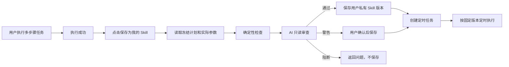
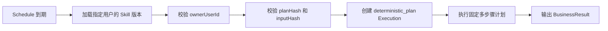

# 用户私有多步骤定时 Skill 设计

> 状态：MVP 已落地（版本管理、停用/删除、审计事件与重叠策略待后续迭代）  
> 日期：2026-08-17  
> 适用范围：用户从一次成功的多步骤执行中保存固定能力，并将其配置为定时任务  
> 核心约束：每个保存的 Skill 必须属于一个确定用户，不共享、不公开、不重新规划

## 0. 落地状态（2026-08-17）

首期已经完成：

- `UserSavedSkill` / `UserSavedSkillVersion` 数据模型与数据库 migration。
- 从成功的冻结多步执行读取计划、固定参数和业务结果样例。
- 保存资格检查、瞬态参数清洗、明文敏感字段阻断、planHash/inputHash 校验。
- AI 只读审查接口；审查结果不能改写计划，模型不可用时按用户级轻量能力降级为 warning。
- 当前用户私有的保存、列表和详情接口。
- Execution Resolver 识别私有工作流并直接进入 `deterministic_plan`，不调用 Planner。
- Schedule 固定 `skillId + skillVersion + runtimeOverrides`，默认值来自保存版本，并补齐列表、详情、更新、删除和手动触发的用户所有权过滤。
- AI 回答下方“保存工作流”入口、保存 Drawer，以及“已发布技能 / 我的工作流”独立 Tab。
- 我的工作流可直接进入立即执行或定时任务配置；运行参数可修改，保存版本和拓扑保持不可变。

首期有意不包含：

- 工作流编辑、从新执行创建版本、Schedule 手动升级版本。
- 停用、软删除和完整审计事件面板。
- Schedule 重叠执行策略和失败通知策略。
- 将保存资格直接写入聊天消息元数据；当前由前端按 executionId 查询资格。

相关代码入口：

```text
control-plane/src/modules/saved-skill/
ai-orchestrator/src/modules/user-workflow-review/
user-web/src/features/chat/components/workflow-save/
user-web/src/features/skills/saved-workflows/
```

## 1. 背景

当前定时任务主要通过 `skillId + skillVersion + input` 触发单 Skill 执行。系统已经具备 `deterministic_plan` 多步骤执行能力，并会为执行保存冻结后的 `ExecutionPlan.planJson`、`planHash`、节点依赖、输入绑定和输出契约，但缺少把一次成功执行转换为用户可重复使用能力的轻量入口。

目标场景示例：

```text
用户请求：查看微博热点，并且进行总结

第一次执行：
  1. 查询微博热点
  2. 将热点列表传给总结能力
  3. 输出统一 BusinessResult

用户操作：
  执行成功 -> 保存为我的 Skill -> 创建定时任务

后续执行：
  使用原多步骤计划和固定参数直接执行，不再调用 Planner
```

这是用户个人自动化能力，不需要进入正式的组织级 Capability Release、审批和部署流程。创建时只需要 AI 审查该计划是否适合无人值守重复执行。

## 2. 设计目标

### 2.1 目标

- 从一次成功的多步骤执行直接保存为用户私有 Skill。
- 每个保存的 Skill 必须绑定唯一 `ownerUserId`。
- 保存时复用已经成功执行的冻结计划，不重新规划。
- 保存业务参数默认值，立即执行或创建定时任务时允许用户覆盖本次运行值。
- AI 只负责审查，不允许改写步骤、拓扑、绑定或参数。
- Schedule 继续使用 `skillId + skillVersion + input`，保持现有主流程。
- 单步 Skill 和已有定时任务不受影响。
- 用户更新工作流默认值或计划时生成新版本；单次执行或 Schedule 的参数覆盖不修改版本。

### 2.2 非目标

- 不支持将用户私有 Skill 分享给其他用户或组织。
- 不支持公开市场、组织审批和正式 Capability Release。
- 不从 `resultJson` 反向生成或重新推测执行计划。
- 不允许定时触发时调用 Planner 重新拆解任务。
- 不在第一阶段提供复杂的可视化流程编辑器。
- 不自动修复 AI 审查发现的问题。

如未来需要共享，可单独增加“晋级为组织 Skill”流程，不改变本设计中的用户私有模型。

## 3. 核心设计原则

### 3.1 执行事实和重复定义分离

- `Execution` 记录某一次真实执行，是审计事实。
- `UserSavedSkillVersion` 保存可重复执行的定义，是不可变快照。
- `Execution.resultJson` 只作为成功证据和审查样例，不作为模板定义来源。
- 真正保存的执行定义来自 `ExecutionPlan.planJson`。

### 3.2 保存而不是重新规划

保存过程只允许：

1. 读取冻结计划。
2. 读取实际使用的参数。
3. 清除瞬态运行数据。
4. 执行确定性校验和 AI 审查。
5. 保存不可变快照。

禁止在保存过程中：

- 新增、删除或重新排序节点。
- 修改 `dependsOn`。
- 修改 `inputBindings`。
- 替换 Skill 或 LLM Operation。
- 根据执行结果重新生成计划。

### 3.3 用户所有权不可为空

每个保存的 Skill 必须满足：

```text
ownerUserId NOT NULL
visibility = private
```

第一阶段不支持：

- `ownerUserId = null`。
- 公共可见。
- 组织成员共享。
- 用户之间转移所有权。
- 管理员绕过所有权直接替用户执行。

管理员如需排障，只能读取脱敏审计信息；任何代执行行为都必须经过独立的受审计机制，不属于本设计范围。

### 3.4 定时任务引用不可变版本

Schedule 必须同时固定：

```text
skillId
skillVersion
fixedInput
```

不能只引用“当前版本”。用户修改 Skill 后创建新版本，已有 Schedule 默认继续运行旧版本，用户明确选择升级后才更新引用。

## 4. 用户流程

### 4.1 保存并创建定时任务



为了减少用户操作，也可以在执行结果上提供一个组合按钮：

```text
创建定时任务
```

后台自动完成：

```text
保存私有 Skill -> AI 审查 -> 激活 -> 创建 Schedule
```

用户只需确认 Skill 名称、Cron、时区和固定参数。

### 4.2 后续定时执行



整个过程不调用 Planner。

### 4.3 页面信息架构

用户侧页面采用两个入口，但共享同一套 Skill 卡片视觉基础：

```text
AI 聊天
  -> AI 完成多步骤任务
  -> 回答卡片下方显示“保存工作流”

技能一览 /published-skills
  ├── 已发布技能
  │     ├── 已授权技能
  │     └── 未授权 / 申请记录
  └── 我的工作流
        └── 当前用户保存的私有多步骤 Skills
```

“已发布技能”和“我的工作流”必须分开：

- 使用独立 Tab。
- 使用独立 API 和 Query Cache Key。
- 使用独立领域类型。
- 搜索、数量、空状态和分页分别计算。
- 不把用户私有 Skill 合并进公开 Catalog 响应。
- 不在“我的工作流”中展示授权申请和部署状态。

页面样式可以复用，权限与数据模型不能混用。

### 4.4 AI 聊天回答下方入口

现有用户聊天结果主要由以下组件承载：

- `apps/frontend/user-web/src/features/chat/components/TaskMessageBlocks.tsx`
- `apps/frontend/user-web/src/features/chat/components/ChatMessageItem.tsx`
- `apps/frontend/user-web/src/features/chat/components/ChatMessageList.tsx`

“保存工作流”按钮放在 AI 回答气泡下方的消息操作区，与复制操作同层，但在视觉上作为当前任务结果的主要后续动作。

桌面端示意：

```text
┌──────────────────────────────────────────────────────────┐
│ AI 回答                                                   │
│                                                          │
│ 已查询微博热点，并完成总结。                              │
│ [任务结果卡片 / BusinessResult / 产物]                   │
└──────────────────────────────────────────────────────────┘
  [保存工作流]   [复制]                     09:25  已完成
```

如果当前结果已经保存：

```text
  [查看已保存工作流]   [创建定时任务]   [复制]
```

按钮文案统一使用“工作流”，避免用户理解“Skill”“Capability”“确定性计划”等内部概念。保存成功后，在“我的工作流”中以用户私有 Skill 的形式管理。

#### 4.4.1 显示条件

同时满足以下条件才显示按钮：

- `message.role === 'assistant'`。
- 当前消息为任务结果，而不是普通问答。
- 任务状态为 `completed`。
- 存在有效 `executionId`。
- 执行包含可保存的冻结计划。
- 当前执行属于登录用户。
- 当前消息不处于 Streaming 状态。

推荐由任务结果元数据直接携带轻量资格信息，避免聊天列表为每条消息额外请求 Execution 详情：

```ts
interface WorkflowSavePresentation {
  eligible: boolean;
  executionMode?: 'single_skill' | 'deterministic_plan';
  stepCount?: number;
  savedSkillId?: string;
  savedSkillVersion?: string;
  reasonCode?: string;
}
```

前端只用该字段决定初始展示；真正保存时后端仍必须重新校验，不能信任消息元数据。

对于不满足条件的任务，默认不显示按钮，不在消息下方展示技术性失败原因。用户主动查看执行详情时可以看到不可保存的原因。

#### 4.4.2 组件职责

不建议继续把保存逻辑堆进 `ChatMessageItem.tsx`。建议新增：

```text
features/chat/components/workflow-save/
  SaveWorkflowAction.tsx
  SaveWorkflowDrawer.tsx
  SaveWorkflowReviewStatus.tsx
  useSaveWorkflowAction.ts
```

职责：

- `ChatMessageItem` 只传入 `executionId` 和展示资格。
- `SaveWorkflowAction` 管理按钮状态和打开 Drawer。
- `SaveWorkflowDrawer` 管理名称确认、参数预览和保存结果。
- Hook 调用 saved-skills API 并刷新“我的工作流”缓存。

### 4.5 保存工作流 Drawer

点击“保存工作流”后使用右侧 Drawer，避免跳离当前聊天上下文。

```text
┌─ 保存工作流 ─────────────────────────────────────────────┐
│ 名称 *                                                   │
│ [每日微博热点总结                                     ] │
│                                                          │
│ 来源                                                     │
│ 本次执行 · 3 个步骤 · 执行成功                           │
│                                                          │
│ 固定参数                                                 │
│ topN            20                                       │
│ summaryStyle    brief                                    │
│ language        zh-CN                                    │
│                                                          │
│ 工作流步骤（只读）                                       │
│ 1. 查询微博热点                                          │
│ 2. 总结热点                                               │
│ 3. 生成业务结果                                           │
│                                                          │
│ [取消]                                      [审查并保存] │
└──────────────────────────────────────────────────────────┘
```

第一阶段允许编辑：

- 工作流名称。
- 描述。
- 固定业务参数中被 Schema 标记为可编辑的值。

第一阶段不允许编辑：

- 节点顺序。
- 节点依赖。
- Skill/Operation 版本。
- 输入绑定。
- 输出契约。

如果用户修改固定参数，AI 审查必须以修改后的参数为输入，并计算最终 `inputHash`；这仍然不是重新规划。

#### 4.5.1 保存状态

Drawer 内的状态流：

```text
准备保存
  -> 正在固定计划
  -> AI 正在审查
  -> 保存成功 / 需要确认 / 无法保存
```

结果呈现：

- `pass`：保存成功，显示“创建定时任务”和“查看我的工作流”。
- `warning`：首期作为用户级轻量能力直接保存为 `warning_accepted`，并在“我的工作流”卡片展示审查摘要；后续如开放共享能力再增加二次确认。
- `block`：展示阻断原因，只允许关闭或查看执行详情。

保存成功后原消息按钮立即变为“查看已保存工作流”，防止重复提交。重复请求由 `sourceExecutionId + ownerUserId + inputHash` 幂等处理。

### 4.6 技能一览页面

复用现有用户端已发布技能入口：

```text
/published-skills?tab=published
/published-skills?tab=my-workflows
```

页面顶层增加两个 Tab：

```text
┌──────────────────────────────────────────────────────────┐
│ 技能                                                     │
│                                                          │
│ [已发布技能]  [我的工作流]                               │
├──────────────────────────────────────────────────────────┤
│ 当前 Tab 对应的概览、搜索和卡片                           │
└──────────────────────────────────────────────────────────┘
```

现有 `PublishedSkillListPage` 的授权、申请和定时任务展示保持不变。“我的工作流”使用独立的数据源：

```http
GET /saved-skills
```

该接口只返回当前用户拥有的 Skill。

#### 4.6.1 已发布技能 Tab

保持现状：

- 已授权技能。
- 未授权 / 申请记录。
- 授权状态。
- 发布来源与部署状态。
- 确认配置和申请授权。

#### 4.6.2 我的工作流 Tab

只展示当前用户保存的工作流：

```text
┌──────────────────────────────────────────┐
│ 每日微博热点总结               [我的]    │
│ 查询微博热点并生成中文摘要               │
│                                          │
│ [多步骤] [v1] [可用]                     │
│ 3 个步骤 · 来源执行 2026-08-17 09:25     │
│                                          │
│ 定时任务                                 │
│ 每天 09:00 · Asia/Shanghai · 已启用       │
│                                          │
│ [立即执行] [创建/管理定时任务] [更多]    │
└──────────────────────────────────────────┘
```

卡片字段：

- 名称和描述。
- 固定标签“我的”。
- 多步骤标签和步骤数量。
- 精确版本。
- `可用 / 审查中 / 有警告 / 已阻断 / 已停用` 状态。
- 来源执行时间。
- 关联定时任务数量和最近一次/下一次执行时间。

主要操作：

- 立即执行。
- 创建定时任务；已有 Schedule 时显示“管理定时任务”。

更多操作：

- 查看详情。
- 查看来源执行。
- 停用。
- 删除；存在 Schedule 时要求先停用或解除关联。

“我的工作流”不显示：

- 已授权/未授权。
- 申请授权。
- 正式发布状态。
- 部署环境。
- 组织或市场可见性。

#### 4.6.3 空状态和导航

空状态：

```text
还没有保存的工作流
在 AI 聊天中完成一个多步骤任务后，点击回答下方的“保存工作流”。
[去 AI 聊天]
```

从聊天保存成功后跳转目标：

```text
/published-skills?tab=my-workflows&skillId={savedSkillId}
```

进入页面后高亮新保存卡片一次，并滚动到对应位置。

### 4.7 工作流详情 Drawer

“我的工作流”详情使用 Drawer，保持与列表上下文连续：

```text
概览
  - 名称、版本、状态、创建时间、来源执行

步骤
  - 只读步骤列表、依赖关系、底层能力版本

固定参数
  - 参数名、值、类型、inputHash

定时任务
  - Cron、时区、启停状态、下次执行

AI 审查
  - 决策、摘要、警告和审查时间

历史版本
  - 版本、来源执行、创建时间、是否被 Schedule 引用
```

第一阶段不提供直接编辑计划。用户需要更新流程时，从一次新的成功执行创建新版本。

### 4.8 页面组件复用边界

现有可参考组件：

- `apps/frontend/user-web/src/features/skills/pages/PublishedSkillListPage.tsx`
- `apps/frontend/user-web/src/features/skills/components/SkillGrid.tsx`
- `apps/frontend/user-web/src/features/skills/components/SkillCard.tsx`
- `apps/frontend/user-web/src/features/skills/components/PublishedSkillSectionCard.tsx`
- `apps/frontend/user-web/src/features/skills/hooks/usePublishedSkillList.ts`

建议抽取共享表现组件：

```text
features/skills/components/shared/
  SkillCatalogTabs.tsx
  SkillGridLayout.tsx
  SkillCardShell.tsx
  SkillScheduleSummary.tsx
```

保留独立业务组件：

```text
features/skills/published/
  PublishedSkillCard.tsx
  usePublishedSkillList.ts

features/skills/saved-workflows/
  SavedWorkflowList.tsx
  SavedWorkflowCard.tsx
  SavedWorkflowDetailDrawer.tsx
  useSavedWorkflowList.ts
```

不能通过给 `PublishedSkillCatalogItem` 增加大量可选字段来兼容用户工作流，否则授权、发布、所有权和运行状态会再次混在同一模型中。

### 4.9 响应式设计

桌面端：

- Tab 位于页面标题下方。
- 卡片沿用当前 Skill Grid。
- 保存和详情使用右侧 Drawer。

移动端：

- 聊天消息下方“保存工作流”使用完整文案，保证可发现性。
- Drawer 切换为全屏面板。
- Skill 卡片操作纵向排列。
- Tab 保持吸顶，不把“我的工作流”隐藏到二级菜单。

## 5. 领域模型

### 5.1 UserSavedSkill

保存用户私有 Skill 的身份和当前状态。

```ts
interface UserSavedSkill {
  id: string;
  ownerUserId: string;
  name: string;
  description?: string;

  visibility: 'private';
  status: 'pending_review' | 'active' | 'blocked' | 'disabled';

  activeVersionId?: string;
  latestVersion: number;

  createdAt: string;
  updatedAt: string;
}
```

约束：

- `ownerUserId` 必填。
- 同一用户内名称可做唯一约束，或允许重名并在 UI 中显示创建时间。
- `visibility` 第一阶段固定为 `private`。
- 删除优先使用软删除或 `disabled`，避免破坏 Schedule 和历史 Execution 的审计引用。

### 5.2 UserSavedSkillVersion

保存不可变执行快照。

```ts
interface UserSavedSkillVersion {
  id: string;
  skillId: string;
  ownerUserId: string;
  version: number;

  sourceExecutionId: string;

  schemaVersion: string;
  planSnapshot: DeterministicPlanDraftV1;
  planHash: string;

  fixedInput: Record<string, unknown>;
  inputHash: string;

  outputSchema?: Record<string, unknown>;
  sampleBusinessResult?: Record<string, unknown>;

  aiReview: UserSavedSkillReview;
  reviewStatus: 'passed' | 'warning_accepted' | 'blocked';

  createdAt: string;
}
```

约束：

- `(skillId, version)` 唯一。
- `ownerUserId` 必须与 `UserSavedSkill.ownerUserId` 相同。
- 版本创建后不允许更新 `planSnapshot`、`fixedInput`、`planHash` 和 `inputHash`。
- 更新固定参数也必须生成新版本。
- `sourceExecutionId` 用于追溯，不作为运行时执行来源。

### 5.3 AI 审查结构

```ts
interface UserSavedSkillReview {
  decision: 'pass' | 'warning' | 'block';
  summary: string;
  planChanged: false;
  reviewedAt: string;
  model?: string;
  issues: Array<{
    code: string;
    severity: 'warning' | 'error';
    path?: string;
    message: string;
  }>;
}
```

后端必须强制 `planChanged = false`，不能只依赖模型声明。

### 5.4 SkillSchedule

沿用现有 Schedule 的核心字段：

```text
skillId
skillVersion
inputJson
cronExpression
timezone
createdBy
```

当 `skillId` 指向用户保存的 Skill 时：

- `createdBy` 必须等于 Skill 的 `ownerUserId`。
- `skillVersion` 必填，并解析到唯一不可变版本。
- `inputJson` 保存当前 Schedule 的运行参数覆盖；未覆盖字段使用版本默认值。
- 运行参数覆盖只生成本次执行的计划副本，不修改 `planSnapshot`、`planHash` 或 `inputHash`。

这样 Scheduler 不需要增加新的目标类型，也不影响现有单 Skill 调度结构。

## 6. 保存来源和参数固定

### 6.1 保存来源

从成功执行中提取：

| 数据 | 来源 | 用途 |
| --- | --- | --- |
| 多步骤定义 | `Execution.plan.planJson` | 运行时计划快照 |
| 计划摘要 | `Execution.plan.planHash` | 防篡改与一致性校验 |
| 实际业务参数候选 | `Execution.normalizedInputJson` | 仅作为参数取值源，不允许整体复制 |
| 参数来源白名单 | `Execution.plan.planJson.nodes[].inputBindings` | 决定哪些值进入 `fixedInput` |
| 节点执行状态 | `Execution.steps` | 证明所有必要步骤成功 |
| 最终业务结果 | `Execution.resultJson` | AI 审查和 BusinessResult 样例 |
| 触发信息 | `Execution.triggerType` | 审计，不进入固定参数 |

禁止只从 `resultJson` 生成 Skill，因为结果不包含完整节点、依赖、版本和输入绑定。

### 6.2 参数分类

保存时以冻结计划的 `inputBindings` 为唯一参数来源白名单，按四类处理：

1. `literal`
   - 值已固化在 `planSnapshot` 的具体节点中。
   - 不重复写入外层 `fixedInput`，但保存页面按步骤展示，便于用户确认。

2. `user_input`
   - 只从 `normalizedInputJson` 投影绑定声明的 `path`。
   - 这是唯一进入外层 `fixedInput` 的绑定类型。
   - 示例：
   - `topN=20`
   - `summaryStyle=brief`
   - `language=zh-CN`

3. `node_output` 与 `runtime_default`
   - `node_output` 在运行时由前序步骤产生，不保存执行结果副本。
   - `runtime_default` 由目标能力在运行时提供，不写入 `fixedInput`。

4. 系统运行参数和禁止固化的瞬态数据
   - `runId`
   - `scheduledAt`
   - 当前执行时间
   - `executionId`
   - `scheduleId`
   - `sessionId`
   - `previousResultText`
   - `previousResultTitle`
   - 浏览器实例 ID
   - Cookie、Token、Authorization Header
   - 临时签名 URL
   - 临时 Artifact ID
   - 原始文件 Base64

不得将 `Execution.normalizedInputJson` 整体复制到 `fixedInput`。未被任何
`user_input` 绑定引用的字段，即使存在于执行输入中，也必须丢弃。系统参数由执行环境注入；
瞬态数据必须清除或阻断保存。

例如“查询 Bilibili 热点并总结”：第一步的 `query/topic/maxResults` 若为 `literal`，保存在
冻结计划中；第二步的 `items` 若为 `node_output`，运行时读取第一步结果；外层
`previousResultText`、`previousResultTitle` 均不保存。若计划没有 `user_input` 绑定，
`fixedInput` 应为 `{}`。

“固定参数”不代表固定业务结果。例如微博热点查询每次仍会返回当前热点，但查询数量、总结方式和语言保持不变。

### 6.3 Hash 计算

```text
planHash  = SHA-256(canonicalize(planSnapshot))
inputHash = SHA-256(canonicalize(fixedInput))
```

保存前、AI 审查后和每次定时执行前都应校验 Hash。

## 7. AI 审查设计

### 7.1 AI 只做审查

AI 输入：

```json
{
  "planSnapshot": {},
  "fixedInput": {},
  "stepResults": [],
  "businessResult": {},
  "constraints": {
    "mustNotModifyPlan": true,
    "unattendedExecution": true,
    "userPrivate": true
  }
}
```

AI 检查：

- 所有必要步骤是否成功。
- 是否存在运行时还需要用户输入的节点。
- 是否存在验证码、登录、审批、接管或人工确认。
- 节点输出到后续输入的绑定是否完整。
- 固定参数是否包含明显瞬态值或敏感信息。
- 最终输出是否符合 BusinessResult。
- 该任务是否适合无人值守重复执行。

AI 不检查组织级发布材料、市场描述、跨用户权限和正式部署审批。

### 7.2 确定性检查优先于 AI

以下条件由代码检查，不能依赖 AI：

- Execution 状态必须为成功。
- `executionMode` 必须为 `deterministic_plan`，或能够获取完整冻结多步骤计划。
- `ExecutionPlan.status` 必须为 `frozen`。
- `planHash` 必须匹配。
- 必要步骤不存在失败或未完成状态。
- `requiredUserInputs` 为空。
- 节点引用的底层能力存在且当前用户可执行。
- 所有权字段完整。

只有确定性检查通过后才调用 AI，以减少成本和误判。

### 7.3 审查结果处理

| 结果 | 行为 |
| --- | --- |
| `pass` | 自动保存并激活 |
| `warning` | 展示问题，用户确认后保存 |
| `block` | 不保存，返回具体问题 |

无论审查结果如何，AI 返回的任何新计划、新参数或修改建议都不能直接写入 Skill 版本。

## 8. API 设计

### 8.1 从执行保存 Skill

```http
POST /executions/:executionId/save-as-skill
```

请求：

```json
{
  "name": "每日微博热点总结",
  "description": "查询当前微博热点并生成中文简要总结"
}
```

服务端从登录态取得 `ownerUserId`，不接受客户端提交所有者字段。

响应：

```json
{
  "skillId": "uuid",
  "version": "1",
  "ownerUserId": "current-user-id",
  "status": "active",
  "review": {
    "decision": "pass",
    "issues": []
  },
  "schedulable": true
}
```

### 8.2 获取我的 Skills

```http
GET /saved-skills
GET /saved-skills/:skillId
```

所有查询必须自动附加：

```text
ownerUserId = authenticatedUser.id
```

不存在和无权访问统一返回 `404`，避免泄露其他用户 Skill 是否存在。

### 8.3 创建新版本

```http
POST /saved-skills/:skillId/versions/from-execution/:executionId
```

要求 Skill 和 Execution 都属于当前用户。新版本重新执行确定性检查和 AI 审查。

### 8.4 创建定时任务

继续使用现有 Schedule 创建接口：

```http
POST /schedules
```

请求：

```json
{
  "name": "每日微博热点总结",
  "skillId": "saved-skill-uuid",
  "skillVersion": "1",
  "input": {
    "topN": 20,
    "summaryStyle": "brief",
    "language": "zh-CN"
  },
  "cronExpression": "0 9 * * *",
  "timezone": "Asia/Shanghai"
}
```

服务端校验：

```text
schedule.createdBy == savedSkill.ownerUserId == authenticatedUser.id
```

### 8.5 聊天结果保存资格

为了让聊天结果直接决定是否展示“保存工作流”，任务完成事件或历史消息元数据应增加：

```json
{
  "workflowSave": {
    "eligible": true,
    "executionMode": "deterministic_plan",
    "stepCount": 3,
    "savedSkillId": null,
    "savedSkillVersion": null
  }
}
```

历史消息加载后也应包含同一信息，避免刷新页面后按钮消失。保存成功时更新消息元数据中的 `savedSkillId` 和 `savedSkillVersion`，或由前端查询缓存覆盖显示状态。

该字段只控制呈现，`POST /executions/:executionId/save-as-skill` 仍执行完整的后端资格和所有权检查。

## 9. 执行入口设计

执行创建入口在单 Skill 逻辑前增加私有 Skill 解析：

```ts
const savedSkill = await userSavedSkillResolver.resolve({
  skillId: dto.skillId,
  skillVersion: dto.skillVersion,
  ownerUserId: userId,
});

if (savedSkill) {
  const configured = configureSavedSkillExecution(
    savedSkill.planSnapshot,
    savedSkill.fixedInput,
    dto.input,
  );
  return createDeterministicExecution(userId, {
    ...dto,
    executionMode: 'deterministic_plan',
    deterministicPlan: configured.planSnapshot,
    input: configured.executionInput,
    skillId: savedSkill.skillId,
    skillVersion: String(savedSkill.version),
  });
}

// 保留当前普通 Skill 路径
return createSingleSkillExecution(userId, dto);
```

这里是“复制并参数化固定计划”，不是 Planner。可编辑的 `literal` 在该次执行副本中转换为
`user_input` 绑定，使 `Execution.inputJson` 能记录真实运行值；原保存版本保持不可变。

创建 deterministic execution 时必须持久化：

- `skillId`
- `skillVersion`
- `triggerType`
- `scheduleId`
- `createdBy`
- `executionMode=deterministic_plan`

当前 deterministic 分支需要补齐其中部分字段，保证定时任务和来源 Skill 可以完整追溯。

## 10. Scheduler 设计

### 10.1 触发行为

Scheduler 保留当前调用方式：

```ts
await executionService.create(schedule.createdBy, {
  skillId: schedule.skillId,
  skillVersion: schedule.skillVersion,
  input: schedule.inputJson,
  triggerType: 'schedule',
  scheduleId: schedule.id,
});
```

执行入口负责识别普通 Skill 或用户保存的多步骤 Skill。

### 10.2 运行参数覆盖

Schedule 的 `inputJson` 保存用户在配置执行页面确认的运行参数。执行入口按保存版本的
`literal` 和 `user_input` 绑定生成参数 Schema，只接受该白名单内的字段：

- `literal`：默认值来自计划；覆盖后仅修改该次执行的计划副本。
- `user_input`：默认值来自版本 `fixedInput`；覆盖后写入绑定声明的输入路径。
- `node_output`、`runtime_default`：不可在配置页面覆盖。
- 未知字段、历史结果和瞬态运行字段：拒绝或清除。

每次 Execution 都持久化最终 `inputJson` 和当次冻结计划，因此行为可追溯。AI 的保存审查仍
针对工作流结构和默认值；运行覆盖依赖节点输入 Schema 做确定性校验，不触发 Planner。

若要修改工作流默认值或步骤结构，仍必须创建新版本；修改一次执行或 Schedule 参数不创建版本。

### 10.3 幂等和重复触发

每个计划触发点生成：

```text
idempotencyKey = scheduleId + scheduledTime + skillVersion
```

同一键只能创建一个 Execution。

建议增加重叠策略：

```text
skip：上一次未完成时跳过本次，默认
buffer_one：保留一次待执行
allow：允许并行，后续可选
```

用户私有自动化第一阶段默认 `skip`，避免热点查询、文档生成等任务意外并发。

## 11. 所有权和安全边界

### 11.1 所有权规则

所有操作必须满足：

| 操作 | 必须满足 |
| --- | --- |
| 从执行保存 Skill | Execution.createdBy 等于当前用户 |
| 查看 Skill | Skill.ownerUserId 等于当前用户 |
| 创建新版本 | Skill 和来源 Execution 都属于当前用户 |
| 创建 Schedule | Schedule.createdBy 等于 Skill.ownerUserId |
| 手动触发 Schedule | 当前用户等于 Schedule.createdBy |
| 停用或删除 | 当前用户等于 Skill.ownerUserId |
| 定时执行 | 触发时再次确认 Schedule 和 Skill 所有者一致 |

不能只在前端过滤，所有条件必须由后端执行。

### 11.2 控制器要求

当前 Schedule 的列表、详情、更新、删除和手动触发均应补齐用户级过滤：

```ts
where: {
  id: scheduleId,
  createdBy: authenticatedUser.id,
}
```

禁止继续使用：

```ts
req.user?.id || 'anonymous'
```

用户私有资源不能以匿名身份创建或执行。

### 11.3 敏感参数

以下内容不得直接进入 `fixedInput`：

- 密码、Cookie、Token、API Key。
- Authorization Header。
- 明文数据库连接。
- 文件 Base64。
- 临时签名 URL。

如某一步需要凭证，应保存用户凭证引用 `credentialRef`，运行时在当前用户权限下解析，不能保存凭证原文。

## 12. 状态模型

```text
pending_review
  ├── AI pass ──────────────> active
  ├── AI warning + 用户确认 -> active
  └── AI block ─────────────> blocked

active
  └── 用户停用 ─────────────> disabled

blocked
  └── 从新执行创建新版本 ───> pending_review
```

第一阶段不提供对冻结计划的在线编辑。计划有问题时，用户重新完成一次正确执行，再基于新执行创建版本。

## 13. BusinessResult 要求

用户级 Skill 可以降低发布治理要求，但输出协议仍需统一，否则聊天、执行详情和定时通知无法稳定消费。

最低结构：

```json
{
  "status": "success",
  "summary": "已获取并总结微博热点",
  "businessData": {},
  "artifacts": [],
  "metadata": {
    "skillId": "uuid",
    "skillVersion": "1",
    "scheduleId": "uuid"
  }
}
```

保存时记录源执行的 BusinessResult 作为样例；后续每次执行仍按每个节点的权威输出契约生成最终结果，不能复制源执行结果。

## 14. 数据库建议

建议新增：

```prisma
model UserSavedSkill {
  id              String   @id @default(uuid()) @db.Uuid
  ownerUserId     String   @map("owner_user_id") @db.Uuid
  name            String   @db.VarChar(255)
  description     String?  @db.VarChar(1000)
  visibility      String   @default("private") @db.VarChar(32)
  status          String   @default("pending_review") @db.VarChar(32)
  activeVersionId String?  @map("active_version_id") @db.Uuid
  latestVersion   Int      @default(0) @map("latest_version")
  createdAt       DateTime @default(now()) @map("created_at") @db.Timestamptz
  updatedAt       DateTime @default(now()) @updatedAt @map("updated_at") @db.Timestamptz

  versions UserSavedSkillVersion[]

  @@index([ownerUserId, status])
  @@map("user_saved_skills")
}

model UserSavedSkillVersion {
  id                   String   @id @default(uuid()) @db.Uuid
  skillId              String   @map("skill_id") @db.Uuid
  ownerUserId          String   @map("owner_user_id") @db.Uuid
  version              Int
  sourceExecutionId    String   @map("source_execution_id") @db.Uuid
  schemaVersion        String   @map("schema_version") @db.VarChar(100)
  planSnapshotJson     Json     @map("plan_snapshot_json")
  planHash             String   @map("plan_hash") @db.VarChar(128)
  fixedInputJson       Json     @map("fixed_input_json")
  inputHash            String   @map("input_hash") @db.VarChar(128)
  outputSchemaJson     Json?    @map("output_schema_json")
  sampleResultJson     Json?    @map("sample_result_json")
  aiReviewJson         Json     @map("ai_review_json")
  reviewStatus         String   @map("review_status") @db.VarChar(32)
  createdAt            DateTime @default(now()) @map("created_at") @db.Timestamptz

  skill UserSavedSkill @relation(fields: [skillId], references: [id], onDelete: Restrict)

  @@unique([skillId, version])
  @@index([ownerUserId, createdAt(sort: Desc)])
  @@index([sourceExecutionId])
  @@map("user_saved_skill_versions")
}
```

需要在服务层和 migration 中确保 Skill 与 Version 的 `ownerUserId` 一致。数据库如支持复合外键，也可进一步强化该约束。

## 15. 兼容策略

### 15.1 现有单步 Schedule

保持完全不变：

```text
skillId -> 普通已发布 Skill -> single_skill execution
```

### 15.2 用户保存的多步骤 Schedule

```text
skillId -> UserSavedSkill -> 固定版本 -> deterministic_plan execution
```

执行入口通过 Skill Resolver 区分来源，不要求前端和 Scheduler 理解两种执行模型。

### 15.3 历史数据

- 不自动迁移已有 Schedule。
- 不从历史成功执行批量生成 Skill。
- 仅在用户主动点击保存时生成。
- 删除源 Execution 不应删除已保存 Skill 版本；如执行数据有保留期，Skill 版本仍保留必要审计 ID 和脱敏样例。

## 16. 可观测性

至少记录以下审计事件：

```text
user_saved_skill.created
user_saved_skill.review_passed
user_saved_skill.review_warning_accepted
user_saved_skill.review_blocked
user_saved_skill.version_created
user_saved_skill.disabled
schedule.created_for_saved_skill
schedule.saved_skill_execution_started
schedule.saved_skill_execution_completed
schedule.saved_skill_execution_failed
```

关键指标：

- 保存成功率。
- AI 审查通过、警告和阻断比例。
- 用户私有 Skill 的定时执行成功率。
- 重复触发去重次数。
- 因瞬态参数或人工输入被阻断的次数。
- BusinessResult 校验失败率。

日志中必须包含：

```text
userId
skillId
skillVersion
scheduleId
executionId
planHash
inputHash
```

不得记录原始凭证和大段文件内容。

## 17. 测试设计

### 17.1 单元测试

- 成功执行能够提取冻结计划。
- 失败执行不能保存。
- AI 审查不能修改计划。
- 审查前后 planHash 必须一致。
- 瞬态字段和敏感字段能够被识别。
- 新版本不会修改旧版本。
- 普通 Skill Resolver 行为不受影响。

### 17.2 所有权测试

- 用户 A 不能查看用户 B 的 Skill。
- 用户 A 不能基于用户 B 的 Execution 保存 Skill。
- 用户 A 不能为用户 B 的 Skill 创建 Schedule。
- 用户 A 不能触发、更新或删除用户 B 的 Schedule。
- 伪造请求体中的 `ownerUserId` 不生效。
- 列表接口只返回当前用户数据。

### 17.3 集成测试

```text
创建多步骤执行
  -> 执行成功
  -> 保存为用户 Skill
  -> AI 审查通过
  -> 创建 Schedule
  -> 手动触发
  -> 不调用 Planner
  -> 按原节点顺序执行
  -> 返回合法 BusinessResult
```

### 17.4 回归测试

- 现有单 Skill Schedule 继续成功。
- 现有手动执行继续成功。
- 定时触发能够正确保存 `scheduleId` 和 `triggerType`。
- Skill 新版本不会自动影响引用旧版本的 Schedule。

## 18. 分阶段实施

### Phase 1：保存快照（已完成）

- 新增 `UserSavedSkill` 和版本表。
- 实现从成功 Execution 提取计划和固定参数。
- 实现确定性检查、Hash 和用户所有权。
- 提供“保存为我的 Skill”入口。

### Phase 2：AI 审查（已完成）

- 增加只读审查 Prompt 和结构化输出。
- 实现 `pass / warning / block`。
- 强制审查前后 planHash 不变。

### Phase 3：定时执行（核心链路已完成）

- 在 Skill Resolver 中识别用户保存 Skill。
- 转入现有 deterministic execution。
- 补齐 `skillId`、`skillVersion`、`scheduleId`、`triggerType`。
- 已补 Schedule 所有权；重叠控制留到下一迭代。

### Phase 4：产品入口（MVP 已完成）

- AI 聊天回答下方增加“保存工作流”。
- 已增加保存工作流 Drawer、保存中状态和结果反馈；更细的分阶段审查进度留待后续。
- 在现有已发布技能页面增加“已发布技能 / 我的工作流”独立 Tab。
- 复用 Grid、Card Shell 和 Schedule 摘要表现层，保持两套独立领域数据源。
- “我的工作流”展示用户私有能力、来源执行、审查结果和定时任务。
- 从新执行创建新版本并手动升级 Schedule 留待后续。

### Phase 5：自然语言复用与补参恢复（已完成）

- AI Orchestrator 在重新规划前读取当前用户的私有保存工作流。
- 对保存名称执行零 Token 的规范化高置信匹配；候选接近时拒绝猜测，回到正常 Planner。
- 命中后按保存工作流 ID 和精确版本直接创建确定性执行，保持原计划、固定参数、Hash 和终态副作用。
- 确定性计划缺少参数时先冻结计划并进入 `waiting_input`，不提前调度业务节点。
- 用户补参写入计划声明的 `user_input` 路径，恢复同一执行单，而不是把补参文本重新规划成单步任务。
- 聊天请求通过 `clientMessageId` 关联本地消息与持久化消息，避免长任务结束后重复展示用户输入。

## 19. 验收标准

以“查询微博热点并总结”为例，必须满足：

1. 用户完成一次成功的多步骤执行。
2. 能从执行结果保存为当前用户私有 Skill。
3. Skill 的 `ownerUserId` 与当前登录用户一致且不可为空。
4. 保存过程中 Planner 调用次数为 0。
5. AI 只返回审查结果，计划 Hash 不发生变化。
6. 固定参数可在创建定时任务前确认。
7. Schedule 固定引用 Skill 的精确版本。
8. 到期后直接创建 deterministic execution。
9. 定时执行不调用 Planner，节点和绑定与源计划一致。
10. 最终结果符合 BusinessResult。
11. 其他用户无法查看、调用、修改或创建该 Skill 的定时任务。
12. 更新 Skill 后，旧 Schedule 不会自动漂移到新版本。
13. 完成的多步骤 AI 回答下方显示“保存工作流”，普通问答、运行中和失败任务不显示。
14. 保存成功后按钮变为“查看已保存工作流”，重复点击不会创建重复 Skill。
15. 已发布技能与我的工作流使用独立 Tab、独立数据源和独立领域类型。
16. 我的工作流列表只返回当前用户数据，不展示授权申请或正式部署状态。

## 20. 最终决策

采用“用户私有 Skill + 不可变计划版本 + Schedule 固定引用”的轻量方案：

```text
成功执行
  -> 保存冻结计划和固定参数
  -> AI 只读审查
  -> 生成当前用户私有 Skill
  -> Schedule 固定 skillId/version
  -> 后续直接执行 deterministic_plan
```

该方案不重新规划、不进入正式发布流程、不改变现有单步 Schedule 主链路，同时确保每个保存的 Skill 都有明确且不可绕过的用户所有权。
