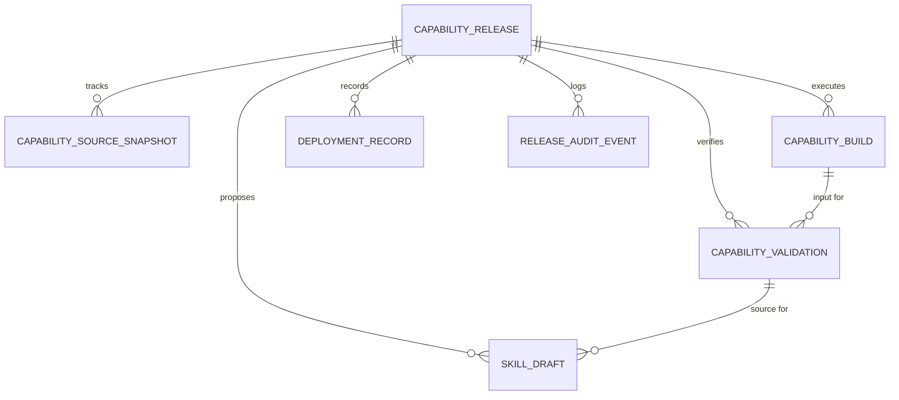

# Enterprise Skill Platform: Capability Release Data Model Spec v2.0

## 1. Overview

This document defines the data model for the Capability Release system, which orchestrates the transformation of raw sources (Execution Flow Templates, Temporal Workflows) into published Skills.

## 2. Entity Relationship Diagram (Conceptual)

## 3. Tables Definition

### 3.1 capability_releases

The root entity for a release lifecycle.

| Column                          | Type         | Description                                                                                                         |
| ------------------------------- | ------------ | ------------------------------------------------------------------------------------------------------------------- |
| id                              | UUID         | Primary Key                                                                                                         |
| source_type                     | VARCHAR(64)  | `template`, `temporal_workflow`, etc.                                                                               |
| source_id                       | UUID         | Reference to the original source                                                                                    |
| source_name                     | VARCHAR(255) | Name snapshot of the source                                                                                         |
| source_status                   | VARCHAR(32)  | Status snapshot of the source                                                                                       |
| release_version                 | INT          | Incremental version number for this source                                                                          |
| status                          | VARCHAR(32)  | `draft`, `building`, `validating`, `draft_ready`, `pending_approval`, `approved`, `published`, `deployed`, `failed` |
| approval_status                 | VARCHAR(32)  | `not_required`, `pending`, `approved`, `rejected`                                                                   |
| deployment_status               | VARCHAR(32)  | `not_started`, `in_progress`, `deployed`, `failed`, `rolled_back`                                                   |
| current_source_snapshot_id      | UUID         | FK to current snapshot                                                                                              |
| current_build_id                | UUID         | FK to latest build                                                                                                  |
| latest_successful_build_id      | UUID         | FK to latest successful build                                                                                       |
| latest_validation_id            | UUID         | FK to latest validation                                                                                             |
| latest_successful_validation_id | UUID         | FK to latest successful validation                                                                                  |
| current_skill_draft_id          | UUID         | FK to current skill draft                                                                                           |
| published_skill_id              | UUID         | FK to produced SkillConfig                                                                                          |
| last_deployment_id              | UUID         | FK to latest deployment record                                                                                      |
| rollback_of_release_id          | UUID         | Link to original release if this is a rollback                                                                      |
| created_by                      | UUID         | User ID                                                                                                             |
| created_at                      | TIMESTAMPTZ  | Timestamp                                                                                                           |
| updated_at                      | TIMESTAMPTZ  | Timestamp                                                                                                           |

### 3.2 capability_source_snapshots

Immutable record of the source data at a point in time.

| Column              | Type        | Description                              |
| ------------------- | ----------- | ---------------------------------------- |
| id                  | UUID        | Primary Key                              |
| release_id          | UUID        | FK to capability_releases                |
| snapshot_version    | INT         |                                          |
| source_type         | VARCHAR(64) |                                          |
| source_id           | UUID        |                                          |
| source_payload_json | JSONB       | Complete source data (DSL, config, etc.) |
| summary             | TEXT        |                                          |
| created_by          | UUID        |                                          |
| created_at          | TIMESTAMPTZ |                                          |

### 3.3 capability_builds

Records of code generation or artifact assembly.

| Column                | Type         | Description                               |
| --------------------- | ------------ | ----------------------------------------- |
| id                    | UUID         | Primary Key                               |
| release_id            | UUID         |                                           |
| source_snapshot_id    | UUID         | Snapshot used for this build              |
| build_type            | VARCHAR(64)  | `codegen_workflow`, `bundle_assets`, etc. |
| model_id              | VARCHAR(128) | AI model used for codegen                 |
| prompt_version        | VARCHAR(64)  |                                           |
| input_snapshot_json   | JSONB        |                                           |
| generated_code        | TEXT         |                                           |
| generated_config_json | JSONB        |                                           |
| diff_summary          | TEXT         |                                           |
| status                | VARCHAR(32)  | `running`, `succeeded`, `failed`          |
| error_summary         | TEXT         |                                           |
| started_at            | TIMESTAMPTZ  |                                           |
| finished_at           | TIMESTAMPTZ  |                                           |
| created_by            | UUID         |                                           |
| created_at            | TIMESTAMPTZ  |                                           |

### 3.4 capability_validations

Records of static and runtime checks.

| Column               | Type        | Description                       |
| -------------------- | ----------- | --------------------------------- |
| id                   | UUID        | Primary Key                       |
| release_id           | UUID        |                                   |
| build_id             | UUID        | Build used for this validation    |
| validation_type      | VARCHAR(64) | `static`, `sandbox`, `smoke_test` |
| input_snapshot_json  | JSONB       | Test inputs                       |
| result_snapshot_json | JSONB       | Test results                      |
| logs_json            | JSONB       | Execution logs                    |
| score                | INT         | 0-100                             |
| success              | BOOLEAN     |                                   |
| error_summary        | TEXT        |                                   |
| started_at           | TIMESTAMPTZ |                                   |
| finished_at          | TIMESTAMPTZ |                                   |
| created_by           | UUID        |                                   |
| created_at           | TIMESTAMPTZ |                                   |

### 3.5 skill_drafts

Human-editable draft of the final Skill configuration.

| Column                       | Type         | Description                               |
| ---------------------------- | ------------ | ----------------------------------------- |
| id                           | UUID         | Primary Key                               |
| release_id                   | UUID         |                                           |
| generated_from_build_id      | UUID         |                                           |
| generated_from_validation_id | UUID         |                                           |
| source_type                  | VARCHAR(64)  |                                           |
| name                         | VARCHAR(255) |                                           |
| description                  | TEXT         |                                           |
| trigger_keywords             | JSONB        |                                           |
| params_schema                | JSONB        |                                           |
| execution_flow_template_ids  | JSONB        |                                           |
| tools                        | JSONB        |                                           |
| api_endpoints                | JSONB        |                                           |
| draft_payload_json           | JSONB        | Complete payload for SkillConfig creation |
| status                       | VARCHAR(32)  | `draft`, `submitted`, `obsolete`          |
| created_by                   | UUID         |                                           |
| created_at                   | TIMESTAMPTZ  |                                           |
| updated_at                   | TIMESTAMPTZ  |                                           |

### 3.6 deployment_records

History of deployments to environments.

| Column                     | Type         | Description                                                 |
| -------------------------- | ------------ | ----------------------------------------------------------- |
| id                         | UUID         | Primary Key                                                 |
| release_id                 | UUID         |                                                             |
| published_skill_id         | UUID         |                                                             |
| environment                | VARCHAR(32)  | `dev`, `test`, `staging`, `prod`                            |
| runtime_type               | VARCHAR(32)  | `flow_runtime`, `temporal_worker`                           |
| artifact_uri               | TEXT         | URI to the artifact (S3, Registry, etc.)                    |
| artifact_hash              | VARCHAR(128) |                                                             |
| worker_version             | VARCHAR(128) |                                                             |
| reload_strategy            | VARCHAR(32)  | `hot_reload`, `rolling_restart`                             |
| request_payload_json       | JSONB        |                                                             |
| result_snapshot_json       | JSONB        |                                                             |
| logs_json                  | JSONB        |                                                             |
| status                     | VARCHAR(32)  | `in_progress`, `succeeded`, `failed`, `rolled_back`         |
| success                    | BOOLEAN      |                                                             |
| smoke_validation_id        | UUID         | FK to smoke test validation                                 |
| rollback_target_release_id | UUID         | If this IS a rollback, which release are we rolling back to |
| started_at                 | TIMESTAMPTZ  |                                                             |
| finished_at                | TIMESTAMPTZ  |                                                             |
| created_by                 | UUID         |                                                             |
| created_at                 | TIMESTAMPTZ  |                                                             |

### 3.7 release_audit_events

Audit trail for compliance and debugging.

| Column       | Type         | Description                                                                                 |
| ------------ | ------------ | ------------------------------------------------------------------------------------------- |
| id           | UUID         | Primary Key                                                                                 |
| release_id   | UUID         |                                                                                             |
| event_type   | VARCHAR(64)  | `release_created`, `build_started`, `validation_failed`, `approval_given`, `deployed`, etc. |
| actor_id     | UUID         |                                                                                             |
| actor_name   | VARCHAR(255) |                                                                                             |
| success      | BOOLEAN      |                                                                                             |
| summary      | TEXT         |                                                                                             |
| details_json | JSONB        |                                                                                             |
| created_at   | TIMESTAMPTZ  |                                                                                             |

## 4. Implementation Notes

- **Raw SQL for Bootstrap**: In the current phase, infrastructure is ensured via raw SQL `CREATE TABLE IF NOT EXISTS` in `CapabilityReleaseService.ensureInfrastructure()`.
- **Prisma Integration**: While tables are managed via raw SQL for speed, Prisma `$queryRaw` and `$executeRaw` are used for all operations to maintain transactional consistency within the NestJS app.
- **Indexes**: Critical indexes on `status`, `release_id`, and `created_at` are created to ensure performant querying of history and audit logs.
