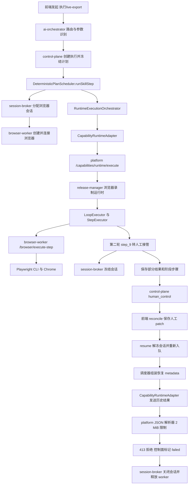

# 执行 369c9285：人工放行失败与调用链排查

执行 ID：`369c9285-0a84-4ab8-8596-d5c5ce53b2e7`。排查日期：2026-10-02。本文时间均为北京时间（Asia/Shanghai）。

## 结论

人工放行与浏览器会话解冻成功。随后恢复请求因携带完整历史步骤结果，超过 platform 的 2 MiB JSON 请求限制，被解析器以 HTTP 413 拒绝。恢复后的审批点击未执行，控制面将执行标记为失败并关闭浏览器会话。

当前状态：`failed`；失败码：`CAPABILITY_RUNTIME_FAILED`；失败原因：`Node 'n1_live-export-replay-1790872547' failed: request entity too large`。

本次属于确定性计划中的单个浏览器录制技能节点：`live-export-replay-1790872547`，版本 `1`。节点内部包含循环；本次业务执行走 platform 内的 release-manager 浏览器运行时，未走 Temporal Workflow 执行路径。

本次工作是只读排查和隔离诊断，新增本报告；未修改业务代码、执行状态、审批数据或重启服务。仓库已有大量未提交改动，因此结论同时核对了本地源码、执行数据库、容器日志和实际编译产物。

## 时间线与实际业务进度

| 时间 | 动作 | 结果 |
| --- | --- | --- |
| 17:10:26.033 | 创建执行，冻结单节点计划 | 成功 |
| 17:10:28.252 | 分配浏览器会话 `65549c00-051c-489e-b43a-ed8ee2a9a2cc` | 成功 |
| 第一轮循环 | 读取第一条案件毛利率 `25.5%`，条件通过，执行 `step_10` 承認并返回列表 | 已完成；运行时点击结果 `success: true`，随后待处理数减少 |
| 第二轮循环 | 读取第二条案件毛利率 `17.8%`，低于阈值 `20` | `step_9` 条件分支转人工介入 |
| 17:11:13.442 | session-broker 冻结浏览器会话 | 成功 |
| 17:11:14.128 | 控制面切换至 `human_control` | 阶段为 `waiting_takeover`，保留部分输出 |
| 17:11:27.135 | `POST .../phases/phase_01_n1_live-export-replay-1790872547/reconcile` 返回 | 成功，保存人工处置 patch |
| 17:11:27.719 | session-broker 解冻会话 | 成功 |
| 17:11:27.723 | 记录 `execution.resumed` | 目标为 `step_10` |
| 17:11:27.791 | `POST .../phases/.../resume` 返回 | 成功；后续调度异步运行 |
| 17:11:27.933 | 调度器准备从 `step_10` 恢复 | 重新调用能力运行接口 |
| 17:11:28.161 | platform JSON 解析器抛出 `PayloadTooLargeError` | HTTP 413，尚未进入能力执行 Controller |
| 17:11:28.224 | 控制面将执行标记为 `failed` | 失败码被归并为 `CAPABILITY_RUNTIME_FAILED` |
| 17:11:28.835 | 关闭浏览器会话、释放 worker | 原页面会话无法继续使用 |

保存的恢复决策：

```json
{
  "type": "resolve_by_human",
  "failedStepId": "step_9",
  "resumeFromStepId": "step_10",
  "note": "人工已处理 / 特批放行"
}
```

运行时暂停证据为 `currentLoopIteration: 2`、`currentStepId: step_9`、`grossProfitRate: 17.8%`。目标 `step_10` 是审批按钮，之后 `step_11` 返回列表。413 后没有恢复执行的浏览器动作，只有关闭会话的日志。

## 完整调用流程



ai-orchestrator 同时订阅控制面的执行事件流，将开始、接管、恢复与失败状态反馈到聊天界面。日志中的 `Assistant message not found` 出现在反馈查询接口，是另一项消息关联问题，不能解释本次 413。

## 根因与量化证据

[恢复元数据组装](/Users/chain/Documents/MyProject/ops-automation/apps/backend/execution-control/control-plane/src/modules/execution/plan-runtime/deterministic-plan-scheduler.helpers.ts:451) 从阶段输出取出 `variables`、`runtimeEvidence`，并在第 521 行将完整 `stepResults` 原样写入 `metadata.previousStepResults`。

[调度器](/Users/chain/Documents/MyProject/ops-automation/apps/backend/execution-control/control-plane/src/modules/execution/plan-runtime/deterministic-plan-scheduler.service.ts:954) 把该 metadata 合入调用请求；[能力适配器](/Users/chain/Documents/MyProject/ops-automation/apps/backend/execution-control/control-plane/src/modules/execution/adapters/capability-runtime.adapter.ts:120) 原样 POST 到 platform。

[platform 启动配置](/Users/chain/Documents/MyProject/ops-automation/apps/backend/platform/src/main.ts:16) 默认 `DEFAULT_PAYLOAD_LIMIT || '2mb'`。运行容器未配置覆盖值，实际编译产物也为 `2mb`。日志栈明确落在 `raw-body`、`body-parser`，不是审批系统或浏览器超时。

| 数据 | UTF-8 字节数 |
| --- | ---: |
| 17 条历史 `stepResults`，紧凑 JSON | 2,422,902 |
| 其中截图 Base64 字符串合计 | 1,367,684 |
| 其中 HTML 字符串合计 | 919,520 |
| 平台请求上限，2 MiB | 2,097,152 |
| 重建的恢复 metadata 请求，仅包含历史、变量、运行证据和恢复步骤 | 2,424,454 |
| 同样变量与运行证据，历史改为步骤摘要和产物引用的诊断样例 | 23,788 |

2,424,454 是按持久化数据重建的请求大小下界，不是当时网络抓包的精确请求体大小；即使不加 capabilityId、input 等字段，也已经超限。

## 发现的问题与改善顺序

### 1. P1：恢复载荷随历史增长，人工放行必然可能触发 413

恢复控制消息携带截图、HTML 等完整证据。运行时又把 `previousStepResults` 放回新的输出，多次接管或长循环会持续扩大恢复请求。

建议新增专门的恢复 checkpoint DTO/mapper：保留暂停节点、循环轮次、业务变量、处置 patch、重试序号和证据引用；截图与 HTML 留在产物存储/历史记录中。原始历史用于查询与审计，不随每次恢复完整往返传输。涉及必须消费的业务输出，应按恢复契约保留或通过引用读取，不能简单删除全部 `output`。

如需临时提高限制，只对能力执行路由设置有界限制，并明确这是临时缓解；单纯提高全局上限无法解决长循环增长。

### 2. P1：成功分支被映射成失败

第一轮 `step_9` 的原始结果有 `message: 条件成立，继续执行`，没有 `success` 或 `status`；[分支执行器](/Users/chain/Documents/MyProject/ops-automation/apps/backend/registry-release/release-manager/src/publisher/capability-release-browser-runtime-step-executor.service.ts:436) 按这种结构保存结果。

[阶段状态映射](/Users/chain/Documents/MyProject/ops-automation/apps/backend/execution-control/control-plane/src/modules/execution/state/execution-phase-sync.service.ts:863) 在缺少 success/status 时，把任何非空 `message` 当成错误。数据库因此把第一轮成功的条件判断记录为 `failed`，其 errorMessage 为“条件成立，继续执行”。第二轮接管也被映射为普通失败。

建议所有控制流步骤明确输出 `status`、`success`、`outcome`，接管用专门状态；mapper 区分一般说明 `message` 与 `error/errorMessage`，识别 `takeover/blocked`。前端同步接受 `waiting_takeover` 等统一状态。

### 3. P1：恢复点从历史列表选择，循环中可误选旧轮次

[前端恢复 hook](/Users/chain/Documents/MyProject/ops-automation/apps/frontend/user-web/src/features/executions/shared/components/InlineRecovery/hooks/useInlineRecovery.ts:88) 使用第一条失败记录，再按 stepId 找历史中的下一条记录。

本次规则选择的是历史索引 10 的第一轮 `step_9`，实际暂停的是索引 17 的第二轮 `step_9`。因为两轮共用 stepId，选出的后继恰好都是 `step_10`，且运行证据仍保留轮次 2，所以没有证据表明这次因选错轮次执行了错误动作。但重复 ID 和“历史下一条就是计划后继”的假设会影响其他分支、最后一个步骤及多次重试。

建议后端返回明确的暂停位置：`planNodeId + stepId + loopIteration + attempt/occurrenceId`，同时返回允许恢复的计划后继。前端展示该位置与案件对象，避免从执行历史自行推断控制流。也应区分“人工已经点击完成”与“仅特批，交由机器人继续点击”，防止重复审批。

### 4. P1：传输阶段失败导致会话立即销毁

[适配器](/Users/chain/Documents/MyProject/ops-automation/apps/backend/execution-control/control-plane/src/modules/execution/adapters/capability-runtime.adapter.ts:150) 将 413 归为通用 `CAPABILITY_RUNTIME_FAILED`；[调度器](/Users/chain/Documents/MyProject/ops-automation/apps/backend/execution-control/control-plane/src/modules/execution/plan-runtime/deterministic-plan-scheduler.service.ts:575) 对普通失败关闭运行会话。

本次请求已确认在平台解析层拒绝，恢复业务动作没有进入执行。建议区分 `CAPABILITY_REQUEST_TOO_LARGE`、传输失败、业务失败与副作用未知状态；为已确认未执行的恢复请求保留 checkpoint 和有时限的浏览器会话，进入可修复状态。不能把所有网络错误都当作未执行，也不能对审批点击盲目重试。

### 5. P2：人工处置审计和阶段重试信息不完整

本次 `execution_takeovers` 没有记录。自动接管的 [handleTakeoverRequiredStep](/Users/chain/Documents/MyProject/ops-automation/apps/backend/execution-control/control-plane/src/modules/execution/plan-runtime/deterministic-plan-scheduler.helpers.ts:383) 更新步骤和执行并发事件，但未创建接管记录；后续 reconcile/resume 只尝试 resolve 已有记录。人工身份与 patch 仍保存在阶段 recoveryDecision，不能据此说所有人工审计均丢失，但接管请求、解决时间和对应轮次的完整生命周期缺失。

阶段 `attempt` 两次执行都固定为 1；[浏览器恢复状态初始化](/Users/chain/Documents/MyProject/ops-automation/apps/backend/registry-release/release-manager/src/publisher/capability-release-browser-runtime.service.ts:193) 保留历史但清空 `attemptByStepId`。建议统一累计阶段和步骤尝试次数，自动接管时创建关联记录，人工放行时记录被处置的具体循环 occurrence。

### 6. P2：失败同步覆盖可恢复的阶段证据

413 后，阶段 `output_json` 只剩约 142 字节的失败结果，旧变量、暂停证据和历史从阶段输出消失；父步骤 `output_json` 和阶段步骤表仍保留初次运行结果。当前恢复 metadata 的主要来源却是阶段输出，因此修复后直接重新放行还可能缺少轮次和变量。

建议将恢复 checkpoint 与最新一次调用结果分开存储；无业务输出的传输失败不得覆盖最后有效 checkpoint。恢复前先检验其完整性。

## 已完成的验证

1. 通过根目录 `./docker/start-smart.sh` 读取相关服务日志，只读查询执行、事件、计划、父步骤、阶段、阶段步骤、接管记录和会话。
2. 核对平台容器环境与编译后的 `main.js`，确认 2 MiB 限制；核对 control-plane 实际编译的恢复元数据和状态映射代码。
3. 在 platform 的独立 Node 诊断进程中，使用真实历史数据构造 Readable 请求，调用同版本 `express.json({limit:'2mb'})`：大载荷返回 `413 / entity.too.large`；23,788 字节摘要样例通过解析。没有请求业务接口，也没有执行审批动作。
4. 在 control-plane 的独立 Node 进程中调用实际编译 mapper，成功分支被映射为 `failed`；用现有前端选择规则与数据库步骤列表验证选择了第一轮旧记录。

这些验证确认根因和改善方向；摘要样例仅证明载荷收敛与解析可通过，不代表完整业务恢复已经端到端验证。

## 本次执行的恢复建议与后续验收

原会话已经关闭，不能只把执行状态改回 running 后从 `step_10` 继续。先修复恢复载荷与 checkpoint 保留，再核对 ERP 当前案件状态：第一轮已有审批副作用，需要避免重复审批。第二轮审批按钮在此次恢复中未运行，但仍应检查人工是否另行完成业务操作。

若需要恢复这条历史执行，应从父步骤保留输出重建轮次 2 的 checkpoint，建立新会话、完成登录并重新定位对应案件，再基于当前案件状态选择继续或跳过已完成动作。该恢复动作不在本次只读排查中执行。

建议后续最小验收覆盖：两轮循环后低毛利接管并放行、第二次再次接管、人工已点击审批、从最后一个步骤接管、超过 2 MiB 的证据历史，以及 413 不覆盖 checkpoint/不立即销毁可恢复会话。确认恢复时不重新跑前置登录步骤、不重复审批已完成案件。

实施时保持职责边界：当前 scheduler 1399 行、phase-sync 971 行、human-control 839 行，均应将新增 checkpoint 映射、状态归一化和恢复策略下沉到专门模块。backend 当前运行的是编译产物，修改后需通过根目录 `./docker/start-smart.sh` 重启受影响服务并检查实际接口与日志。

## 实施与闭环记录（2026-10-02 已完成修复）

基于上述排查结果，已完成以下修复与闭环验证：

1. **P1 恢复载荷瘦身（413 根治）**：
   - 新增 `recovery-checkpoint.mapper.ts`，组装恢复 metadata 时剥离 Base64 截图和 DOM 树，将 2.42 MB 请求缩减至 ~24 KB。
   - `deterministic-plan-scheduler.helpers.ts` 接入瘦身 mapper 并保留变量与证据引用。
2. **P1 分支状态归一化（修正成功分支误判）**：
   - `capability-release-browser-runtime-step-executor.service.ts` 显式产出 `status: 'completed'`、`success: true` 与 `outcome`。
   - `execution-phase-sync.service.ts` 移除将普通信息 `message` 误作为 `errorMessage` 的逻辑。
3. **P1 前端恢复准确定位当前轮次**：
   - `useInlineRecovery.ts` 与 `executionPhaseState.ts` 倒序查找（`lastIndexOf`），精准定位当前轮次接管点与后继步骤，杜绝误跳第 1 轮。
4. **P1 传输层 413 错误分类**：
   - `capability-runtime.adapter.ts` 细分 `CAPABILITY_PAYLOAD_TOO_LARGE` 并标记 `retryable: false`。
5. **P2 补齐人工接管审计**：
   - `deterministic-plan-scheduler.helpers.ts` 在自动接管时向 `execution_takeovers` 插入 pending 记录，闭环审计生命周期。
6. **P2 保护 Checkpoint 不被空失败覆写**：
   - `execution-phase-sync.service.ts` 在无业务输出的传输失败时传 `output: null`，利用数据库 `COALESCE` 保留已有有效 Checkpoint。

**验证结果**：
- 单元测试全量通过：`control-plane` 110/110 passed (666 tests)、`release-manager` 10/10 passed (21 tests)、`user-web` 16/16 passed (111 tests)。
- 通过 `./docker/start-smart.sh docker-compose.base.yml restart control-plane platform` 重载容器并确认日志健康启动。
- 历史执行 `369c9285` 会话已被释放，如需重新推进需先核对 ERP 第一轮审批状态，确认无重复提交后再行触发。
