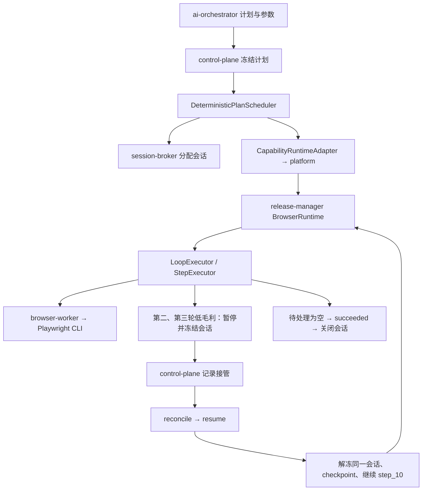

# 执行 85037a1a 审计

执行 ID：`85037a1a-c506-4b00-a77c-1b219eee2451`。审计日期：2026-10-02。以下时间均为北京时间。

## 结论

**本次业务执行成功，上一轮两项 P1 问题已通过当前编译模块的回归检查；新执行的主要审计数据明显改善。** 仍有 P2 问题：人工处置说明未落入接管表、阶段开始时间被清空且 attempt 固定、最终结果缺少业务摘要与证据关联。

执行于 **22:31:28.147** 创建、**22:33:12.737** 完成，历时 **104.59 秒**。执行 succeeded，唯一阶段 completed，失败字段为空；同一浏览器会话完成后正常关闭。

本次只读核对冻结计划、执行、事件、父步骤、阶段、27 条阶段步骤、2 条接管记录及会话，并交叉检查五个服务日志。另运行隔离单元测试和编译模块诊断。没有重新执行审批、修改业务代码、补写历史数据或重启服务。

## 实际业务结果与时间线

| 案件 | 毛利率 | 处理方式 | 本次审批动作开始时间 |
| --- | ---: | --- | --- |
| PRJ-2026-001 | 25.5% | 条件通过，自动审批 | 22:31:57.594 |
| PRJ-2026-002 | 17.8% | 人工介入，放行后审批 | 22:32:36.502 |
| PRJ-2026-003 | 12.0% | 人工介入，放行后审批 | 22:33:02.652 |

运行证据中的待处理数为 3→2→1→0；累计承認済み为 1→2→3→4。**本次新增审批三条**，页面最终累计四条包含此前已有的一条。

| 时间 | 事件 |
| --- | --- |
| 22:31:28.150 | 单节点确定性计划冻结 |
| 22:31:30.513 | 分配运行会话 d075f115-12a4-42eb-9eca-f0b992f491ad |
| 22:31:57.594 | 第一轮审批 |
| 22:32:16.028 | 第二轮接管记录创建 |
| 22:32:35.734 | 第一条接管记录 resolved，处理人已落表 |
| 22:32:36.323 | execution.resumed，继续 step_10 |
| 22:32:36.502 | 第二轮审批 |
| 22:32:53.368 | 第三轮接管记录创建 |
| 22:33:02.157 | 第二条接管记录 resolved，处理人已落表 |
| 22:33:02.467 | execution.resumed，继续 step_10 |
| 22:33:02.652 | 第三轮审批 |
| 22:33:12.737 | 执行 succeeded，待处理列表为空 |
| 22:33:13.020 | 浏览器会话关闭 |

日志中只有一次登录与三次承認按钮调用。两次续跑使用同一会话，分别继续第二、第三轮；审批动作均在对应接管处置与恢复事件之后。没有发现重复审批、重新登录或 HTTP 413。

## 调用流程

冻结计划 `c285e584-498f-4a2a-a943-dd24f9865a66` 为 single / deterministic-plan/v1，唯一节点调用技能 `7ce0e1e7-f63e-4886-98bd-edf3e35c0843`、版本 1，即 live-export-replay-1790872547。

本次运行路径是浏览器录制回放，没有进入 Temporal Workflow。

## 上一轮问题的验收

| 问题 | 本次结果 | 证据 |
| --- | --- | --- |
| 未批准的接管被伪造成已批准（P1） | 已修复该回归 | 编译 adapter 保留 takeover 与原因，不生成 resolvedByHuman；独立诊断 falseApproval=false，新测试通过 |
| 重复处置 A 阶段误关 B 阶段（P1） | 已修复跨阶段兜底 | 指定 phaseId 时不再退化到 executionId；编译诊断两次 resolve(A) 后 B 仍 requested，摘要仍 requested |
| pending/requested 状态约定冲突 | 新执行正常闭环 | 两条接管均 resolved，resolved_by、resolved_at、runtime_session_id 均非空，摘要 resolved |
| 累计历史 68 行膨胀 | 新执行无重复 | 27 行，对应 27 个独立 ordinal；appendSteps 新增事务内 phase 行锁 |
| 步骤时间缺失与倒挂 | 本次全部修复 | 原始 27 条均有 attemptedAt/observedAt，倒挂 0；落表 27 条均有 started_at/ended_at，包含三个 branch |
| 恢复后步骤尝试号重置 | 已修复核心路径 | step_7、step_8、step_10、step_11 均为 1→2→3 |
| oldStatus 写成 queued 或新状态 | 本次转移正确 | 两次 running→human_control，两次 human_control→running，最终 running→succeeded |
| 验收脚本吞掉失败 | 已纠正对应断言 | 提取新脚本时间戳段，用倒挂 10 秒的返回值测试，正确抛错 |

并发保护采用事务内 `SELECT ... FOR UPDATE` 锁定同一 phase，再执行 UPDATE/INSERT，可以串行化通过该方法的并发提交。本次核对实现与单元测试，**未另做真实数据库并发压测**；新执行 27 行只能证明本次未重复，不能代替所有写入路径的并发验收。

最终 runtimeEvidence 已清理当前 takeoverReason，并保留两条人工 resolutions。lastBranchDecision.result 保留 takeover，表示低毛利的原始判断；这符合保留原始证据的要求，不能因为该历史判断仍存在就认定当前尚未放行。

用当前编译 checkpoint mapper 从最终输出重建 checkpoint：**139,944 字节、27 条历史**，step_7/step_10 计数均为 3。该数字是审计重建值，不是两次恢复请求体的抓包大小；两次真实恢复均通过。

## 剩余问题

### P2：人工处置说明没有写入接管记录，resolution 关联仍不完整

两条接管记录的处理人与时间已补齐，但 **resolution_note 均为 null**。最终 recoveryDecision.patch.note 和两条 runtimeEvidence.resolutions.note 都存在“人工已处理 / 特批放行”。

[reconcilePhaseTakeover](/Users/chain/Documents/MyProject/ops-automation/apps/backend/execution-control/control-plane/src/modules/execution/human-control/execution-human-control.service.ts:279) 只把 dto.comment 传给 resolver。本次 comment 为 null，没有采用 patch.note；reconcile 已将该行改为 resolved，后续 resume 也不会补写已处置行的说明。

[运行时 resolutions](/Users/chain/Documents/MyProject/ops-automation/apps/backend/registry-release/release-manager/src/publisher/capability-release-browser-runtime.service.ts:212) 仅记录恢复目标、note 和运行时生成的 resolvedAt，没有 takeoverId、处理人、案件或循环 occurrence。两条都指向 step_10，需要依赖外围事件与时间手工关联。数据库 resolved_at 与运行时 resolvedAt 分别表示处置和恢复初始化，不能视为同一个权威时间。

建议：处置说明统一取 comment / patch.note；由控制面传入明确 takeoverId、resolvedBy、权威 resolvedAt、失败步骤及循环 occurrence，关联对应 branch。重复请求应返回同一处置结果，不能继续解决同一阶段的另一条待决记录。

### P2：阶段开始时间被完成同步清空，阶段 attempt 仍固定为 1

本次阶段 completed_at 为 22:33:12.441，但 **started_at 为 null**；经历初次调用和两次恢复，attempt 仍为 1。27 条动作时间完整，并不代表阶段生命周期时间完整。

[createOrUpdatePhase](/Users/chain/Documents/MyProject/ops-automation/apps/backend/execution-control/control-plane/src/modules/execution/state/execution-phase.service.ts:124) 无条件用 EXCLUDED.started_at 覆盖原值；markCompleted 未提供 startedAt，所以传 null 清掉原开始时间。编译模块内存诊断 markRunning→markCompleted 确认：开始时非空，完成时传 null，SQL 覆盖原值。

[阶段同步](/Users/chain/Documents/MyProject/ops-automation/apps/backend/execution-control/control-plane/src/modules/execution/state/execution-phase-sync.service.ts:41) 多处固定 attempt=1。步骤上的 1→2→3 又包含正常循环次数，不等于发生了两次失败重试；三个 branch 本身没有 attempt。

建议阶段保留首次开始时间，恢复调用另记 attemptStartedAt；阶段调用次数或 resumeCount 与真正 retry 分开定义。补充生命周期测试，避免完成同步丢失开始时间。

### P2：最终结果仍为整页文本，缺少本次业务结果与证据索引

result.summary、presentation.chatSummary 仍以 `0 / 4 / 24.3%` 开头，后续为页面说明和空列表；最终 artifacts 为空，businessData 只包含 finalOutputs 和 capabilitiesUsed，没有三条案件的结果表或人工处置凭证。

冻结计划的 finalOutputs 仍仅把节点 text 映射成字符串 result。因此仅修复运行时审计字段，无法自动生成完整业务输出。

建议输出“本次处理 3 条，自动 1 条，人工特批 2 条，待处理 0 条”，并列出案件、毛利率、审批前后状态、takeoverId、处理人/时间及证据引用。页面累计四条与本次三条分别表达。

## 次要调用异常

22:32:16，聊天 feedback GET 返回 `Assistant message not found`；同一消息与 executionId 的 GET 在 22:33:15 正常返回。异常来自 [ChatFeedbackService.assertAssistantMessageOwner](/Users/chain/Documents/MyProject/ops-automation/apps/backend/intelligence/ai-orchestrator/src/modules/chat/chat-feedback.service.ts:131)，并未阻断本次接管、恢复或审批。

这与暂停时请求反馈早于可查询消息的时序相符，但本次没有读取 Redis 历史快照，不能确定是持久化时序还是 messageId/角色不匹配。可检查前端是否应等待消息落库后再查询反馈，并对暂不可反馈状态做处理；不应把这一聊天异常误判为审批失败。

## 运行版本与验证边界

control-plane 编译于 22:29:37–38，服务 Node 于 22:29:40 启动；platform/release-manager 编译于 22:29:46，服务 Node 于 22:29:54 启动，均早于本次 22:31:28 创建执行。编译版包含所审修复，与实际数据改善一致。

通过仓库根目录 `./docker/start-smart.sh` 验证，PROJECT_ROOT 指向当前仓库。

- control-plane：execution-phase.service、execution-phase-sync.service、recovery-checkpoint.mapper、execution-human-control.service，**4 组 / 17 用例通过**。
- release-manager：browser-legacy-output.adapter、capability-release-browser-runtime.service，**2 组 / 3 用例通过**。
- 合计 **6 组 / 20 用例通过**。
- 编译模块隔离复核：未批准接管保持原证据；重复 resolve(A) 不关闭 B；阶段开始时间覆盖；checkpoint 体积与计数。
- 新验收脚本时间戳段负例验证正确失败；未直接运行会写数据库并调用 default 浏览器会话的完整脚本。

本次没有发现上一轮两项 P1 回归继续存在，也没有发现实际重复审批。可以确认业务流程成功与主要修复生效；要完成审计凭证验收，还需补齐上述三个 P2。
