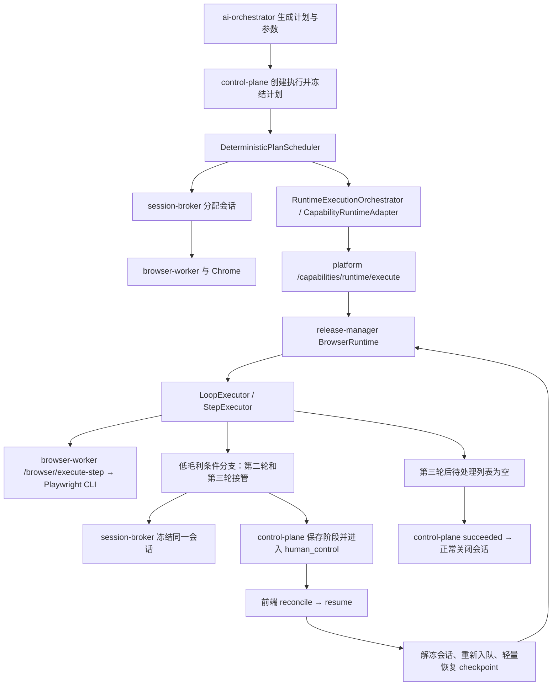

# 执行 f322af11 审计

执行 ID：`f322af11-e67c-4c89-97d8-c927fe39f60e`。日期：2026-10-02。以下时间均为北京时间。

## 审计结论

本次浏览器回放业务执行成功：处理三条待审批案件，其中两条低毛利案件分别经过人工特批后继续审批。没有重现上一条执行的 HTTP 413，恢复没有重新登录或重复执行前置步骤。

执行于 **20:39:53.513** 创建、**20:42:00.243** 完成，总历时约 **126.73 秒**。执行状态 `succeeded`，阶段状态 `completed`，失败码和失败原因为空，运行会话完成后正常关闭。

但审计闭环尚不完整：两条接管记录仍为 pending、阶段历史被重复追加、已放行的接管状态缺少处置关联、重试编号和时间戳不可靠。业务成功不能据此视为审计数据完全一致。

本次仅执行只读查询、日志检查和隔离诊断，并新增报告；未修改业务代码、审批状态、历史执行数据或重启服务。结论对应本次审计取得的数据快照，源代码与实际编译版均作核对。

## 实际处理结果与时间线

| 案件 | 毛利率 | 处理过程 | 本次证据 |
| --- | ---: | --- | --- |
| PRJ-2026-001 | 25.5% | 第一轮自动审批 | 条件分支 completed；第一次承認点击成功；待处理数 3→2 |
| PRJ-2026-002 | 17.8% | 第二轮接管，人工放行后审批 | 20:40:42 接管；20:41:21 放行；第二次承認点击成功；待处理数 2→1 |
| PRJ-2026-003 | 12.0% | 第三轮接管，人工放行后审批 | 20:41:40 接管；20:41:49 放行；第三次承認点击成功；待处理数 1→0 |

初始页面已有一条承認済み案件；最终页面累计承認済み为四条。因此本次新增审批是三条，不能把页面累计四条误报为本次处理量。

关键时间：

| 时间 | 动作 |
| --- | --- |
| 20:39:53.513 | 创建并冻结单节点确定性计划 |
| 20:39:55.810 | 分配浏览器会话 `8d8323ea-860a-4c50-a59d-e664146d8e7c` |
| 20:40:23.707 | 第一条案件审批点击 |
| 20:40:42.049 | 第二轮暂停于条件分支，execution 进入 human_control |
| 20:41:20.805 | 第一次 reconcile 返回，保存特批 patch |
| 20:41:21.311 | 第一次 execution.resumed，恢复目标 step_10 |
| 20:41:21.578 | 第二条案件审批点击 |
| 20:41:40.931 | 第三轮再次暂停于条件分支 |
| 20:41:49.018 | 第二次 reconcile 返回 |
| 20:41:49.331 | 第二次 execution.resumed，恢复目标 step_10 |
| 20:41:49.463 | 第三条案件审批点击 |
| 20:42:00.243 | 执行成功，待处理列表为空 |
| 20:42:00.612 | 关闭会话、释放浏览器 worker |

日志中仅有三次承認按钮点击、一次登录；两次恢复均复用同一会话。步骤记录和循环终止读数与日志一致。以上为本次持久化页面与运行证据的交叉验证，未另行进入 ERP 修改或重新验证业务数据。

## 调用链

本次能力为 `live-export-replay-1790872547`、版本 `1`，运行方式为浏览器录制回放；没有进入 Temporal Workflow 执行路径。聊天端通过控制面的事件流观察两次接管、恢复及最终成功。

## 与上一轮问题的对比

1. **413 在本次没有复现。** 当前恢复组装已调用 [recovery-checkpoint.mapper](/Users/chain/Documents/MyProject/ops-automation/apps/backend/execution-control/control-plane/src/modules/execution/plan-runtime/recovery-checkpoint.mapper.ts:214) 精简历史数据。使用实际编译版从本次最终阶段输出重新提取 metadata，得到 **138,221 字节**、27 条历史记录，低于 2 MiB。这个数是审计时的重建值，不是两次线上恢复请求体的抓包值；两次请求实际通过，并执行后续审批。
2. **成功分支状态已正确。** 第一轮条件通过记录为 completed/success=true，第二、第三轮为 takeover_required，实际编译 mapper 将其映射为 waiting_takeover，没有再把一般说明 message 当成失败。
3. **本次恢复轮次正确。** 两次恢复分别继续第二、第三轮的 step_10，随后 step_11 返回列表；没有重跑第一轮审批或登录。
4. **已新增自动接管记录，但解决记录的状态约定不一致。** 这是本次最明确的审计缺陷。

## 问题、证据与改善建议

### P1：接管记录无法被 resolve，执行摘要与审计记录矛盾

[自动接管处理](/Users/chain/Documents/MyProject/ops-automation/apps/backend/execution-control/control-plane/src/modules/execution/plan-runtime/deterministic-plan-scheduler.helpers.ts:439) 创建记录时使用 `status: 'pending'`。

[resolveTakeoverRecord](/Users/chain/Documents/MyProject/ops-automation/apps/backend/execution-control/control-plane/src/modules/execution/state/execution-phase.service.ts:635) 的更新条件只接受 `et.status = 'requested'`。数据库只读核对结果：pending 两条、requested 零条，所以两次 reconcile/resume 都没有更新对应接管行；之后仍无条件将执行摘要标记为 resolved。

两条行的 resolved_by、resolved_at、resolution_note 均为空，runtime_session_id 也为空。创建处取 `execution.runtimeSessionId`，但本次执行实体没有该字段，真实会话由协调器/阶段持有。人工身份和放行时间仍能从 execution.resumed 事件交叉查询，不能说所有身份信息均丢失；但接管行不能形成独立、完整的处置凭证。

建议：统一初始状态；用明确 takeoverId 解决对应接管 occurrence；更新后校验受影响行数，再更新执行摘要，必要时放入同一事务。会话 ID 从当前阶段或分配结果取得。为已有 pending 行提供基于事件和阶段证据的修复方案，禁止直接把所有历史行无条件改成 resolved。

### P2：累计步骤历史被重复追加，27 条记录膨胀为 68 行

第一次接管返回累计 17 条步骤，第二次返回累计 24 条，最终成功返回累计 27 条。阶段同步调用 [appendSteps](/Users/chain/Documents/MyProject/ops-automation/apps/backend/execution-control/control-plane/src/modules/execution/state/execution-phase.service.ts:451)，每次对整个累计历史直接 INSERT：`17 + 24 + 27 = 68`。

数据库有 68 行，独立 `(phaseId, stepIndex)` 只有 27 个。第一轮登录及审批记录各出现三份，第二轮续跑记录出现两份。日志的真实承認点击只有三次，未发现实际重复审批。

建议将步骤 occurrence 身份定义为阶段、循环轮次、步骤和尝试号，按稳定身份幂等 upsert，或只追加本次新增事件。若需要保存每次返回的快照，单独建 snapshot/attempt 维度，不与动作事件混用；不能仅以 stepId 去重，否则会误删不同轮次的合法步骤。

### P2：成功完成后仍残留“当前接管中”的运行证据

最终输出的 runtimeEvidence 仍包含 takeoverReason 和 `lastBranchDecision.result: takeover`。最终阶段步骤也保留第二、第三轮的 waiting_takeover，没有关联对应人工处置记录。

保留历史接管事实是合理的；问题是缺少 resolution 关联，且 current 状态没有说明已解决。当前 phase.completed、execution.succeeded 与这些字段容易被下游界面或恢复逻辑误解为仍有未解决接管。

建议保留原始条件判断和接管事件，另记录 resolvedByHuman、处理人、时间及被处置的 occurrence；恢复后清理当前 takeoverReason。不要把低毛利的原始条件结果改成“条件通过”。

### P2：尝试次数与时间字段无法支撑可靠审计

[恢复初始化](/Users/chain/Documents/MyProject/ops-automation/apps/backend/registry-release/release-manager/src/publisher/capability-release-browser-runtime.service.ts:193) 每次重置 attemptByStepId。实际 step_7 的尝试号为 `1 → 2 → 1`；三轮 step_10 都为 1。阶段经历初次调用和两次恢复，attempt 仍固定为 1。

27 条原始记录中有 24 条同时包含 attemptedAt/observedAt，其中 **15 条 attemptedAt 晚于 observedAt**。例如第一轮审批：attemptedAt 为 20:40:28.181，observedAt 为 20:40:27.256，而点击命令日志实际始于 20:40:23.707。[BrowserPostActionStateService](/Users/chain/Documents/MyProject/ops-automation/apps/backend/runtimes/browser-worker/src/modules/browser/application/browser-post-action-state.service.ts:11) 在动作完成后的观察阶段才生成 attemptedAt，因此它不能表示尝试开始。

阶段步骤映射又将 startedAt/endedAt 写成 null，68 行均缺失这两个时间。事件 oldStatus 首次记为 queued，实际执行已进入运行，也是使用旧内存对象导致的历史状态偏差。

建议区分 occurrence 与 retry；checkpoint 保留重试计数。动作调用前记录开始时间，动作后记录结束与观察时间，并映射到阶段步骤。状态转换事件从原子更新或最新持久化状态取 oldStatus，避免负耗时和错误转移链。

### P2：最终输出是页面残留文本，缺少业务结果摘要与审批凭证

最终 result.summary、presentation.chatSummary 等内容以 `0 / 4 / 24.3%` 开头，后面是页面操作说明和空列表。它没有直接说明本次处理三条案件、两次人工特批、每条审批状态。最终 artifacts 为空、completionClaims 为空；内部步骤仍有运行结果和截图引用，所以“最终无 artifacts”不等于全部运行证据不存在。

建议发布明确的业务输出：案件 ID、毛利率、自动/人工特批、审批前后状态、处理人与时间、证据引用及计数。最终摘要可显示“处理 3 条，自动 1 条，人工特批 2 条，待处理 0 条”。页面累计承認済み四条与本次审批三条分别表达；完成判断尽量绑定案件状态或审批凭证，减少依赖整页文本。

## 已完成验证及边界

- 根目录通过 `./docker/start-smart.sh` 读取执行窗口内五个服务的日志；SQL 均为只读事务。
- 核对执行、事件、计划、父步骤、阶段、阶段步骤、接管记录、运行会话。对父步骤的 inline/resultRef 包装正确解包后审计 27 条历史。
- 交叉核对三次审批点击、两次解冻、循环轮次、读取毛利率与待处理数变化；未发现本次有重复审批、跳错轮次、重新登录或 413。
- 在独立 Node 进程中调用控制面实际编译的恢复 metadata 和状态 mapper，确认轻量 checkpoint、生效的分支状态映射，以及 resolve 仍只匹配 requested。
- SQL 再次确认：执行 succeeded、摘要 takeover_status resolved、两条 pending 行不符合 resolver 谓词、68 行阶段记录对应 27 个 ordinal。

该审计没有触发新的审批，没有补写 resolved_by 或重算历史状态。建议优先修复接管状态约定和幂等步骤同步，再补齐处置关联、动作时间与业务摘要；修复后使用三轮、两次接管的最小场景重新验收。业务代码当前运行编译产物，实施修改后应按仓库入口重启相关服务并核对实际接口与数据库结果。
